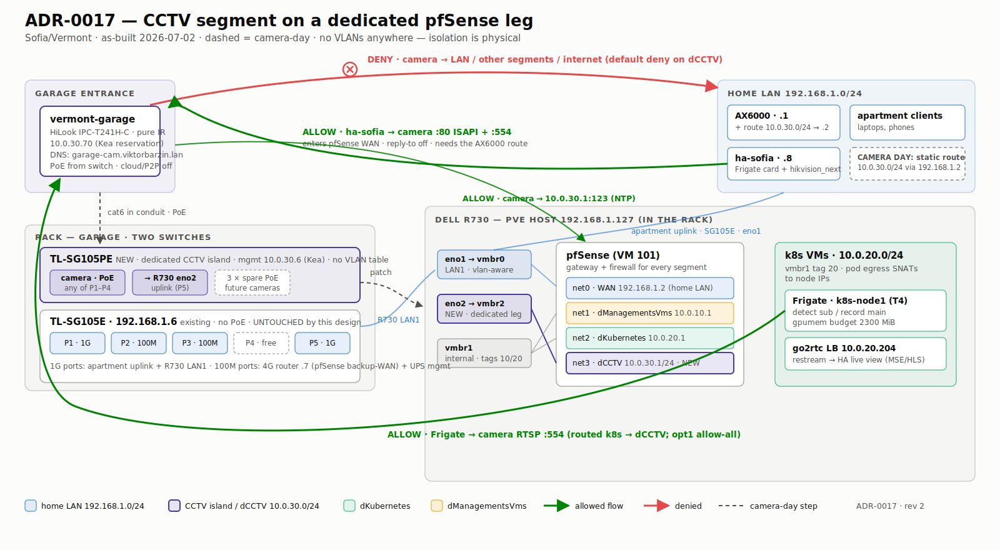

# CCTV segment: dedicated pfSense interface, VLAN-30 trunk on the LAN1 cable

Status: accepted (2026-07-02, rev 3 — single-switch)



The first owned camera at the Sofia/Vermont site (`vermont-garage`, HiLook
IPC-T241H-C at the garage entrance) needs to be network-isolated: its cable is
physically exposed outside the apartment, so anything plugged into that cable
must land in a segment that can reach nothing. The original design doc
(NAS: `Emo shared/Claude shared/garage-camera/`) called for an "802.1Q trunk
to pfSense" — but nothing in this network terminates dot1q on pfSense; the
site idiom is one vlan-aware Proxmox bridge → one tagged VM NIC → one clean
untagged pfSense interface per segment.

**Decision (rev 3):** ONE switch — the new TL-SG105PE **replaces** the old
garage TL-SG105E (Viktor prefers not running two switches; retired unit
becomes a cold spare, its 192.168.1.6 mgmt IP passes to the PE). Five ports,
all used: apartment uplink, 4G router 192.168.1.7, UPS mgmt (all untagged
VLAN 1), the camera (untagged VLAN 30, PoE), and the **trunk to R730 `eno1`
carrying home LAN untagged + CCTV tagged 30** over the existing LAN1 cable.
pfSense `net3` (vtnet3) sits on `vmbr0` with `tag=30` — exactly the site
idiom used for dManagementsVms/dKubernetes (bridge-level tag → clean untagged
vNIC; pfSense still terminates no dot1q itself). The earlier dedicated
`eno2`/`vmbr2` leg is kept **dormant as a fallback** (rev 2 wired it; moving
net3 back to vmbr2 restores pure physical isolation in one `qm set`).
This narrows the earlier 802.1Q objection rather than contradicting it: the
rejection assumed *unmanaged* switches, where any LAN device could inject
tagged frames; with the managed PE as the only device on eno1, VLAN-30
membership is {camera port, trunk port} only, so tag-30 ingress from every
other port — and from the exposed camera cable — is dropped or contained.
Cameras are untrusted: default-deny on dCCTV with a single
NTP-to-gateway exception; Frigate (k8s) pulls RTSP in; ha-sofia (192.168.1.8)
may reach ISAPI/RTSP directly; home-LAN clients route in via an AX6000 static
route (10.0.30.0/24 via 192.168.1.2). 10.0.30.0/24 is deliberately NOT in the
10.0.20.0/22 trusted source-IP allowlist.

## Traffic on the trunk — how one cable carries two networks

The LAN1 cable is shared, but the two networks on it diverge at `vmbr0`
(the vlan-aware bridge on the PVE host), and only ONE of them ever touches
pfSense:

- **Untagged (VLAN 1, home LAN)** is plain L2 bridging: vmbr0 switches it
  between the trunk, the host's own IP (192.168.1.127) and pfSense `net0` —
  where pfSense sits as an ordinary LAN *client* (WAN 192.168.1.2). The home
  LAN's gateway is and remains the AX6000; home-LAN traffic never transits
  pfSense. Consequently a pfSense (or R730 VM-level) outage does not affect
  the home LAN, and the apartment ↔ 4G-router ↔ UPS paths don't even leave
  the switch (P1/P2/P3 bridge internally), so out-of-band recovery via the
  4G router survives the whole rack being down.
- **Tagged 30 (CCTV)** has exactly one possible landing: vmbr0 delivers
  VID 30 only to pfSense `net3` (dCCTV, 10.0.30.1), which is the camera
  segment's gateway, firewall and sole exit. "Camera → AX6000 → internet"
  is impossible by construction, not merely by firewall rule.
- pfSense forwards *upstream* only its own segments (10.0.10/20/30), NATed
  out of its WAN toward the AX6000. Load-wise the trunk gained only the
  camera's ~8 Mbps — it already carried all rack-bound home-LAN traffic.

```text
 INTERNET ── AX6000 192.168.1.1 (home GW; camera-day route 10.0.30.0/24 → .2)
                │
                │ apartment uplink · V1 untagged
 ┌──────────────┴───────────────────────────────┐    ┌────────────────────┐
 │ TL-SG105PE (mgmt 192.168.1.6)                │    │ vermont-garage     │
 │ P1 apartment · P2 4G .7 · P3 UPS  [VLAN 1]   │◄───┤ HiLook, pure IR    │
 │ P4 camera PoE [VLAN 30]                      │cat6│ 10.0.30.70 (Kea)   │
 │ P5 TRUNK: V1 untagged + V30 tagged           │    └────────────────────┘
 └──────────────┬───────────────────────────────┘
                │ ONE cable (existing LAN1 run)
 ┌──────────────┴───────────────────────────────────────────────┐
 │ R730 · eno1 → vmbr0 (vlan-aware)                              │
 │   ├─ untagged → host .127 + pfSense net0 WAN 192.168.1.2      │
 │   └─ tag 30  → pfSense net3 dCCTV 10.0.30.1/24 (camera GW)    │
 │ eno2 → vmbr2: dormant fallback leg                            │
 │ vmbr1: tag 10 → dManagementsVms · tag 20 → dKubernetes (k8s,  │
 │        Frigate on node1, go2rtc LB 10.0.20.204 → HA live)     │
 └───────────────────────────────────────────────────────────────┘

 Frigate 10.0.20.x ─RTSP :554─► camera · ha-sofia .8 ─:80+:554─► camera
 camera ─NTP :123─► 10.0.30.1 · camera → anything else = DENY
```

## Considered options

- **802.1Q over the LAN path behind an UNMANAGED switch** (the original plan
  read this way) — rejected: any LAN device could inject tagged frames into
  vmbr0 (`bridge-vids 2-4094`) and tag-passing through a dumb switch is
  undefined. Rev 3 adopts the tagged path ONLY because the managed PE now
  polices VLAN-30 membership at the single entry point to eno1; no bridge
  reconfiguration was needed (vmbr0 was already vlan-aware).
- **Dedicated physical leg (eno2 → vmbr2 → net3), one switch per role**
  (rev 1/2 as-built) — superseded by rev 3: it forced either a second switch
  (6 connections vs 5 ports once the PE also replaced the old switch) or new
  hardware. Strongest isolation of all options; kept dormant as the fallback.
- **AX6000 as the camera gateway** — rejected earlier in the design (consumer
  router, no inter-VLAN firewall).

## Consequences

- The switch is now single-point and load-bearing for everything in the rack
  (apartment uplink, pfSense backup-WAN via 4G, UPS mgmt, CCTV) AND its VLAN
  table + mgmt password are part of the isolation boundary — the Easy Smart
  mgmt UI answers on every port, so the password is the gate between a
  compromised camera and the switch config. All 5 ports are consumed: the
  next camera forces an 8-port PoE upgrade (the wiring plan already fits it).
- `eno2`/`vmbr2` stay cabled-ready but dormant (fallback to rev 2's physical
  leg); eno3/eno4 remain free.
- The old TL-SG105E is retired to cold spare; the PE inherits 192.168.1.6
  (Kea reservation by MAC).
- Revision history (all 2026-07-02): rev 1 assumed one shared PE with a
  port-VLAN split (conflated the two devices); rev 2 split into two switches
  after inspecting 192.168.1.6 (old non-PoE SG105E, 4/5 ports used); rev 3
  consolidated back to one switch — the PE replacing the SG105E — per
  Viktor's preference, moving CCTV onto a managed tagged trunk.
- Frigate's ADR-0016 VRAM budget was bumped 2000 → 2300 MiB for the extra
  NVDEC stream.
