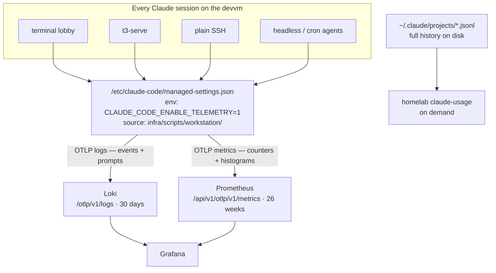

# Claude Code already emits telemetry — we turn it on rather than build one

We can see how the terminal lobby is used (terminal-lobby ADR-0006) and how it
performs (ADR-0008), but not how **Claude itself** is used on this box: what it
costs, which tools carry the work, where sessions stall, and what people
actually ask for.

The starting assumption was that this needed building — hooks, transcript
parsing, or a tailer daemon. It does not. Claude Code ships first-class
OpenTelemetry export, and this box already runs both backends it needs.

```stats
1359 | transcripts on disk today
1.2 GB | of session history
20 | native metrics Claude already emits
1 | env block to enable collection
1 | Prometheus flag to add
0 | new services
```

## What Claude Code already provides

Verified against the installed binary
(`@anthropic-ai/claude-code`, `bin/claude.exe`) rather than from documentation:

| Capability | Evidence |
|---|---|
| Telemetry switch | `CLAUDE_CODE_ENABLE_TELEMETRY` |
| OTLP exporters, per signal | `OTEL_EXPORTER_OTLP_{LOGS,METRICS}_{ENDPOINT,PROTOCOL,HEADERS}` |
| Metrics | `claude_code.token.usage`, `.cost.usage`, `.tool.execution`, `.tool.blocked_on_user`, `.code_edit_tool.decision`, `.bash.subprocess`, `.mcp.rpc`, `.subagent.spawn`, `.hook`, `.llm_request`, `.session.count`, `.active_time.total`, `.compaction`, `.lines_of_code.count`, `.commit.count`, `.pull_request.count` |
| Events (logs) | `user_prompt`, `tool_result`, `tool_decision`, `api_request`, `api_error`, `subagent_launch`, `subagent_complete`, `compaction`, `session_start` |
| Prompt-content switch | `OTEL_LOG_USER_PROMPTS` (default off — records `prompt_length` only) |
| Dimension controls | `OTEL_METRICS_INCLUDE_{SESSION_ID,ENTRYPOINT,VERSION,ACCOUNT_UUID}` |
| Export tuning | `OTEL_LOGS_EXPORT_INTERVAL`, `OTEL_METRIC_EXPORT_INTERVAL` |

Every question this ADR set out to answer maps onto a signal already emitted.

## Decisions

| Question | Decision |
|---|---|
| What to answer | Cost and efficiency, tool and workflow patterns, session shape and friction, and what people ask for |
| Collection | Continuous, for every Claude on the box |
| Mechanism | Native OTel export, enabled by an `env` block in the org-wide managed settings |
| Scope | Every surface — lobby, t3-serve, SSH, headless, cron. No tmux gate |
| Logs | OTLP → Loki's native `/otlp/v1/logs` (already live) |
| Metrics | OTLP → Prometheus, behind `--enable-feature=otlp-write-receiver` |
| Prompt content | Recorded verbatim (`OTEL_LOG_USER_PROMPTS=1`), no interposer |
| History | Loki takes the last 7 days it will accept; the full corpus is analysed on demand |
| Analysis | `homelab claude-usage`, over transcripts on disk, both users, `--user` to filter |

## Architecture



Two paths, deliberately different in what they are for. The streaming path
answers "what is happening now" within Loki's 30 days and Prometheus's 26
weeks. The on-demand path answers "how do we work" over everything on disk,
with no retention ceiling.

## Why not the alternatives

- **Hooks writing our own events.** The org-wide settings already run seven
  hook events per session, and `claude-tmux-state` proves a hook can reach
  Loki. It would work, and it would mean writing and maintaining an extractor
  that duplicates instrumentation Claude already ships. It also puts our code
  in the turn's critical path.
- **A transcript-tailing daemon.** Off the critical path and easy to backfill,
  but it is a resident process and it needs read access across every user's
  home directory. terminal-lobby ADR-0006 chose not to add a service for
  telemetry; that reasoning still holds, and native export removes the need.
- **A local scrubbing collector.** Considered for redacting secrets from
  prompts. Rejected here: it reintroduces the resident process the design
  avoids, and a regex pass over prompt text can mangle legitimate content.

## Prometheus needs one flag, not an upgrade

Measured on the running deployment: Prometheus **v2.48.1**, 26-week retention,
`--web.enable-remote-write-receiver` already set. The OTLP receiver is
available in this version as an experimental feature, so the change is adding
`otlp-write-receiver` to `--enable-feature`, not a version upgrade:

```
--enable-feature=otlp-write-receiver
```

Loki needs nothing: `POST /otlp/v1/logs` already answers on the running
instance.

> [!IMPORTANT]
> **Session id must stay out of the metric dimensions.** Leave
> `OTEL_METRICS_INCLUDE_SESSION_ID` unset. A session id as a Prometheus label
> mints a new time series per session and would grow unbounded — the same
> class of mistake ADR-0006 avoided when it kept every attribute out of Loki's
> labels to protect the 5000-stream cap. Session-level detail belongs on the
> events, which carry it inside the line.

## What is recorded, and the exposure that comes with it

Metrics carry counts, durations, token and cost figures, tool names and
decisions. Events carry the same plus session context — and, with
`OTEL_LOG_USER_PROMPTS=1`, the text of what was typed.

This is a deliberate change from the boundary terminal-lobby ADR-0006 and
ADR-0008 set, and it is worth stating precisely rather than leaving implied:

- Prompt text reaches Loki verbatim. Anything pasted into a prompt — a token,
  a password, a file's contents, personal or financial detail — is recorded
  with it. No redaction runs, by decision.
- Loki here is a single anonymous tenant with no per-user access control, so a
  record is readable by anyone with Grafana access, not only its author.
- Collection covers both users on the box, not only the person who enabled it.
- Reading a transcript while investigating and durably indexing it into a
  shared queryable store are different acts; this ADR chooses the second.

Retention bounds the exposure: 30 days in Loki, and prompts are not sent to
Prometheus at all.

The terminal-lobby settings toggle currently reads "Never terminal contents or
what you type." That statement stops being true here, so its wording is
corrected as part of this change — a UI that misdescribes what is collected is
a defect independent of the policy it describes.

## The on-demand analysis

`homelab claude-usage` reads `~/.claude/projects/*.jsonl` directly, so it is
bounded by disk rather than by retention — today 1359 transcripts and 1.2 GB,
against Loki's rolling 30 days.

```
homelab claude-usage [--since 90d] [--user wizard|emo|all] [--publish]
```

It covers both users by default because the comparison carries the insight:
emo averages roughly 4.5 MB per session against wizard's 0.65 MB — far fewer,
much longer sessions — which is visible only when both are in view. `--user`
narrows it.

Reported: token and cost totals by user, project and model; cache-read ratio;
tool mix and failure rates; calls and iterations per turn; session length and
turn latency; compactions and cancellations; permission-mode usage; and the
task shapes people bring to Claude.

## Constraints inherited

- **Loki**: 30-day retention; `reject_old_samples` with a **1-week** ceiling,
  so history older than a week cannot be ingested at all; `max_line_size`
  **256 KB**, which a long pasted prompt could exceed.
- **Prometheus**: 26-week retention, 180 GB cap. Cardinality is the thing to
  watch, per the note above.
- **Zero new cost**: both backends already run; this adds no service and no
  spend.

## Rollout

Two deliverables of quite different size, sequenced so the first starts
collecting while the second is written. Collection is time-sensitive in a way
the analysis is not: every day it is off is a day of data that cannot be
recovered, since Loki refuses anything older than a week.

**Phase 1 — turn collection on** (configuration only, no code):

1. Add `otlp-write-receiver` to the Prometheus feature flags in the monitoring
   stack; CI applies it on push.
2. Add the `env` block to `infra/scripts/workstation/managed-settings.json` and
   run `setup-devvm.sh` to install it.
3. Verify a real session emits: metrics visible in Prometheus, events queryable
   in Loki, both attributed to the right user.
4. Correct the terminal-lobby settings-toggle wording, which no longer matches
   what is collected.
5. Add a *Claude Usage* dashboard.

**Phase 2 — the analysis command** (a build, planned separately):

6. `homelab claude-usage` over the full corpus, with the report shape settled
   against what phase 1 shows is actually worth reporting.

## Exploring it

Every query below was run against live Loki before being written down.

> [!IMPORTANT]
> **`|=` does not search prompts.** It is a line filter, and the log line body
> is only the event name (`claude_code.user_prompt`). The prompt, response,
> session id and every other field are *structured metadata*, so they need a
> label filter: `| prompt =~ ".*thing.*"`, not `|= "thing"`. The `|=` form
> returns nothing and looks like an absence of data rather than the wrong
> operator.

```logql
# everything, newest first
{service_name="claude-code"}

# just the prompts
{service_name="claude-code"} | event_name = "user_prompt"

# one person
{service_name="claude-code"} | os_user = "emo"

# search prompt TEXT (label filter, not |=)
{service_name="claude-code"} | event_name = "user_prompt" | prompt =~ ".*deploy.*"

# replay one session end to end
{service_name="claude-code"} | session_id = "<uuid>"

# what Claude answered
{service_name="claude-code"} | event_name = "assistant_response"

# errors talking to the API
{service_name="claude-code"} | event_name = "api_error"

# event mix over time
sum by (event_name) (count_over_time({service_name="claude-code"}[$__interval]))

# prompts per person
sum by (os_user) (count_over_time(
  {service_name="claude-code"} | event_name = "user_prompt" [$__interval]))
```

Metrics live in Prometheus rather than Loki, and are queried normally:
`claude_code_token_usage_tokens_total`, `claude_code_cost_usage_USD_total`,
`claude_code_session_count_total`, `claude_code_active_time_seconds_total` —
each labelled `os_user`, and tokens additionally by `type` and `model`.

## Two things only a live session revealed

Both were found by running a real Claude session as `emo` after the
configuration was in place, and neither is visible from the config alone.

**Attribution is by Anthropic account, not OS user.** The events carry
`user_email` and a hashed `user_id` identifying the *account*, which is the
same for everyone on this box — a session run as `emo` arrived labelled
`viktorbarzin@meta.com`. That defeats the comparison this telemetry exists for.
Only the shell knows the OS user, and measured on the box, the managed
settings' `env` block **overrides** the shell environment, so a per-user value
is ignored while the shared file also sets the variable. `OTEL_RESOURCE_ATTRIBUTES`
therefore lives in a per-user `/etc/profile.d/26-claude-otel-attrs.sh` instead,
mirroring how the per-user setup-token is already loaded — including the
`/etc/zsh/zshenv` hook, because Debian's zsh `zprofile` does not source
`/etc/profile`. Sessions started outside a login shell (systemd units, cron)
will not pick it up and report without `os.user`.

**Prometheus accepts cumulative temporality only.** Claude Code exports delta
by default. The endpoint answered `200` and Prometheus discarded every metric
with `invalid temporality and type combination`, logged on its side and
invisible to the sender — the shape of failure where everything looks healthy
and no data appears. `OTEL_EXPORTER_OTLP_METRICS_TEMPORALITY_PREFERENCE=cumulative`
resolves it.

> [!NOTE]
> Loki's OTLP ingest promotes only `service_name` and `deployment_environment`
> to index labels; everything else — `session_id`, `prompt`, `response`,
> `message_uuid` — becomes structured metadata, which is not indexed and
> creates no streams. The query API merges structured metadata into the
> `stream` object when displaying results, which makes it look as though every
> attribute were a label. It is not: the whole channel is **one** stream.
> Worth knowing before concluding that this design threatens the
> 5000-stream cap, as a first reading of a query result suggests.

## Open questions

- Export interval is unset, so the defaults apply. Whether they are frequent
  enough to be useful, or frequent enough to be noisy, is untested.
- Whether a long prompt actually exceeds Loki's 256 KB line cap in practice,
  and what Claude's exporter does when a record is rejected, has not been
  observed.
- Cost figures come from Claude's own accounting. How they relate to the
  subscription rather than per-token API pricing is not yet established.
- The metric and event names are read from the installed binary. They are not
  a documented contract and may change between Claude Code versions; a rename
  would silently empty a panel.
