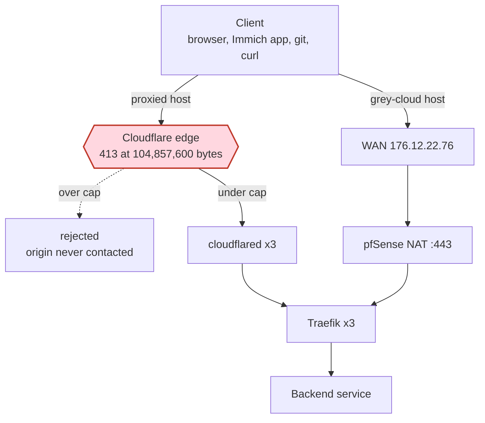

# ADR-0026: The Cloudflare 100 MiB upload cap is not solvable at the Traefik layer

- Status: accepted
- Date: 2026-09-03
- Supersedes in part: the upload half of the 2026-05-30 decision recorded in memory #3313
- Related: ADR-0021 (wildcard DNS consolidation), memory #8163 (immich stays non-proxied)

## Context

Cloudflare rejects any proxied request whose body exceeds a plan-dependent size.
The idea examined here was to chunk large uploads at the Traefik layer so that the
change would be invisible to the backend services, letting hosts that currently
bypass Cloudflare move onto the proxied path.

Measured on zone `fd2c5dd4efe8fe38958944e74d0ced6d` on 2026-09-03:

| request | result |
|---|---|
| 104,857,600 bytes, `Content-Length` set | passes the edge, reaches the origin |
| 104,857,601 bytes | `HTTP/2 413`, `server: cloudflare` |
| 120 MB with `Content-Length` | 413 in 0.136s after 1,441,792 bytes sent, zero Traefik log lines |
| 120 MB with `Transfer-Encoding: chunked` | edge accepts 105,637,584 bytes over 5.76s, then 413. Partial body reaches the origin |
| 291,170-byte gzip body decoding to 300,000,000 | passes. The cap counts wire bytes |
| 120 MB `PUT` | 413, identical to `POST` |

The documented table is Free 100 MB, Pro 100 MB, Business 200 MB, Enterprise 500+ MB.
The measured threshold is 104,857,600 bytes, so "100 MB" means 100 MiB and the check
is inclusive. Cloudflare states on its proxy-status page that these limits "cannot be
bypassed while traffic is proxied", and its 413 troubleshooting page lists three
remedies: chunk the request, set the record to DNS-only, or upgrade the plan.

## The architectural constraint

cloudflared originates at `https://traefik.traefik.svc.cluster.local:443`, so Traefik
sits two hops downstream of the enforcement point. An over-cap request produces no
Traefik access-log line, no middleware invocation and no plugin call. Confirmed by
querying Loki for the probe paths: zero lines for the rejected requests, while every
under-cap probe logged normally.

That leaves three places a large upload can be split, and only one of them reaches
every client:

| where the split happens | reaches native apps | requires app support |
|---|---|---|
| The application's own upload code | yes | yes |
| A script injected into browser pages | no | no |
| Traefik | not applicable, never sees the request | not applicable |

A Yaegi middleware can in fact hold state across requests and reassemble chunks. This
was proven under yaegi v0.16.1, the interpreter Traefik v3.7.1 embeds: three 1000-byte
POSTs became one 3000-byte upstream request. It does not help here for two separate
reasons. The client still has to split, and our Traefik runs 3 replicas with
`sessionAffinity: None` behind a ClusterIP, so consecutive chunks land on random pods.

Browser-side interception was also built and measured. A page-injected monkey-patch of
`XMLHttpRequest.prototype.send` intercepted a 64 MiB upload, stream-read it holding a
peak of 8 MiB, split it into 8 pieces and returned one synthetic 200. A service worker
doing the same work produced zero `xhr.upload.onprogress` events across two runs on
Chrome 148, because the original body is cancelled once `respondWith` resolves
(w3c/ServiceWorker#1141 shows the same in Firefox). Neither approach reaches a native
client, and Immich's mobile app is Flutter using `background_downloader`.

## Measured demand

Cloudflare GraphQL `httpRequests1dGroups` for 2026-08-21 to 2026-09-03: **20 edge 413s
across 896,700 proxied requests**. Fourteen were this investigation's own probes. The
remaining six were on `gw.viktorbarzin.me` and include GET requests, so they are origin
413s passing through rather than cap hits. Zero organic cap hits in the window.

A cap 413 never reaches Traefik, so the Cloudflare GraphQL API is the only instrument
that can count them. Traefik and Loki are structurally blind to this failure.

## What the cap actually costs us

Of the 17 stacks setting `dns_type = "non-proxied"`, two cite the upload cap as the
reason (immich, forgejo). The other 15 are non-proxied because of `auth = "app"` on
bearer-token APIs that forward-auth breaks, Anubis proof-of-work fronting, OAuth
callbacks, anonymous share links, or machine-driven API calls. A transparent chunker,
if one could exist, would move 2 of 17 hosts.

Nextcloud is the counter-example that shows the working shape: it is proxied today and
does not 413, because its own clients chunk. Immich has upstream PR #22385
(`feat(server): resumable uploads`, IETF RUFH) whose stated goals include handling
request size limits of proxies. When that ships in a release we run, moving Immich onto
the proxied path becomes a `dns_type` change and a route.

Cloudflare's content restriction moved out of ToS §2.8 into the Service-Specific Terms
CDN clause, last updated 2026-06-02. It reserves Cloudflare's right to limit CDN access
where a customer serves "video or a disproportionate percentage of pictures, audio
files, or other large files" without their paid services. A personal photo library sits
inside that description, so the policy question memory #8163 raised is unchanged.

## Decision

Do not build chunking or reassembly at the Traefik layer, or anywhere else in our
infrastructure. Adopt the application's own resumable upload protocol where one exists,
and keep hosts that need uncapped uploads on `dns_type = "non-proxied"` until it does.

## Consequences

- Immich and Forgejo stay non-proxied. Both are already uncapped on that path, so no
  current workflow is blocked.
- The WAN IP stays in public DNS for those hosts. CrowdSec has covered both the proxied
  and direct paths equally since 2026-08-18, so what is given up is Cloudflare's managed
  DDoS and Bot Fight rather than all protection.
- Reachability of non-proxied hosts continues to depend on the client's DNS and NAT
  hairpin path, the failure mode recorded in memory #10070.
- Matrix media stays capped at 50 MiB by `TUWUNEL_MAX_REQUEST_SIZE=52428800`. The Matrix
  client-server API has no chunking, so this is an application limit rather than an edge one.
- Getting the WAN IP out of public DNS is mostly a separate problem. It is the 15
  auth-grey hosts, not the upload cap, and it is tracked as its own piece of work.

## Open items not taken up

These were surfaced by the investigation and deliberately left alone on 2026-09-03:

- `files.chunked_upload.max_size = 99000000` exists on the live Nextcloud pod and not in
  `stacks/nextcloud`. The upstream default is 104,857,600, which passes only because the
  cap is inclusive, and the desktop client raises its chunk size dynamically on a fast
  uplink.
- The zone's Maximum Upload Size is a Network-page setting outside Terraform. It can only
  be lowered, and a lowered value would break proxied uploads with no repository trace.
- `DisableResponseBuffer` is not exposed on Traefik's Middleware CRD, so live buffering
  middlewares also buffer responses over 1 MiB to a temp file, and oxy's buffer writer
  has no `Flush`.

## What we could not verify

- Whether the cap applies to Cloudflare WARP private-network routes. Cloudflare documents
  only that the large-file terms restriction does not apply there; the body-cap exemption
  is inference from the L4 nature of the path.
- Whether a transfer above 100 MiB survives a proxied WebSocket. Cloudflare documents no
  body cap for WebSockets and counts a connection as one long-lived request, but this was
  not tested.
- HTTP/3 behaviour at the cap. The devvm's curl has no HTTP/3 support.
- Whether cloudflared imposes its own body limit between the edge and Traefik.
- Tailnet reachability and throughput to 10.0.20.203 from a roaming client.
