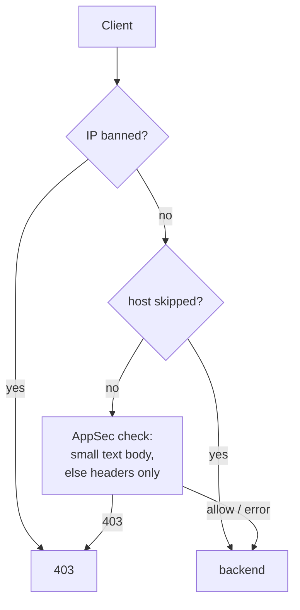
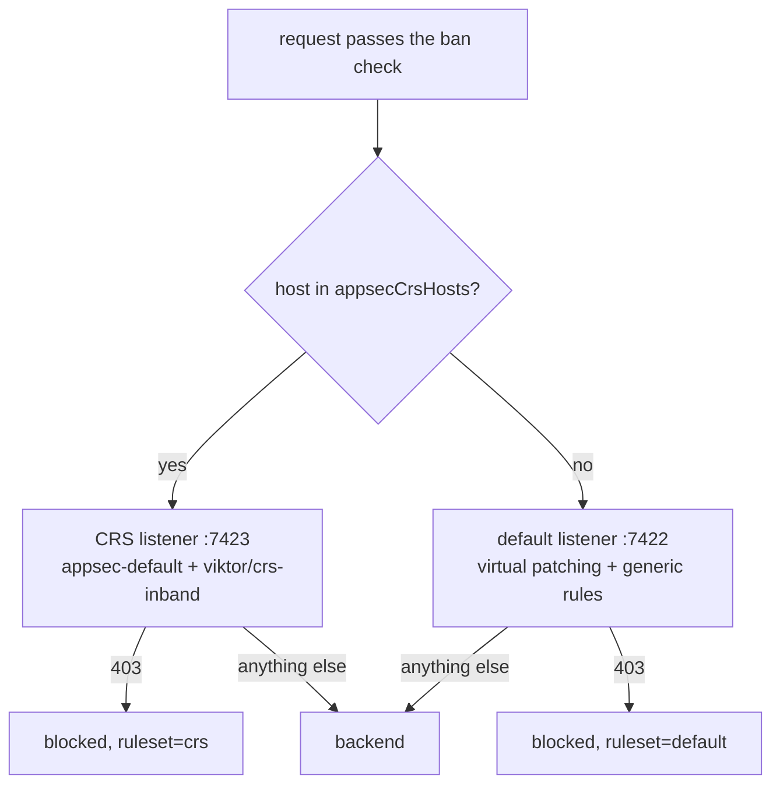

# ADR-0027: CrowdSec AppSec runs inside our Traefik bouncer, and never reads an upload

- Status: accepted
- Date: 2026-10-02
- Supersedes: the 2026-09-16 decision recorded in memory #13252 ("do not adopt CrowdSec AppSec on Traefik")
- Related: ADR-0026 (Cloudflare 100 MiB upload cap), `docs/architecture/security.md` (CrowdSec section)

## Context

Until now CrowdSec on HTTP has worked from logs: the agents read Traefik's access
log, scenarios notice abusive behaviour, and the bouncer plugin on the `websecure`
entrypoint returns 403 to banned addresses. It does that well (verified
2026-10-02: a scanner got its last 200 at 23:53:00 and 315 consecutive 403s after
that). What it does not do is look at a request before it reaches the backend, so
the first exploit attempt from a fresh address always arrives. Nothing else in the
stack inspects request content either, and the Cloudflare edge cannot be relied on
for it, because pfSense forwards WAN :443 straight to Traefik.

CrowdSec's AppSec component is the inspection engine CrowdSec ships for this. The
2026-09-16 review rejected it because the stock Traefik bouncer
(`maxlerebourg/crowdsec-bouncer-traefik-plugin`) reads up to 10 MB of every request
body into memory before calling the backend (`appsecQuery`, `io.ReadAll` over an
`io.LimitReader`, about three copies). The hosts without Cloudflare in front of
them are exactly the ones that move large bodies (Immich, Forgejo, Stremio), and an
earlier setup that held Immich uploads at the ingress before passing them on caused
doubled upload time and failed uploads whenever the ingress restarted.

## Decision

AppSec inspection is added to our own bouncer plugin
(`stacks/traefik/modules/traefik/crowdsec-bouncer-plugin/`), with a body policy
under which an upload body is never read.

- **Body policy.** The body goes to AppSec only when Go's parsed
  `req.ContentLength` is between 1 and 65,536 bytes, the request has no
  `Content-Encoding` (or `identity`), and the media type is
  `application/x-www-form-urlencoded`, `application/json`, `*+json`,
  `application/xml`, `text/xml` or `*+xml`. Any other request, including every
  multipart, chunked, octet-stream, compressed or larger upload, is checked on
  method, URI and headers only, and its body is passed to the backend untouched.
  An inspected body is read through a limit as bytes arrive, never pre-allocated
  from the declared length.
- **Opt-out.** `appsecSkipHosts` lists hosts that skip AppSec but keep ban
  enforcement. At launch it holds `immich.viktorbarzin.me`. The existing
  `skipHosts` (the two Authentik hosts) skip the whole plugin, AppSec included.
- **Enforcement.** Blocking from the first day. Only an AppSec `403` blocks;
  `200` allows, and `401`, `500`, timeouts and connection errors fail open.
- **Failure handling.** Each check has a 200 ms deadline. A circuit breaker shared
  by every middleware instance (package level, because Traefik rebuilds
  middlewares on every config reload, about 285 times an hour) stops calling
  AppSec for 30 s when at least half of the last 20 checks failed. Only breaker
  state changes are logged.
- **Kill switch.** `appsecEnabled` on the Middleware. Turning it off is a dynamic
  config reload; no Traefik pod restarts.
- **AppSec itself.** The crowdsec chart's `appsec` Deployment: 2 replicas spread
  across nodes, rolling updates, a PodDisruptionBudget of 1, explicit resources,
  the chart PodMonitor, and the trusted-IP whitelist mounted so its ban scenario
  never bans our own addresses. Rules are `crowdsecurity/appsec-virtual-patching`
  and `crowdsecurity/appsec-generic-rules`, in-band. The OWASP core rule set is
  not loaded.
- **Bans.** The collections' `appsec-vpatch` scenario is on from the first day.
  It bans an address for 4h, on every host, when two distinct rules match it
  within 60 s; a single rule hit is a single 403.
- **Trusted addresses** (home, London, the Meta corp ranges) are inspected like
  everyone else. They cannot be banned by AppSec, but a false positive still
  returns a 403 on that request.

## Considered options

| option | why not |
|---|---|
| Stock maxlerebourg plugin | Buffers up to 10 MB per request before the backend sees it, the behaviour behind the Immich incident. Setting its body limit to 0 disables body inspection entirely |
| Coraza as a Traefik WASM plugin | The same rule engine, as a second system with its own state. Reported memory and latency problems inside Traefik |
| Cloudflare managed rules | Only see proxied traffic; the direct :443 path skips them |
| Per-ingress middleware through `ingress_factory` | Fans out across about 128 stacks, and lock-contended stacks are skipped during apply. The entrypoint attachment plus a host list covers the catchall and hand-rolled ingresses too |
| A 7-day log-only phase | Offered and declined. A replay of the last 7 days of unique real request lines runs before blocking instead. 30 days was tried: the September crawl left 845k lines a day and two days alone held 470k unique requests, too many to replay in useful time |

## Consequences

- Body inspection is narrow on purpose. A payload inside a multipart upload, a
  chunked body or a gzip body is not inspected. URI, query and header inspection
  covers every request.
- Every non-skipped request makes one in-cluster HTTP call before reaching its
  backend. The `Overhead` field of the Traefik access log (total time minus
  backend time) measures it; it was about 4-5 ms before this change.
- The pre-launch replay (2026-10-02) sent the 782,025 unique method, host and
  URI combinations from 2026-09-25 to 2026-10-02 to AppSec; 407,413 were on
  inspected hosts. It blocked 20,461, and every block was a probe or an exploit
  attempt (`.env`, `.git`, `.svn`, WordPress webshells, PHP-CGI, ProxyShell,
  Jira); 933 of them were on real services. No false positive was found.
- The replay covers method, path and query only. The access log keeps
  no bodies, cookies or authorisation headers, so false positives in JSON or form
  bodies can first appear in production.
- Forgejo's ingress carries an `ingress_factory` Buffering middleware
  (`max_body_size = "5g"`), which already writes request bodies over 1 MiB to a
  temporary file on the Traefik pod. That predates this ADR, is unrelated to
  AppSec, and is left as it is.
- A plugin that fails to load under Yaegi disables every Traefik plugin on that
  pod. The plugin change is gated by `scripts/yaegi-plugin-gate` and ships dark
  (`appsecEnabled = false`) before AppSec is switched on.

## Addendum (2026-10-02, same day): core rule set on hosts without Authentik, and CAPI

Two changes followed once the first rollout was stable.

**OWASP core rule set (CRS) in ban mode on public hosts without Authentik.**
On those hosts the app's own login is the only gate, so they get the stronger
rule set; Authentik-gated hosts keep virtual patching, because anonymous
traffic cannot reach the app, and logged-in traffic is where CRS false
positives are most likely.

- The same AppSec pods serve a second listener with the CRS
  (`crowdsecurity/crs` behind a small `viktor/crs-setup` rule file). The
  bouncer picks the listener per host; each listener has its own breaker.
- `appsecCrsHosts` is computed at plan time in
  `stacks/traefik/modules/traefik/crs-hosts.tf` from the live Ingresses: a host
  qualifies when none of its Ingresses carries Authentik forward-auth, it is not
  LAN-only (`home-lans-only`, `traefik-local-only`, `.lan`), and it is not on
  the exclusion list. 36 hosts on go-live, 35 after pages-publish was excluded. IngressRoute hosts stay on the
  default listener.
- Hosts whose normal content looks like attack payloads are excluded, with the
  reason next to each: Forgejo (file paths and code search), Vault (arbitrary
  secret values), and the free-text hosts (claude-memory, Matrix, n8n,
  webhook, ntfy, novelapp, AFFiNE, dolt-workbench, Linkwarden, Tandoor,
  recruiter-responder, json, and the pages-publish API, whose bodies are whole
  documents).
- CRS defaults were widened where they rejected normal traffic: the method list
  (911100) now includes PUT, PATCH, DELETE and WebDAV verbs, and the version
  list (920430) includes HTTP/3. Three path exclusions: Vaultwarden `/icons/`,
  Home Assistant `/api/camera_proxy`, and Woodpecker's signed webhook
  `ci.viktorbarzin.me/api/hook`.
- Bans: more than 3 CRS blocks from one address in 30s bans it (`appsec-native`).
  The trusted-IP whitelist applies, as for virtual patching.

Evidence: a replay of 322,883 unique requests from a week of traffic on the
then-52 qualifying hosts, with realistic request bodies added. Before the
exclusions it blocked 6,238; 4,620 of those were Forgejo, and the rest were
probes apart from the two excluded paths.

What the replay did not show, and production did in the first hour:

- Every HTTP/3 request was blocked, because the replay sent HTTP/1.1 only. Home
  Assistant's iOS app and Shortcuts hit it first. Fixed by the version list
  above.
- The OTLP telemetry hosts counted as public because the filter did not yet
  recognise `traefik-local-only`; CRS rejected their protobuf content type.
- GitHub's push webhooks to Woodpecker (`ci.viktorbarzin.me/api/hook`) were
  blocked twice; that host and path is excluded, since Woodpecker verifies
  each hook's signature.

Found the same afternoon, and older than the CRS change: AppSec wrote one LAPI
alert for every blocked request. The replay tests sent their requests to the
live AppSec pods, which wrote 9,250 alerts, and the table reached its 10,000
cap (`db_config.flush.max_items`) at 04:25 UTC. Real traffic adds about 1,000
a day (472 public-address alerts in the 12 hours measured); at that rate it
would have reached the cap in roughly ten days without the replays. The flush
deletes the oldest alerts whatever they hold, and it deleted the 04:00 static blocklist import,
so the Meta and proxy-ASN ranges were not enforced from 04:25 to 16:15 UTC.
They were re-imported by hand, and `viktor/appsec-no-alerts` now cancels the
per-request alert on both listeners. The ban scenarios read events, which
still flow; the bouncer's log lines are the per-request record.

**CAPI community blocklist enforced on HTTP.** The plugin gained
`dryRunOrigins`: decisions from those origins are logged as
`action=dry-run-block origin=<origin>` and not enforced. CAPI ran in dry run
for two hours (15:49 to 17:49 UTC), then moved to enforced. All 13 would-be
blocks in that window were scanners: 11 Tencent Cloud addresses with a fake
iOS 13 user agent, 7 of them following the Anubis honeypot link, and 2
self-declared Palo Alto Networks scans. Every block line now carries `origin=`.

## Where to look when something regresses

| symptom | first check |
|---|---|
| Uploads slow, or arrive twice | `Overhead` on the upload's access-log line; if it approaches the upload time the body was held. Confirm the host or the request type falls outside the body policy |
| 403s on a real app | `[crowdsec-bouncer] action=appsec-block` lines name host, path and status; add the host to `appsecSkipHosts` |
| Someone banned everywhere for 4h | `cscli alerts list -s crowdsecurity/appsec-vpatch` |
| Every site 404 on one Traefik pod after a deploy | "Plugins are disabled" in that pod's log: a Yaegi load failure |
| Requests slower everywhere | `Overhead` p99, `action=appsec-breaker` lines, AppSec pod health |
| 403s on a host without Authentik | `ruleset=crs` on the block line. Fix a path with a narrow exclusion in `viktor/crs-setup` (crowdsec values), or add the host to `appsec_crs_exclude_hosts` in `crs-hosts.tf` |
| Someone blocked who should not be, with `origin=CAPI` | Put `"CAPI"` back in `dryRunOrigins` on the Middleware (dynamic reload), or whitelist the address |
