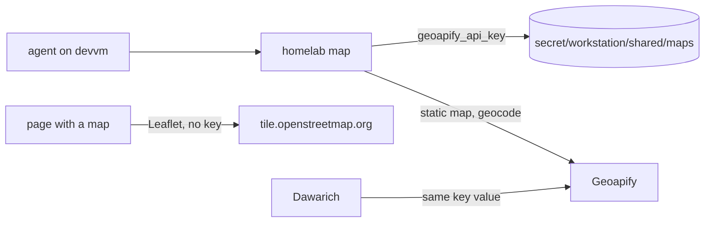

# ADR-0028: Agent maps use the existing Geoapify key, and page maps use keyless OSM tiles

- Status: accepted
- Date: 2026-10-08
- Related: `docs/plans/2026-10-08-homelab-map-verb-design.md` (the verb this decision serves), `cli/cmd_share.go` (`homelab share`)

## Context

Agents on the devvm workstation are often asked for a map: places pinned for a
trip, a route sketched for a chat reply, a layer to open on a phone. Until now
each session worked this out from scratch. The request that started this work
asked to "set up the OSM API key", which led to a check of what exists
(2026-10-08):

- OpenStreetMap has no API key for reading data. Tiles, Nominatim and Overpass
  are keyless and governed by usage policies; an openstreetmap.org account only
  matters for editing the map. There is an account login in the password
  manager, and nothing here needs it.
- A Geoapify key exists in Vault as `geoapify_api_key` in both `secret/viktor`
  and `secret/dawarich`. It is the same value, and Dawarich uses it for reverse
  geocoding. A test static map request returned HTTP 200 with a 400x300 image.
- Geoapify's free plan gives 3,000 credits per day at up to 5 requests per
  second, needs no card, and allows commercial use with attribution. A static map
  costs 1 credit, plus the tile count divided by 4, plus 1 per marker (an 800x600
  map with six markers is 9 credits).
- A Mapbox token sits in the password manager, used by the wrongmove frontend.
- The cluster has no self-hosted tile server or geocoder. OSRM foot and bicycle
  routing covers Greater London only.
- tripit, health and SparkyFitness already render interactive maps with Leaflet
  and keyless `tile.openstreetmap.org` tiles.

## Decision

1. Static map images and geocoding go through Geoapify, using the existing key.
   No new key and no daily cap: expected use is a handful of maps a week, well
   inside the free plan.
2. The key is copied to a new Vault path, `secret/workstation/shared/maps`
   (field `geoapify_api_key`), so every workstation user's agent can read it.
   `secret/viktor` and `secret/dawarich` keep their copies.
3. emo's devvm token gets read access by adding that path to the existing
   `projects-emo` policy in `stacks/vault`. The token carries the policy name and
   Vault evaluates the policy content live, so no token re-mint is needed. wizard
   already reads it through `vault-admin`.
4. Interactive maps embedded in pages use Leaflet with keyless
   `tile.openstreetmap.org` raster tiles and the OSM attribution line. Published
   page snapshots are committed to git, so they carry no key.
5. The openstreetmap.org account and the Mapbox token are left as they are.

## Consequences

- Agents and Dawarich share one 3,000 credit daily budget. A runaway loop in an
  agent could exhaust it and pause Dawarich's reverse geocoding until the next
  day. This was considered and accepted in favour of simplicity; a cap in the
  verb is the follow-up if it ever happens.
- Rotating the key means updating three Vault copies.
- A future workstation user gets map access by having the path added to their
  own devvm token policy, the same step their other secrets need.
- Page maps depend on the OSM tile usage policy, which suits low-traffic pages
  that show attribution. A busy public page would need a different tile source.

## Open questions

- Whether Geoapify credits are counted per key or per account was not verified.
  It only matters if a dedicated key is ever considered for isolation.
