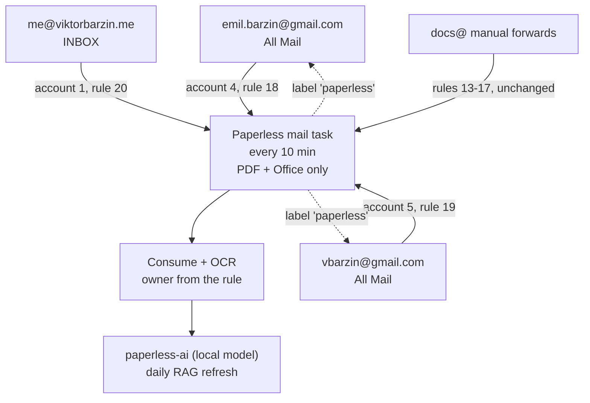

# ADR-0029: Paperless reads each person's mailbox directly for document attachments

- Status: accepted
- Date: 2026-10-09
- Related: `docs/runbooks/paperless-mail-ingest.md` (operations and the rule table), memory #7099 (the `docs@` forward path built 2026-07-03)

## Context

Viktor asked for every email with document attachments, his and Emo's, to land
in Paperless-ngx automatically, so documents can be searched on demand without
anyone forwarding them by hand. The first framing was "send them all to
`docs@viktorbarzin.me`".

What existed on 2026-10-09:

- `docs@` is a real mailbox on the in-cluster docker-mailserver. A Dovecot sieve
  allowlist keeps only mail whose From is one of five family addresses, and
  Paperless rules map that From to a document owner. It is built for manual
  forwards, where the From is the person forwarding.
- Gmail auto-forwarding keeps the original sender in From (a utility company,
  say). Under the current sieve those messages would be discarded, and the
  From-based rules would not match. Gmail's forwarding-confirmation mail would
  be discarded too. Making it work needs the sieve to route on Gmail's
  forwarding envelope (`<user>+caf_=docs=viktorbarzin.me@gmail.com`) into
  per-person folders, a Gmail setting clicked by hand in each account, and a
  Gmail filter per account. Gmail filters also only act on incoming mail, so
  sent mail and old mail would need separate handling.
- Paperless-ngx 3.3.0 (the running version) reads IMAP mailboxes natively. It
  can filter attachments by filename pattern (comma-separated, case-insensitive),
  apply a Gmail label as its "processed" marker when the server advertises
  `X-GM-EXT-1`, and record every message it has looked at in `ProcessedMail`, so
  a message is downloaded once and never again for the same rule.
- Google app passwords already existed for both Gmail accounts:
  `vbarzin@gmail.com` in Vault `secret/recruiter-responder`, and
  `emil.barzin@gmail.com` in Emo's own Vaultwarden. Paperless already polled
  `me@viktorbarzin.me` directly (mail account 1, the utility-bill rules).

Volumes measured over IMAP on 2026-10-09:

| | vbarzin@gmail.com | emil.barzin@gmail.com |
|---|---|---|
| All Mail, messages | 116,751 | 7,777 |
| All Mail, size | 4.71 GB | 4.27 GB |
| Messages with PDF/Office attachments, all time | 987 | 1,314 |
| Same, last 12 months | 107 | 95 |

## Decision

Viktor chose the simplest setup that Paperless supports on its own: Paperless
logs into each mailbox and picks out the documents itself. Nothing forwards.

1. Two new Paperless mail accounts on `imap.gmail.com:993` with the existing app
   passwords: account 4 for `emil.barzin@gmail.com` (owner emo), account 5 for
   `vbarzin@gmail.com` (owner Viktor).
2. One rule per mailbox:
   - rule 18, Emo's `[Gmail]/All Mail`, owner emo
   - rule 19, Viktor's `[Gmail]/All Mail`, owner Viktor
   - rule 20, `INBOX` on the existing `me@` account, owner Viktor
3. All three rules share one shape. They include attachments and inline parts
   (`attachment_type=2`, because Apple Mail marks real PDFs as inline), keep only
   files matching `*.pdf,*.doc,*.docx,*.xls,*.xlsx,*.odt,*.ods`, have no age
   limit (`maximum_age=0`), and apply the Gmail label (or IMAP keyword on `me@`)
   `paperless`. Read state and stars are left alone. Titles come from the
   subject, and paperless-ai fills in correspondent, type and tags afterwards.
4. All Mail covers received, archived and sent mail. Gmail leaves spam and trash
   out of it.
5. Documents get the tag `email-ingest`. Until the first pass has drained, the
   rules also apply `email-backfill` (tag 5227), so the historical batch can be
   reverted with one filter. After that the tag comes off the rules.
6. Content-hash duplicates are rejected across all owners, so a bill sent to
   both Viktor and Emo lands with whichever mailbox Paperless reads first. Viktor
   accepted first-wins.
7. The `docs@` manual-forward path and its rules 13-17 stay as they are, still
   taking every attachment type.
8. `viktorbarzin@meta.com` is out of scope. Manual forwards to `docs@` still work
   for it.
9. No new alerting.

## Consequences

- No sieve change, no Gmail settings to click, no per-account Gmail filter. Each
  mailbox is one Paperless account plus one rule.
- Paperless now holds two Gmail app passwords in its database. Revoking either
  one in the Google account stops that mailbox's ingest. Viktor's is shared with
  recruiter-responder, so rotating it means updating both.
- The first pass downloads every message in each All Mail folder once, about
  9 GB in total. Google documents a 2,500 MB/day IMAP download limit for
  Workspace accounts, with suspensions of 1 to 24 hours. No figure is published
  for consumer Gmail, so whether it applies here is unknown. If it does, the
  pass spreads over a few days, and IMAP on `vbarzin@gmail.com` could pause for
  up to a day, which would also pause recruiter-responder. Viktor accepted this
  over pre-labelling the matching mail and limiting the ongoing rule to recent
  mail.
- The mail task holds a 30-minute lock that it renews after each account. A
  first pass longer than that can overlap with the next scheduled run. Overlap
  costs extra downloads and some duplicate-rejection noise in the task list;
  content-hash dedup keeps documents single.
- Documents are searchable through the Paperless API, the MCP proxy and the
  paperless-ai RAG index (refreshed daily). Emo's documents are enriched by the
  local model only, per the 2026-06-28 decision.

## Alternatives considered

- **Gmail auto-forward to `docs@`.** Picked first, then dropped once it was clear
  Paperless does this natively. It needs envelope-based sieve routing,
  per-account Gmail settings and filters, and separate handling for sent and old
  mail.
- **Pre-label old matching mail and limit the ongoing rule to 7 days.** This
  avoids downloading whole mailboxes and stays under any IMAP cap. Viktor chose
  the single all-time rule for simplicity.
- **Gmail OAuth accounts instead of app passwords.** Supported in 3.3, but it
  needs a Google Cloud OAuth client and callback configuration. The app passwords
  already existed.

## Open questions

- Whether consumer Gmail enforces the same IMAP download limit, and how long the
  first pass takes in practice.
- How much of the PDF/Office stream is noise (marketing PDFs, terms-and-conditions
  attachments). If it becomes noisy, add `filter_attachment_filename_exclude`
  patterns using filenames actually seen.
