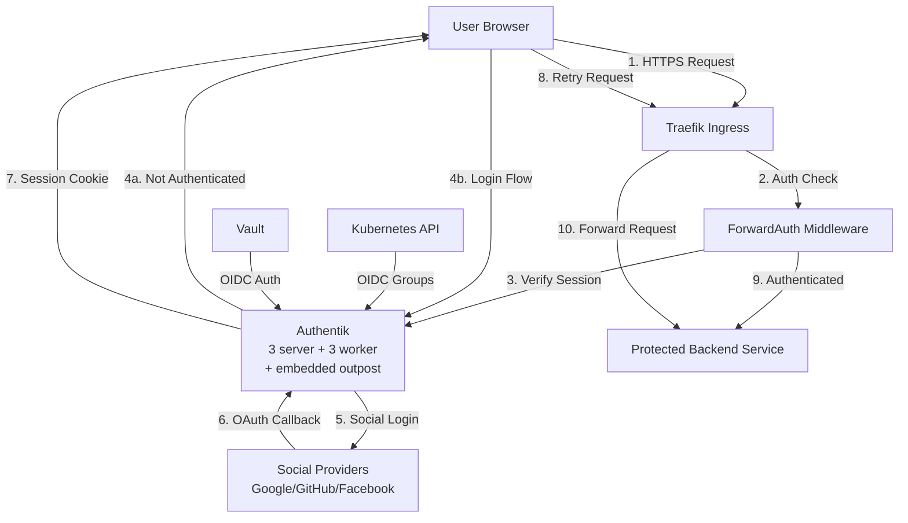

# Authentication & Authorization

## Overview

The homelab uses Authentik as a centralized identity provider (IdP) for all services, providing single sign-on (SSO) via OIDC and forward authentication for ingress protection. Authentik integrates with social login providers (Google, GitHub, Facebook), manages user groups and RBAC policies, and enforces authentication at the Traefik ingress layer. The system supports both human authentication (OIDC SSO) and service-to-service authentication (Kubernetes SA JWT for CI/CD).

## Architecture Diagram



## Components

| Component | Version | Location | Purpose |
|-----------|---------|----------|---------|
| Authentik Server | 2026.2.2 | `stacks/authentik/` | Core IdP application servers (2 replicas) |
| Authentik Worker | 2026.2.2 | `stacks/authentik/` | Background task processors (2 replicas) |
| PgBouncer | Latest | `stacks/authentik/` | PostgreSQL connection pooler (3 replicas) |
| Embedded Outpost | - | Built into Authentik | Forward auth endpoint for Traefik |
| Traefik ForwardAuth | - | `ingress_factory` module | Middleware for protected ingresses |
| Vault OIDC Method | - | `stacks/vault/` | Human SSO authentication to Vault |
| Vault K8s Auth | - | `stacks/vault/` | Service account JWT authentication |

## How It Works

### Forward Authentication Flow

Services configured with `protected = true` in the `ingress_factory` module automatically get Traefik ForwardAuth middleware configured. When an unauthenticated user accesses a protected service:

1. Request hits Traefik ingress
2. ForwardAuth middleware calls Authentik embedded outpost
3. Authentik checks for valid session cookie
4. If missing/invalid, redirects to Authentik login page (authentik.viktorbarzin.me)
5. User authenticates via social provider (Google/GitHub/Facebook)
6. Authentik creates session, sets cookie, redirects back to original URL
7. Subsequent requests include session cookie, pass auth check, reach backend

Authentik adds authentication headers (user, email, groups) to forwarded requests. These headers are stripped before reaching the backend to prevent confusion.

### Social Login & Invitation Flow

All new users must use an invitation link to register. The invitation-enrollment flow:

1. **invitation-validation** - Validates invitation token
2. **enrollment-identification** - Social login (Google/GitHub/Facebook) + passkey registration
3. **enrollment-prompt** - Collect name/email
4. **enrollment-user-write** - Create user account
5. **enrollment-login** - Auto-login after creation

Group membership is auto-assigned from the invitation's `fixed_data` field. This prevents open registration while maintaining SSO convenience.

### OIDC Applications

Authentik provides OIDC for 10 applications:

| Application | Type | Purpose |
|-------------|------|---------|
| Cloudflare Access | OIDC | Cloudflare Zero Trust tunnels |
| Domain-wide catch-all | Proxy (Forward Auth) | Protect all `*.viktorbarzin.me` services |
| Forgejo | OIDC | Git repository SSO |
| Grafana | OIDC | Monitoring dashboard SSO |
| Headscale | OIDC | Tailscale control plane auth |
| Immich | OIDC | Photo management SSO |
| Kubernetes | OIDC (public client) | K8s API authentication |
| Linkwarden | OIDC | Bookmark manager SSO |
| Matrix | OIDC | Matrix homeserver SSO |
| Wrongmove | OIDC | Real estate app SSO |

### Kubernetes RBAC via OIDC

Kubernetes API server is configured with OIDC issuer: `https://authentik.viktorbarzin.me/application/o/kubernetes/`

The public client flow:

1. User authenticates to Authentik via `kubectl` plugin or dashboard
2. Receives OIDC token with group claims
3. K8s API validates token against Authentik JWKS endpoint
4. Maps groups to ClusterRoleBindings:
   - `kubernetes-admins` → `cluster-admin` (full cluster access)
   - `kubernetes-power-users` → custom ClusterRole (read-mostly, limited write)
   - `kubernetes-namespace-owners` → RoleBindings per namespace (namespace-scoped admin)

### Authentik Groups

9 groups manage authorization:

- **Allow Login Users** - Base group, can authenticate to any OIDC app
- **authentik Admins** - Full Authentik admin UI access
- **Headscale Users** - Can access Headscale control plane
- **Home Server Admins** - Admin access to homelab services
- **Wrongmove Users** - Access to Wrongmove real estate app
- **kubernetes-admins** - K8s cluster-admin role
- **kubernetes-power-users** - K8s read-mostly access
- **kubernetes-namespace-owners** - K8s namespace-scoped admin
- **Task Submitters** - Can submit tasks to cluster task runner

### Vault Authentication

**For humans:**
- OIDC method using Authentik as provider
- SSO login to Vault UI and CLI
- Group-based policy assignment

**For services (CI/CD):**
- Kubernetes SA JWT authentication
- Woodpecker CI uses service account token
- Vault K8s secrets engine roles:
  - `dashboard-admin` - K8s dashboard admin token
  - `ci-deployer` - Deploy workloads via CI/CD
  - `openclaw` - AI assistant cluster access
  - `local-admin` - Local development access

## Configuration

### Key Config Files

| Path | Purpose |
|------|---------|
| `stacks/authentik/` | Authentik deployment (servers, workers, PgBouncer) |
| `stacks/platform/modules/ingress_factory/` | Traefik ForwardAuth middleware config |
| `stacks/platform/modules/traefik/middleware.tf` | ForwardAuth middleware definition |
| `stacks/vault/auth.tf` | Vault OIDC and K8s auth methods |

### Vault Paths

- **OIDC config**: `auth/oidc` - Authentik integration settings
- **K8s auth**: `auth/kubernetes` - SA JWT validation
- **K8s secrets engine**: `kubernetes/` - Dynamic kubeconfig/SA token generation

### Terraform Stacks

- `stacks/authentik/` - Authentik infrastructure
- `stacks/platform/` - Traefik ingress with ForwardAuth
- `stacks/vault/` - Vault auth methods

### Ingress Protection Example

```hcl
module "myapp_ingress" {
  source = "./modules/ingress_factory"

  name      = "myapp"
  host      = "myapp.viktorbarzin.me"
  protected = true  # Enables ForwardAuth middleware

  # ... other config
}
```

## Decisions & Rationale

### Why Authentik over Keycloak?

- **Lighter weight**: Lower resource footprint (3+3+3 replicas vs Keycloak's heavier Java runtime)
- **Better UX**: Modern UI, simpler admin experience, better mobile support
- **Python-based**: Easier to extend, faster startup times, better developer experience
- **Active development**: More frequent releases, responsive community

### Why Forward Auth over Sidecar?

- **Simpler architecture**: Single auth check at ingress, no sidecar per pod
- **Works with any backend**: Language/framework agnostic, no SDK required
- **Centralized policy**: All auth logic in Authentik, not distributed across sidecars
- **Performance**: Single auth check per session, not per request

### Why OIDC for Kubernetes?

- **SSO integration**: Same login as all other services, no separate credentials
- **No credential management**: No kubeconfig secrets to rotate, tokens are short-lived
- **Group-based RBAC**: Centralized group management in Authentik, automatic K8s role mapping
- **Public client flow**: No client secret needed, works in kubectl plugins and dashboards

### Why Invitation-Only Enrollment?

- **Security**: Prevents open internet access to homelab services
- **Controlled onboarding**: Explicit approval before granting access
- **Social login convenience**: No password management, leverages trusted providers
- **Group auto-assignment**: Invitation encodes initial group membership

## Troubleshooting

### Headers Not Stripped

**Problem**: Backend receives `X-Authentik-Username`, `X-Authentik-Email`, `X-Authentik-Groups` headers and breaks.

**Fix**: Traefik middleware should strip these headers before forwarding. Check `ingress_factory` module for header stripping config.

### OIDC Token Expired

**Problem**: `kubectl` returns 401 Unauthorized.

**Fix**: Re-authenticate to refresh token:
```bash
kubectl oidc-login setup --oidc-issuer-url=https://authentik.viktorbarzin.me/application/o/kubernetes/
```

### Social Login Redirect Loop

**Problem**: After social login, redirects to Authentik login page instead of destination.

**Fix**: Check Authentik application's redirect URIs. Must include `https://authentik.viktorbarzin.me/source/oauth/callback/*` for social providers.

### User Not in Correct Group

**Problem**: User authenticated but lacks permissions.

**Fix**: Check group membership in Authentik admin UI. Verify invitation `fixed_data` specified correct group. Manually add to group if needed.

### Vault OIDC Login Fails

**Problem**: Vault UI redirects to Authentik but returns error.

**Fix**:
1. Verify Vault OIDC client credentials in Authentik
2. Check Vault OIDC issuer URL matches Authentik
3. Ensure Vault redirect URI (`https://vault.viktorbarzin.me/ui/vault/auth/oidc/oidc/callback`) is registered in Authentik

### K8s Auth Group Mapping Not Working

**Problem**: User authenticated but `kubectl` shows limited permissions despite being in `kubernetes-admins`.

**Fix**:
1. Verify group claim is present in token: `kubectl oidc-login get-token | jq -R 'split(".") | .[1] | @base64d | fromjson'`
2. Check ClusterRoleBinding maps group correctly: `kubectl get clusterrolebinding -o yaml | grep kubernetes-admins`
3. Ensure Authentik OIDC app includes `groups` scope

## Related

- [Security & L7 Protection](./security.md) - CrowdSec, anti-AI scraping, rate limiting
- [Networking](./networking.md) - Ingress, DNS, load balancing
- [Vault Runbook](../runbooks/vault.md) - Vault operations and troubleshooting
- [Kubernetes Access Runbook](../runbooks/k8s-access.md) - Setting up kubectl with OIDC
