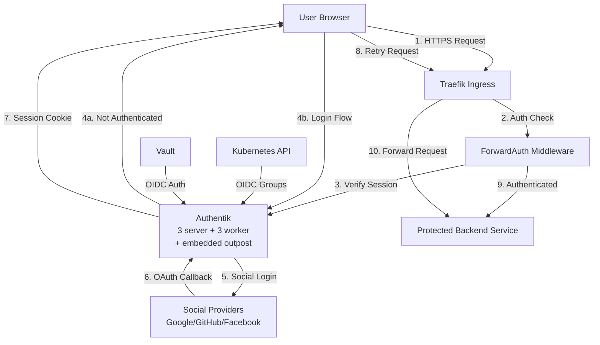

# Authentication & Authorization

## Overview

The homelab uses Authentik as a centralized identity provider (IdP) for all services, providing single sign-on (SSO) via OIDC and forward authentication for ingress protection. Authentik integrates with social login providers (Google, GitHub, Facebook), manages user groups and RBAC policies, and enforces authentication at the Traefik ingress layer. The system supports both human authentication (OIDC SSO) and service-to-service authentication (Kubernetes SA JWT for CI/CD).

## Architecture Diagram



## Components

| Component | Version | Location | Purpose |
|-----------|---------|----------|---------|
| Authentik Server | 2026.2.2 | `stacks/authentik/` | Core IdP application servers (3 replicas) |
| Authentik Worker | 2026.2.2 | `stacks/authentik/` | Background task processors (2 replicas) |
| PgBouncer | Latest | `stacks/authentik/` | PostgreSQL connection pooler (3 replicas) |
| Embedded Outpost | - | Standalone deployment, managed by Authentik | Forward auth endpoint for Traefik (2 replicas, PG-backed sessions) |
| Traefik ForwardAuth | - | `modules/kubernetes/ingress_factory/` | Middleware attached when `auth = "required"` or `"public"` |
| Vault OIDC Method | - | `stacks/vault/` | Human SSO authentication to Vault |
| Vault K8s Auth | - | `stacks/vault/` | Service account JWT authentication |

## How It Works

### Forward Authentication Flow

Services pick an auth tier via the `auth` enum on the `ingress_factory` module (default `"required"`, fail-closed):

| Tier | Effect | When to use |
|------|--------|-------------|
| `"required"` | Authentik forward-auth gates every request | Backend has no own user auth — Authentik is the only gate |
| `"app"` | No Authentik middleware; backend's own login is the gate | Backend handles its own user auth (NextAuth, Django, OAuth, bearer-token API) |
| `"public"` | Authentik anonymous binding via `public` outpost | Audit trail without gating; only works for top-level browser navigation |
| `"none"` | No Authentik middleware at all | Anubis-fronted content, webhooks, OAuth callbacks, native-client APIs (CalDAV, WebDAV, Git) |

When `auth = "required"`, an unauthenticated request flows:

1. Request hits Traefik ingress
2. ForwardAuth middleware calls the `auth-proxy` nginx (basicAuth fallback when Authentik is down), which proxies to the Authentik embedded outpost over a keepalive connection pool
3. Authentik checks for valid session cookie (domain-level `authentik_proxy_*` cookie on `.viktorbarzin.me`, 4-week validity — one cookie covers all forward-auth apps)
4. If missing/invalid, redirects to Authentik login page (authentik.viktorbarzin.me)
5. User authenticates on a **single screen**: username + password together (the identification stage embeds the password stage), or a social provider button (Google/GitHub/Facebook), then MFA validation
6. Authentik creates session, sets cookie, redirects back to original URL
7. Subsequent requests include session cookie, pass auth check, reach backend

Authentik adds authentication headers (user, email, groups) to forwarded requests. These headers are stripped before reaching the backend to prevent confusion.

### First-time signin performance (2026-06-10)

Signin latency is dominated by screen count and round trips, not server time
(DB avg 1.6ms). Standing decisions:

- **Single-screen login**: the identification stage carries `password_stage`,
  so username+password is one round trip. The separate password-stage binding
  was removed from `default-authentication-flow` (required by authentik when
  embedding). Pinned in TF: `authentik_stage_identification.default_identification`.
- **Implicit consent everywhere**: all OIDC providers are first-party, so none
  use the explicit-consent flow (it re-prompted every 4 weeks per app).
- **Live tuning via `server.env`/`worker.env`** (the `authentik.*` Helm values
  are inert due to `existingSecret`): 3 gunicorn workers, 30m flow-plan cache,
  15m policy cache, 60s persistent DB connections.
- **Static assets cached immutable**: `/static` ingress carve-out adds
  `Cache-Control: public, max-age=31536000, immutable` (assets are
  version-fingerprinted; authentik itself sends no max-age).
- **Outpost**: 2 replicas, `log_level=info` (was 1 replica at `trace`).
- **auth-proxy nginx**: upstream `keepalive 32` + HTTP/1.1 — no per-request
  TCP setup on the forward-auth subrequest path.

**Anti-exposure guard**: every `auth = "app"` or `auth = "none"` line MUST have a preceding `# auth = "<tier>": <reason>` comment documenting what gates the backend (for `"app"`) or why the endpoint is intentionally public (for `"none"`). The convention is enforced by `scripts/check-ingress-auth-comments.py`, which `scripts/tg` runs on every `plan/apply/destroy/refresh` and blocks the terragrunt invocation if violated. Stack-scoped — each stack documents itself.

### Social Login & Invitation Flow

All new users must use an invitation link to register. The invitation-enrollment flow:

1. **invitation-validation** - Validates invitation token
2. **enrollment-identification** - Social login (Google/GitHub/Facebook) + passkey registration
3. **enrollment-prompt** - Collect name/email
4. **enrollment-user-write** - Create user account
5. **enrollment-login** - Auto-login after creation

Group membership is auto-assigned from the invitation's `fixed_data` field. This prevents open registration while maintaining SSO convenience.

### OIDC Applications

Authentik provides OIDC for 10 applications:

| Application | Type | Purpose |
|-------------|------|---------|
| Cloudflare Access | OIDC | Cloudflare Zero Trust tunnels |
| Domain-wide catch-all | Proxy (Forward Auth) | Protect all `*.viktorbarzin.me` services |
| Forgejo | OIDC | Git repository SSO |
| Grafana | OIDC | Monitoring dashboard SSO |
| Headscale | OIDC | Tailscale control plane auth |
| Immich | OIDC | Photo management SSO |
| Kubernetes | OIDC (public client) | K8s API authentication (kubectl / kubelogin CLI) |
| Kubernetes Dashboard | OIDC (confidential) | Built for dashboard SSO — currently **idle** (apiserver OIDC blocked; dashboard uses forward-auth + token-paste) |
| Linkwarden | OIDC | Bookmark manager SSO |
| Wrongmove | OIDC | Real estate app SSO |

### Kubernetes API authentication (OIDC) — CURRENTLY NON-FUNCTIONAL

> ⚠️ **apiserver OIDC does not work in this cluster** (as of 2026-06-04). The
> kube-apiserver rejects *every* valid Authentik OIDC token — with both the
> legacy `--oidc-*` flags AND a structured `AuthenticationConfiguration`, for
> both the `kubernetes` and `k8s-dashboard` issuers — despite verified
> signature, issuer, audience, `email_verified=true`, synced clock, and a
> reachable + publicly-trusted JWKS. Root cause is still open; see
> `docs/plans/2026-06-04-k8s-dashboard-sso-design.md` §12. A kubeadm v1.34
> upgrade had earlier silently wiped the apiserver `--oidc-*` flags, so OIDC
> CLI/dashboard login has effectively been off. **Do not assume `kubectl`
> OIDC (kubelogin) works until this is resolved.**

The intended model (binds by `email`, see `stacks/rbac/modules/rbac/main.tf`):
`admin` → `cluster-admin`; `power-user` → custom read-mostly ClusterRole;
`namespace-owner` → `admin` RoleBinding in their namespace(s) + cluster read-only.

### Kubernetes Dashboard access (auto-injected SA token)

Because OIDC SSO is blocked, the web dashboard at `k8s.viktorbarzin.me` uses a
**token-injector** instead — users never see the dashboard's token prompt:

1. **Authentik forward-auth** (`auth=required`) gates access AND injects
   `X-authentik-username` (the user's email). The `admin-services-restriction`
   policy admits `Home Server Admins` plus `kubernetes-admins` /
   `kubernetes-power-users` / `kubernetes-namespace-owners` for this host
   (`stacks/authentik/admin-services-restriction.tf`).
2. **Token-injector** (`stacks/k8s-dashboard/dashboard_injector.tf`): an nginx
   that maps `X-authentik-username` → that user's ServiceAccount token and sets
   `Authorization: Bearer` before proxying to kong-proxy, so the dashboard
   auto-authenticates. Namespace-owners → `dashboard-<user>` SA (admin on their
   namespace + read-only on the namespace list & nodes only (dashboard-nav-readonly,
   NOT cross-tenant resource reads); `stacks/rbac/modules/rbac/dashboard-sa.tf`),
   auto-derived from `k8s_users`. Admins → the cluster-admin `kubernetes-dashboard`
   SA token (admin identities listed explicitly in `dashboard_injector.tf`, since
   their Authentik login email ≠ their `k8s_users` email).
   The injected token is the per-namespace security boundary; the map lives in a
   **Secret** (namespace-owners' cluster-read covers configmaps, not secrets).

> Manual token (fallback / break-glass): `kubectl -n <ns> get secret dashboard-<user>-token -o jsonpath='{.data.token}' | base64 -d`, or `kubectl create token kubernetes-dashboard -n kubernetes-dashboard` for admin.

The oauth2-proxy + `k8s-dashboard` Authentik OIDC app (built for the
seamless-SSO design) remain deployed but **idle/unwired** pending the
apiserver-OIDC fix.

### Authentik Groups

9 groups manage authorization:

- **Allow Login Users** - Base group, can authenticate to any OIDC app
- **authentik Admins** - Full Authentik admin UI access
- **Headscale Users** - Can access Headscale control plane
- **Home Server Admins** - Admin access to homelab services
- **Wrongmove Users** - Access to Wrongmove real estate app
- **kubernetes-admins** - K8s cluster-admin role
- **kubernetes-power-users** - K8s read-mostly access
- **kubernetes-namespace-owners** - K8s namespace-scoped admin
- **Task Submitters** - Can submit tasks to cluster task runner

### Vault Authentication

**For humans:**
- OIDC method using Authentik as provider
- SSO login to Vault UI and CLI
- Group-based policy assignment

**For services (CI/CD):**
- Kubernetes SA JWT authentication
- Woodpecker CI uses service account token
- Vault K8s secrets engine roles:
  - `dashboard-admin` - K8s dashboard admin token
  - `ci-deployer` - Deploy workloads via CI/CD
  - `openclaw` - AI assistant cluster access
  - `local-admin` - Local development access

## Configuration

### Key Config Files

| Path | Purpose |
|------|---------|
| `stacks/authentik/` | Authentik deployment (servers, workers, PgBouncer) |
| `modules/kubernetes/ingress_factory/` | Auth-tier enum + per-ingress middleware composition |
| `stacks/traefik/modules/traefik/middleware.tf` | ForwardAuth middleware definitions (required + public outposts) |
| `scripts/check-ingress-auth-comments.py` | Comment-convention guard wired into `scripts/tg` |
| `stacks/vault/auth.tf` | Vault OIDC and K8s auth methods |

### Vault Paths

- **OIDC config**: `auth/oidc` - Authentik integration settings
- **K8s auth**: `auth/kubernetes` - SA JWT validation
- **K8s secrets engine**: `kubernetes/` - Dynamic kubeconfig/SA token generation

### Terraform Stacks

- `stacks/authentik/` - Authentik infrastructure
- `stacks/platform/` - Traefik ingress with ForwardAuth
- `stacks/vault/` - Vault auth methods

### Ingress Protection Examples

Authentik-gated admin UI (default):
```hcl
module "myapp_ingress" {
  source          = "../../modules/kubernetes/ingress_factory"
  name            = "myapp"
  namespace       = "myapp"
  tls_secret_name = var.tls_secret_name
  # auth = "required" is the default — Authentik forward-auth is the gate.
}
```

Backend with its own user auth (no Authentik in the way):
```hcl
module "myapp_ingress" {
  source          = "../../modules/kubernetes/ingress_factory"
  name            = "myapp"
  namespace       = "myapp"
  tls_secret_name = var.tls_secret_name
  # auth = "app": myapp uses NextAuth + Google OAuth; mobile clients can't follow Authentik 302.
  auth            = "app"
}
```

Intentionally public webhook receiver:
```hcl
module "myapp_ingress" {
  source          = "../../modules/kubernetes/ingress_factory"
  name            = "webhook"
  namespace       = "webhooks"
  tls_secret_name = var.tls_secret_name
  # auth = "none": upstream signs payloads with HMAC; no user identity expected.
  auth            = "none"
}
```

## Decisions & Rationale

### Why Authentik over Keycloak?

- **Lighter weight**: Lower resource footprint (3+3+3 replicas vs Keycloak's heavier Java runtime)
- **Better UX**: Modern UI, simpler admin experience, better mobile support
- **Python-based**: Easier to extend, faster startup times, better developer experience
- **Active development**: More frequent releases, responsive community

### Why Forward Auth over Sidecar?

- **Simpler architecture**: Single auth check at ingress, no sidecar per pod
- **Works with any backend**: Language/framework agnostic, no SDK required
- **Centralized policy**: All auth logic in Authentik, not distributed across sidecars
- **Performance**: Single auth check per session, not per request

### Why OIDC for Kubernetes?

- **SSO integration**: Same login as all other services, no separate credentials
- **No credential management**: No kubeconfig secrets to rotate, tokens are short-lived
- **Group-based RBAC**: Centralized group management in Authentik, automatic K8s role mapping
- **Public client flow**: No client secret needed, works in kubectl plugins and dashboards

### Why Invitation-Only Enrollment?

- **Security**: Prevents open internet access to homelab services
- **Controlled onboarding**: Explicit approval before granting access
- **Social login convenience**: No password management, leverages trusted providers
- **Group auto-assignment**: Invitation encodes initial group membership

## Troubleshooting

### Headers Not Stripped

**Problem**: Backend receives `X-Authentik-Username`, `X-Authentik-Email`, `X-Authentik-Groups` headers and breaks.

**Fix**: Traefik middleware should strip these headers before forwarding. Check `ingress_factory` module for header stripping config.

### OIDC Token Expired

**Problem**: `kubectl` returns 401 Unauthorized.

**Fix**: Re-authenticate to refresh token:
```bash
kubectl oidc-login setup --oidc-issuer-url=https://authentik.viktorbarzin.me/application/o/kubernetes/
```

### Social Login Redirect Loop

**Problem**: After social login, redirects to Authentik login page instead of destination.

**Fix**: Check Authentik application's redirect URIs. Must include `https://authentik.viktorbarzin.me/source/oauth/callback/*` for social providers.

### User Not in Correct Group

**Problem**: User authenticated but lacks permissions.

**Fix**: Check group membership in Authentik admin UI. Verify invitation `fixed_data` specified correct group. Manually add to group if needed.

### Vault OIDC Login Fails

**Problem**: Vault UI redirects to Authentik but returns error.

**Fix**:
1. Verify Vault OIDC client credentials in Authentik
2. Check Vault OIDC issuer URL matches Authentik
3. Ensure Vault redirect URI (`https://vault.viktorbarzin.me/ui/vault/auth/oidc/oidc/callback`) is registered in Authentik

### K8s Auth Group Mapping Not Working

**Problem**: User authenticated but `kubectl` shows limited permissions despite being in `kubernetes-admins`.

**Fix**:
1. Verify group claim is present in token: `kubectl oidc-login get-token | jq -R 'split(".") | .[1] | @base64d | fromjson'`
2. Check ClusterRoleBinding maps group correctly: `kubectl get clusterrolebinding -o yaml | grep kubernetes-admins`
3. Ensure Authentik OIDC app includes `groups` scope

## Related

- [Security & L7 Protection](./security.md) - CrowdSec, anti-AI scraping, rate limiting
- [Networking](./networking.md) - Ingress, DNS, load balancing
- [Vault Runbook](../runbooks/vault.md) - Vault operations and troubleshooting
- [Kubernetes Access Runbook](../runbooks/k8s-access.md) - Setting up kubectl with OIDC
