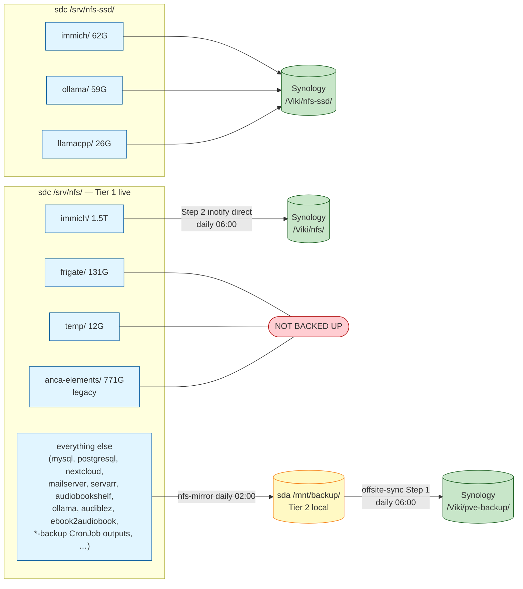
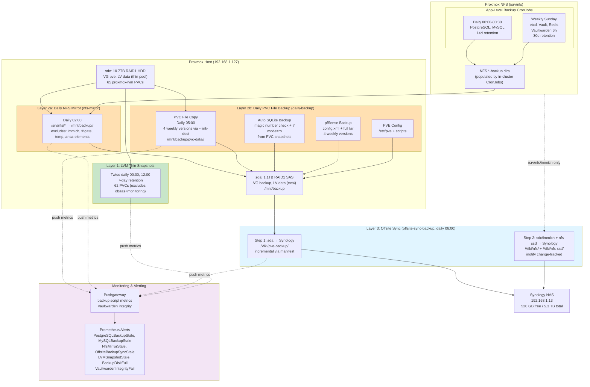
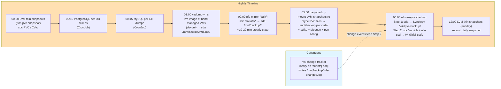
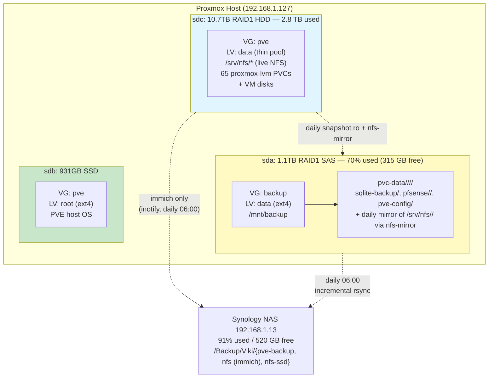
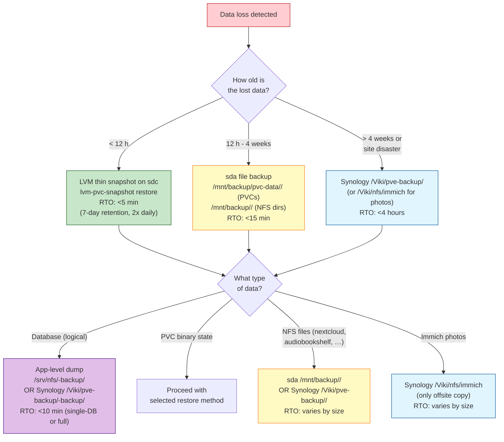
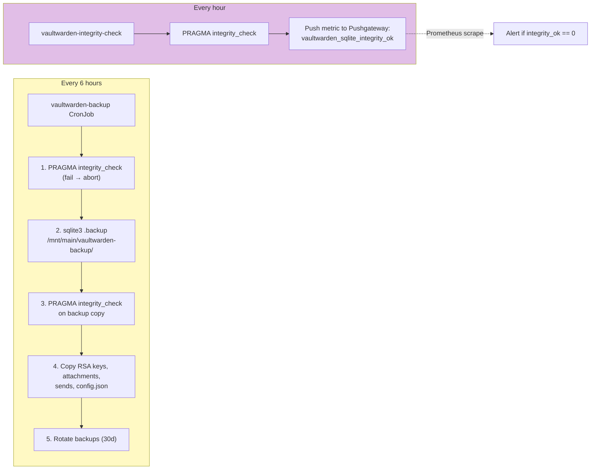

# Backup & Disaster Recovery Architecture

Last updated: 2026-06-01

> **2026-06-01 — regenerable services carved back out** (offsite Synology hit
> 97%; the `Backup` share had grown +670 G in a week, traced to the 2026-05-26
> change below that started mirroring large regenerable data offsite):
> - **`nfs-mirror` re-excludes** `ollama` (20 G), `prometheus-backup` (64 G),
>   `audiblez` (24 G), `ebook2audiobook` (11 G). Live copy stays on sdc; no
>   sda/Synology copy. `--delete` reaps them from sda on the next run.
>   `*-backup` DB dumps (sqlite-backup etc.) are KEPT — real DB safety copies.
> - **`offsite-sync` Step 2 nfs-ssd → immich-only**: `ollama` (59 G) +
>   `llamacpp` (26 G) on the SSD no longer ship to Synology (re-pullable
>   models). Was a blanket `/srv/nfs-ssd/` sync; now immich-only like nfs/.
> - **`daily-backup` skips `nextcloud/nextcloud-data-proxmox`** — orphaned
>   pre-encryption PV (Released, Retain) that was still backed up weekly.
> - **Nextcloud backup shrunk**: the dedicated nextcloud-backup CronJob
>   (`stacks/nextcloud`) kept 7 full copies incl. a 10 GB+ `nextcloud.log`
>   (87 G total). Now: `log_rotate_size=10 MB` caps the log at source, backup
>   excludes `nextcloud.log*` + preview cache, retention 7 → 1 (pvc-data holds
>   the version history). Footprint < 5 G.
> - **Nextcloud image pinned to `32.0.9`** in chart_values — the 2026-05-26
>   Keel bump (32.0.3 → 32.0.9, data migrated to 32.0.9.2) was never pinned in
>   TF, so this session's apply rolled a 32.0.3 pod and CrashLooped on the
>   downgrade. Pinning eliminates the drift.
> - **One-off Synology delete** of the existing copies above + emptied the
>   `Backup`/`Emo shared` recycle bins (~31 G). ~340 G total; reclaims as the
>   3-day `Backup`-share snapshots roll off (or via manual snapshot expiry).

> **2026-05-26 — bypass list pruned to a single path** (follow-up to the
> 2026-05-24 changes below):
> - `nfs-mirror` now copies ollama, audiblez, ebook2audiobook, and every
>   `*-backup` CronJob output onto sda. Previously these went sdc → Synology
>   DIRECT via Step 2; now they ride leg 1 like everything else.
> - **Bypass list (leg 2)** is now just `/srv/nfs/immich/` — too big for sda
>   (1.5 T), no other choice.
> - **frigate and temp**: dropped from BOTH legs — intentionally not backed up.
>   frigate is a 14-day camera ring, temp is scratch space. User explicit ask
>   2026-05-26.
> - **prometheus, loki, alertmanager**: live-orphan dirs that no longer
>   exist on `/srv/nfs`. Dropped from the exclude/include lists as no-ops.
> - `/mnt/backup/anca-elements` (423 G) deleted — canonical copy lives in
>   Immich since the 2026-05-24 ingest.
> - **`nfs-mirror.timer`: weekly Mon 04:00 → daily 02:00.** Steady-state
>   delta is 10-20 min of mostly-metadata rsync, so the IO cost is
>   negligible. RPO for non-CronJob app data (nextcloud shared files,
>   audiobookshelf library, mailserver Maildir, real-estate-crawler scraped
>   data, etc.) drops from 7 days to ~24h.
> - Aftermath: sda 87% → 46% used; Synology `/Viki/nfs/` shrinks to
>   immich-only on next monthly `--delete` pass (or manual cleanup —
>   see runbook).
>
> **2026-05-24 session — what changed**:
> - **anca-elements archive direction inverted** — Synology `/Backup/Anca/Elements` (770G) deleted; PVE `/srv/nfs/anca-elements` is now source of truth. `anca-elements-sync.sh` retired.
> - **`anca-elements-mirror.{sh,service,timer}` retired**, subsumed into the new **`nfs-mirror`** weekly job covering all critical NFS subtrees (anca-elements + ~80 services) → sda.
> - **Synology `/Backup/Viki/nfs/<svc>/` orphan cleanup** — 84 dirs renamed in-place (btrfs metadata-only) to `/Backup/Viki/pve-backup/<svc>/` so daily-incremental Step 1 sees them as pre-existing and only ships deltas. No re-transfer.
> - **Synology snapshot retention 7d → 3d**, all 8 backlog snapshots deleted via `sudo synosharesnapshot delete Backup ...`. Reclaimed ~800G btrfs (98% → 83% used). DSM API was blocked by 2FA; `sudo` over the existing `Administrator` SSH key worked with the Vault-stored password.
> - **Manifest mechanism extended**: `nfs-mirror` now appends its transferred file list to `/mnt/backup/.changed-files` so daily Step 1 incremental picks it up (was previously only fed by `daily-backup`).

## Overview

The homelab runs a 3-2-1 strategy with a **two-leg** path to Synology so every NFS byte takes exactly one route to offsite (no duplication, no gaps):

```
sdc /srv/nfs/<svc>/   ──nfs-mirror daily 02:00──→  sda /mnt/backup/<svc>/   ──offsite-sync Step 1──→  Synology /Backup/Viki/pve-backup/<svc>/  [leg 1]
sdc /srv/nfs/immich/  ──inotify (nfs-change-tracker)──→  offsite-sync Step 2  ──→  Synology /Backup/Viki/nfs/immich/                          [leg 2]
sdc PVCs (LVM thin)   ──daily-backup~snapshot~rsync──→  sda /mnt/backup/{pvc-data,sqlite-backup,pfsense,pve-config}/  ──Step 1──→  Synology /Backup/Viki/pve-backup/
```

The **bypass list** (leg 2) is just `/srv/nfs/immich/` — too big for sda (1.5 T). **Not backed up at all**: `/srv/nfs/frigate/` (camera ring buffer), `/srv/nfs/temp/` (scratch). Everything else rides leg 1 via `nfs-mirror`.

**3-2-1 Breakdown**:
- **Copy 1** (live): all PVC data + VM disks on Proxmox sdc thin pool (10.7TB RAID1 HDD); all NFS data at `/srv/nfs[-ssd]/`
- **Copy 2** (local backup): sda `/mnt/backup` (1.1TB RAID1 SAS) — **46% used** post-2026-05-26 (was 87% before anca-elements cleanup; bypass-list pruning added ~260 G of *-backup + ollama + audiblez + ebook2audiobook)
- **Copy 3** (offsite): Synology NAS at 192.168.1.13
  - `Synology/Backup/Viki/pve-backup/` — sda contents (PVC backups + nfs-mirror output: ~90 service dirs incl. `*-backup` DB dumps. **ollama/audiblez/ebook2audiobook/prometheus-backup excluded 2026-06-01** — regenerable, live-only)
  - `Synology/Backup/Viki/nfs/` — immich only (post-2026-05-26)
  - `Synology/Backup/Viki/nfs-ssd/` — **immich-ML only (2026-06-01)**; ollama/llamacpp dropped (re-pullable models, live-only on the SSD)

**VM image backups (added 2026-06-09)**: the hand-managed Linux VMs (those NOT in Terraform — see `compute.md`) were historically **not imaged at all** — only their *contents* reached backup if they happened to host a PVC/NFS path. `vzdump-vms` now takes a daily live `vzdump --mode snapshot` of each configured VMID → `/mnt/backup/vzdump/` (Copy 2), carried offsite by the monthly offsite-sync full pass (Copy 3). **Currently enabled for VMID 102 (devvm)** — the shared workstation, whose per-user home dirs + local-only git repos are otherwise irreplaceable. Extend via `VZDUMP_VMIDS` in the unit. See "VM Image Backups (vzdump)" under How It Works.

## Architecture Diagram

### Data Routing — where each path goes (post-2026-05-26)



### Overall Backup Flow



### Daily Backup Timeline (EEST)



### Physical Disk Layout



### Restore Decision Tree



### Vaultwarden Enhanced Protection



## Components

| Component | Version/Schedule | Location | Purpose |
|-----------|-----------------|----------|---------|
| LVM Thin Snapshots | Daily 03:00, 7d retention | PVE host: `lvm-pvc-snapshot` | CoW snapshots of 62 proxmox-lvm PVCs |
| Daily PVC Backup | Daily 05:00, 4 weeks | PVE host: `daily-backup` | File-level PVC copy to sda |
| Auto SQLite Backup | Daily 05:00 + daily-backup | PVE host: magic number check + ?mode=ro | Safe SQLite backup from PVC snapshots |
| NFS Change Tracker | Continuous (inotifywait) | PVE host: `nfs-change-tracker.service` | Logs changed NFS file paths to `/mnt/backup/.nfs-changes.log` |
| pfSense Backup | Daily 05:00 + daily-backup | PVE host: SSH + API | config.xml + full filesystem tar |
| Offsite Sync | Daily 06:00 (after daily-backup) | PVE host: `offsite-sync-backup` | Two-step: sda→pve-backup + NFS→nfs/nfs-ssd via inotify |
| VM Image Backup (vzdump) | Daily 01:00, keep 3 | PVE host: `vzdump-vms` | Live `vzdump` of hand-managed VMs (devvm) → `/mnt/backup/vzdump/` |
| PostgreSQL Backup (full) | Daily 00:00, 14d retention | CronJob in `dbaas` namespace | pg_dumpall for all databases |
| PostgreSQL Backup (per-db) | Daily 00:15, 14d retention | CronJob in `dbaas` namespace | pg_dump -Fc per database → `/backup/per-db/<db>/` |
| MySQL Backup (full) | Daily 00:30, 14d retention | CronJob in `dbaas` namespace | mysqldump --all-databases |
| MySQL Backup (per-db) | Daily 00:45, 14d retention | CronJob in `dbaas` namespace | mysqldump per database → `/backup/per-db/<db>/` |
| etcd Backup | Weekly Sunday 01:00, 30d | CronJob in `kube-system` | etcdctl snapshot |
| Vaultwarden Backup | Every 6h, 30d retention | CronJob in `vaultwarden` | sqlite3 .backup + integrity |
| Vault Backup | Weekly Sunday 02:00, 30d | CronJob in `vault` | raft snapshot |
| Redis Backup | Weekly Sunday 03:00, 30d | CronJob in `redis` | BGSAVE + copy |
| Vaultwarden Integrity Check | Hourly | CronJob in `vaultwarden` | PRAGMA integrity_check → metric |
| ~~TrueNAS Cloud Sync~~ | **DECOMMISSIONED 2026-04-13** | Was TrueNAS Cloud Sync Task 1 | Replaced by offsite-sync-backup + inotify change tracking on Proxmox host NFS |

## How It Works

### Layer 1: LVM Thin Snapshots (Fast Local Recovery)

Native LVM thin snapshots provide crash-consistent point-in-time recovery for 62 Proxmox CSI PVCs. These are CoW snapshots — instant creation, minimal overhead, sharing the thin pool's free space.

**Script**: `/usr/local/bin/lvm-pvc-snapshot` on PVE host (source: `infra/scripts/lvm-pvc-snapshot.sh`). Deploy: `scp infra/scripts/lvm-pvc-snapshot.sh root@192.168.1.127:/usr/local/bin/lvm-pvc-snapshot`
**Schedule**: Daily 03:00 via systemd timer, 7-day retention
**Discovery**: Auto-discovers PVC LVs matching `vm-*-pvc-*` pattern in VG `pve` thin pool `data`

**Coverage**: All 65 proxmox-lvm PVCs **except** `dbaas` and `monitoring` namespaces. These are excluded because:
- MySQL InnoDB, PostgreSQL, and Prometheus are high-churn (50%+ CoW divergence/hour)
- They already have app-level dumps (Layer 2)
- Including them causes ~36% write amplification; excluding them reduces overhead to ~0%

**Monitoring**: Pushes metrics to Pushgateway via NodePort (30091). Alerts: `LVMSnapshotStale` (>30h since last run + 30m `for:`), `LVMSnapshotFailing`, `LVMThinPoolLow` (<15% free).

**Restore**: `lvm-pvc-snapshot restore <pvc-lv> <snapshot-lv>` — auto-discovers K8s workload, scales down, swaps LVs, scales back up. See `docs/runbooks/restore-lvm-snapshot.md`.

### VM Image Backups (vzdump)

The hand-managed Linux VMs are **intentionally not in Terraform** (telmate/bpg provider bugs — see `compute.md`) and were historically **not imaged at all**: nothing took a whole-disk backup of the VM itself. For most that is acceptable — k8s nodes are reprovisioned from cloud-init and their data lives in PVCs covered above. But **devvm** (the shared multi-user Claude Code workstation, VMID 102) holds irreplaceable state that lives nowhere else: per-user home dirs (`~/.claude`, `~/.t3`, shell history), manually-installed tooling, and **local-only git repos** — the monorepo root at `/home/wizard/code` has no git remote. A lost devvm disk = unrecoverable.

**Script**: `/usr/local/bin/vzdump-vms` on PVE host (source: `infra/scripts/vzdump-vms.sh`). Deploy: `scp infra/scripts/vzdump-vms.sh root@192.168.1.127:/usr/local/bin/vzdump-vms` + `scp infra/scripts/vzdump-vms.{service,timer} root@192.168.1.127:/etc/systemd/system/`, then `systemctl daemon-reload && systemctl enable --now vzdump-vms.timer`.
**Schedule**: Daily 01:00 via systemd timer — ahead of the other backup jobs so the fresh image is on sda before offsite-sync runs.
**Mode**: `vzdump --mode snapshot` — live, no downtime. devvm has the qemu guest agent enabled (`agent: 1`), so the snapshot is **filesystem-consistent** (fs-freeze) rather than merely crash-consistent. Runs `Nice=10` + `IOSchedulingClass=idle` + `--ionice 7` so it never starves etcd on the contended sdc IO domain.
**Scope**: VMIDs in `VZDUMP_VMIDS` (default `102` = devvm). Add VMIDs there to image other hand-managed VMs.
**Retention**: `KEEP=3` newest dumps per VMID on sda (`/mnt/backup/vzdump/`); each devvm image is ~35-50 GB zstd.
**Offsite**: deliberately **NOT** appended to the incremental offsite manifest — it never deletes, so daily multi-GB images would accumulate unbounded on Synology. Instead the **monthly offsite-sync full pass (days 1-7)** mirrors all of `/mnt/backup` (including `vzdump/`) to Synology with `--delete`, bounded to local retention. So Copy 2 (sda) refreshes **daily**; Copy 3 (Synology) refreshes **monthly**.
**Monitoring**: pushes `vzdump_last_run_timestamp` / `vzdump_last_status` / `vzdump_last_success_timestamp` to Pushgateway job `vzdump-backup`. A `VzdumpBackupStale` / `VzdumpBackupFailing` alert in `stacks/monitoring` (mirroring the LVM/pfSense backup alerts) is the recommended next addition.
**Restore**: on the PVE host, `qmrestore /mnt/backup/vzdump/vzdump-qemu-<vmid>-<ts>.vma.zst <vmid>` — restore to a spare VMID first if the original still exists, then swap disks; or use the PVE UI (add `/mnt/backup` as a dir storage with content=backup → Restore).

### Layer 2: Weekly File-Level Backup (sda Backup Disk)

**Backup disk**: sda (1.1TB RAID1 SAS) → VG `backup` → LV `data` → ext4 → mounted at `/mnt/backup` on PVE host. Dedicated backup disk, independent of live storage.

**Script**: `/usr/local/bin/daily-backup` on PVE host (source: `infra/scripts/daily-backup.sh`)
**Schedule**: Daily 05:00 via systemd timer
**Retention**: 4 weekly versions (weeks 0-3 via `--link-dest` hardlink dedup)

#### What Gets Backed Up

**1. PVC File Copies** (`/mnt/backup/pvc-data/<YYYY-WW>/`):
- Mount each LVM thin LV ro on PVE host → rsync files (not block) → unmount
- 62 PVCs covered (all except dbaas + monitoring)
- Organized as `/mnt/backup/pvc-data/<YYYY-WW>/<namespace>/<pvc-name>/`
- 4 weekly versions with `--link-dest` hardlink dedup (unchanged files share inodes)

**2. Auto SQLite Backup** (`/mnt/backup/sqlite-backup/`):
- Detects SQLite databases in PVC snapshots via magic number check (`SQLite format 3`)
- Opens each database with `?mode=ro` (read-only, safe — no WAL replay)
- Runs `.backup` to create a consistent copy
- Covers all SQLite files across all PVC snapshots automatically

**3. pfSense Backup** (`/mnt/backup/pfsense/<YYYY-WW>/`):
- `config.xml` via API (base64 decode)
- Full filesystem tar via SSH (`tar czf /tmp/pfsense-full.tar.gz /cf /var/db /boot/loader.conf`)
- 4 weekly versions

**4. PVE Config** (`/mnt/backup/pve-config/`):
- `/etc/pve/` (cluster config, VM definitions)
- `/usr/local/bin/` (custom scripts)
- `/etc/systemd/system/` (timers)
- Single copy (no rotation)

**Auto-discovered BACKUP_DIRS**: Uses glob-based discovery instead of a hardcoded list. Any new PVC LV matching `vm-*-pvc-*` is automatically included.

**Snapshot Pruning**: Deletes LVM snapshots older than 7 days (safety net for snapshots that outlive `lvm-pvc-snapshot` timer).

**Monitoring**: Pushes `daily_backup_last_run_timestamp`, `daily_backup_last_status`, and `daily_backup_bytes_synced` to Pushgateway (job `daily-backup`). Alerts: `WeeklyBackupStale` (>9d on `daily_backup_last_run_timestamp`), `WeeklyBackupFailing` (`daily_backup_last_status != 0`). The metric is pushed both on clean exit AND from a `trap TERM INT` handler — a 2026-04-30 → 2026-05-09 silent-failure incident traced to systemd SIGTERMing the script before it reached its final push, leaving the alert blind.

### Layer 2b: Application-Level Backups

K8s CronJobs run inside the cluster, dumping database/state to NFS-exported backup directories. Each service writes to `/srv/nfs/<service>-backup/` (some legacy paths still use `/mnt/main/<service>-backup/`).

**Why needed**: LVM snapshots capture block-level state, but:
- Cannot restore individual databases from a PostgreSQL snapshot
- Proxmox CSI LVs are opaque raw block devices
- Need point-in-time recovery for specific apps without full LVM rollback

**Daily backups (00:00-00:30)**:
- **PostgreSQL full** (`pg_dumpall`, 00:00): Dumps all databases to `/mnt/main/postgresql-backup/dump_*.sql.gz`. 14-day rotation.
- **PostgreSQL per-db** (`pg_dump -Fc`, 00:15): Dumps each database individually to `/mnt/main/postgresql-backup/per-db/<dbname>/dump_*.dump`. Enables single-database restore via `pg_restore -d <db> --clean --if-exists`. 14-day rotation.
- **MySQL full** (`mysqldump --all-databases`, 00:30): Dumps all databases to `/mnt/main/mysql-backup/dump_*.sql.gz`. 14-day rotation.
- **MySQL per-db** (`mysqldump`, 00:45): Dumps each database individually to `/mnt/main/mysql-backup/per-db/<dbname>/dump_*.sql.gz`. Enables single-database restore. 14-day rotation.

**Daily backups (Sunday 01:00-04:00)**:
- **etcd**: `etcdctl snapshot save /mnt/main/etcd-backup/snapshot-$(date +%Y%m%d).db`. 30-day retention. Critical for cluster recovery.
- **Vaultwarden**: See "Vaultwarden Enhanced Protection" below. 30-day retention.
- **Vault**: `vault operator raft snapshot save /mnt/main/vault-backup/snapshot-$(date +%Y%m%d).snap`. 30-day retention.
- **Redis**: `redis-cli BGSAVE` then copy RDB file. 30-day retention.

### Vaultwarden Enhanced Protection

Vaultwarden stores sensitive password vault data in SQLite on a proxmox-lvm volume. Extra safeguards prevent corruption:

**Every 6 hours** (vaultwarden-backup CronJob):
1. Run `PRAGMA integrity_check` on live database
2. If check fails → abort (alert fires)
3. If check passes → `sqlite3 .backup /mnt/main/vaultwarden-backup/db-$(date +%Y%m%d%H%M).sqlite`
4. Run `PRAGMA integrity_check` on backup copy
5. Copy RSA keys, attachments, sends folder, config.json
6. Rotate backups older than 30 days

**Every hour** (vaultwarden-integrity-check CronJob):
1. Run `PRAGMA integrity_check` on live database
2. Push metric to Pushgateway: `vaultwarden_sqlite_integrity_ok{status="ok"}=1` or `=0`
3. Prometheus scrapes Pushgateway and alerts on `integrity_ok == 0`

This provides both frequent backups (every 6h) AND continuous integrity monitoring (hourly).

### Layer 3: Offsite Sync to Synology NAS

**Script**: `/usr/local/bin/offsite-sync-backup` on PVE host (source: `infra/scripts/offsite-sync-backup`)
**Schedule**: Daily 06:00 via systemd timer (After=daily-backup.service)

Two-step offsite sync:

#### Step 1: sda to Synology pve-backup/

**Method**: `rsync` from `/mnt/backup/` to `synology.viktorbarzin.lan:/Backup/Viki/pve-backup/`
**Content**: PVC snapshots (`pvc-data/`), pfSense backups, PVE config, SQLite backups, **plus the nfs-mirror output** (anca-elements + ~30 critical NFS subtrees) — see Layer 3a. After consolidation, sda is the single source for the bulk of Synology's payload.

**Destination**: `Synology/Backup/Viki/pve-backup/`:
- `pvc-data/<YYYY-WW>/` — 4 weekly PVC file backups
- `sqlite-backup/` — auto SQLite backups
- `pfsense/<YYYY-WW>/` — 4 weekly pfSense backups
- `pve-config/` — latest PVE config
- `anca-elements/`, `mysql/`, `postgresql/`, `nextcloud/`, `health/`, `<other critical NFS dirs>/` — from nfs-mirror (Layer 3a)

#### Step 2: sda-bypass NFS to Synology nfs/ + nfs-ssd/ (inotify change-tracked, FILTERED)

**Role**: Carries the single path that bypasses sda — `/srv/nfs/immich/` (1.5 T, doesn't fit on sda). Plus the full `/srv/nfs-ssd/` (immich-ML + ollama + llamacpp; the SSD has no sda-mirror leg). Everything else under `/srv/nfs/` rides leg 1.

**Method**: `rsync --files-from /mnt/backup/.nfs-changes.log` with regex filter `^/srv/nfs/immich/`. The monthly full sync uses `--include='/immich/***' --exclude='*'` for the HDD leg, and a plain `--delete` for the SSD leg.

**Change tracking**: `nfs-change-tracker.service` (systemd, inotifywait) on PVE host watches `/srv/nfs` and `/srv/nfs-ssd` continuously. Changed file paths are logged to `/mnt/backup/.nfs-changes.log`. Step 2 reads this log and transfers only changed files matching the bypass regex. Incremental syncs complete in seconds.

**Monthly full sync**: On 1st Sunday of month, runs `rsync --delete` with the immich-only include list. The `--delete` pass also reaps any stale Synology `/Viki/nfs/<dir>/` from the broader pre-2026-05-26 bypass list (ollama, audiblez, ebook2audiobook, *-backup, frigate, prometheus, loki, temp, alertmanager).

**`/srv/nfs/anca-elements/` history**: had its own dedicated Synology exclusion line earlier in 2026-05-24 because the original Synology source (`/volume1/Backup/Anca/Elements`) was being preserved while we moved canonical to PVE. After the original was deleted (same day), anca-elements joined the broader "NOT bypassing sda" category and is covered by Step 1 via `nfs-mirror`.

**Layer 3a: NFS local mirror on sda (3-2-1 second copy)**: `/usr/local/bin/nfs-mirror` rsyncs `/srv/nfs/` → `/mnt/backup/<service>/` daily at 02:00 (switched from weekly Mon 04:00 on 2026-05-26 — steady-state delta is 10-20 min of mostly-metadata rsync, cuts non-CronJob app-data RPO from 7d to ~24h). Single rsync invocation, single destination. As of 2026-05-26 the skip-list (in `nfs-mirror.sh` `EXCLUDES`) is intentionally minimal:

- **immich** (1.5 T) — too big for sda; ships sdc → Synology direct (leg 2)
- **frigate** (camera ring buffer) — intentionally NOT backed up
- **temp** (scratch) — intentionally NOT backed up
- **anca-elements** (legacy) — now in Immich; `/mnt/backup/anca-elements` deleted 2026-05-26
- **/srv/nfs-ssd** entirely — its three dirs (immich-ML, ollama, llamacpp) all ship direct to Synology nfs-ssd/

Everything else under `/srv/nfs/` — mysql, postgresql, nextcloud, health, real-estate-crawler, audiobookshelf, servarr, technitium, openclaw, ollama (HDD), audiblez, ebook2audiobook, every `*-backup` CronJob output, … — lands at `/mnt/backup/<svc>/`. Mirror size ≈ 400 GB post-2026-05-26 (was ~900 GB with anca-elements).

Pushes `nfs_mirror_last_run_timestamp` + `nfs_mirror_last_status` + `nfs_mirror_bytes` to Pushgateway. Alerts: `NfsMirrorStale` (>16d), `NfsMirrorFailing` (status != 0). `rsync -rlt --delete -H --no-perms --no-owner --no-group`; idempotent. Nice=10, IOSchedulingClass=idle (won't compete with foreground IO).

> History: `anca-elements-mirror.{sh,service,timer}` was a precursor (2026-05-24 morning) dedicated to /srv/nfs/anca-elements only. Subsumed by `nfs-mirror` later the same day to consolidate ad-hoc copy scripts into one.

**Destination**:
- `Synology/Backup/Viki/nfs/` — immich only (post-2026-05-26)
- `Synology/Backup/Viki/nfs-ssd/` — mirrors `/srv/nfs-ssd` (immich-ML, ollama, llamacpp)

**Monitoring**: Pushes `offsite_backup_sync_last_success_timestamp` to Pushgateway. Alerts: `OffsiteBackupSyncStale` (>8d), `OffsiteBackupSyncFailing`.

#### ~~TrueNAS Cloud Sync~~ — DECOMMISSIONED 2026-04-13

> TrueNAS Cloud Sync was decommissioned along with TrueNAS (2026-04-13). The current offsite path is inotify-change-tracked rsync from the Proxmox host NFS (`/srv/nfs`, `/srv/nfs-ssd`) to Synology.

### Synology snapshot management

Synology DSM keeps daily btrfs snapshots of every shared folder (the `Backup` share most importantly). Retention is configured per-share in DSM's Snapshot Replication app, and persists in `synosharesnapshot shareconf`.

**Current settings** (`Backup` share, 2026-05-24): daily at 02:00, **`snap_auto_remove_keep_days=3`** (tightened from 7 to reduce the window where deleted data continues to consume space).

Snapshots are CoW — deleting a file from the live filesystem does NOT free its blocks while any retained snapshot references them. Reclaim only happens after ALL referencing snapshots roll off.

**DSM Web API is gated by 2FA (FIDO/OTP)** — programmatic snapshot management has to go via SSH + sudo instead:

```bash
# Password is in Vault: secret/viktor → synology_admin_password
PASS=$(VAULT_ADDR=https://vault.viktorbarzin.me vault kv get -field=synology_admin_password secret/viktor)

# List snapshots on the Backup share
ssh Administrator@192.168.1.13 "echo '$PASS' | sudo -S /usr/syno/sbin/synosharesnapshot list Backup"

# Bulk delete ALL snapshots (reclaims everything once btrfs cleaner runs)
ssh Administrator@192.168.1.13 "
  SNAPS=\$(echo '$PASS' | sudo -S /usr/syno/sbin/synosharesnapshot list Backup 2>/dev/null \
    | grep -oE 'GMT-[0-9]+\.[0-9]+\.[0-9]+-[0-9]+\.[0-9]+\.[0-9]+' | sort -u)
  echo '$PASS' | sudo -S /usr/syno/sbin/synosharesnapshot delete Backup \$SNAPS
"

# Tighten retention
ssh Administrator@192.168.1.13 "echo '$PASS' | sudo -S /usr/syno/sbin/synosharesnapshot shareconf set Backup snap_auto_remove_keep_days=3"
```

The btrfs cleaner thread reclaims async — `df` may lag the snapshot-delete by minutes (typical reclaim rate observed 2026-05-24: ~300 MB/s sustained, with bursts of 800 GB in 2 minutes).

> Memory: id=2673-2676 (Synology snapshot retention gotcha — deletion vs reclaim timing).

## Configuration

### Key Files

| Path | Purpose |
|------|---------|
| `/usr/local/bin/lvm-pvc-snapshot` | PVE host: LVM snapshot creation + restore |
| `/usr/local/bin/daily-backup` | PVE host: PVC file copy + auto SQLite backup + pfSense |
| `/usr/local/bin/offsite-sync-backup` | PVE host: two-step rsync to Synology (sda + NFS via inotify) |
| `/usr/local/bin/vzdump-vms` | PVE host: daily live `vzdump` image of hand-managed VMs (devvm) → `/mnt/backup/vzdump/` |
| `/mnt/backup/` | PVE host: sda mount point (1.1TB backup disk) |
| `/mnt/backup/vzdump/` | PVE host: vzdump VM images (keep 3 per VMID), mirrored offsite monthly |
| `/mnt/backup/.nfs-changes.log` | NFS change log from inotifywait, consumed by offsite-sync |
| `/etc/systemd/system/nfs-change-tracker.service` | inotifywait watcher for `/srv/nfs` + `/srv/nfs-ssd` |
| `/etc/systemd/system/lvm-pvc-snapshot.timer` | Daily 03:00 (LVM snapshots) |
| `/etc/systemd/system/daily-backup.timer` | Daily 05:00 (file backup) |
| `/etc/systemd/system/offsite-sync-backup.timer` | Daily 06:00 (offsite sync) |
| `/etc/systemd/system/vzdump-vms.timer` | Daily 01:00 (VM image backup) |
| `/etc/systemd/system/vzdump-vms.service` | oneshot: `vzdump-vms` (source `infra/scripts/vzdump-vms.{sh,service,timer}`) |
| `/usr/local/bin/nfs-mirror` | PVE host: daily 02:00 mirror of /srv/nfs/* → sda /mnt/backup/<svc>/ (Layer 3a) |
| `/etc/systemd/system/nfs-mirror.timer` | Daily 02:00 (NFS local mirror to sda) |
| `stacks/dbaas/` | Terraform: PostgreSQL/MySQL backup CronJobs |
| `stacks/vault/` | Terraform: Vault backup CronJob |
| `stacks/vaultwarden/` | Terraform: Vaultwarden backup + integrity CronJobs |
| `stacks/monitoring/` | Terraform: Prometheus alerts |
| `synology:Administrator@192.168.1.13` | Synology SSH; sudo password = Vault `secret/viktor` `synology_admin_password`; DSM API itself gated by 2FA |
| `/usr/syno/sbin/synosharesnapshot` | Synology: btrfs snapshot CLI — must run as root via sudo |

### Vault Paths

| Path | Contents |
|------|----------|
| `secret/viktor/synology_ssh_key` | SSH key for Synology NAS SFTP access |
| `secret/viktor/pfsense_api_key` | pfSense API key + secret for config backup |

### Terraform Stacks

Each backup CronJob is defined in the application's stack:
- PostgreSQL/MySQL: `stacks/dbaas/backup.tf`
- Vault: `stacks/vault/backup.tf`
- Vaultwarden: `stacks/vaultwarden/backup.tf`
- etcd: `stacks/platform/etcd-backup.tf`

## Decisions & Rationale

### Why 3-2-1 Strategy?

**3 copies**:
- Live PVCs (zero RTO for recent data)
- sda local backup (fast recovery without network)
- Synology offsite (site-level disaster protection)

**2 media types**:
- sdc SSD (live, low latency)
- sda HDD (backup, cost-effective bulk storage)

**1 offsite**:
- Protection against fire, theft, catastrophic hardware failure
- Weekly RPO acceptable for offsite (daily/weekly app backups reduce exposure)

### Why File-Level + Block-Level Snapshots?

**LVM snapshots** (Layer 1):
- Near-instant (<1s), zero overhead
- Point-in-time recovery for entire PVCs
- BUT: Cannot restore individual files, no offsite protection, 7-day retention

**File-level backup** (Layer 2):
- Can restore single files or directories
- Offsite-compatible (rsync)
- Longer retention (4 weeks local, unlimited offsite)
- BUT: Slower RTO (rsync), higher storage overhead

Both together provide flexibility: fast local rollback for recent changes, granular recovery for older data.

### Why Dedicated Backup Disk (sda)?

**Isolation**: If sdc fails (thin pool corruption, controller failure), sda is independent (different disk, different VG).

**Performance**: Backup I/O doesn't compete with live PVC I/O.

**Simplicity**: Single mount point (`/mnt/backup/`) for all backup data, easy to monitor disk usage.

### Why Not Velero/Longhorn Backup?

Evaluated K8s-native backup solutions (Velero, Longhorn):
- **Velero**: Requires object storage backend, complex restore, doesn't handle databases well
- **Longhorn**: High overhead (replicas, snapshots in-cluster), no offsite by default

**Current approach wins** because:
- Leverages existing Proxmox LVM infrastructure (already running)
- Database-native backups (pg_dump/mysqldump) are battle-tested
- Simple restore procedures (documented runbooks)
- Lower resource overhead (no in-cluster replicas)

### Why Hybrid Incremental + Full Sync?

**Incremental alone** (rsync --files-from via inotify change log) is risky:
- Deleted files on source never deleted on destination
- Renamed paths create duplicates
- No cleanup of orphaned files

**Full sync alone** (rsync --delete) is slow:
- 30-60 min per run (all files scanned)
- 7d RPO → 14d if a sync fails

**Hybrid approach**:
- Fast incremental weekly via inotify change tracking (completes in seconds)
- Monthly full `rsync --delete` for cleanup (tolerates longer runtime)

### Why 6h Vaultwarden Backup vs Daily for Others?

Vaultwarden stores **password vault data** — highest-value target:
- User creates 10 new passwords → disaster 5h later → daily backup loses all 10
- 6h RPO acceptable for password vaults (industry standard is 1-24h)
- Hourly integrity checks detect corruption before it spreads to backups

Other services (MySQL, PostgreSQL):
- Mostly application data (not authentication secrets)
- Daily RPO acceptable per user tolerance
- Lower change velocity

## Troubleshooting

### LVM Snapshot Restore Issues

See `docs/runbooks/restore-lvm-snapshot.md`.

### Weekly Backup Failing

**Symptom**: `WeeklyBackupStale` or `WeeklyBackupFailing` alert

**Diagnosis**:
```bash
ssh root@192.168.1.127
systemctl status daily-backup.service
journalctl -u daily-backup.service --since "7 days ago"
df -h /mnt/backup
```

**Common causes**:
- Backup disk full (check `df -h /mnt/backup`, alert: `BackupDiskFull`)
- LV mount failed (check `lvs pve`, `dmesg | grep backup`)
- NFS mount failed (check `showmount -e 192.168.1.127`)

**Fix**:
1. If disk full: Clean up old weekly versions manually, adjust retention
2. If LV mount failed: `lvchange -ay backup/data && mount /mnt/backup`
3. If NFS failed: Check Proxmox NFS availability (`showmount -e 192.168.1.127`), verify exports
4. Manually trigger: `systemctl start daily-backup.service`

### Offsite Sync Failing

**Symptom**: `OffsiteBackupSyncStale` or `OffsiteBackupSyncFailing` alert

**Diagnosis**:
```bash
ssh root@192.168.1.127
systemctl status offsite-sync-backup.service
journalctl -u offsite-sync-backup.service --since "7 days ago"
wc -l /mnt/backup/.nfs-changes.log  # verify change log exists
systemctl status nfs-change-tracker.service  # verify inotify watcher
```

**Common causes**:
- Synology NAS unreachable (network, SFTP down)
- SSH key auth failed (permissions, expired key)
- nfs-change-tracker.service stopped (no change log)

**Fix**:
1. Verify Synology: `ping 192.168.1.13`, `ssh root@192.168.1.13`
2. Verify SSH key: `ssh -i /root/.ssh/synology_backup root@192.168.1.13`
3. Verify change tracker running: `systemctl status nfs-change-tracker.service`
4. Manually trigger: `systemctl start offsite-sync-backup.service`

### PostgreSQL Backup Stale Alert

**Symptom**: `PostgreSQLBackupStale` firing in Prometheus

**Diagnosis**:
```bash
kubectl get cronjob -n dbaas
kubectl logs -n dbaas job/postgresql-backup-<timestamp>
```

**Common causes**:
- Pod OOMKilled (increase memory limit)
- NFS mount unavailable (check Proxmox NFS)
- pg_dumpall command failed (check PostgreSQL connectivity)

**Fix**:
1. If OOM: Increase `resources.limits.memory` in `stacks/dbaas/backup.tf`
2. If NFS: Verify mount on worker node, restart NFS server on Proxmox host if needed (`systemctl restart nfs-server`)
3. Manually trigger: `kubectl create job --from=cronjob/postgresql-backup manual-backup -n dbaas`

### Vaultwarden Integrity Check Failing

**Symptom**: `VaultwardenIntegrityFail` alert, `vaultwarden_sqlite_integrity_ok=0`

**Diagnosis**:
```bash
kubectl exec -n vaultwarden deployment/vaultwarden -- sqlite3 /data/db.sqlite3 "PRAGMA integrity_check;"
```

**Critical**: If integrity check fails, database is corrupt.

**Recovery**:
1. Stop writes: `kubectl scale deployment/vaultwarden --replicas=0 -n vaultwarden`
2. Restore from latest backup (see `restore-vaultwarden.md`)
3. Verify integrity on restored DB
4. Scale back up: `kubectl scale deployment/vaultwarden --replicas=1 -n vaultwarden`

### pfSense Backup Failing

**Symptom**: `PfsenseBackupStale` alert (if implemented)

**Diagnosis**:
```bash
ssh root@192.168.1.127
systemctl status daily-backup.service | grep -A5 pfsense
```

**Common causes**:
- API key expired/invalid
- SSH auth failed (password changed, key rejected)
- pfSense unreachable

**Fix**:
1. Verify API key: `curl -k https://pfsense.viktorbarzin.me/api/v1/system/config -H "Authorization: <key>"`
2. Verify SSH: `ssh root@pfsense.viktorbarzin.me`
3. Update credentials in Vault `secret/viktor/pfsense_api_key`

### Backup Disk Full

**Symptom**: `BackupDiskFull` alert, `df -h /mnt/backup` >85%

**Fix**:
```bash
ssh root@192.168.1.127

# Check space usage by component
du -sh /mnt/backup/pvc-data/*
du -sh /mnt/backup/pfsense/*
du -sh /mnt/backup/sqlite-backup

# Clean up old weekly versions (keep latest 2)
find /mnt/backup/pvc-data -maxdepth 1 -type d -name "????-??" | sort | head -n -2 | xargs rm -rf
find /mnt/backup/pfsense -maxdepth 1 -type d -name "????-??" | sort | head -n -2 | xargs rm -rf
```

### Missing Backup for New Service

**Symptom**: Added new service using proxmox-lvm storage, no backup exists

**Fix**: The service is automatically covered by:
1. **LVM snapshots** (if not in dbaas/monitoring namespace) — automatic, no config needed
2. **Weekly file backup** — automatic, no config needed

**If the service has a database that needs app-level dumps**:
Add backup CronJob in service's Terraform stack (see template below).

**Template**:
```hcl
resource "kubernetes_cron_job_v1" "backup" {
  metadata {
    name      = "${var.service_name}-backup"
    namespace = kubernetes_namespace.service.metadata[0].name
  }
  spec {
    schedule = "0 3 * * 0"  # Weekly Sunday 03:00
    job_template {
      spec {
        template {
          spec {
            container {
              name  = "backup"
              image = "appropriate/image:tag"
              command = ["/bin/sh", "-c"]
              args = [
                <<-EOT
                TIMESTAMP=$(date +%Y%m%d)
                # Dump command here (sqlite3 .backup, pg_dump, etc.)
                find /backup -mtime +30 -delete
                EOT
              ]
              volume_mount {
                name       = "data"
                mount_path = "/data"
              }
              volume_mount {
                name       = "backup"
                mount_path = "/backup"
              }
            }
            volume {
              name = "data"
              persistent_volume_claim {
                claim_name = kubernetes_persistent_volume_claim.data.metadata[0].name
              }
            }
            volume {
              name = "backup"
              persistent_volume_claim {
                claim_name = module.nfs_backup.pvc_name
              }
            }
          }
        }
      }
    }
  }
}

module "nfs_backup" {
  source     = "../../modules/kubernetes/nfs_volume"
  name       = "${var.service_name}-backup"
  namespace  = kubernetes_namespace.service.metadata[0].name
  nfs_server = var.nfs_server
  nfs_path   = "/srv/nfs/${var.service_name}-backup"
}
```

## Monitoring & Alerting

```
┌────────────────────────────────────────────────────────────────┐
│                     Prometheus Alerts                           │
│                                                                 │
│  PostgreSQLBackupStale      > 36h since last success            │
│  MySQLBackupStale           > 36h since last success            │
│  EtcdBackupStale            > 8d  since last success            │
│  VaultBackupStale           > 8d  since last success            │
│  VaultwardenBackupStale     > 8d  since last success            │
│  RedisBackupStale           > 8d  since last success            │
│  ~~CloudSyncStale~~         REMOVED (TrueNAS decommissioned)    │
│  ~~CloudSyncNeverRun~~      REMOVED (TrueNAS decommissioned)    │
│  ~~CloudSyncFailing~~       REMOVED (TrueNAS decommissioned)    │
│  VaultwardenIntegrityFail   integrity_ok == 0                   │
│  LVMSnapshotStale           > 30h since last snapshot           │
│  LVMSnapshotFailing         snapshot creation failed            │
│  LVMThinPoolLow             < 15% free space in thin pool       │
│  WeeklyBackupStale          > 8d  since last success            │
│  WeeklyBackupFailing        backup script exited non-zero       │
│  PfsenseBackupStale         > 8d  since last success            │
│  OffsiteBackupSyncStale     > 8d  since last success            │
│  BackupDiskFull             > 85% usage on /mnt/backup          │
└────────────────────────────────────────────────────────────────┘
```

**Metrics sources**:
- Backup CronJobs: Push `backup_last_success_timestamp` to Pushgateway on completion
- LVM snapshot script: Pushes `lvm_snapshot_last_run_timestamp`, `lvm_snapshot_last_status`, `lvm_snapshot_created_total`, `lvm_snapshot_failed_total`, `lvm_snapshot_pruned_total`, `lvm_snapshot_thinpool_free_pct` (job `lvm-pvc-snapshot`)
- Daily backup script: Pushes `daily_backup_last_run_timestamp`, `daily_backup_last_status`, `daily_backup_bytes_synced` (job `daily-backup`). Disk-fullness alert (`BackupDiskFull`) does NOT use a script-pushed metric; it derives from node-exporter `node_filesystem_avail_bytes{job="proxmox-host", mountpoint="/mnt/backup"}`.
- pfSense backup (step 3 of `daily-backup`): Pushes `backup_last_run_timestamp`, `backup_last_status`, and `backup_last_success_timestamp` (only on success) under job `pfsense-backup`. Pushed in BOTH success and failure paths so `PfsenseBackupStale` doesn't go silent when SSH-to-pfsense breaks.
- Offsite sync script: Pushes `backup_last_success_timestamp`, `offsite_sync_last_status` (job `offsite-backup-sync`)
- Prometheus backup (sidecar in prometheus-server pod, monthly 1st-Sunday 04:00 UTC): Pushes `prometheus_backup_last_success_timestamp` (job `prometheus-backup`)
- ~~CloudSync monitor~~: Removed (TrueNAS decommissioned)
- Vaultwarden integrity: Pushes `vaultwarden_sqlite_integrity_ok` hourly

**Pushgateway persistence**: The Pushgateway is configured with
`--persistence.file=/data/pushgateway.bin --persistence.interval=1m`
on a 2Gi `proxmox-lvm-encrypted` PVC (helm values:
`prometheus-pushgateway.persistentVolume`). Without this, every pod
restart drops in-memory metrics. Once-per-day pushers (offsite-sync,
weekly backup) are otherwise invisible for up to 24h if the
Pushgateway restarts between pushes — which is exactly what triggered
the 2026-04-22 backup_offsite_sync FAIL (node3 kubelet hiccup at
11:42 UTC terminated the Pushgateway 8h after the 03:12 UTC push).

**Alert routing**:
- All backup alerts → Slack `#infra-alerts`
- Vaultwarden integrity fail → Slack `#infra-critical` (immediate action required)

## Service Protection Matrix

| Service | LVM Snapshots (7d) | File Backup (4w) | App Backup | Offsite | Storage |
|---------|:------------------:|:----------------:|:----------:|:-------:|---------|
| **Databases** |
| PostgreSQL (all DBs) | — | — | ✓ daily | ✓ | proxmox-lvm |
| MySQL (all DBs) | — | — | ✓ daily | ✓ | proxmox-lvm |
| **Critical State** |
| Vault | ✓ | ✓ | ✓ weekly | ✓ | proxmox-lvm |
| etcd | ✓ | ✓ | ✓ weekly | ✓ | proxmox-lvm |
| Vaultwarden | ✓ | ✓ | ✓ 6h + integrity | ✓ | proxmox-lvm |
| Redis | ✓ | ✓ | ✓ weekly | ✓ | proxmox-lvm |
| **Applications (65 proxmox-lvm PVCs)** |
| Prometheus | — | — | — | excluded | proxmox-lvm |
| Nextcloud | ✓ | ✓ | — | ✓ | proxmox-lvm |
| Calibre-Web | ✓ | ✓ | — | ✓ | proxmox-lvm |
| Forgejo | ✓ | ✓ | — | ✓ | proxmox-lvm |
| FreshRSS | ✓ | ✓ | — | ✓ | proxmox-lvm |
| ActualBudget | ✓ | ✓ | — | ✓ | proxmox-lvm |
| NovelApp | ✓ | ✓ | — | ✓ | proxmox-lvm |
| Headscale | ✓ | ✓ | — | ✓ | proxmox-lvm |
| Uptime Kuma | ✓ | ✓ | — | ✓ | proxmox-lvm |
| **Other apps not enumerated above** | ✓¹ | ✓¹ | varies | ✓ | proxmox-lvm / proxmox-lvm-encrypted |
| **Postiz** (bundled bitnami PG on local-path) | — | — | ✓ daily pg_dump → NFS | ✓ | local-path + NFS |
| **Hand-managed VMs (not in Terraform)** |
| devvm (workstation, VMID 102) | — | — | ✓ daily vzdump image | ✓ monthly | local-lvm (sdc) |
| Other hand-managed VMs (HA 103, registry 220, k8s nodes) | — | — | — gap² | — | local-lvm — see note² |
| **Media (NFS)** |
| Immich (~800GB) | — | — | — | ✓ | NFS |
| Audiobookshelf | — | — | — | ✓ | NFS |
| Servarr | — | — | — | ✓ | NFS |
| Navidrome | — | — | — | ✓ | NFS |

**Legend**:
- ✓ = Protected at this layer
- — = Not needed (other layers cover it, or data is regenerable/disposable)
- excluded = Too large/regenerable, not worth offsite bandwidth

**Note**: All proxmox-lvm and proxmox-lvm-encrypted PVCs get LVM snapshots (except `dbaas` and `monitoring` namespaces, excluded for write-amplification reasons) + file-level backup. NFS-backed media syncs directly to Synology `nfs/` and `nfs-ssd/` via inotify change tracking.

² **Hand-managed VMs** — only **devvm (102)** is imaged today (`vzdump-vms`, `VZDUMP_VMIDS=102`). The k8s nodes are deliberately uncovered (reprovisioned from cloud-init; their data lives in the PVCs already backed up above). **home-assistant (103) and docker-registry (220) are a documented gap** — add their VMIDs to `VZDUMP_VMIDS` to image them (registry content is also re-pullable from upstreams; HA has its own add-on backups). pfSense (101) is covered separately by `daily-backup` (config.xml + weekly tar).

¹ **"Other apps not enumerated above"** — the table only enumerates services worth calling out. The default backup posture for any service using `proxmox-lvm` or `proxmox-lvm-encrypted` (outside `dbaas`/`monitoring`) is **automatic** Layer 1 (LVM thin snapshots, 7d retention) + Layer 2 (file backup, 4 weekly versions on sda) + Layer 3 (offsite to Synology). Auto-discovery is by LV name pattern (`vm-*-pvc-*`), so adding a new service to the cluster gets it covered without any explicit registration. Run `ssh root@192.168.1.127 lvs --noheadings -o lv_name pve | grep '^vm-.*-pvc-' | grep -v _snap_ | wc -l` to see the live count.

**Known gaps** — services with PVCs not on the proxmox-lvm path lose Layer 1+2:
- **Postiz** PG and Redis (bundled bitnami chart) live on `local-path` (K8s node OS disk). PG covered by the postiz-postgres-backup CronJob (daily pg_dump → `/srv/nfs/postiz-backup/`, Layer 3 via offsite sync). Redis is regenerable cache — not backed up.
- **Prometheus, Alertmanager, Pushgateway** — `monitoring` namespace excluded by policy; loss is acceptable (metrics regenerable, silences ephemeral, Pushgateway has on-disk persistence for 24h gap tolerance).

## Recovery Procedures

Detailed runbooks in `docs/runbooks/`:

- **`restore-lvm-snapshot.md`** — Instant rollback of a PVC using LVM snapshot (RTO <5 min)
- **`restore-pvc-from-backup.md`** — Restore a PVC from sda file backup (when snapshots expired)
- **`restore-postgresql.md`** — Restore individual database (from per-db `pg_dump -Fc`) or full cluster (from `pg_dumpall`)
- **`restore-mysql.md`** — Restore individual database (from per-db `mysqldump`) or full cluster (from `mysqldump --all-databases`)
- **`restore-vault.md`** — Restore Vault from raft snapshot
- **`restore-vaultwarden.md`** — Restore password vault from sqlite3 backup
- **`restore-etcd.md`** — Restore etcd cluster from snapshot
- **`restore-full-cluster.md`** — Disaster recovery: rebuild cluster from offsite backups

**RTO estimates**:
- LVM snapshot rollback: <5 min (instant swap)
- File-level restore from sda: <15 min (depends on PVC size)
- Single PostgreSQL database: <5 min
- Full MySQL cluster: <15 min
- Vault: <10 min
- Vaultwarden: <5 min
- etcd: <20 min (requires cluster rebuild)
- Full cluster from offsite: <4 hours (NFS restore + K8s bootstrap + app deploys)

## Related

- **Architecture**: `docs/architecture/storage.md` (NFS/Proxmox storage layer)
- **Reference**: `.claude/reference/service-catalog.md` (which services need backups)
- **Runbooks**: `docs/runbooks/restore-*.md` (step-by-step recovery procedures)
- **Monitoring**: `stacks/monitoring/alerts/backup-alerts.yaml` (Prometheus alert definitions)
