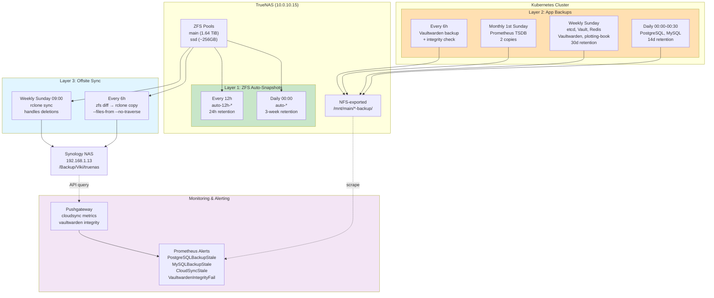
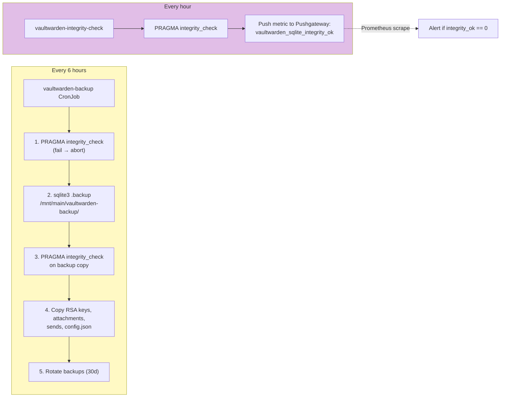
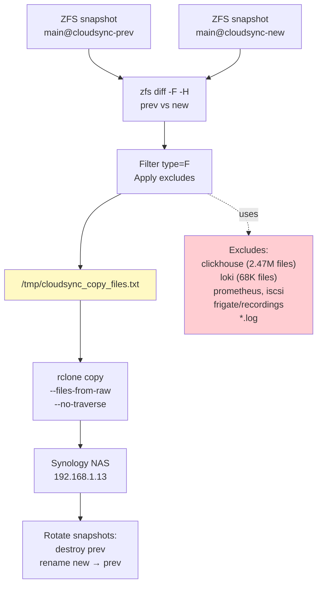

# Backup & Disaster Recovery Architecture

Last updated: 2026-03-24

## Overview

The homelab uses a defense-in-depth 3-layer backup strategy: Layer 1 provides near-instant local snapshots via ZFS auto-snapshots on TrueNAS (every 12h + daily, up to 3-week retention). Layer 2 adds application-level backups for complex stateful services (databases, Vault, etcd) via K8s CronJobs dumping to NFS-exported directories with 14-30 day retention. Layer 3 ensures offsite protection through hybrid incremental/full sync to a Synology NAS every 6 hours (incremental via ZFS diff) plus weekly full sync (Sunday 09:00) for cleanup. This architecture provides <1s RPO for file data, 6h RPO for offsite, and <30min RTO for most services.

## Architecture Diagram

### Overall Backup Flow



### Vaultwarden Enhanced Protection



### Incremental Offsite Sync



## Components

| Component | Version/Schedule | Location | Purpose |
|-----------|-----------------|----------|---------|
| ZFS Auto-Snapshots | Every 12h + daily | TrueNAS pools (main, ssd) | Near-instant local protection |
| PostgreSQL Backup | Daily 00:00, 14d retention | CronJob in `dbaas` namespace | pg_dumpall for 12 databases |
| MySQL Backup | Daily 00:30, 14d retention | CronJob in `dbaas` namespace | mysqldump for 7 databases |
| etcd Backup | Weekly Sunday 01:00, 30d | CronJob in `kube-system` | etcdctl snapshot |
| Vaultwarden Backup | Every 6h, 30d retention | CronJob in `vaultwarden` | sqlite3 .backup + integrity |
| Vault Backup | Weekly Sunday 02:00, 30d | CronJob in `vault` | raft snapshot |
| Redis Backup | Weekly Sunday 03:00, 30d | CronJob in `redis` | BGSAVE + copy |
| Prometheus Backup | Monthly 1st Sunday, 2 copies | CronJob in `monitoring` | TSDB snapshot → tar.gz |
| plotting-book Backup | Weekly Sunday 03:00, 30d | CronJob in `plotting-book` | sqlite3 .backup |
| LVM Thin Snapshots | Twice daily (00:00, 12:00), 7d | PVE host: `lvm-pvc-snapshot` | CoW snapshots of 13 proxmox-lvm PVCs |
| Incremental Sync | Every 6h (cron) | TrueNAS: `/root/cloudsync-copy.sh` | ZFS diff → rclone copy |
| Full Sync | Weekly Sunday 09:00 | TrueNAS Cloud Sync Task 1 | rclone sync with deletions |
| CloudSync Monitor | Every 6h (cron) | CronJob in `monitoring` | Query TrueNAS API → Pushgateway |
| Vaultwarden Integrity Check | Hourly | CronJob in `vaultwarden` | PRAGMA integrity_check → metric |

## How It Works

### Layer 1: ZFS Auto-Snapshots

ZFS snapshots are copy-on-write markers that capture filesystem state in <1 second with zero I/O overhead (only metadata).

**Schedule**:
| Pool | Frequency | Naming | Retention | Purpose |
|------|-----------|--------|-----------|---------|
| `main` | Every 12h | `auto-12h-YYYY-MM-DD_HH-MM` | 24 hours | Recover from recent mistakes |
| `main` | Daily 00:00 | `auto-YYYY-MM-DD_HH-MM` | 3 weeks | Point-in-time recovery |
| `ssd` | Every 12h | `auto-12h-YYYY-MM-DD_HH-MM` | 24 hours | Same as main |
| `ssd` | Daily 00:00 | `auto-YYYY-MM-DD_HH-MM` | 3 weeks | Same as main |

**Performance**: Snapshot creation takes <1s for both pools (tested 2026-03-23).

**Rollback**:
```bash
# List snapshots
zfs list -t snapshot | grep main/<service>

# Rollback to snapshot
zfs rollback main/<service>@auto-2026-03-23_00-00

# Clone snapshot (non-destructive)
zfs clone main/<service>@auto-2026-03-23_00-00 main/<service>-recovered
```

### Layer 1b: LVM Thin Snapshots (Proxmox CSI PVCs)

Native LVM thin snapshots provide crash-consistent point-in-time recovery for all 13 Proxmox CSI PVCs (~340Gi). These are CoW snapshots — instant creation, minimal overhead, sharing the thin pool's free space.

**Script**: `/usr/local/bin/lvm-pvc-snapshot` on PVE host (source: `infra/scripts/lvm-pvc-snapshot`)
**Schedule**: Twice daily (00:00, 12:00) via systemd timer, 7-day retention (max 14 snapshots per LV)
**Discovery**: Auto-discovers PVC LVs matching `vm-*-pvc-*` pattern in VG `pve` thin pool `data`

**Coverage**: All proxmox-lvm PVCs **except** `dbaas` and `monitoring` namespaces. These are excluded because:
- MySQL InnoDB, PostgreSQL, and Prometheus are high-churn (50%+ CoW divergence/hour)
- They already have app-level dumps (Layer 2)
- Including them causes ~36% write amplification; excluding them reduces overhead to ~0%

Snapshotted PVCs include: Redis, Vaultwarden, Calibre, Nextcloud, Forgejo, FreshRSS, ActualBudget, NovelApp, Headscale, Uptime Kuma, etc. (~20 low-churn LVs)

**Exclusion config**: `EXCLUDE_NAMESPACES` variable in script (default: `dbaas,monitoring`). Uses kubectl to resolve LV names dynamically.

**Monitoring**: Pushes metrics to Pushgateway via NodePort (30091). Alerts: `LVMSnapshotStale` (>24h), `LVMSnapshotFailing`, `LVMThinPoolLow` (<15% free).

**Restore**: `lvm-pvc-snapshot restore <pvc-lv> <snapshot-lv>` — auto-discovers K8s workload, scales down, swaps LVs, scales back up. See `docs/runbooks/restore-lvm-snapshot.md`.

### Layer 2: Application-Level Backups

K8s CronJobs run inside the cluster, dumping database/state to NFS-exported backup directories. Each service writes to `/mnt/main/<service>-backup/`.

**Why needed**: ZFS snapshots capture block-level state, but:
- Cannot restore individual databases from a PostgreSQL zvol snapshot
- iSCSI zvols are opaque to TrueNAS (raw blocks)
- Need point-in-time recovery for specific apps without full ZFS rollback

**Daily backups (00:00-00:30)**:
- **PostgreSQL** (`pg_dumpall`): Dumps all 12 databases to `/mnt/main/dbaas-backups/postgresql/`. Command: `pg_dumpall -h pg-cluster-rw.dbaas -U postgres | gzip -9 > backup-$(date +%Y%m%d).sql.gz`. 14-day rotation via `find -mtime +14 -delete`.
- **MySQL** (`mysqldump`): Dumps all 7 databases individually. Command: `mysqldump -h mysql-primary.dbaas --all-databases --single-transaction | gzip -9 > backup-$(date +%Y%m%d).sql.gz`. 14-day rotation.

**Weekly backups (Sunday 01:00-04:00)**:
- **etcd**: `etcdctl snapshot save /mnt/main/etcd-backup/snapshot-$(date +%Y%m%d).db`. 30-day retention. Critical for cluster recovery.
- **Vaultwarden**: See "Vaultwarden Enhanced Protection" below. 30-day retention.
- **Vault**: `vault operator raft snapshot save /mnt/main/vault-backup/snapshot-$(date +%Y%m%d).snap`. 30-day retention.
- **Redis**: `redis-cli BGSAVE` then copy RDB file. 30-day retention.
- **plotting-book**: `sqlite3 /data/db.sqlite ".backup '/mnt/main/plotting-book-backup/backup-$(date +%Y%m%d).sqlite'"`. 30-day retention.

**Monthly backups (1st Sunday 04:00)**:
- **Prometheus**: `curl -X POST http://localhost:9090/api/v1/admin/tsdb/snapshot` → tar.gz snapshot. Keeps 2 most recent copies (older ones purged).

### Vaultwarden Enhanced Protection

Vaultwarden stores sensitive password vault data in SQLite on an iSCSI volume. Extra safeguards prevent corruption:

**Every 6 hours** (vaultwarden-backup CronJob):
1. Run `PRAGMA integrity_check` on live database
2. If check fails → abort (alert fires)
3. If check passes → `sqlite3 .backup /mnt/main/vaultwarden-backup/db-$(date +%Y%m%d%H%M).sqlite`
4. Run `PRAGMA integrity_check` on backup copy
5. Copy RSA keys, attachments, sends folder, config.json
6. Rotate backups older than 30 days

**Every hour** (vaultwarden-integrity-check CronJob):
1. Run `PRAGMA integrity_check` on live database
2. Push metric to Pushgateway: `vaultwarden_sqlite_integrity_ok{status="ok"}=1` or `=0`
3. Prometheus scrapes Pushgateway and alerts on `integrity_ok == 0`

This provides both frequent backups (every 6h) AND continuous integrity monitoring (hourly).

### Layer 3: Offsite Sync to Synology NAS

Two complementary sync methods run on TrueNAS:

**Incremental COPY (every 6 hours)**:

Runs `/root/cloudsync-copy.sh` via cron. Uses ZFS diff to identify changed files since last sync, then copies only those files.

Flow:
1. Take new snapshot: `zfs snapshot main@cloudsync-new`
2. If previous snapshot exists: `zfs diff -F -H main@cloudsync-prev main@cloudsync-new`
3. Filter output:
   - Keep only `type=F` (files, not directories)
   - Apply excludes (clickhouse, loki, prometheus, etc.)
   - Write to `/tmp/cloudsync_copy_files.txt`
4. Run `rclone copy --files-from-raw /tmp/cloudsync_copy_files.txt --no-traverse`
5. Rotate snapshots: `zfs destroy cloudsync-prev`, `zfs rename cloudsync-new cloudsync-prev`

**Why fast**: Only changed files are transferred. ZFS diff is instant (metadata scan). `--no-traverse` skips SFTP directory scan.

**Fallback**: If no previous snapshot or >100k changed files → falls back to full `find` command.

**Weekly SYNC (Sunday 09:00)**:

TrueNAS Cloud Sync Task 1 runs `rclone sync` which:
- Mirrors source → destination (removes deleted files on destination)
- Full directory traversal (~30-60 min)
- Ensures offsite is clean (no orphaned files from renamed paths)

**Why both methods**:
- Incremental: Fast recovery for recent changes (seconds to minutes)
- Full sync: Cleanup pass to handle deletions, renames, edge cases

**Destination**: `sftp://192.168.1.13/Backup/Viki/truenas`

### Excludes (both incremental and full sync)

| Pattern | Reason | File count |
|---------|--------|-----------|
| `clickhouse/**` | Regenerable logs/metrics | 2.47M files |
| `loki/**` | Regenerable logs | 68K files |
| `iocage/**` | Legacy FreeBSD jails (unused) | 96K files |
| `frigate/**` | Ephemeral recordings/clips, trivial config | 57K+ files |
| `audiblez/**` | Generated audiobooks, regenerable from source ebooks | — |
| `ebook2audiobook/**` | Same service as audiblez, second volume | — |
| `ollama/**` | UI data (chat history/settings), low value | — |
| `real-estate-crawler/**` | Scraped property data, regenerable by re-crawling | — |
| `prometheus/**` | Covered by monthly app backup | Large TSDB |
| `crowdsec/**` | Regenerable threat intelligence | — |
| `servarr/downloads/**` | Transient download staging | — |
| `iscsi/**`, `iscsi-snaps/**` | Raw zvols, backed at app level | — |
| `ytldp/**` | YouTube downloads (replaceable) | — |
| `*.log` | Log files (regenerable) | — |
| `post` | Transient POST data | — |

### iSCSI Backup Architecture

iSCSI zvols are raw block devices exported to K8s nodes. TrueNAS cannot read the filesystem inside a zvol.

**Protection strategy**:
- **Layer 1**: ZFS snapshots cover zvols automatically (block-level)
- **Layer 2**: Application CronJobs inside pods dump data to NFS paths
- **Layer 3**: NFS paths sync offsite

**Current coverage**:
| Service | Storage | Layer 2 Backup | Offsite |
|---------|---------|----------------|---------|
| PostgreSQL CNPG (12 DBs) | iSCSI | ✓ daily | ✓ |
| MySQL InnoDB (7 DBs) | iSCSI | ✓ daily | ✓ |
| Vault | iSCSI | ✓ weekly | ✓ |
| Vaultwarden | iSCSI | ✓ 6h + integrity | ✓ |
| Redis | iSCSI | ✓ weekly | ✓ |
| plotting-book | iSCSI | ✓ weekly | ✓ |

**Convention**: Any new iSCSI-backed app MUST add a backup CronJob writing to `/mnt/main/<app>-backup/` in its Terraform stack.

**Uncovered (acceptable risk)**:
- Prometheus (disposable metrics, monthly TSDB backup for long-term trends)
- Loki (disposable logs)

### iSCSI Hardening

To prevent SQLite corruption from transient network disruptions, iSCSI initiator timeouts are relaxed on all K8s nodes:

| Setting | Default | Hardened | Impact |
|---------|---------|----------|--------|
| `node.session.timeo.replacement_timeout` | 120s | 300s | Time before declaring session dead |
| `node.conn[0].timeo.noop_out_interval` | 5s | 10s | Keepalive interval |
| `node.conn[0].timeo.noop_out_timeout` | 5s | 15s | Keepalive timeout |
| `node.conn[0].iscsi.HeaderDigest` | None | CRC32C,None | Error detection |
| `node.conn[0].iscsi.DataDigest` | None | CRC32C,None | Error detection |

**Applied to**: All 5 K8s nodes (k8s-master, k8s-node1-4) on 2026-03-23.

**Persistence**: Baked into cloud-init template (`modules/create-template-vm/cloud_init.yaml`) so new nodes get these settings automatically.

**Why needed**: Default 120s timeout is too aggressive. Brief network hiccup (5-10s) can trigger failover, causing SQLite to see incomplete writes → corruption. 300s timeout tolerates longer blips.

## Configuration

### Key Files

| Path | Purpose |
|------|---------|
| `/root/cloudsync-copy.sh` | TrueNAS: incremental sync script |
| `/var/log/cloudsync-copy.log` | TrueNAS: sync script log output |
| `stacks/dbaas/` | Terraform: PostgreSQL/MySQL backup CronJobs |
| `stacks/vault/` | Terraform: Vault backup CronJob |
| `stacks/vaultwarden/` | Terraform: Vaultwarden backup + integrity CronJobs |
| `stacks/monitoring/` | Terraform: CloudSync monitor, Prometheus backup |
| `modules/create-template-vm/cloud_init.yaml` | iSCSI hardening params for new nodes |
| `/etc/iscsi/iscsid.conf` | K8s nodes: iSCSI initiator config |

### Vault Paths

| Path | Contents |
|------|----------|
| `secret/viktor/truenas_api_key` | TrueNAS API key for CloudSync monitor |
| `secret/viktor/synology_ssh_key` | SSH key for Synology NAS SFTP access |

### Terraform Stacks

Each backup CronJob is defined in the application's stack:
- PostgreSQL/MySQL: `stacks/dbaas/backup.tf`
- Vault: `stacks/vault/backup.tf`
- Vaultwarden: `stacks/vaultwarden/backup.tf`
- etcd: `stacks/platform/etcd-backup.tf`
- Prometheus: `stacks/monitoring/prometheus-backup.tf`

## Decisions & Rationale

### Why 3 Layers?

**Layer 1 (ZFS snapshots)**:
- Near-instant (<1s), zero overhead
- Point-in-time recovery for entire datasets
- BUT: Cannot restore individual database records, no offsite protection

**Layer 2 (App backups)**:
- Granular restore (single DB, single table)
- Database-native tools (pg_dump, mysqldump) produce portable backups
- BUT: Higher overhead (CPU, I/O), longer RPO (daily/weekly)

**Layer 3 (Offsite)**:
- Protection against site-level disaster (fire, theft, catastrophic hardware failure)
- BUT: 6h RPO (incremental), connectivity dependency

All three together provide defense-in-depth.

### Why Not Velero/Longhorn Backup?

Evaluated K8s-native backup solutions (Velero, Longhorn):
- **Velero**: Requires object storage backend, complex restore, doesn't handle databases well
- **Longhorn**: High overhead (replicas, snapshots in-cluster), no offsite by default

**Current approach wins** because:
- Leverages existing ZFS infrastructure (already running TrueNAS)
- Database-native backups (pg_dump/mysqldump) are battle-tested
- Simple restore procedures (documented runbooks)

### Why Hybrid Incremental + Full Sync?

**Incremental alone** is risky:
- Deleted files on source never deleted on destination
- Renamed paths create duplicates
- No cleanup of orphaned snapshots

**Full sync alone** is slow:
- 30-60 min per run
- High network/CPU on both ends
- 6h RPO → 12h if a sync fails

**Hybrid approach**:
- Fast incremental every 6h (sub-minute runtime)
- Weekly full sync for cleanup (tolerates longer runtime)

### Why 6h Vaultwarden Backup vs Daily for Others?

Vaultwarden stores **password vault data** — highest-value target:
- User creates 10 new passwords → disaster 5h later → daily backup loses all 10
- 6h RPO acceptable for password vaults (industry standard is 1-24h)
- Hourly integrity checks detect corruption before it spreads to backups

Other services (MySQL, PostgreSQL):
- Mostly application data (not authentication secrets)
- Daily RPO acceptable per user tolerance
- Lower change velocity

## Troubleshooting

### PostgreSQL Backup Stale Alert

**Symptom**: `PostgreSQLBackupStale` firing in Prometheus

**Diagnosis**:
```bash
kubectl get cronjob -n dbaas
kubectl logs -n dbaas job/postgresql-backup-<timestamp>
```

**Common causes**:
- Pod OOMKilled (increase memory limit)
- NFS mount unavailable (check TrueNAS)
- pg_dumpall command failed (check PostgreSQL connectivity)

**Fix**:
1. If OOM: Increase `resources.limits.memory` in `stacks/dbaas/backup.tf`
2. If NFS: Verify mount on worker node, restart NFS server if needed
3. Manually trigger: `kubectl create job --from=cronjob/postgresql-backup manual-backup -n dbaas`

### CloudSync Stale/Failing

**Symptom**: `CloudSyncStale` or `CloudSyncFailing` alert

**Diagnosis**:
```bash
# SSH to TrueNAS
ssh root@10.0.10.15
cat /var/log/cloudsync-copy.log
zfs list -t snapshot | grep cloudsync
```

**Common causes**:
- Synology NAS unreachable (network, SFTP down)
- ZFS diff failed (snapshot deleted manually)
- rclone error (quota, permission)

**Fix**:
1. Verify Synology: `ping 192.168.1.13`, `ssh root@192.168.1.13`
2. Verify snapshots exist: `zfs list -t snapshot | grep cloudsync`
3. Manually run: `/root/cloudsync-copy.sh` (check output)
4. Check rclone config: `rclone ls synology:/Backup/Viki/truenas`

### Vaultwarden Integrity Check Failing

**Symptom**: `VaultwardenIntegrityFail` alert, `vaultwarden_sqlite_integrity_ok=0`

**Diagnosis**:
```bash
kubectl exec -n vaultwarden deployment/vaultwarden -- sqlite3 /data/db.sqlite3 "PRAGMA integrity_check;"
```

**Critical**: If integrity check fails, database is corrupt.

**Recovery**:
1. Stop writes: `kubectl scale deployment/vaultwarden --replicas=0 -n vaultwarden`
2. Restore from latest backup:
   ```bash
   # Find latest backup
   ls -lh /mnt/main/vaultwarden-backup/
   # Copy to pod volume
   kubectl cp /mnt/main/vaultwarden-backup/db-<latest>.sqlite \
     vaultwarden/vaultwarden-0:/data/db.sqlite3
   ```
3. Verify integrity on restored DB
4. Scale back up: `kubectl scale deployment/vaultwarden --replicas=1 -n vaultwarden`

### iSCSI Session Drops Causing Backup Failures

**Symptom**: Backup CronJob fails with "I/O error" or "Transport endpoint not connected"

**Diagnosis**:
```bash
# On K8s node
iscsiadm -m session
dmesg | grep -i iscsi
journalctl -u iscsid | tail -50
```

**Fix**:
1. Verify hardened timeouts applied: `iscsiadm -m node -o show | grep -E 'replacement_timeout|noop_out'`
2. If defaults: Apply hardening:
   ```bash
   iscsiadm -m node -o update -n node.session.timeo.replacement_timeout -v 300
   iscsiadm -m node -o update -n node.conn[0].timeo.noop_out_interval -v 10
   iscsiadm -m node -o update -n node.conn[0].timeo.noop_out_timeout -v 15
   iscsiadm -m node -o update -n node.conn[0].iscsi.HeaderDigest -v CRC32C,None
   iscsiadm -m node -o update -n node.conn[0].iscsi.DataDigest -v CRC32C,None
   ```
3. Restart session: `iscsiadm -m node -u && iscsiadm -m node -l`

### Missing Backup for New Service

**Symptom**: Added new service using iSCSI storage, no backup exists

**Fix**: Add backup CronJob in service's Terraform stack

**Template**:
```hcl
resource "kubernetes_cron_job_v1" "backup" {
  metadata {
    name      = "${var.service_name}-backup"
    namespace = kubernetes_namespace.service.metadata[0].name
  }
  spec {
    schedule = "0 3 * * 0"  # Weekly Sunday 03:00
    job_template {
      spec {
        template {
          spec {
            container {
              name  = "backup"
              image = "appropriate/image:tag"
              command = ["/bin/sh", "-c"]
              args = [
                <<-EOT
                TIMESTAMP=$(date +%Y%m%d)
                # Dump command here
                find /backup -mtime +30 -delete
                EOT
              ]
              volume_mount {
                name       = "data"
                mount_path = "/data"
              }
              volume_mount {
                name       = "backup"
                mount_path = "/backup"
              }
            }
            volume {
              name = "data"
              persistent_volume_claim {
                claim_name = kubernetes_persistent_volume_claim.data.metadata[0].name
              }
            }
            volume {
              name = "backup"
              persistent_volume_claim {
                claim_name = module.nfs_backup.pvc_name
              }
            }
          }
        }
      }
    }
  }
}

module "nfs_backup" {
  source     = "../../modules/kubernetes/nfs_volume"
  name       = "${var.service_name}-backup"
  namespace  = kubernetes_namespace.service.metadata[0].name
  nfs_server = var.nfs_server
  nfs_path   = "/mnt/main/${var.service_name}-backup"
}
```

## Monitoring & Alerting

```
┌────────────────────────────────────────────────────────────────┐
│                     Prometheus Alerts                           │
│                                                                 │
│  PostgreSQLBackupStale      > 36h since last success            │
│  MySQLBackupStale           > 36h since last success            │
│  EtcdBackupStale            > 8d  since last success            │
│  VaultBackupStale           > 8d  since last success            │
│  VaultwardenBackupStale     > 8d  since last success            │
│  RedisBackupStale           > 8d  since last success            │
│  PrometheusBackupStale      > 32d since last success            │
│  PlottingBookBackupStale    > 8d  since last success            │
│  CloudSyncStale             > 8d  since last success            │
│  CloudSyncNeverRun          task never completed                │
│  CloudSyncFailing           task in error state                 │
│  VaultwardenIntegrityFail   integrity_ok == 0                   │
└────────────────────────────────────────────────────────────────┘
```

**Metrics sources**:
- Backup CronJobs: Push `backup_last_success_timestamp` to Pushgateway on completion
- CloudSync monitor: Queries TrueNAS API every 6h, pushes `cloudsync_last_success_timestamp`
- Vaultwarden integrity: Pushes `vaultwarden_sqlite_integrity_ok` hourly

**Alert routing**:
- All backup alerts → Slack `#infra-alerts`
- Vaultwarden integrity fail → Slack `#infra-critical` (immediate action required)

## Service Protection Matrix

| Service | Layer 1 (ZFS) | Layer 2 (App) | Layer 3 (Offsite) | Storage |
|---------|:-------------:|:-------------:|:-----------------:|---------|
| **Databases** |
| PostgreSQL (12 DBs) | ✓ | ✓ daily | ✓ | iSCSI |
| MySQL (7 DBs) | ✓ | ✓ daily | ✓ | iSCSI |
| **Critical State** |
| Vault | ✓ | ✓ weekly | ✓ | iSCSI |
| etcd | ✓ | ✓ weekly | ✓ | local disk |
| Vaultwarden | ✓ | ✓ 6h + integrity | ✓ | iSCSI |
| Redis | ✓ | ✓ weekly | ✓ | iSCSI |
| **Applications** |
| Prometheus | ✓ | ✓ monthly | excluded | NFS |
| plotting-book | ✓ | ✓ weekly | ✓ | iSCSI |
| Immich | ✓ | — | ✓ | NFS |
| Forgejo | ✓ | — | ✓ | NFS |
| Paperless-ngx | ✓ | — | ✓ | NFS |
| Nextcloud | ✓ | — | ✓ | NFS |
| **Other NFS services** | ✓ | — | ✓ | NFS |

**Legend**:
- ✓ = Protected at this layer
- — = Not needed (simple file storage, ZFS snapshots sufficient)
- excluded = Too large/regenerable, not worth offsite bandwidth

**Note**: NFS-backed services with simple data (files, SQLite) rely on ZFS snapshots + offsite sync. Application-level backups are only needed for services with complex state (databases, Raft consensus, multi-file consistency requirements).

## Recovery Procedures

Detailed runbooks in `docs/runbooks/`:

- **`restore-postgresql.md`** — Restore individual database or full cluster from pg_dumpall backup
- **`restore-mysql.md`** — Restore MySQL databases from mysqldump backup
- **`restore-vault.md`** — Restore Vault from raft snapshot
- **`restore-vaultwarden.md`** — Restore password vault from sqlite3 backup
- **`restore-etcd.md`** — Restore etcd cluster from snapshot
- **`restore-full-cluster.md`** — Disaster recovery: rebuild cluster from offsite backups

**RTO estimates** (tested 2026-03-23):
- Single PostgreSQL database: <5 min
- Full MySQL cluster: <15 min
- Vault: <10 min
- Vaultwarden: <5 min
- etcd: <20 min (requires cluster rebuild)
- Full cluster from offsite: <4 hours (TrueNAS restore + K8s bootstrap + app deploys)

## Related

- **Architecture**: `docs/architecture/storage.md` (NFS/iSCSI storage layer)
- **Reference**: `.claude/reference/service-catalog.md` (which services need backups)
- **Runbooks**: `docs/runbooks/restore-*.md` (step-by-step recovery procedures)
- **Monitoring**: `stacks/monitoring/alerts/backup-alerts.yaml` (Prometheus alert definitions)
