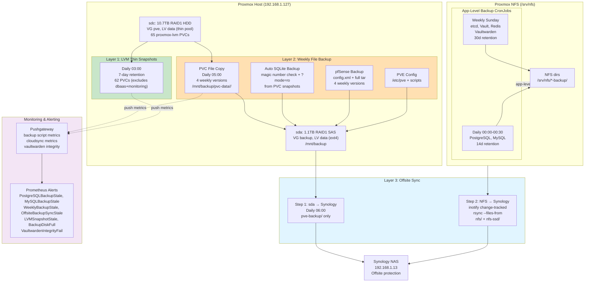
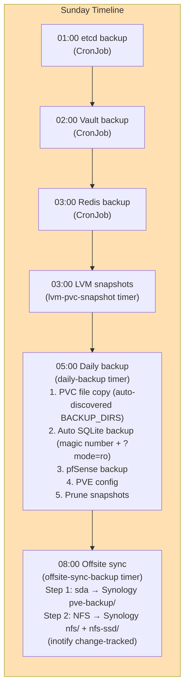
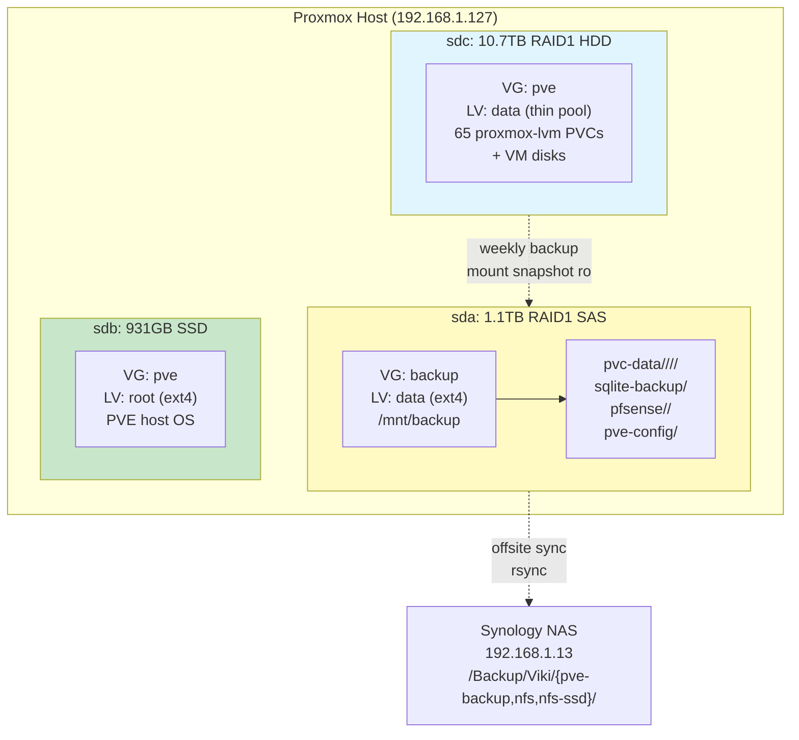
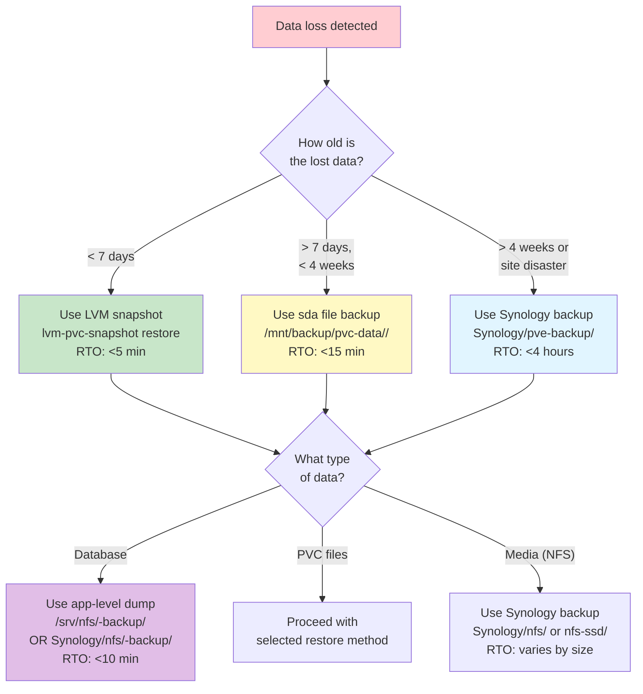
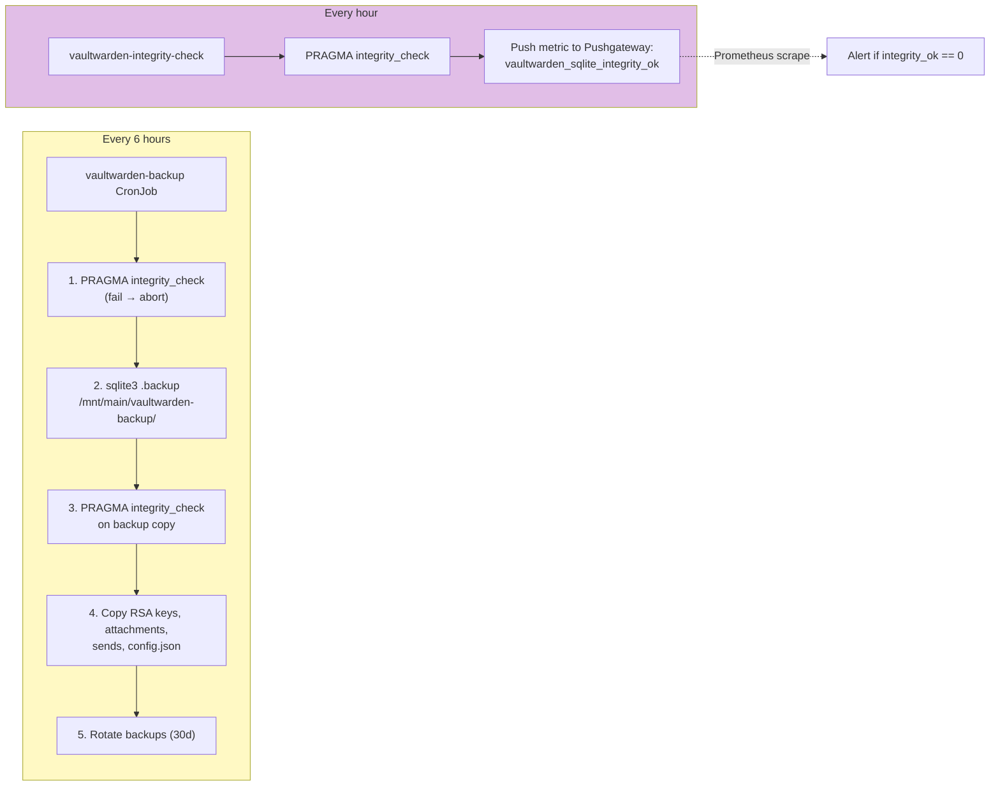

# Backup & Disaster Recovery Architecture

Last updated: 2026-04-13

## Overview

The homelab uses a defense-in-depth 3-2-1 backup strategy: **3 copies** (live PVCs on sdc, weekly backups on sda, offsite on Synology), **2 media types** (SSD thin LVM, HDD), **1 offsite copy** (Synology NAS). This architecture provides <1s RPO for recent changes (via 7-day LVM snapshots), <7d RPO for file-level recovery, and <30min RTO for most services.

**3-2-1 Breakdown**:
- **Copy 1** (live): All PVC data + VM disks on Proxmox sdc thin pool (10.7TB RAID1 HDD)
- **Copy 2** (local backup): Weekly file-level backup to sda `/mnt/backup` (1.1TB RAID1 SAS)
- **Copy 3** (offsite): Synology NAS at 192.168.1.13:
  - `Synology/Backup/Viki/pve-backup/` — PVC snapshots, pfSense, PVE config (rsync from sda weekly)
  - `Synology/Backup/Viki/nfs/` — NFS HDD data (inotify change-tracked rsync from `/srv/nfs`)
  - `Synology/Backup/Viki/nfs-ssd/` — NFS SSD data (inotify change-tracked rsync from `/srv/nfs-ssd`)

## Architecture Diagram

### Overall Backup Flow



### Weekly Backup Timeline



### Physical Disk Layout



### Restore Decision Tree



### Vaultwarden Enhanced Protection



## Components

| Component | Version/Schedule | Location | Purpose |
|-----------|-----------------|----------|---------|
| LVM Thin Snapshots | Daily 03:00, 7d retention | PVE host: `lvm-pvc-snapshot` | CoW snapshots of 62 proxmox-lvm PVCs |
| Daily PVC Backup | Daily 05:00, 4 weeks | PVE host: `daily-backup` | File-level PVC copy to sda |
| Auto SQLite Backup | Daily 05:00 + daily-backup | PVE host: magic number check + ?mode=ro | Safe SQLite backup from PVC snapshots |
| NFS Change Tracker | Continuous (inotifywait) | PVE host: `nfs-change-tracker.service` | Logs changed NFS file paths to `/mnt/backup/.nfs-changes.log` |
| pfSense Backup | Daily 05:00 + daily-backup | PVE host: SSH + API | config.xml + full filesystem tar |
| Offsite Sync | Daily 06:00 (after daily-backup) | PVE host: `offsite-sync-backup` | Two-step: sda→pve-backup + NFS→nfs/nfs-ssd via inotify |
| PostgreSQL Backup (full) | Daily 00:00, 14d retention | CronJob in `dbaas` namespace | pg_dumpall for all databases |
| PostgreSQL Backup (per-db) | Daily 00:15, 14d retention | CronJob in `dbaas` namespace | pg_dump -Fc per database → `/backup/per-db/<db>/` |
| MySQL Backup (full) | Daily 00:30, 14d retention | CronJob in `dbaas` namespace | mysqldump --all-databases |
| MySQL Backup (per-db) | Daily 00:45, 14d retention | CronJob in `dbaas` namespace | mysqldump per database → `/backup/per-db/<db>/` |
| etcd Backup | Weekly Sunday 01:00, 30d | CronJob in `kube-system` | etcdctl snapshot |
| Vaultwarden Backup | Every 6h, 30d retention | CronJob in `vaultwarden` | sqlite3 .backup + integrity |
| Vault Backup | Weekly Sunday 02:00, 30d | CronJob in `vault` | raft snapshot |
| Redis Backup | Weekly Sunday 03:00, 30d | CronJob in `redis` | BGSAVE + copy |
| Vaultwarden Integrity Check | Hourly | CronJob in `vaultwarden` | PRAGMA integrity_check → metric |
| ~~TrueNAS Cloud Sync~~ | **DECOMMISSIONED** | Was TrueNAS Cloud Sync Task 1 | Replaced by offsite-sync-backup |

## How It Works

### Layer 1: LVM Thin Snapshots (Fast Local Recovery)

Native LVM thin snapshots provide crash-consistent point-in-time recovery for 62 Proxmox CSI PVCs. These are CoW snapshots — instant creation, minimal overhead, sharing the thin pool's free space.

**Script**: `/usr/local/bin/lvm-pvc-snapshot` on PVE host (source: `infra/scripts/lvm-pvc-snapshot`)
**Schedule**: Daily 03:00 via systemd timer, 7-day retention
**Discovery**: Auto-discovers PVC LVs matching `vm-*-pvc-*` pattern in VG `pve` thin pool `data`

**Coverage**: All 65 proxmox-lvm PVCs **except** `dbaas` and `monitoring` namespaces. These are excluded because:
- MySQL InnoDB, PostgreSQL, and Prometheus are high-churn (50%+ CoW divergence/hour)
- They already have app-level dumps (Layer 2)
- Including them causes ~36% write amplification; excluding them reduces overhead to ~0%

**Monitoring**: Pushes metrics to Pushgateway via NodePort (30091). Alerts: `LVMSnapshotStale` (>24h), `LVMSnapshotFailing`, `LVMThinPoolLow` (<15% free).

**Restore**: `lvm-pvc-snapshot restore <pvc-lv> <snapshot-lv>` — auto-discovers K8s workload, scales down, swaps LVs, scales back up. See `docs/runbooks/restore-lvm-snapshot.md`.

### Layer 2: Weekly File-Level Backup (sda Backup Disk)

**Backup disk**: sda (1.1TB RAID1 SAS) → VG `backup` → LV `data` → ext4 → mounted at `/mnt/backup` on PVE host. Dedicated backup disk, independent of live storage.

**Script**: `/usr/local/bin/daily-backup` on PVE host (source: `infra/scripts/daily-backup`)
**Schedule**: Daily 05:00 via systemd timer
**Retention**: 4 weekly versions (weeks 0-3 via `--link-dest` hardlink dedup)

#### What Gets Backed Up

**1. PVC File Copies** (`/mnt/backup/pvc-data/<YYYY-WW>/`):
- Mount each LVM thin LV ro on PVE host → rsync files (not block) → unmount
- 62 PVCs covered (all except dbaas + monitoring)
- Organized as `/mnt/backup/pvc-data/<YYYY-WW>/<namespace>/<pvc-name>/`
- 4 weekly versions with `--link-dest` hardlink dedup (unchanged files share inodes)

**2. Auto SQLite Backup** (`/mnt/backup/sqlite-backup/`):
- Detects SQLite databases in PVC snapshots via magic number check (`SQLite format 3`)
- Opens each database with `?mode=ro` (read-only, safe — no WAL replay)
- Runs `.backup` to create a consistent copy
- Covers all SQLite files across all PVC snapshots automatically

**3. pfSense Backup** (`/mnt/backup/pfsense/<YYYY-WW>/`):
- `config.xml` via API (base64 decode)
- Full filesystem tar via SSH (`tar czf /tmp/pfsense-full.tar.gz /cf /var/db /boot/loader.conf`)
- 4 weekly versions

**4. PVE Config** (`/mnt/backup/pve-config/`):
- `/etc/pve/` (cluster config, VM definitions)
- `/usr/local/bin/` (custom scripts)
- `/etc/systemd/system/` (timers)
- Single copy (no rotation)

**Auto-discovered BACKUP_DIRS**: Uses glob-based discovery instead of a hardcoded list. Any new PVC LV matching `vm-*-pvc-*` is automatically included.

**Snapshot Pruning**: Deletes LVM snapshots older than 7 days (safety net for snapshots that outlive `lvm-pvc-snapshot` timer).

**Monitoring**: Pushes `backup_weekly_last_success_timestamp` to Pushgateway. Alerts: `WeeklyBackupStale` (>8d), `WeeklyBackupFailing`.

### Layer 2b: Application-Level Backups

K8s CronJobs run inside the cluster, dumping database/state to NFS-exported backup directories. Each service writes to `/srv/nfs/<service>-backup/` (some legacy paths still use `/mnt/main/<service>-backup/`).

**Why needed**: LVM snapshots capture block-level state, but:
- Cannot restore individual databases from a PostgreSQL snapshot
- Proxmox CSI LVs are opaque raw block devices
- Need point-in-time recovery for specific apps without full LVM rollback

**Daily backups (00:00-00:30)**:
- **PostgreSQL full** (`pg_dumpall`, 00:00): Dumps all databases to `/mnt/main/postgresql-backup/dump_*.sql.gz`. 14-day rotation.
- **PostgreSQL per-db** (`pg_dump -Fc`, 00:15): Dumps each database individually to `/mnt/main/postgresql-backup/per-db/<dbname>/dump_*.dump`. Enables single-database restore via `pg_restore -d <db> --clean --if-exists`. 14-day rotation.
- **MySQL full** (`mysqldump --all-databases`, 00:30): Dumps all databases to `/mnt/main/mysql-backup/dump_*.sql.gz`. 14-day rotation.
- **MySQL per-db** (`mysqldump`, 00:45): Dumps each database individually to `/mnt/main/mysql-backup/per-db/<dbname>/dump_*.sql.gz`. Enables single-database restore. 14-day rotation.

**Daily backups (Sunday 01:00-04:00)**:
- **etcd**: `etcdctl snapshot save /mnt/main/etcd-backup/snapshot-$(date +%Y%m%d).db`. 30-day retention. Critical for cluster recovery.
- **Vaultwarden**: See "Vaultwarden Enhanced Protection" below. 30-day retention.
- **Vault**: `vault operator raft snapshot save /mnt/main/vault-backup/snapshot-$(date +%Y%m%d).snap`. 30-day retention.
- **Redis**: `redis-cli BGSAVE` then copy RDB file. 30-day retention.

### Vaultwarden Enhanced Protection

Vaultwarden stores sensitive password vault data in SQLite on a proxmox-lvm volume. Extra safeguards prevent corruption:

**Every 6 hours** (vaultwarden-backup CronJob):
1. Run `PRAGMA integrity_check` on live database
2. If check fails → abort (alert fires)
3. If check passes → `sqlite3 .backup /mnt/main/vaultwarden-backup/db-$(date +%Y%m%d%H%M).sqlite`
4. Run `PRAGMA integrity_check` on backup copy
5. Copy RSA keys, attachments, sends folder, config.json
6. Rotate backups older than 30 days

**Every hour** (vaultwarden-integrity-check CronJob):
1. Run `PRAGMA integrity_check` on live database
2. Push metric to Pushgateway: `vaultwarden_sqlite_integrity_ok{status="ok"}=1` or `=0`
3. Prometheus scrapes Pushgateway and alerts on `integrity_ok == 0`

This provides both frequent backups (every 6h) AND continuous integrity monitoring (hourly).

### Layer 3: Offsite Sync to Synology NAS

**Script**: `/usr/local/bin/offsite-sync-backup` on PVE host (source: `infra/scripts/offsite-sync-backup`)
**Schedule**: Daily 06:00 via systemd timer (After=daily-backup.service)

Two-step offsite sync:

#### Step 1: sda to Synology pve-backup/

**Method**: `rsync` from `/mnt/backup/` to `synology.viktorbarzin.lan:/Backup/Viki/pve-backup/`
**Content**: PVC snapshots (`pvc-data/`), pfSense backups, PVE config, SQLite backups only. NFS data is no longer on sda.

**Destination**: `Synology/Backup/Viki/pve-backup/`:
- `pvc-data/<YYYY-WW>/` — 4 weekly PVC file backups
- `sqlite-backup/` — auto SQLite backups
- `pfsense/<YYYY-WW>/` — 4 weekly pfSense backups
- `pve-config/` — latest PVE config

#### Step 2: NFS to Synology nfs/ + nfs-ssd/ (inotify change-tracked)

**Method**: `rsync --files-from /mnt/backup/.nfs-changes.log` — two calls, one for `/srv/nfs` to `nfs/`, one for `/srv/nfs-ssd` to `nfs-ssd/`
**Change tracking**: `nfs-change-tracker.service` (systemd, inotifywait) on PVE host watches `/srv/nfs` and `/srv/nfs-ssd` continuously. Changed file paths are logged to `/mnt/backup/.nfs-changes.log`. The offsite sync reads this log and transfers only changed files. Incremental syncs complete in seconds instead of 30+ minutes.
**Monthly full sync**: On 1st Sunday of month, runs `rsync --delete` for cleanup (removes orphaned files on Synology).

**Destination**:
- `Synology/Backup/Viki/nfs/` — mirrors `/srv/nfs` (renamed from `truenas/`)
- `Synology/Backup/Viki/nfs-ssd/` — mirrors `/srv/nfs-ssd`

**Monitoring**: Pushes `offsite_backup_sync_last_success_timestamp` to Pushgateway. Alerts: `OffsiteBackupSyncStale` (>8d), `OffsiteBackupSyncFailing`.

#### ~~TrueNAS Cloud Sync~~ — DECOMMISSIONED

> TrueNAS Cloud Sync was decommissioned along with TrueNAS (2026-04). The `Synology/Backup/Viki/truenas/` directory was renamed to `nfs/` to reflect the new consolidated layout.

## Configuration

### Key Files

| Path | Purpose |
|------|---------|
| `/usr/local/bin/lvm-pvc-snapshot` | PVE host: LVM snapshot creation + restore |
| `/usr/local/bin/daily-backup` | PVE host: PVC file copy + auto SQLite backup + pfSense |
| `/usr/local/bin/offsite-sync-backup` | PVE host: two-step rsync to Synology (sda + NFS via inotify) |
| `/mnt/backup/` | PVE host: sda mount point (1.1TB backup disk) |
| `/mnt/backup/.nfs-changes.log` | NFS change log from inotifywait, consumed by offsite-sync |
| `/etc/systemd/system/nfs-change-tracker.service` | inotifywait watcher for `/srv/nfs` + `/srv/nfs-ssd` |
| `/etc/systemd/system/lvm-pvc-snapshot.timer` | Daily 03:00 (LVM snapshots) |
| `/etc/systemd/system/daily-backup.timer` | Daily 05:00 (file backup) |
| `/etc/systemd/system/offsite-sync-backup.timer` | Daily 06:00 (offsite sync) |
| `stacks/dbaas/` | Terraform: PostgreSQL/MySQL backup CronJobs |
| `stacks/vault/` | Terraform: Vault backup CronJob |
| `stacks/vaultwarden/` | Terraform: Vaultwarden backup + integrity CronJobs |
| `stacks/monitoring/` | Terraform: Prometheus alerts |

### Vault Paths

| Path | Contents |
|------|----------|
| `secret/viktor/synology_ssh_key` | SSH key for Synology NAS SFTP access |
| `secret/viktor/pfsense_api_key` | pfSense API key + secret for config backup |

### Terraform Stacks

Each backup CronJob is defined in the application's stack:
- PostgreSQL/MySQL: `stacks/dbaas/backup.tf`
- Vault: `stacks/vault/backup.tf`
- Vaultwarden: `stacks/vaultwarden/backup.tf`
- etcd: `stacks/platform/etcd-backup.tf`

## Decisions & Rationale

### Why 3-2-1 Strategy?

**3 copies**:
- Live PVCs (zero RTO for recent data)
- sda local backup (fast recovery without network)
- Synology offsite (site-level disaster protection)

**2 media types**:
- sdc SSD (live, low latency)
- sda HDD (backup, cost-effective bulk storage)

**1 offsite**:
- Protection against fire, theft, catastrophic hardware failure
- Weekly RPO acceptable for offsite (daily/weekly app backups reduce exposure)

### Why File-Level + Block-Level Snapshots?

**LVM snapshots** (Layer 1):
- Near-instant (<1s), zero overhead
- Point-in-time recovery for entire PVCs
- BUT: Cannot restore individual files, no offsite protection, 7-day retention

**File-level backup** (Layer 2):
- Can restore single files or directories
- Offsite-compatible (rsync)
- Longer retention (4 weeks local, unlimited offsite)
- BUT: Slower RTO (rsync), higher storage overhead

Both together provide flexibility: fast local rollback for recent changes, granular recovery for older data.

### Why Dedicated Backup Disk (sda)?

**Isolation**: If sdc fails (thin pool corruption, controller failure), sda is independent (different disk, different VG).

**Performance**: Backup I/O doesn't compete with live PVC I/O.

**Simplicity**: Single mount point (`/mnt/backup/`) for all backup data, easy to monitor disk usage.

### Why Not Velero/Longhorn Backup?

Evaluated K8s-native backup solutions (Velero, Longhorn):
- **Velero**: Requires object storage backend, complex restore, doesn't handle databases well
- **Longhorn**: High overhead (replicas, snapshots in-cluster), no offsite by default

**Current approach wins** because:
- Leverages existing Proxmox LVM infrastructure (already running)
- Database-native backups (pg_dump/mysqldump) are battle-tested
- Simple restore procedures (documented runbooks)
- Lower resource overhead (no in-cluster replicas)

### Why Hybrid Incremental + Full Sync?

**Incremental alone** (rsync --files-from via inotify change log) is risky:
- Deleted files on source never deleted on destination
- Renamed paths create duplicates
- No cleanup of orphaned files

**Full sync alone** (rsync --delete) is slow:
- 30-60 min per run (all files scanned)
- 7d RPO → 14d if a sync fails

**Hybrid approach**:
- Fast incremental weekly via inotify change tracking (completes in seconds)
- Monthly full `rsync --delete` for cleanup (tolerates longer runtime)

### Why 6h Vaultwarden Backup vs Daily for Others?

Vaultwarden stores **password vault data** — highest-value target:
- User creates 10 new passwords → disaster 5h later → daily backup loses all 10
- 6h RPO acceptable for password vaults (industry standard is 1-24h)
- Hourly integrity checks detect corruption before it spreads to backups

Other services (MySQL, PostgreSQL):
- Mostly application data (not authentication secrets)
- Daily RPO acceptable per user tolerance
- Lower change velocity

## Troubleshooting

### LVM Snapshot Restore Issues

See `docs/runbooks/restore-lvm-snapshot.md`.

### Weekly Backup Failing

**Symptom**: `WeeklyBackupStale` or `WeeklyBackupFailing` alert

**Diagnosis**:
```bash
ssh root@192.168.1.127
systemctl status daily-backup.service
journalctl -u daily-backup.service --since "7 days ago"
df -h /mnt/backup
```

**Common causes**:
- Backup disk full (check `df -h /mnt/backup`, alert: `BackupDiskFull`)
- LV mount failed (check `lvs pve`, `dmesg | grep backup`)
- NFS mount failed (check `showmount -e 192.168.1.127`)

**Fix**:
1. If disk full: Clean up old weekly versions manually, adjust retention
2. If LV mount failed: `lvchange -ay backup/data && mount /mnt/backup`
3. If NFS failed: Check Proxmox NFS availability (`showmount -e 192.168.1.127`), verify exports
4. Manually trigger: `systemctl start daily-backup.service`

### Offsite Sync Failing

**Symptom**: `OffsiteBackupSyncStale` or `OffsiteBackupSyncFailing` alert

**Diagnosis**:
```bash
ssh root@192.168.1.127
systemctl status offsite-sync-backup.service
journalctl -u offsite-sync-backup.service --since "7 days ago"
wc -l /mnt/backup/.nfs-changes.log  # verify change log exists
systemctl status nfs-change-tracker.service  # verify inotify watcher
```

**Common causes**:
- Synology NAS unreachable (network, SFTP down)
- SSH key auth failed (permissions, expired key)
- nfs-change-tracker.service stopped (no change log)

**Fix**:
1. Verify Synology: `ping 192.168.1.13`, `ssh root@192.168.1.13`
2. Verify SSH key: `ssh -i /root/.ssh/synology_backup root@192.168.1.13`
3. Verify change tracker running: `systemctl status nfs-change-tracker.service`
4. Manually trigger: `systemctl start offsite-sync-backup.service`

### PostgreSQL Backup Stale Alert

**Symptom**: `PostgreSQLBackupStale` firing in Prometheus

**Diagnosis**:
```bash
kubectl get cronjob -n dbaas
kubectl logs -n dbaas job/postgresql-backup-<timestamp>
```

**Common causes**:
- Pod OOMKilled (increase memory limit)
- NFS mount unavailable (check Proxmox NFS)
- pg_dumpall command failed (check PostgreSQL connectivity)

**Fix**:
1. If OOM: Increase `resources.limits.memory` in `stacks/dbaas/backup.tf`
2. If NFS: Verify mount on worker node, restart NFS server on Proxmox host if needed (`systemctl restart nfs-server`)
3. Manually trigger: `kubectl create job --from=cronjob/postgresql-backup manual-backup -n dbaas`

### Vaultwarden Integrity Check Failing

**Symptom**: `VaultwardenIntegrityFail` alert, `vaultwarden_sqlite_integrity_ok=0`

**Diagnosis**:
```bash
kubectl exec -n vaultwarden deployment/vaultwarden -- sqlite3 /data/db.sqlite3 "PRAGMA integrity_check;"
```

**Critical**: If integrity check fails, database is corrupt.

**Recovery**:
1. Stop writes: `kubectl scale deployment/vaultwarden --replicas=0 -n vaultwarden`
2. Restore from latest backup (see `restore-vaultwarden.md`)
3. Verify integrity on restored DB
4. Scale back up: `kubectl scale deployment/vaultwarden --replicas=1 -n vaultwarden`

### pfSense Backup Failing

**Symptom**: `PfsenseBackupStale` alert (if implemented)

**Diagnosis**:
```bash
ssh root@192.168.1.127
systemctl status daily-backup.service | grep -A5 pfsense
```

**Common causes**:
- API key expired/invalid
- SSH auth failed (password changed, key rejected)
- pfSense unreachable

**Fix**:
1. Verify API key: `curl -k https://pfsense.viktorbarzin.me/api/v1/system/config -H "Authorization: <key>"`
2. Verify SSH: `ssh root@pfsense.viktorbarzin.me`
3. Update credentials in Vault `secret/viktor/pfsense_api_key`

### Backup Disk Full

**Symptom**: `BackupDiskFull` alert, `df -h /mnt/backup` >85%

**Fix**:
```bash
ssh root@192.168.1.127

# Check space usage by component
du -sh /mnt/backup/pvc-data/*
du -sh /mnt/backup/pfsense/*
du -sh /mnt/backup/sqlite-backup

# Clean up old weekly versions (keep latest 2)
find /mnt/backup/pvc-data -maxdepth 1 -type d -name "????-??" | sort | head -n -2 | xargs rm -rf
find /mnt/backup/pfsense -maxdepth 1 -type d -name "????-??" | sort | head -n -2 | xargs rm -rf
```

### Missing Backup for New Service

**Symptom**: Added new service using proxmox-lvm storage, no backup exists

**Fix**: The service is automatically covered by:
1. **LVM snapshots** (if not in dbaas/monitoring namespace) — automatic, no config needed
2. **Weekly file backup** — automatic, no config needed

**If the service has a database that needs app-level dumps**:
Add backup CronJob in service's Terraform stack (see template below).

**Template**:
```hcl
resource "kubernetes_cron_job_v1" "backup" {
  metadata {
    name      = "${var.service_name}-backup"
    namespace = kubernetes_namespace.service.metadata[0].name
  }
  spec {
    schedule = "0 3 * * 0"  # Weekly Sunday 03:00
    job_template {
      spec {
        template {
          spec {
            container {
              name  = "backup"
              image = "appropriate/image:tag"
              command = ["/bin/sh", "-c"]
              args = [
                <<-EOT
                TIMESTAMP=$(date +%Y%m%d)
                # Dump command here (sqlite3 .backup, pg_dump, etc.)
                find /backup -mtime +30 -delete
                EOT
              ]
              volume_mount {
                name       = "data"
                mount_path = "/data"
              }
              volume_mount {
                name       = "backup"
                mount_path = "/backup"
              }
            }
            volume {
              name = "data"
              persistent_volume_claim {
                claim_name = kubernetes_persistent_volume_claim.data.metadata[0].name
              }
            }
            volume {
              name = "backup"
              persistent_volume_claim {
                claim_name = module.nfs_backup.pvc_name
              }
            }
          }
        }
      }
    }
  }
}

module "nfs_backup" {
  source     = "../../modules/kubernetes/nfs_volume"
  name       = "${var.service_name}-backup"
  namespace  = kubernetes_namespace.service.metadata[0].name
  nfs_server = var.nfs_server
  nfs_path   = "/srv/nfs/${var.service_name}-backup"
}
```

## Monitoring & Alerting

```
┌────────────────────────────────────────────────────────────────┐
│                     Prometheus Alerts                           │
│                                                                 │
│  PostgreSQLBackupStale      > 36h since last success            │
│  MySQLBackupStale           > 36h since last success            │
│  EtcdBackupStale            > 8d  since last success            │
│  VaultBackupStale           > 8d  since last success            │
│  VaultwardenBackupStale     > 8d  since last success            │
│  RedisBackupStale           > 8d  since last success            │
│  ~~CloudSyncStale~~         REMOVED (TrueNAS decommissioned)    │
│  ~~CloudSyncNeverRun~~      REMOVED (TrueNAS decommissioned)    │
│  ~~CloudSyncFailing~~       REMOVED (TrueNAS decommissioned)    │
│  VaultwardenIntegrityFail   integrity_ok == 0                   │
│  LVMSnapshotStale           > 24h since last snapshot           │
│  LVMSnapshotFailing         snapshot creation failed            │
│  LVMThinPoolLow             < 15% free space in thin pool       │
│  WeeklyBackupStale          > 8d  since last success            │
│  WeeklyBackupFailing        backup script exited non-zero       │
│  PfsenseBackupStale         > 8d  since last success            │
│  OffsiteBackupSyncStale     > 8d  since last success            │
│  BackupDiskFull             > 85% usage on /mnt/backup          │
└────────────────────────────────────────────────────────────────┘
```

**Metrics sources**:
- Backup CronJobs: Push `backup_last_success_timestamp` to Pushgateway on completion
- LVM snapshot script: Pushes `lvm_snapshot_last_success_timestamp`, `lvm_snapshot_count`, `lvm_thin_pool_free_percent`
- Daily backup script: Pushes `backup_weekly_last_success_timestamp`, `backup_disk_usage_percent`
- Offsite sync script: Pushes `offsite_backup_sync_last_success_timestamp`
- ~~CloudSync monitor~~: Removed (TrueNAS decommissioned)
- Vaultwarden integrity: Pushes `vaultwarden_sqlite_integrity_ok` hourly

**Alert routing**:
- All backup alerts → Slack `#infra-alerts`
- Vaultwarden integrity fail → Slack `#infra-critical` (immediate action required)

## Service Protection Matrix

| Service | LVM Snapshots (7d) | File Backup (4w) | App Backup | Offsite | Storage |
|---------|:------------------:|:----------------:|:----------:|:-------:|---------|
| **Databases** |
| PostgreSQL (all DBs) | — | — | ✓ daily | ✓ | proxmox-lvm |
| MySQL (all DBs) | — | — | ✓ daily | ✓ | proxmox-lvm |
| **Critical State** |
| Vault | ✓ | ✓ | ✓ weekly | ✓ | proxmox-lvm |
| etcd | ✓ | ✓ | ✓ weekly | ✓ | proxmox-lvm |
| Vaultwarden | ✓ | ✓ | ✓ 6h + integrity | ✓ | proxmox-lvm |
| Redis | ✓ | ✓ | ✓ weekly | ✓ | proxmox-lvm |
| **Applications (65 proxmox-lvm PVCs)** |
| Prometheus | — | — | — | excluded | proxmox-lvm |
| Nextcloud | ✓ | ✓ | — | ✓ | proxmox-lvm |
| Calibre-Web | ✓ | ✓ | — | ✓ | proxmox-lvm |
| Forgejo | ✓ | ✓ | — | ✓ | proxmox-lvm |
| FreshRSS | ✓ | ✓ | — | ✓ | proxmox-lvm |
| ActualBudget | ✓ | ✓ | — | ✓ | proxmox-lvm |
| NovelApp | ✓ | ✓ | — | ✓ | proxmox-lvm |
| Headscale | ✓ | ✓ | — | ✓ | proxmox-lvm |
| Uptime Kuma | ✓ | ✓ | — | ✓ | proxmox-lvm |
| **Media (NFS)** |
| Immich (~800GB) | — | — | — | ✓ | NFS |
| Audiobookshelf | — | — | — | ✓ | NFS |
| Servarr | — | — | — | ✓ | NFS |
| Navidrome | — | — | — | ✓ | NFS |

**Legend**:
- ✓ = Protected at this layer
- — = Not needed (other layers cover it, or data is regenerable/disposable)
- excluded = Too large/regenerable, not worth offsite bandwidth

**Note**: All 65 proxmox-lvm PVCs get LVM snapshots (except dbaas+monitoring = 3 PVCs) + file-level backup (except dbaas+monitoring). NFS-backed media syncs directly to Synology `nfs/` and `nfs-ssd/` via inotify change tracking.

## Recovery Procedures

Detailed runbooks in `docs/runbooks/`:

- **`restore-lvm-snapshot.md`** — Instant rollback of a PVC using LVM snapshot (RTO <5 min)
- **`restore-pvc-from-backup.md`** — Restore a PVC from sda file backup (when snapshots expired)
- **`restore-postgresql.md`** — Restore individual database (from per-db `pg_dump -Fc`) or full cluster (from `pg_dumpall`)
- **`restore-mysql.md`** — Restore individual database (from per-db `mysqldump`) or full cluster (from `mysqldump --all-databases`)
- **`restore-vault.md`** — Restore Vault from raft snapshot
- **`restore-vaultwarden.md`** — Restore password vault from sqlite3 backup
- **`restore-etcd.md`** — Restore etcd cluster from snapshot
- **`restore-full-cluster.md`** — Disaster recovery: rebuild cluster from offsite backups

**RTO estimates**:
- LVM snapshot rollback: <5 min (instant swap)
- File-level restore from sda: <15 min (depends on PVC size)
- Single PostgreSQL database: <5 min
- Full MySQL cluster: <15 min
- Vault: <10 min
- Vaultwarden: <5 min
- etcd: <20 min (requires cluster rebuild)
- Full cluster from offsite: <4 hours (NFS restore + K8s bootstrap + app deploys)

## Related

- **Architecture**: `docs/architecture/storage.md` (NFS/Proxmox storage layer)
- **Reference**: `.claude/reference/service-catalog.md` (which services need backups)
- **Runbooks**: `docs/runbooks/restore-*.md` (step-by-step recovery procedures)
- **Monitoring**: `stacks/monitoring/alerts/backup-alerts.yaml` (Prometheus alert definitions)
