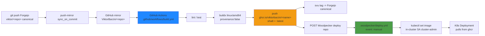

# CI/CD Pipeline

## Overview

**Doctrine (ADR-0002): all image builds and CI compute run OFF-infra.** Every
owned image is built, tested, and linted on **GitHub Actions** (free on public
repos; 2000 free min/mo on private) and pushed to **`ghcr.io/viktorbarzin/<name>`**.
Woodpecker is **deploy-only** — a GHA job POSTs its API with the freshly-built
image tag and Woodpecker runs `kubectl set image` from inside the cluster.
There are **no in-cluster image builds or CI test runs anywhere** — the
in-cluster Woodpecker buildkit and the fallback-build pattern were removed as a
clean cut (ADR-0002, 2026-06-13). The Forgejo container registry is **frozen
and emptied** — break-glass only.

This breaks the old circular dependency (images needed to repair the cluster
used to be built and stored *inside* it) and keeps build IO + registry pushes
off the homelab spindle.

## Architecture Diagram



## Components

| Component | Location | Purpose |
|-----------|----------|---------|
| GitHub Actions | `.github/workflows/build.yml` (per repo) | Build + lint + test + push image; trigger deploy; cut semver tag |
| ghcr.io | `ghcr.io/viktorbarzin/*` | Container registry for ALL owned images (public + private packages) |
| Woodpecker CI | `ci.viktorbarzin.me` | **Deploy-only** — `kubectl set image` in-cluster; plus infra applies + maintenance crons |
| Forgejo | `forgejo.viktorbarzin.me/viktor/<repo>` | **Canonical** git source (push-mirrors to GitHub). Container registry **FROZEN** (break-glass only) |
| Pull-Through Cache | `10.0.20.10:5000/5010/5020/5030/5040` | LAN cache for upstream registries (DockerHub, ghcr, Quay, k8s.gcr, Kyverno) |
| Kyverno | `kyverno` namespace | Syncs `ghcr-credentials` (private-ghcr allowlist) + `registry-credentials` to namespaces |
| Vault | `vault.viktorbarzin.me` | K8s auth for Woodpecker deploy pipelines; CI tokens in `secret/ci/global` + `secret/viktor` |

## How It Works

### The fleet pattern (every owned app)

1. **Canonical source = Forgejo** `viktor/<repo>`. A **push-mirror**
   (`sync_on_commit`) pushes every commit to the GitHub mirror
   `ViktorBarzin/<repo>`. The `.github/workflows/build.yml` is committed on
   Forgejo and mirrors over.
2. **GHA `build` job** (triggers `on: push: branches: [master]` ONLY — feature
   branches mirror but build/deploy nothing, the safety valve):
   - lint + test
   - `svu` computes the next `vX.Y.Z` from conventional commits and pushes the
     tag back to **canonical Forgejo** (GHA secret `FORGEJO_GIT_TOKEN` =
     write:repository PAT); `VERSION` is baked into the image
   - `docker buildx` `linux/amd64`, **`provenance: false`** (single-manifest —
     avoids the orphaned-index-children failure class), push
     `ghcr.io/viktorbarzin/<name>:<sha8>` + `:latest`
   - `delete-package-versions` keeps the newest ~10 ghcr versions
3. **GHA `deploy` job** POSTs `ci.viktorbarzin.me/api/repos/<id>/pipelines`
   (the Woodpecker registration for the **GitHub mirror**, github-forge; GHA
   secret `WOODPECKER_TOKEN`) with `IMAGE_TAG` + `IMAGE_NAME`.
4. **`.woodpecker/deploy.yml`** (event: **manual** only, so the raw
   Forgejo→GitHub mirror pushes don't fire a tag-less deploy) runs `kubectl set
   image deployment/<app> <container>=<image>` in-cluster. The `woodpecker-agent`
   SA is `cluster-admin`, so the `bitnami/kubectl` step needs no
   kubeconfig/RBAC. The Deployment image is in `lifecycle.ignore_changes`
   (`KEEL_IGNORE_IMAGE`) so the SHA tag sticks and `terragrunt apply` doesn't
   fight it. CronJobs in owned apps track `:latest` + `imagePullPolicy: Always`
   instead of a deploy step.

**Keel stays enrolled** as a redundant net (finds the deployed SHA already
running → no-op).

**Tooling**: `infra/scripts/offinfra-onboard` + `infra/scripts/offinfra-templates/`
scaffold a repo onto this pattern (mirror, workflow, Woodpecker deploy repo,
old-pipeline removal, default-branch flip). Mirror + workflow commits go via
the Forgejo API over the internal Traefik LB
(`curl --resolve forgejo.viktorbarzin.me:443:10.0.20.203`) since the devvm
can't reach Forgejo's public hairpin.

### ghcr package visibility

| Visibility | Packages | Pull mechanism |
|------------|----------|----------------|
| **Public** | beadboard, nextcloud-todos, claude-agent-service, claude-memory-mcp, kms-website, freedify, tuya_bridge, x402-gateway, chrome-service-novnc, android-emulator | Anonymous |
| **Private** | f1-stream, job-hunter, instagram-poster, payslip-ingest, wealthfolio-sync, fire-planner, recruiter-responder, tripit, infra-cli, infra-ci | `ghcr-credentials` dockerconfigjson |

Private-image pulls use the `ghcr-credentials` dockerconfigjson, cloned by the
kyverno stack's `sync-ghcr-credentials` ClusterPolicy to an explicit
**ALLOWLIST** of private-ghcr namespaces only (NOT cluster-wide; source
`stacks/kyverno/modules/kyverno/ghcr-credentials.tf`). Cred = Vault
`secret/viktor/ghcr_pull_token` (a dedicated classic PAT scoped to
`read:packages`, UI-minted 2026-06-15 — no longer the admin `github_pat` alias.
GitHub has no token-mint API, so rotation is manual: re-mint the classic
`read:packages` PAT → `vault kv patch secret/viktor ghcr_pull_token=…` →
targeted apply `module.kyverno.kubernetes_secret.ghcr_credentials` (reads Vault;
avoids the git-crypt `tls-secret-sync` landmine on a locked clone), which
Kyverno then re-syncs to the allowlisted namespaces).

### Migrated apps (issues #13–#27)

f1-stream, job-hunter, tuya_bridge, beadboard, nextcloud-todos,
claude-agent-service, claude-memory-mcp, kms-website, Freedify,
instagram-poster, payslip-ingest, broker-sync (image name `wealthfolio-sync`),
fire-planner, recruiter-responder, x402-gateway — plus **tripit** (the original
pilot, 2026-06-09). Earlier public-repo apps already on GHA (Website,
k8s-portal, apple-health-data, audiblez-web, insta2spotify,
audiobook-search) now also land on ghcr.

**plotting-book** is a special case (a GitHub-first repo owned by Anca,
ADR-0003): the build runs in *her* GitHub repo
(`PassionProjectsAnca/Plotting-Your-Dream-Book`) and pushes to **private
`ghcr.io/passionprojectsanca/book-plotter`** — under her org's ghcr namespace,
not `viktorbarzin`, using the workflow's built-in `GITHUB_TOKEN` (no shared
PAT). The cluster pulls it via the Kyverno-synced `ghcr-credentials` secret (the
`plotting-book` namespace is on the allowlist; the shared `ghcr_pull_token` has
read access). Migrated off public DockerHub (`viktorbarzin/book-plotter`) on
2026-06-27. The Woodpecker deploy hook (repo 43, registered to Anca's repo) is
unchanged.

### Infra-owned images (issues #29 / #30)

Images owned by the infra repo build on GHA workflows **in the infra repo's own
`.github/workflows/`** (the github↔forgejo divergence was deliberately NOT
reconciled — the workflows were added to the GitHub lineage via PR):

| Image | Workflow | Destination |
|-------|----------|-------------|
| chrome-service-novnc | `build-chrome-service-novnc.yml` | public `ghcr.io/viktorbarzin/chrome-service-novnc` |
| android-emulator | `build-android-emulator.yml` | public `ghcr.io/viktorbarzin/android-emulator` |
| infra CLI | `build-cli.yml` | DockerHub `viktorbarzin/infra` (kept) + `ghcr.io/viktorbarzin/infra-cli` |
| infra-ci | `build-infra-ci.yml` | private `ghcr.io/viktorbarzin/infra-ci` |

**`infra-ci`** is the image the `.woodpecker/default.yml` apply step and
`drift-detection.yml` run in (proven by pipelines 165/166). `chatterbox-tts` is
already built by tripit's GHA → ghcr.

The Woodpecker `build-ci-image.yml` and `build-cli.yml` pipelines were
**REMOVED**. Break-glass for infra-ci is now a manual
`.woodpecker/breakglass-infra-ci.yml` (ghcr pull-and-save to the registry VM).

### Forgejo container registry — FROZEN

Issue #32 wiped all `viktor/*` container packages (~19G reclaimed, `/data`
58%→20%). The registry is **break-glass-only** now; nothing pushes to it. The
`forgejo-cleanup` CronJob stays in `DRY_RUN` (nothing to clean). Pull-through
caches on the registry VM (`10.0.20.10`) are unchanged. See
`docs/runbooks/forgejo-registry-breakglass.md`.

### Image registry / pull path

1. **Containerd `hosts.toml`** redirects pulls from docker.io and ghcr.io to the
   pull-through cache at `10.0.20.10` (5000 = docker.io, 5010 = ghcr.io).
2. **Pull-through cache** serves cached images from the LAN, fetches upstream on
   a miss.
3. **Kyverno ClusterPolicies** sync `ghcr-credentials` (private-ghcr allowlist)
   and `registry-credentials` to namespaces.

## Woodpecker — what it still runs

Woodpecker is **deploy + cluster-touching steps only**:

| Pipeline | File | Purpose |
|----------|------|---------|
| per-app deploy | `.woodpecker/deploy.yml` (each repo) | `kubectl set image` + Slack notify (event: **manual**) |
| terragrunt apply | `.woodpecker/default.yml` | Changed-stacks apply on push to master (runs in `infra-ci`). **Skips Tier-0 `vault`** — it's human-applied via OIDC; the CI `ci` role lacks Vault-admin perms (`sys/mounts`, `sys/policies/acl`) so a CI apply 403s |
| certbot | `.woodpecker/renew-tls.yml` | TLS renewal cron |
| drift-detection | `.woodpecker/drift-detection.yml` | Nightly Terraform drift (runs in `infra-ci`). **Skips Tier-0 `vault`** (its `plan` 403s under the `ci` role and would fail the whole run) |
| provision-user | `.woodpecker/provision-user.yml` | Add namespace-owner user from Vault spec |
| registry-config-sync | `.woodpecker/registry-config-sync.yml` | SCP `modules/docker-registry/*` → `10.0.20.10` on change |
| pve-nfs-exports-sync | `.woodpecker/pve-nfs-exports-sync.yml` | Sync `scripts/pve-nfs-exports` → `/etc/exports` on PVE |
| issue-automation | `.woodpecker/issue-automation.yml` | Triage + respond to `ViktorBarzin/infra` GitHub issues |
| postmortem-todos | `.woodpecker/postmortem-todos.yml` | Auto-resolve safe TODOs from new post-mortems |
| k8s-portal | `.woodpecker/k8s-portal.yml` | Path-filtered deploy for the portal |
| breakglass-infra-ci | `.woodpecker/breakglass-infra-ci.yml` | **Manual** ghcr pull-and-save of infra-ci to the registry VM |

**No build/test pipeline exists on any repo.** Do not (re)introduce one.

### Woodpecker API

Uses **numeric repo IDs** (`/api/repos/<id>/pipelines`), NOT owner/name paths
(those return HTML). The deploy registration for each app is the **GitHub
mirror** repo (registered github-forge). IDs are stable across renames and must
be looked up from the Woodpecker UI/DB.

### Woodpecker YAML gotchas

- Commands with `${VAR}:${VAR}` must be **quoted** — an unquoted `:` triggers
  YAML map parsing when the vars are empty.
- Use `bitnami/kubectl:latest` (not pinned versions — entrypoint compatibility).
- Global secrets must include `manual` in their events list for API-triggered
  pipelines.

### GitHub repo secrets

Per repo: `WOODPECKER_TOKEN` (POST the deploy pipeline), `FORGEJO_GIT_TOKEN`
(write:repository PAT for the `svu` tag push). ghcr push uses the workflow's
built-in `GITHUB_TOKEN` (`packages: write`).

## Infra repo CI topology

The infra repo runs on Woodpecker via **two** forge registrations: the Forgejo
forge (repo id 82, registered 2026-06-08) and the legacy GitHub forge (repo id
1). Pushes to **Forgejo** `master` fire `.woodpecker/default.yml`
(changed-stacks terragrunt apply, in `infra-ci`) plus the `notify-nonadmin-push`
Slack audit step. Operational facts (2026-06-10):

- **Webhook URL is the IN-CLUSTER service**:
  `http://woodpecker-server.woodpecker.svc.cluster.local/api/hook?...` (PATCHed
  via the Forgejo API). The Woodpecker default (`https://ci.viktorbarzin.me/...`)
  resolves to the non-proxied public A record from pods → NAT hairpin →
  intermittent `context deadline exceeded`, silently dropping push events. If
  Woodpecker "repairs" the repo it rewrites the hook back to `ci.viktorbarzin.me`
  — re-apply the in-cluster URL.
- **Repo-scoped secrets must exist on BOTH repos**: pipelines reference
  repo-level secrets (`registry_ssh_key`, `pve_ssh_key`, `CLOUDFLARE_TOKEN`, …).
  When registering a new forge repo for infra, clone the secret set too.
- **Empty commits defeat path filters**: a commit with no changed files makes
  Woodpecker include ALL workflow files (path conditions can't exclude), so every
  repo secret must resolve. Normal commits with real files only compile the
  matching workflows.

The Forgejo trigger is not fully dependable — land infra changes by pushing
Forgejo master (as viktor), use `[ci skip]` for docs/no-op commits, and verify
deploys via `scripts/tg` + live cluster state rather than trusting the CI
checkmark. The two remotes have **diverged** (parallel histories under
different SHAs); expect github pushes to reject non-fast-forward and leave them
— never force-push.

## Configuration

### GitHub Actions (per-app `.github/workflows/build.yml`)

```yaml
name: build
on:
  push:
    branches: [master]
jobs:
  build:
    runs-on: ubuntu-latest
    permissions:
      contents: write   # svu tag push
      packages: write    # ghcr push
    steps:
      - uses: actions/checkout@v4
      - name: lint + test
        run: make lint test
      - name: svu tag -> Forgejo
        run: |
          VERSION=$(svu next)
          # ... push tag to canonical Forgejo with FORGEJO_GIT_TOKEN
      - uses: docker/setup-buildx-action@v3
      - uses: docker/build-push-action@v6
        with:
          platforms: linux/amd64
          provenance: false
          push: true
          tags: |
            ghcr.io/viktorbarzin/<name>:${{ github.sha }}
            ghcr.io/viktorbarzin/<name>:latest
  deploy:
    needs: build
    runs-on: ubuntu-latest
    steps:
      - name: Trigger Woodpecker deploy
        run: |
          curl -X POST https://ci.viktorbarzin.me/api/repos/<DEPLOY_REPO_ID>/pipelines \
            -H "Authorization: Bearer ${{ secrets.WOODPECKER_TOKEN }}" \
            -d '{"branch":"master","variables":{"IMAGE_TAG":"...","IMAGE_NAME":"..."}}'
```

### Woodpecker deploy pipeline (per-app `.woodpecker/deploy.yml`)

```yaml
when:
  event: manual

steps:
  deploy:
    image: bitnami/kubectl:latest   # uses the in-cluster woodpecker-agent SA (cluster-admin)
    commands:
      - "kubectl set image deployment/app app=${IMAGE_NAME}:${IMAGE_TAG} -n <ns>"
      - "kubectl rollout status deployment/app -n <ns> --timeout=300s"
  notify:
    image: plugins/slack
    when:
      status: [success, failure]
```

### CI/CD secrets sync

A CronJob in the `woodpecker` namespace pushes `secret/ci/global` from Vault →
the Woodpecker API every 6h, keeping global secrets in sync. Woodpecker deploy
pipelines authenticate to the cluster via the in-cluster `woodpecker-agent` SA
(cluster-admin); Vault K8s auth backs any secret reads.

## Decisions & Rationale

### Why all builds off-infra (ADR-0002)?

- **Breaks the circular dependency** — the images needed to repair the cluster
  no longer live inside it (they're on ghcr, an external registry).
- **Removes build IO + registry push load** from the contended homelab spindle.
- GHA is free on public repos and generous on private; buildx provenance:false
  sidesteps the orphaned-index-children failure class that plagued the
  in-cluster registry.
- **Clean cut** — no in-cluster fallback builds anywhere; one pattern,
  fleet-wide.

### Why ghcr (not push back to Forgejo)?

Forgejo's container registry repeatedly orphaned OCI index children
(2026-04-13/19, 2026-05-04, 2026-06-10) and its retention is not container-aware.
ghcr is external (DR-safe), free for this scale, and has native multi-arch
handling. The Forgejo registry was frozen + emptied (issue #32).

### Why Woodpecker stays for deploy?

`kubectl set image` needs in-cluster privileged access; doing it from GHA would
mean exposing kube-apiserver or a long-lived kubeconfig. Woodpecker's
`woodpecker-agent` SA is already cluster-admin in-cluster — the deploy step
needs no credentials.

### Why `event: manual` on deploy.yml?

The Forgejo→GitHub push-mirror sends raw, tag-less pushes to the GitHub mirror.
If `deploy.yml` fired on `push`, every mirror sync would trigger a deploy with no
image tag. `manual` means only the GHA `deploy` job's explicit API POST (with
`IMAGE_TAG`) deploys.

### Why linux/amd64 only?

The cluster runs on x86_64 nodes only; ARM builds waste time and storage.

## Troubleshooting

### GHA build fails: ghcr push "denied"

The workflow `GITHUB_TOKEN` needs `packages: write` permission and the package
must allow the repo to push. Check the workflow `permissions:` block and the
package's "Manage Actions access" settings.

### Image pull fails: "ErrImagePull" / "ImagePullBackOff"

```bash
# Public image — check the pull-through cache is up
curl http://10.0.20.10:5010/v2/_catalog

# Private image — verify the ghcr-credentials Secret exists in the namespace
kubectl get secret ghcr-credentials -n <namespace>
# It's Kyverno-synced to an allowlist; if missing, the namespace isn't on the
# allowlist in stacks/kyverno/modules/kyverno/ghcr-credentials.tf
```

If the cause is the internal-DNS hairpin (fresh pulls timing out on the public
Forgejo path), see the CoreDNS `viktorbarzin.me` carve-out in
`docs/architecture/networking.md` and `docs/runbooks/registry-vm.md`.

### Deploy didn't happen after a push

Confirm the push was to **master** (feature branches build/deploy nothing).
Check the GHA run completed the `deploy` job, then check Woodpecker received the
manual pipeline (`ci.viktorbarzin.me`, the GitHub-mirror deploy repo). Verify
live with `kubectl rollout status` — not the CI checkmark.

### Woodpecker deploy fails: "YAML: did not find expected key"

Unquoted command with `${VAR}:${VAR}` syntax when a VAR is empty. Quote the
command (see the deploy.yml example above).

## Related

- ADR: `../adr/0002-all-image-builds-off-infra-gha-ghcr.md` — the decision
- [Databases Architecture](./databases.md) — database credentials via Vault
- [Multi-Tenancy](./multi-tenancy.md) — per-user Woodpecker access
- Runbook: `../runbooks/forgejo-registry-breakglass.md` — using the frozen registry
- Runbook: `../runbooks/registry-vm.md` — pull-through cache VM + image-pull debugging
- Onboarding tool: `../../scripts/offinfra-onboard` + `../../scripts/offinfra-templates/`
