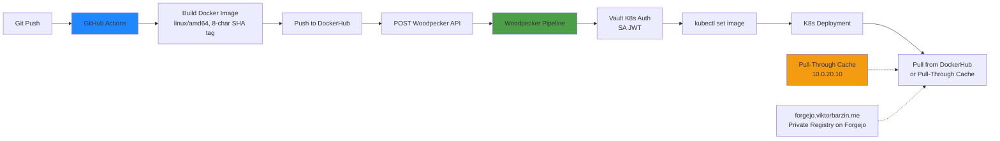

# CI/CD Pipeline

## Overview

The CI/CD pipeline uses a hybrid approach: GitHub Actions for building Docker images (providing free compute for public repos) and Woodpecker CI for deployments (leveraging cluster-internal access). Git pushes trigger GHA builds that produce Docker images with 8-character SHA tags, push to DockerHub, then POST to Woodpecker's API to trigger deployments that update Kubernetes workloads via `kubectl set image`.

## Architecture Diagram



## Components

| Component | Version | Location | Purpose |
|-----------|---------|----------|---------|
| GitHub Actions | Cloud | `.github/workflows/build-and-deploy.yml` | Build Docker images, push to DockerHub |
| Woodpecker CI | Self-hosted | `ci.viktorbarzin.me` | Deploy to Kubernetes cluster |
| DockerHub | Cloud | `viktorbarzin/*` | Public image registry |
| Private Registry | Forgejo Packages | `forgejo.viktorbarzin.me/viktor` | Private container images (PAT auth, retention CronJob) — migrated from registry.viktorbarzin.me 2026-05-07 |
| Pull-Through Cache | Custom | `10.0.20.10:5000` (docker.io)<br/>`10.0.20.10:5010` (ghcr.io) | LAN cache for remote registries |
| Kyverno | Cluster | `kyverno` namespace | Auto-sync registry credentials to all namespaces |
| Vault | Cluster | `vault.viktorbarzin.me` | K8s auth for Woodpecker pipelines |

## How It Works

### Build Flow (GitHub Actions)

1. **Trigger**: Git push to main/master branch
2. **Build**: GHA builds Docker image for `linux/amd64` platform only
3. **Tag**: Image tagged with 8-character commit SHA (e.g., `viktorbarzin/app:a1b2c3d4`)
   - `:latest` tags are **never used** to prevent stale pull-through cache issues
4. **Push**: Image pushed to DockerHub public registry
5. **Trigger Deploy**: POST request to Woodpecker API with repo ID and commit SHA

### Deploy Flow (Woodpecker CI)

1. **Receive Webhook**: Woodpecker API receives deployment trigger from GHA
2. **Authenticate**: Pipeline uses Kubernetes ServiceAccount JWT to authenticate with Vault via K8s auth
3. **Deploy**: `kubectl set image deployment/<name> <container>=viktorbarzin/<app>:<sha>`
4. **Notify**: Slack notification on success/failure

### Project Migration Status

**Migrated to GHA (8 projects)**:
- Website
- k8s-portal
- claude-memory-mcp
- apple-health-data
- audiblez-web
- plotting-book
- insta2spotify
- book-search (audiobook-search)

**Woodpecker-native owned-app builds** (build + push to the Forgejo private
registry + `kubectl set image` rollout, all in one `.woodpecker.yml`; Keel
stays enrolled as a redundant net):
- `tuya_bridge`, `job-hunter`, `f1-stream`
- `f1-stream` was extracted from this monorepo into its own repo
  (`viktor/f1-stream`) on 2026-06-04; its Woodpecker repo id is 166 (the old
  GHA-era id 10 is defunct).

**Woodpecker-only (infra + large apps)**:
- `travel_blog`: 5.7GB content directory exceeds GHA limits
- Infra pipelines: require cluster access (terragrunt apply, certbot, build-cli)

### Woodpecker Pipeline Files

Each project contains:
- `.woodpecker/deploy.yml`: kubectl set image + Slack notification
- `.woodpecker/build-fallback.yml`: Legacy full build pipeline (event: deployment, never auto-fires)

### Woodpecker Repository IDs

Woodpecker API uses numeric IDs (not owner/name):

| Repo | ID |
|------|------|
| infra | 1 |
| Website | 2 |
| finance | 3 |
| health | 4 |
| travel_blog | 5 |
| webhook-handler | 6 |
| audiblez-web | 9 |
| plotting-book | 43 |
| claude-memory-mcp | 78 |
| infra-onboarding | 79 |

### Image Registry Flow

1. **Containerd hosts.toml** redirects pulls from docker.io and ghcr.io to pull-through cache at `10.0.20.10`
2. **Pull-through cache** serves cached images from LAN, fetches from upstream on cache miss
3. **Kyverno ClusterPolicy** auto-syncs `registry-credentials` Secret to all namespaces for private registry access
4. **Private registry** has been Forgejo's built-in OCI registry at `forgejo.viktorbarzin.me/viktor/<image>` since 2026-05-07. Auth via PAT (Vault `secret/ci/global/forgejo_push_token` for push, `secret/viktor/forgejo_pull_token` for pull). The pre-migration `registry:2.8.3`-based private registry on `registry.viktorbarzin.me:5050` was the root cause of three orphan-index incidents in three weeks (2026-04-13, 2026-04-19, 2026-05-04 — see `docs/post-mortems/2026-04-19-registry-orphan-index.md` and the full migration writeup at `docs/plans/2026-05-07-forgejo-registry-consolidation-{design,plan}.md`). The five pull-through caches on `10.0.20.10` (ports 5000/5010/5020/5030/5040) stay in place for upstream registries.
5. **Integrity probe** (`registry-integrity-probe` CronJob in `monitoring` ns, every 15m) walks `/v2/_catalog` → tags → indexes → child manifests via HEAD and pushes `registry_manifest_integrity_failures` to Pushgateway; alerts `RegistryManifestIntegrityFailure` / `RegistryIntegrityProbeStale` / `RegistryCatalogInaccessible` page on broken state. Authoritative check (HTTP API, not filesystem).

### Infra Pipelines (Woodpecker-only)

| Pipeline | File | Purpose |
|----------|------|---------|
| default | `.woodpecker/default.yml` | Terragrunt apply on push |
| renew-tls | `.woodpecker/renew-tls.yml` | Certbot renewal cron |
| build-cli | `.woodpecker/build-cli.yml` | Build and push to dual registries |
| build-ci-image | `.woodpecker/build-ci-image.yml` | Build `infra-ci` tooling image (triggered by `ci/Dockerfile` change or manual); post-push HEADs every blob via `verify-integrity` step to catch orphan-index pushes |
| k8s-portal | `.woodpecker/k8s-portal.yml` | Path-filtered build for k8s-portal subdirectory |
| registry-config-sync | `.woodpecker/registry-config-sync.yml` | SCP `modules/docker-registry/*` to `/opt/registry/` on `10.0.20.10` when any managed file changes; bounces containers + nginx per `docs/runbooks/registry-vm.md` |
| pve-nfs-exports-sync | `.woodpecker/pve-nfs-exports-sync.yml` | Sync `scripts/pve-nfs-exports` → `/etc/exports` on PVE host |
| postmortem-todos | `.woodpecker/postmortem-todos.yml` | Auto-resolve safe TODOs from new `docs/post-mortems/*.md` via headless Claude agent |
| drift-detection | `.woodpecker/drift-detection.yml` | Nightly Terraform drift detection |
| issue-automation | `.woodpecker/issue-automation.yml` | Triage + respond to `ViktorBarzin/infra` GitHub issues |
| provision-user | `.woodpecker/provision-user.yml` | Add namespace-owner user from Vault spec |

## Configuration

### GitHub Actions

**File**: `.github/workflows/build-and-deploy.yml`

```yaml
name: Build and Deploy
on:
  push:
    branches: [main, master]
jobs:
  build:
    runs-on: ubuntu-latest
    steps:
      - name: Build Docker image
        run: docker build --platform linux/amd64 -t viktorbarzin/app:${SHORT_SHA} .
      - name: Push to DockerHub
        run: docker push viktorbarzin/app:${SHORT_SHA}
      - name: Trigger Woodpecker Deploy
        run: |
          curl -X POST https://ci.viktorbarzin.me/api/repos/<REPO_ID>/pipelines \
            -H "Authorization: Bearer ${{ secrets.WOODPECKER_TOKEN }}"
```

**Required GitHub Secrets**:
- `DOCKERHUB_USERNAME`
- `DOCKERHUB_TOKEN`
- `WOODPECKER_TOKEN`

### Woodpecker Deploy Pipeline

**File**: `.woodpecker/deploy.yml`

```yaml
when:
  event: [deployment]

steps:
  deploy:
    image: bitnami/kubectl:latest
    commands:
      - kubectl set image deployment/app app=viktorbarzin/app:${CI_COMMIT_SHA:0:8}
    secrets: [k8s_token]

  notify:
    image: plugins/slack
    settings:
      webhook: ${SLACK_WEBHOOK}
    when:
      status: [success, failure]
```

**YAML Gotchas**:
- Commands with `${VAR}:${VAR}` syntax must be quoted to prevent YAML map parsing when vars are empty
- Use `bitnami/kubectl:latest` (not pinned versions)
- Global secrets must be manually added to `secrets:` list in pipeline

### Vault Configuration

**K8s Auth for Woodpecker**:
- Woodpecker pipelines authenticate using ServiceAccount JWT
- Vault K8s auth mount validates JWT and issues token
- Policies grant access to secrets and dynamic credentials

### CI/CD Secrets Sync

**CronJob**: Pushes `secret/ci/global` from Vault → Woodpecker API every 6 hours
- Keeps Woodpecker global secrets in sync with Vault
- Runs in `woodpecker` namespace

## Decisions & Rationale

### Why GitHub Actions + Woodpecker?

**Alternatives considered**:
1. **Woodpecker-only**: Simple, but wastes cluster resources on builds
2. **GHA-only**: No cluster access, requires kubectl from outside (security risk)
3. **Hybrid (chosen)**: GHA for compute-heavy builds (free), Woodpecker for privileged deployments (secure cluster access)

**Benefits**:
- Free compute for builds on public repos
- Cluster access stays internal (Woodpecker has direct K8s access)
- Separation of concerns: build vs deploy

### Why 8-Character SHA Tags (Not :latest)?

- Pull-through cache serves stale `:latest` tags indefinitely
- SHA tags ensure every deployment pulls the correct image
- 8 characters provide sufficient collision resistance (16^8 = 4.3 billion combinations)

### Why Numeric Repo IDs for Woodpecker API?

- Woodpecker API requires numeric IDs (not owner/name slugs)
- IDs are stable across repo renames
- Must be manually looked up from Woodpecker UI or database

### Why linux/amd64 Only?

- Cluster runs on x86_64 nodes only
- ARM builds would waste time and storage
- Multi-arch images add complexity without benefit

## Troubleshooting

### GHA Build Fails: "denied: requested access to the resource is denied"

**Cause**: DockerHub credentials expired or incorrect

**Fix**:
```bash
# Regenerate DockerHub token
# Update GitHub repo secrets: DOCKERHUB_USERNAME, DOCKERHUB_TOKEN
```

### Woodpecker Deploy Fails: "Unauthorized"

**Cause**: Vault K8s auth token expired or invalid

**Fix**:
```bash
# Restart Woodpecker pipeline (token auto-renewed)
# Check Vault K8s auth role exists: vault read auth/kubernetes/role/woodpecker-deployer
```

### Image Pull Fails: "ErrImagePull"

**Cause**: Pull-through cache or registry credentials issue

**Fix**:
```bash
# Check pull-through cache is running
curl http://10.0.20.10:5000/v2/_catalog

# Verify registry-credentials Secret exists in namespace
kubectl get secret registry-credentials -n <namespace>

# Manually sync credentials if missing
kubectl get secret registry-credentials -n default -o yaml | \
  sed 's/namespace: default/namespace: <namespace>/' | kubectl apply -f -
```

### Woodpecker Pipeline: "YAML: did not find expected key"

**Cause**: Unquoted command with `${VAR}:${VAR}` syntax when VAR is empty

**Fix**: Quote the command:
```yaml
commands:
  - "kubectl set image deployment/app app=viktorbarzin/app:${SHORT_SHA}"
```

### travel_blog Build Times Out on GHA

**Cause**: 5.7GB content directory exceeds GHA disk/time limits

**Fix**: Keep on Woodpecker (no migration). Build uses cluster storage and resources.

### CI/CD Secrets Out of Sync

**Cause**: CronJob failed to sync Vault → Woodpecker

**Fix**:
```bash
# Check CronJob status
kubectl get cronjob -n woodpecker

# Manually trigger sync
kubectl create job --from=cronjob/sync-secrets manual-sync -n woodpecker
```

## Related

- [Databases Architecture](./databases.md) — Database credentials via Vault
- [Multi-Tenancy](./multi-tenancy.md) — Per-user Woodpecker access
- Runbook: `../runbooks/deploy-new-app.md` — How to set up CI/CD for a new app
- Runbook: `../runbooks/troubleshoot-image-pull.md` — Debug image pull issues
- Vault documentation: K8s auth configuration
- Woodpecker documentation: API reference
