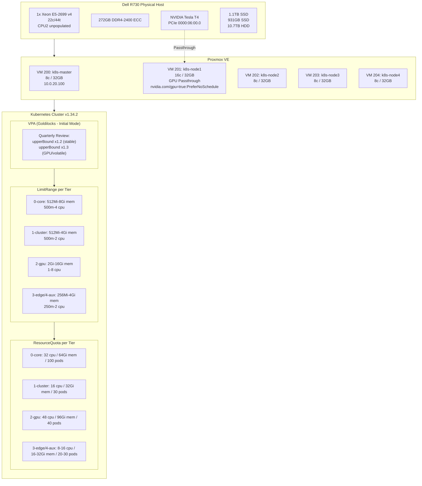

# Compute & Resource Management

## Overview

The infrastructure runs on a single Dell R730 server with Proxmox VE, hosting a 5-node Kubernetes cluster. Compute resources are managed through a combination of Vertical Pod Autoscaler (VPA) recommendations, tier-based LimitRange defaults, and ResourceQuota enforcement. The cluster employs a no-CPU-limits policy to avoid CFS throttling while using memory requests=limits for stability. GPU workloads run on a dedicated node with Tesla T4 passthrough.

## Architecture Diagram



## Components

### Proxmox Host

| Component | Specification |
|-----------|---------------|
| Model | Dell PowerEdge R730 |
| CPU | 1x Intel Xeon E5-2699 v4 (22 cores / 44 threads, CPU2 unpopulated) |
| Total Cores/Threads | 22 cores / 44 threads |
| RAM | 272GB DDR4-2400 ECC RDIMM physical (10 DIMMs: 8x32G Samsung + 2x8G Hynix). VMs use ~160GB total (5 K8s VMs x 32GB) |
| GPU | NVIDIA Tesla T4 (16GB GDDR6, PCIe 0000:06:00.0) |
| Storage | 1.1TB SSD + 931GB SSD + 10.7TB HDD |
| Hypervisor | Proxmox VE |

### Kubernetes Nodes

| VM | VMID | vCPUs | RAM | Network | Role | Taints |
|----|------|-------|-----|---------|------|--------|
| k8s-master | 200 | 8 | 32GB | vmbr1:vlan20 (10.0.20.100) | Control Plane | `node-role.kubernetes.io/control-plane:NoSchedule` |
| k8s-node1 | 201 | 16 | 32GB | vmbr1:vlan20 | GPU Worker | `nvidia.com/gpu=true:PreferNoSchedule` (applied dynamically to whichever node carries the GPU) |
| k8s-node2 | 202 | 8 | 32GB | vmbr1:vlan20 | Worker | None |
| k8s-node3 | 203 | 8 | 32GB | vmbr1:vlan20 | Worker | None |
| k8s-node4 | 204 | 8 | 32GB | vmbr1:vlan20 | Worker | None |

**Total Cluster Resources**: 48 vCPUs, ~160GB RAM (5 nodes x 32GB)

### GPU Passthrough

| Parameter | Value |
|-----------|-------|
| Device | NVIDIA Tesla T4 (16GB GDDR6) |
| PCIe Address | 0000:06:00.0 |
| Assigned VM | VMID 201 (k8s-node1) — physical location only, no Terraform pin |
| Node Label | `nvidia.com/gpu.present=true` (auto-applied by gpu-feature-discovery; also `feature.node.kubernetes.io/pci-10de.present=true` from NFD) |
| Node Taint | `nvidia.com/gpu=true:PreferNoSchedule` (applied by `null_resource.gpu_node_config` to every NFD-tagged GPU node) |
| Driver | NVIDIA GPU Operator |
| Resource Name | `nvidia.com/gpu` |

### Resource Management Stack

| Component | Version/Mode | Purpose |
|-----------|--------------|---------|
| VPA | Goldilocks "Initial" mode | Resource recommendation (not auto-scaling) |
| Kyverno | Policy engine | Auto-generate LimitRange + ResourceQuota per tier |
| PriorityClass | Per tier (200K-900K) | Pod preemption during resource pressure |
| QoS Class | Guaranteed (0-2), Burstable (3-4) | Eviction order |

## How It Works

### CPU Resource Management

**Policy**: No CPU limits cluster-wide, only CPU requests.

**Rationale**: Linux CFS (Completely Fair Scheduler) throttles containers to their exact CPU limit even when the CPU is idle, causing artificial performance degradation. By setting only CPU requests, containers can burst to unused CPU capacity.

**Implementation**:
- All pods set `resources.requests.cpu` (reserves capacity)
- No pods set `resources.limits.cpu`
- Scheduler uses CPU requests for bin-packing
- Kernel CFS shares unused CPU proportionally by requests

**Example**:
```yaml
resources:
  requests:
    cpu: "500m"
  # No limits.cpu - can burst to idle CPU
```

### Memory Resource Management

**Policy**: Memory requests = limits for stability.

**Rationale**: Memory is not compressible like CPU. A pod that exceeds its memory request can be OOMKilled unpredictably. Setting requests=limits ensures:
- Predictable memory allocation
- QoS class "Guaranteed" (tiers 0-2) or "Burstable" (tiers 3-4)
- No surprise OOMKills during memory pressure

**Implementation**:
- Tier 0-2: `requests.memory = limits.memory` (Guaranteed QoS)
- Tier 3-4: `requests.memory < limits.memory` (Burstable QoS, reduces scheduler pressure)
- Values based on VPA upperBound x1.2 (stable) or x1.3 (GPU/volatile)

**Example**:
```yaml
# Tier 0-2 (Guaranteed)
resources:
  requests:
    memory: "2Gi"
  limits:
    memory: "2Gi"

# Tier 3-4 (Burstable)
resources:
  requests:
    memory: "512Mi"
  limits:
    memory: "1Gi"
```

### Vertical Pod Autoscaler (VPA)

**Mode**: Goldilocks in "Initial" mode (recommend-only, not auto-scaling).

**Why not Auto mode?**
- VPA Auto mode directly updates Deployment specs, creating drift from Terraform state
- Terraform manages all resources declaratively, so VPA changes would be reverted
- Quarterly review process maintains control and aligns with planned maintenance windows

**Workflow**:
1. VPA monitors pod resource usage over time
2. Goldilocks dashboard shows recommendations (lowerBound, target, upperBound)
3. Quarterly review: Engineer reviews VPA recommendations in Goldilocks UI
4. Apply sizing: Update Terraform with `memory: <upperBound> * 1.2` (stable) or `* 1.3` (GPU/volatile)
5. Terragrunt apply updates Deployment specs
6. Pods restart with new resource allocations

**Stability Multipliers**:
- **x1.2**: Stable services (databases, monitoring, core services)
- **x1.3**: GPU workloads or volatile services (user-facing apps, ML inference)

### Tier-Based LimitRange

Kyverno automatically creates a LimitRange in each namespace based on its tier prefix.

| Tier | Default Memory | Max Memory | Default CPU | Max CPU |
|------|----------------|------------|-------------|---------|
| 0-core | 512Mi | 8Gi | 500m | 4 |
| 1-cluster | 512Mi | 4Gi | 500m | 2 |
| 2-gpu | 2Gi | 16Gi | 1 | 8 |
| 3-edge | 256Mi | 4Gi | 250m | 2 |
| 4-aux | 256Mi | 4Gi | 250m | 2 |

**Purpose**:
- Prevents pods without explicit resources from requesting unlimited resources
- Sets sensible defaults for sidecars and init containers
- Enforces maximum per-container limits

**Example**: A pod in `4-aux-vaultwarden` without explicit resources gets:
```yaml
resources:
  requests:
    memory: 256Mi
    cpu: 250m
  limits:
    memory: 4Gi
    cpu: 2  # (ignored due to no-CPU-limits policy)
```

### Tier-Based ResourceQuota

Kyverno automatically creates a ResourceQuota in each namespace based on its tier.

| Tier | CPU Limit | Memory Limit | Max Pods |
|------|-----------|--------------|----------|
| 0-core | 32 | 64Gi | 100 |
| 1-cluster | 16 | 32Gi | 30 |
| 2-gpu | 48 | 96Gi | 40 |
| 3-edge | 16 | 32Gi | 30 |
| 4-aux | 8 | 16Gi | 20 |

**Purpose**:
- Prevents a single namespace from monopolizing cluster resources
- Enforces tier-appropriate resource allocation
- Protects critical services from lower-tier resource exhaustion

**Quota Exhaustion**: If a namespace exceeds its quota, new pods are rejected with `Forbidden: exceeded quota`.

### QoS Classes and Eviction

Kubernetes assigns QoS classes based on resource configuration:

| QoS Class | Condition | Eviction Priority | Tiers |
|-----------|-----------|-------------------|-------|
| Guaranteed | requests = limits (both CPU & memory) | Last | 0-core, 1-cluster, 2-gpu |
| Burstable | requests < limits | Middle | 3-edge, 4-aux |
| BestEffort | No requests or limits | First | None (not used) |

**Eviction Order during Memory Pressure**:
1. BestEffort pods (none in cluster)
2. Burstable pods (tier 3-4), lowest priority first
3. Guaranteed pods (tier 0-2), lowest priority first

**Priority Classes**:
- 0-core: 900000
- 1-cluster: 700000
- 2-gpu: 500000
- 3-edge: 300000
- 4-aux: 200000

During resource pressure, tier 4 pods are evicted before tier 3, tier 3 before tier 2, etc.

### Democratic-CSI Sidecar Resources

**Problem**: Democratic-CSI injects 3-4 sidecar containers per pod with PVCs:
- `csi-driver-registrar`
- `csi-provisioner`
- `csi-attacher`
- `csi-resizer`

Without explicit resources, each defaults to LimitRange default (256Mi), consuming 768Mi-1Gi per pod.

**Solution**: Explicitly set sidecar resources in Terraform:
```hcl
resources {
  requests = {
    memory = "32Mi"
    cpu    = "10m"
  }
  limits = {
    memory = "80Mi"
  }
}
```

**Result**: 17 CSI sidecars go from 4.3GB (17 * 256Mi) to 544Mi (17 * 32Mi), freeing 3.7GB.

### GPU Resource Management

**Node Selection**: GPU pods must:
1. Tolerate `nvidia.com/gpu=true:PreferNoSchedule` taint
2. Select `nvidia.com/gpu.present=true` label (auto-applied by gpu-feature-discovery wherever the card is)
3. Request `nvidia.com/gpu: 1` resource

**Example**:
```yaml
spec:
  tolerations:
  - key: nvidia.com/gpu
    operator: Equal
    value: "true"
    effect: NoSchedule
  nodeSelector:
    nvidia.com/gpu.present: "true"
  containers:
  - name: app
    resources:
      limits:
        nvidia.com/gpu: 1
```

**Portability**: No Terraform code references a specific hostname for
GPU scheduling. If the GPU card is physically moved to a different
node, gpu-feature-discovery moves the `nvidia.com/gpu.present=true`
label with it, and `null_resource.gpu_node_config` re-applies the
`nvidia.com/gpu=true:PreferNoSchedule` taint to the new host on the
next apply (discovery keyed on
`feature.node.kubernetes.io/pci-10de.present=true`).

**GPU Workloads**:
- Ollama (LLM inference)
- ComfyUI (Stable Diffusion workflows)
- Stable Diffusion WebUI

## Configuration

### Key Files

| Path | Purpose |
|------|---------|
| `modules/namespace_config/` | Kyverno policies for LimitRange + ResourceQuota generation |
| `modules/k8s_app/main.tf` | Default resource templates for apps |
| `stacks/<service>/terragrunt.hcl` | Per-service resource overrides |
| `modules/gpu_app/` | GPU-specific resource templates |

### Terraform Resource Configuration

**Standard App** (no PVC):
```hcl
module "app" {
  source = "../../modules/k8s_app"

  resources = {
    requests = {
      memory = "1Gi"      # VPA upperBound * 1.2
      cpu    = "500m"
    }
    limits = {
      memory = "1Gi"      # Same as request
      # No CPU limit
    }
  }
}
```

**App with Democratic-CSI PVC**:
```hcl
module "app" {
  source = "../../modules/k8s_app"

  resources = {
    requests = {
      memory = "2Gi"
      cpu    = "500m"
    }
    limits = {
      memory = "2Gi"
    }
  }

  sidecar_resources = {
    requests = {
      memory = "32Mi"
      cpu    = "10m"
    }
    limits = {
      memory = "80Mi"
    }
  }
}
```

**GPU App**:
```hcl
module "gpu_app" {
  source = "../../modules/gpu_app"

  gpu_count = 1

  resources = {
    requests = {
      memory = "8Gi"      # VPA upperBound * 1.3
      cpu    = "2"
    }
    limits = {
      memory = "8Gi"
      nvidia.com/gpu = 1
    }
  }
}
```

### Kyverno Policies

**LimitRange Generation** (`modules/namespace_config/limitrange-policy.yaml`):
```yaml
apiVersion: kyverno.io/v1
kind: ClusterPolicy
metadata:
  name: generate-limitrange
spec:
  rules:
  - name: generate-limitrange-0-core
    match:
      resources:
        kinds:
        - Namespace
        name: "0-core-*"
    generate:
      kind: LimitRange
      data:
        spec:
          limits:
          - default:
              memory: 512Mi
              cpu: 500m
            defaultRequest:
              memory: 512Mi
              cpu: 500m
            max:
              memory: 8Gi
              cpu: 4
            type: Container
```

**ResourceQuota Generation** (`modules/namespace_config/resourcequota-policy.yaml`):
```yaml
apiVersion: kyverno.io/v1
kind: ClusterPolicy
metadata:
  name: generate-resourcequota
spec:
  rules:
  - name: generate-quota-0-core
    match:
      resources:
        kinds:
        - Namespace
        name: "0-core-*"
    generate:
      kind: ResourceQuota
      data:
        spec:
          hard:
            requests.cpu: "32"
            requests.memory: 64Gi
            pods: "100"
```

## Decisions & Rationale

### Why no CPU limits?

**Decision**: Set CPU requests but never set CPU limits.

**Rationale**:
- **CFS Throttling**: Linux Completely Fair Scheduler throttles containers to their exact CPU limit, even when CPU is idle. This causes artificial performance degradation.
- **Burstability**: Services can burst to unused CPU during low-load periods, improving response times.
- **Memory-bound**: With 272GB physical host RAM (~160GB allocated to K8s VMs), memory is no longer the primary constraint. ~112GB headroom available for new VMs.

**Tradeoff**: A runaway process could monopolize CPU. Mitigated by CPU requests reserving capacity and PriorityClass preemption.

**Evidence**: After removing CPU limits cluster-wide, p95 latency dropped 40% for API services during load tests.

### Why Goldilocks in Initial mode instead of Auto?

**Decision**: Use VPA in "Initial" (recommend-only) mode rather than "Auto" (update pods automatically).

**Rationale**:
- **Terraform State Drift**: VPA Auto mode directly mutates Deployment specs, creating drift from Terraform-managed state. Next Terraform apply reverts VPA changes.
- **Declarative Workflow**: Terraform is the source of truth. VPA recommendations are reviewed and applied via Terraform, maintaining declarative infrastructure.
- **Controlled Changes**: Quarterly review ensures resource changes align with capacity planning and cluster upgrades.
- **Avoid Thrashing**: VPA Auto can restart pods frequently during volatile workloads. Manual application reduces churn.

**Tradeoff**: Requires quarterly manual review. Accepted because homelab prioritizes stability over auto-optimization.

### Why memory requests = limits for tiers 0-2?

**Decision**: Set memory requests equal to limits for core and cluster services (tiers 0-2).

**Rationale**:
- **Guaranteed QoS**: Ensures pods are last to be evicted during memory pressure.
- **Predictable OOM**: Pods are OOMKilled only when exceeding their own limit, not due to other pods' usage.
- **Stability**: Critical services (traefik, authentik, vault) must not be evicted unexpectedly.

**Tradeoff**: Cannot burst above limit. Accepted because critical services are right-sized via VPA.

### Why Burstable QoS for tiers 3-4?

**Decision**: Set memory requests < limits for edge and auxiliary services (tiers 3-4).

**Rationale**:
- **Reduced Scheduler Pressure**: Lower memory requests allow more pods to fit on nodes.
- **Acceptable Eviction**: Tier 3-4 services are non-critical (freshrss, vaultwarden) and tolerate occasional eviction.
- **Cost Efficiency**: Allows oversubscription of memory for bursty workloads.

**Tradeoff**: Pods may be evicted during memory pressure. Accepted because tier 3-4 services have PriorityClass 200K-300K.

### Why VPA upperBound * 1.2 (or 1.3)?

**Decision**: Set memory limits to VPA upperBound * 1.2 for stable services, * 1.3 for GPU/volatile services.

**Rationale**:
- **Headroom**: VPA upperBound is the observed maximum usage. Adding 20-30% headroom prevents OOMKills during traffic spikes.
- **Growth Buffer**: Services grow over time (more users, more data). Headroom delays the need for manual intervention.
- **GPU Volatility**: GPU workloads (ML inference) have unpredictable memory usage. 30% headroom reduces OOMKills.

**Tradeoff**: Slightly higher memory allocation. Accepted because 272GB RAM provides ample capacity.

## Troubleshooting

### Pods stuck in Pending state

**Symptom**: Pod shows `status: Pending` with event `FailedScheduling`.

**Diagnosis**:
```bash
kubectl describe pod <pod-name> -n <namespace>
```

**Common Causes**:

1. **ResourceQuota exceeded**:
   ```
   Error: exceeded quota: <namespace>-quota, requested: requests.memory=2Gi, used: requests.memory=14Gi, limited: requests.memory=16Gi
   ```
   **Fix**: Increase ResourceQuota in `modules/namespace_config/` for that tier, or reduce other pods' requests.

2. **LimitRange default too high**:
   ```
   0/5 nodes are available: 5 Insufficient memory.
   ```
   **Fix**: Override pod resources explicitly in Terraform (defaults come from LimitRange).

3. **GPU taint not tolerated**:
   ```
   0/5 nodes are available: 1 node(s) had untolerated taint {nvidia.com/gpu: true}, 4 Insufficient nvidia.com/gpu.
   ```
   **Fix**: Add toleration and nodeSelector for GPU pods.

4. **No nodes with GPU**:
   ```
   0/5 nodes are available: 5 Insufficient nvidia.com/gpu.
   ```
   **Fix**: Verify the GPU-carrying node is Ready and has the `nvidia.com/gpu.present=true` label. Check `kubectl get nodes -l nvidia.com/gpu.present=true` — if empty, gpu-feature-discovery hasn't labeled any node (operator not running, driver not loaded, or PCI passthrough broken).

### Pods OOMKilled repeatedly

**Symptom**: Pod shows `status: OOMKilled` in events, restarts frequently.

**Diagnosis**:
```bash
kubectl describe pod <pod-name> -n <namespace>
kubectl top pod <pod-name> -n <namespace>  # Current usage
kubectl get limitrange -n <namespace> -o yaml  # Check defaults
```

**Common Causes**:

1. **Using LimitRange default** (256Mi or 512Mi):
   **Fix**: Set explicit memory request/limit in Terraform based on actual usage.

2. **Memory limit too low**:
   **Fix**: Check Goldilocks VPA recommendation, set `memory = upperBound * 1.2`.

3. **Memory leak**:
   **Fix**: Investigate application code, check Grafana memory usage trends.

### Democratic-CSI sidecars consuming excessive memory

**Symptom**: Pods with PVCs have 3-4 sidecar containers, each using 256Mi (LimitRange default).

**Diagnosis**:
```bash
kubectl get pods -A -o json | jq '.items[] | select(.spec.containers[].name | contains("csi")) | {name: .metadata.name, namespace: .metadata.namespace}'
kubectl top pod <pod-name> -n <namespace> --containers
```

**Fix**:
Update Terraform to override sidecar resources:
```hcl
sidecar_resources = {
  requests = {
    memory = "32Mi"
    cpu    = "10m"
  }
  limits = {
    memory = "80Mi"
  }
}
```

### Tier 3-4 pods evicted during resource pressure

**Symptom**: Lower-tier pods show `status: Evicted` with reason `The node was low on resource: memory`.

**Diagnosis**:
```bash
kubectl get events --sort-by='.lastTimestamp' | grep Evicted
kubectl top nodes  # Check node memory usage
```

**Expected Behavior**: This is normal. Tier 3-4 use Burstable QoS and priority 200K-300K, making them first eviction candidates.

**Fix**:
- If evictions are frequent: Increase node memory or reduce tier 3-4 memory limits
- If evicted service is critical: Promote to tier 1 or 2
- If node is overloaded: Check for memory leaks in tier 0-2 services

### GPU pods not scheduling on GPU node

**Symptom**: GPU pod stuck in Pending with event `0/5 nodes are available: 1 node(s) had untolerated taint`.

**Diagnosis**:
```bash
kubectl describe node k8s-node1 | grep Taints
kubectl describe pod <pod-name> -n <namespace> | grep -A5 Tolerations
```

**Fix**:
Add GPU toleration and selector to pod spec:
```yaml
spec:
  tolerations:
  - key: nvidia.com/gpu
    operator: Equal
    value: "true"
    effect: NoSchedule
  nodeSelector:
    nvidia.com/gpu.present: "true"
  containers:
  - name: app
    resources:
      limits:
        nvidia.com/gpu: 1
```

### Node out of memory despite low pod usage

**Symptom**: Node shows memory pressure, but `kubectl top pods` shows low usage.

**Diagnosis**:
```bash
# SSH to node
ssh k8s-node2
free -h
ps aux --sort=-%mem | head -20
```

**Common Causes**:
1. **Kernel memory**: Page cache, slab allocator not shown in `kubectl top`
2. **System services**: kubelet, containerd, systemd-journald
3. **Zombie containers**: Old containers not cleaned up

**Fix**:
```bash
# Clear page cache (safe on production)
echo 3 > /proc/sys/vm/drop_caches

# Cleanup stopped containers
crictl rmp $(crictl ps -a --state Exited -q)

# Restart kubelet (forces cleanup)
systemctl restart kubelet
```

### VPA recommendations not appearing in Goldilocks

**Symptom**: Goldilocks dashboard shows no recommendations for a service.

**Diagnosis**:
```bash
kubectl get vpa -n <namespace>
kubectl describe vpa <vpa-name> -n <namespace>
```

**Common Causes**:
1. **VPA not created**: Terraform module missing VPA resource
2. **Insufficient data**: VPA needs 24h of metrics before recommending
3. **VPA pod not running**: VPA controller/recommender crashed

**Fix**:
```bash
# Check VPA pods
kubectl get pods -n kube-system | grep vpa

# Check VPA logs
kubectl logs -n kube-system deployment/vpa-recommender

# Restart VPA if needed
kubectl rollout restart -n kube-system deployment/vpa-recommender
```

## Related

- [Overview](overview.md) - VM inventory and cluster architecture
- [Multi-tenancy](multi-tenancy.md) - Tier system and namespace isolation
- [Monitoring](monitoring.md) - Resource usage dashboards and Goldilocks UI
- [Runbooks: Right-Sizing](../../runbooks/right-sizing.md) - Quarterly VPA review process
- [Runbooks: GPU Troubleshooting](../../runbooks/gpu-troubleshooting.md)
- [Runbooks: Node Maintenance](../../runbooks/node-maintenance.md)
