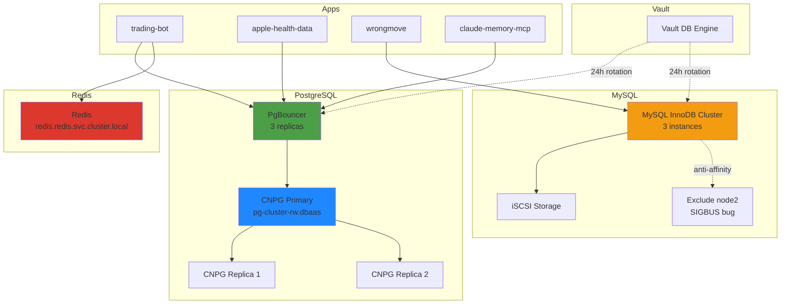

# Databases

## Overview

The cluster provides shared database services (PostgreSQL, MySQL, Redis) for multi-tenant workloads with automated credential rotation via Vault. PostgreSQL uses CloudNativePG (CNPG) with PgBouncer connection pooling, MySQL runs as an InnoDB Cluster with anti-affinity rules for stability, and Redis provides a shared cache layer. SQLite is used for per-app local storage with careful attention to filesystem compatibility.

## Architecture Diagram



## Components

| Component | Version | Location | Purpose |
|-----------|---------|----------|---------|
| PostgreSQL (CNPG) | CloudNativePG | `dbaas` namespace | Primary/replica cluster, auto-failover |
| PgBouncer | 3 replicas | `dbaas` namespace | Connection pooling for PostgreSQL |
| MySQL InnoDB Cluster | 8.x | `dbaas` namespace | Multi-master MySQL cluster |
| Redis | Latest | `redis` namespace | Shared cache layer |
| Vault DB Engine | - | `vault` namespace | Automated credential rotation |

### Database Endpoints

| Service | Endpoint | Notes |
|---------|----------|-------|
| PostgreSQL (primary) | `pg-cluster-rw.dbaas.svc.cluster.local` | Always use this via PgBouncer |
| PgBouncer | `pgbouncer.dbaas.svc.cluster.local` | Connection pool (3 replicas) |
| MySQL | `mysql.dbaas.svc.cluster.local` | InnoDB Cluster VIP |
| Redis | `redis.redis.svc.cluster.local` | Shared instance |
| **NEVER USE** | `postgresql.dbaas.svc.cluster.local` | Legacy service, no endpoints |

## How It Works

### PostgreSQL (CNPG + PgBouncer)

1. **CNPG Cluster**: Manages PostgreSQL primary and replicas
   - Primary: `pg-cluster-rw.dbaas.svc.cluster.local`
   - Auto-failover on primary failure
   - Replicas for read scaling

2. **PgBouncer**: Connection pooling layer (3 replicas)
   - Apps connect to PgBouncer, not directly to PostgreSQL
   - Reduces connection overhead
   - Load balances across PgBouncer instances

3. **Credential Rotation**: Vault DB engine rotates credentials every 24h
   - Apps fetch credentials from Vault on startup
   - Vault manages rotation lifecycle

**Used by**:
- trading-bot
- apple-health-data (health)
- linkwarden
- affine
- woodpecker
- claude-memory-mcp
- ~12 stacks total

### MySQL InnoDB Cluster

1. **Cluster Topology**: 3 MySQL instances with auto-recovery
   - Multi-master replication
   - Automatic split-brain resolution

2. **Storage**: iSCSI-backed persistent volumes
   - Low-latency block storage
   - Better performance than NFS

3. **Anti-Affinity**: Excludes node2 due to SIGBUS bug
   - Pods scheduled to node1, node3, node4, etc.
   - Prevents kernel panic crashes

4. **Resource Allocation**: 4.4Gi memory request, ~1Gi actual usage
   - Over-provisioned for safety

**Used by**:
- wrongmove (realestate-crawler)
- speedtest
- codimd
- nextcloud
- shlink
- grafana

### Redis

- Shared instance at `redis.redis.svc.cluster.local`
- Used for caching and session storage
- No persistence (ephemeral)

### SQLite (Per-App)

**Apps using SQLite**:
- headscale
- vaultwarden
- plotting-book
- holiday-planner
- priority-pass

**Critical**: SQLite on NFS is unreliable
- NFS lacks proper `fsync()` support
- Causes database corruption under load
- **Solution**: Use iSCSI-backed volumes for SQLite apps

### Vault Database Engine

**Rotation Schedule**: 24 hours

**PostgreSQL Rotation**:
- trading
- health (apple-health-data)
- linkwarden
- affine
- woodpecker
- claude_memory

**MySQL Rotation**:
- speedtest
- wrongmove
- codimd
- nextcloud
- shlink
- grafana

**Excluded from Rotation**:
- authentik (uses PgBouncer, incompatible)
- technitium, crowdsec (Helm-baked credentials)
- Root users (manual management)

**How Rotation Works**:
1. Vault creates new user with same permissions
2. App fetches new credentials on next Vault lease renewal
3. Old credentials revoked after grace period
4. Zero-downtime rotation

## Configuration

### Terraform Shared Variables

Always use shared variables, never hardcode endpoints:

```hcl
variable "postgresql_host" {
  default = "pgbouncer.dbaas.svc.cluster.local"
}

variable "mysql_host" {
  default = "mysql.dbaas.svc.cluster.local"
}

variable "redis_host" {
  default = "redis.redis.svc.cluster.local"
}
```

### Vault Paths

**PostgreSQL Dynamic Credentials**:
```
database/creds/postgres-<app>-role
```

**MySQL Dynamic Credentials**:
```
database/creds/mysql-<app>-role
```

**Static Credentials** (non-rotated):
```
secret/data/mysql/root
secret/data/postgres/root
```

### Version Pinning

**Diun Monitoring Disabled** for database images to prevent unwanted version bumps:
- MySQL: pinned version in Terraform
- PostgreSQL: pinned CNPG operator version
- Redis: pinned image tag

**Rationale**: Database upgrades require careful planning and testing

### Example Terraform Stack (PostgreSQL)

```hcl
resource "vault_database_secret_backend_role" "app" {
  backend             = "database"
  name                = "postgres-myapp-role"
  db_name             = "postgres"
  creation_statements = [
    "CREATE USER \"{{name}}\" WITH PASSWORD '{{password}}' VALID UNTIL '{{expiration}}';",
    "GRANT ALL PRIVILEGES ON DATABASE myapp TO \"{{name}}\";"
  ]
  default_ttl         = 86400  # 24 hours
  max_ttl             = 86400
}

resource "kubernetes_secret" "db_creds" {
  metadata {
    name      = "myapp-db"
    namespace = "default"
  }

  data = {
    host     = var.postgresql_host
    database = "myapp"
    # App fetches username/password from Vault at runtime
  }
}
```

## Decisions & Rationale

### Why CNPG Instead of Postgres Operator?

**Alternatives considered**:
1. **Zalando Postgres Operator**: Mature but complex
2. **Bitnami PostgreSQL Helm**: Simple but manual failover
3. **CNPG (chosen)**: Kubernetes-native, auto-failover, active development

**Benefits**:
- Native Kubernetes CRDs
- Automatic failover and recovery
- Active community and updates
- Better resource efficiency than Zalando

### Why PgBouncer for PostgreSQL?

- Reduces connection overhead (apps create many connections)
- Load balances across PgBouncer replicas
- Essential for apps that don't implement connection pooling
- Required for Vault DB engine compatibility with some apps

### Why MySQL InnoDB Cluster?

**Alternatives considered**:
1. **Single MySQL instance**: No HA
2. **Galera Cluster**: Complex, split-brain issues
3. **InnoDB Cluster (chosen)**: Built-in multi-master, auto-recovery

**Benefits**:
- Native MySQL HA solution
- Automatic split-brain resolution
- Simpler than Galera

### Why iSCSI Storage for Databases?

- NFS lacks proper `fsync()` support (causes SQLite corruption)
- iSCSI provides block-level storage with proper write guarantees
- Lower latency than NFS for database workloads

### Why 24h Credential Rotation?

- Balance between security (shorter is better) and operational overhead
- 24h allows time to debug issues before next rotation
- Aligns with daily ops cycle

### Why Shared Redis (Not Per-App)?

- Most apps use Redis for ephemeral data (caching, sessions)
- Over-provisioning Redis wastes memory
- Shared instance sufficient for current load
- Can migrate to per-app if needed

## Troubleshooting

### PostgreSQL: "Too many connections"

**Cause**: Apps connecting directly to PostgreSQL instead of PgBouncer

**Fix**:
```bash
# Check PgBouncer is running
kubectl get pods -n dbaas | grep pgbouncer

# Verify apps use pgbouncer.dbaas, not pg-cluster-rw
kubectl get configmap <app-config> -o yaml | grep postgres
```

### PostgreSQL: Primary Failover Not Working

**Cause**: CNPG controller not running or network partition

**Fix**:
```bash
# Check CNPG operator
kubectl get pods -n cnpg-system

# Check cluster status
kubectl get cluster -n dbaas

# Manually trigger failover (last resort)
kubectl cnpg promote pg-cluster-2 -n dbaas
```

### MySQL: Pod Stuck on node2

**Cause**: Anti-affinity rule not applied

**Fix**:
```bash
# Check pod affinity rules
kubectl get pod <mysql-pod> -n dbaas -o yaml | grep -A 10 affinity

# Delete pod to reschedule
kubectl delete pod <mysql-pod> -n dbaas
```

### MySQL: SIGBUS Crash on node2

**Cause**: Known kernel bug on node2 with iSCSI storage

**Fix**:
```bash
# Cordon node2 to prevent scheduling
kubectl cordon node2

# Delete MySQL pods on node2
kubectl delete pod -n dbaas -l app=mysql --field-selector spec.nodeName=node2
```

### SQLite: Database Corruption

**Cause**: SQLite on NFS volume

**Fix**:
```bash
# Check volume type
kubectl get pv | grep <app>

# If NFS, migrate to iSCSI:
# 1. Create iSCSI PVC
# 2. Backup SQLite database
# 3. Restore to iSCSI volume
# 4. Update app to use new volume
```

### Vault Rotation: "User already exists"

**Cause**: Previous rotation failed to clean up

**Fix**:
```bash
# Connect to database
kubectl exec -it <mysql-pod> -n dbaas -- mysql -u root -p

# List users
SELECT user, host FROM mysql.user WHERE user LIKE 'v-root-%';

# Drop stale users
DROP USER 'v-root-postgres-<hash>'@'%';

# Retry rotation
vault read database/rotate-root/postgres
```

### Redis: Out of Memory

**Cause**: No eviction policy configured

**Fix**:
```bash
# Connect to Redis
kubectl exec -it redis-0 -n redis -- redis-cli

# Set eviction policy
CONFIG SET maxmemory-policy allkeys-lru

# Persist config
CONFIG REWRITE
```

### App Can't Connect: "Connection refused"

**Cause**: Using legacy `postgresql.dbaas` service (no endpoints)

**Fix**:
```bash
# Check service endpoints
kubectl get endpoints postgresql -n dbaas
# Output: No endpoints (this is the problem)

# Update app to use pg-cluster-rw or pgbouncer
kubectl set env deployment/<app> DB_HOST=pgbouncer.dbaas.svc.cluster.local
```

## Related

- [CI/CD Pipeline](./ci-cd.md) — Database credentials in CI/CD
- [Multi-Tenancy](./multi-tenancy.md) — Per-user database provisioning
- Runbook: `../runbooks/database-failover.md` — Manual failover procedures
- Runbook: `../runbooks/vault-rotation-troubleshooting.md` — Debug credential rotation
- Vault documentation: Database secrets engine
- CNPG documentation: Cluster configuration
