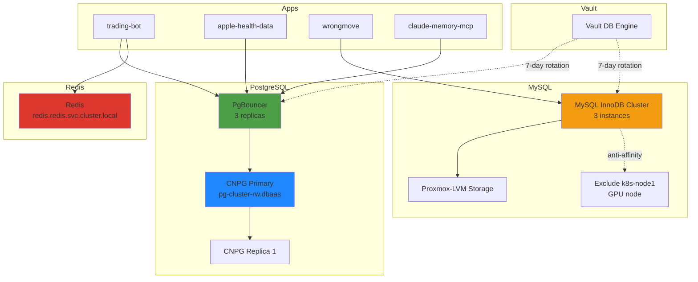

# Databases

## Overview

The cluster provides shared database services (PostgreSQL, MySQL, Redis) for multi-tenant workloads with automated credential rotation via Vault. PostgreSQL uses CloudNativePG (CNPG) with PgBouncer connection pooling, MySQL runs as an InnoDB Cluster with anti-affinity rules for stability, and Redis provides a shared cache layer. SQLite is used for per-app local storage with careful attention to filesystem compatibility.

## Architecture Diagram



## Components

| Component | Version | Location | Purpose |
|-----------|---------|----------|---------|
| PostgreSQL (CNPG) | CloudNativePG (PostGIS 16: `postgis:16`) | `dbaas` namespace | Primary/replica cluster, auto-failover |
| PgBouncer | 3 replicas | `dbaas` namespace | Connection pooling for PostgreSQL |
| MySQL InnoDB Cluster | 8.4.4 | `dbaas` namespace | Multi-master MySQL cluster |
| Redis | Latest | `redis` namespace | Shared cache layer |
| Vault DB Engine | - | `vault` namespace | Automated credential rotation |

### Database Endpoints

| Service | Endpoint | Notes |
|---------|----------|-------|
| PostgreSQL (primary) | `pg-cluster-rw.dbaas.svc.cluster.local` | Always use this via PgBouncer |
| PgBouncer | `pgbouncer.dbaas.svc.cluster.local` | Connection pool (3 replicas) |
| MySQL | `mysql.dbaas.svc.cluster.local` | InnoDB Cluster VIP |
| Redis | `redis.redis.svc.cluster.local` | Shared instance |
| PostgreSQL (compat) | `postgresql.dbaas.svc.cluster.local` | Compatibility service, selects CNPG primary |

## How It Works

### PostgreSQL (CNPG + PgBouncer)

1. **CNPG Cluster**: Manages PostgreSQL primary and replicas
   - Primary: `pg-cluster-rw.dbaas.svc.cluster.local`
   - Auto-failover on primary failure
   - Replicas for read scaling

2. **PgBouncer**: Connection pooling layer (3 replicas)
   - Apps connect to PgBouncer, not directly to PostgreSQL
   - Reduces connection overhead
   - Load balances across PgBouncer instances

3. **Credential Rotation**: Vault DB engine rotates credentials every 7 days
   - Apps fetch credentials from Vault on startup
   - Vault manages rotation lifecycle

**Used by**:
- trading-bot
- apple-health-data (health)
- linkwarden
- affine
- woodpecker
- claude-memory-mcp
- 5 active PG roles

### MySQL InnoDB Cluster

1. **Cluster Topology**: 3 MySQL instances with auto-recovery
   - Multi-master replication
   - Automatic split-brain resolution

2. **Storage**: Proxmox-LVM persistent volumes
   - Thin-provisioned LVM on Proxmox hosts
   - Block-level storage with proper write guarantees

3. **Anti-Affinity**: Excludes k8s-node1 (GPU node)
   - Pods scheduled to node2, node3, node4, etc.
   - Keeps database workloads off the GPU-dedicated node

4. **Resource Allocation**: 2Gi request / 3Gi limit
   - Right-sized based on VPA recommendations

**Used by**:
- wrongmove (realestate-crawler)
- speedtest
- codimd
- nextcloud
- shlink
- grafana
- technitium (DNS query logs via QueryLogsMySqlApp plugin)

### Redis

Single shared cluster for all 17 consumers (Immich, Authentik, Nextcloud, Paperless, Dawarich Sidekiq, Traefik, etc.). HAProxy (3 replicas, PDB minAvailable=2) is the sole client-facing path — clients talk only to `redis-master.redis.svc.cluster.local:6379` and HAProxy health-checks backends via `INFO replication`, routing only to `role:master`.

**Current state (as of 2026-04-19, cutover complete)**:

Active cluster: `redis-v2-*` — 3 pods, each co-locating redis + sentinel + redis_exporter, using `docker.io/library/redis:8-alpine` (8.6.2). HAProxy backends point at `redis-v2-{0,1,2}.redis-v2-headless.redis.svc.cluster.local`. DBSIZE matched between old master and new at cutover; all data (including `immich_bull:*` and `_kombu.*` queues) preserved via chained `REPLICAOF`. Steady-state probe: 45/45 PING OK. Two chaos drills (kill master, sentinel failover) passed — first drill ~12s disruption, second ~1s after hostname fix below.

Legacy `redis-node-*` StatefulSet is scaled to 0 (kept as cold rollback for 24h). Helm release `helm_release.redis` + PVCs `redis-data-redis-node-{0,1}` are pending Terraform removal in a follow-up commit (see beads follow-up task).

**Architecture**:

- 3 redis pods + 3 co-located sentinels (quorum=2). Odd sentinel count eliminates split-brain.
- `podManagementPolicy=Parallel` + init container that regenerates `sentinel.conf` on every boot by probing peer sentinels for consensus master (priority: sentinel vote → peer role:master with slaves → deterministic pod-0 fallback). No persistent sentinel runtime state — can't drift out of sync with reality (root cause of 2026-04-19 PM incident).
- redis.conf has `include /shared/replica.conf`; the init container writes either an empty file (master) or `replicaof <master> 6379` (replicas), so pods come up already in the right role — no bootstrap race.
- **Sentinel hostname persistence**: `sentinel resolve-hostnames yes` + `sentinel announce-hostnames yes` in the init-generated sentinel.conf are mandatory — without them, sentinel stores resolved IPs in its rewritten config, and pod-IP churn on restart breaks failover. The MONITOR command itself must be issued with a hostname and the flags must be active before MONITOR, otherwise sentinel stores an IP that goes stale the next time the pod is deleted.
- Memory: master + replicas `requests=limits=768Mi`. Concurrent BGSAVE + AOF-rewrite fork can double RSS via COW, so headroom must cover it. `auto-aof-rewrite-percentage=200` + `auto-aof-rewrite-min-size=128mb` tune down rewrite frequency.
- Persistence: RDB (`save 900 1 / 300 100 / 60 10000`) + AOF `appendfsync=everysec`. Disk-wear analysis on 2026-04-19 (sdb Samsung 850 EVO 1TB, 150 TBW): Redis contributes <1 GB/day cluster-wide → 40+ year runway at the 20% TBW budget.
- `maxmemory=640mb` (83% of 768Mi limit), `maxmemory-policy=allkeys-lru`.
- Weekly RDB backup to NFS (`/srv/nfs/redis-backup/`, Sunday 03:00, 28-day retention, pushes Pushgateway metrics).
- Auth disabled this phase — NetworkPolicy is the isolation layer. Enabling `requirepass` + rolling creds to all 17 clients is a planned follow-up.

**Observability** (redis-v2 only): `oliver006/redis_exporter:v1.62.0` sidecar per pod on port 9121, auto-scraped via Prometheus pod annotation. Alerts: `RedisDown`, `RedisMemoryPressure`, `RedisEvictions`, `RedisReplicationLagHigh`, `RedisForkLatencyHigh`, `RedisAOFRewriteLong`, `RedisReplicasMissing`, `RedisBackupStale`, `RedisBackupNeverSucceeded`.

**Why this design** — three incidents in April 2026 drove the rework: (a) 2026-04-04 service selector routed reads+writes to master+replica causing `READONLY` errors; (b) 2026-04-19 AM master OOMKilled during BGSAVE+PSYNC with the 256Mi limit too tight for a 204 MB working set under COW amplification; (c) 2026-04-19 PM sentinel runtime state drifted (only 2 sentinels, no majority) and routed writes to a slave. See beads epic `code-v2b` for the full plan and linked challenger analyses.

### SQLite (Per-App)

**Apps using SQLite**:
- headscale
- vaultwarden
- plotting-book
- holiday-planner
- priority-pass

**Critical**: SQLite on NFS is unreliable
- NFS lacks proper `fsync()` support
- Causes database corruption under load
- **Solution**: Use Proxmox-LVM volumes for SQLite apps

### Vault Database Engine

**Rotation Schedule**: 7 days (604800s)

**PostgreSQL Rotation**:
- health (apple-health-data)
- linkwarden
- affine
- woodpecker
- claude_memory

**MySQL Rotation**:
- speedtest
- wrongmove
- codimd
- nextcloud
- shlink
- grafana
- technitium (password synced to Technitium DNS app via CronJob every 6h)

**Excluded from Rotation**:
- authentik (uses PgBouncer, incompatible)
- crowdsec (Helm-baked credentials)
- Root users (manual management)

**How Rotation Works**:
1. Vault rotates the MySQL user's password (static role, 7-day period)
2. ExternalSecrets Operator syncs new password to K8s Secret (15-min refresh)
3. Apps read from K8s Secret via `secret_key_ref` env vars
4. Special case: Technitium stores its MySQL connection in internal app config, so a CronJob pushes the rotated password to the Technitium API every 6 hours

## Configuration

### Terraform Shared Variables

Always use shared variables, never hardcode endpoints:

```hcl
variable "postgresql_host" {
  default = "pgbouncer.dbaas.svc.cluster.local"
}

variable "mysql_host" {
  default = "mysql.dbaas.svc.cluster.local"
}

variable "redis_host" {
  default = "redis.redis.svc.cluster.local"
}
```

### Vault Paths

**PostgreSQL Dynamic Credentials**:
```
database/creds/postgres-<app>-role
```

**MySQL Dynamic Credentials**:
```
database/creds/mysql-<app>-role
```

**Static Credentials** (non-rotated):
```
secret/data/mysql/root
secret/data/postgres/root
```

### Version Pinning

**Diun Monitoring Disabled** for database images to prevent unwanted version bumps:
- MySQL: pinned version in Terraform
- PostgreSQL: pinned CNPG operator version
- Redis: pinned image tag

**Rationale**: Database upgrades require careful planning and testing

### Example Terraform Stack (PostgreSQL)

```hcl
resource "vault_database_secret_backend_role" "app" {
  backend             = "database"
  name                = "postgres-myapp-role"
  db_name             = "postgres"
  creation_statements = [
    "CREATE USER \"{{name}}\" WITH PASSWORD '{{password}}' VALID UNTIL '{{expiration}}';",
    "GRANT ALL PRIVILEGES ON DATABASE myapp TO \"{{name}}\";"
  ]
  default_ttl         = 604800  # 7 days
  max_ttl             = 604800
}

resource "kubernetes_secret" "db_creds" {
  metadata {
    name      = "myapp-db"
    namespace = "default"
  }

  data = {
    host     = var.postgresql_host
    database = "myapp"
    # App fetches username/password from Vault at runtime
  }
}
```

## Decisions & Rationale

### Why CNPG Instead of Postgres Operator?

**Alternatives considered**:
1. **Zalando Postgres Operator**: Mature but complex
2. **Bitnami PostgreSQL Helm**: Simple but manual failover
3. **CNPG (chosen)**: Kubernetes-native, auto-failover, active development

**Benefits**:
- Native Kubernetes CRDs
- Automatic failover and recovery
- Active community and updates
- Better resource efficiency than Zalando

### Why PgBouncer for PostgreSQL?

- Reduces connection overhead (apps create many connections)
- Load balances across PgBouncer replicas
- Essential for apps that don't implement connection pooling
- Required for Vault DB engine compatibility with some apps

### Why MySQL InnoDB Cluster?

**Alternatives considered**:
1. **Single MySQL instance**: No HA
2. **Galera Cluster**: Complex, split-brain issues
3. **InnoDB Cluster (chosen)**: Built-in multi-master, auto-recovery

**Benefits**:
- Native MySQL HA solution
- Automatic split-brain resolution
- Simpler than Galera

### Why Block Storage for Databases?

- NFS lacks proper `fsync()` support (causes SQLite corruption)
- Proxmox-LVM provides block-level storage with proper write guarantees
- Lower latency than NFS for database workloads

### Why 7-Day Credential Rotation?

- Balance between security (shorter is better) and operational overhead
- 7 days allows ample time to debug issues before next rotation
- Reduces rotation-related disruptions while maintaining security hygiene

### Why Shared Redis (Not Per-App)?

- Most apps use Redis for ephemeral data (caching, sessions)
- Over-provisioning Redis wastes memory
- Shared instance sufficient for current load
- Can migrate to per-app if needed

## Troubleshooting

### PostgreSQL: "Too many connections"

**Cause**: Apps connecting directly to PostgreSQL instead of PgBouncer

**Fix**:
```bash
# Check PgBouncer is running
kubectl get pods -n dbaas | grep pgbouncer

# Verify apps use pgbouncer.dbaas, not pg-cluster-rw
kubectl get configmap <app-config> -o yaml | grep postgres
```

### PostgreSQL: Primary Failover Not Working

**Cause**: CNPG controller not running or network partition

**Fix**:
```bash
# Check CNPG operator
kubectl get pods -n cnpg-system

# Check cluster status
kubectl get cluster -n dbaas

# Manually trigger failover (last resort)
kubectl cnpg promote pg-cluster-2 -n dbaas
```

### MySQL: Pod Stuck on Excluded Node

**Cause**: Anti-affinity rule not applied (should exclude k8s-node1)

**Fix**:
```bash
# Check pod affinity rules
kubectl get pod <mysql-pod> -n dbaas -o yaml | grep -A 10 affinity

# Delete pod to reschedule
kubectl delete pod <mysql-pod> -n dbaas
```

### MySQL: Pod Scheduled on GPU Node

**Cause**: Anti-affinity rule not preventing scheduling on k8s-node1

**Fix**:
```bash
# Check pod affinity rules
kubectl get pod <mysql-pod> -n dbaas -o yaml | grep -A 10 affinity

# Delete pod to reschedule away from node1
kubectl delete pod <mysql-pod> -n dbaas
```

### SQLite: Database Corruption

**Cause**: SQLite on NFS volume

**Fix**:
```bash
# Check volume type
kubectl get pv | grep <app>

# If NFS, migrate to proxmox-lvm:
# 1. Create proxmox-lvm PVC
# 2. Backup SQLite database
# 3. Restore to proxmox-lvm volume
# 4. Update app to use new volume
```

### Vault Rotation: "User already exists"

**Cause**: Previous rotation failed to clean up

**Fix**:
```bash
# Connect to database
kubectl exec -it <mysql-pod> -n dbaas -- mysql -u root -p

# List users
SELECT user, host FROM mysql.user WHERE user LIKE 'v-root-%';

# Drop stale users
DROP USER 'v-root-postgres-<hash>'@'%';

# Retry rotation
vault read database/rotate-root/postgres
```

### Redis: Out of Memory

**Cause**: No eviction policy configured

**Fix**:
```bash
# Connect to Redis
kubectl exec -it redis-0 -n redis -- redis-cli

# Set eviction policy
CONFIG SET maxmemory-policy allkeys-lru

# Persist config
CONFIG REWRITE
```

### App Can't Connect: "Connection refused"

**Cause**: Service endpoint not reachable or PgBouncer not running

**Fix**:
```bash
# Check service endpoints
kubectl get endpoints pgbouncer -n dbaas
kubectl get endpoints postgresql -n dbaas

# Update app to use pgbouncer
kubectl set env deployment/<app> DB_HOST=pgbouncer.dbaas.svc.cluster.local
```

## Related

- [CI/CD Pipeline](./ci-cd.md) — Database credentials in CI/CD
- [Multi-Tenancy](./multi-tenancy.md) — Per-user database provisioning
- Runbook: `../runbooks/database-failover.md` — Manual failover procedures
- Runbook: `../runbooks/vault-rotation-troubleshooting.md` — Debug credential rotation
- Vault documentation: Database secrets engine
- CNPG documentation: Cluster configuration
