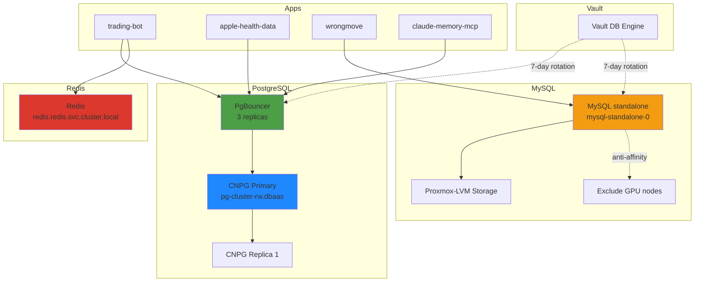

# Databases

## Overview

The cluster provides shared database services (PostgreSQL, MySQL, Redis) for multi-tenant workloads with automated credential rotation via Vault. PostgreSQL uses CloudNativePG (CNPG) with PgBouncer connection pooling, MySQL runs as an InnoDB Cluster with anti-affinity rules for stability, and Redis provides a shared cache layer. SQLite is used for per-app local storage with careful attention to filesystem compatibility.

## Architecture Diagram


```mermaid
graph TB
    subgraph Apps
        A1[trading-bot]
        A2[apple-health-data]
        A3[wrongmove]
        A4[claude-memory-mcp]
    end

    subgraph PostgreSQL
        A1 --> PGB[PgBouncer<br/>3 replicas]
        A2 --> PGB
        A4 --> PGB
        PGB --> CNPG_RW[CNPG Primary<br/>pg-cluster-rw.dbaas]
        CNPG_RW --> CNPG_R1[CNPG Replica 1]
    end

    subgraph MySQL
        A3 --> MYC[MySQL standalone<br/>mysql-standalone-0]
        MYC --> LVM1[Proxmox-LVM Storage]
        MYC -.anti-affinity.-> NODE1[Exclude GPU nodes]
    end

    subgraph Redis
        A1 --> RED[Redis<br/>redis.redis.svc.cluster.local]
    end

    subgraph Vault
        V[Vault DB Engine]
        V -.7-day rotation.-> PGB
        V -.7-day rotation.-> MYC
    end

    style CNPG_RW fill:#2088ff
    style PGB fill:#4c9e47
    style MYC fill:#f39c12
    style RED fill:#dc382d
```

## Components

| Component | Version | Location | Purpose |
|-----------|---------|----------|---------|
| PostgreSQL (CNPG) | CloudNativePG (PostGIS 16: `postgis:16`) | `dbaas` namespace | Primary/replica cluster, auto-failover |
| PgBouncer | 3 replicas | `dbaas` namespace | Connection pooling for PostgreSQL |
| MySQL standalone | 8.4.8 (`mysql:8.4.8`) | `dbaas` namespace | Single MySQL instance (StatefulSet `mysql-standalone`) |
| Redis | Latest | `redis` namespace | Shared cache layer |
| Vault DB Engine | - | `vault` namespace | Automated credential rotation |

### Database Endpoints

| Service | Endpoint | Notes |
|---------|----------|-------|
| PostgreSQL (primary) | `pg-cluster-rw.dbaas.svc.cluster.local` | Always use this via PgBouncer |
| PgBouncer | `pgbouncer.dbaas.svc.cluster.local` | Connection pool (3 replicas) |
| MySQL | `mysql.dbaas.svc.cluster.local` | Selects the `mysql-standalone` pod |
| Redis | `redis.redis.svc.cluster.local` | Shared instance |
| PostgreSQL (compat) | `postgresql.dbaas.svc.cluster.local` | Compatibility service, selects CNPG primary |

## How It Works

### PostgreSQL (CNPG + PgBouncer)

1. **CNPG Cluster**: Manages PostgreSQL primary and replicas
   - Primary: `pg-cluster-rw.dbaas.svc.cluster.local`
   - Auto-failover on primary failure
   - Replicas for read scaling

2. **PgBouncer**: Connection pooling layer (3 replicas)
   - Apps connect to PgBouncer, not directly to PostgreSQL
   - Reduces connection overhead
   - Load balances across PgBouncer instances

3. **Credential Rotation**: Vault DB engine rotates credentials every 7 days
   - Apps fetch credentials from Vault on startup
   - Vault manages rotation lifecycle

4. **Uptime check**: Uptime Kuma monitor `PostgreSQL pg-cluster (dbaas)` logs into `pg-cluster-rw` every 60 s as `uptime_kuma_probe` (CONNECT on `postgres` only, connection limit 3) and runs `SELECT 1`, so a full connection table or an auth failure shows as down, not only a dead pod. The role and its password are owned by `stacks/uptime-kuma` (added 2026-10-10).

5. **Verify probe**: the pg-cluster verify Job (`stacks/dbaas/verify.sh`, run by `scripts/verify/run`, see `docs/runbooks/verify-jobs.md`) logs in as `verify_probe`. It owns only the `verify_probe` scratch database, where it writes a row on the primary, reads it back on a replica and drops the table; it has `pg_monitor` for `pg_stat_replication` and CONNECT on `dawarich` and `claude_memory` for the PostGIS and pgvector queries. Connection limit 3, no superuser. The role and database are created by `null_resource.pg_verify_probe` in `stacks/dbaas`; the password is a Vault static role (`pg-verify-probe`, 7-day rotation) delivered to the `verify` namespace by ESO (added 2026-10-10).

**Used by**:
- trading-bot
- apple-health-data (health)
- linkwarden
- affine
- woodpecker
- claude-memory-mcp
- tripit
- 5 active PG roles

### MySQL standalone

1. **Topology**: one `mysql:8.4.8` instance, a raw `kubernetes_stateful_set_v1` (`mysql-standalone`) in `stacks/dbaas/modules/dbaas/main.tf`. It replaced the MySQL InnoDB Cluster on 2026-04-16. The image pin and how to bump it are explained in the comment above the `image` line there.

2. **Storage**: PVC `data-mysql-standalone-0`, 30Gi on `proxmox-lvm-encrypted`.

3. **Anti-Affinity**: excludes nodes labelled `nvidia.com/gpu.present=true`, keeping the database off the GPU node.

4. **Resource Allocation**: 4Gi request / 6Gi limit (2Gi InnoDB buffer pool).

The InnoDB Cluster's leftovers (a CR stuck in deletion since 2026-04-18 on the finalizers of the removed operator, its scaled-to-zero StatefulSet, router Deployment, Services, PDB, Secrets and RoleBindings, plus the `mysql.oracle.com` and `zalando.org` kopf CRDs) were removed on 2026-10-10. None of them was in Terraform state.

**Used by**:
- wrongmove (realestate-crawler)
- speedtest
- codimd
- nextcloud
- shlink
- grafana
- technitium (DNS query logs via QueryLogsMySqlApp plugin)

**Observability** (added 2026-10-10, software-currency groundwork): Deployment `mysqld-exporter` in `dbaas` (`prom/mysqld-exporter:v0.20.0`, port 9104, `keel.sh/policy=never`) connects to `mysql.dbaas.svc.cluster.local:3306` as the read-only `exporter` user and is scraped by the annotation-driven `kubernetes-pods` job (`app="mysqld-exporter"`). It is a separate Deployment rather than a sidecar, so it can be changed without restarting mysqld. The user has `PROCESS`, `REPLICATION CLIENT` and `SELECT` on `performance_schema` only, with `MAX_USER_CONNECTIONS 3`; it is created by `null_resource.mysql_exporter_user` the same way as the static application users, and its password is derived from the root password (`sha256`), so it rotates with it. Uptime Kuma separately polls MySQL as `MySQL Standalone (dbaas)`. The MySQL verify Job logs in as `verify_probe` (ALL on the `verify_probe` schema only, `MAX_USER_CONNECTIONS 3`), created by `null_resource.mysql_verify_probe_user`; its password is the Vault static role `mysql-verify-probe`, delivered by ESO to the `verify` namespace. Alerts: `MysqlStandaloneDown` (no ready replica, critical) and `MySQLNotServing` (`mysql_up == 0` for 5m while the pod is ready, critical; it stays quiet when `MysqlStandaloneDown` already covers the outage).

### Redis

Single **standalone** instance shared by all consumers. Live client census (2026-08-16, `CLIENT LIST` peer IPs resolved against the cluster): Immich (`immich_bull:*` BullMQ job hashes on db0), Dawarich Sidekiq (db1) + ActionCable (db2), paperless-ngx and realestate-crawler (Celery brokers on db0 — both carry in-flight unacked tasks), AFFiNE (`affine_job:*` on db4), trading-bot (Redis Streams consumer groups on db4), Nextcloud (distributed cache + file locking), postiz, and the 7 Anubis PoW deployments (challenge state on db5–12, all TTL'd). **This is not a pure cache** — db0/db1/db4 carry TTL-less queue and stream state, so persistence must stay on. Clients talk to `redis-master.redis.svc.cluster.local:6379`, which now selects the single redis pod directly. **No Sentinel, no HAProxy, no replicas** — reverted from 3-node HA on 2026-05-30 (see "Why standalone" below).

**Architecture**:

1 pod in StatefulSet `redis-v2` (`replicas=1`, `podManagementPolicy=Parallel` retained for STS-field immutability), running `redis` + `redis_exporter` containers on `docker.io/library/redis:8.10.2-alpine` (pinned to an immutable tag since 2026-08-16 so a reschedule can never downgrade the binary below the RDB format on the PVC; moved from 8.10.0 to 8.10.2 on 2026-10-10 for the 8.10.1/8.10.2 security fixes). Data on a `proxmox-lvm-encrypted` PVC (`data-redis-v2-0`, 5Gi→20Gi autoresize).

- `maxmemory=640mb` (83% of the 768Mi pod limit), **`maxmemory-policy=volatile-lru`**. The instance is shared by two workload classes: CACHES (want LRU eviction of disposable keys) and QUEUES (Immich BullMQ `bull:*`, Celery `_kombu:*` — must never be evicted or jobs vanish). `volatile-lru` evicts only keys carrying a TTL (caches set them) and never touches TTL-less keys (queue jobs), serving both correctly in one instance. Backstop: alert `RedisMemoryPressure` at 80% — if it ever fills with non-volatile keys, writes error like `noeviction`.
- Persistence: **AOF is the recovery path** (`appendonly=yes`, `appendfsync=everysec`); RDB snapshots are down to a single lazy save point, `save 3600 1` (2026-08-16, was `save 900 1 / 300 100 / 60 10000`). Redis loads from `appendonlydir/` whenever AOF is on and never reads `dump.rdb`, so the old cadence wrote a full dataset copy every ~4 min that nothing read back — measured at ~14.7 GB/day of the 18.3 GB/day (30d avg) this PVC put on the IOPS-bound sdc RAID1. The recovery window is ~1 s (AOF everysec) rather than the ~4 min the RDB cadence delivered. The one save point that remains is deliberate: it keeps `dump.rdb` ≤1 h stale as a fallback for the case where the AOF will not load (see `aof-load-corrupt-tail-max-size` below), and Redis only performs a final blocking SAVE on clean SIGTERM when at least one save point is configured, so each pod roll leaves a fresh dump behind. Explicit `BGSAVE` is unaffected by save points, so the weekly RDB backup below still works. `aof-load-corrupt-tail-max-size=1024` tolerates ≤1KB of AOF tail garbage from an unclean reboot instead of crashlooping; past that the operator boots from `dump.rdb`.
  - The old disk-wear note here (sdb Samsung 850 EVO, <1 GB/day) described the wrong device: this PVC is an LV in VG `pve` on the **sdc HDD RAID1**, and it was writing 18–22 GB/day, not <1 GB/day.
- Memory `requests=limits=768Mi`. BGSAVE + AOF-rewrite fork can double RSS via COW; `auto-aof-rewrite-percentage=200` + `auto-aof-rewrite-min-size=128mb` tune down rewrite frequency.
- Service `redis-master` (name/DNS unchanged across the HA teardown so no consumer needed editing). Keel opt-out (`keel.sh/policy=never`, label + annotation) — a prior patch-bump to `:8.0.6-alpine` rejected the AOF config and crashed it.
- Weekly RDB backup to NFS (`/srv/nfs/redis-backup/`, Sunday 03:00, 28-day retention, Pushgateway metrics).
- Auth disabled — NetworkPolicy is the isolation layer. `requirepass` + creds rollout to all clients remains a planned follow-up.
- **Downtime model**: a single instance means a pod restart (image bump, node drain, OOM) is a few-seconds cluster-wide Redis blip. Explicitly accepted (Viktor, 2026-05-30) as the price of eliminating the HA failure modes below. There is no PDB (a single-replica PDB would only block node drains).

**Observability**: `oliver006/redis_exporter:v1.93.0` sidecar on port 9121, auto-scraped. Alerts: `RedisDown`, `RedisMemoryPressure` (>80%), `RedisEvictions`, `RedisForkLatencyHigh` (`redis_latest_fork_seconds > 0.5`; until 2026-10-10 it queried a metric name the exporter does not publish and could not fire), `RedisAOFRewriteLong`, `RedisBackupStale`, `RedisBackupNeverSucceeded`. (`RedisReplicationLagHigh` + `RedisReplicasMissing` removed with the replicas.)

**Why standalone** — HA Redis caused more outages than it prevented in this homelab. Five incidents: (a) 2026-04-04 service selector routed writes to a replica → `READONLY`; (b) 2026-04-19 AM master OOMKilled during BGSAVE+PSYNC (256Mi too tight); (c) 2026-04-19 PM sentinel quorum drift (2 sentinels, no majority) routed writes to a slave; (d) 2026-04-22 five-factor flap cascade (soft anti-affinity co-located pods + aggressive sentinel/probe timing + HAProxy polling race); (e) **2026-05-30 split-brain** — `redis-v2-0` booted during a network partition, hit the init script's deterministic "pod-0 is bootstrap master" fallback, and became a SECOND master alongside the sentinel-elected `redis-v2-2`; HAProxy's `expect rstring role:master` matched both and round-robined client connections across them, so Immich enqueued BullMQ jobs on one master while its workers blocked-popped on the other → every queue wedged, new-upload thumbnails 404'd cluster-wide. The 3-sentinel design (beads `code-v2b`) was built specifically to prevent split-brain after incident (c), yet the bootstrap fallback manufactured one anyway. Conclusion: for a homelab cache/broker, a single instance with a few-seconds restart blip is strictly simpler and more reliable than chasing Sentinel correctness. Mirrors the MySQL InnoDB-Cluster → standalone reversion (2026-04-16). Post-mortem: `docs/post-mortems/2026-05-30-redis-split-brain.md`.

### ClickHouse (rybbit)

Single-replica Deployment `clickhouse` in the `rybbit` namespace (`clickhouse/clickhouse-server:26.9.14.10`, `Recreate` strategy), the event store for Rybbit analytics. Data on the `rybbit-clickhouse-data-proxmox` PVC. Config overrides live in ConfigMap `clickhouse-memory-config`, mounted into `config.d/` (`memory.xml` for the memory cap and disabled system logs, `prometheus.xml` for metrics).

**Observability** (added 2026-10-10, software-currency groundwork): ClickHouse's built-in Prometheus endpoint on port 9363 (`/metrics`), scraped by the annotation-driven `kubernetes-pods` job, so its series carry `job="kubernetes-pods", namespace="rybbit", app="clickhouse"`. It exports `ClickHouseMetrics_*`, `ClickHouseHistogramMetrics_*` and `ClickHouseAsyncMetrics_*`, about 1,300 series. ProfileEvents (1,586 more series, mostly zero) and errors are off; turn them on in `prometheus.xml` when a dashboard or alert needs them. Alert: `ClickHouseDown` (scrape `up` below 1, or no series, for 10m; warning).

**Backup** (added 2026-10-10, software-currency groundwork): CronJob `clickhouse-backup`, daily 01:10 UTC, on the server's own image. It dumps every user table as schema (`SHOW CREATE TABLE`) plus rows in Native format to `/srv/nfs/clickhouse-backup/<yyyymmdd-hhmm>/` (PVC `rybbit-clickhouse-backup-host`), restores the dump into `clickhouse-local` and checks row counts before writing, then pushes `backup_last_success_timestamp{job="clickhouse-backup"}`. 14-day retention. It connects over the native protocol on port 9000, which the `clickhouse` Service exposes for this. Alerts: `ClickHouseBackupStale` (36h), `ClickHouseBackupNeverRun`. Restore: `docs/runbooks/restore-clickhouse.md`.

### Dolt (beads-server)

Single-replica Deployment `dolt` in the `beads-server` namespace (`dolthub/dolt-sql-server:2.4.2`, `Recreate` strategy), MySQL-protocol on port 3306, data on the `dolt-data` proxmox-lvm PVC. Databases: `code` (beads issues, used by `bd` and BeadBoard) and `beads` (`presence_claims` for the presence CLI). Root has no password; access is in-cluster only.

**Backup** (added 2026-10-10, software-currency groundwork): CronJob `dolt-backup`, daily 01:25 UTC. An init container on `mysql:8.4.8` runs mysqldump per database (`dolt dump` has no remote mode in 2.4.2, and Dolt rejects `--single-transaction`), with view definitions appended from `dolt_schemas`. The main container, on the server's Dolt image, restores the dump into a scratch Dolt directory, checks every table and view, then writes `<db>.sql.gz` files to `/srv/nfs/dolt-backup/<yyyymmdd-hhmm>/` (PVC `beads-dolt-backup-host`) and pushes `backup_last_success_timestamp{job="dolt-backup"}`. 14-day retention. The dump holds current rows, including uncommitted working-set changes, but not Dolt commit history; take a tarball of `/var/lib/dolt` before a version bump when history matters. Alerts: `DoltBackupStale` (36h), `DoltBackupNeverRun`. Restore: `docs/runbooks/restore-dolt.md`.

### SQLite (Per-App)

**Apps using SQLite**:
- headscale
- vaultwarden
- plotting-book
- holiday-planner
- priority-pass

**Critical**: SQLite on NFS is unreliable
- NFS lacks proper `fsync()` support
- Causes database corruption under load
- **Solution**: Use Proxmox-LVM volumes for SQLite apps

### Vault Database Engine

**Rotation Schedule**: 7 days (604800s)

**PostgreSQL Rotation**:
- health (apple-health-data)
- linkwarden
- affine
- woodpecker
- claude_memory
- tripit (Vault static role `pg-tripit`)

**MySQL Rotation**:
- speedtest
- wrongmove
- codimd
- nextcloud
- shlink
- grafana
- technitium (password synced to Technitium DNS app via CronJob every 6h)

**Excluded from Rotation**:
- authentik (uses PgBouncer, incompatible)
- crowdsec (Helm-baked credentials)
- Root users (manual management)

**How Rotation Works**:
1. Vault rotates the MySQL user's password (static role, 7-day period)
2. ExternalSecrets Operator syncs new password to K8s Secret (15-min refresh)
3. Apps read from K8s Secret via `secret_key_ref` env vars
4. Special case: Technitium stores its MySQL connection in internal app config, so a CronJob pushes the rotated password to the Technitium API every 6 hours

## Configuration

### Terraform Shared Variables

Always use shared variables, never hardcode endpoints:

```hcl
variable "postgresql_host" {
  default = "pgbouncer.dbaas.svc.cluster.local"
}

variable "mysql_host" {
  default = "mysql.dbaas.svc.cluster.local"
}

variable "redis_host" {
  default = "redis.redis.svc.cluster.local"
}
```

### Vault Paths

**PostgreSQL Dynamic Credentials**:
```
database/creds/postgres-<app>-role
```

**MySQL Dynamic Credentials**:
```
database/creds/mysql-<app>-role
```

**Static Credentials** (non-rotated):
```
secret/data/mysql/root
secret/data/postgres/root
```

### Version Pinning

**Diun Monitoring Disabled** for database images to prevent unwanted version bumps:
- MySQL: pinned version in Terraform
- PostgreSQL: pinned CNPG operator version
- Redis: pinned image tag

**Rationale**: Database upgrades require careful planning and testing

### Example Terraform Stack (PostgreSQL)

```hcl
resource "vault_database_secret_backend_role" "app" {
  backend             = "database"
  name                = "postgres-myapp-role"
  db_name             = "postgres"
  creation_statements = [
    "CREATE USER \"{{name}}\" WITH PASSWORD '{{password}}' VALID UNTIL '{{expiration}}';",
    "GRANT ALL PRIVILEGES ON DATABASE myapp TO \"{{name}}\";"
  ]
  default_ttl         = 604800  # 7 days
  max_ttl             = 604800
}

resource "kubernetes_secret" "db_creds" {
  metadata {
    name      = "myapp-db"
    namespace = "default"
  }

  data = {
    host     = var.postgresql_host
    database = "myapp"
    # App fetches username/password from Vault at runtime
  }
}
```

## Decisions & Rationale

### Why CNPG Instead of Postgres Operator?

**Alternatives considered**:
1. **Zalando Postgres Operator**: Mature but complex
2. **Bitnami PostgreSQL Helm**: Simple but manual failover
3. **CNPG (chosen)**: Kubernetes-native, auto-failover, active development

**Benefits**:
- Native Kubernetes CRDs
- Automatic failover and recovery
- Active community and updates
- Better resource efficiency than Zalando

### Why PgBouncer for PostgreSQL?

- Reduces connection overhead (apps create many connections)
- Load balances across PgBouncer replicas
- Essential for apps that don't implement connection pooling
- Required for Vault DB engine compatibility with some apps

### Why a single MySQL instance?

The cluster ran MySQL InnoDB Cluster until 2026-04-16, when MySQL moved to the single `mysql-standalone` StatefulSet. Recovery relies on the daily dumps (`mysql-backup`, `mysql-backup-per-db`) and `docs/runbooks/restore-mysql.md`. The original comparison is kept below for history.

**Alternatives considered at the time** (InnoDB Cluster era):
1. **Single MySQL instance**: No HA
2. **Galera Cluster**: Complex, split-brain issues
3. **InnoDB Cluster (chosen then)**: Built-in multi-master, auto-recovery

**Benefits**:
- Native MySQL HA solution
- Automatic split-brain resolution
- Simpler than Galera

### Why Block Storage for Databases?

- NFS lacks proper `fsync()` support (causes SQLite corruption)
- Proxmox-LVM provides block-level storage with proper write guarantees
- Lower latency than NFS for database workloads

### Why 7-Day Credential Rotation?

- Balance between security (shorter is better) and operational overhead
- 7 days allows ample time to debug issues before next rotation
- Reduces rotation-related disruptions while maintaining security hygiene

### Why Shared Redis (Not Per-App)?

- Most apps use Redis for ephemeral data (caching, sessions)
- Over-provisioning Redis wastes memory
- Shared instance sufficient for current load
- Can migrate to per-app if needed

## Troubleshooting

### PostgreSQL: "Too many connections"

**Cause**: Apps connecting directly to PostgreSQL instead of PgBouncer

**Fix**:
```bash
# Check PgBouncer is running
kubectl get pods -n dbaas | grep pgbouncer

# Verify apps use pgbouncer.dbaas, not pg-cluster-rw
kubectl get configmap <app-config> -o yaml | grep postgres
```

### PostgreSQL: Primary Failover Not Working

**Cause**: CNPG controller not running or network partition

**Fix**:
```bash
# Check CNPG operator
kubectl get pods -n cnpg-system

# Check cluster status
kubectl get cluster -n dbaas

# Manually trigger failover (last resort)
kubectl cnpg promote pg-cluster-2 -n dbaas
```

### MySQL: Pod Stuck on Excluded Node

**Cause**: Anti-affinity rule not applied (should exclude k8s-node1)

**Fix**:
```bash
# Check pod affinity rules
kubectl get pod <mysql-pod> -n dbaas -o yaml | grep -A 10 affinity

# Delete pod to reschedule
kubectl delete pod <mysql-pod> -n dbaas
```

### MySQL: Pod Scheduled on GPU Node

**Cause**: Anti-affinity rule not preventing scheduling on k8s-node1

**Fix**:
```bash
# Check pod affinity rules
kubectl get pod <mysql-pod> -n dbaas -o yaml | grep -A 10 affinity

# Delete pod to reschedule away from node1
kubectl delete pod <mysql-pod> -n dbaas
```

### SQLite: Database Corruption

**Cause**: SQLite on NFS volume

**Fix**:
```bash
# Check volume type
kubectl get pv | grep <app>

# If NFS, migrate to proxmox-lvm:
# 1. Create proxmox-lvm PVC
# 2. Backup SQLite database
# 3. Restore to proxmox-lvm volume
# 4. Update app to use new volume
```

### Vault Rotation: "User already exists"

**Cause**: Previous rotation failed to clean up

**Fix**:
```bash
# Connect to database
kubectl exec -it <mysql-pod> -n dbaas -- mysql -u root -p

# List users
SELECT user, host FROM mysql.user WHERE user LIKE 'v-root-%';

# Drop stale users
DROP USER 'v-root-postgres-<hash>'@'%';

# Retry rotation
vault read database/rotate-root/postgres
```

### Redis: Out of Memory

**Cause**: No eviction policy configured

**Fix**:
```bash
# Connect to Redis
kubectl exec -it redis-0 -n redis -- redis-cli

# Set eviction policy
CONFIG SET maxmemory-policy allkeys-lru

# Persist config
CONFIG REWRITE
```

### App Can't Connect: "Connection refused"

**Cause**: Service endpoint not reachable or PgBouncer not running

**Fix**:
```bash
# Check service endpoints
kubectl get endpoints pgbouncer -n dbaas
kubectl get endpoints postgresql -n dbaas

# Update app to use pgbouncer
kubectl set env deployment/<app> DB_HOST=pgbouncer.dbaas.svc.cluster.local
```

## Related

- [CI/CD Pipeline](./ci-cd.md) — Database credentials in CI/CD
- [Multi-Tenancy](./multi-tenancy.md) — Per-user database provisioning
- Runbook: `../runbooks/database-failover.md` — Manual failover procedures
- Runbook: `../runbooks/vault-rotation-troubleshooting.md` — Debug credential rotation
- Vault documentation: Database secrets engine
- CNPG documentation: Cluster configuration
