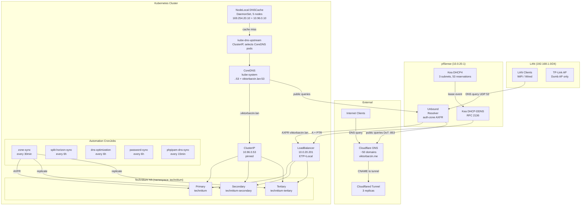

# DNS Architecture

Last updated: 2026-04-19 (WS C — NodeLocal DNSCache deployed; WS D — pfSense Unbound replaces dnsmasq; WS E — Kea multi-IP DHCP option 6 + TSIG-signed DDNS)

## Overview

DNS is served by a split architecture: **Technitium DNS** handles internal resolution (`.viktorbarzin.lan`) and recursive lookups, while **Cloudflare DNS** manages all public domains (`.viktorbarzin.me`). Kubernetes pods use **CoreDNS** which forwards to Technitium for internal zones. All three Technitium instances run on encrypted block storage with zone replication via AXFR every 30 minutes. A **NodeLocal DNSCache** DaemonSet runs on every node and transparently intercepts pod DNS traffic, caching responses locally so pods keep resolving even during CoreDNS, Technitium, or pfSense disruptions.

## Architecture Diagram



## Components

| Component | Location | Version | Purpose |
|-----------|----------|---------|---------|
| Technitium DNS | K8s namespace `technitium` | 14.3.0 | Primary internal DNS + recursive resolver |
| CoreDNS | K8s `kube-system` | Cluster default | K8s service discovery + forwarding to Technitium |
| NodeLocal DNSCache | K8s `kube-system` (DaemonSet) | `k8s-dns-node-cache:1.23.1` | Per-node DNS cache, transparent interception on 10.96.0.10 + 169.254.20.10. Insulates pods from CoreDNS/Technitium/pfSense disruption. |
| Cloudflare DNS | SaaS | N/A | Public domain management (~50 domains) |
| pfSense Unbound | 10.0.20.1 | pfSense 2.7.2 (Unbound 1.19) | DNS resolver on LAN/OPT1/WAN; AXFR-slaves `viktorbarzin.lan` from Technitium; DoT upstream to Cloudflare |
| Kea DHCP-DDNS | 10.0.20.1 | pfSense 2.7.x | Automatic DNS registration on DHCP lease |
| phpIPAM | K8s namespace `phpipam` | v1.7.0 | IPAM ↔ DNS bidirectional sync |

### Terraform Stacks

| Stack | Path | DNS Resources |
|-------|------|---------------|
| Technitium | `stacks/technitium/` | 3 deployments, services, PVCs, 4 CronJobs, CoreDNS ConfigMap |
| NodeLocal DNSCache | `stacks/nodelocal-dns/` | DaemonSet (5 pods), ConfigMap, kube-dns-upstream Service, headless metrics Service |
| Cloudflared | `stacks/cloudflared/` | Cloudflare DNS records (A, AAAA, CNAME, MX, TXT), tunnel config |
| phpIPAM | `stacks/phpipam/` | dns-sync CronJob, pfsense-import CronJob |
| pfSense | `stacks/pfsense/` | VM config only (Unbound config is managed out-of-band via pfSense web UI / direct config.xml edits; see `docs/runbooks/pfsense-unbound.md`) |

## DNS Resolution Paths

### K8s Pod → Internal Domain (.viktorbarzin.lan)

```
Pod → NodeLocal DNSCache (intercepts on kube-dns:10.96.0.10)
  → cache hit: serve locally (TTL 30s / stale up to 86400s via CoreDNS upstream)
  → cache miss: forward to kube-dns-upstream (selects CoreDNS pods directly)
     → CoreDNS: template matches 2+ labels before .viktorbarzin.lan → NXDOMAIN
     → CoreDNS: forward to Technitium ClusterIP (10.96.0.53)
     → Technitium resolves from viktorbarzin.lan zone
```

The ndots:5 template in CoreDNS short-circuits queries like `www.cloudflare.com.viktorbarzin.lan` (caused by K8s search domain expansion) by returning NXDOMAIN for any query with 2+ labels before `.viktorbarzin.lan`. Only single-label queries (e.g., `idrac.viktorbarzin.lan`) reach Technitium.

### K8s Pod → Public Domain

```
Pod → NodeLocal DNSCache (intercepts on kube-dns:10.96.0.10)
  → cache hit: serve locally
  → cache miss: forward to kube-dns-upstream (selects CoreDNS pods directly)
     → CoreDNS: forward to pfSense (10.0.20.1), fallback 8.8.8.8, 1.1.1.1
     → pfSense Unbound:
        - .viktorbarzin.lan → local auth-zone (AXFR-cached from Technitium)
        - public → DoT to Cloudflare (1.1.1.1 / 1.0.0.1 port 853)
```

### LAN Client (192.168.1.x) → Any Domain

```
Client gets DNS=192.168.1.2 (pfSense WAN) from DHCP
  → pfSense Unbound listens on 192.168.1.2:53 directly (no NAT rdr)
    - .viktorbarzin.lan → auth-zone (AXFR-cached from Technitium 10.0.20.201)
      Survives full Technitium/K8s outage — auth-zone keeps serving from
      /var/unbound/viktorbarzin.lan.zone with `fallback-enabled: yes`.
    - .viktorbarzin.me (non-proxied) and other public → DoT to Cloudflare
      (1.1.1.1 / 1.0.0.1 on port 853, SNI cloudflare-dns.com)
```

**Trade-off vs. prior NAT rdr**: Split Horizon hairpin translation
(`176.12.22.76 → 10.0.20.200` for 192.168.1.x clients) was only applied
when queries reached Technitium via the NAT rdr. With Unbound answering
on 192.168.1.2:53 directly, non-proxied `*.viktorbarzin.me` queries on the
192.168.1.x LAN return the public IP, which the TP-Link AP can't hairpin.
If hairpin is broken on LAN for a given non-proxied service, the fix is
either (a) switch the service to proxied (via `dns_type = "proxied"`)
or (b) add a local-data override on pfSense Unbound. The pre-Unbound
state is documented in the `docs/runbooks/pfsense-unbound.md` rollback
section.

### Management VLAN (10.0.10.x) → Any Domain

```
Client gets DNS from Kea DHCP → pfSense (10.0.10.1)
  → pfSense Unbound:
    - .viktorbarzin.lan → auth-zone (local)
    - other → DoT to Cloudflare (1.1.1.1 / 1.0.0.1 port 853)
```

### K8s VLAN (10.0.20.x) → Any Domain

```
Client gets DNS from Kea DHCP → pfSense (10.0.20.1)
  → pfSense Unbound:
    - .viktorbarzin.lan → auth-zone (local)
    - other → DoT to Cloudflare (1.1.1.1 / 1.0.0.1 port 853)
```

## Technitium DNS — Internal DNS Server

### Deployment Topology

Three independent Technitium instances, each with its own encrypted block storage PVC (`proxmox-lvm-encrypted`, 2Gi each):

| Instance | Deployment | PVC | Web Service | Role |
|----------|-----------|-----|-------------|------|
| Primary | `technitium` | `technitium-primary-config-encrypted` | `technitium-web:5380` | Authoritative primary, zone edits happen here |
| Secondary | `technitium-secondary` | `technitium-secondary-config-encrypted` | `technitium-secondary-web:5380` | AXFR replica |
| Tertiary | `technitium-tertiary` | `technitium-tertiary-config-encrypted` | `technitium-tertiary-web:5380` | AXFR replica |

All three pods share the `dns-server=true` label, so the DNS LoadBalancer (10.0.20.201) and ClusterIP (10.96.0.53) route queries to any healthy instance.

### High Availability

- **Pod anti-affinity**: `required` on `kubernetes.io/hostname` — all 3 pods run on different nodes
- **PodDisruptionBudget**: `minAvailable=2` — at least 2 DNS pods survive voluntary disruptions
- **Recreate strategy**: Each deployment uses `Recreate` (RWO block storage)
- **Zone sync CronJob** (`technitium-zone-sync`, every 30min): Replicates all primary zones to secondary/tertiary via AXFR. Idempotent — skips existing zones, creates missing ones as Secondary type.

### Services

| Service | Type | IP | Selector | Purpose |
|---------|------|-----|----------|---------|
| `technitium-dns` | LoadBalancer | 10.0.20.201 | `dns-server=true` | External LAN access, `externalTrafficPolicy: Local` |
| `technitium-dns-internal` | ClusterIP | 10.96.0.53 (pinned) | `dns-server=true` | CoreDNS forwarding, survives Service recreation |
| `technitium-primary` | ClusterIP | auto | `app=technitium` | Zone transfers (AXFR) + API access to primary only |
| `technitium-web` | ClusterIP | auto | `app=technitium` | Web UI (port 5380) + DoH (port 80) |
| `technitium-secondary-web` | ClusterIP | auto | `app=technitium-secondary` | Secondary API access |
| `technitium-tertiary-web` | ClusterIP | auto | `app=technitium-tertiary` | Tertiary API access |

### Zones

**Primary zones** (managed on primary, replicated to secondary/tertiary):

| Zone | Type | Records | Notes |
|------|------|---------|-------|
| `viktorbarzin.lan` | Primary | 30+ A/CNAME | Internal hosts (idrac, grafana, proxmox, vaultwarden, etc.) |
| `10.0.10.in-addr.arpa` | Primary | PTR | Reverse DNS for management VLAN |
| `20.0.10.in-addr.arpa` | Primary | PTR | Reverse DNS for K8s VLAN |
| `1.168.192.in-addr.arpa` | Primary | PTR | Reverse DNS for LAN |
| `2.3.10.in-addr.arpa` | Primary | PTR | Reverse DNS for VPN |
| `0.168.192.in-addr.arpa` | Primary | PTR | Reverse DNS for Valchedrym site |
| `emrsn.org` | Primary (stub) | — | Returns NXDOMAIN locally (avoids 27K+ daily corporate query floods) |

**Dynamic updates**: Enabled via `UseSpecifiedNetworkACL` from pfSense IPs (10.0.20.1, 10.0.10.1, 192.168.1.2) **AND require a valid TSIG signature** on `viktorbarzin.lan`, `10.0.10.in-addr.arpa`, `20.0.10.in-addr.arpa`, `1.168.192.in-addr.arpa`. Policy: `updateSecurityPolicies = [{tsigKeyName: "kea-ddns", domain: "*.<zone>", allowedTypes: ["ANY"]}]`. Unsigned updates from the allowlisted pfSense source IPs are refused ("Dynamic Updates Security Policy"). TSIG key `kea-ddns` (HMAC-SHA256) present on primary/secondary/tertiary; secret in Vault `secret/viktor/kea_ddns_tsig_secret`. Applied 2026-04-19 (WS E, bd `code-o6j`).

### Resolver Settings

| Setting | Value | Rationale |
|---------|-------|-----------|
| Forwarders | Cloudflare DoH (1.1.1.1, 1.0.0.1) | Encrypted upstream DNS |
| Cache max entries | 100K | Ample for homelab |
| Cache min TTL | 60s | Reduces re-queries for short-TTL domains (e.g., headscale: 18s) |
| Cache max TTL | 7 days | Long cache for stable records |
| Serve stale | Enabled (3 days) | Resilience during upstream failures |

### Ad Blocking

Technitium runs built-in DNS blocking with:
- **OISD Big List** (~486K domains)
- **StevenBlack hosts list**

Blocking is enabled on all three instances (`DNS_SERVER_ENABLE_BLOCKING=true` on secondary/tertiary).

### Query Logging

| Backend | Status | Retention | Purpose |
|---------|--------|-----------|---------|
| MySQL (`technitium` DB) | Disabled | — | Legacy, disabled by password-sync CronJob |
| PostgreSQL (`technitium` DB on CNPG) | Enabled | 90 days | Primary query log store |

Grafana dashboard (`grafana-technitium-dashboard` ConfigMap) visualizes query logs from the MySQL datasource. A Grafana datasource is auto-provisioned via sidecar.

### Web UI & Ingress

- **Web UI**: `technitium.viktorbarzin.me` (Authentik-protected via `ingress_factory`)
- **DNS-over-HTTPS**: `dns.viktorbarzin.me` (separate ingress, port 80)
- **Homepage widget**: Technitium widget showing totalQueries, totalCached, totalBlocked, totalRecursive

## Split Horizon (Hairpin NAT Fix)

### Problem

The TP-Link AP (dumb AP on 192.168.1.x) does not support hairpin NAT. LAN clients resolving non-proxied `*.viktorbarzin.me` domains get the public IP `176.12.22.76`, but can't reach it because the TP-Link won't route back to the local network.

### Solution

Technitium's **Split Horizon AddressTranslation** app post-processes DNS responses for 192.168.1.0/24 clients, translating the public IP to the internal Traefik LB IP:

```
176.12.22.76 → 10.0.20.200
```

**DNS Rebinding Protection** has `viktorbarzin.me` in `privateDomains` to allow the translated private IP without being stripped as a rebinding attack.

### Scope

- **Affected**: Non-proxied domains (ha-sofia, immich, headscale, calibre, vaultwarden, etc.) for 192.168.1.x clients
- **Not affected**: Cloudflare-proxied domains (resolve to Cloudflare edge IPs, no translation needed)
- **Not affected**: 10.0.x.x and K8s clients (reach public IP via pfSense outbound NAT normally)

Config is synced to all 3 Technitium instances by CronJob `technitium-split-horizon-sync` (every 6h).

## NodeLocal DNSCache

A DaemonSet in `kube-system` (`node-local-dns`, image `registry.k8s.io/dns/k8s-dns-node-cache:1.23.1`) runs on every node including the control plane. Each pod uses `hostNetwork: true` + `NET_ADMIN` and installs iptables NOTRACK rules so it transparently serves DNS on both:

- **169.254.20.10** — the canonical link-local IP from the upstream docs
- **10.96.0.10** — the `kube-dns` ClusterIP, so existing pods (which already use this as their nameserver) hit the on-node cache with no kubelet change

Cache misses go to a separate `kube-dns-upstream` ClusterIP service (not `kube-dns`, to avoid looping back to ourselves) that selects the CoreDNS pods directly via `k8s-app=kube-dns`.

Priority class is `system-node-critical`; tolerations are permissive (`operator: Exists`) so the DaemonSet runs on tainted master and other reserved nodes. Kyverno `dns_config` drift is suppressed via `ignore_changes` on the DaemonSet.

**Caching**: `cluster.local:53` caches 9984 success / 9984 denial entries with 30s/5s TTLs. Other zones cache 30s. If CoreDNS is killed, nodes keep answering cached names — verified on 2026-04-19 by deleting all three CoreDNS pods and running `dig @169.254.20.10 idrac.viktorbarzin.lan` + `dig @169.254.20.10 github.com` from a pod (both returned answers).

**Kubelet clusterDNS**: **Unchanged** — still `10.96.0.10`. NodeLocal DNSCache co-listens on that IP so traffic interception is transparent; switching kubelet to `169.254.20.10` would require a rolling reconfigure of every node and provides no additional cache benefit over transparent mode.

**Metrics**: A headless Service `node-local-dns` (ClusterIP `None`) exposes each pod on port `9253` for Prometheus scraping (annotated `prometheus.io/scrape=true`).

## CoreDNS Configuration

CoreDNS is managed via Terraform in `stacks/technitium/modules/technitium/` — the Corefile ConfigMap lives in `main.tf`, and scaling/PDB are in `coredns.tf` (a `kubernetes_deployment_v1_patch` against the kubeadm-managed Deployment).

```
.:53 {
  errors / health / ready
  kubernetes cluster.local in-addr.arpa ip6.arpa  # K8s service discovery
  prometheus :9153                                  # Metrics
  forward . 10.0.20.1 8.8.8.8 1.1.1.1 {
      policy sequential                             # try upstreams in order
      health_check 5s                               # mark unhealthy in 5s
      max_fails 2
  }
  cache {
    success 10000 300 6
    denial 10000 300 60
    serve_stale 86400s                        # resilience during upstream outage
  }
  loop / reload / loadbalance
}

viktorbarzin.lan:53 {
  template: .*\..*\.viktorbarzin\.lan\.$ → NXDOMAIN  # ndots:5 junk filter
  forward . 10.96.0.53 {                             # Technitium ClusterIP
    health_check 5s
    max_fails 2
  }
  cache (success 10000 300, denial 10000 300, serve_stale 86400s)
}
```

**Scaling**: 3 replicas, `required` anti-affinity on `kubernetes.io/hostname` (spread across 3 distinct nodes). PodDisruptionBudget `coredns` with `minAvailable=2`.

**Kyverno ndots injection**: A Kyverno policy injects `ndots:2` on all pods cluster-wide to reduce search domain expansion noise. The template regex is a second layer of defense for any queries that still get expanded.

**Failover behaviour**: With `policy sequential` on the root forward block, CoreDNS tries pfSense first; if `health_check 5s` detects pfSense as down, it fails over to 8.8.8.8 then 1.1.1.1 within ~5s rather than timing out per-query. Combined with `serve_stale`, pods keep resolving cached names for up to 24h even with full upstream failure.

## Cloudflare DNS — External Domains

All public domains are under the `viktorbarzin.me` zone. DNS records are **auto-created per service** via the `ingress_factory` module's `dns_type` parameter. A small number of records (Helm-managed ingresses, special cases) remain centrally managed in `config.tfvars`.

### How DNS Records Are Created

```
stacks/<service>/main.tf
  module "ingress" {
    source   = ingress_factory
    dns_type = "proxied"    # ← auto-creates Cloudflare DNS record
  }
```

- **`dns_type = "proxied"`**: Creates CNAME → `{tunnel_id}.cfargotunnel.com` (Cloudflare CDN)
- **`dns_type = "non-proxied"`**: Creates A → public IP + AAAA → IPv6
- **`dns_type = "none"`** (default): No DNS record

The Cloudflare tunnel uses a **wildcard rule** (`*.viktorbarzin.me → Traefik`) — no per-hostname tunnel config needed. Traefik handles host-based routing via K8s Ingress resources.

### Record Types

| Type | Records | Target | Example |
|------|---------|--------|---------|
| Proxied CNAME | ~100 domains | `{tunnel_id}.cfargotunnel.com` | blog, hackmd, homepage, ntfy |
| Non-proxied A | ~35 domains | `176.12.22.76` (public IP) | mail, headscale, immich |
| Non-proxied AAAA | ~35 domains | IPv6 (HE tunnel) | Same as non-proxied A |
| MX | 1 | `mail.viktorbarzin.me` | Inbound email |
| TXT (SPF) | 1 | `v=spf1 include:mailgun.org -all` | Email authentication |
| TXT (DKIM) | 4 | RSA keys (s1, mail, brevo1, brevo2) | Email signing |
| TXT (DMARC) | 1 | `v=DMARC1; p=quarantine; pct=100` | Email policy |
| TXT (MTA-STS) | 1 | `v=STSv1; id=20260412` | TLS enforcement |
| TXT (TLSRPT) | 1 | `v=TLSRPTv1; rua=mailto:postmaster@...` | TLS reporting |
| A (keyserver) | 1 | `130.162.165.220` (Oracle VPS) | PGP keyserver |

### Proxied vs Non-Proxied

- **Proxied (orange cloud)**: Traffic routes through Cloudflare CDN → Cloudflared tunnel → Traefik. Benefits: DDoS protection, caching, no public IP exposure.
- **Non-proxied (grey cloud)**: DNS resolves directly to public IP. Required for services needing direct connections (mail, VPN, WebSocket-heavy apps).

### Zone Settings

- **HTTP/3 (QUIC)**: Enabled globally via `cloudflare_zone_settings_override`

## DHCP → DNS Auto-Registration

Devices get automatic DNS registration without manual intervention. See [networking.md § IPAM & DNS Auto-Registration](networking.md#ipam--dns-auto-registration) for the full data flow diagram.

Summary:
1. **Kea DHCP** on pfSense assigns IP (53 reservations across 3 subnets). DHCP option 6 (DNS servers) is pushed with two IPs per internal subnet: internal resolver + AdGuard public fallback (`94.140.14.14`) — clients survive an internal DNS outage.
2. **Kea DDNS** sends **TSIG-signed** RFC 2136 dynamic update to Technitium (A + PTR records) — immediate. Key `kea-ddns` (HMAC-SHA256); Technitium enforces both source-IP ACL and TSIG signature on `viktorbarzin.lan` + reverse zones.
3. **phpipam-pfsense-import** CronJob (5min) pulls Kea leases + ARP table into phpIPAM
4. **phpipam-dns-sync** CronJob (15min) pushes named phpIPAM hosts → Technitium A + PTR, pulls Technitium PTR → phpIPAM hostnames

## Automation CronJobs

| CronJob | Schedule | Namespace | Purpose |
|---------|----------|-----------|---------|
| `technitium-zone-sync` | `*/30 * * * *` | technitium | AXFR replication to secondary/tertiary |
| `technitium-password-sync` | `0 */6 * * *` | technitium | Vault-rotated MySQL password → Technitium config, configure PG logging |
| `technitium-split-horizon-sync` | `15 */6 * * *` | technitium | Split Horizon + DNS Rebinding Protection on all 3 instances |
| `technitium-dns-optimization` | `30 */6 * * *` | technitium | Min cache TTL 60s, emrsn.org stub zone |
| `phpipam-dns-sync` | `*/15 * * * *` | phpipam | Bidirectional phpIPAM ↔ Technitium DNS sync |
| `phpipam-pfsense-import` | `*/5 * * * *` | phpipam | Import Kea DHCP leases + ARP from pfSense |

### Password Rotation Flow

Vault's database engine rotates the Technitium MySQL password every 7 days. The flow:

```
Vault DB engine rotates password
  → ExternalSecret (refreshInterval=15m) pulls from static-creds/mysql-technitium
  → K8s Secret technitium-db-creds updated
  → CronJob technitium-password-sync (every 6h):
    1. Logs into Technitium API
    2. Disables MySQL query logging (migrated to PG)
    3. Checks PG plugin is loaded (warns if missing)
    4. Configures PG query logging (90-day retention)
```

## Monitoring

| Metric Source | Dashboard | Alerts |
|---------------|-----------|--------|
| Technitium query logs (PostgreSQL) | Grafana `technitium-dns.json` | — |
| CoreDNS Prometheus metrics (:9153) | Grafana CoreDNS dashboard | `CoreDNSErrors`, `CoreDNSForwardFailureRate` |
| Technitium zone-sync CronJob (Pushgateway) | — | `TechnitiumZoneSyncFailed`, `TechnitiumZoneSyncStale`, `TechnitiumZoneCountMismatch` |
| Technitium DNS pod availability | — | `TechnitiumDNSDown` |
| `dns-anomaly-monitor` CronJob (Pushgateway) | — | `DNSQuerySpike`, `DNSQueryRateDropped`, `DNSHighErrorRate` |
| Uptime Kuma | External monitors for all proxied domains | ExternalAccessDivergence (15min) |

### Metrics pushed by `technitium-zone-sync`

The zone-sync CronJob (runs every 30min) pushes the following to the Prometheus Pushgateway under `job=technitium-zone-sync`:

| Metric | Labels | Meaning |
|--------|--------|---------|
| `technitium_zone_sync_status` | — | 0 = last run succeeded, 1 = at least one zone failed to create |
| `technitium_zone_sync_failures` | — | Number of zones that failed to create this run |
| `technitium_zone_sync_last_run` | — | Unix timestamp of last run (used by `TechnitiumZoneSyncStale`) |
| `technitium_zone_count` | `instance=primary\|<replica-host>` | Zone count on each Technitium instance (drives `TechnitiumZoneCountMismatch`) |

### DNS alert rewrites

- `DNSQuerySpike` was previously broken: it compared current queries against `dns_anomaly_avg_queries`, which was computed from a per-pod `/tmp/dns_avg` file. Each CronJob run started with a fresh `/tmp`, so `NEW_AVG == TOTAL_QUERIES` every time and the spike condition could never fire. Rewritten to use `avg_over_time(dns_anomaly_total_queries[1h] offset 15m)` which compares against the actual 1h Prometheus history.
- `DNSQueryRateDropped` (new): fires when query rate drops below 50% of 1h average — upstream clients may be failing to reach Technitium.

## Troubleshooting

### DNS Not Resolving Internal Domains

1. Check NodeLocal DNSCache pods first — pod queries go through these: `kubectl -n kube-system get pod -l k8s-app=node-local-dns -o wide`
2. Check Technitium pods: `kubectl get pod -n technitium`
3. Check all 3 are healthy: `kubectl get pod -n technitium -l dns-server=true`
4. Test via NodeLocal DNSCache from a pod: `kubectl exec -it <pod> -- dig @169.254.20.10 idrac.viktorbarzin.lan`
5. Bypass NodeLocal DNSCache (test CoreDNS directly): `kubectl exec -it <pod> -- dig @<kube-dns-upstream-ClusterIP> idrac.viktorbarzin.lan` (`kubectl get svc -n kube-system kube-dns-upstream`)
6. Check CoreDNS logs: `kubectl logs -n kube-system -l k8s-app=kube-dns`
7. Verify ClusterIP service: `kubectl get svc -n technitium technitium-dns-internal`

### LAN Clients Can't Resolve

1. Verify pfSense Unbound is running: `ssh admin@10.0.20.1 "sockstat -l -4 -p 53 | grep unbound"` — expect listeners on `192.168.1.2:53`, `10.0.10.1:53`, `10.0.20.1:53`, `127.0.0.1:53`
2. Verify the auth-zone is loaded: `ssh admin@10.0.20.1 "unbound-control -c /var/unbound/unbound.conf list_auth_zones"` — expect `viktorbarzin.lan. serial N`
3. Test from LAN: `dig @192.168.1.2 idrac.viktorbarzin.lan` (should return with `aa` flag)
4. Test public upstream: `dig @192.168.1.2 example.com +dnssec` (should have `ad` flag — DoT via Cloudflare working)
5. If auth-zone can't AXFR: check Technitium `viktorbarzin.lan` zone options → `zoneTransferNetworkACL` contains `10.0.20.1, 10.0.10.1, 192.168.1.2`
6. See `docs/runbooks/pfsense-unbound.md` for full Unbound runbook and rollback instructions

### Hairpin NAT Not Working (LAN → *.viktorbarzin.me Fails)

Since 2026-04-19 (Workstream D), pfSense Unbound answers LAN DNS queries
directly instead of forwarding to Technitium, so the Technitium Split Horizon
post-processing does NOT run for 192.168.1.x clients anymore. Non-proxied
services break hairpin on LAN clients again. Options:

1. **Switch service to proxied Cloudflare** (preferred) — set `dns_type = "proxied"` in the `ingress_factory` module call; DNS now resolves to Cloudflare edge, hairpin-independent.
2. **Add a local-data override on pfSense Unbound** — under `Services → DNS Resolver → Host Overrides`, set `<service>.viktorbarzin.me → 10.0.20.200` (Traefik LB IP). This is equivalent to what Split Horizon did, applied at the resolver.
3. **Revert to prior NAT rdr + Technitium Split Horizon** — documented in `docs/runbooks/pfsense-unbound.md` rollback section.

K8s-side Split Horizon is still configured and applies when `*.viktorbarzin.me` queries DO reach Technitium (e.g., from pods that query via CoreDNS → Technitium forwarding for `.viktorbarzin.me` via pfSense). Verify Technitium split-horizon app:

1. Verify Split Horizon app is installed on all instances
2. Check CronJob status: `kubectl get cronjob -n technitium technitium-split-horizon-sync`
3. Run the job manually: `kubectl create job --from=cronjob/technitium-split-horizon-sync test-sh -n technitium`
4. Test: `dig @10.0.20.201 immich.viktorbarzin.me` — should return 10.0.20.200 for 192.168.1.x source

### Zone Not Replicating to Secondary/Tertiary

1. Check zone-sync CronJob: `kubectl get cronjob -n technitium technitium-zone-sync`
2. Check recent jobs: `kubectl get jobs -n technitium | grep zone-sync`
3. Verify AXFR is enabled on primary: Check zone options → Zone Transfer = Allow
4. Run sync manually: `kubectl create job --from=cronjob/technitium-zone-sync test-sync -n technitium`

### High NXDOMAIN Rate in Logs

Common causes:
- **ndots:5 expansion**: Pods query `host.search.domain.viktorbarzin.lan` — mitigated by CoreDNS template + Kyverno ndots:2
- **Corporate domains (emrsn.org)**: 27K+ daily queries — mitigated by stub zone returning NXDOMAIN locally
- **Ad blocking**: Expected for blocked domains

### Adding a New DNS Record

For internal `.viktorbarzin.lan` records:
1. Add host in phpIPAM web UI (`phpipam.viktorbarzin.me`) with hostname
2. Wait 15 minutes for `phpipam-dns-sync` to push to Technitium
3. Or add directly in Technitium web UI (`technitium.viktorbarzin.me`)

For external `.viktorbarzin.me` records:
1. Add `dns_type = "proxied"` (or `"non-proxied"`) to the `ingress_factory` module call in the service stack
2. Run `scripts/tg apply` on the service stack — DNS record is auto-created
3. For non-standard records (MX, TXT), add a `cloudflare_record` resource in `stacks/cloudflared/modules/cloudflared/cloudflare.tf`

## Incident History

- **2026-04-14 (SEV1)**: NFS `fsid=0` caused Technitium primary data loss on restart. Fixed by migrating all 3 instances to `proxmox-lvm-encrypted`, adding zone-sync CronJob (30min AXFR). See [post-mortem](../post-mortems/2026-04-14-nfs-fsid0-dns-vault-outage.md).
- **2026-04-19 (hardening, not outage)**: Workstream D — pfSense Unbound replaces dnsmasq as the pfSense DNS service. Unbound AXFR-slaves `viktorbarzin.lan` from Technitium so LAN-side resolution survives a full K8s outage. WAN NAT rdr `192.168.1.2:53 → 10.0.20.201` removed (Unbound listens on WAN directly). DoT upstream via Cloudflare. See `docs/runbooks/pfsense-unbound.md` and bd `code-k0d`.
- **2026-04-19 (hardening, not outage)**: Workstream E — Kea DHCP now pushes TWO DNS IPs (internal + AdGuard public fallback `94.140.14.14`) via option 6 to the internal subnets (10.0.10/24, 10.0.20/24); 192.168.1/24 was already dual-IP (served by TP-Link). Kea DHCP-DDNS now TSIG-signs its RFC 2136 updates (key `kea-ddns`, HMAC-SHA256) and the Technitium zones require both source-IP ACL AND TSIG signature. See `docs/runbooks/pfsense-unbound.md` § "Kea DHCP-DDNS TSIG" and bd `code-o6j`.

## Related

- [Networking Architecture](networking.md) — VLAN topology, IPAM auto-registration, ingress flow, MetalLB
- [Mailserver Architecture](mailserver.md) — DNS records for email (MX, SPF, DKIM, DMARC)
- [Security Architecture](security.md) — Kyverno ndots policy
- [Monitoring Architecture](monitoring.md) — CoreDNS metrics, Uptime Kuma external monitors
- Runbook: `docs/runbooks/add-dns-record.md` (referenced but not yet created)
