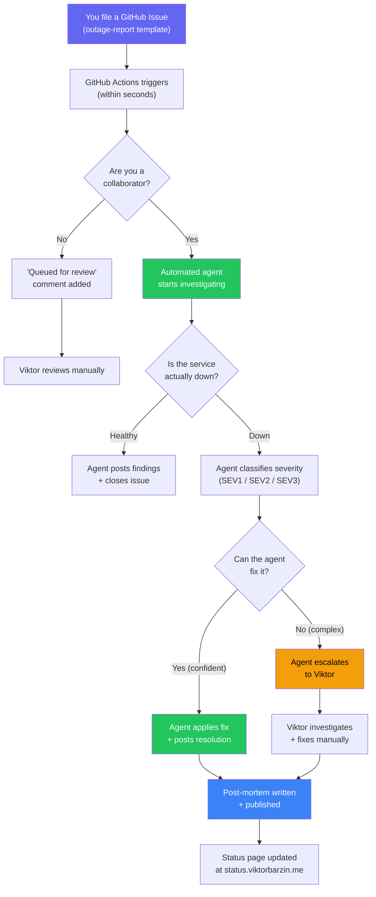
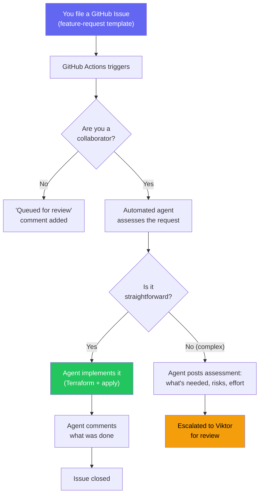

# Contributing to the Infrastructure

Welcome! This doc explains how to report issues, request features, and what happens behind the scenes.

## Quick Links

| What | Where |
|------|-------|
| Report an outage | [File an issue](https://github.com/ViktorBarzin/infra/issues/new?template=outage-report.yml) |
| Request a feature | [File a request](https://github.com/ViktorBarzin/infra/issues/new?template=feature-request.yml) |
| Check service status | [status.viktorbarzin.me](https://status.viktorbarzin.me) |
| View past incidents | [Post-mortems](https://viktorbarzin.github.io/infra/post-mortems/) |
| Uptime dashboard | [uptime.viktorbarzin.me](https://uptime.viktorbarzin.me) |
| Grafana dashboards | [grafana.viktorbarzin.me](https://grafana.viktorbarzin.me) |

---

## Reporting an Outage

If something is broken, [file an outage report](https://github.com/ViktorBarzin/infra/issues/new?template=outage-report.yml). The form asks for:

- **Which service** is affected (dropdown)
- **What you see** (error message, behavior)
- **What kind of error** (502, timeout, auth, slow, etc.)
- **When it started**
- **Is it just you or others too?**

### What makes a good report

**Good:**
> Nextcloud at nextcloud.viktorbarzin.me returns 502 Bad Gateway since ~14:00 UTC.
> Other services seem fine. Tried incognito — same result.

**Also good (minimal):**
> Home Assistant not loading since this morning

**Not helpful:**
> Nothing works

### What happens after you report

### What to expect

| Scenario | Response time | Who handles it |
|----------|--------------|----------------|
| Service is actually healthy | ~5 minutes | Automated agent checks and closes |
| Simple fix (pod restart, config) | ~10 minutes | Automated agent fixes and reports |
| Complex issue (data, architecture) | ~30 min to acknowledge | Agent investigates, escalates to Viktor |
| Non-collaborator report | Hours | Queued for manual review |

### After resolution

For SEV1 and SEV2 incidents, a **post-mortem** is automatically written documenting:
- What happened and the timeline
- Root cause analysis
- What was done to prevent recurrence

Post-mortems are published at [viktorbarzin.github.io/infra/post-mortems](https://viktorbarzin.github.io/infra/post-mortems/).

---

## Requesting a Feature

Want a new service deployed, a config change, or a new monitor? [File a feature request](https://github.com/ViktorBarzin/infra/issues/new?template=feature-request.yml).

Just describe what you need — be specific.

### What happens after you request

### Examples of what the agent can do automatically

- Add an Uptime Kuma monitor for a service
- Deploy a known service (Helm chart or standard Terraform stack)
- Change resource limits, replica counts
- Add a DNS record
- Configure an ingress route

### Examples of what gets escalated

- Deploy a completely new/unknown service
- Architecture changes (HA, storage migration)
- Changes to core platform (auth, DNS, ingress, databases)
- Anything involving data migration or secrets

---

## Before Reporting — Self-Service Checks

| Symptom | Quick check |
|---------|-------------|
| Service returns 502/503 | Check [status page](https://status.viktorbarzin.me) — is the service shown as down? |
| Can't login (SSO) | Try incognito window — might be cached auth cookie |
| Slow performance | Check [Grafana](https://grafana.viktorbarzin.me) for node memory/CPU pressure |
| DNS not resolving | Try `nslookup <domain> 10.0.20.201` — if that works, flush your DNS cache |
| VPN not connecting | Check [Headscale admin](https://vpn.viktorbarzin.me) for your device status |

---

## Severity Levels

| Level | Definition | Examples | Response |
|-------|-----------|----------|----------|
| **SEV1** | Critical — multiple services down, data at risk, core infra outage | DNS down, auth broken, cluster node unreachable | Immediate automated investigation + escalation |
| **SEV2** | Major — single important service down or significantly degraded | Nextcloud 502, Immich not loading, mail not sending | Automated investigation, fix if possible |
| **SEV3** | Minor — limited impact, workaround available, cosmetic | Slow dashboard, one monitor flapping, non-critical CronJob failed | Noted, fixed when convenient |

---

## Status Page

The status page at [status.viktorbarzin.me](https://status.viktorbarzin.me) shows:

- **Live service status** — updated every 5 minutes from Uptime Kuma monitors
- **Active incidents** — SEV-classified with timelines and affected services
- **User reports** — issues filed by users, with error type and scope
- **Recently resolved** — incidents closed in the last 7 days with postmortem links

The status page is hosted on GitHub Pages — it stays up even when the cluster is down.

---

## Architecture (Technical Details)

For contributors who want to understand how the automation works.

### End-to-End Flow

```mermaid
flowchart LR
    subgraph GitHub
        A[Issue Created] --> B[GHA Workflow]
        B --> C{Collaborator?}
    end

    subgraph "Kubernetes Cluster"
        C -->|Yes| D[Woodpecker Pipeline]
        D --> E[Vault Auth<br/>K8s SA JWT]
        E --> F[Fetch API Token]
    end

    subgraph "claude-agent-service (K8s)"
        F --> G[HTTP POST /execute]
        G --> H[issue-responder agent]
        H --> I[Investigate / Implement]
        I --> J[Comment on Issue]
        I --> K[Terraform Apply]
        I --> L[Post-Mortem Pipeline]
    end

    subgraph "Post-Mortem Pipeline"
        L --> M[sev-triage<br/>haiku, ~60s]
        M --> N[Specialists<br/>3-5 agents parallel]
        N --> O[sev-historian<br/>cross-ref past incidents]
        O --> P[sev-report-writer<br/>write report + action items]
        P --> Q[postmortem-todo-resolver<br/>implement safe fixes]
    end

    style B fill:#2088ff,color:#fff
    style D fill:#4c9e47,color:#fff
    style H fill:#6366f1,color:#fff
    style Q fill:#6366f1,color:#fff
```

### Components

| Component | Location | Purpose |
|-----------|----------|---------|
| GHA Workflow | `.github/workflows/issue-automation.yml` | Triggers on issue creation, checks collaborator, POSTs to Woodpecker |
| Woodpecker Pipeline | `.woodpecker/issue-automation.yml` | Authenticates to Vault, SSHes to DevVM, runs Claude agent |
| Issue Responder | `.claude/agents/issue-responder.md` | Reads issue, classifies, investigates, fixes or escalates |
| Post-Mortem Orchestrator | `.claude/agents/post-mortem.md` | 4-stage investigation pipeline |
| SEV Triage | `.claude/agents/sev-triage.md` | Fast cluster scan + severity classification |
| SEV Historian | `.claude/agents/sev-historian.md` | Cross-references past incidents |
| SEV Report Writer | `.claude/agents/sev-report-writer.md` | Writes final postmortem + links to issue |
| TODO Resolver | `.claude/agents/postmortem-todo-resolver.md` | Implements safe follow-up fixes |
| Post-Mortem Skill | `.claude/skills/post-mortem/` | Manual `/post-mortem` command |
| Cluster Health | `.claude/skills/cluster-health/` | Health check with auto-filing for SEV1/SEV2 |
| Status Page CronJob | `stacks/status-page/main.tf` | Pushes status + incidents to GitHub Pages every 5 min |
| Issue Templates | `.github/ISSUE_TEMPLATE/` | Structured forms for outage reports + feature requests |

### Safety Guardrails

The automated agent follows strict rules:

- **All changes go through Terraform** — never `kubectl apply` as final state
- **`terraform plan` before every apply** — aborts if any resources would be destroyed
- **Platform stacks are hands-off** — vault, dbaas, traefik, authentik, kyverno always escalate
- **No data deletion** — never deletes PVCs, PVs, or user data
- **Budget capped** — $10 max per issue, $5 per post-mortem run
- **Complex = escalate** — if the agent isn't confident, it assigns to Viktor with findings

### Labels

| Label | Purpose |
|-------|---------|
| `user-report` | Auto-applied to outage reports |
| `feature-request` | Auto-applied to feature requests |
| `incident` | Confirmed incident (appears on status page) |
| `sev1` / `sev2` / `sev3` | Severity classification |
| `postmortem-required` | SEV needs a postmortem |
| `postmortem-done` | Postmortem written and linked |
| `needs-human` | Agent escalated — needs Viktor's attention |

### Commit Conventions

| Pattern | Used by |
|---------|---------|
| `feat: <desc> (fixes #N)` | Issue responder (feature implementations) |
| `fix: <desc> (fixes #N)` | Issue responder (incident fixes) |
| `fix(post-mortem): <action> [PM-YYYY-MM-DD]` | Post-mortem TODO resolver |
| `docs: post-mortem for <date> <title> [ci skip]` | Post-mortem writer |
