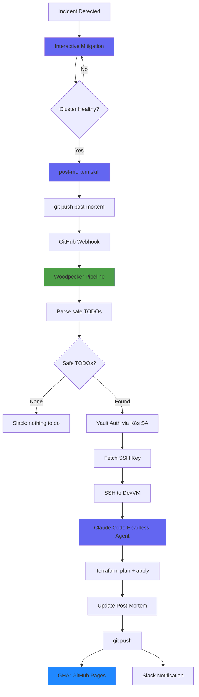

# Incident Response & Post-Mortem Pipeline

## Reporting an Issue

If something is broken or behaving unexpectedly, here's how to report it:

### Where to report

| Channel | When to use | Response time |
|---------|-------------|---------------|
| **Slack #alerts** | Service down, can't access something | Minutes |
| **GitHub Issue** on [ViktorBarzin/infra](https://github.com/ViktorBarzin/infra/issues) | Non-urgent bugs, feature requests, recurring problems | Hours |
| **Direct message Viktor** | Emergencies (DNS down, cluster unreachable, data loss risk) | ASAP |

### What to include

A good issue report helps us fix things faster. Include:

1. **What's broken** — which service, URL, or feature
2. **When it started** — approximate time (timezone!)
3. **What you see** — error message, screenshot, HTTP status code
4. **What you expected** — what should have happened

### Examples

**Good report:**
> Nextcloud at nextcloud.viktorbarzin.me returns 502 Bad Gateway since ~14:00 UTC.
> Was working fine this morning. Other services (Grafana, Immich) seem fine.

**Also good (minimal):**
> ha-sofia.viktorbarzin.lan not resolving — getting NXDOMAIN

**Not helpful:**
> Nothing works

### What happens after you report

```
You report issue
    │
    ▼
Viktor investigates with Claude Code (cluster-health, logs, diagnostics)
    │
    ▼
Fix applied → service restored
    │
    ▼
Post-mortem auto-generated with /post-mortem
    │
    ▼
Post-mortem pushed to repo
    │
    ▼
Automated pipeline implements follow-up fixes (alerts, monitoring, config)
    │
    ▼
Post-mortem updated with implementation links
    │
    ▼
Published at GitHub Pages for review
```

You'll be notified in Slack when:
- Your issue is being investigated
- The fix is applied
- The post-mortem is published (with what was done to prevent recurrence)

### Checking service status

- **Uptime dashboard**: [uptime.viktorbarzin.me](https://uptime.viktorbarzin.me) — real-time status of all services
- **Post-mortems**: [ViktorBarzin/infra post-mortems](https://github.com/ViktorBarzin/infra/tree/master/docs/post-mortems) — past incidents and their fixes
- **Grafana**: [grafana.viktorbarzin.me](https://grafana.viktorbarzin.me) — metrics and dashboards

### Common self-service checks

Before reporting, you can check:

| Symptom | Quick check |
|---------|-------------|
| Service returns 502/503 | Is the pod running? Check [K8s Dashboard](https://dashboard.viktorbarzin.me) |
| Can't login (SSO) | Try incognito window — might be cached auth |
| Slow performance | Check if the node is under memory pressure in Grafana |
| DNS not resolving | Try `nslookup <domain> 10.0.20.201` — if that works, it's client DNS cache |

---

## Overview

Automated incident response pipeline that handles the full lifecycle: detection → mitigation → post-mortem generation → TODO implementation → documentation update. Claude Code agents automate both the post-mortem writing and the follow-up remediation, with human review gates for risky changes.

## Architecture Diagram



## Components

### 1. Post-Mortem Writer Skill

**Location**: `.claude/skills/post-mortem/`

| File | Purpose |
|------|---------|
| `skill.md` | Skill definition — triggered by `/post-mortem` command |
| `template.md` | Standard post-mortem markdown template |

**When to use**: After mitigating an incident. Auto-suggested when cluster health transitions UNHEALTHY → HEALTHY.

**What it generates**:
- Standard fields (date, duration, severity, affected services)
- Timeline from investigation session
- Root cause chain
- Prevention Plan with TODO table (Priority, Action, **Type**, Details, Status)
- Lessons learned
- Follow-up Implementation table (auto-populated by agent)

**Type column** is critical for automation:

| Type | Auto-implementable? | Examples |
|------|---------------------|----------|
| `Alert` | Yes | PrometheusRule, alert thresholds |
| `Config` | Yes | Terraform config, NFS options |
| `Monitor` | Yes | Uptime Kuma HTTP/TCP monitor |
| `Architecture` | No — human review | Storage migration, HA redesign |
| `Investigation` | No — human review | Research, root cause analysis |
| `Migration` | No — human review | Data or service migration |
| `Runbook` | No — human review | Document recovery procedure |

### 2. TODO Parser

**Location**: `scripts/parse-postmortem-todos.sh`

Shell script (POSIX sh + python3) that:
1. Scans a post-mortem markdown file for TODO items in Prevention Plan tables
2. Classifies each TODO as safe (Alert/Config/Monitor) or unsafe
3. Outputs structured JSON:

```json
{
  "file": "docs/post-mortems/2026-04-14-example.md",
  "todos": [{"priority": "P2", "action": "Add NFS alert", "type": "Alert", "details": "...", "safe": true}],
  "skipped": [{"priority": "P1", "action": "Migrate Vault", "type": "Migration", "details": "...", "safe": false}],
  "safe_todos": 3,
  "skipped_todos": 2
}
```

Supports both the new template format (`Priority | Action | Type | Details | Status`) and the legacy format (`Action | Status | Details`), inferring types from action text for legacy.

### 3. Woodpecker Pipeline

**Location**: `.woodpecker/postmortem-todos.yml`

**Trigger**: Push to `master` with changes in `docs/post-mortems/*.md`

**Steps**:

1. **parse-and-implement**: Runs `scripts/postmortem-pipeline.sh` which:
   - Scans all post-mortems for pending TODOs (no git diff — avoids shallow clone issues)
   - Parses safe TODOs via the parser script
   - Authenticates to Vault via K8s Service Account JWT
   - Fetches DevVM SSH key from `secret/ci/infra` → `devvm_ssh_key`
   - SSHes to DevVM (10.0.10.10) and runs Claude Code headless

2. **notify-slack**: Posts pipeline result to Slack

**Authentication chain**: Woodpecker pod → K8s SA token → Vault K8s auth (role: `ci`) → `secret/data/ci/infra` → SSH key → DevVM

### 4. TODO Resolver Agent

**Location**: `.claude/agents/postmortem-todo-resolver.md`

Claude Code agent that runs in headless mode (`claude -p --agent postmortem-todo-resolver`).

**What it does per TODO** (in priority order P0 → P3):
1. Reads relevant Terraform files
2. Implements the change (edit `.tf`, `.tpl`, etc.)
3. Runs `scripts/tg plan` — aborts if any resources would be destroyed
4. Runs `scripts/tg apply --non-interactive`
5. Commits with: `fix(post-mortem): <action> [PM-YYYY-MM-DD]`

**After all TODOs**:
- Updates the Prevention Plan table: `TODO` → `Done`
- Populates the **Follow-up Implementation** table:

| Date | Action | Priority | Type | Commit | Implemented By |
|------|--------|----------|------|--------|----------------|
| 2026-04-14 | Add NFS RPC retransmission alert | P2 | Alert | [`abc1234`](https://github.com/ViktorBarzin/infra/commit/abc1234) | postmortem-todo-resolver |
| — | Migrate Vault to encrypted PVC | P1 | Migration | — | Needs human review |

**Safety guardrails**:
- Only implements Alert, Config, Monitor types
- Never modifies platform stacks (vault, dbaas, traefik, authentik)
- Aborts if Terraform plan shows any destroys
- Budget cap: $5 per run
- Skipped items marked as "Needs human review"

### 5. Cluster Health Auto-Suggest

**Location**: `.claude/skills/cluster-health/SKILL.md`

After running a healthcheck, if the cluster recovered from a previous unhealthy state, the skill suggests:

> The cluster has recovered. Would you like me to write a post-mortem? Run `/post-mortem` to generate one.

## Secrets & Configuration

| Secret | Vault Path | Purpose |
|--------|-----------|---------|
| DevVM SSH key | `secret/ci/infra` → `devvm_ssh_key` | Woodpecker → DevVM SSH access |
| Slack webhook | Woodpecker global secret `slack_webhook` | Pipeline notifications |
| Anthropic API key | `~/.claude/` on DevVM | Claude Code headless mode |

## File Inventory

| File | Type | Description |
|------|------|-------------|
| `.claude/skills/post-mortem/skill.md` | Skill | Post-mortem writer definition |
| `.claude/skills/post-mortem/template.md` | Template | Post-mortem markdown skeleton |
| `.claude/agents/postmortem-todo-resolver.md` | Agent | Headless TODO implementation agent |
| `.woodpecker/postmortem-todos.yml` | Pipeline | Woodpecker CI triggered on post-mortem changes |
| `scripts/postmortem-pipeline.sh` | Script | Pipeline orchestration (parse, auth, SSH, invoke) |
| `scripts/parse-postmortem-todos.sh` | Script | TODO extraction from markdown |
| `docs/post-mortems/` | Directory | All post-mortem documents |
| `docs/post-mortems/index.html` | Static | Post-mortem index page (deployed to GH Pages) |

## Commit Conventions

| Pattern | Used by | Example |
|---------|---------|---------|
| `fix(post-mortem): <action> [PM-YYYY-MM-DD]` | TODO resolver agent | `fix(post-mortem): add NFS alert [PM-2026-04-14]` |
| `docs: post-mortem for <date> <title> [ci skip]` | Post-mortem writer skill | `docs: post-mortem for 2026-04-14 NFS outage [ci skip]` |
| `docs: update post-mortem follow-up [PM-YYYY-MM-DD] [ci skip]` | TODO resolver agent | Final update with Follow-up table |

## Limitations

- **Woodpecker shallow clone**: The pipeline scans all post-mortems for TODOs rather than diffing `HEAD~1` (shallow clone breaks git history)
- **Single DevVM**: The agent runs on 10.0.10.10 — if DevVM is down, pipeline fails. Could be extended to multiple hosts.
- **Anthropic API dependency**: Headless Claude Code requires API access. Budget capped at $5 per run.
- **No interactive approval**: The agent cannot ask for human approval mid-run. Risky items are skipped entirely.
