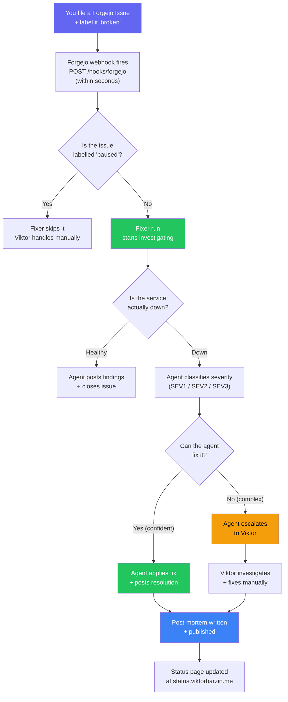
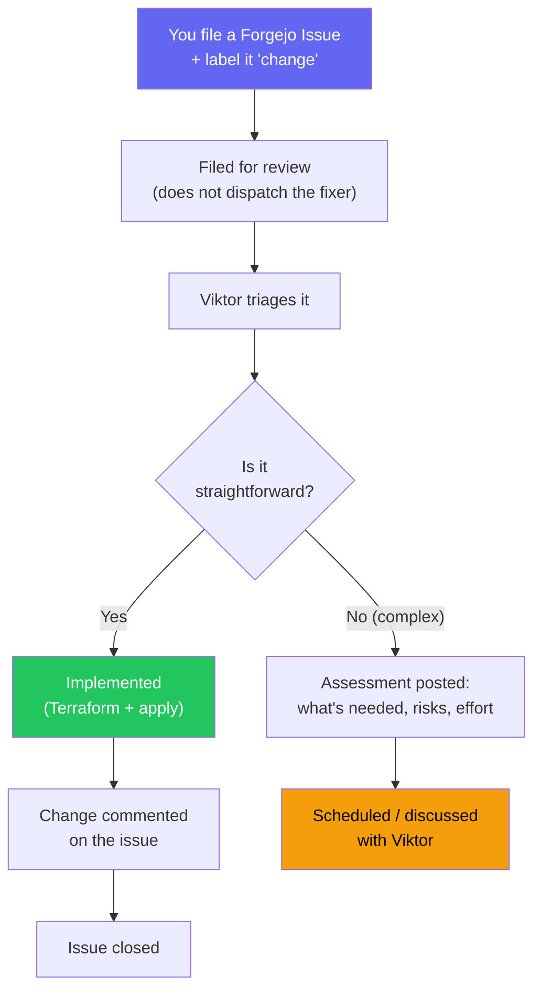

# Contributing to the Infrastructure

Welcome! This doc explains how to report issues, request features, and what happens behind the scenes.

## Quick Links

| What | Where |
|------|-------|
| Report an outage | [File an issue](https://forgejo.viktorbarzin.me/viktor/infra/issues/new) — label it `broken` |
| Request a feature | [File an issue](https://forgejo.viktorbarzin.me/viktor/infra/issues/new) — label it `change` |
| Check service status | [status.viktorbarzin.me](https://status.viktorbarzin.me) |
| View past incidents | [Post-mortems](https://viktorbarzin.github.io/infra/post-mortems/) |
| Uptime dashboard | [uptime.viktorbarzin.me](https://uptime.viktorbarzin.me) |
| Grafana dashboards | [grafana.viktorbarzin.me](https://grafana.viktorbarzin.me) |

---

## Reporting an Outage

If something is broken, [file an issue on Forgejo](https://forgejo.viktorbarzin.me/viktor/infra/issues/new) and add the `broken` label — that is what dispatches the fixer. Include:

- **Which service** is affected
- **What you see** (error message, behavior)
- **What kind of error** (502, timeout, auth, slow, etc.)
- **When it started**
- **Is it just you or others too?**

### What makes a good report

**Good:**
> Nextcloud at nextcloud.viktorbarzin.me returns 502 Bad Gateway since ~14:00 UTC.
> Other services seem fine. Tried incognito — same result.

**Also good (minimal):**
> Home Assistant not loading since this morning

**Not helpful:**
> Nothing works

### What happens after you report

```mermaid
flowchart TD
    A["You file a Forgejo Issue<br/>+ label it 'broken'"] --> B["Forgejo webhook fires<br/>POST /hooks/forgejo<br/>(within seconds)"]
    B --> C{Is the issue<br/>labelled 'paused'?}
    C -->|Yes| D["Fixer skips it<br/>Viktor handles manually"]
    C -->|No| F["Fixer run<br/>starts investigating"]
    F --> G{Is the service<br/>actually down?}
    G -->|"Healthy"| H["Agent posts findings<br/>+ closes issue"]
    G -->|"Down"| I["Agent classifies severity<br/>(SEV1 / SEV2 / SEV3)"]
    I --> J{Can the agent<br/>fix it?}
    J -->|"Yes (confident)"| K["Agent applies fix<br/>+ posts resolution"]
    J -->|"No (complex)"| L["Agent escalates<br/>to Viktor"]
    K --> M["Post-mortem written<br/>+ published"]
    L --> N["Viktor investigates<br/>+ fixes manually"]
    N --> M
    M --> O["Status page updated<br/>at status.viktorbarzin.me"]

    style A fill:#6366f1,color:#fff
    style F fill:#22c55e,color:#fff
    style K fill:#22c55e,color:#fff
    style L fill:#f59e0b,color:#000
    style M fill:#3b82f6,color:#fff
```

### What to expect

| Scenario | Response time | Who handles it |
|----------|--------------|----------------|
| Service is actually healthy | ~5 minutes | Automated agent checks and closes |
| Simple fix (pod restart, config) | ~10 minutes | Automated agent fixes and reports |
| Complex issue (data, architecture) | ~30 min to acknowledge | Fixer investigates, escalates to Viktor |
| Issue labelled `paused` | Manual | Fixer skips it; Viktor handles it directly |

### After resolution

For SEV1 and SEV2 incidents, a **post-mortem** is automatically written documenting:
- What happened and the timeline
- Root cause analysis
- What was done to prevent recurrence

Post-mortems are published at [viktorbarzin.github.io/infra/post-mortems](https://viktorbarzin.github.io/infra/post-mortems/).

---

## Requesting a Feature

Want a new service deployed, a config change, or a new monitor? [File an issue on Forgejo](https://forgejo.viktorbarzin.me/viktor/infra/issues/new) and add the `change` label — it is filed for review rather than dispatching the fixer.

Just describe what you need — be specific.

### What happens after you request

```mermaid
flowchart TD
    A["You file a Forgejo Issue<br/>+ label it 'change'"] --> B["Filed for review<br/>(does not dispatch the fixer)"]
    B --> C["Viktor triages it"]
    C --> F{Is it<br/>straightforward?}
    F -->|"Yes"| G["Implemented<br/>(Terraform + apply)"]
    G --> H["Change commented<br/>on the issue"]
    H --> I["Issue closed"]
    F -->|"No (complex)"| J["Assessment posted:<br/>what's needed, risks, effort"]
    J --> K["Scheduled / discussed<br/>with Viktor"]

    style A fill:#6366f1,color:#fff
    style G fill:#22c55e,color:#fff
    style K fill:#f59e0b,color:#000
```

### Examples of what the agent can do automatically

- Add an Uptime Kuma monitor for a service
- Deploy a known service (Helm chart or standard Terraform stack)
- Change resource limits, replica counts
- Add a DNS record
- Configure an ingress route

### Examples of what gets escalated

- Deploy a completely new/unknown service
- Architecture changes (HA, storage migration)
- Changes to core platform (auth, DNS, ingress, databases)
- Anything involving data migration or secrets

---

## Before Reporting — Self-Service Checks

| Symptom | Quick check |
|---------|-------------|
| Service returns 502/503 | Check [status page](https://status.viktorbarzin.me) — is the service shown as down? |
| Can't login (SSO) | Try incognito window — might be cached auth cookie |
| Slow performance | Check [Grafana](https://grafana.viktorbarzin.me) for node memory/CPU pressure |
| DNS not resolving | Try `nslookup <domain> 10.0.20.201` — if that works, flush your DNS cache |
| VPN not connecting | Check [Headscale admin](https://vpn.viktorbarzin.me) for your device status |

---

## Severity Levels

| Level | Definition | Examples | Response |
|-------|-----------|----------|----------|
| **SEV1** | Critical — multiple services down, data at risk, core infra outage | DNS down, auth broken, cluster node unreachable | Immediate automated investigation + escalation |
| **SEV2** | Major — single important service down or significantly degraded | Nextcloud 502, Immich not loading, mail not sending | Automated investigation, fix if possible |
| **SEV3** | Minor — limited impact, workaround available, cosmetic | Slow dashboard, one monitor flapping, non-critical CronJob failed | Noted, fixed when convenient |

---

## Status Page

The status page at [status.viktorbarzin.me](https://status.viktorbarzin.me) is
served from **mx2**, the offsite OCI VM (ADR-0020): gatus probes the public
services every 60s from outside the homelab, so the page shows live up/down
state and stays reachable even when the cluster, its WAN, or the Cloudflare
tunnel are down. During such an outage the outage-failover Cloudflare Worker
serves this page's `/error.html` to visitors of every proxied host except the
carve-out hosts (terminal, matrix, vault, t3, xray-*, rybbit — quota/non-browsable,
see `stacks/cloudflared/.../worker.tf`), which show the raw Cloudflare error.

(The previous GitHub-Pages implementation — Uptime-Kuma snapshots pushed every
5 minutes by the status-page CronJob — was disabled 2026-05-26 and superseded
by ADR-0020; its incident and report-intake sections went with it. Incident history
lives in the issue tracker and `docs/post-mortems/`.)

---

## Architecture (Technical Details)

For contributors who want to understand how the automation works.

### End-to-End Flow

```mermaid
flowchart LR
    subgraph "Forgejo (viktor/infra)"
        A["Issue labelled<br/>'broken'"] --> B[Webhook fires]
    end

    subgraph "claude-agent-service (K8s)"
        B --> C["POST /hooks/forgejo<br/>HMAC-verified + gated"]
        C -->|repo free| G[Dispatch fixer run]
        C -->|repo busy| T["fixer-tick CronJob<br/>drains the queue"]
        T --> G
        G --> H[issue-responder agent]
        H --> I[Investigate / Implement]
        I --> J[Comment on Issue]
        I --> K[Terraform Apply / push + CI]
        I --> L[Post-Mortem Pipeline]
    end

    subgraph "Post-Mortem Pipeline"
        L --> M[sev-triage<br/>haiku, ~60s]
        M --> N[Specialists<br/>3-5 agents parallel]
        N --> O[sev-historian<br/>cross-ref past incidents]
        O --> P[sev-report-writer<br/>write report + action items]
        P --> Q[postmortem-todo-resolver<br/>implement safe fixes]
    end

    style B fill:#2088ff,color:#fff
    style G fill:#4c9e47,color:#fff
    style H fill:#6366f1,color:#fff
    style Q fill:#6366f1,color:#fff
```

### Components

| Component | Location | Purpose |
|-----------|----------|---------|
| Forgejo webhook | `viktor/infra` -> `POST /hooks/forgejo` | Fires on the `broken` label; signature-verified, gated, dispatches a fixer run |
| fixer-tick CronJob | `stacks/claude-agent-service` | Drains queued `broken` issues and follows pushed commits through CI |
| Issue Responder | `.claude/agents/issue-responder.md` | Reads issue, classifies, investigates, fixes or escalates |
| Post-Mortem Orchestrator | `.claude/agents/post-mortem.md` | 4-stage investigation pipeline |
| SEV Triage | `.claude/agents/sev-triage.md` | Fast cluster scan + severity classification |
| SEV Historian | `.claude/agents/sev-historian.md` | Cross-references past incidents |
| SEV Report Writer | `.claude/agents/sev-report-writer.md` | Writes final postmortem + links to issue |
| TODO Resolver | `.claude/agents/postmortem-todo-resolver.md` | Implements safe follow-up fixes |
| Post-Mortem Skill | `.claude/skills/post-mortem/` | Manual `/post-mortem` command |
| Cluster Health | `.claude/skills/cluster-health/` | Health check with auto-filing for SEV1/SEV2 |
| Status Page CronJob | `stacks/status-page/main.tf` | RETIRED (disabled 2026-05-26) — status page is now gatus on mx2 (ADR-0020) |
| paused label | `viktor/infra` issue label | Per-issue brake — the fixer will not pick up an issue while it carries `paused` |

### Safety Guardrails

The automated agent follows strict rules:

- **All changes go through Terraform** — never `kubectl apply` as final state
- **`terraform plan` before every apply** — aborts if any resources would be destroyed
- **Platform stacks are hands-off** — vault, dbaas, traefik, authentik, kyverno always escalate
- **No data deletion** — never deletes PVCs, PVs, or user data
- **One run at a time** — a per-repo lock serialises fixer runs; burn rate is bounded by that lock rather than a per-run budget or timeout ceiling
- **Complex = escalate** — if the agent isn't confident, it assigns to Viktor with findings

### Labels

| Label | Purpose |
|-------|---------|
| `broken` | Something is not working right now — **dispatches the fixer** |
| `change` | A proposal; nothing is currently failing — filed for review only |
| `agent-in-progress` | A fixer run holds this issue |
| `paused` | Human brake — the fixer will not pick this up |
| `incident` | Confirmed incident (applied by the fixer) |
| `sev1` / `sev2` / `sev3` | Severity classification |
| `postmortem-required` | SEV1/SEV2 — the post-mortem pipeline owes a writeup |
| `needs-human` | Escalated — handed back to a human |

### Commit Conventions

| Pattern | Used by |
|---------|---------|
| `feat: <desc> (fixes #N)` | Issue responder (feature implementations) |
| `fix: <desc> (fixes #N)` | Issue responder (incident fixes) |
| `fix(post-mortem): <action> [PM-YYYY-MM-DD]` | Post-mortem TODO resolver |
| `docs: post-mortem for <date> <title> [ci skip]` | Post-mortem writer |
