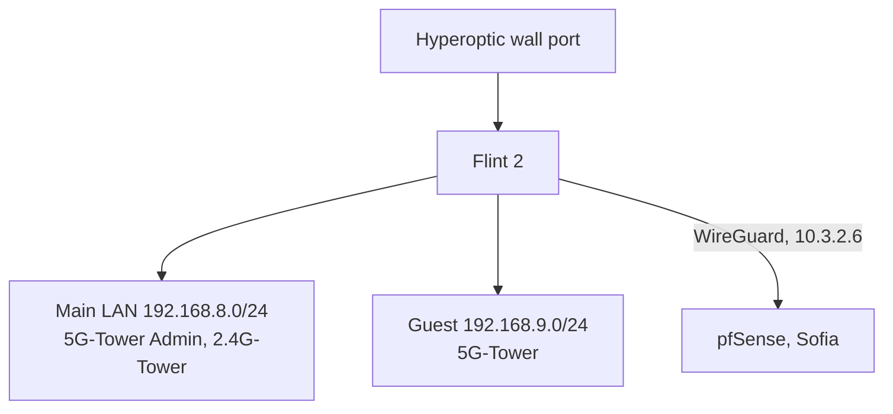

# London site

The London flat's network: one GL.iNet Flint 2 (GL-MT6000) router, a main LAN
and a guest network, and a WireGuard tunnel to pfSense in Sofia. The router is
configured through its own web UIs (GL admin UI and LuCI, under
SYSTEM → Advanced Settings), not from this repo. This page lists the intended
settings and why, so the live router can be compared against it.

Design and decisions: `docs/plans/2026-09-27-london-flint-main-router.md`.
Cutover day: `docs/runbooks/london-cutover.md`.

## Topology



Since 2026-10-02 the Flint takes the Hyperoptic line directly; the Hyperoptic
router is gone. The WAN gets 100.67.94.6/18 by DHCP, a carrier-grade NAT range
(RFC 6598), and leaves the internet as 137.220.71.46 (AS56478). That address is
most likely shared with other Hyperoptic customers, so it is not ours to
allowlist. IPv6 is native: Hyperoptic delegates 2a01:4b00:ab23:1200::/56 and the
LAN gets real addresses from it.

Firmware is GL 4.11.0 since 2026-10-02 (was 4.9.1).

## Access

| what | how |
|---|---|
| GL admin UI | `http://192.168.8.1` on the LAN, `http://10.3.2.6` from Sofia |
| LuCI | GL UI → SYSTEM → Advanced Settings → Go To LuCI |
| admin password | Vaultwarden item `london.viktorbarzin.me` (user `root`) |
| APIs | GL JSON-RPC `POST /rpc` (challenge, login, call); OpenWrt ubus at `http://10.3.2.6:8080/ubus` (session.login as root) |
| SSH | `ssh root@10.3.2.6`, read-only diagnostics only. With the tunnel down: `ssh -o HostKeyAlias=10.3.2.6 root@2a01:4b00:ab23:1200::1` from the devvm (IPv6), same host key |

Every change goes through the GL UI settings or LuCI, or the RPC calls those UIs
make, so the result is visible in one of the two UIs. The exception is the
monitoring packages, which `scripts/london-flint/provision.sh` installs over SSH
(see [After a firmware upgrade](#after-a-firmware-upgrade)).

Firmware 4.11 answers 403 on the admin page to any request whose Host header is
not `localhost` or one of the router's own addresses (DNS-rebinding protection,
hardcoded in `/usr/share/gl-ngx/oui-access.lua`). A browser on the LAN using
`192.168.8.1` is unaffected; a reverse proxy that forwards another hostname gets
403.

## Intended settings

| setting | value | UI | why |
|---|---|---|---|
| Country | GB on both radios | LuCI → Network → Wireless | Location. GL applies a per-rate power table only for DE; GB was chosen anyway (2026-09-27). Changing the country needs one reboot to reach the radio. |
| 2.4 GHz | channel 11, 20 MHz (HE20) | GL → Wireless | Channel 1 at 40 MHz logged 2.85M receive errors against 2.89M packets. 11 had the weakest neighbours in the 2026-09-27 scan once the Hyperoptic router (channel 7) is gone. |
| 5 GHz | channel 44, 80 MHz (HE80) | GL → Wireless | Pinned off DFS channels: auto selection with radar detection on could land on a DFS channel after any radio restart, which silences 5 GHz for 1–10 minutes. |
| 5 GHz security | WPA2-PSK on both 5 GHz SSIDs | GL → Wireless | The closed MediaTek driver's WPA3-SAE PMKID cache fails (fixed 2026-09-13). |
| Scheduled reboot | off | GL → System → Scheduled Tasks | Memory and conntrack were healthy after 6.7 days; the reboot wiped the kernel log used for diagnosis. |
| DNS cache | 10000 entries, "All servers" on | LuCI → Network → DHCP and DNS | The 150-entry default evicted 3,038 live entries in 6.8 days. Upstreams stay AdGuard public DNS (94.140.14.14, 94.140.15.15). |
| DNS query log | on: `logqueries '1'` (`--log-queries=extra`) | LuCI → Network → DHCP and DNS → Log queries; set by `provision.sh` | Every lookup (serial, client, name, answer) goes to Loki for the daily DNS digest (`docs/plans/2026-10-02-london-dns-block-monitoring.md`). About 575k lookups a day. Sent over the TCP syslog; nothing is written to flash. |
| DNS concurrent queries | `dnsforwardmax '1000'` (default 150) | set by `provision.sh` | `Maximum number of concurrent DNS queries reached (max: 150)` appeared four times on 2026-10-02 next to a 283 s DNS drop; "All servers" sends each miss to both upstreams, which doubles the in-flight count. |
| Wi-Fi driver debug | level 0 on `ra0` and `rax0`, hook `/etc/hotplug.d/net/60-mtk-debug-off` (kept across upgrades via `/etc/sysupgrade.conf`) | set by `provision.sh` | Firmware 4.11.0 runs the MediaTek driver at debug level 1, which logged `MlmeEnqueueForRecv` about 47 times a second: the ring held about 80 s and Loki received about 90k Flint lines an hour. The level resets when an interface comes up, so the hook sets it again. |
| Router's own 10.x traffic | IPv4 rule `router_to_sofia_via_tunnel`: from loopback, to 10.0.0.0/8, table 1001, priority 9950 | LuCI → Network → Routing → IPv4 Rules | GL installs the tunnel routes in table 1001, which only forwarded LAN traffic consults. Without the rule the router's own traffic to Sofia (syslog, the probe) left through the WAN. With the tunnel down, table 1001 holds only a blackhole, so the traffic is dropped rather than leaked. |
| System log | 8 MB ring in RAM (`log_size '8192'`), not written to flash | LuCI → System → System → Logging; set by `provision.sh` | The 64 KB ring held about 5 hours; once the DNS query log was on, the 512 KB ring held 3 to 14 minutes (99% of it lookups). 8 MB is about one to four hours and costs 8 MB of the router's 1 GB RAM. A flash copy (`/root/system.log`) was on from 2026-09-27 to 2026-09-28 and removed to keep eMMC writes down (Viktor). The ring is what the drop probe backfills tunnel outages from, so its size is how long an outage can be and still reach Loki whole. A crash loses the ring: there is no flash or pstore copy. |
| Remote syslog | `10.0.20.208`, TCP 514 | LuCI → System → System → Logging | Kernel Wi-Fi lines and firmware resets land in Loki as `{job="syslog", host="flint-london"}`. TCP, not UDP: over UDP only the first line after a quiet spell arrived (195 of about 3,000 lines on 2026-09-27/28); logread sends everything on one UDP flow and the rest of each burst was lost between the tunnel and the cluster. Over TCP a 5-minute window matched 20 of 20 lines. The receiver (`alloy-syslog`) keeps each line's program as the `app` label and its severity as `level` (since 2026-10-03). The forwarder (`logread -f -r`) sends over TCP, so through a short tunnel outage TCP holds the lines and retransmits them (a 46 s simulated outage on 2026-10-03 lost nothing). Lines are lost only when the connection dies, after about 15 minutes of retransmits (`tcp_retries2` 15): logread reconnects and does not replay what it missed. The drop probe backfills that gap (`source="backfill"`, see the drop probe row). |
| kmwan (multi-WAN watchdog) | unchanged: failover, pings 8.8.8.8 / 9.9.9.9 / 208.67.222.222 | GL → Network → Multi-WAN | Kept pending data; the probe records its state during each drop. Switch its tracking off if drops line up with it. |
| DPI / per-app stats | on | GL → Network | Viktor uses them. |
| Guest network | forwards to the tunnel | unchanged | Viktor's call (2026-09-27). Guest traffic reaches Sofia masqueraded as 10.3.2.6. |
| SSH and admin page on WAN | open, password login on | unchanged | Viktor's call (2026-09-27). After the cutover they are reachable from the internet over IPv6. |
| IPv6 | Native with the delegated /56 (set 2026-10-02) | GL → Network → IPv6 | Real addresses skip NAT and the ISP's IPv4 CGNAT. |

## Monitoring

| piece | where | what |
|---|---|---|
| node exporter | package `prometheus-node-exporter-lua` (+ `-wifi_stations`, `-netstat`, `-openwrt`), `listen_interface '*'` | Prometheus job `flint-london` scrapes `10.3.2.6:9100`. The WAN zone drops 9100; the tunnel zone accepts it. The `wifi` collector is left out because the MediaTek iwinfo backend lacks noise/quality/bitrate. `wifi_stations` packet counters read 0 on this driver; signal and rates are real. |
| tunnel ping | blackbox job `london-flint-icmp`, 30 s | `LondonTunnelDown` after 10 minutes |
| drop probe | package `london-drop-probe` 0.6.3, built by `scripts/london-flint/build-ipk.py`, installed by `scripts/london-flint/provision.sh`, a procd service shown in LuCI → System → Startup | HTTP checks to http://1.1.1.1 and https://8.8.8.8, and over IPv6 to Cloudflare and Google, every 10 s (every 2 s after a failure); a fresh name (`probe-<time>.viktorbarzin.me`) resolved through dnsmasq every 30 s. A drop is 30 s or more: `layer=internet`/`gateway` (IPv4), `ipv6` (IPv6 failing while IPv4 works, since 0.5.0), `dns` (lookups through dnsmasq failing while HTTP works). Snapshots routing/kmwan/DPI-queue state and pushes one event per drop to Loki (`{job="london-drops", source="flint"}`) after the path returns; the queue survives reboots in `/root/drop-probe.queue` (written only when a drop ends). Every 5 minutes it also pushes the IPv4/IPv6 neighbour tables and DHCP leases as `{job="london-neigh"}`, which the DNS digest uses to name devices. Since 0.6.0 each check also asks Loki's `/ready` over the tunnel. When it answers again after failing, the probe waits 20 s and looks in the ring for a forwarder reconnect (`Logread connected to`) since the outage began. If there was one, it pushes the ring's lines from the start of the outage to the reconnect with their original timestamps as `{job="syslog", host="flint-london", source="backfill"}`; if not, TCP delivered everything and nothing is pushed. Either way one summary line (`drop-probe backfill:`) records the outage, what was done, and whether the ring still reached back to the start of it. Tested 2026-10-03 with a simulated outage both ways (connection surviving, and killed by lowering `tcp_retries2` for the test). History: ping-based 0.1.x produced false drops; the cron-driven 0.1–0.3 missed every other minute; 0.4.x queried AdGuard directly for DNS, skipping dnsmasq. |
| Mac probe | launchd agent `me.viktorbarzin.london-probe` on mbp-london (Viktor's M4 MacBook), source in the `dot_files` repo under `mac/london-probe` | Reports drops of the Mac's own Wi-Fi and DNS (`source="mac"`). The Mac has no git access to Forgejo, so deploy by copying `mac/london-probe` over SSH and running its `install.sh` (runs the tests, then bootstraps the agent). Log: `~/Library/Logs/london-probe.log`. |
| alerts | Loki rules `LondonInternetDrop`, `LondonDnsFailure` (probe `layer=dns`, split out 2026-10-02), `LondonFirmwareReset`; Prometheus rule `LondonTunnelDown` | Event alerts go to the `slack-event` receiver: one post per drop, no RESOLVED. |
| DNS digest | CronJob `london-dns-digest` (monitoring namespace, `stacks/monitoring/modules/monitoring/london_dns_digest.py`), 08:00 Europe/London | Posts to #alerts only when there is something to report: DNS errors (SERVFAIL/REFUSED per device and name, dnsmasq's concurrent-query limit), names newly blocked by AdGuard (not blocked in the previous 30 days; empty until 7 days after the query log started on 2026-10-02), and names added to `GL_DPI_BLOCK`. Run by hand with `DRY_RUN=1 LOKI_URL=... python3 london_dns_digest.py`. |

The probe and the Mac push to `https://loki.viktorbarzin.lan/loki/api/v1/push`
pinned to Traefik's `10.0.20.203`. London traffic reaches Sofia masqueraded as
10.3.2.6, which the Loki ingress's `local-only` allowlist already admits.

### Useful queries

```
{job="london-drops"} | json                       # every drop, both vantage points
{job="syslog", host="flint-london"} |= "mt7986_dump_ser_stat"   # firmware resets
wifi_station_signal_dbm{instance="flint-london"}  # per-client signal
{job="syslog", host="flint-london", app!="dnsmasq"}               # everything except DNS lookups (since 2026-10-03)
{job="syslog", host="flint-london", app="kernel"}                 # kernel and Wi-Fi driver lines
{job="syslog", host="flint-london", level=~"error|critical|alert|emergency"}  # errors and worse
{job="syslog", host="flint-london", source="backfill"}            # lines recovered after a tunnel outage
```

Backfilled lines carry the router's own `facility.level program[pid]:` prefix
in the line, because they come from the ring rather than through the receiver,
so `app` and `level` filters do not match them; filter them by text instead.

DNS, on demand (dnsmasq `--log-queries=extra` lines: `<serial> <client>/<port> <verb> ...`):

```
{job="syslog", host="flint-london"} |~ " (reply|cached) [^ ]+ is (0\\.0\\.0\\.0|::)$"   # blocked answers
{job="syslog", host="flint-london"} |~ " reply error is (SERVFAIL|REFUSED)$"          # errors; the name is on the query[ line with the same serial
{job="syslog", host="flint-london"} |= " ipset add GL_DPI_BLOCK "                     # GL content protection
{job="syslog", host="flint-london"} |= "query[" |= " from 192.168.8.198"             # everything one device asked
{job="london-neigh"}                                                                 # address -> MAC -> hostname snapshots
```

To unblock one name that AdGuard blocks, on the Flint:

```sh
uci add_list dhcp.@dnsmasq[0].server='/<domain>/94.140.14.140'   # AdGuard's unfiltered resolver
uci commit dhcp && /etc/init.d/dnsmasq restart
```

Devices may keep the cached block for up to an hour (AdGuard answers blocks with a 3,600 s TTL).

Client disconnects, on demand (MediaTek driver lines, one per event):

```
{job="syslog", host="flint-london"} |= "Del Sta:"                       # a client left (station removed)
{job="syslog", host="flint-london"} |= "New Sta:"                       # a client joined
{job="syslog", host="flint-london"} |~ "ReasonCode|4Way-MSG1 timeout"   # AP-side deauths, failed handshakes
sum by (mac) (count_over_time({job="syslog", host="flint-london"} |= "Del Sta:" | regexp "Del Sta:(?P<mac>[0-9a-f:]+)" [24h]))  # leaves per client
```

Remote syslog has been complete only since 2026-09-28 10:43 BST (the switch to
TCP); earlier router lines in Loki are a sample.

## After a firmware upgrade

A GL firmware upgrade keeps UCI settings (everything in the Intended settings
table survived 4.9.1 → 4.11.0) but removes every package installed with opkg.
On 2026-10-02 that took out the node exporter and the drop probe. Reinstall
both from the devvm:

```sh
scripts/london-flint/provision.sh
```

It builds the probe package, installs whatever is missing, sets the exporter to
listen on every interface, and checks from Sofia that the exporter answers and
the probe runs. It is idempotent, so a second run changes nothing. After an
upgrade, also check that the tunnel came up (`ifstatus wgclient1` shows
`"up": true`): on 2026-10-02 a network restart left it `pending` with no
address until `ifup wgclient1`.

## Rebuilding the probe package

Edit `scripts/london-flint/drop-probe.sh`, bump `PROBE_VERSION` in
`provision.sh`, and run `provision.sh`. To build the package alone:

```sh
python3 scripts/london-flint/build-ipk.py <version> <out-dir>
```
