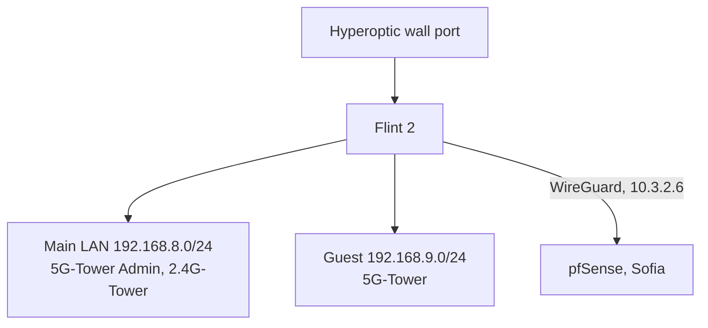

# London site

The London flat's network: one GL.iNet Flint 2 (GL-MT6000) router, a main LAN
and a guest network, and a WireGuard tunnel to pfSense in Sofia. The router is
configured through its own web UIs (GL admin UI and LuCI, under
SYSTEM → Advanced Settings), not from this repo. This page lists the intended
settings and why, so the live router can be compared against it.

Design and decisions: `docs/plans/2026-09-27-london-flint-main-router.md`.
Cutover day: `docs/runbooks/london-cutover.md`.

## Topology



Until early October 2026 the Flint sits behind the Hyperoptic router (WAN
192.168.20.0/24, double NAT). After the cutover it takes the Hyperoptic line
directly.

## Access

| what | how |
|---|---|
| GL admin UI | `http://192.168.8.1` on the LAN, `http://10.3.2.6` from Sofia |
| LuCI | GL UI → SYSTEM → Advanced Settings → Go To LuCI |
| admin password | Vaultwarden item `london.viktorbarzin.me` (user `root`) |
| APIs | GL JSON-RPC `POST /rpc` (challenge, login, call); OpenWrt ubus at `http://10.3.2.6:8080/ubus` (session.login as root) |
| SSH | `ssh root@10.3.2.6`, read-only diagnostics only |

Every change goes through the GL UI settings or LuCI, or the RPC calls those UIs
make, so the result is visible in one of the two UIs.

## Intended settings

| setting | value | UI | why |
|---|---|---|---|
| Country | GB on both radios | LuCI → Network → Wireless | Location. GL applies a per-rate power table only for DE; GB was chosen anyway (2026-09-27). Changing the country needs one reboot to reach the radio. |
| 2.4 GHz | channel 11, 20 MHz (HE20) | GL → Wireless | Channel 1 at 40 MHz logged 2.85M receive errors against 2.89M packets. 11 had the weakest neighbours in the 2026-09-27 scan once the Hyperoptic router (channel 7) is gone. |
| 5 GHz | channel 44, 80 MHz (HE80) | GL → Wireless | Pinned off DFS channels: auto selection with radar detection on could land on a DFS channel after any radio restart, which silences 5 GHz for 1–10 minutes. |
| 5 GHz security | WPA2-PSK on both 5 GHz SSIDs | GL → Wireless | The closed MediaTek driver's WPA3-SAE PMKID cache fails (fixed 2026-09-13). |
| Scheduled reboot | off | GL → System → Scheduled Tasks | Memory and conntrack were healthy after 6.7 days; the reboot wiped the kernel log used for diagnosis. |
| DNS cache | 10000 entries, "All servers" on | LuCI → Network → DHCP and DNS | The 150-entry default evicted 3,038 live entries in 6.8 days. Upstreams stay AdGuard public DNS (94.140.14.14, 94.140.15.15). |
| Router's own 10.x traffic | IPv4 rule `router_to_sofia_via_tunnel`: from loopback, to 10.0.0.0/8, table 1001, priority 9950 | LuCI → Network → Routing → IPv4 Rules | GL installs the tunnel routes in table 1001, which only forwarded LAN traffic consults. Without the rule the router's own traffic to Sofia (syslog, the probe) left through the WAN. With the tunnel down, table 1001 holds only a blackhole, so the traffic is dropped rather than leaked. |
| System log | 512 KB ring, also written to `/root/system.log` | LuCI → System → System → Logging | The 64 KB ring held about 5 hours. |
| Remote syslog | `10.0.20.208`, TCP 514 | LuCI → System → System → Logging | Kernel Wi-Fi lines and firmware resets land in Loki as `{job="syslog", host="flint-london"}`. TCP, not UDP: over UDP only the first line after a quiet spell arrived (195 of about 3,000 lines on 2026-09-27/28); logread sends everything on one UDP flow and the rest of each burst was lost between the tunnel and the cluster. Over TCP a 5-minute window matched 20 of 20 lines. |
| kmwan (multi-WAN watchdog) | unchanged: failover, pings 8.8.8.8 / 9.9.9.9 / 208.67.222.222 | GL → Network → Multi-WAN | Kept pending data; the probe records its state during each drop. Switch its tracking off if drops line up with it. |
| DPI / per-app stats | on | GL → Network | Viktor uses them. |
| Guest network | forwards to the tunnel | unchanged | Viktor's call (2026-09-27). Guest traffic reaches Sofia masqueraded as 10.3.2.6. |
| SSH and admin page on WAN | open, password login on | unchanged | Viktor's call (2026-09-27). After the cutover they are reachable from the internet over IPv6. |
| IPv6 | NAT6 behind the Hyperoptic router today; Native with the delegated prefix after cutover | GL → Network → IPv6 | Real addresses skip NAT and any ISP CGNAT. |

## Monitoring

| piece | where | what |
|---|---|---|
| node exporter | package `prometheus-node-exporter-lua` (+ `-wifi_stations`, `-netstat`, `-openwrt`), `listen_interface '*'` | Prometheus job `flint-london` scrapes `10.3.2.6:9100`. The WAN zone drops 9100; the tunnel zone accepts it. The `wifi` collector is left out because the MediaTek iwinfo backend lacks noise/quality/bitrate. `wifi_stations` packet counters read 0 on this driver; signal and rates are real. |
| tunnel ping | blackbox job `london-flint-icmp`, 30 s | `LondonTunnelDown` after 10 minutes |
| drop probe | package `london-drop-probe` (HTTP checks to http://1.1.1.1 and https://8.8.8.8 every 10 s, every 2 s after a failure; a drop is 30 s or more; since 0.4.0. Ping-based 0.1.x produced false drops; the cron-driven 0.1–0.3 missed every other minute) (built by `scripts/london-flint/build-ipk.py`, installed from LuCI → System → Software → Upload), a procd service shown in LuCI → System → Startup | Detects internet drops, snapshots routing/kmwan/DPI-queue state, and pushes one event per drop to Loki (`{job="london-drops", source="flint"}`) after the path returns. Queue survives reboots in `/root/drop-probe.queue`. |
| Mac probe | launchd agent `me.viktorbarzin.london-probe` on mbp-london (Viktor's M4 MacBook), source in the `dot_files` repo under `mac/london-probe` | Reports drops of the Mac's own Wi-Fi and DNS (`source="mac"`). The Mac has no git access to Forgejo, so deploy by copying `mac/london-probe` over SSH and running its `install.sh` (runs the tests, then bootstraps the agent). Log: `~/Library/Logs/london-probe.log`. |
| alerts | Loki rules `LondonInternetDrop`, `LondonFirmwareReset`; Prometheus rule `LondonTunnelDown` | Event alerts go to the `slack-event` receiver: one post per drop, no RESOLVED. |

The probe and the Mac push to `https://loki.viktorbarzin.lan/loki/api/v1/push`
pinned to Traefik's `10.0.20.203`. London traffic reaches Sofia masqueraded as
10.3.2.6, which the Loki ingress's `local-only` allowlist already admits.

### Useful queries

```
{job="london-drops"} | json                       # every drop, both vantage points
{job="syslog", host="flint-london"} |= "mt7986_dump_ser_stat"   # firmware resets
wifi_station_signal_dbm{instance="flint-london"}  # per-client signal
```

## Rebuilding the probe package

```sh
python3 scripts/london-flint/build-ipk.py <version> <out-dir>
```

Upload the `.ipk` in LuCI → System → Software → Upload Package. Bump the
version on every change so the upgrade is visible in the package list.
