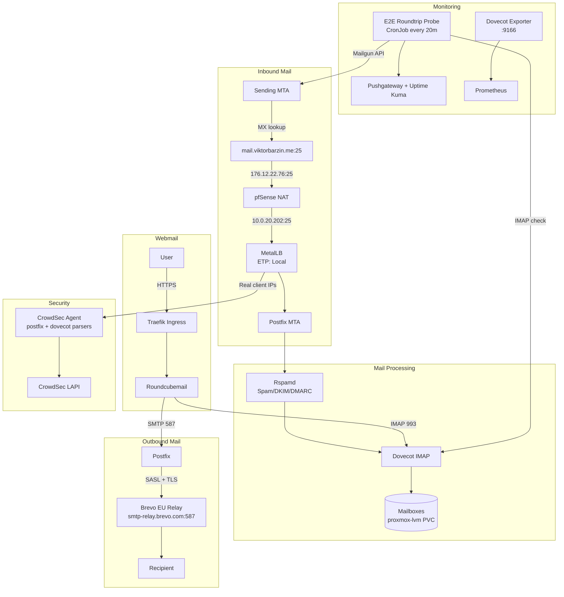

# Mail Server Architecture

Last updated: 2026-04-18 (SPF switched to Brevo; DMARC reporting address normalized)

## Overview

Self-hosted email for `viktorbarzin.me` using docker-mailserver 15.0.0 on Kubernetes. Inbound mail arrives directly via MX record to the home IP on port 25. Outbound mail relays through Brevo EU (`smtp-relay.brevo.com:587` — migrated from Mailgun on 2026-04-12; SPF record cut over on 2026-04-18). Roundcubemail provides webmail access. CrowdSec protects SMTP/IMAP from brute-force attacks using real client IPs via `externalTrafficPolicy: Local` on a dedicated MetalLB IP.

## Architecture Diagram



## Components

| Component | Version | Location | Purpose |
|-----------|---------|----------|---------|
| docker-mailserver | 15.0.0 | `mailserver` namespace | Postfix MTA + Dovecot IMAP + Rspamd |
| Roundcubemail | 1.6.13-apache | `mailserver` namespace | Webmail UI (MySQL-backed) |
| Dovecot Exporter | latest | Sidecar in mailserver pod | Prometheus metrics (port 9166) |
| Rspamd | Built into docker-mailserver | — | Spam filtering, DKIM signing, DMARC verification |
| Brevo EU (ex-Sendinblue) | SaaS | — | Outbound SMTP relay (300/day free) |

## Mail Flow

### Inbound
```
Internet → MX: mail.viktorbarzin.me (priority 1)
         → A record: 176.12.22.76 (non-proxied Cloudflare DNS-only)
         → pfSense NAT: port 25 → 10.0.20.202:25
         → MetalLB (dedicated IP, ETP: Local — preserves real client IPs)
         → Postfix → Rspamd (spam + DKIM + DMARC check) → Dovecot → mailbox
```

No backup MX. If the server is down, sender MTAs queue and retry for 4-5 days per SMTP standards (RFC 5321).

### Outbound
```
Postfix → relayhost [smtp-relay.brevo.com]:587 (SASL auth + TLS required)
        → Brevo handles IP reputation, deliverability, bounce processing
        → 300 emails/day free tier (migrated from Mailgun 100/day on 2026-04-12)
```

### Webmail
```
https://mail.viktorbarzin.me → Traefik → Roundcubemail
  IMAP: ssl://mailserver:993 (internal K8s service)
  SMTP: tls://mailserver:587 (internal K8s service)
  DB: MySQL (mysql.dbaas.svc.cluster.local)
```

## DNS Records

All managed in Terraform at `stacks/cloudflared/modules/cloudflared/cloudflare.tf`.

| Type | Name | Value | Purpose |
|------|------|-------|---------|
| MX | `viktorbarzin.me` | `mail.viktorbarzin.me` (pri 1) | Inbound mail routing |
| A | `mail.viktorbarzin.me` | `176.12.22.76` (non-proxied) | Mail server IP |
| AAAA | `mail.viktorbarzin.me` | `2001:470:6e:43d::2` | IPv6 (HE tunnel) |
| TXT (SPF) | `viktorbarzin.me` | `v=spf1 include:spf.brevo.com ~all` | Authorize Brevo for outbound (soft-fail during cutover; was `include:mailgun.org -all` until 2026-04-18 Brevo migration) |
| TXT (DKIM) | `s1._domainkey` | RSA 1024-bit key | Mailgun DKIM (roundtrip probe only — inbound testing still uses Mailgun API) |
| TXT (DKIM) | `mail._domainkey` | RSA 2048-bit key | Rspamd self-hosted DKIM signing |
| CNAME (DKIM) | `brevo1._domainkey` | b1.viktorbarzin-me.dkim.brevo.com | Brevo outbound DKIM (delegated) |
| CNAME (DKIM) | `brevo2._domainkey` | b2.viktorbarzin-me.dkim.brevo.com | Brevo outbound DKIM (delegated) |
| TXT | `viktorbarzin.me` | `brevo-code:a6ef1dd9...` | Brevo domain verification |
| TXT (DMARC) | `_dmarc` | `p=quarantine; pct=100; rua=mailto:dmarc@viktorbarzin.me` | DMARC enforcement; aggregate reports land in-domain at `dmarc@viktorbarzin.me` (tracked under code-569; current live record still points at `e21c0ff8@dmarc.mailgun.org` pending cutover) |
| TXT (MTA-STS) | `_mta-sts` | `v=STSv1; id=20260412` | TLS enforcement for inbound |
| TXT (TLSRPT) | `_smtp._tls` | `v=TLSRPTv1; rua=mailto:postmaster@...` | TLS failure reporting |

### Known Limitation: PTR Mismatch

Reverse DNS for `176.12.22.76` returns `176-12-22-76.pon.spectrumnet.bg.` (ISP-assigned) instead of `mail.viktorbarzin.me`. This is ISP-controlled and cannot be changed on a residential connection. Most modern providers (Gmail, Outlook) rely on SPF/DKIM/DMARC rather than PTR, so impact is minimal.

## Security

### CrowdSec Integration
- **Collections**: `crowdsecurity/postfix` + `crowdsecurity/dovecot` (installed)
- **Log acquisition**: CrowdSec agents parse mailserver pod logs for brute-force patterns
- **Real client IPs**: `externalTrafficPolicy: Local` on dedicated MetalLB IP `10.0.20.202` preserves original client IPs (not SNATed to node IPs)
- **Decisions**: CrowdSec bans/challenges attackers via firewall bouncer rules

### Rspamd
- Spam filtering with phishing detection and Oletools
- DKIM signing (selector `mail`, 2048-bit RSA)
- DMARC verification on inbound mail
- Auto-learns from Junk folder movements (`RSPAMD_LEARN=1`)
- SRS (Sender Rewriting Scheme) enabled for forwarded mail

### Postfix Rate Limiting
```
smtpd_client_connection_rate_limit = 10  # per minute per client
smtpd_client_message_rate_limit = 30     # per minute per client
anvil_rate_time_unit = 60s
```

### TLS
- Wildcard Let's Encrypt cert (`*.viktorbarzin.me`) for SMTP STARTTLS and IMAPS
- Renewed via Woodpecker CI cron pipeline (DNS-01 challenge via Cloudflare)
- MTA-STS enforces TLS for inbound delivery

## Monitoring

### E2E Roundtrip Probe
CronJob `email-roundtrip-monitor` (every 10 min):
1. Sends test email via Mailgun HTTP API to `smoke-test@viktorbarzin.me`
2. Email hits MX → Postfix → catch-all delivers to `spam@` mailbox
3. Verifies delivery via IMAP (searches by UUID marker)
4. Deletes test email, pushes metrics to Pushgateway + Uptime Kuma

### Prometheus Alerts
| Alert | Threshold | Severity |
|-------|-----------|----------|
| MailServerDown | No replicas for 5m | warning |
| EmailRoundtripFailing | Probe failing for 30m | warning |
| EmailRoundtripStale | No success in >40m | warning |
| EmailRoundtripNeverRun | Metric absent for 40m | warning |

### Uptime Kuma Monitors
- TCP SMTP on `176.12.22.76:25` (external, 60s interval)
- TCP IMAP on `10.0.20.202:993` (internal)
- E2E Push monitor (receives push from roundtrip probe)

### Dovecot Exporter
- Sidecar container in mailserver pod, port 9166
- Scraped by Prometheus for IMAP connection metrics

## Terraform

| Stack | Path | Resources |
|-------|------|-----------|
| Mailserver | `stacks/mailserver/` | Namespace, deployment, service, CronJob, PVCs |
| DNS | `stacks/cloudflared/modules/cloudflared/cloudflare.tf` | MX, SPF, DKIM, DMARC, MTA-STS, TLSRPT records |
| Monitoring | `stacks/monitoring/` | Prometheus alert rules |
| CrowdSec | `stacks/crowdsec/` | Collections, log acquisition (already configured) |

### Secrets (Vault)
| Path | Key | Purpose |
|------|-----|---------|
| `secret/platform` | `mailserver_accounts` | User credentials (JSON) |
| `secret/platform` | `mailserver_aliases` | Postfix virtual aliases |
| `secret/platform` | `mailserver_opendkim_key` | DKIM private key |
| `secret/platform` | `mailserver_sasl_passwd` | Brevo relay credentials (`[smtp-relay.brevo.com]:587 <login>:<key>`) |
| `secret/viktor` | `mailgun_api_key` | Mailgun API for E2E roundtrip probe (retained for inbound delivery testing only; not used for user mail) |
| `secret/viktor` | `brevo_api_key` | Brevo API key (stored for reference) |

## Storage

| PVC | Size | Storage Class | Purpose |
|-----|------|---------------|---------|
| `mailserver-data-proxmox` | 2Gi (auto-resize 5Gi) | proxmox-lvm | Mail data, state, logs |
| `roundcubemail-html-proxmox` | 1Gi | proxmox-lvm | Roundcube web files |
| `roundcubemail-enigma-proxmox` | 1Gi | proxmox-lvm | Roundcube encryption |

## Decisions & Rationale

### No Backup MX
- **Alternatives considered**: ForwardEmail (free relay), Cloudflare Email Routing, Dynu Store/Forward
- **Decision**: Direct MX only. ForwardEmail relay was evaluated (2026-04-12) and abandoned — its anti-spoofing enforcement rejects legitimate forwarded mail regardless of SPF configuration. Cloudflare Email Routing can't store-and-forward (pass-through proxy only). Dynu ($9.99/yr) is a viable future option.
- **Tradeoff**: If server is down, mail delivery relies on sender MTA retry queues (4-5 days standard). No immediate forwarding to a backup address.

### Brevo for Outbound (migrated from Mailgun 2026-04-12)
- **Decision**: All outbound relays through Brevo EU (ex-Sendinblue). 300 emails/day free tier (3x Mailgun's 100/day).
- **Why migrated**: Mailgun's 100/day limit was too tight — the E2E probe uses ~72/day, leaving only 28 for real mail.
- **DKIM**: Brevo uses delegated DKIM via CNAME (`brevo1._domainkey`, `brevo2._domainkey`). Mailgun's `s1._domainkey` retained for the roundtrip probe (still uses Mailgun API for inbound testing).
- **Tradeoff**: Dependency on Brevo SaaS for outbound.

### Rspamd over SpamAssassin/OpenDKIM
- **Decision**: Rspamd replaces both SpamAssassin and OpenDKIM in a single component
- **Tradeoff**: Higher memory usage (~150-200MB) but simpler stack

### Dedicated MetalLB IP for CrowdSec
- **Decision**: Mailserver gets `10.0.20.202` (separate from shared `10.0.20.200`) with `externalTrafficPolicy: Local`
- **Why**: Shared IP with ETP: Cluster SNATs away real client IPs, making CrowdSec detections and Postfix rate limiting useless
- **Tradeoff**: Uses one extra IP from the MetalLB pool. Requires separate pfSense NAT rule.

## Troubleshooting

### Inbound mail not arriving
1. Check MX: `dig MX viktorbarzin.me +short` → should show `mail.viktorbarzin.me`
2. Check port 25: `nc -zw5 mail.viktorbarzin.me 25`
3. Check pfSense NAT rule: port 25 → `10.0.20.202:25`
4. Check Postfix logs: `kubectl logs -n mailserver deploy/mailserver -c docker-mailserver | grep -E 'from=|reject'`
5. Check if CrowdSec is blocking the sender: `kubectl exec -n crowdsec deploy/crowdsec-lapi -- cscli decisions list`

### Outbound mail failing
1. Check Brevo relay: `kubectl logs -n mailserver deploy/mailserver -c docker-mailserver | grep relay` — should show `relay=smtp-relay.brevo.com`
2. Check SASL credentials: `vault kv get -field=mailserver_sasl_passwd secret/platform` — should show `[smtp-relay.brevo.com]:587`
3. Check Brevo dashboard for delivery status
4. SASL auth failure → verify SMTP key (xsmtpsib-...) and login (a7e778001@smtp-brevo.com)

### E2E roundtrip probe failing
1. Check CronJob: `kubectl get cronjob -n mailserver email-roundtrip-monitor`
2. Check job logs: `kubectl logs -n mailserver -l job-name --tail=20`
3. Check Mailgun rate limit (HTTP 429 errors mean too many API calls)
4. Check IMAP login: verify `spam@viktorbarzin.me` password in Vault (`secret/platform` → `mailserver_accounts`)

### Spam/brute-force attacks
1. Check CrowdSec decisions: `kubectl exec -n crowdsec deploy/crowdsec-lapi -- cscli decisions list`
2. Check Postfix logs for auth failures: `kubectl logs -n mailserver deploy/mailserver -c docker-mailserver | grep 'authentication failed'`
3. Verify real client IPs in logs (not 10.0.20.x node IPs)

## Related

- [Monitoring Architecture](monitoring.md) — alert definitions, Uptime Kuma
- [Networking Architecture](networking.md) — MetalLB, pfSense NAT, Cloudflare DNS
- [Security Architecture](security.md) — CrowdSec deployment
- [Secrets Management](secrets.md) — Vault paths for mail credentials
- [Mailserver Hardening Plan](../plans/2026-02-23-mailserver-hardening-plan.md) — historical
