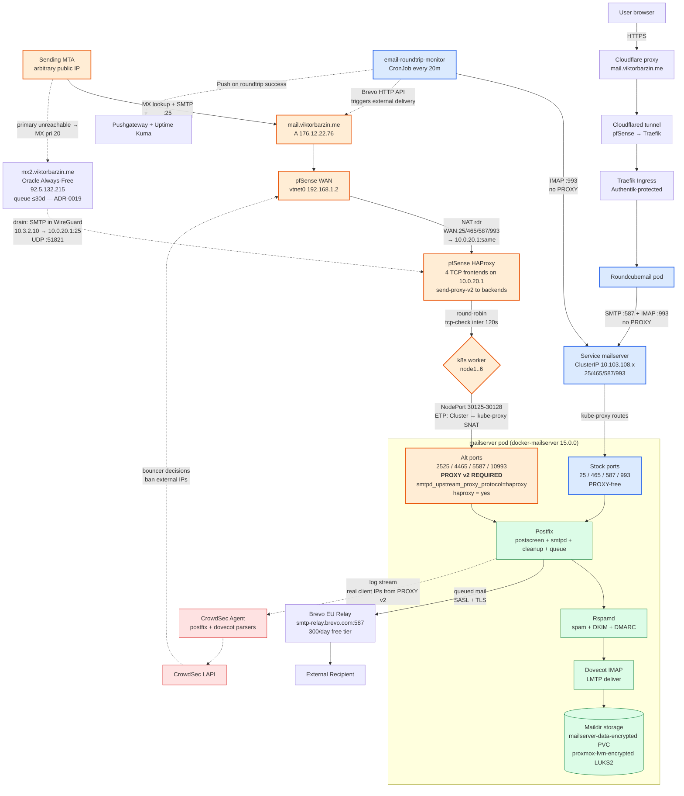
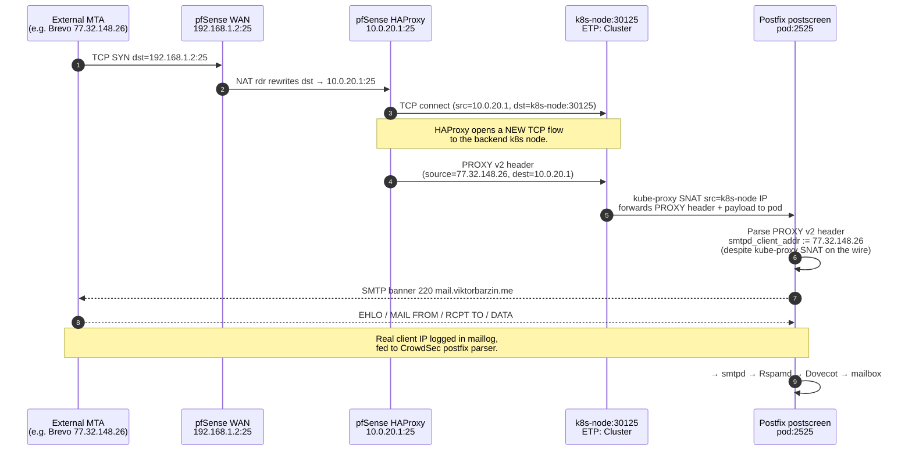

# Mail Server Architecture

Last updated: 2026-04-19 (code-yiu Phase 6: MetalLB LB retired; traffic now enters via pfSense HAProxy with PROXY v2)

## Overview

Self-hosted email for `viktorbarzin.me` using docker-mailserver 15.0.0 on Kubernetes. Inbound mail arrives directly via MX record to the home IP on port 25. Outbound mail relays through Brevo EU (`smtp-relay.brevo.com:587` — migrated from Mailgun on 2026-04-12; SPF record cut over on 2026-04-18). Roundcubemail provides webmail access. CrowdSec protects SMTP/IMAP from brute-force attacks using real client IPs: pfSense HAProxy injects the PROXY v2 header on each backend connection so the mailserver pod sees the true source IP despite kube-proxy SNAT. See [`runbooks/mailserver-pfsense-haproxy.md`](../runbooks/mailserver-pfsense-haproxy.md) for ops details.

## Architecture Diagram

Two independent paths into the mailserver pod:

- **External** (MX traffic, webmail clients over WAN): Internet → pfSense → HAProxy → NodePort → **alt container ports** (2525/4465/5587/10993) that **require** PROXY v2 framing.
- **Intra-cluster** (Roundcube, E2E probe): same pod, **stock container ports** (25/465/587/993), **no** PROXY framing.

One Deployment, one pod, two sets of Postfix `master.cf` services + Dovecot `inet_listener` blocks, two Kubernetes Services (`mailserver` ClusterIP + `mailserver-proxy` NodePort).



### PROXY v2 sequence (external SMTP roundtrip)

Illustrates the wire-level sequence of a Brevo probe email arriving at our MX. Same sequence applies to any external sender.




## Components

| Component | Version | Location | Purpose |
|-----------|---------|----------|---------|
| docker-mailserver | 15.0.0 | `mailserver` namespace | Postfix MTA + Dovecot IMAP + Rspamd (single container) |
| Roundcubemail | 1.6.13-apache | `mailserver` namespace | Webmail UI (MySQL-backed) |
| Rspamd | Built into docker-mailserver | — | Spam filtering, DKIM signing, DMARC verification |
| pfSense HAProxy | 2.9-dev6 (`pfSense-pkg-haproxy-devel`) | pfSense VM | TCP reverse proxy injecting PROXY v2 for external mail |
| Brevo EU (ex-Sendinblue) | SaaS | — | Outbound SMTP relay (300/day free) |

Dovecot exporter was retired in code-1ik (2026-04-19) — `viktorbarzin/dovecot_exporter` speaks the pre-2.3 `old_stats` FIFO protocol which docker-mailserver 15.0.0's Dovecot 2.3.19 no longer emits.

## Port mapping

The mailserver pod exposes **8 TCP listeners**: 4 stock + 4 alt. Two Kubernetes Services front them depending on whether the client can inject PROXY v2.

| Mail protocol | Service port | K8s Service | Container port | NodePort | PROXY v2? | Who uses this path |
|---|---|---|---|---|---|---|
| SMTP (plain + STARTTLS) | 25  | `mailserver` ClusterIP | 25    | —     | ❌ stock | Intra-cluster only (not used — internal clients send via 587) |
| SMTPS (implicit TLS) | 465 | `mailserver` ClusterIP | 465   | —     | ❌ stock | Intra-cluster (Roundcube rarely uses this) |
| Submission (STARTTLS) | 587 | `mailserver` ClusterIP | 587   | —     | ❌ stock | **Roundcube pod** → mailserver.svc:587 |
| IMAPS | 993 | `mailserver` ClusterIP | 993   | —     | ❌ stock | **Roundcube pod** + E2E probe → mailserver.svc:993 |
| SMTP | 25  | `mailserver-proxy` NodePort | 2525  | 30125 | ✅ required | External MX traffic via pfSense HAProxy |
| SMTPS | 465 | `mailserver-proxy` NodePort | 4465  | 30126 | ✅ required | External SMTPS submission |
| Submission | 587 | `mailserver-proxy` NodePort | 5587  | 30127 | ✅ required | External STARTTLS submission (mail clients over WAN) |
| IMAPS | 993 | `mailserver-proxy` NodePort | 10993 | 30128 | ✅ required | External IMAPS (mail clients over WAN) |

The alt listeners are set up by:
- **Postfix**: `user-patches.sh` (shipped via ConfigMap `mailserver-user-patches`) appends 3 entries to `master.cf` with `-o postscreen_upstream_proxy_protocol=haproxy` (for 2525) or `-o smtpd_upstream_proxy_protocol=haproxy` (for 4465/5587).
- **Dovecot**: `dovecot.cf` ConfigMap adds a second `inet_listener` inside `service imap-login` with `haproxy = yes`, plus `haproxy_trusted_networks = 10.0.20.0/24` to allow PROXY headers from the k8s node subnet (post kube-proxy SNAT the source IP is always a node IP).

## Mail Flow

### Inbound
```
Internet → MX: mail.viktorbarzin.me (priority 1)
         → A record: 176.12.22.76 (non-proxied Cloudflare DNS-only)
         → pfSense NAT rdr: WAN:{25,465,587,993} → 10.0.20.1:{same}
         → pfSense HAProxy (TCP mode, send-proxy-v2 on backend)
         → k8s-node:{30125..30128} NodePort (mailserver-proxy, ETP: Cluster)
         → kube-proxy → pod alt listener (2525/4465/5587/10993)
         → Postfix postscreen / smtpd / Dovecot parses PROXY v2 header
         → Rspamd (spam + DKIM + DMARC) → Dovecot → mailbox
```

**Backup MX (since 2026-07-08, ADR-0019):** `mx2.viktorbarzin.me` (MX pri 20) —
a Postfix store-and-forward relay on an Oracle Always-Free VM (reserved IP
`92.5.132.215`, Frankfurt AD-3). When the primary is unreachable, senders fall
to mx2, which accepts everything for the domain (catch-all semantics, no
reputation 5xx) and queues up to **30 days**, then drains to the primary over a
WireGuard tunnel (`10.3.2.10 → 10.0.20.1:25`, i.e. straight into the HAProxy
frontend above — UDP-encapsulated, so Oracle's egress-25 block doesn't apply
and no extra WAN port exists). The primary permits the PTR-less tunnel IP via
`check_client_access cidr:/tmp/docker-mailserver/backup-mx-permit.cidr`
prepended to `smtpd_sender_restrictions`. Sender MTAs' own 1–5 day retry
(RFC 5321) remains the fallback beneath that. Full as-built + recreate:
[`runbooks/backup-mx.md`](../runbooks/backup-mx.md).

### Outbound
```
Postfix → relayhost [smtp-relay.brevo.com]:587 (SASL auth + TLS required)
        → Brevo handles IP reputation, deliverability, bounce processing
        → 300 emails/day free tier (migrated from Mailgun 100/day on 2026-04-12)
```

### Webmail
```
https://mail.viktorbarzin.me → Traefik → Roundcubemail
  IMAP: ssl://mailserver:993 (internal K8s service)
  SMTP: tls://mailserver:587 (internal K8s service)
  DB: MySQL (mysql.dbaas.svc.cluster.local)
```

### Paperless ingest mailbox (docs@)

`docs@viktorbarzin.me` is a dedicated real mailbox (explicit self-alias in
`extra/aliases.txt` so the `@domain → spam@` catch-all doesn't shadow it) that
paperless-ngx polls over IMAP; family members forward document emails to it
and the sender maps 1:1 to a paperless account. A per-user Dovecot sieve
(`docs-at-viktorbarzin.me.dovecot.sieve` in the `mailserver.config` ConfigMap,
mounted as `/tmp/docker-mailserver/docs@viktorbarzin.me.dovecot.sieve`)
discards mail from non-allowlisted senders at delivery. Full flow, sender map,
and add-a-sender procedure: [`runbooks/paperless-mail-ingest.md`](../runbooks/paperless-mail-ingest.md).

## DNS Records

All managed in Terraform at `stacks/cloudflared/modules/cloudflared/cloudflare.tf`.

| Type | Name | Value | Purpose |
|------|------|-------|---------|
| MX | `viktorbarzin.me` | `mail.viktorbarzin.me` (pri 1) | Inbound mail routing |
| MX | `viktorbarzin.me` | `mx2.viktorbarzin.me` (pri 20) | Backup MX (ADR-0019, since 2026-07-08) — senders fall to it when the primary is unreachable |
| A | `mx2.viktorbarzin.me` | `92.5.132.215` (non-proxied) | Backup MX — OCI reserved public IP (stable across VM stop/start) |
| A | `mail.viktorbarzin.me` | `176.12.22.76` (non-proxied) | Mail server IP |
| AAAA | `mail.viktorbarzin.me` | `2001:470:6e:43d::2` | IPv6 (HE tunnel) |
| TXT (SPF) | `viktorbarzin.me` | `v=spf1 include:spf.brevo.com ~all` | Authorize Brevo for outbound (soft-fail during cutover; was `include:mailgun.org -all` until 2026-04-18 Brevo migration) |
| TXT (DKIM) | `s1._domainkey` | RSA 1024-bit key | Mailgun DKIM (roundtrip probe only — inbound testing still uses Mailgun API) |
| TXT (DKIM) | `mail._domainkey` | RSA 2048-bit key | Rspamd self-hosted DKIM signing |
| CNAME (DKIM) | `brevo1._domainkey` | b1.viktorbarzin-me.dkim.brevo.com | Brevo outbound DKIM (delegated) |
| CNAME (DKIM) | `brevo2._domainkey` | b2.viktorbarzin-me.dkim.brevo.com | Brevo outbound DKIM (delegated) |
| TXT | `viktorbarzin.me` | `brevo-code:a6ef1dd9...` | Brevo domain verification |
| TXT (DMARC) | `_dmarc` | `p=quarantine; pct=100; rua=mailto:dmarc@viktorbarzin.me` | DMARC enforcement; aggregate reports land in-domain at `dmarc@viktorbarzin.me` (tracked under code-569; current live record still points at `e21c0ff8@dmarc.mailgun.org` pending cutover) |
| TXT (MTA-STS) | `_mta-sts` | `v=STSv1; id=20260412` | TLS enforcement for inbound |
| TXT (TLSRPT) | `_smtp._tls` | `v=TLSRPTv1; rua=mailto:postmaster@...` | TLS failure reporting |

### Known Limitation: PTR Mismatch

Reverse DNS for `176.12.22.76` returns `176-12-22-76.pon.spectrumnet.bg.` (ISP-assigned) instead of `mail.viktorbarzin.me`. This is ISP-controlled and cannot be changed on a residential connection. Most modern providers (Gmail, Outlook) rely on SPF/DKIM/DMARC rather than PTR, so impact is minimal.

## Security

### CrowdSec Integration
- **Collections**: `crowdsecurity/postfix` + `crowdsecurity/dovecot` (installed)
- **Log acquisition**: CrowdSec agents parse mailserver pod logs for brute-force patterns
- **Real client IPs**: pfSense HAProxy injects PROXY v2 header on each backend connection; Postfix (`postscreen_upstream_proxy_protocol=haproxy` / `smtpd_upstream_proxy_protocol=haproxy` on alt ports) + Dovecot (`haproxy = yes` on alt IMAPS listener) parse it to recover the true source IP despite kube-proxy SNAT. Replaces the pre-2026-04-19 MetalLB `10.0.20.202` ETP:Local scheme (see code-yiu)
- **Decisions**: CrowdSec bans/challenges attackers via firewall bouncer rules

### Fail2ban Disabled (CrowdSec is the Policy)

docker-mailserver ships Fail2ban, but it is explicitly disabled here: `ENABLE_FAIL2BAN = "0"` at [`stacks/mailserver/modules/mailserver/main.tf:68`](../../stacks/mailserver/modules/mailserver/main.tf). CrowdSec is the cluster-wide bouncer for SSH, HTTP, and SMTP/IMAP brute-force defence — it already parses the `postfix` and `dovecot` log streams via the collections listed above and applies decisions at the LB/firewall layer. Enabling Fail2ban in-pod would create a duplicate response path (two systems racing to ban the same IP from different enforcement points), add iptables churn inside the container, and fragment the audit trail across two decision stores. Decision (2026-04-18): keep it disabled; CrowdSec owns this policy.

### Rspamd
- Spam filtering with phishing detection and Oletools
- DKIM signing (selector `mail`, 2048-bit RSA)
- DMARC verification on inbound mail
- Auto-learns from Junk folder movements (`RSPAMD_LEARN=1`)
- SRS **disabled** (2026-07-08, permanent): postsrsd 1.10 deterministically
  busy-loops on restart, 451-ing all mail; see Troubleshooting. Externally-
  forwarding aliases forward with the original envelope sender.

### Postfix Rate Limiting
```
smtpd_client_connection_rate_limit = 10  # per minute per client
smtpd_client_message_rate_limit = 30     # per minute per client
anvil_rate_time_unit = 60s
```

### TLS
- Wildcard Let's Encrypt cert (`*.viktorbarzin.me`) for SMTP STARTTLS and IMAPS
- Renewed via Woodpecker CI cron pipeline (DNS-01 challenge via Cloudflare)
- MTA-STS enforces TLS for inbound delivery

## Monitoring

### E2E Roundtrip Probe
CronJob `email-roundtrip-monitor` (every 20 min, `*/20 * * * *`):
1. Sends test email via **Brevo HTTP API** to `smoke-test@viktorbarzin.me` (Brevo delivers it to our MX over the public internet, exercising the full external-ingress path).
2. Email hits WAN → pfSense HAProxy → k8s-node:30125 → pod :2525 postscreen (PROXY v2) → Postfix → catch-all delivers to `spam@` mailbox.
3. Verifies delivery via IMAP — connects to `mailserver.mailserver.svc.cluster.local:993` (intra-cluster path, no PROXY), searches by UUID marker.
4. Deletes test email, pushes metrics to Pushgateway + Uptime Kuma.

Push secrets (`BREVO_API_KEY`, `EMAIL_MONITOR_IMAP_PASSWORD`) come from ExternalSecret `mailserver-probe-secrets` (synced from Vault `secret/viktor` + `secret/platform.mailserver_accounts`) — see code-39v.

### Prometheus Alerts
| Alert | Threshold | Severity |
|-------|-----------|----------|
| MailServerDown | No replicas for 5m | warning |
| EmailRoundtripFailing | Probe failing for 30m | warning |
| EmailRoundtripStale | No success in >80m (60m threshold + for:20m) | warning |
| EmailRoundtripNeverRun | Metric absent for 40m | warning |
| BackupMxDown | mx2:25 blackbox TCP probe down 15m | warning |
| BackupMxQueueStuck | mx2 deferred queue >0 for 2h WHILE primary up (drain broken; outage backlog deliberately doesn't fire) | warning |

Backup-MX scrape jobs (2026-07-08): `backup-mx-smtp` (blackbox `tcp_connect` →
`92.5.132.215:25`) and `backup-mx-node` (node_exporter + `postfix_queue_size`
textfile on `:9100`, reachable only from the homelab WAN /32 per the OCI
security list). Note: since mx2 exists, a *transient* primary blip can route
the roundtrip probe's mail via mx2 — it then arrives minutes late through the
drain, so `EmailRoundtripFailing` can mean "delayed via backup MX", not lost.

### Uptime Kuma Monitors
- TCP SMTP on `176.12.22.76:25` — full external path (DNS → WAN → pfSense HAProxy → mailserver)
- TCP `mailserver.svc:{587,993}` — intra-cluster ClusterIP path
- TCP `10.0.20.1:{25,993}` — pfSense HAProxy health (post code-yiu Phase 6)
- E2E Push monitor (receives push from `email-roundtrip-monitor` probe)

### Dovecot exporter — retired
`viktorbarzin/dovecot_exporter` was removed in code-1ik (2026-04-19). It spoke the pre-2.3 `old_stats` FIFO protocol; Dovecot 2.3.19 (docker-mailserver 15.0.0) no longer emits that, so the scrape only ever returned `dovecot_up{scope="user"} 0`. If Dovecot metrics become valuable, reach for a 2.3+ compatible exporter (e.g. `jtackaberry/dovecot_exporter`) and re-add the scrape + alerts. The previously-created `mailserver-metrics` ClusterIP Service was also removed.

## Terraform

| Stack | Path | Resources |
|-------|------|-----------|
| Mailserver | `stacks/mailserver/` | Namespace, deployment, service, CronJob, PVCs |
| DNS | `stacks/cloudflared/modules/cloudflared/cloudflare.tf` | MX, SPF, DKIM, DMARC, MTA-STS, TLSRPT records |
| Monitoring | `stacks/monitoring/` | Prometheus alert rules |
| CrowdSec | `stacks/crowdsec/` | Collections, log acquisition (already configured) |

### Secrets (Vault)
| Path | Key | Purpose |
|------|-----|---------|
| `secret/platform` | `mailserver_accounts` | User credentials (JSON) |
| `secret/platform` | `mailserver_aliases` | Postfix virtual aliases |
| `secret/platform` | `mailserver_opendkim_key` | DKIM private key |
| `secret/platform` | `mailserver_sasl_passwd` | Brevo relay credentials (`[smtp-relay.brevo.com]:587 <login>:<key>`) |
| `secret/viktor` | `brevo_api_key` | Brevo API key — used by BOTH outbound SMTP SASL (postfix) AND the E2E roundtrip probe (sends external test mail via Brevo HTTP) |
| `secret/viktor` | `mailgun_api_key` | Historical; no longer used by the probe post code-n5l/Phase-5 work. Kept for reference. |

## Storage

| PVC | Size | Storage Class | Purpose |
|-----|------|---------------|---------|
| `mailserver-data-encrypted` | 2Gi (auto-resize 5Gi) | `proxmox-lvm-encrypted` (LUKS2) | Maildir + Postfix queue + state + logs |
| `roundcubemail-html-encrypted` | 1Gi | `proxmox-lvm-encrypted` | Roundcube PHP code + user session data |
| `roundcubemail-enigma-encrypted` | 1Gi | `proxmox-lvm-encrypted` | Roundcube Enigma (PGP) user keys |
| `mailserver-backup-host` (RWX) | 10Gi | `nfs-truenas` (historical SC name, Proxmox host NFS) | `mailserver-backup` CronJob destination (`/srv/nfs/mailserver-backup/<YYYY-WW>/`) |
| `roundcube-backup-host` (RWX) | 10Gi | `nfs-truenas` (historical SC name, Proxmox host NFS) | `roundcube-backup` CronJob destination |

**Backup**: daily `mailserver-backup` + `roundcube-backup` CronJobs rsync data PVCs to NFS. NFS directory is picked up by the PVE host's inotify-driven `/usr/local/bin/offsite-sync-backup` which pushes to Synology (weekly). See [Storage & Backup Architecture](storage.md) for the 3-2-1 flow.

## Decisions & Rationale

### Backup MX (SUPERSEDED "No Backup MX" 2026-07-08 — ADR-0019)
- **Now HAS a backup MX**: `mx2.viktorbarzin.me` (MX pri 20), a Postfix
  store-and-forward relay on an Oracle Always-Free VM, queuing ≤30 days and
  draining to the primary over a WireGuard tunnel (`10.3.2.10 → 10.0.20.1:25`).
  As-built + recreate procedure: [`runbooks/backup-mx.md`](../runbooks/backup-mx.md);
  decision + alternatives (ForwardEmail/CF Email Routing/Dynu/Rollernet all
  rejected): [ADR-0019](../adr/0019-backup-mx-self-hosted-oracle-relay.md).
- **Historical (pre-2026-07-08)**: direct MX only; outages relied on sender-MTA
  retry (1–5 days). ForwardEmail (2026-04-12) abandoned (anti-spoofing rejected
  forwarded mail); CF Email Routing can't store-and-forward.

### Brevo for Outbound (migrated from Mailgun 2026-04-12)
- **Decision**: All outbound relays through Brevo EU (ex-Sendinblue). 300 emails/day free tier (3x Mailgun's 100/day).
- **Why migrated**: Mailgun's 100/day limit was too tight — the E2E probe uses ~72/day, leaving only 28 for real mail.
- **DKIM**: Brevo uses delegated DKIM via CNAME (`brevo1._domainkey`, `brevo2._domainkey`). Mailgun's `s1._domainkey` retained for the roundtrip probe (still uses Mailgun API for inbound testing).
- **Tradeoff**: Dependency on Brevo SaaS for outbound.

### Rspamd over SpamAssassin/OpenDKIM
- **Decision**: Rspamd replaces both SpamAssassin and OpenDKIM in a single component
- **Tradeoff**: Higher memory usage (~150-200MB) but simpler stack

### Client-IP Preservation (pfSense HAProxy + PROXY v2)
- **Current (2026-04-19, bd code-yiu)**: pfSense HAProxy listens on `10.0.20.1:{25,465,587,993}`, forwards to k8s NodePort 30125-30128 with `send-proxy-v2` on each backend connection. The mailserver pod exposes parallel listeners (2525/4465/5587/10993) that REQUIRE the PROXY v2 header, while the stock ports 25/465/587/993 stay PROXY-free for intra-cluster traffic (Roundcube, probe). The mailserver Service is ClusterIP-only; ETP is no longer a concern for external traffic.
- **Historical (2026-04-12 → 2026-04-19)**: Dedicated MetalLB IP `10.0.20.202` with `externalTrafficPolicy: Local` — required pod/speaker colocation; kube-proxy preserved client IP only when pod was on the same node as the advertising speaker.
- **Why switched**: ETP:Local made the mailserver's single replica drop inbound mail silently during pod reschedule (30-60s GARP flip). HAProxy with `send-proxy-v2` lets the pod reschedule to any node and recover IP-preservation through the header.
- **Tradeoff**: pfSense now runs HAProxy (one more service in the firewall's responsibility); alt container ports + extra Service are ~80 lines of Terraform. The win is HA without IP-preservation compromise.
- **Runbook**: [`runbooks/mailserver-pfsense-haproxy.md`](../runbooks/mailserver-pfsense-haproxy.md).

## Troubleshooting

### All mail tempfailing with `451 4.3.0 queue file write error` (postsrsd spin)

Seen 2026-07-03 right after a pod restart. Signature in `/var/log/mail/mail.log`:
`postfix/cleanup: warning: tcp:localhost:10001 lookup error` +
`sender_canonical_maps map lookup problem ... message not accepted, try again later`.
Cause: **postsrsd** (SRS daemon, `sender_canonical_maps = tcp:localhost:10001`)
came up spinning at 100% CPU without binding 10001/10002 — supervisor shows it
`RUNNING` but `ss -ltn | grep 1000` is empty and its log is empty. Postfix then
tempfails every message (inbound AND submission); senders retry so nothing is
lost, and the roundtrip probe alerts within the hour.
Fix (2026-07-03): `supervisorctl restart postsrsd`; if it spun again,
`kubectl -n mailserver delete pod` for a full re-init healed it.
**UPDATE 2026-07-08 — that remedy NO LONGER heals it, and SRS is now DISABLED.**
An ADR-0019 backup-mx O5 pod restart re-triggered the spin, but this time
postsrsd busy-loops at ~100% CPU without binding on EVERY fresh start —
verified independent of invocation, explicit args, secret regeneration, and
pod re-create (it spins as root before dropping privs, i.e. stuck in early
init). With `sender_canonical_maps = tcp:localhost:10001` that 451-defers ALL
mail on any restart — a latent SEV. Resolved by setting **`ENABLE_SRS = "0"`**
(`stacks/mailserver/modules/mailserver/main.tf`), which stops postsrsd and
unsets the canonical maps, so mail is durable across restarts. Cost: SPF-safe
envelope rewriting for the ~3 externally-forwarding aliases (they now forward
with the original envelope sender, which may fail SPF at the destination).
**DECISION 2026-07-08 (Viktor): SRS stays OFF permanently** — the only real
fix is postsrsd 2.x, which is socketmap-only and has no official container
image, so it would mean building `ghcr.io/viktorbarzin/postsrsd` + running it
as a sidecar; not worth that for ~3 aliases. postsrsd 1.10 is left unused; do
NOT flip `ENABLE_SRS` back to 1 (it re-arms the 451-all-mail spin). Root cause
of the 1.10 spin still unpinned.

### Inbound mail not arriving
1. **DNS/MX**: `dig MX viktorbarzin.me +short` → should show `mail.viktorbarzin.me`
2. **WAN reachability**: `nc -zw5 mail.viktorbarzin.me 25` from outside
3. **pfSense NAT**: verify WAN:{25,465,587,993} rdr to `10.0.20.1` (HAProxy VIP). `ssh admin@10.0.20.1 'pfctl -sn' | grep '10.0.20.1'`
4. **HAProxy health**: `ssh admin@10.0.20.1 "echo 'show servers state' | socat /tmp/haproxy.socket stdio"` — at least one backend in `srv_op_state=2` (UP) per pool
5. **Container listener**: `kubectl exec -n mailserver -c docker-mailserver deployment/mailserver -- ss -ltn | grep -E ':(25|2525|465|4465|587|5587|993|10993)\b'` — 8 lines expected
6. **Postfix queue + delivery**: `kubectl logs -n mailserver deploy/mailserver -c docker-mailserver | grep -E 'from=|reject|smtpd-proxy'`
7. **CrowdSec decisions**: `kubectl exec -n crowdsec deploy/crowdsec-lapi -- cscli decisions list`

### Outbound mail failing
1. Check Brevo relay: `kubectl logs -n mailserver deploy/mailserver -c docker-mailserver | grep relay` — should show `relay=smtp-relay.brevo.com`
2. Check SASL credentials: `vault kv get -field=mailserver_sasl_passwd secret/platform` — should show `[smtp-relay.brevo.com]:587`
3. Check Brevo dashboard for delivery status
4. SASL auth failure → verify SMTP key (xsmtpsib-...) and login (a7e778001@smtp-brevo.com)

### E2E roundtrip probe failing
1. Check CronJob: `kubectl get cronjob -n mailserver email-roundtrip-monitor`
2. Check job logs: `kubectl logs -n mailserver -l job-name --tail=20`
3. Check Mailgun rate limit (HTTP 429 errors mean too many API calls)
4. Check IMAP login: verify `spam@viktorbarzin.me` password in Vault (`secret/platform` → `mailserver_accounts`)

### Spam/brute-force attacks
1. Check CrowdSec decisions: `kubectl exec -n crowdsec deploy/crowdsec-lapi -- cscli decisions list`
2. Check Postfix logs for auth failures: `kubectl logs -n mailserver deploy/mailserver -c docker-mailserver | grep 'authentication failed'`
3. Verify real client IPs in logs (not 10.0.20.x node IPs)

## Related

- [Backup MX runbook](../runbooks/backup-mx.md) — mx2 as-built, one-command recreate, drain ops (ADR-0019)
- [Monitoring Architecture](monitoring.md) — alert definitions, Uptime Kuma
- [Networking Architecture](networking.md) — MetalLB, pfSense NAT, Cloudflare DNS
- [VPN Architecture](vpn.md) — the WireGuard fabric the backup-MX drain rides
- [Security Architecture](security.md) — CrowdSec deployment
- [Secrets Management](secrets.md) — Vault paths for mail credentials
- [Mailserver Hardening Plan](../plans/2026-02-23-mailserver-hardening-plan.md) — historical
