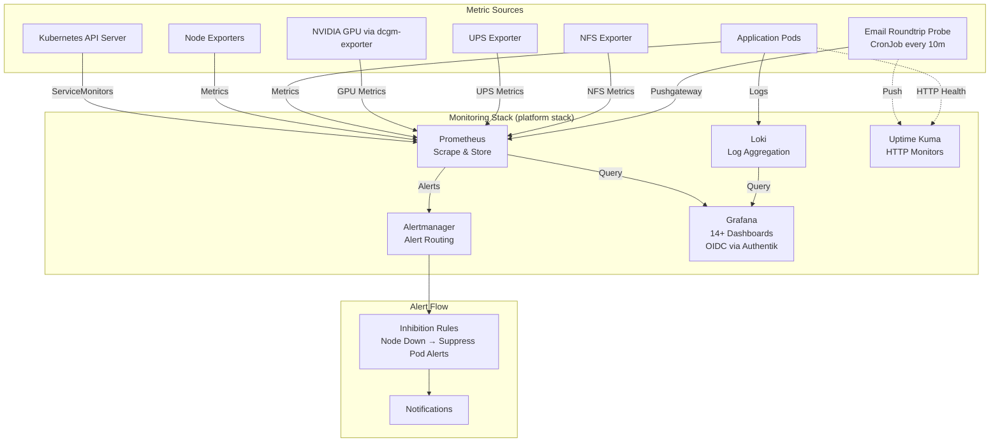
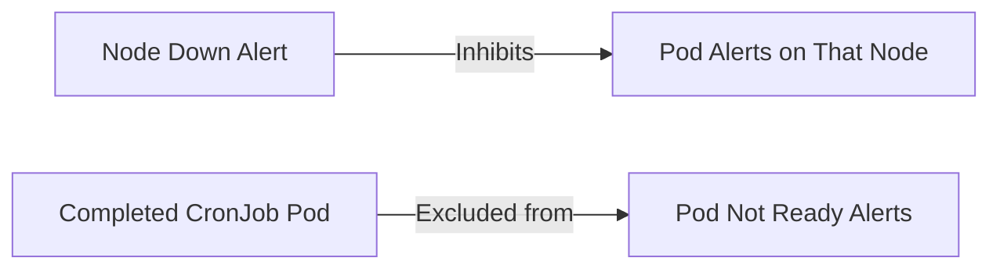

# Monitoring & Alerting Architecture

## Overview

The monitoring stack provides comprehensive observability for the home Kubernetes cluster through metrics collection (Prometheus), visualization (Grafana), log aggregation (Loki), alerting (Alertmanager), and uptime monitoring (Uptime Kuma). GPU metrics are collected via NVIDIA's dcgm-exporter. The system tracks infrastructure health, application performance, backup success, and resource utilization with intelligent alert inhibition to reduce noise during cascading failures.

## Architecture Diagram



## Components

| Component | Version | Location | Purpose |
|-----------|---------|----------|---------|
| Prometheus | Latest (Diun monitored) | `stacks/monitoring/modules/monitoring/` | Metrics collection and storage, scrape configs for all services |
| Grafana | Latest (Diun monitored) | `stacks/monitoring/modules/monitoring/` | Visualization, 14+ dashboards (API server, CoreDNS, GPU, UPS, etc.) |
| Loki | Latest (Diun monitored) | `stacks/monitoring/modules/monitoring/` | Log aggregation and querying |
| Alertmanager | Latest (Diun monitored) | `stacks/monitoring/modules/monitoring/` | Alert routing with cascade inhibitions |
| Uptime Kuma | Latest (Diun monitored) | `stacks/uptime-kuma/` | Internal + external HTTP monitors, status page |
| External Monitor Sync | Python 3.12 | `stacks/uptime-kuma/` | CronJob (10min) syncs `[External]` monitors from `cloudflare_proxied_names` |
| dcgm-exporter | Configurable resources | `stacks/monitoring/modules/monitoring/` | NVIDIA GPU metrics collection |
| Email Roundtrip Probe | Python 3.12 | `stacks/mailserver/modules/mailserver/` | E2E email delivery verification via Mailgun API + IMAP |
| Registry Integrity Probe | Alpine 3.20 + curl/jq | `stacks/monitoring/modules/monitoring/main.tf` | CronJob every 15m: walks `/v2/_catalog` on `registry.viktorbarzin.me:5050`, HEADs every tagged manifest + index child; emits `registry_manifest_integrity_*` metrics to Pushgateway. Catches orphan OCI-index state that filesystem scans miss. |

## How It Works

### Metrics Collection

Prometheus scrapes metrics from all cluster components and applications using ServiceMonitor CRDs and scrape configs. Every new service deployed to the cluster receives:
1. A Prometheus scrape configuration (via ServiceMonitor or static config)
2. An Uptime Kuma HTTP monitor for internal health checks
3. An external HTTP monitor (auto-created by `external-monitor-sync` for all Cloudflare-proxied services)

### External Monitoring

The `external-monitor-sync` CronJob (every 10min, `stacks/uptime-kuma/`) ensures Uptime Kuma has `[External] <service>` monitors for externally-reachable ingresses. Discovery is **opt-OUT**: the script lists every ingress via the K8s API and creates a monitor for any host ending in `.viktorbarzin.me`, skipping only those annotated `uptime.viktorbarzin.me/external-monitor: "false"`. Both `ingress_factory` and the `reverse-proxy` factory emit that annotation when the caller sets `external_monitor = false`; leaving it null keeps the opt-in default (important for helm-provisioned ingresses that don't go through our factories). The legacy `cloudflare_proxied_names` ConfigMap is a fallback if the K8s API discovery fails.

These monitors test the full external access path (DNS → Cloudflare → Tunnel → Traefik → Service) from inside the cluster. The status-page-pusher groups them as "External Reachability" and pushes a `external_internal_divergence_count` metric to Pushgateway when services are externally down but internally up. Alert `ExternalAccessDivergence` fires after 15min of divergence.

Data flows from targets through Prometheus storage to Grafana dashboards. Applications emit logs to stdout/stderr which are aggregated by Loki and queryable through Grafana's log viewer.

### Alert Cascade Inhibition

Alertmanager implements intelligent alert suppression to prevent alert storms during cascading failures:



When a node goes down, all pod-level alerts for pods scheduled on that node are suppressed, reducing noise and focusing attention on the root cause.

### GPU Monitoring

NVIDIA GPU metrics are collected via dcgm-exporter with configurable resource limits (`dcgmExporter.resources`). Metrics include GPU utilization, memory usage, temperature, and power consumption.

### Database Version Pinning

MySQL, PostgreSQL, and Redis images have Diun monitoring disabled to prevent automatic version updates that could cause compatibility issues. Version upgrades are manual and coordinated.

## Configuration

### Key Config Files

- **Monitoring Stack**: `stacks/platform/modules/monitoring/`
  - Prometheus scrape configs and recording rules
  - Grafana dashboard definitions
  - Alertmanager routing and inhibition rules
  - Uptime Kuma configuration

### Prometheus Scrape Configs

Every service must expose metrics and be registered in Prometheus via ServiceMonitor or static scrape config. Standard pattern:

```yaml
apiVersion: monitoring.coreos.com/v1
kind: ServiceMonitor
metadata:
  name: my-service
spec:
  selector:
    matchLabels:
      app: my-service
  endpoints:
  - port: metrics
```

### Grafana Dashboards

14+ pre-configured dashboards covering:
- Kubernetes API Server
- CoreDNS
- GPU metrics
- UPS status
- Node metrics
- Pod resource usage
- Application-specific metrics

### Alert Definitions

#### Infrastructure Alerts
- **OOMKill**: Container killed due to out-of-memory
- **PodReplicaMismatch**: Deployment/StatefulSet replica count doesn't match desired
- **ClusterMemoryRequestsHigh**: Cluster memory requests >85%
- **ContainerNearOOM**: Container using >85% of memory limit
- **PodUnschedulable**: Pod cannot be scheduled due to resource constraints
- **CPUTemp**: CPU temperature threshold exceeded
- **SSDWrites**: Excessive SSD write volume
- **NFSResponsiveness**: NFS mount latency issues
- **UPSBattery**: UPS battery charge low

#### Application Alerts
- **4xx/5xx Error Rates**: HTTP error rate threshold exceeded

#### Email Monitoring Alerts
- **EmailRoundtripFailing**: E2E email probe returning failure for >30m
- **EmailRoundtripStale**: No successful email round-trip in >40m
- **EmailRoundtripNeverRun**: Email probe has never reported (40m)

#### Registry Integrity Alerts
- **RegistryManifestIntegrityFailure**: Private registry serving 404 for manifests it advertises (orphan OCI-index children) — fires after 30m of `registry_manifest_integrity_failures > 0`. Remediation: rebuild affected image per `docs/runbooks/registry-rebuild-image.md`.
- **RegistryIntegrityProbeStale**: Probe hasn't reported in >1h (CronJob broken)
- **RegistryCatalogInaccessible**: Probe cannot fetch `/v2/_catalog` (auth failure or registry down)

The email monitoring system uses a CronJob (`email-roundtrip-monitor`, every 10 min) in the `mailserver` namespace that:
1. Sends a test email via Mailgun HTTP API to `smoke-test@viktorbarzin.me`
2. Email lands in the `spam@` catch-all mailbox via MX delivery
3. Verifies delivery via IMAP (searches by UUID marker in subject)
4. Deletes the test email immediately
5. Pushes metrics (`email_roundtrip_success`, `email_roundtrip_duration_seconds`, `email_roundtrip_last_success_timestamp`) to Prometheus Pushgateway
6. Pushes status to Uptime Kuma E2E Push monitor

Uptime Kuma monitors: TCP SMTP (port 25) on `176.12.22.76` (external), IMAP (port 993) on `10.0.20.202`, and Dovecot exporter metrics on port 9166.

#### Backup Alerts
- **PostgreSQLBackupStale**: >36h since last backup
- **MySQLBackupStale**: >36h since last backup
- **EtcdBackupStale**: >8d since last backup
- **VaultBackupStale**: >8d since last backup
- **VaultwardenBackupStale**: >8d since last backup
- **RedisBackupStale**: >8d since last backup
- **PrometheusBackupStale**: >32d since last backup
- **VaultwardenIntegrityFail**: Backup integrity check failed

### Vault Paths

No direct Vault integration required for the monitoring stack (platform stack cannot depend on Vault due to circular dependency).

## Decisions & Rationale

### Why Prometheus over alternatives (InfluxDB, Graphite)?
- Native Kubernetes integration via ServiceMonitor CRDs
- Pull-based model reduces application complexity (no push agents)
- Powerful query language (PromQL) for alerting and visualization
- Industry standard for cloud-native monitoring

### Why Grafana over Prometheus UI?
- Superior visualization capabilities
- OIDC authentication via Authentik for secure access
- Multi-data-source support (Prometheus + Loki)
- Rich dashboard ecosystem

### Why Loki for logs?
- Designed for Kubernetes log aggregation
- Cost-effective (indexes metadata, not full log content)
- Tight Grafana integration
- LogQL query language similar to PromQL

### Why Uptime Kuma?
- Simple HTTP/TCP/Ping monitoring
- Public status page for service availability
- Lightweight compared to full APM solutions
- Complements Prometheus for black-box monitoring

### Why alert inhibition?
- Prevents alert fatigue during cascading failures
- Root cause focus (fix the node, not 50 pods)
- Reduces on-call noise

### Why exclude completed CronJob pods?
- CronJobs naturally transition to Completed state
- "Pod not ready" is expected and not actionable
- Prevents false positive alerts

### Why disable Diun for databases?
- Version upgrades require migration planning
- Breaking schema changes need coordination
- Manual upgrade testing prevents production issues

## Troubleshooting

### Alert is firing but I don't see the issue

Check inhibition rules in Alertmanager. The alert may be suppressed due to a higher-level failure (e.g., node down suppressing pod alerts).

### Grafana dashboards show no data

1. Check Prometheus targets: `kubectl port-forward -n monitoring svc/prometheus 9090:9090` → `http://localhost:9090/targets`
2. Verify ServiceMonitor is created: `kubectl get servicemonitor -A`
3. Check Prometheus logs for scrape errors: `kubectl logs -n monitoring deployment/prometheus`

### Loki logs not appearing

1. Verify pod logs are going to stdout/stderr (not files)
2. Check Loki is scraping pod logs: `kubectl logs -n monitoring deployment/loki`
3. Ensure Grafana data source is configured correctly

### Backup alert firing but backup exists

1. Check backup timestamp in Prometheus: `backup_last_success_timestamp_seconds{job="my-backup"}`
2. Verify backup job completed successfully: `kubectl logs -n backups cronjob/my-backup`
3. Ensure backup job updates the Prometheus metric via pushgateway or ServiceMonitor

### GPU metrics not showing

1. Verify dcgm-exporter is running: `kubectl get pods -n monitoring -l app=dcgm-exporter`
2. Check GPU node has NVIDIA drivers installed
3. Verify dcgm-exporter has access to GPU: `kubectl logs -n monitoring deployment/dcgm-exporter`

### Uptime Kuma monitor shows down but service is healthy

1. Check network policies aren't blocking Uptime Kuma's pod
2. Verify service endpoint is reachable from Uptime Kuma namespace
3. Check Uptime Kuma logs: `kubectl logs -n monitoring deployment/uptime-kuma`

## Related

- [Secrets Management](./secrets.md) - OIDC authentication for Grafana via Authentik
- [Backup & DR](./backup-dr.md) - Backup monitoring alerts
- [Platform Stack](../../stacks/platform/README.md) - Monitoring stack deployment
- [Vault Architecture](./vault.md) - No direct dependency but related to cluster observability
