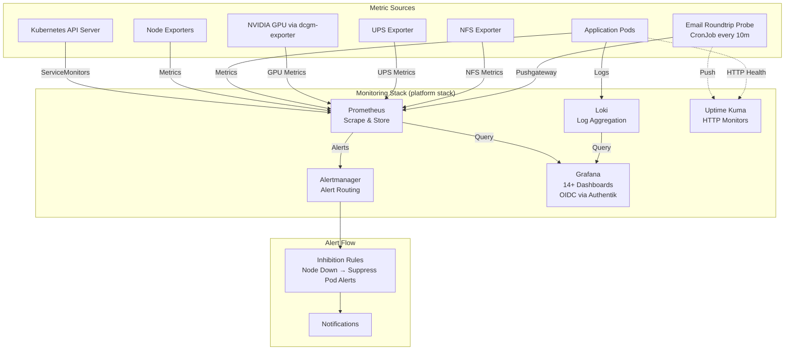
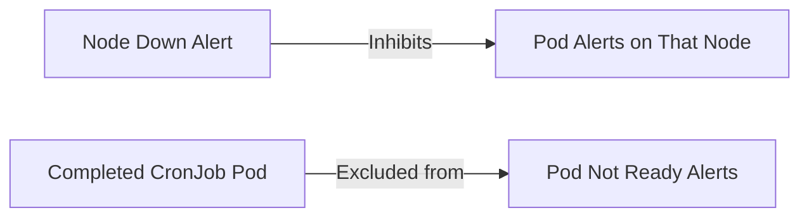

# Monitoring & Alerting Architecture

## Overview

The monitoring stack provides comprehensive observability for the home Kubernetes cluster through metrics collection (Prometheus), visualization (Grafana), log aggregation (Loki), alerting (Alertmanager), and uptime monitoring (Uptime Kuma). GPU metrics are collected via NVIDIA's dcgm-exporter. The system tracks infrastructure health, application performance, backup success, and resource utilization with intelligent alert inhibition to reduce noise during cascading failures.

## Architecture Diagram



## Components

| Component | Version | Location | Purpose |
|-----------|---------|----------|---------|
| Prometheus | Latest (Diun monitored) | `stacks/monitoring/modules/monitoring/` | Metrics collection and storage, scrape configs for all services |
| Grafana | Latest (Diun monitored) | `stacks/monitoring/modules/monitoring/` | Visualization, 14+ dashboards (API server, CoreDNS, GPU, UPS, etc.) |
| Loki | **DEPLOYED 2026-05-18** (SingleBinary mode, 30d retention, 50Gi PVC on `proxmox-lvm`, ruler enabled → Alertmanager). Re-enabled from previous "operational overhead" disable. Ships logs via Alloy DaemonSet (now on all nodes including master after 2026-05-19 toleration add). | `stacks/monitoring/modules/monitoring/` | Log aggregation and querying |
| Alertmanager | Latest (Diun monitored) | `stacks/monitoring/modules/monitoring/` | Alert routing with cascade inhibitions |
| Uptime Kuma | Latest (Diun monitored) | `stacks/uptime-kuma/` | Internal + external HTTP monitors, status page |
| External Monitor Sync | Python 3.12 | `stacks/uptime-kuma/` | CronJob (10min) syncs `[External]` monitors from `cloudflare_proxied_names` |
| dcgm-exporter | Configurable resources | `stacks/monitoring/modules/monitoring/` | NVIDIA GPU metrics collection |
| Email Roundtrip Probe | Python 3.12 | `stacks/mailserver/modules/mailserver/` | E2E email delivery verification via Mailgun API + IMAP |
| Forgejo Registry Integrity Probe | Alpine 3.20 + curl/jq | `stacks/monitoring/modules/monitoring/main.tf` | CronJob every 15m: walks `/v2/_catalog` on `forgejo.viktorbarzin.me` (HTTP via in-cluster service), HEADs every tagged manifest + index child; emits `registry_manifest_integrity_*` metrics to Pushgateway. Replaces the legacy `registry-integrity-probe` against `registry.viktorbarzin.me:5050` decommissioned in Phase 4 of forgejo-registry-consolidation 2026-05-07. |
| blackbox-exporter (Authentik walling-off guard) | `prom/blackbox-exporter` (Keel-managed) | `stacks/monitoring/modules/monitoring/authentik_walloff_probe.tf` | Single-purpose blackbox-exporter. Its `http_no_authentik_redirect` module probes each must-stay-public carve-out URL with `no_follow_redirects` and FAILS (`fail_if_header_matches` on `Location`) iff the response redirects to Authentik. Scraped by job `blackbox-authentik-walloff` (1m); feeds alert `AuthentikWallingOffPublicPath`. Target list = `local.authentik_walloff_targets` in the same file. |
| snmp-exporter | `prom/snmp-exporter` (Keel-managed) | `stacks/monitoring/modules/monitoring/snmp_exporter.tf` + `ups_snmp_values.yaml` | SNMP→Prometheus bridge. Modules in `ups_snmp_values.yaml`: `huawei` (UPS), `if_mib`/`ip_mib`, and **`dell_idrac`** (R730 iDRAC, merged from `prometheus_snmp_chart_values.yaml` 2026-06-05 + hand-added fan-RPM `coolingDeviceReading` / amperage location lookup). Scrape jobs: `snmp-ups` (30s, module=huawei), **`snmp-idrac` (1m, module=dell_idrac, auth=public_v2)** — the FAST primary source for R730 health/thermal/power/fan/voltage since the 2026-06-05 Redfish→SNMP migration (~3.7s/scrape vs Redfish ~18.5s). Relabels all metrics to `r730_idrac_<mibName>`. |
| idrac-redfish-exporter | `viktorbarzin/idrac-redfish-exporter:2.4.1-voltage-fix` (mrlhansen/idrac_exporter, Keel-managed) | `stacks/monitoring/modules/monitoring/idrac.tf` | **Slow remnant** (10m scrape, job `redfish-idrac`) since the 2026-06-05 SNMP migration — was the sole iDRAC source at a 3m interval, demoted once SNMP took over the fast path. Trimmed to `system,sensors,power,storage,network,memory`. Serves only what SNMP can't (indicator LED, NIC link-speed Mbps, machine/BIOS info, per-drive storage table). **HA Sofia's R730 sensors moved off this exporter to a fast Prometheus SNMP query on 2026-06-05** (see the iDRAC subsection under "How It Works"), so the `sensors` collector here is now vestigial. |

## How It Works

### Metrics Collection

Prometheus scrapes metrics from all cluster components and applications using ServiceMonitor CRDs and scrape configs. Every new service deployed to the cluster receives:
1. A Prometheus scrape configuration (via ServiceMonitor or static config)
2. An Uptime Kuma HTTP monitor for internal health checks
3. An external HTTP monitor (auto-created by `external-monitor-sync` for all Cloudflare-proxied services)

### External Monitoring

The `external-monitor-sync` CronJob (every 10min, `stacks/uptime-kuma/`) ensures Uptime Kuma has `[External] <service>` monitors for externally-reachable ingresses. Discovery is **opt-OUT**: the script lists every ingress via the K8s API and creates a monitor for any host ending in `.viktorbarzin.me`, skipping only those annotated `uptime.viktorbarzin.me/external-monitor: "false"`. Both `ingress_factory` and the `reverse-proxy` factory emit that annotation when the caller sets `external_monitor = false`; leaving it null keeps the opt-in default (important for helm-provisioned ingresses that don't go through our factories). The legacy `cloudflare_proxied_names` ConfigMap is a fallback if the K8s API discovery fails.

These monitors test the full external access path (DNS → Cloudflare → Tunnel → Traefik → Service) from inside the cluster. The status-page-pusher groups them as "External Reachability" and pushes a `external_internal_divergence_count` metric to Pushgateway when services are externally down but internally up. Alert `ExternalAccessDivergence` fires after 15min of divergence.

Data flows from targets through Prometheus storage to Grafana dashboards. Applications emit logs to stdout/stderr which are aggregated by Loki and queryable through Grafana's log viewer.

### Cluster log aggregation (Alloy → Loki) + the "Cluster Logs" dashboard

Pod logs are tailed off the nodes' `/var/log/pods` by the **Grafana Alloy**
DaemonSet (`alloy.yaml`) and shipped to Loki with labels `namespace` / `pod` /
`container` / `app`; node + external-Pi system logs arrive as the `node-journal`
and `rpi-sofia-journal` jobs (labels `node` / `unit` / `level`).

> **Gotcha (regression found + fixed 2026-06-05):** `loki.source.file` does
> **not** expand globs. The pod-log pipeline must place a **`local.file_match`**
> component between `discovery.relabel` (which writes the
> `/var/log/pods/*<uid>/<container>/*.log` glob into `__path__`) and
> `loki.source.file`. Without it, `loki.source.file` `stat()`s the literal `*`
> path and ships **zero** pod logs — for a stretch only the journals reached
> Loki. A `stage.cri {}` stage parses the containerd CRI wrapper so Loki stores
> clean messages + real timestamps. If application logs ever vanish from Loki
> again, check Alloy logs for `loki.source.file ... stat failed`. On first
> discovery Alloy reads existing files from the start → a brief burst of
> `entry too far behind` 400s from Loki (old lines rejected, recent accepted);
> it self-settles. Alloy read-positions are ephemeral, so a pod restart repeats
> the bounded catch-up read — watch sdc IO (the 2026-05-26 storm surface; mem
> limits are the safeguard).

Search/observe everything via the **"Cluster Logs"** Grafana dashboard
(`dashboards/cluster-logs.json`, *Logs* folder): `$namespace`/`$app`/`$pod`
dropdowns + free-text regex `$search`, log-volume-by-namespace, error/warn rate,
top namespaces/pods by errors, a live filterable logs panel, and a journals row.
Error/warn panels use case-insensitive regex line-filters because pod logs carry
no `level` stream label.

**Surfaced in ha-sofia** for Emo: two RESTful sensors
(`/config/rest_resources/loki_cluster_{errors,warnings}.yaml`) query Loki for
cluster error/warn line counts (5-min window) → `sensor.cluster_log_errors_5m` /
`sensor.cluster_log_warnings_5m`, for a compact trend card on the Барзини status
view plus a Grafana-link button. Those sensors reach Loki via the Traefik LB IP
`10.0.20.203` + a `Host: loki.viktorbarzin.lan` header (`verify_ssl: false`)
because `loki.viktorbarzin.lan` has **no Technitium record yet** (the
`technitium-ingress-dns-sync` CronJob only creates `.me` CNAMEs + pins
`ingress.viktorbarzin.lan`). The **PVE host** promtail (see "External host: pve"
below) reaches Loki the same way, via an `/etc/hosts` pin
`10.0.20.203 loki.viktorbarzin.lan`. **Follow-up (now 3 consumers — this sensor,
rpi-sofia, the PVE host):** register `loki.viktorbarzin.lan` in Technitium as a
CNAME → `ingress.viktorbarzin.lan` (auto-tracks Traefik LB renumbers) so all
three resolve it by name instead of pinning the LB IP.

### External host: rpi-sofia (Sofia Raspberry Pi)

`rpi-sofia` is a physical Raspberry Pi 3 at the Sofia home site (not in the cluster — it's the Frigate camera DNAT gateway + solar-inverter path + HA MQTT sensor publisher). It is monitored **off-box** into the cluster, set up 2026-06-05 after a ~5h hang whose cause couldn't be reconstructed because the Pi's *local* journal had silently stopped writing back in April (an aging 2017 SD card intermittently flips the rootfs read-only). Everything below ships telemetry to the cluster so the **next** failure is captured centrally, surviving the SD card.

**Metrics** — Prometheus static scrape job `rpi-sofia` → `rpi-sofia.viktorbarzin.lan:9100` (apt `prometheus-node-exporter`). A `vcgencmd` textfile collector on the Pi (`/usr/local/bin/rpi-throttle-textfile.sh` + a 1-min systemd timer) adds Pi-specific gauges node_exporter lacks: `rpi_under_voltage_now`/`_occurred`, `rpi_throttled_now`/`_occurred`, `rpi_soc_temp_celsius`, `rpi_core_volts`.

**Logs** — `promtail` v3.5.1 (armv7) on the Pi ships the **full systemd journal** to the cluster Loki via a LAN-gated ingress (`https://loki.viktorbarzin.lan/loki/api/v1/push`; see `loki_ingress.tf`, `auth = "none"` + `allow_local_access_only`). Stream selector: `{job="rpi-sofia-journal", host="rpi-sofia"}`, relabeled with `unit` and `level` (error/warning/notice/info). Coverage (~440 entries/hr):
- **Kernel / non-unit messages** (the `unit=""` / `(none)` stream) — `dmesg`-level lines, i.e. the `mmc`/`EXT4-fs` read-only-remount and under-voltage kernel warnings that precede a hang. This is the primary forensic signal.
- **All systemd units** — `prometheus-node-exporter`, `promtail`, `dnsmasq`, `cron`, `ssh`, `systemd-logind`, `avahi-daemon`, `rng-tools`, `vncserver-x11`, login `session-*.scope`, etc.

Query examples (Grafana → Loki): `{job="rpi-sofia-journal"}`, `{job="rpi-sofia-journal"} | level=~"error|warning"`, `{job="rpi-sofia-journal", unit="ssh.service"}`.

**Dashboard** — `dashboards/rpi-sofia.json` ("RPi Sofia", Hardware folder): status, undervoltage/throttle, SoC temp, load, memory, root-fs free + read-only, network.

**Alerts** (group `RPi Sofia` in `prometheus_chart_values.tpl`): `RpiSofiaDown` (`up==0`), `RpiSofiaFilesystemReadonly` (`node_filesystem_readonly{mountpoint="/"}==1` — the SD-failure signature), `RpiSofiaUndervoltage` (`rpi_under_voltage_occurred==1`), `RpiSofiaHighTemp`.

**Recovery** — a systemd hardware watchdog (`RuntimeWatchdogSec=14s`, bcm2835 max ~15s) auto-reboots the Pi on a hard hang instead of leaving it dead for hours.

> The cluster side (scrape job, alerts, Loki ingress, dashboard) is Terraform-managed in `stacks/monitoring/`. The **Pi-side** pieces (node_exporter, the textfile collector + timer, promtail, the watchdog config, and the `server=/viktorbarzin.lan/192.168.1.2` dnsmasq split-horizon forward needed to resolve the Loki ingress) are configured by hand on the Pi — it is not under Terraform — and are backed up off-box at `/home/wizard/rpi-sofia-backup/`. The real reliability fix (reflash/replace the SD card) needs on-site access.

### External host: pve (Proxmox hypervisor, 192.168.1.127)

`pve` is the Proxmox VE host — the hypervisor running **every** VM (pfSense, the 5 k8s nodes, the devvm, HA, Windows). It is not in the cluster. Since 2026-06-10 its **full systemd journal ships to cluster Loki**, closing a gap (the most critical host previously had no central logging) and giving the Wave-1 **S1** security rule its data source (`docs/architecture/security.md`).

**Why now:** emo's Claude agent was granted **root SSH** to the host (a dedicated shared-root key `emo-pve-agent@devvm`, fingerprint `SHA256:Wd+m0EABlm4RDDykDh85PIYSqe0Al8Hr9AZ+7Ksy4HQ`, reachable as `ssh pve` from the devvm) so he can manage the host (e.g. the R730 fan daemon) via his agent. To keep an audit trail, **snoopy** (enabled via `/etc/ld.so.preload` → `libsnoopy.so`; config `scripts/pve-snoopy.ini`) logs every `execve()` to journald under identifier `snoopy`, and promtail ships it to Loki.

**Logs** — `promtail` v3.5.1 (amd64) at `/usr/local/bin/promtail`, config `scripts/pve-promtail.yaml`, unit `scripts/pve-promtail.service`. Ships `/var/log/journal` to `https://loki.viktorbarzin.lan/loki/api/v1/push` (`insecure_skip_verify`; LB-IP reached via the `/etc/hosts` pin noted above). Relabels: `unit`, `level`, `identifier`; sshd lines (`identifier=~"sshd.*"`) are re-jobbed to `sshd-pve` so the S1 rule matches. Streams:
- `{job="pve-journal", host="pve"}` — full host journal (kernel, pvestatd, fan-control, NFS, etc.).
- `{job="pve-journal", identifier="snoopy"}` — **command audit** (every execve: `uid login tty sid cwd cmdline`).
- `{job="sshd-pve"}` — sshd auth; an `Accepted publickey ... SHA256:<fp>` line ties a session to a key (e.g. emo's fp above). Feeds S1.

**Attribution caveat:** all SSH is shared-root, so snoopy `uid`/`login` are always `root`; attribute a command to a person by correlating its `sid`/timestamp with the matching `{job="sshd-pve"}` Accepted-publickey line (key fingerprint). emo's agent arrives SNAT'd as `192.168.1.2`, which is in the S1 allowlist, so legitimate access does not alert.

Query examples (Grafana → Loki): `{host="pve"}`, `{job="pve-journal", identifier="snoopy"}` (command audit), `{job="sshd-pve"} |= "Accepted publickey"`.

> Hand-managed (not Terraform), like the rpi-sofia and fan-control pieces: the promtail binary/config/unit, the snoopy enable (`/etc/ld.so.preload`), and the `/etc/hosts` Loki pin all live on the host. Source-of-truth files: `scripts/pve-promtail.{yaml,service}` + `scripts/pve-snoopy.ini`; deploy steps are in the `pve-promtail.yaml` header.

### Dell R730 iDRAC: SNMP-primary + Redfish remnant (migrated 2026-06-05)

The R730 iDRAC (`192.168.1.4` / `idrac.viktorbarzin.lan`) is monitored by **two** Prometheus jobs, both relabeled to the `r730_idrac_*` prefix (which historically hid which source served what). Design/plan: `docs/plans/2026-06-05-idrac-snmp-migration-{design,plan}.md`.

- **`snmp-idrac` (FAST, primary, 1m / 30s):** snmp-exporter `dell_idrac` module against `:161` (v2c, community `Public0` = `auth=public_v2`). ~3.7s/scrape. Serves all dynamic + health + alerting metrics: `r730_idrac_temperatureProbeReading` (tenths-°C, ÷10), `coolingDeviceReading` (fan RPM, label `coolingDeviceLocationName`), `amperageProbeReading{amperageProbeLocationName="System Board Pwr Consumption"}` (watts), `powerSupplyCurrentInputVoltage`, `globalSystemStatus`, `systemPowerState`, `powerSupplyStatus`, `physicalDiskComponentStatus`, `systemStateMemoryDeviceStatusCombined`, etc.
- **`redfish-idrac` (SLOW remnant, 10m / 45s):** the old mrlhansen exporter, trimmed, kept only for metrics SNMP can't serve (indicator LED, NIC Mbps, machine/BIOS info, per-drive storage table). Its `sensors` collector is now **vestigial** (HA moved off it — see next bullet) and could be dropped.
- **HA Sofia R730 sensors → Prometheus SNMP (2026-06-05):** ha-sofia's 7 REST sensors (`/config/rest_resources/idrac_redfish_exporter.yaml` — CPU/exhaust/inlet temp, power, 2× PSU voltage, fan speed) were re-pointed from the slow on-demand Redfish exporter (`scan_interval: 120`, ~16-22s/fetch, intermittent `unavailable` blips) to a **fast Prometheus query of the SNMP values** (`scan_interval: 30`, instant): `https://prometheus-query.viktorbarzin.lan/api/v1/query?query={__name__=~"r730_idrac_…"}`, one query → JSON, each sensor filters by metric+label (temps ÷10). The `prometheus-query.viktorbarzin.lan` ingress is **local-only, `auth=none`, path-scoped to `/api/v1/query`** (added in `prometheus.tf`) so HA can query the API without the Authentik gate on `prometheus.viktorbarzin.me`. Its Technitium CNAME (→ `ingress.viktorbarzin.lan`) was added **manually via the API** — like the other `.lan` exporter hosts it is NOT auto-synced (the `technitium-ingress-dns-sync` CronJob only creates `.me` records; same gap as the Loki-sensor follow-up noted above). HA-side file is auto-version-controlled by the ha-sofia HomeAssistantVersionControl add-on; pre-migration copy saved at `/config/idrac_redfish_exporter.bak-pre-snmp`.

**Gotchas:**
- **Enum values differ from the old Redfish metrics.** DellStatus: `3 = OK` (was Redfish `1`); `systemPowerState`: `4 = on` (was `2`). All iDRAC alert exprs were rewritten accordingly (`!= 3`, `!= 4`).
- The alert `iDRACSNMPMetricsMissing` was historically a misnomer (checked a Redfish metric); it now correctly probes `absent(r730_idrac_globalSystemStatus)`. `iDRACRedfishMetricsMissing` now probes `absent(r730_idrac_powerSupplyCurrentInputVoltage)`.
- **SSD life % + SEL are genuine SNMP gaps but were already inert** (Redfish reported `0`/empty), so the SSD-wear alerts (kept on `r730_idrac_idrac_storage_drive_life_left_percent`) and the SEL dashboard panel are unchanged.
- Why SNMP: the Redfish exporter (`metrics: all: true`) walked every subtree on each scrape — ~18.5s avg / 28s peak against the slow BMC — which forced the infrequent interval. SNMP is a single fast walk.

### Alert Cascade Inhibition

Alertmanager implements intelligent alert suppression to prevent alert storms during cascading failures:



When a node goes down, all pod-level alerts for pods scheduled on that node are suppressed, reducing noise and focusing attention on the root cause.

### GPU Monitoring

NVIDIA GPU metrics are collected via dcgm-exporter with configurable resource limits (`dcgmExporter.resources`). Metrics include GPU utilization, memory usage, temperature, and power consumption.

### Database Version Pinning

MySQL, PostgreSQL, and Redis images have Diun monitoring disabled to prevent automatic version updates that could cause compatibility issues. Version upgrades are manual and coordinated.

## Configuration

### Key Config Files

- **Monitoring Stack**: `stacks/platform/modules/monitoring/`
  - Prometheus scrape configs and recording rules
  - Grafana dashboard definitions
  - Alertmanager routing and inhibition rules
  - Uptime Kuma configuration

### Prometheus Scrape Configs

Every service must expose metrics and be registered in Prometheus via ServiceMonitor or static scrape config. Standard pattern:

```yaml
apiVersion: monitoring.coreos.com/v1
kind: ServiceMonitor
metadata:
  name: my-service
spec:
  selector:
    matchLabels:
      app: my-service
  endpoints:
  - port: metrics
```

### Grafana Dashboards

14+ pre-configured dashboards covering:
- Kubernetes API Server
- CoreDNS
- GPU metrics
- UPS status
- Node metrics
- Pod resource usage
- Application-specific metrics

### Alert Definitions

#### Infrastructure Alerts
- **OOMKill**: Container killed due to out-of-memory
- **PodReplicaMismatch**: Deployment/StatefulSet replica count doesn't match desired
- **ClusterMemoryRequestsHigh**: Cluster memory requests >85%
- **ContainerNearOOM**: Container using >85% of memory limit
- **PodUnschedulable**: Pod cannot be scheduled due to resource constraints
- **CPUTemp**: CPU temperature threshold exceeded
- **SSDWrites**: Excessive SSD write volume
- **NFSResponsiveness**: NFS mount latency issues
- **UPSBattery**: UPS battery charge low

#### Application Alerts
- **4xx/5xx Error Rates**: HTTP error rate threshold exceeded

#### Email Monitoring Alerts
- **EmailRoundtripFailing**: E2E email probe returning failure for >30m
- **EmailRoundtripStale**: No successful email round-trip in >80m (60m threshold + for:20m)
- **EmailRoundtripNeverRun**: Email probe has never reported (40m)

#### Registry Integrity Alerts
- **RegistryManifestIntegrityFailure**: Private registry serving 404 for manifests it advertises (orphan OCI-index children) — fires after 30m of `registry_manifest_integrity_failures > 0`. Remediation: rebuild affected image per `docs/runbooks/registry-rebuild-image.md`.
- **RegistryIntegrityProbeStale**: Probe hasn't reported in >1h (CronJob broken)
- **RegistryCatalogInaccessible**: Probe cannot fetch `/v2/_catalog` (auth failure or registry down)

#### Immich Smart Search Alerts
- **ImmichSmartSearchSlow**: Representative context-search ANN query >1s for 15m. Root cause is almost always the `clip_index` (vchord, ~665MB) decaying out of PG `shared_buffers` — a cold list read is ~1.8s vs ~4ms warm. Remediation: confirm the `clip-index-prewarm` CronJob (immich ns, `*/5`) is succeeding; manual fix `kubectl exec -n immich -c immich-postgresql <pg-pod> -- psql -U postgres -d immich -c "SELECT pg_prewarm('clip_index')"`.
- **ImmichClipIndexColdCache**: `clip_index` <50% resident in shared_buffers for 15m (leading indicator; same remediation).
- **ImmichSearchProbeStale**: `immich-search-probe` hasn't reported in >30m (CronJob broken). Inhibits the two above so frozen Pushgateway gauges don't false-fire.

The Immich smart-search monitoring uses two CronJobs in the `immich` namespace (both `*/5`): `clip-index-prewarm` re-runs `pg_prewarm('clip_index')` to keep the vector index hot during runtime (the `postStart` prewarm only fires at pod start; `pg_prewarm.autoprewarm` only reloads at startup, so the index otherwise decays under job buffer-pressure), and `immich-search-probe` (postgres init-container measures a random-vector ANN latency + `pg_buffercache` residency → curl sidecar pushes `immich_smart_search_db_seconds` / `immich_clip_index_cached_pct` / `immich_smart_search_probe_success` / `immich_smart_search_probe_last_run_timestamp` to the Pushgateway). Also surfaced by cluster-health check #46 (`check_immich_search`). Note this is the **Postgres** half of smart-search warmth; the **ML model** half is kept warm by the separate `clip-keepalive` CronJob.

The email monitoring system uses a CronJob (`email-roundtrip-monitor`, every 10 min) in the `mailserver` namespace that:
1. Sends a test email via Mailgun HTTP API to `smoke-test@viktorbarzin.me`
2. Email lands in the `spam@` catch-all mailbox via MX delivery
3. Verifies delivery via IMAP (searches by UUID marker in subject)
4. Deletes the test email immediately
5. Pushes metrics (`email_roundtrip_success`, `email_roundtrip_duration_seconds`, `email_roundtrip_last_success_timestamp`) to Prometheus Pushgateway
6. Pushes status to Uptime Kuma E2E Push monitor

Uptime Kuma monitors: TCP SMTP (port 25) on `176.12.22.76` (external), IMAP (port 993) on `10.0.20.202`, and Dovecot exporter metrics on port 9166.

#### Security Alerts (Wave 1 — planned, beads `code-8ywc`)

Routed via **Loki ruler → Alertmanager → `#security` Slack receiver**. Same handling path as infra alerts. Single channel with severity labels inside (critical/warning/info), not three separate channels. Detection sources: K8s API audit log (`job=kube-audit`), Vault audit log (`job=vault-audit`), PVE sshd journald (`job=sshd-pve`), Calico flow logs (`job=calico-flow`, W1.6 only).

| # | Source | Event | Severity |
|---|---|---|---|
| K2 | kube-audit | SA token used from outside cluster | critical |
| K3 | kube-audit | Secret read in vault/sealed-secrets/external-secrets by non-allowlisted SA | critical |
| K4 | kube-audit | Exec into vault/kube-system/dbaas/cnpg-system pod by non-allowlisted user | warning |
| K5 | kube-audit | Mass delete (>5 Pod/Secret/CM in 60s) | critical |
| K6 | kube-audit | Audit policy itself modified | critical |
| K7 | kube-audit | New `*,*` ClusterRole created | warning |
| K8 | kube-audit | Anonymous binding granted | critical |
| K9 | kube-audit | `me@viktorbarzin.me` request from non-allowlist sourceIP | critical |
| V1 | vault-audit | Root token created | critical |
| V2 | vault-audit | Audit device disabled/modified | critical |
| V3 | vault-audit | Seal status changed | critical |
| V4 | vault-audit | Policy written/modified (allowlist Terraform actor) | warning |
| V5 | vault-audit | Auth failure spike >10/min | warning |
| V6 | vault-audit | Token with policies different from parent created | critical |
| V7 | vault-audit | Viktor's entity_id from non-allowlist remote_addr (requires `x_forwarded_for_authorized_addrs`) | critical |
| S1 | sshd-pve | sshd auth success from non-allowlist IP | critical |

K1 (cluster-admin grant) intentionally skipped — see security.md.

Allowlist source-IP CIDRs (used by K2, K9, V7, S1): `10.0.20.0/22`, `192.168.1.0/24`, K8s pod CIDR, K8s service CIDR, Headscale tailnet. Policy: no public-IP access; all admin paths transit LAN or Headscale.

IOPS impact estimated ~1-2 GB/day additional disk writes after custom audit-policy tuning. Retention: 90d for security streams.

##### Authentik walling-off guard — `AuthentikWallingOffPublicPath`

Detects the inverse of the K-series alerts: a service that **must work WITHOUT Authentik SSO** getting accidentally walled off. Services on `ingress_factory auth = "required"` put Authentik forward-auth on `/`, which 302-bounces native-client / public / webhook / WebSocket / SPA-XHR paths. We carve those out with path-scoped `auth = "none"` ingresses; a TF revert, a bad deploy, or `ingress_factory`'s fail-closed `auth` default flipping back to `"required"` can silently clobber a carve-out.

- **Mechanism**: `blackbox-exporter` (monitoring ns) probes a representative GET-able URL per carve-out with `no_follow_redirects: true`. The `http_no_authentik_redirect` module FAILS the probe (`fail_if_header_matches` on the `Location` header, regex `authentik\.viktorbarzin\.me|/outpost\.goauthentik\.io|/application/o/authorize`) iff the response redirects to Authentik. `valid_status_codes` enumerates all expected non-Authentik responses **including 301/302** (so a legitimate redirect, e.g. a short-link 302, or a 404 carve-out like meshcentral `/agent.ashx`, stays green). Scrape job: `blackbox-authentik-walloff` (1m).
- **Alert**: `probe_failed_due_to_regex{job="blackbox-authentik-walloff"} == 1` for 10m → `severity=warning`, `lane=security` → **`#security` Slack** (Slack-only, no paging). `probe_failed_due_to_regex` (not bare `probe_success==0`) is the signal: it isolates the Authentik-redirect from unrelated 5xx/DNS/TLS failures already covered by reachability alerts. Inhibited by `TraefikDown` and `AuthentikDown` (symptom, not regression, during those outages).
- **Target list + how to add one**: `local.authentik_walloff_targets` in `stacks/monitoring/modules/monitoring/authentik_walloff_probe.tf` — a map of `service → URL`. To guard a NEW carve-out, add ONE line. Verify it does NOT already 302 to Authentik first: `curl -s -o /dev/null -w '%{http_code} %{redirect_url}\n' '<url>'`. The map key becomes the `service` label on the metric + alert. (Note: openclaw `task-webhook` is intentionally NOT probed — no public DNS record.)

#### Backup Alerts
- **PostgreSQLBackupStale**: >36h since last backup
- **MySQLBackupStale**: >36h since last backup
- **EtcdBackupStale**: >8d since last backup
- **VaultBackupStale**: >8d since last backup
- **VaultwardenBackupStale**: >8d since last backup
- **RedisBackupStale**: >8d since last backup
- **PrometheusBackupStale**: >32d since last backup
- **VaultwardenIntegrityFail**: Backup integrity check failed

### Vault Paths

No direct Vault integration required for the monitoring stack (platform stack cannot depend on Vault due to circular dependency).

## Decisions & Rationale

### Why Prometheus over alternatives (InfluxDB, Graphite)?
- Native Kubernetes integration via ServiceMonitor CRDs
- Pull-based model reduces application complexity (no push agents)
- Powerful query language (PromQL) for alerting and visualization
- Industry standard for cloud-native monitoring

### Why Grafana over Prometheus UI?
- Superior visualization capabilities
- OIDC authentication via Authentik for secure access
- Multi-data-source support (Prometheus + Loki)
- Rich dashboard ecosystem

### Why Loki for logs?
- Designed for Kubernetes log aggregation
- Cost-effective (indexes metadata, not full log content)
- Tight Grafana integration
- LogQL query language similar to PromQL

### Why Uptime Kuma?
- Simple HTTP/TCP/Ping monitoring
- Public status page for service availability
- Lightweight compared to full APM solutions
- Complements Prometheus for black-box monitoring

### Why alert inhibition?
- Prevents alert fatigue during cascading failures
- Root cause focus (fix the node, not 50 pods)
- Reduces on-call noise

### Why exclude completed CronJob pods?
- CronJobs naturally transition to Completed state
- "Pod not ready" is expected and not actionable
- Prevents false positive alerts

### Why disable Diun for databases?
- Version upgrades require migration planning
- Breaking schema changes need coordination
- Manual upgrade testing prevents production issues

## Troubleshooting

### Alert is firing but I don't see the issue

Check inhibition rules in Alertmanager. The alert may be suppressed due to a higher-level failure (e.g., node down suppressing pod alerts).

### Grafana dashboards show no data

1. Check Prometheus targets: `kubectl port-forward -n monitoring svc/prometheus 9090:9090` → `http://localhost:9090/targets`
2. Verify ServiceMonitor is created: `kubectl get servicemonitor -A`
3. Check Prometheus logs for scrape errors: `kubectl logs -n monitoring deployment/prometheus`

### Loki logs not appearing

1. Verify pod logs are going to stdout/stderr (not files)
2. Check Loki is scraping pod logs: `kubectl logs -n monitoring deployment/loki`
3. Ensure Grafana data source is configured correctly

### Backup alert firing but backup exists

1. Check backup timestamp in Prometheus: `backup_last_success_timestamp_seconds{job="my-backup"}`
2. Verify backup job completed successfully: `kubectl logs -n backups cronjob/my-backup`
3. Ensure backup job updates the Prometheus metric via pushgateway or ServiceMonitor

### GPU metrics not showing

1. Verify dcgm-exporter is running: `kubectl get pods -n monitoring -l app=dcgm-exporter`
2. Check GPU node has NVIDIA drivers installed
3. Verify dcgm-exporter has access to GPU: `kubectl logs -n monitoring deployment/dcgm-exporter`

### Uptime Kuma monitor shows down but service is healthy

1. Check network policies aren't blocking Uptime Kuma's pod
2. Verify service endpoint is reachable from Uptime Kuma namespace
3. Check Uptime Kuma logs: `kubectl logs -n monitoring deployment/uptime-kuma`

## Related

- [Secrets Management](./secrets.md) - OIDC authentication for Grafana via Authentik
- [Backup & DR](./backup-dr.md) - Backup monitoring alerts
- [Platform Stack](../../stacks/platform/README.md) - Monitoring stack deployment
- [Vault Architecture](./vault.md) - No direct dependency but related to cluster observability
