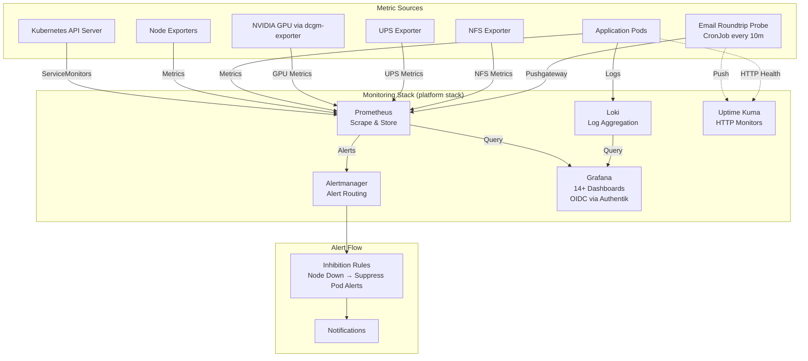
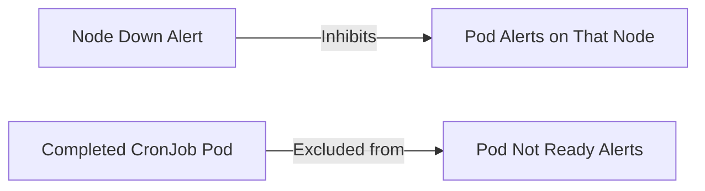

# Monitoring & Alerting Architecture

## Overview

The monitoring stack provides comprehensive observability for the home Kubernetes cluster through metrics collection (Prometheus), visualization (Grafana), log aggregation (Loki), alerting (Alertmanager), and uptime monitoring (Uptime Kuma). GPU metrics are collected via NVIDIA's dcgm-exporter. The system tracks infrastructure health, application performance, backup success, and resource utilization with intelligent alert inhibition to reduce noise during cascading failures.

## Architecture Diagram


```mermaid
graph TB
    subgraph "Metric Sources"
        K8S[Kubernetes API Server]
        NODES[Node Exporters]
        PODS[Application Pods]
        GPU[NVIDIA GPU via dcgm-exporter]
        UPS[UPS Exporter]
        NFS[NFS Exporter]
        EMAIL[Email Roundtrip Probe<br/>CronJob every 10m]
    end

    subgraph "Monitoring Stack (platform stack)"
        PROM[Prometheus<br/>Scrape & Store]
        LOKI[Loki<br/>Log Aggregation]
        AM[Alertmanager<br/>Alert Routing]
        GRAFANA[Grafana<br/>14+ Dashboards<br/>OIDC via Authentik]
        UPTIME[Uptime Kuma<br/>HTTP Monitors]
    end

    subgraph "Alert Flow"
        INHIBIT[Inhibition Rules<br/>Node Down → Suppress Pod Alerts]
        NOTIFY[Notifications]
    end

    K8S -->|ServiceMonitors| PROM
    NODES -->|Metrics| PROM
    PODS -->|Metrics| PROM
    PODS -->|Logs| LOKI
    GPU -->|GPU Metrics| PROM
    UPS -->|UPS Metrics| PROM
    NFS -->|NFS Metrics| PROM

    PROM -->|Query| GRAFANA
    PROM -->|Alerts| AM
    LOKI -->|Query| GRAFANA

    AM --> INHIBIT
    INHIBIT --> NOTIFY

    EMAIL -->|Pushgateway| PROM
    EMAIL -.->|Push| UPTIME
    PODS -.->|HTTP Health| UPTIME
```

## Components

| Component | Version | Location | Purpose |
|-----------|---------|----------|---------|
| Prometheus | Latest (Diun monitored) | `stacks/monitoring/modules/monitoring/` | Metrics collection and storage, scrape configs for all services |
| Grafana | Latest (Diun monitored) | `stacks/monitoring/modules/monitoring/` | Visualization, 14+ dashboards (API server, CoreDNS, GPU, UPS, etc.) |
| Loki | **DEPLOYED 2026-05-18** (SingleBinary mode, 30d retention, 50Gi PVC on `proxmox-lvm`, ruler enabled → Alertmanager). Re-enabled from previous "operational overhead" disable. Ships logs via Alloy DaemonSet (now on all nodes including master after 2026-05-19 toleration add). **Ruler remote-writes recording-rule samples to Prometheus** since 2026-07-06 (`loki.rulerConfig.remote_write` in `loki.yaml` + `web.enable-remote-write-receiver` on prometheus-server; ruler WAL at `/var/loki/ruler-wal` on the PVC) — first user is the share-link analytics row below. **GOTCHA: the chart key is `loki.rulerConfig`, NOT `loki.ruler`** — the values sat under the ignored `loki.ruler` key from install (2026-05-18) to 2026-07-06, so the live ruler ran with `alertmanager_url=""` and **every Loki-ruler alert (Security Wave 1, CloudflaredTunnelConnLoss, t3, Matrix, Vaultwarden) evaluated but was never delivered**; the 2026-07-06 rename resurrected that lane. Chart pinned to 7.0.0 in the same change. Heavy ad-hoc queries: go through `kubectl port-forward svc/loki 3100` — the `loki.viktorbarzin.lan` ingress 504s at ~60s, and querying through the ingress logs the query URL into the very traefik stream being searched. | `stacks/monitoring/modules/monitoring/` | Log aggregation and querying |
| Alertmanager | Latest (Diun monitored) | `stacks/monitoring/modules/monitoring/` | Alert routing with cascade inhibitions |
| Uptime Kuma | Latest (Diun monitored) | `stacks/uptime-kuma/` | Internal + external HTTP monitors, status page |
| External Monitor Sync | Python 3.12 | `stacks/uptime-kuma/` | CronJob (10min) syncs `[External]` monitors from `cloudflare_proxied_names` |
| dcgm-exporter | Configurable resources | `stacks/monitoring/modules/monitoring/` | NVIDIA GPU metrics collection |
| Email Roundtrip Probe | Python 3.12 | `stacks/mailserver/modules/mailserver/` | E2E email delivery verification via Mailgun API + IMAP |
| Forgejo Registry Integrity Probe | Alpine 3.20 + curl/jq | `stacks/monitoring/modules/monitoring/main.tf` | CronJob every 15m: walks `/v2/_catalog` on `forgejo.viktorbarzin.me` (HTTP via in-cluster service), HEADs every tagged manifest + index child; emits `registry_manifest_integrity_*` metrics to Pushgateway. Replaces the legacy `registry-integrity-probe` against `registry.viktorbarzin.me:5050` decommissioned in Phase 4 of forgejo-registry-consolidation 2026-05-07. |
| blackbox-exporter (Authentik walling-off guard) | `prom/blackbox-exporter` (Keel-managed) | `stacks/monitoring/modules/monitoring/authentik_walloff_probe.tf` | Single-purpose blackbox-exporter. Its `http_no_authentik_redirect` module probes each must-stay-public carve-out URL with `no_follow_redirects` and FAILS (`fail_if_header_matches` on `Location`) iff the response redirects to Authentik. Scraped by job `blackbox-authentik-walloff` (1m); feeds alert `AuthentikWallingOffPublicPath`. Target list = `local.authentik_walloff_targets` in the same file. |
| Share-link analytics (Immich) | Loki recording rules + Python 3.12 CronJob | `stacks/monitoring/modules/monitoring/{loki.tf,share_link_analytics.tf,share_link_geo.py}` | "Who viewed my shared album?" — three cooperating pieces (2026-07-06): (1) **Traefik keeps `User-Agent` + `Referer`** in access logs (`stacks/traefik` `logs.access.fields.headers.names`; headers otherwise default-drop) so devices/browsers/preview-bots are distinguishable — plus `X-Authentik-Username` and `X-Auth-Fallback` since the log became **JSON on 2026-09-01** (`logs.access.format = "json"`), which is what made recording a principal header possible at all; (2) **Loki ruler recording rules** `immich:share_link_opens:count1m` / `immich:share_link_requests:count1m` (per-`slug`, scoped to the `immich-immich` router token, 2xx/304-only opens) remote-write to Prometheus so per-link counters survive Loki's 30d retention (Prometheus keeps 26w) — totals via `sum_over_time(...[90d])`; (3) **`share-link-geo` CronJob** (daily 06:45 UTC, monitoring ns, alert-digest pattern: stock python:3.12-alpine, pure stdlib) sweeps Loki per-(slug,ip) in 72h chunks, geolocates with DB-IP Country Lite (CC-BY 4.0, no key), excludes internal + Meta preview-fetcher CIDRs, and PUTs `immich_share_link_unique_ips{,_by_country}` / `immich_share_link_{opens,requests}_window` / `immich_share_link_excluded_ips` gauges to the Pushgateway. Deliberately NOT an Alloy geoip stage — an mmdb dependency at log-shipper startup couples log shipping to a download/mount. Alert: `ShareLinkGeoStale` (>49h without success). **Slug/IP extraction is ANCHORED to the JSON key name** (`"RequestPath":"`, `"ClientHost":"`), not to a position, because User-Agent and Referer are attacker-controlled; Traefik escapes `"` as `\"` inside every value, so that literal key sequence cannot occur inside a header value and `[^"]*` cannot cross out of one field into another (verified 2026-09-01 by sending `User-Agent: x","RequestPath":"/s/EVILSLUG"` through traefik:v3.7.1 — neither rule matched). **`&` reaches Loki HTML-escaped as `\u0026`**, so the `?slug=` query must accept both separators; matching a bare `&` alone silently returns zero. | Share-link visitor analytics |
| Declared-versus-running reconciler | `postgres:16-alpine` + `python:3.12-alpine`, pure stdlib | `stacks/monitoring/modules/monitoring/{stray_workload.tf,stray_workload_detect.py,stray_workload_extract.sql,stray_workload_db_init.sql,declared_tier0.json}` | "Do we have stray pods?" — daily CronJob (07:05) subtracting what Terraform declares from what is running. Declarations come from the Tier-1 state database on CNPG (read-only role `tf_state_reader`) plus the committed Tier-0 projection. Pushes `stray_workload*` gauges; alerts `StrayWorkloadDetected` / `StrayWorkloadInventoryBroken` / `StrayWorkloadDetectorStale`. |
| snmp-exporter | `prom/snmp-exporter` (Keel-managed) | `stacks/monitoring/modules/monitoring/snmp_exporter.tf` + `ups_snmp_values.yaml` | SNMP→Prometheus bridge. Modules in `ups_snmp_values.yaml`: `huawei` (UPS), `if_mib`/`ip_mib`, and **`dell_idrac`** (R730 iDRAC, merged from `prometheus_snmp_chart_values.yaml` 2026-06-05 + hand-added fan-RPM `coolingDeviceReading` / amperage location lookup). Scrape jobs: `snmp-ups` (30s, module=huawei), **`snmp-idrac` (1m, module=dell_idrac, auth=public_v2)** — the FAST primary source for R730 health/thermal/power/fan/voltage since the 2026-06-05 Redfish→SNMP migration (~3.7s/scrape vs Redfish ~18.5s). Relabels all metrics to `r730_idrac_<mibName>`. |
| idrac-redfish-exporter | `viktorbarzin/idrac-redfish-exporter:2.4.1-voltage-fix` (mrlhansen/idrac_exporter, Keel-managed) | `stacks/monitoring/modules/monitoring/idrac.tf` | **Slow remnant** (10m scrape, job `redfish-idrac`) since the 2026-06-05 SNMP migration — was the sole iDRAC source at a 3m interval, demoted once SNMP took over the fast path. Trimmed to `system,sensors,power,storage,network,memory`. Serves only what SNMP can't (indicator LED, NIC link-speed Mbps, machine/BIOS info, per-drive storage table). **HA Sofia's R730 sensors moved off this exporter to a fast Prometheus SNMP query on 2026-06-05** (see the iDRAC subsection under "How It Works"), so the `sensors` collector here is now vestigial. |

## How It Works

### Metrics Collection

Prometheus scrapes metrics from all cluster components and applications using ServiceMonitor CRDs and scrape configs. Every new service deployed to the cluster receives:
1. A Prometheus scrape configuration (via ServiceMonitor or static config)
2. An Uptime Kuma HTTP monitor for internal health checks
3. An external HTTP monitor (auto-created by `external-monitor-sync` for all Cloudflare-proxied services)

### External Monitoring

The `external-monitor-sync` CronJob (every 10min, `stacks/uptime-kuma/`) ensures Uptime Kuma has `[External] <service>` monitors for externally-reachable ingresses. Discovery is **opt-OUT**: the script lists every ingress via the K8s API and creates a monitor for any host ending in `.viktorbarzin.me`, skipping only those annotated `uptime.viktorbarzin.me/external-monitor: "false"`. Both `ingress_factory` and the `reverse-proxy` factory emit that annotation when the caller sets `external_monitor = false`; leaving it null keeps the opt-in default (important for helm-provisioned ingresses that don't go through our factories). The legacy `cloudflare_proxied_names` ConfigMap is a fallback if the K8s API discovery fails.

These monitors test the full external access path (DNS → Cloudflare → Tunnel → Traefik → Service) from inside the cluster. NOTE: the status-page pusher that derived `external_internal_divergence_count` from them was disabled 2026-05-26, so the `ExternalAccessDivergence` alert is currently dormant (its metric is no longer emitted). Genuine external-vantage coverage now comes from gatus on mx2 (ADR-0020, edge-unreachable Slack alerts), the in-cluster `StatusPageDown` probe, and the egress probe set.

Data flows from targets through Prometheus storage to Grafana dashboards. Applications emit logs to stdout/stderr which are aggregated by Loki and queryable through Grafana's log viewer.

### Cluster log aggregation (Alloy → Loki) + the "Cluster Logs" dashboard

Pod logs are tailed off the nodes' `/var/log/pods` by the **Grafana Alloy**
DaemonSet (`alloy.yaml`) and shipped to Loki with labels `namespace` / `pod` /
`container` / `app`; node + external-Pi system logs arrive as the `node-journal`
and `rpi-sofia-journal` jobs (labels `node` / `unit` / `level`).

> **Gotcha (regression found + fixed 2026-06-05):** `loki.source.file` does
> **not** expand globs. The pod-log pipeline must place a **`local.file_match`**
> component between `discovery.relabel` (which writes the
> `/var/log/pods/*<uid>/<container>/*.log` glob into `__path__`) and
> `loki.source.file`. Without it, `loki.source.file` `stat()`s the literal `*`
> path and ships **zero** pod logs — for a stretch only the journals reached
> Loki. A `stage.cri {}` stage parses the containerd CRI wrapper so Loki stores
> clean messages + real timestamps. If application logs ever vanish from Loki
> again, check Alloy logs for `loki.source.file ... stat failed`. On first
> discovery Alloy reads existing files from the start → a brief burst of
> `entry too far behind` 400s from Loki (old lines rejected, recent accepted);
> it self-settles. Alloy read-positions are ephemeral, so a pod restart repeats
> the bounded catch-up read — watch sdc IO (the 2026-05-26 storm surface; mem
> limits are the safeguard).

Search/observe everything via the **"Cluster Logs"** Grafana dashboard
(`dashboards/cluster-logs.json`, *Logs* folder): `$namespace`/`$app`/`$pod`
dropdowns + free-text regex `$search`, log-volume-by-namespace, error/warn rate,
top namespaces/pods by errors, a live filterable logs panel, and a journals row.
Error/warn panels use case-insensitive regex line-filters because pod logs carry
no `level` stream label.

**Surfaced in ha-sofia** for Emo: two RESTful sensors
(`/config/rest_resources/loki_cluster_{errors,warnings}.yaml`) query Loki for
cluster error/warn line counts (5-min window) → `sensor.cluster_log_errors_5m` /
`sensor.cluster_log_warnings_5m`, for a compact trend card on the Барзини status
view plus a Grafana-link button. Those sensors reach Loki via the Traefik LB IP
`10.0.20.203` + a `Host: loki.viktorbarzin.lan` header (`verify_ssl: false`).
**Update 2026-06-10:** `loki.viktorbarzin.lan` is now **registered in Technitium**
as a CNAME → `ingress.viktorbarzin.lan` (the anchor whose A record auto-tracks the
live Traefik LB IP), added via the Technitium API and AXFR-replicated to all 3
instances — so it resolves by name LAN-wide. The **PVE host** promtail (see
"External host: pve" below) uses the name directly, with **no `/etc/hosts` pin**.
This HA sensor and the rpi-sofia promtail still pin the LB IP in their own configs
and can drop to the name on next touch (`verify_ssl: false` / `insecure_skip_verify`
stays — the internal `.lan` cert isn't publicly trusted). Per-host `.lan` CNAMEs
are still added manually via the API; auto-managing them in
`technitium-ingress-dns-sync` (today `.me`-only + the `ingress.viktorbarzin.lan`
anchor) remains a follow-up.

### External host: rpi-sofia (Sofia Raspberry Pi)

`rpi-sofia` is a physical Raspberry Pi 3 at the Sofia home site (not in the cluster — it's the Frigate camera DNAT gateway + solar-inverter path + HA MQTT sensor publisher). It is monitored **off-box** into the cluster, set up 2026-06-05 after a ~5h hang whose cause couldn't be reconstructed because the Pi's *local* journal had silently stopped writing back in April (an aging 2017 SD card intermittently flips the rootfs read-only). Everything below ships telemetry to the cluster so the **next** failure is captured centrally, surviving the SD card.

**Metrics** — Prometheus static scrape job `rpi-sofia` → `rpi-sofia.viktorbarzin.lan:9100` (apt `prometheus-node-exporter`). A `vcgencmd` textfile collector on the Pi (`/usr/local/bin/rpi-throttle-textfile.sh` + a 1-min systemd timer) adds Pi-specific gauges node_exporter lacks: `rpi_under_voltage_now`/`_occurred`, `rpi_throttled_now`/`_occurred`, `rpi_soc_temp_celsius`, `rpi_core_volts`.

**Logs** — `promtail` v3.5.1 (armv7) on the Pi ships the **full systemd journal** to the cluster Loki via a LAN-gated ingress (`https://loki.viktorbarzin.lan/loki/api/v1/push`; see `loki_ingress.tf`, `auth = "none"` + `allow_local_access_only`). Stream selector: `{job="rpi-sofia-journal", host="rpi-sofia"}`, relabeled with `unit` and `level` (error/warning/notice/info). Coverage (~440 entries/hr):
- **Kernel / non-unit messages** (the `unit=""` / `(none)` stream) — `dmesg`-level lines, i.e. the `mmc`/`EXT4-fs` read-only-remount and under-voltage kernel warnings that precede a hang. This is the primary forensic signal.
- **All systemd units** — `prometheus-node-exporter`, `promtail`, `dnsmasq`, `cron`, `ssh`, `systemd-logind`, `avahi-daemon`, `rng-tools`, `vncserver-x11`, login `session-*.scope`, etc.

Query examples (Grafana → Loki): `{job="rpi-sofia-journal"}`, `{job="rpi-sofia-journal"} | level=~"error|warning"`, `{job="rpi-sofia-journal", unit="ssh.service"}`.

**Dashboard** — `dashboards/rpi-sofia.json` ("RPi Sofia", Hardware folder): status, undervoltage/throttle, SoC temp, load, memory, root-fs free + read-only, network.

**Alerts** (group `RPi Sofia` in `prometheus_chart_values.tpl`): `RpiSofiaDown` (`up==0`), `RpiSofiaFilesystemReadonly` (`node_filesystem_readonly{mountpoint="/"}==1` — the SD-failure signature), `RpiSofiaUndervoltage` (`increase(rpi_under_voltage_occurred[1h])>0` — edge-triggered on the sticky bit; the live `rpi_under_voltage_now` bit is too transient to catch at 1-min sampling, so it fires on a *new* brown-out and auto-resolves ~1h later instead of latching until reboot), `RpiSofiaHighTemp`.

**Recovery** — a systemd hardware watchdog (`RuntimeWatchdogSec=14s`, bcm2835 max ~15s) auto-reboots the Pi on a hard hang instead of leaving it dead for hours.

> The cluster side (scrape job, alerts, Loki ingress, dashboard) is Terraform-managed in `stacks/monitoring/`. The **Pi-side** pieces (node_exporter, the textfile collector + timer, promtail, the watchdog config, and the `server=/viktorbarzin.lan/192.168.1.2` dnsmasq split-horizon forward needed to resolve the Loki ingress) are configured by hand on the Pi — it is not under Terraform — and are backed up off-box at `/home/wizard/rpi-sofia-backup/`. The real reliability fix (reflash/replace the SD card) needs on-site access.

### External host: pve (Proxmox hypervisor, 192.168.1.127)

`pve` is the Proxmox VE host — the hypervisor running **every** VM (pfSense, the 5 k8s nodes, the devvm, HA, Windows). It is not in the cluster. Since 2026-06-10 its **full systemd journal ships to cluster Loki**, closing a gap (the most critical host previously had no central logging) and giving the Wave-1 **S1** security rule its data source (`docs/architecture/security.md`).

**Why now:** emo's Claude agent was granted **root SSH** to the host (a dedicated shared-root key `emo-pve-agent@devvm`, fingerprint `SHA256:Wd+m0EABlm4RDDykDh85PIYSqe0Al8Hr9AZ+7Ksy4HQ`, reachable as `ssh pve` from the devvm) so he can manage the host (e.g. the R730 fan daemon) via his agent. To keep an audit trail, **snoopy** (enabled via `/etc/ld.so.preload` → `libsnoopy.so`; config `scripts/pve-snoopy.ini`) logs every `execve()` to journald under identifier `snoopy`, and promtail ships it to Loki.

**Logs** — `promtail` v3.5.1 (amd64) at `/usr/local/bin/promtail`, config `scripts/pve-promtail.yaml`, unit `scripts/pve-promtail.service`. Ships `/var/log/journal` to `https://loki.viktorbarzin.lan/loki/api/v1/push` (`insecure_skip_verify` — the internal `.lan` cert isn't publicly trusted; the name resolves via the Technitium CNAME above, no `/etc/hosts` pin). Relabels: `unit`, `level`, `identifier`; sshd lines (`identifier=~"sshd.*"`) are re-jobbed to `sshd-pve` so the S1 rule matches. Streams:
- `{job="pve-journal", host="pve"}` — full host journal (kernel, pvestatd, fan-control, NFS, etc.).
- `{job="pve-journal", identifier="snoopy"}` — **command audit** (every execve: `uid login tty sid cwd cmdline`).
- `{job="sshd-pve"}` — sshd auth; an `Accepted publickey ... SHA256:<fp>` line ties a session to a key (e.g. emo's fp above). Feeds S1.

**Attribution caveat:** all SSH is shared-root, so snoopy `uid`/`login` are always `root`; attribute a command to a person by correlating its `sid`/timestamp with the matching `{job="sshd-pve"}` Accepted-publickey line (key fingerprint). emo's agent arrives SNAT'd as `192.168.1.2`, which is in the S1 allowlist, so legitimate access does not alert.

Query examples (Grafana → Loki): `{host="pve"}`, `{job="pve-journal", identifier="snoopy"}` (command audit), `{job="sshd-pve"} |= "Accepted publickey"`.

> Hand-managed (not Terraform), like the rpi-sofia and fan-control pieces: the promtail binary/config/unit and the snoopy enable (`/etc/ld.so.preload`) live on the host (Loki resolves via the Technitium CNAME — no `/etc/hosts` pin). Source-of-truth files: `scripts/pve-promtail.{yaml,service}` + `scripts/pve-snoopy.ini`; deploy steps are in the `pve-promtail.yaml` header.

### Dell R730 iDRAC: SNMP-primary + Redfish remnant (migrated 2026-06-05)

The R730 iDRAC (`192.168.1.4` / `idrac.viktorbarzin.lan`) is monitored by **two** Prometheus jobs, both relabeled to the `r730_idrac_*` prefix (which historically hid which source served what). Design/plan: `docs/plans/2026-06-05-idrac-snmp-migration-{design,plan}.md`.

- **`snmp-idrac` (FAST, primary, 1m / 30s):** snmp-exporter `dell_idrac` module against `:161` (v2c, community `Public0` = `auth=public_v2`). ~3.7s/scrape. Serves all dynamic + health + alerting metrics: `r730_idrac_temperatureProbeReading` (tenths-°C, ÷10), `coolingDeviceReading` (fan RPM, label `coolingDeviceLocationName`), `amperageProbeReading{amperageProbeLocationName="System Board Pwr Consumption"}` (watts), `powerSupplyCurrentInputVoltage`, `globalSystemStatus`, `systemPowerState`, `powerSupplyStatus`, `physicalDiskComponentStatus`, `systemStateMemoryDeviceStatusCombined`, etc.
- **`redfish-idrac` (SLOW remnant, 10m / 45s):** the old mrlhansen exporter, trimmed, kept only for metrics SNMP can't serve (indicator LED, NIC Mbps, machine/BIOS info, per-drive storage table). Its `sensors` collector is now **vestigial** (HA moved off it — see next bullet) and could be dropped.
- **HA Sofia R730 sensors → Prometheus SNMP (2026-06-05):** ha-sofia's 7 REST sensors (`/config/rest_resources/idrac_redfish_exporter.yaml` — CPU/exhaust/inlet temp, power, 2× PSU voltage, fan speed) were re-pointed from the slow on-demand Redfish exporter (`scan_interval: 120`, ~16-22s/fetch, intermittent `unavailable` blips) to a **fast Prometheus query of the SNMP values** (`scan_interval: 30`, instant): `https://prometheus-query.viktorbarzin.lan/api/v1/query?query={__name__=~"r730_idrac_…"}`, one query → JSON, each sensor filters by metric+label (temps ÷10). The `prometheus-query.viktorbarzin.lan` ingress is **local-only, `auth=none`, path-scoped to `/api/v1/query`** (added in `prometheus.tf`) so HA can query the API without the Authentik gate on `prometheus.viktorbarzin.me`. Its Technitium CNAME (→ `ingress.viktorbarzin.lan`) was added **manually via the API** — like the other `.lan` exporter hosts it is NOT auto-synced (the `technitium-ingress-dns-sync` CronJob only creates `.me` records; same gap as the Loki-sensor follow-up noted above). HA-side file is auto-version-controlled by the ha-sofia HomeAssistantVersionControl add-on; pre-migration copy saved at `/config/idrac_redfish_exporter.bak-pre-snmp`.

**Gotchas:**
- **Enum values differ from the old Redfish metrics.** DellStatus: `3 = OK` (was Redfish `1`); `systemPowerState`: `4 = on` (was `2`). All iDRAC alert exprs were rewritten accordingly (`!= 3`, `!= 4`).
- The alert `iDRACSNMPMetricsMissing` was historically a misnomer (checked a Redfish metric); it now correctly probes `absent(r730_idrac_globalSystemStatus)`. `iDRACRedfishMetricsMissing` now probes `absent(r730_idrac_powerSupplyCurrentInputVoltage)`.
- **SSD life % + SEL are genuine SNMP gaps but were already inert** (Redfish reported `0`/empty), so the SSD-wear alerts (kept on `r730_idrac_idrac_storage_drive_life_left_percent`) and the SEL dashboard panel are unchanged.
- Why SNMP: the Redfish exporter (`metrics: all: true`) walked every subtree on each scrape — ~18.5s avg / 28s peak against the slow BMC — which forced the infrequent interval. SNMP is a single fast walk.

### Alert Cascade Inhibition

Alertmanager implements intelligent alert suppression to prevent alert storms during cascading failures:


```mermaid
graph LR
    NODE_DOWN[Node Down Alert] -->|Inhibits| POD_ALERTS[Pod Alerts on That Node]
    COMPLETED[Completed CronJob Pod] -->|Excluded from| POD_READY[Pod Not Ready Alerts]
```

When a node goes down, all pod-level alerts for pods scheduled on that node are suppressed, reducing noise and focusing attention on the root cause.

### Repeat notifications from flapping alerts

Alert-on-change routing (`repeat_interval: 8760h` for warning/info) dedupes an
alert that *stays* firing. It does not help an alert that resolves and fires
again, because each cycle is a new alert instance and `send_resolved` turns each
one into two Slack posts. Two rule shapes flap this way:

**Event-count rules (Loki).** `count_over_time({...} |~ "..." [5m]) > 0` with
`for: 0m` fires on an event and resolves the moment the lookback window empties,
then fires again on the next event. The firing duration equals the window, which
is the diagnostic signature — measured 2026-08-10, `WorkstationClaudeAuthInvalid`
fired for exactly 15m on all 24 of its occurrences (its window was `[15m]`).
Fix: make the window longer than the interval between the events it detects, so a
recurring condition is one continuous alert. `KernelOOMKiller` went `[5m]` →
`[2h]` (spanned an hourly OOM loop), `WorkstationClaudeAuthInvalid` `[15m]` →
`[7h]` (spans the ~6h per-user sync timer), `T3AutoUpdateRolledBack` → `[12h]`.

**Threshold rules (Prometheus).** A value sitting near its threshold crosses it
repeatedly. Fix: `keep_firing_for`, which holds the alert firing after the
expression stops matching (Prometheus ≥ 2.42; validate rule changes with
`promtool check rules` inside the prometheus pod, which pins the running
version). Applied to `ATSOverload`, `ClusterCannotTolerateNonGpuNodeLoss` (6h),
`HighSystemLoad`, `HighPowerUsage` (GPU), `ServerHighPowerUsage` (R730),
`ImmichSmartSearchSlow`, `GPUVRAMLow`, `PodCrashLooping`, `PodStuckPending`,
`IngressTTFBHigh`, `HighService4xxRate`, `AnubisChallengeStoreErrors`.

`IngressTTFBHigh`/`IngressTTFBCritical` were rebuilt on **2026-08-15** and are
worth reading as a cautionary example. They averaged `duration_seconds_sum /
_count` over a 5-minute window, guarded only by `rate(...) > 0.05` — three
requests a minute. At that volume a 5m window holds ~15 requests, so whichever
one happened to be slow *became* the average: one Home Assistant stream, one
matrix `/sync`, one crawler call. That produced **81 firings in 7 days across 8
services**, and every service probed at 13-143 ms while its alert was firing.
They now take a **p95 over 30m** from
`traefik_service_request_duration_seconds_bucket` (kept in the scrape for this
purpose, ~1.3k series). `keep_firing_for` dropped 1h → 15m at the same time,
since it existed to damp the mean's fire/resolve churn.

Two things generalise from it. A **mean is not a latency signal on a
low-traffic service** — any new latency alert here wants a quantile, and a
minimum-volume guard is not a substitute. And per the kured caveat below, an
alert that flaps also holds the node-reboot gate closed, so latency-alert noise
is not only Slack noise.

One caveat worth knowing: kured halts node reboots while any firing alert is
outside its `alertFilterRegexp` allowlist (`^(Watchdog|RebootRequired|
KuredNodeWasNotDrained|InfoInhibitor|KernelOOMKiller)$`). Holding an alert
firing for longer therefore also holds the reboot gate closed for longer. For
`ClusterCannotTolerateNonGpuNodeLoss` that is the behaviour you want — if the
cluster cannot afford to lose a node, it should not drain one — but if OS
patching starts lagging, check what is being held open before widening a
threshold.

### One alertname, one meaning

`HighPowerUsage` was defined **twice** — once for the T4 GPU (group `Nvidia
Tesla T4 GPU`) and once for R730 server power (group `Power`) — and both were
live. Alertmanager groups by `alertname`, so the two could batch into one
notification, inhibit-rule target lists could not address one without the
other, and a Slack line reading `[INFO] HighPowerUsage` did not say whether the
server or the GPU was hot; only the summary text distinguished them. The R730
rule is now `ServerHighPowerUsage` (2026-08-10), and the
`NodeMaintenanceInProgress` inhibit list carries both names. It was the only
duplicate in the 298-rule set — worth re-checking when adding rules, since
nothing enforces uniqueness.

Neither change silences anything or moves a threshold: the same conditions still
notify, once per episode instead of once per oscillation. Measured baseline
before the change: 447 `#alerts` messages in 7 days (349 alert events), with
every alert showing equal firing and resolved counts.

**Alerts must name the thing that broke.** Two were aggregating by a label that
did not exist, so they could not say what to look at:

- `WorkstationClaudeAuthInvalid` used `sum by (unit)`, but the
  `{job="devvm-journal", identifier="claude-auth-sync"}` stream carries no `unit`
  label (only host, identifier, job, service_name, detected_level). Every user
  collapsed into one series and the summary rendered as `...failed on` with
  nothing after it. The user is in the line body (`user=<name> FAIL ...`) and is
  now extracted with `| regexp`.
- `KernelOOMKiller` reported only the node. The killed process name is in the
  journal line's parenthesised comm field and is now extracted into `proc`.

When adding a rule that groups by a label, confirm the label exists on the live
stream first — an empty group key silently degrades to "one series, no detail".

### Metric units: the ATS reads deciwatts

`automatic_transfer_switch_load_power_watts` is in **0.1 W units despite its
name**. `tuya_bridge` publishes raw Tuya datapoints unscaled
(`metrics_definition.py` calls `metrics[code].set(float(val))`), and this device
reports deciwatts; `load_current_amps` is likewise deciamps.

Anchor for the conversion (2026-08-10): the raw 1-day average is 2218. Read as
watts that would be 2218 W from this one ATS, against a whole-house
`fuse_main_active_power` averaging 0.651 kW — 3.4× the entire house, so the raw
value cannot be watts. Real load is therefore ~222 W average, p95 ~331 W,
max ~350 W.

`dashboards/ups.json` already divides by 10. `ATSOverload` did not, so it
compared a deciwatt value against `3000` (tripping at 300 W of real load) and
its summary reported "3351W" for a 335 W load. The rule now divides by 10 in
both the expression and the message, keeping the same 300 W trip point. The
device's rated continuous capacity is not recorded in this repo — revisit the
300 W threshold once it is known.

### GPU Monitoring

NVIDIA GPU metrics are collected via dcgm-exporter with configurable resource limits (`dcgmExporter.resources`). Metrics include GPU utilization, memory usage, temperature, and power consumption.

### Database Version Pinning

MySQL, PostgreSQL, and Redis images have Diun monitoring disabled to prevent automatic version updates that could cause compatibility issues. Version upgrades are manual and coordinated.

## Configuration

### Key Config Files

- **Monitoring Stack**: `stacks/platform/modules/monitoring/`
  - Prometheus scrape configs and recording rules
  - Grafana dashboard definitions
  - Alertmanager routing and inhibition rules
  - Uptime Kuma configuration

### Prometheus Scrape Configs

Every service must expose metrics and be registered in Prometheus via ServiceMonitor or static scrape config. Standard pattern:

```yaml
apiVersion: monitoring.coreos.com/v1
kind: ServiceMonitor
metadata:
  name: my-service
spec:
  selector:
    matchLabels:
      app: my-service
  endpoints:
  - port: metrics
```

### Grafana Dashboards

14+ pre-configured dashboards covering:
- Kubernetes API Server
- CoreDNS
- GPU metrics
- UPS status
- Node metrics
- Pod resource usage
- Application-specific metrics

### Alert Definitions

#### Infrastructure Alerts
- **OOMKill**: Container killed due to out-of-memory
- **PodReplicaMismatch**: Deployment/StatefulSet replica count doesn't match desired
- **ClusterCannotTolerateNonGpuNodeLoss**: N-1 memory-request headroom — the busiest non-GPU node's requests exceed the free capacity on the rest of the pool (the real headroom alert; `ClusterMemoryRequestsHigh`/`ContainerNearOOM` never existed)
- **ContainerOOMKilled**: a container was OOM-killed
- **PodStuckPending**: pod scheduled-but-not-starting / unschedulable (FailedMount / attach-wedge / image-pull / resource)
- **CPUTemp**: CPU temperature threshold exceeded
- **SSDWrites**: Excessive SSD write volume
- **NFSResponsiveness**: NFS mount latency issues
- **UPSBattery**: UPS battery charge low

#### Application Alerts
- **4xx/5xx Error Rates**: HTTP error rate threshold exceeded

#### Email Monitoring Alerts
- **EmailRoundtripFailing**: E2E email probe returning failure for >30m
- **EmailRoundtripStale**: No successful email round-trip in >80m (60m threshold + for:20m)
- **EmailRoundtripNeverRun**: Email probe has never reported (40m)

#### Registry Integrity Alerts
- **RegistryManifestIntegrityFailure**: Private registry serving 404 for manifests it advertises (orphan OCI-index children) — fires after 30m of `registry_manifest_integrity_failures > 0`. Remediation: rebuild affected image per `docs/runbooks/registry-rebuild-image.md`.
- **RegistryIntegrityProbeStale**: Probe hasn't reported in >1h (CronJob broken)
- **RegistryCatalogInaccessible**: Probe cannot fetch `/v2/_catalog` (auth failure or registry down)

#### Immich Smart Search Alerts
- **ImmichSmartSearchSlow**: Representative context-search ANN query >1s for 15m. Root cause is almost always the `clip_index` (vchord, ~665MB) decaying out of PG `shared_buffers` — a cold list read is ~1.8s vs ~4ms warm. Remediation: confirm the `immich-search-probe` CronJob (immich ns, `*/5`) is succeeding — it runs the prewarm on the :00/:30 ticks; manual fix `kubectl exec -n immich -c immich-postgresql <pg-pod> -- psql -U postgres -d immich -c "SELECT pg_prewarm('clip_index')"`.
- **ImmichClipIndexColdCache**: `clip_index` <50% resident in shared_buffers for 15m (leading indicator; same remediation).
- **ImmichSearchProbeStale**: `immich-search-probe` hasn't reported in >30m (CronJob broken). Inhibits the two above so frozen Pushgateway gauges don't false-fire.

#### Immich HTTP Error Alerts
- **ImmichHTTP4xxElevated**: real 4xx (excluding 499) above 5/min for 15m. Baseline is 0/min. Remediation: group the last hour's 4xx by path — `homelab logs query '{namespace="traefik"} |= "immich-immich-immich-viktorbarzin-me@kubernetes" |~ "HTTP/[0-9.]+\" 4[0-9][0-9] "' --since 1h`. A wall of `/api/assets/<id>/thumbnail` 404s means the generation pipeline dropped work; cross-check `immich_thumbnail_stuck_assets`.
- **ImmichHTTP5xxElevated**: 5xx above 1/min for 10m. Baseline is zero. Fires well below `IngressErrorRate5xxHigh`'s 5% ratio, so it is the early warning; a Keel minor roll can produce a short 502 burst that should clear inside the 10m hold.
- Both are inhibited by their generic ratio counterpart (`IngressErrorRate5xxHigh`, `HighService4xxRate`) on the same `service`, so an escalation to critical doesn't also page as a warning.

These are **absolute rates, not ratios**, and that is the point. Immich is already inside `HighService4xxRate` (>30%), `HighServiceErrorRate` (>10%) and `IngressErrorRate5xxHigh` (>5%) — excluded from none of them — yet across the 7 days around the 2026-08-31 missing-thumbnail incident all three only ever reached `pending`, so 1,139 thumbnail 404s never produced an alert. A ratio cannot work here: Immich idles around 5 req/min, so a few 404s from scrolling past the 110 known-dead photos take the 4xx ratio to 93% on a 5m window and 76% on 30m, and raising the traffic floor doesn't help because the denominator is small most of the day. **499 is excluded from the 4xx rule** and that exclusion is what makes the threshold usable — Traefik logs a browser cancelling an in-flight image as 499, which is ordinary photo-grid scrolling (718 in one day), and every routine "burst" over the measured week turned out to be scroll-cancels. Measured baselines over 7 days on 15m windows: real 4xx median 0/min, p95 0.08, p99 0.74, max 63.8, above 5/min in exactly 4 windows (all the incident); 5xx median 0/min, max 1.17, one window above 1/min. Backtested, the 4xx rule is true in two episodes (both 2026-08-31, 15:18–15:28 and 18:43–19:38) and the 5xx rule never sustains its 10m hold. Three known permanent contributors are deliberately left inside the numbers because they total ~0.6/min, far under the floor, and their disappearance would itself be informative: the 110 destroyed-original photos, the `/share/<key>/photos/<id>` deep-link 404 ([upstream immich#27786](https://github.com/immich-app/immich/issues/27786)), and ~900/day of `GET /api/map/markers?…&fileCreatedBefore=` 400s from the web UI sending an empty date.

#### Immich Thumbnail Reconciler Alerts
- **ImmichThumbnailRepairNotTaking**: `immich_thumbnail_repairable_assets > 0` for 26h — photos whose original still decodes but which have no thumbnail, so the nightly repair ran and did not take. Remediation: read the last `immich-thumbnail-reconcile` Job's `repair` container logs for the failing HTTP status (a 400 with "no asset.update access" means the owner's key is wrong or expired).
- **ImmichThumbnailRepairUnowned**: `immich_thumbnail_repair_unowned > 0` for 26h — a repairable photo belongs to a user whose API key we don't hold. `POST /api/assets/jobs` enforces `asset.update` per asset and admin does not inherit it across users, so add `<user>_api_key` to Vault `secret/immich` (the ExternalSecret syncs it into `immich-secrets` within 15m) and wire it into the `repair` container's owner list.
- **ImmichThumbnailReconcileStale**: reconciler hasn't reported in >48h (CronJob broken). Inhibits the two above so frozen Pushgateway gauges don't false-fire.
- Deliberately NOT alerted: `immich_thumbnail_unrepairable_assets` (110 as of 2026-09-01). Those originals are missing, zero-filled or truncated, so no retry recovers them; alerting would mean a permanently-firing alert that trains everyone to ignore the family. It stays a gauge you can graph.

`immich-thumbnail-reconcile` (immich ns, `40 4 * * *`) is the self-heal for photos the job pipeline dropped. Immich chains metadataExtraction → thumbnailGeneration over BullMQ, which is durable for the common failures — Redis runs `appendonly=yes` on a PVC so a restart replays the queue, and BullMQ re-queues a job whose worker died mid-flight. It does not cover a job that exhausts its retries (it sits in the `failed` set and nothing looks again) or an asset whose job was never enqueued because the server died between the DB write and the enqueue. Both leave a photo with intact bytes and no tile, permanently: on 2026-08-31 there were 248 such assets and the oldest dated to the NFS migration. Four steps per run — `scan` (postgres image, psql: visible assets older than 24h with no `thumbnail` row) → `classify` (immich-server image, mounts library+upload read-only; sharp/libvips for images and ffprobe for videos, i.e. the same decoders thumbnail generation uses) → `repair` (per-asset `regenerate-thumbnail`, batched 50, routed to the owner's API key) → `push` (Pushgateway). Two design notes worth keeping: the 24h age window replaces a queue-depth check, so in-flight work is never duplicated and a legitimate whole-library sweep (~7h on 2026-08-31) finishes well inside it; and classification *decodes* rather than inferring from file shape, because a file wrongly called repairable is retried nightly forever and turns the alert into noise (`DSCF3872.jpg` exists, is 1.9 MB, is not zero-filled and ends in a valid `ffd9` marker, and libvips still rejects it). Cheap checks run first so destroyed files are never read past 64 KiB — of 110 candidates only 13 needed a full decode. It uses per-asset `regenerate-thumbnail` rather than the built-in "Missing" queue command because that command's scope also matches "no fullsize derivative AND web-unsupported format": with `image.fullsize.enabled` true and only 2,571 of 60,195 HEIC/RAW assets holding one, "Missing" means 57,629 assets and ~63 GB of new derivatives against 38 GB free on the thumbs volume.

Immich smart-search monitoring is ONE CronJob in the `immich` namespace since 2026-08-16 — `immich-search-probe` (`*/5`), which absorbed the former `clip-index-prewarm` and `clip-keepalive` jobs (three separate `*/5` jobs firing on the same tick cost 864 pod creations/day for one namespace; merging them changed no cadence and no latency). Its init container re-runs `pg_prewarm('clip_index')` on the :00/:30 ticks to keep the vector index hot during runtime (the `postStart` prewarm only fires at pod start; `pg_prewarm.autoprewarm` only reloads at startup, so the index otherwise decays under job buffer-pressure — 48 re-warms a day is ample against a decay measured in days), a `warmup` sidecar pings the CLIP textual encoder every tick so the ML model stays resident, and the probe itself (postgres init-container measures a random-vector ANN latency + `pg_buffercache` residency → curl sidecar pushes `immich_smart_search_db_seconds` / `immich_clip_index_cached_pct` / `immich_smart_search_probe_success` / `immich_smart_search_probe_last_run_timestamp` to the Pushgateway). Also surfaced by cluster-health check #46 (`check_immich_search`). Both halves of smart-search warmth — the **Postgres** index and the **ML model** — are now kept warm by this one job.

The email monitoring system uses a CronJob (`email-roundtrip-monitor`, every 10 min) in the `mailserver` namespace that:
1. Sends a test email via Mailgun HTTP API to `smoke-test@viktorbarzin.me`
2. Email lands in the `spam@` catch-all mailbox via MX delivery
3. Verifies delivery via IMAP (searches by UUID marker in subject)
4. Deletes the test email immediately
5. Pushes metrics (`email_roundtrip_success`, `email_roundtrip_duration_seconds`, `email_roundtrip_last_success_timestamp`) to Prometheus Pushgateway
6. Pushes status to Uptime Kuma E2E Push monitor

Uptime Kuma monitors: TCP SMTP (port 25) on `176.12.22.76` (external), IMAP (port 993) on `10.0.20.202`, and Dovecot exporter metrics on port 9166.

#### Stray Workload Alerts

- **StrayWorkloadDetected**: `stray_workload_count > 0` for 30m — one or more running workloads or pods that no Terraform declaration accounts for. The `stray_workload` series carries `kind`, `namespace`, `name` and a `reason`: `undeclared` (a resource removed from `.tf` without a destroy — adopt it with an `import {}` block or delete the live object), `orphan-pod` (a bare pod left behind by hand, older than 24h), `helm-release-undeclared` (a release nothing declares, i.e. a hand-run `helm install`). If the name belongs to a Tier-0 stack, regenerate the committed projection instead: `python3 scripts/gen-tier0-workload-inventory.py`.
- **StrayWorkloadInventoryBroken**: `stray_workload_inventory_ok == 0` for 30m — the job refused to report because the declared inventory does not describe this cluster. Compare `stray_workload_declared_total` against `stray_workload_live_total` and read the Job's logs for which guard tripped. This is an inventory fault, not a cluster full of stray workloads.
- **StrayWorkloadDetectorStale**: no report in 50h (two missed daily runs). The count above otherwise freezes at its last value and a new stray workload would never surface.

`stray-workload-detect` (monitoring ns, `5 7 * * *`) answers a question nothing else in the stack can. Kyverno already enforces `require-trusted-registries`, `deny-privileged-containers`, `deny-host-namespaces` and `restrict-sys-admin`, so a pod that should never exist cannot be admitted — but admission decides whether a pod is *allowed*, never whether anything *declares* it, and an object admitted correctly months ago that later drops out of Terraform keeps passing every rule. The flow trail (`goldmane_edges`) does not cover it either: it records what talks, and an undeclared workload nobody talks to leaves no edge.

Defining "declared" turned out to be simpler than expected. Tier-1 Terraform state lives in the `terraform_state` database on the CNPG cluster (root `terragrunt.hcl`: `backend = "pg"`, one schema per stack, table `states`), so a CronJob can read it directly — no CI-generated inventory and no ownership-label convention. An init container runs `stray_workload_extract.sql`, whose `\gexec` generator projects every workload and `helm_release` instance out of all 162 schemas in one psql session: measured 2026-09-01, 328 declarations, 1.3s, 8.9 MiB peak psql RSS, because the jsonb work stays server-side and the client only buffers ~330 short rows. `ON_ERROR_STOP=1` is load-bearing — a schema the reader cannot `SELECT` must abort the extraction rather than shorten the inventory, since a short inventory reads as a cluster full of strays.

The one gap is the six Tier-0 stacks (`infra`, `platform`, `cnpg`, `vault`, `dbaas`, `external-secrets`), whose state is local and SOPS-encrypted in the repo. Their 11 workloads are committed as `declared_tier0.json`, regenerated by `scripts/gen-tier0-workload-inventory.py` (needs `scripts/state-sync decrypt <stack>` first). Forgetting to regenerate produces a visible false positive, never a false negative, and the alert text names the script.

Five rules account for a live object, in this order: an explicit `exempt.json` entry with a reason; a name match against the declared set; membership of a declared `helm_release` (a chart's Deployments are not in state, only the release is — 50 objects today); an `ownerReference` (the apiserver maintains it, so it is preferred over the self-asserted `managed-by` label below, and it is what keeps every CronJob's Job pods quiet); and an `app.kubernetes.io/managed-by` value naming an in-cluster reconciler we run on purpose (only `goauthentik.io` today, whose server builds its outpost Deployments without setting an ownerReference). Bare pods additionally get a 24h grace period and a label-based exemption for services that start pods on demand.

Two guards make it refuse to report rather than cry wolf, both pushing `stray_workload_inventory_ok 0` and exiting non-zero: fewer than 150 declarations, or findings above 25% of the live set. This is the helm-unstick lesson applied up front — an under-provisioned or half-failed inspection must be loud, not quiet.

Verified against live state on 2026-09-01: 339 declarations versus 829-840 live objects (the count moves with pod churn), three findings, all real. `Deployment servarr/qbittorrent-exporter` has run since 2026-03-25, Keel bumped it to v1.7.0 in May, and it appears in no state file, no `.tf` file and no commit — a Terraform resource deleted from source without a destroy. It carries this repo's own `tier` label, which is why keying on ownership labels rather than on state would have missed it. `Pod immich/sw-30953` and `Pod monitoring/helm-unstick-manual` are both Succeeded and both left behind by hand. Everything else was accounted for: 311 by name, 50 by declared release, ~460-471 by ownerReference (pods, so the number moves), 2 authentik outposts, 2 kubeadm control-plane workloads, 1 proxy browser pod. The rule logic carries 32 unit tests — `python3 stray_workload_detect_test.py`.

#### Security Alerts (Wave 1 — planned, beads `code-8ywc`)

Routed via **Loki ruler → Alertmanager → the `slack-security` receiver, which posts to `#alerts`** (it keeps its `[SECURITY/<sev>]` title styling so security-lane alerts stand out there). Same handling path as infra alerts; severity labels carried in the alert (critical/warning/info). The dedicated `#security` channel was abandoned 2026-06-25 — the shared `alertmanager_slack_api_url` webhook's Slack app isn't a member of it (a `#security` override 404s), so everything consolidated to `#alerts`. Detection sources: K8s API audit log (`job=kube-audit`), Vault audit log (`job=vault-audit`), PVE sshd journald (`job=sshd-pve`), Calico flow logs (`job=calico-flow`, W1.6 only).

| # | Source | Event | Severity |
|---|---|---|---|
| K2 | kube-audit | SA token used from outside cluster | critical |
| K3 | kube-audit | Secret read in vault/sealed-secrets/external-secrets by non-allowlisted SA | critical |
| K4 | kube-audit | Exec into vault/kube-system/dbaas/cnpg-system pod by non-allowlisted user | warning |
| K5 | kube-audit | Mass delete (>5 Pod/Secret/CM in 60s) | critical |
| K6 | kube-audit | Audit policy itself modified | critical |
| K7 | kube-audit | New `*,*` ClusterRole created | warning |
| K8 | kube-audit | Anonymous binding granted | critical |
| K9 | kube-audit | `me@viktorbarzin.me` request from non-allowlist sourceIP | critical |
| V1 | vault-audit | Root token created | critical |
| V2 | vault-audit | Audit device disabled/modified | critical |
| V3 | vault-audit | Seal status changed | critical |
| V4 | vault-audit | Policy written/modified (allowlist Terraform actor) | warning |
| V5 | vault-audit | Auth failure spike >10/min | warning |
| V6 | vault-audit | Token with policies different from parent created | critical |
| V7 | vault-audit | Viktor's entity_id from non-allowlist remote_addr (requires `x_forwarded_for_authorized_addrs`) | critical |
| S1 | sshd-pve | sshd auth success from non-allowlist IP | critical |

K1 (cluster-admin grant) intentionally skipped — see security.md.

Allowlist source-IP CIDRs (used by K2, K9, V7, S1): `10.0.20.0/22`, `192.168.1.0/24`, K8s pod CIDR, K8s service CIDR, Headscale tailnet. Policy: no public-IP access; all admin paths transit LAN or Headscale.

IOPS impact estimated ~1-2 GB/day additional disk writes after custom audit-policy tuning. Retention: 90d for security streams.

##### Authentik walling-off guard — `AuthentikWallingOffPublicPath`

Detects the inverse of the K-series alerts: a service that **must work WITHOUT Authentik SSO** getting accidentally walled off. Services on `ingress_factory auth = "required"` put Authentik forward-auth on `/`, which 302-bounces native-client / public / webhook / WebSocket / SPA-XHR paths. We carve those out with path-scoped `auth = "none"` ingresses; a TF revert, a bad deploy, or `ingress_factory`'s fail-closed `auth` default flipping back to `"required"` can silently clobber a carve-out.

- **Mechanism**: `blackbox-exporter` (monitoring ns) probes a representative GET-able URL per carve-out with `no_follow_redirects: true`. The `http_no_authentik_redirect` module FAILS the probe (`fail_if_header_matches` on the `Location` header, regex `authentik\.viktorbarzin\.me|/outpost\.goauthentik\.io|/application/o/authorize`) iff the response redirects to Authentik. `valid_status_codes` enumerates all expected non-Authentik responses **including 301/302** (so a legitimate redirect, e.g. a short-link 302, or a 404 carve-out like meshcentral `/agent.ashx`, stays green). Scrape job: `blackbox-authentik-walloff` (1m).
- **Alert**: `probe_failed_due_to_regex{job="blackbox-authentik-walloff"} == 1` for 10m → `severity=warning`, `lane=security` → posts to **`#alerts`** via the `slack-security` receiver, which keeps its `[SECURITY]` styling (Slack-only, no paging; the dedicated `#security` channel was abandoned 2026-06-25 — the shared webhook's app isn't a member of it). `probe_failed_due_to_regex` (not bare `probe_success==0`) is the signal: it isolates the Authentik-redirect from unrelated 5xx/DNS/TLS failures already covered by reachability alerts. Inhibited by `TraefikDown` and `AuthentikDown` (symptom, not regression, during those outages).
- **Target list + how to add one**: `local.authentik_walloff_targets` in `stacks/monitoring/modules/monitoring/authentik_walloff_probe.tf` — a map of `service → URL`. To guard a NEW carve-out, add ONE line. Verify it does NOT already 302 to Authentik first: `curl -s -o /dev/null -w '%{http_code} %{redirect_url}\n' '<url>'`. The map key becomes the `service` label on the metric + alert. (Note: openclaw `task-webhook` is intentionally NOT probed — no public DNS record.)

#### East-west flow observability (Goldmane edge-aggregator) — `AggregatorDown` / `DigestFailing` (ADR-0014)

Health for the durable "who-talks-to-whom" trail (Calico Goldmane → `goldmane-edge-aggregator` → CNPG `goldmane_edges` → daily `#alerts` digest; full trail in security.md + [runbooks/goldmane-flow-trail.md](../runbooks/goldmane-flow-trail.md)). The aggregator pod exposes **no `/metrics`**, so health is inferred from kube-state-metrics. Alert group `Network Observability (Goldmane)` in `prometheus_chart_values.tpl`; both route the default `slack-warning` receiver → **`#alerts`**.

| Alert | Expr (abridged) | For | Severity |
|---|---|---|---|
| `AggregatorDown` | `kube_deployment_status_replicas_available{namespace="goldmane-edge-aggregator",deployment="goldmane-edge-aggregator"} < 1` (+ Prometheus-restart guard) | 15m | warning |
| `DigestFailing` | `kube_job_status_failed{namespace="goldmane-edge-aggregator",job_name=~"goldmane-edges-digest.*"} > 0` within 24h | 30m | warning |

The two layers are **complementary**: `AggregatorDown` ⇒ no new edges land in the DB; `DigestFailing` ⇒ edges still land but nobody is told. (`< 1` requires the metric series to exist — a fully-deleted Deployment is instead caught by cluster-health check #48 below as "deployment missing".) A freshness probe (#61b) was deliberately skipped — `AggregatorDown` is the agreed floor. **Cluster-health check #48** (`check_goldmane_aggregator` in `scripts/cluster_healthcheck.sh`) reads the Deployment's `Available` condition independently (human / `--quiet` / `--json`; JSON key `goldmane_aggregator`).

#### Terminal-lobby transport — `TerminalUpgradesCollapsed`

Detects "the terminal stops attaching for everyone" from a signal that already
exists: ttyd logs one `WS   /ws - <ip>, clients: N` line per **successful**
WebSocket upgrade, and devvm's journal ships it to Loki. Counting that line
counts terminals that actually attached, rather than page loads or TCP
connections. Group `Terminal Lobby` in `loki.tf`; runbook
[runbooks/terminal-lobby-upgrades.md](../runbooks/terminal-lobby-upgrades.md).

| Alert | Expr (abridged) | For | Severity |
|---|---|---|---|
| `TerminalUpgradesCollapsed` | `(sum(count_over_time({job="devvm-journal",unit="ttyd.service"} \|= "WS   /ws" [24h])) or vector(0)) < 50` | 2h | warning |

Added 2026-08-28, after terminal mode failed to connect from any touch device
for three days (25–28 Aug) while the collapse sat visible in this stream the
whole time. Cause was a temporal-dead-zone `ReferenceError` in `term.html` that
rejected the page's whole async IIFE before the `/token` fetch and
`new WebSocket(...)`; a fine pointer skipped the offending block, so desktop
was unaffected. Fixed by terminal-lobby `89b0ed7`.

**The threshold is measured, not guessed.** Evaluating the expression at each
day's 23:59Z gives 227 (22 Aug), 259, 73, 57, 1 (26 Aug), 11 — so `< 50` fires
on the two dead days, stays quiet on the healthy baseline, and leaves roughly
4x headroom for a genuinely quiet day. A 24h window rather than an hourly rate
because terminals are driven by a person and an hourly threshold would
false-fire every night.

**It catches dead, not degraded.** 25 Aug sat at 57 because desktop was still
connecting normally, so the alert would have fired on 26 Aug — two days earlier
than the fault was actually found, but not on day one. Catching the partial
case needs a baseline-ratio recording rule plus a trailing comparison; worth
building if a partial regression recurs.

**`or vector(0)` is load-bearing on any `<` threshold over `count_over_time`,
and this is the first such rule here** — the other 41 rules in `loki.tf` are all
`> N`, where an empty result correctly means "nothing happened". For an
absence-detection rule the same emptiness is a blind spot: `sum()` returns *no
series* when nothing matches, so a bare `... < 50` yields an empty result and
the alert stays silent at exactly zero, the case it most needs to catch.
Verified live 2026-08-28 against a filter matching no lines. The same guard also
makes the rule cover the journal ceasing to ship at all, which reads as
"terminals are dead" — acceptable at warning severity, since both want a look.

#### Backup Alerts
- **PostgreSQLBackupStale**: >36h since last backup
- **MySQLBackupStale**: >36h since last backup
- **EtcdBackupStale**: >8d since last backup
- **VaultBackupStale**: >8d since last backup
- **VaultwardenBackupStale**: >8d since last backup
- **RedisBackupStale**: >8d since last backup
- **PrometheusBackupStale**: >32d since last backup
- **VaultwardenIntegrityFail**: Backup integrity check failed

### Vault Paths

No direct Vault integration required for the monitoring stack (platform stack cannot depend on Vault due to circular dependency).

## Decisions & Rationale

### Why Prometheus over alternatives (InfluxDB, Graphite)?
- Native Kubernetes integration via ServiceMonitor CRDs
- Pull-based model reduces application complexity (no push agents)
- Powerful query language (PromQL) for alerting and visualization
- Industry standard for cloud-native monitoring

### Why Grafana over Prometheus UI?
- Superior visualization capabilities
- OIDC authentication via Authentik for secure access
- Multi-data-source support (Prometheus + Loki)
- Rich dashboard ecosystem

### Why Loki for logs?
- Designed for Kubernetes log aggregation
- Cost-effective (indexes metadata, not full log content)
- Tight Grafana integration
- LogQL query language similar to PromQL

### Why Uptime Kuma?
- Simple HTTP/TCP/Ping monitoring
- Optional public status pages (unused here — status.viktorbarzin.me is gatus on mx2, ADR-0020)
- Lightweight compared to full APM solutions
- Complements Prometheus for black-box monitoring

### Why alert inhibition?
- Prevents alert fatigue during cascading failures
- Root cause focus (fix the node, not 50 pods)
- Reduces on-call noise

### Why exclude completed CronJob pods?
- CronJobs naturally transition to Completed state
- "Pod not ready" is expected and not actionable
- Prevents false positive alerts

### Why disable Diun for databases?
- Version upgrades require migration planning
- Breaking schema changes need coordination
- Manual upgrade testing prevents production issues

## Troubleshooting

### Alert is firing but I don't see the issue

Check inhibition rules in Alertmanager. The alert may be suppressed due to a higher-level failure (e.g., node down suppressing pod alerts).

### Grafana dashboards show no data

1. Check Prometheus targets: `kubectl port-forward -n monitoring svc/prometheus 9090:9090` → `http://localhost:9090/targets`
2. Verify ServiceMonitor is created: `kubectl get servicemonitor -A`
3. Check Prometheus logs for scrape errors: `kubectl logs -n monitoring deployment/prometheus`

### Loki logs not appearing

1. Verify pod logs are going to stdout/stderr (not files)
2. Check Loki is scraping pod logs: `kubectl logs -n monitoring deployment/loki`
3. Ensure Grafana data source is configured correctly

### Backup alert firing but backup exists

1. Check backup timestamp in Prometheus: `backup_last_success_timestamp_seconds{job="my-backup"}`
2. Verify backup job completed successfully: `kubectl logs -n backups cronjob/my-backup`
3. Ensure backup job updates the Prometheus metric via pushgateway or ServiceMonitor

### GPU metrics not showing

1. Verify dcgm-exporter is running: `kubectl get pods -n monitoring -l app=dcgm-exporter`
2. Check GPU node has NVIDIA drivers installed
3. Verify dcgm-exporter has access to GPU: `kubectl logs -n monitoring deployment/dcgm-exporter`

### Uptime Kuma monitor shows down but service is healthy

1. Check network policies aren't blocking Uptime Kuma's pod
2. Verify service endpoint is reachable from Uptime Kuma namespace
3. Check Uptime Kuma logs: `kubectl logs -n monitoring deployment/uptime-kuma`

## Related

- [Secrets Management](./secrets.md) - OIDC authentication for Grafana via Authentik
- [Backup & DR](./backup-dr.md) - Backup monitoring alerts
- [Platform Stack](../../stacks/platform/README.md) - Monitoring stack deployment
- [Vault Architecture](./vault.md) - No direct dependency but related to cluster observability
