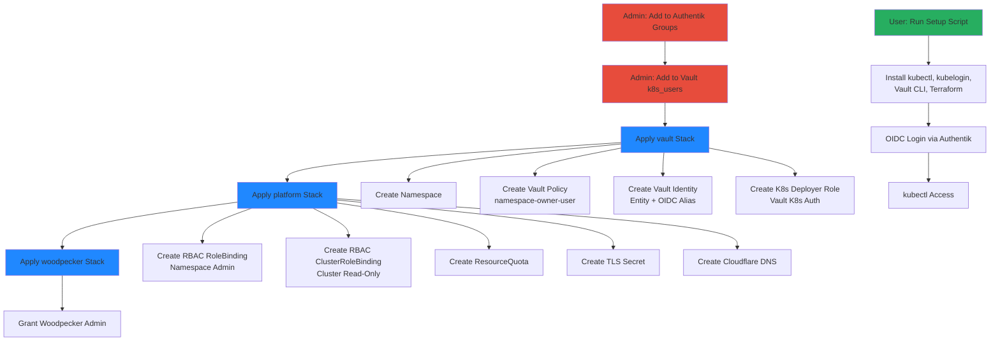

# Multi-Tenancy

## Overview

The cluster implements namespace-based multi-tenancy where each user receives their own Kubernetes namespace(s), RBAC roles, resource quotas, and CI/CD access. Onboarding is Vault-driven: add user metadata to `secret/platform → k8s_users`, apply Terraform stacks, and all resources (namespace, policies, RBAC, DNS, TLS) are auto-generated. Users access the cluster via OIDC authentication through Authentik and can self-service via k8s-portal.

## Architecture Diagram



## Components

| Component | Version | Location | Purpose |
|-----------|---------|----------|---------|
| Authentik | Latest | `authentik` namespace | OIDC provider for K8s + Vault |
| Vault | Latest | `vault` namespace | Identity source, policy engine |
| k8s-portal | SvelteKit | `k8s-portal.viktorbarzin.me` | Self-service onboarding UI |
| Terraform (vault stack) | - | `stacks/vault/` | Namespace, Vault resources |
| Terraform (platform stack) | - | `stacks/platform/` | RBAC, quotas, DNS, TLS |
| Terraform (woodpecker stack) | - | `stacks/woodpecker/` | CI/CD admin access |
| Headscale | Latest | `headscale` namespace | VPN mesh network (user access) |

## How It Works

### Namespace-Owner Model

Each user receives:
1. **Kubernetes Namespace(s)**: Isolated workload environment
2. **Vault Policy**: Read/write access to `secret/data/<namespace>/*`
3. **RBAC Role**: Namespace admin (full control within namespace)
4. **RBAC ClusterRole**: Cluster read-only (view cluster resources)
5. **ResourceQuota**: CPU, memory, storage limits
6. **TLS Secret**: Wildcard cert for `*.<namespace>.viktorbarzin.me`
7. **DNS Records**: Cloudflare A/CNAME for user domains
8. **Woodpecker Admin**: Access to create repos and pipelines

### Onboarding Flow (3 Steps, No Code Changes)

#### Step 1: Authentik

**Action**: Admin adds user to groups
- `kubernetes-namespace-owners`
- `Headscale Users`

**Result**: User can authenticate to Vault and K8s via OIDC

#### Step 2: Vault KV

**Action**: Admin adds JSON entry to `secret/platform → k8s_users`

**Example**:
```json
{
  "alice": {
    "role": "namespace-owner",
    "namespaces": ["alice-prod", "alice-dev"],
    "domains": ["alice.viktorbarzin.me", "app.alice.viktorbarzin.me"],
    "quota": {
      "cpu": "4",
      "memory": "8Gi",
      "storage": "20Gi"
    }
  }
}
```

**Fields**:
- `role`: Always `namespace-owner` for standard users
- `namespaces`: List of K8s namespaces to create
- `domains`: Cloudflare DNS records to create
- `quota`: Per-namespace resource limits

#### Step 3: Apply Terraform Stacks

**Order matters** (dependencies):

1. **vault stack**:
   ```bash
   cd stacks/vault
   terragrunt apply
   ```
   - Creates namespaces
   - Creates Vault policy `namespace-owner-alice`
   - Creates Vault identity entity + OIDC alias
   - Creates K8s deployer role for Woodpecker CI

2. **platform stack**:
   ```bash
   cd stacks/platform
   terragrunt apply
   ```
   - Creates RBAC RoleBinding (namespace admin)
   - Creates RBAC ClusterRoleBinding (cluster read-only)
   - Creates ResourceQuota
   - Creates TLS Secret (wildcard cert from Let's Encrypt)
   - Creates Cloudflare DNS A/CNAME records

3. **woodpecker stack**:
   ```bash
   cd stacks/woodpecker
   terragrunt apply
   ```
   - Grants Woodpecker admin access for user's Forgejo repos

### Auto-Generated Resources Per User

| Resource | Name Pattern | Purpose |
|----------|--------------|---------|
| Namespace | `<username>-prod`, `<username>-dev` | Workload isolation |
| Vault Policy | `namespace-owner-<username>` | Secret access control |
| Vault Identity Entity | `<username>` | OIDC identity mapping |
| Vault OIDC Alias | Authentik sub claim | Link OIDC to entity |
| Vault K8s Role | `<namespace>-deployer` | Woodpecker CI access |
| K8s Role | Auto-generated | Namespace admin permissions |
| RoleBinding | `<username>-admin` | Bind user to namespace admin |
| ClusterRoleBinding | `<username>-read-only` | Cluster-wide read access |
| ResourceQuota | `<namespace>-quota` | CPU/memory/storage limits |
| Secret | `tls-<namespace>` | Wildcard TLS cert |
| Cloudflare DNS | A/CNAME records | Domain routing |

### User Setup (Self-Service)

**k8s-portal**: `k8s-portal.viktorbarzin.me`
1. User logs in with Authentik
2. Downloads setup script
3. Runs script:
   ```bash
   curl https://k8s-portal.viktorbarzin.me/setup.sh | bash
   ```
4. Script installs:
   - `kubectl`
   - `kubelogin` (OIDC plugin)
   - `vault` CLI
   - `terraform`
   - `terragrunt`
5. User runs OIDC login:
   ```bash
   kubectl oidc-login setup \
     --oidc-issuer-url=https://auth.viktorbarzin.me/application/o/kubernetes/ \
     --oidc-client-id=kubernetes
   ```
6. User can now run `kubectl` commands

### RBAC Groups

| Group | ClusterRole | Scope | Members |
|-------|-------------|-------|---------|
| `kubernetes-admins` | `cluster-admin` | Full cluster access | Viktor |
| `kubernetes-power-users` | Custom | Elevated permissions | Senior users |
| `kubernetes-namespace-owners` | `namespace-admin` + `view` | Namespace admin + cluster read | All users |

### User CI/CD (Woodpecker)

**Flow**:
1. User creates repo in Forgejo
2. Forgejo username **must match** Vault `k8s_users` key (e.g., `alice`)
3. Woodpecker authenticates to Vault using K8s SA JWT
4. Vault issues namespace-scoped deployer token
5. Pipeline runs `kubectl` commands within user's namespace(s)

**Vault K8s Role** (auto-created per namespace):
```hcl
vault write auth/kubernetes/role/alice-prod-deployer \
  bound_service_account_names=woodpecker-deployer \
  bound_service_account_namespaces=woodpecker \
  policies=namespace-owner-alice \
  ttl=1h
```

**Pipeline Example**:
```yaml
steps:
  deploy:
    image: bitnami/kubectl:latest
    commands:
      - kubectl apply -f k8s/ -n alice-prod
    secrets: [k8s_token]
```

## Configuration

### Vault k8s_users Entry

**Path**: `secret/platform → k8s_users`

**Full Example**:
```json
{
  "alice": {
    "role": "namespace-owner",
    "namespaces": ["alice-prod", "alice-dev"],
    "domains": [
      "alice.viktorbarzin.me",
      "app.alice.viktorbarzin.me",
      "api.alice.viktorbarzin.me"
    ],
    "quota": {
      "cpu": "4",
      "memory": "8Gi",
      "storage": "20Gi",
      "pods": "20"
    }
  },
  "bob": {
    "role": "namespace-owner",
    "namespaces": ["bob-staging"],
    "domains": ["bob.viktorbarzin.me"],
    "quota": {
      "cpu": "2",
      "memory": "4Gi",
      "storage": "10Gi"
    }
  }
}
```

### Vault Policy Template

**Auto-generated per user**:

```hcl
# Policy: namespace-owner-alice
path "secret/data/alice-prod/*" {
  capabilities = ["create", "read", "update", "delete", "list"]
}

path "secret/data/alice-dev/*" {
  capabilities = ["create", "read", "update", "delete", "list"]
}

path "secret/metadata/alice-prod/*" {
  capabilities = ["list"]
}

path "secret/metadata/alice-dev/*" {
  capabilities = ["list"]
}
```

### ResourceQuota Example

```yaml
apiVersion: v1
kind: ResourceQuota
metadata:
  name: alice-prod-quota
  namespace: alice-prod
spec:
  hard:
    requests.cpu: "4"
    requests.memory: "8Gi"
    persistentvolumeclaims: "10"
    requests.storage: "20Gi"
    pods: "20"
```

### Factory Pattern for Multi-Instance Services

**Structure**:
```
stacks/
  actualbudget/
    main.tf         # Shared configuration
    factory/
      main.tf       # Per-user module
```

**main.tf** (service definition):
```hcl
# Shared NFS export, Cloudflare routes, etc.
```

**factory/main.tf** (per-user instance):
```hcl
module "alice" {
  source = "../"
  user   = "alice"
  domain = "budget.alice.viktorbarzin.me"
}

module "bob" {
  source = "../"
  user   = "bob"
  domain = "budget.bob.viktorbarzin.me"
}
```

**To add user**:
1. Export NFS share: `/mnt/data/<service>/<user>`
2. Add Cloudflare route: `<user>.<service>.viktorbarzin.me`
3. Add module block in `factory/main.tf`

**Examples**:
- `actualbudget`: Personal budgeting app
- `freedify`: Music streaming service

## Decisions & Rationale

### Why Namespace-Per-User?

**Alternatives considered**:
1. **Shared namespace**: No isolation, quota enforcement difficult
2. **Cluster-per-user**: Too expensive, management overhead
3. **Namespace-per-user (chosen)**: Balance isolation, quotas, RBAC

**Benefits**:
- Strong isolation (network policies, RBAC)
- Easy quota enforcement (ResourceQuota)
- Simple mental model (1 user = N namespaces)
- Scales to hundreds of users

### Why Vault-Driven Onboarding?

**Alternatives considered**:
1. **Manual YAML**: Error-prone, no audit trail
2. **CRD-based operator**: Complex, requires custom controller
3. **Vault + Terraform (chosen)**: Single source of truth, auditable

**Benefits**:
- Vault as identity source (integrates with OIDC)
- Terraform for declarative infrastructure
- Git-tracked changes (audit trail)
- Secrets rotation built-in

### Why Factory Pattern for Multi-Instance Apps?

**Alternatives considered**:
1. **Helm chart per user**: Duplication, drift risk
2. **Single shared instance**: No isolation, security risk
3. **Factory module (chosen)**: DRY, scalable

**Benefits**:
- No code duplication
- Easy to add users (one module block)
- Centralized updates (change `main.tf`, all instances update)

### Why OIDC Instead of Static Tokens?

**Alternatives considered**:
1. **Static ServiceAccount tokens**: Never expire, security risk
2. **X.509 client certs**: Complex rotation
3. **OIDC (chosen)**: Centralized auth, automatic rotation

**Benefits**:
- Tokens auto-expire (1h for deployer, 24h for user)
- Centralized user management (Authentik)
- Integrates with Vault identity engine
- Industry standard (OpenID Connect)

### Why ResourceQuota Over LimitRange?

- **ResourceQuota**: Total namespace consumption (e.g., max 8Gi memory)
- **LimitRange**: Per-pod limits (e.g., max 2Gi per pod)

**Choice**: ResourceQuota only
- Users manage their own pod limits
- Quota prevents runaway consumption
- Simpler mental model

## Troubleshooting

### User Can't Log In: "Unauthorized"

**Cause**: User not in Authentik `kubernetes-namespace-owners` group

**Fix**:
```bash
# Check user groups in Authentik UI
# Add to kubernetes-namespace-owners group
```

### User Has No Namespaces

**Cause**: `vault` stack not applied after adding to `k8s_users`

**Fix**:
```bash
cd stacks/vault
terragrunt apply
```

### User Can't Access Secrets in Vault

**Cause**: Vault policy not attached to identity entity

**Fix**:
```bash
# Check entity
vault read identity/entity/name/alice

# Check policy exists
vault policy read namespace-owner-alice

# Manually attach policy to entity
vault write identity/entity/name/alice policies=namespace-owner-alice
```

### Woodpecker Pipeline: "Forbidden"

**Cause**: Forgejo username doesn't match Vault `k8s_users` key

**Fix**:
```bash
# Rename Forgejo user to match Vault key
# OR update k8s_users key to match Forgejo username, then terragrunt apply
```

### ResourceQuota: "Forbidden: exceeded quota"

**Cause**: User exceeded namespace quota

**Fix**:
```bash
# Check quota usage
kubectl describe quota -n alice-prod

# User must delete resources or request quota increase
# To increase: update k8s_users in Vault, apply platform stack
```

### DNS Not Resolving

**Cause**: Cloudflare DNS not created by platform stack

**Fix**:
```bash
# Check domains in k8s_users
vault kv get secret/platform | jq -r '.data.data.k8s_users.alice.domains'

# Apply platform stack
cd stacks/platform
terragrunt apply

# Verify in Cloudflare dashboard
```

### TLS Secret Missing

**Cause**: cert-manager failed to issue certificate

**Fix**:
```bash
# Check cert-manager logs
kubectl logs -n cert-manager deploy/cert-manager

# Check Certificate resource
kubectl get certificate -n alice-prod

# Check CertificateRequest
kubectl describe certificaterequest -n alice-prod

# If Let's Encrypt rate limited, wait 1 week or use staging
```

### User Can't See Cluster Resources

**Cause**: ClusterRoleBinding not created

**Fix**:
```bash
# Check ClusterRoleBinding exists
kubectl get clusterrolebinding | grep alice

# Apply platform stack
cd stacks/platform
terragrunt apply
```

### Factory Pattern: New User Not Created

**Cause**: Module block not added to `factory/main.tf`

**Fix**:
```bash
# Edit factory/main.tf
cat >> stacks/actualbudget/factory/main.tf <<EOF
module "charlie" {
  source = "../"
  user   = "charlie"
  domain = "budget.charlie.viktorbarzin.me"
}
EOF

# Apply
cd stacks/actualbudget/factory
terragrunt apply
```

## Related

- [CI/CD Pipeline](./ci-cd.md) — Per-user Woodpecker pipelines
- [Databases](./databases.md) — Vault DB engine for per-user databases
- Runbook: `../runbooks/onboard-user.md` — Step-by-step onboarding guide
- Runbook: `../runbooks/offboard-user.md` — Remove user and resources
- k8s-portal documentation: Self-service UI
- Vault documentation: Identity secrets engine
