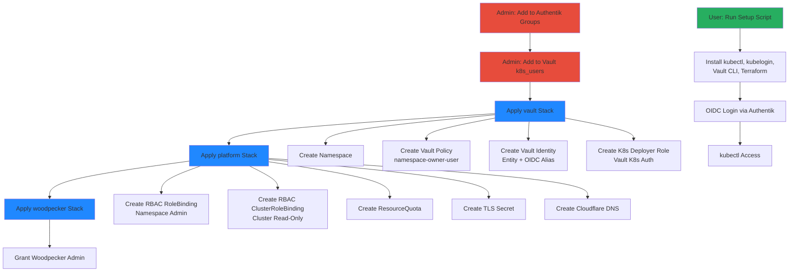

# Multi-Tenancy

## Overview

The cluster implements namespace-based multi-tenancy where each user receives their own Kubernetes namespace(s), RBAC roles, resource quotas, and CI/CD access. Onboarding is Vault-driven: add user metadata to `secret/platform → k8s_users`, apply Terraform stacks, and all resources (namespace, policies, RBAC, DNS, TLS) are auto-generated. Users access the cluster via OIDC authentication through Authentik and can self-service via k8s-portal.

## Architecture Diagram



## Components

| Component | Version | Location | Purpose |
|-----------|---------|----------|---------|
| Authentik | Latest | `authentik` namespace | OIDC provider for K8s + Vault |
| Vault | Latest | `vault` namespace | Identity source, policy engine |
| k8s-portal | SvelteKit | `k8s-portal.viktorbarzin.me` | Self-service onboarding UI |
| Terraform (vault stack) | - | `stacks/vault/` | Namespace, Vault resources |
| Terraform (platform stack) | - | `stacks/platform/` | RBAC, quotas, DNS, TLS |
| Terraform (woodpecker stack) | - | `stacks/woodpecker/` | CI/CD admin access |
| Headscale | Latest | `headscale` namespace | VPN mesh network (user access) |

## How It Works

### Namespace-Owner Model

Each user receives:
1. **Kubernetes Namespace(s)**: Isolated workload environment
2. **Vault Policy**: Read/write access to `secret/data/<namespace>/*`
3. **RBAC Role**: Namespace admin (full control within namespace)
4. **RBAC ClusterRole**: Cluster read-only (view cluster resources)
5. **ResourceQuota**: CPU, memory, storage limits
6. **TLS Secret**: Wildcard cert for `*.<namespace>.viktorbarzin.me`
7. **DNS Records**: Cloudflare A/CNAME for user domains
8. **Woodpecker Admin**: Access to create repos and pipelines

### Onboarding Flow (3 Steps, No Code Changes)

#### Step 1: Authentik

**Action**: Admin adds user to groups
- `kubernetes-namespace-owners`
- `Headscale Users`

**Result**: User can authenticate to Vault and K8s via OIDC

#### Step 2: Vault KV

**Action**: Admin adds JSON entry to `secret/platform → k8s_users`

**Example**:
```json
{
  "alice": {
    "role": "namespace-owner",
    "namespaces": ["alice-prod", "alice-dev"],
    "domains": ["alice.viktorbarzin.me", "app.alice.viktorbarzin.me"],
    "quota": {
      "cpu": "4",
      "memory": "8Gi",
      "storage": "20Gi"
    }
  }
}
```

**Fields**:
- `role`: Always `namespace-owner` for standard users
- `namespaces`: List of K8s namespaces to create
- `domains`: Cloudflare DNS records to create
- `quota`: Per-namespace resource limits

#### Step 3: Apply Terraform Stacks

**Order matters** (dependencies):

1. **vault stack**:
   ```bash
   cd stacks/vault
   terragrunt apply
   ```
   - Creates namespaces
   - Creates Vault policy `namespace-owner-alice`
   - Creates Vault identity entity + OIDC alias
   - Creates K8s deployer role for Woodpecker CI

2. **platform stack**:
   ```bash
   cd stacks/platform
   terragrunt apply
   ```
   - Creates RBAC RoleBinding (namespace admin)
   - Creates RBAC ClusterRoleBinding (cluster read-only)
   - Creates ResourceQuota
   - Creates TLS Secret (wildcard cert from Let's Encrypt)
   - Creates Cloudflare DNS A/CNAME records

3. **woodpecker stack**:
   ```bash
   cd stacks/woodpecker
   terragrunt apply
   ```
   - Grants Woodpecker admin access for user's Forgejo repos

### Auto-Generated Resources Per User

| Resource | Name Pattern | Purpose |
|----------|--------------|---------|
| Namespace | `<username>-prod`, `<username>-dev` | Workload isolation |
| Vault Policy | `namespace-owner-<username>` | Secret access control |
| Vault Identity Entity | `<username>` | OIDC identity mapping |
| Vault OIDC Alias | Authentik sub claim | Link OIDC to entity |
| Vault K8s Role | `<namespace>-deployer` | Woodpecker CI access |
| K8s Role | Auto-generated | Namespace admin permissions |
| RoleBinding | `<username>-admin` | Bind user to namespace admin |
| ClusterRoleBinding | `<username>-read-only` | Cluster-wide read access |
| ResourceQuota | `<namespace>-quota` | CPU/memory/storage limits |
| Secret | `tls-<namespace>` | Wildcard TLS cert |
| Cloudflare DNS | A/CNAME records | Domain routing |

### User Setup (Self-Service)

**k8s-portal**: `k8s-portal.viktorbarzin.me`
1. User logs in with Authentik
2. Downloads setup script
3. Runs script:
   ```bash
   curl https://k8s-portal.viktorbarzin.me/setup.sh | bash
   ```
4. Script installs:
   - `kubectl`
   - `kubelogin` (OIDC plugin)
   - `vault` CLI
   - `terraform`
   - `terragrunt`
5. User runs OIDC login:
   ```bash
   kubectl oidc-login setup \
     --oidc-issuer-url=https://auth.viktorbarzin.me/application/o/kubernetes/ \
     --oidc-client-id=kubernetes
   ```
6. User can now run `kubectl` commands

### Web Dashboard (auto-login, no token paste)

Namespace-owners just log into `https://k8s.viktorbarzin.me` with their Authentik
account and land straight in the dashboard scoped to their namespace — **no token
to paste**. A token-injector (`stacks/k8s-dashboard/dashboard_injector.tf`) maps
their Authentik identity (`X-authentik-username`) to their `dashboard-<user>` SA
token (`admin` on their namespace + read-only on the namespace list & nodes
only — they can't read other tenants' resources) and injects it as
`Authorization: Bearer`. Forward-auth admits the `kubernetes-*` groups for this
host (`stacks/authentik/admin-services-restriction.tf`).

> **Why not seamless OIDC SSO:** the intended oauth2-proxy OIDC path is built but
> blocked — the apiserver rejects all Authentik OIDC tokens. The injector uses SA
> tokens (which the apiserver accepts) keyed off the forward-auth identity. See
> `docs/architecture/authentication.md` and
> `docs/plans/2026-06-04-k8s-dashboard-sso-design.md` §12.

### RBAC Groups

| Group | ClusterRole | Scope | Members |
|-------|-------------|-------|---------|
| `kubernetes-admins` | `cluster-admin` | Full cluster access | Viktor |
| `kubernetes-power-users` | Custom | Elevated permissions | Senior users |
| `kubernetes-namespace-owners` | `namespace-admin` + `view` | Namespace admin + cluster read | All users |

### User CI/CD (Woodpecker)

**Flow**:
1. User creates repo in Forgejo
2. Forgejo username **must match** Vault `k8s_users` key (e.g., `alice`)
3. Woodpecker authenticates to Vault using K8s SA JWT
4. Vault issues namespace-scoped deployer token
5. Pipeline runs `kubectl` commands within user's namespace(s)

**Vault K8s Role** (auto-created per namespace):
```hcl
vault write auth/kubernetes/role/alice-prod-deployer \
  bound_service_account_names=woodpecker-deployer \
  bound_service_account_namespaces=woodpecker \
  policies=namespace-owner-alice \
  ttl=1h
```

**Pipeline Example**:
```yaml
steps:
  deploy:
    image: bitnami/kubectl:latest
    commands:
      - kubectl apply -f k8s/ -n alice-prod
    secrets: [k8s_token]
```

## Configuration

### Vault k8s_users Entry

**Path**: `secret/platform → k8s_users`

**Full Example**:
```json
{
  "alice": {
    "role": "namespace-owner",
    "namespaces": ["alice-prod", "alice-dev"],
    "domains": [
      "alice.viktorbarzin.me",
      "app.alice.viktorbarzin.me",
      "api.alice.viktorbarzin.me"
    ],
    "quota": {
      "cpu": "4",
      "memory": "8Gi",
      "storage": "20Gi",
      "pods": "20"
    }
  },
  "bob": {
    "role": "namespace-owner",
    "namespaces": ["bob-staging"],
    "domains": ["bob.viktorbarzin.me"],
    "quota": {
      "cpu": "2",
      "memory": "4Gi",
      "storage": "10Gi"
    }
  }
}
```

### Vault Policy Template

**Auto-generated per user**:

```hcl
# Policy: namespace-owner-alice
path "secret/data/alice-prod/*" {
  capabilities = ["create", "read", "update", "delete", "list"]
}

path "secret/data/alice-dev/*" {
  capabilities = ["create", "read", "update", "delete", "list"]
}

path "secret/metadata/alice-prod/*" {
  capabilities = ["list"]
}

path "secret/metadata/alice-dev/*" {
  capabilities = ["list"]
}
```

### ResourceQuota Example

```yaml
apiVersion: v1
kind: ResourceQuota
metadata:
  name: alice-prod-quota
  namespace: alice-prod
spec:
  hard:
    requests.cpu: "4"
    requests.memory: "8Gi"
    persistentvolumeclaims: "10"
    requests.storage: "20Gi"
    pods: "20"
```

### Factory Pattern for Multi-Instance Services

**Structure**:
```
stacks/
  actualbudget/
    main.tf         # Shared configuration
    factory/
      main.tf       # Per-user module
```

**main.tf** (service definition):
```hcl
# Shared NFS export, Cloudflare routes, etc.
```

**factory/main.tf** (per-user instance):
```hcl
module "alice" {
  source = "../"
  user   = "alice"
  domain = "budget.alice.viktorbarzin.me"
}

module "bob" {
  source = "../"
  user   = "bob"
  domain = "budget.bob.viktorbarzin.me"
}
```

**To add user**:
1. Export NFS share: `/mnt/data/<service>/<user>`
2. Add Cloudflare route: `<user>.<service>.viktorbarzin.me`
3. Add module block in `factory/main.tf`

**Examples**:
- `actualbudget`: Personal budgeting app
- `freedify`: Music streaming service

## Decisions & Rationale

### Why Namespace-Per-User?

**Alternatives considered**:
1. **Shared namespace**: No isolation, quota enforcement difficult
2. **Cluster-per-user**: Too expensive, management overhead
3. **Namespace-per-user (chosen)**: Balance isolation, quotas, RBAC

**Benefits**:
- Strong isolation (network policies, RBAC)
- Easy quota enforcement (ResourceQuota)
- Simple mental model (1 user = N namespaces)
- Scales to hundreds of users

### Why Vault-Driven Onboarding?

**Alternatives considered**:
1. **Manual YAML**: Error-prone, no audit trail
2. **CRD-based operator**: Complex, requires custom controller
3. **Vault + Terraform (chosen)**: Single source of truth, auditable

**Benefits**:
- Vault as identity source (integrates with OIDC)
- Terraform for declarative infrastructure
- Git-tracked changes (audit trail)
- Secrets rotation built-in

### Why Factory Pattern for Multi-Instance Apps?

**Alternatives considered**:
1. **Helm chart per user**: Duplication, drift risk
2. **Single shared instance**: No isolation, security risk
3. **Factory module (chosen)**: DRY, scalable

**Benefits**:
- No code duplication
- Easy to add users (one module block)
- Centralized updates (change `main.tf`, all instances update)

### Why OIDC Instead of Static Tokens?

**Alternatives considered**:
1. **Static ServiceAccount tokens**: Never expire, security risk
2. **X.509 client certs**: Complex rotation
3. **OIDC (chosen)**: Centralized auth, automatic rotation

**Benefits**:
- Tokens auto-expire (1h for deployer, 24h for user)
- Centralized user management (Authentik)
- Integrates with Vault identity engine
- Industry standard (OpenID Connect)

### Why ResourceQuota Over LimitRange?

- **ResourceQuota**: Total namespace consumption (e.g., max 8Gi memory)
- **LimitRange**: Per-pod limits (e.g., max 2Gi per pod)

**Choice**: ResourceQuota only
- Users manage their own pod limits
- Quota prevents runaway consumption
- Simpler mental model

## Troubleshooting

### User Can't Log In: "Unauthorized"

**Cause**: User not in Authentik `kubernetes-namespace-owners` group

**Fix**:
```bash
# Check user groups in Authentik UI
# Add to kubernetes-namespace-owners group
```

### User Has No Namespaces

**Cause**: `vault` stack not applied after adding to `k8s_users`

**Fix**:
```bash
cd stacks/vault
terragrunt apply
```

### User Can't Access Secrets in Vault

**Cause**: Vault policy not attached to identity entity

**Fix**:
```bash
# Check entity
vault read identity/entity/name/alice

# Check policy exists
vault policy read namespace-owner-alice

# Manually attach policy to entity
vault write identity/entity/name/alice policies=namespace-owner-alice
```

### Woodpecker Pipeline: "Forbidden"

**Cause**: Forgejo username doesn't match Vault `k8s_users` key

**Fix**:
```bash
# Rename Forgejo user to match Vault key
# OR update k8s_users key to match Forgejo username, then terragrunt apply
```

### ResourceQuota: "Forbidden: exceeded quota"

**Cause**: User exceeded namespace quota

**Fix**:
```bash
# Check quota usage
kubectl describe quota -n alice-prod

# User must delete resources or request quota increase
# To increase: update k8s_users in Vault, apply platform stack
```

### DNS Not Resolving

**Cause**: Cloudflare DNS not created by platform stack

**Fix**:
```bash
# Check domains in k8s_users
vault kv get secret/platform | jq -r '.data.data.k8s_users.alice.domains'

# Apply platform stack
cd stacks/platform
terragrunt apply

# Verify in Cloudflare dashboard
```

### TLS Secret Missing

**Cause**: cert-manager failed to issue certificate

**Fix**:
```bash
# Check cert-manager logs
kubectl logs -n cert-manager deploy/cert-manager

# Check Certificate resource
kubectl get certificate -n alice-prod

# Check CertificateRequest
kubectl describe certificaterequest -n alice-prod

# If Let's Encrypt rate limited, wait 1 week or use staging
```

### User Can't See Cluster Resources

**Cause**: ClusterRoleBinding not created

**Fix**:
```bash
# Check ClusterRoleBinding exists
kubectl get clusterrolebinding | grep alice

# Apply platform stack
cd stacks/platform
terragrunt apply
```

### Factory Pattern: New User Not Created

**Cause**: Module block not added to `factory/main.tf`

**Fix**:
```bash
# Edit factory/main.tf
cat >> stacks/actualbudget/factory/main.tf <<EOF
module "charlie" {
  source = "../"
  user   = "charlie"
  domain = "budget.charlie.viktorbarzin.me"
}
EOF

# Apply
cd stacks/actualbudget/factory
terragrunt apply
```

## DevVM Workstation (Claude Code multi-user)

Separate from the in-cluster namespace-owner model above, the **devvm** (`10.0.10.10`, VMID 102) hosts per-user **Claude Code Workstations** behind `t3.viktorbarzin.me`. It reuses the same identity backbone — the Vault `k8s_users` map and Authentik — but adds a devvm-side layer. Authoritative design + phased plan: `docs/plans/2026-06-07-multi-user-workstation-{design,plan}.md` (PRD: ViktorBarzin/infra#9).

**Single source of truth:** `infra/scripts/workstation/roster.yaml` (`os_user → authentik_user / k8s_user / tier / namespaces`). `roster_engine.py` (pytest-covered pure core) derives desired state; `t3-provision-users` (hourly timer) applies it — **additive-only** for existing users (never strips a group, replaces a home, or re-locks an account). `/etc/ttyd-user-map` + `dispatch.json` are **generated** from the roster (do not hand-edit).

**RBAC tiers:** `admin` (Viktor — cluster-admin, unlocked tree, secrets) · `power-user` (cluster-wide read-only, NO Secrets, via a dedicated `oidc-power-user-readonly` ClusterRole) · `namespace-owner` (admin in own namespace only). Each session acts as the user's **own** OIDC identity (kubelogin), never the admin's.

**Config inheritance (live):** wizard authors the base (his chezmoi-versioned `~/.claude`). Two native layers carry it to every user — the enforced org `claudeMd` in `/etc/claude-code/managed-settings.json` (top precedence, all sessions) and per-user `~/.claude/{skills,rules,…}` **symlinks** to the base (seeded via `/etc/skel`; edits propagate live). Secrets stay per-user at mode 600, never symlinked. **The managed config self-deploys from the repo** (2026-06-10): the hourly reconcile's `sync_managed_config` installs `scripts/workstation/managed-settings.json` to `/etc/claude-code/` whenever the repo copy changes — so editing the claudeMd = edit + commit, no manual install — and `refresh_codex_mirror` regenerates each user's `~/.codex/AGENTS.md` (a static mirror of the claudeMd; only files carrying the mirror header are touched, user-customized ones are left alone). Repo-level guidance (`.claude/CLAUDE.md`, `AGENTS.md`, `CONTEXT.md` in the infra repo) reaches non-admins through their auto-freshened clones — commit + push and every user has it within the hour.

**Memory — homelab CLI hooks (rolled out 2026-06-21, deploy-fixed 2026-06-22):** the per-user `claude_memory` MCP was retired for the **homelab-memory hooks** — the reconcile's `install_memory` (re)installs four scripts into `~/.claude/hooks/` each run (`homelab-memory-recall.py` UserPromptSubmit recall, `auto-learn.py` Stop-hook extraction, `pre-compact-backup.sh`/`post-compact-recovery.sh`), wires them into `settings.json` if-absent + additive, and removes the old `claude_memory` MCP. **The provisioner binary itself now self-deploys from the repo** (step 0: `bash -n`-gated `install` + re-exec when `scripts/t3-provision-users.sh` differs from `/usr/local/bin/t3-provision-users`, guarded against re-exec loops / DRY_RUN mutation) — added after this very rollout sat committed-but-undeployed for a day (only the manual `setup-devvm.sh` had ever deployed the binary), so the hourly reconcile kept running the pre-memory version and emo/anca silently lost memory (recall + auto-learn never wired). A latent `set -e` abort in `install_memory` (a bare `[[ -d plugin-dir ]] && …` returning non-zero) was also fixed; it had killed the reconcile after the first user the first time it actually ran. The hooks need a `MEMORY_API_KEY` (or `CLAUDE_MEMORY_API_KEY`) in the user's `settings.json` env — the `homelab` CLI defaults the API URL, so **the key is the only hard requirement**; `install_memory` reuses an existing key and only WARNs if absent (it does NOT mint one — that's an admin Vault step, see Remaining). wizard + emo carry a key from their original MCP setup; **ancamilea is keyless → her memory no-ops until a key is minted.** (`auto-learn.py`'s passive store calls the API directly, so it additionally needs `*_API_URL` in env to avoid its local-SQLite fallback; recall + manual `homelab memory store` go through the URL-defaulting CLI and need only the key.)

**Onboarding state self-heals (2026-06-15):** `~/.claude.json` is a single file that ALL of a user's concurrent `claude` processes (the ttyd terminal + their `t3-serve` instance + agent/SDK sessions) read-modify-write, so a stale writer periodically drops top-level keys — including `hasCompletedOnboarding` — which bounces the next *interactive* session back to the first-run "Choose the text style" wizard even though the user is fully logged in (credentials live in the SEPARATE `~/.claude/.credentials.json`, untouched by the race; first observed for emo 2026-06-15). The launcher (`skel/start-claude.sh`) now idempotently re-asserts `hasCompletedOnboarding` (+ `lastOnboardingVersion`) in `~/.claude.json` right before it runs `claude` — merge-only, never clobbers other keys, no-op if jq is missing or the file is empty/corrupt. And since the launcher is a per-user copy that `/etc/skel` only seeds at account creation, the reconcile's new `deploy_user_launcher` step re-copies `skel/start-claude.sh` into every non-admin home (copy-if-changed) so launcher edits now reach EXISTING users within the hour — `.tmux.conf` is deliberately NOT re-copied (terminal-lobby appends its own managed section to it).

**Claude Code runtime — native, per-user (2026-06-15):** `claude` is the **native** install (`~/.local/bin/claude` → `~/.local/share/claude/versions/<v>`, self-updating; `installMethod: native`) — NOT npm-global or npx. It is the runtime for both the ttyd launcher and each `t3-serve` instance. `setup-devvm.sh` installs node ONLY for the `t3` CLI (not claude); per-user native claude is provisioned by the reconcile's `install_user_claude_native` (covers terminal + t3, idempotent, skip-if-present) and self-bootstrapped by `start-claude.sh` on first launch — both via the official `https://claude.ai/install.sh`. The legacy machine-wide `npm install -g @anthropic-ai/claude-code` bootstrap and the launcher's `npx` fallback were removed; existing users had already auto-migrated to native, and the npm-global dir was empty. **PATH (`~/.local/bin`, where the native binary lives):** ensured three ways — `/etc/profile.d/10-local-bin.sh` for login shells (machine-wide, fresh-user-safe), `start-claude.sh` itself (the launcher runs in tmux's non-login env that skips the user's shell rc), and `t3-serve@.service` (`Environment=PATH=…:/home/%i/.local/bin`).

**Claude authentication — per-user, self-renewing, Vault-recoverable (2026-06-20):** every roster user logs in with their OWN Enterprise identity; shared `CLAUDE_CODE_OAUTH_TOKEN` injection was removed because environment auth outranks local login and collapses identity/audit/quota. Claude owns access-token refresh in `~/.claude/.credentials.json`. A system template timer (`claude-auth-sync@<user>.timer`, every 6h) renews a dedicated 32-day periodic Vault token, validates Claude with real non-persistent Haiku inference (`auth status` can lie during a 401), backs up only `claudeAiOauth` to `secret/workstation/claude-users/<os_user>`, and performs one atomic Vault restore/retry on failure while preserving `mcpOAuth`. Vault policy `workstation-claude-<os_user>` isolates every path; the roster generates policies for present and future users. A hard refresh-token revocation still requires the affected person to complete SSO—there is no supported noninteractive bypass. Loki alert `WorkstationClaudeAuthInvalid` surfaces exhausted recovery. Runbook: `../runbooks/claude-auth-renew-workstation.md`.

**Per-user browser MCP — playwright, reproducible from git (2026-06-16):** every user (incl. the admin) gets their OWN isolated `@playwright/mcp` server so their concurrent Claude sessions don't fight over tabs (`--isolated` → a fresh browser context per MCP connection), wired into Claude in **every directory** via a user-scope `~/.claude.json` entry (`playwright → http://localhost:<PLAYWRIGHT_PORT>/mcp`). Mechanism: **system-level template units** `playwright-mcp@<user>.service` + `playwright-snapshot-refresh@<user>.{service,timer}` (`User=%i`, sourced from `scripts/workstation/playwright/`, installed by `setup-devvm.sh` §9e — system manager, so NO systemd --user / linger). `roster_engine.py` allocates a sticky per-user `PLAYWRIGHT_PORT` (`PLAYWRIGHT_BASE_PORT=8931`); the reconcile's `install_playwright()` writes it, seeds the chrome-service snapshot token if-absent (staged from Vault `secret/chrome-service` to `/etc/t3-serve/chrome-service-token` by `setup-devvm.sh` §8c, since the hourly root reconcile has no Vault token), wires `~/.claude.json` by running `claude mcp add --scope user` AS the user (clobber-proof + if-absent, so it fixes existing/new/admin without rewriting a populated config), and `enable --now`s the instances (idempotent — never restarts a running server). The `@playwright/mcp` version is **pinned** in the unit (the `@latest`-silently-rolls-the-fleet footgun — see `T3_PIN`). Replaced the earlier hand-made `~/.config/systemd/user/playwright-*` units (one-time idle-gated migration; pre-migration emo/anca had servers running but never wired into their `.claude.json`). Cookie-warming pipeline + ops: `../runbooks/chrome-service-snapshot.md`.

**Infra access:** non-admins get their own **writable, git-crypt-LOCKED** clone of the (public) infra repo — code/docs plaintext, secret files (`*.tfvars`, `secrets/**`) stay ciphertext. Its location depends on the per-user `code_layout` in `roster.yaml`: `single` (default) puts the clone AT `~/code`; `workspace` makes `~/code` a plain directory of per-project clones — the infra clone at `~/code/infra` plus each roster `repos` entry cloned from Forgejo `viktor/<name>` **as the user** (their PAT authenticates, so private repos work; clone failures WARN and retry next hour). Flipping a user to `workspace` auto-migrates their existing `~/code` clone to `~/code/infra` (local branches/dirty state survive; running processes follow the moved inode). ancamilea = workspace + `tripit` since 2026-06-10. The provisioner clones infra anonymously from the public GitHub mirror; **contribute access is wired per-user on top** (see below). The apply boundary still holds (`scripts/tg apply` needs an admin Vault token + cluster RBAC), but **pushing `master` is NOT inert** — the Forgejo→Woodpecker webhook fires `.woodpecker/default.yml` (`event: push, branch: master`, `require_approval: forks` only), which terragrunt-applies changed stacks. `master` is **branch-protected on Forgejo** (force-push disabled for everyone — history is append-only; push + merge whitelists = `viktor` + explicitly granted users, deploy keys allowed). **Allow-then-audit (Viktor, 2026-06-10):** `ebarzin` (emo) is on the whitelist and pushes straight to `master` — no PR gate. The tracking burden moves to: (a) **commit messages that record what + why** (the agent instructions in AGENTS.md and the managed claudeMd require the body to paraphrase the user's request), (b) the **`notify-nonadmin-push` Slack audit step** in `.woodpecker/default.yml` — every master push by a non-admin author is posted to Slack (admin pushes are not), and (c) non-admins **never use `[ci skip]`** so every change fires the pipeline (and thus the audit feed). Users NOT on the whitelist fall back to `<user>/<topic>` branches + PRs. **Clones stay fresh automatically** (2026-06-10): the hourly `t3-provision-users` reconcile runs `refresh_user_clone` over every managed clone — the infra clone and any workspace repos (fetch all remotes + fast-forward `master`, ONLY when on master with a clean tree and an upstream — dirty trees and local commits are left alone with a WARN) — and also `wire_forgejo_remote`, which idempotently adds the documented `forgejo` remote + `forgejo/master` upstream to infra clones that predate that contract. `start-claude.sh` does the same freshen at session launch (10s fetch cap per repo so an offline remote never stalls the session; workspace layouts freshen each repo under `~/code`).

**Contribute access (per non-admin, manual — the anca/tripit PAT precedent):**
1. Add their Forgejo user as a **write** collaborator on `viktor/infra` (`PUT /api/v1/repos/viktor/infra/collaborators/<login>`).
2. Mint a PAT — the admin REST endpoint 404s here, use the in-pod CLI: `kubectl -n forgejo exec deploy/forgejo -- su -s /bin/sh git -c "forgejo admin user generate-access-token --username <login> --token-name devvm-infra-git --scopes 'write:repository'"`.
3. Install it in their `~/.git-credentials` (`https://<login>:<token>@forgejo.viktorbarzin.me`, mode 600) + `git config --global credential.helper store`, set `user.name`/`user.email`.
4. The reconcile wires the clone side automatically (`wire_forgejo_remote`): `forgejo` remote + `master` tracking `forgejo/master` on every non-admin infra clone (origin stays the anonymous GitHub mirror). No manual step since 2026-06-10.
5. (Optional — Viktor's call per user) Grant direct master push: add their login to the `master` branch-protection push + merge whitelists (`PATCH /api/v1/repos/viktor/infra/branch_protections/master`). Done for `ebarzin` 2026-06-10.
6. Verify: branch push succeeds; a `master` push succeeds for whitelisted users and is rejected with `Not allowed to push to protected branch` otherwise.

**Web-terminal session persistence (2026-06-10):** the tmux-based web terminal's named sessions (each running one Claude conversation) survive devvm reboots — `tmux-persist-save.timer` (5-min) snapshots every terminal user's sessions (name, cwd, conversation uuid from argv or the cwd-slug transcript dir) to `/var/lib/tmux-persist/<user>.tsv`, and `tmux-persist-restore.service` recreates missing sessions at boot with `claude --resume <uuid>` (per-session idempotent; also handles partial loss). The web terminal also exposes an **on-demand "Restore sessions" button** (terminal-lobby: `tmux-api` `POST /restore` → the validated root `tmux-restore-user` wrapper → `tmux-persist restore <user>`, a single-user mode of the same script): the boot-only restore service never fires when an **OOM kills a user's tmux server *without* a reboot** (the common case under multi-user memory pressure), so the button covers that gap. This is a **tmux/terminal-surface** feature, deliberately outside the t3 namespace: the t3 chat surface persists its own threads (`~/.t3` state, plus the daily `t3-backup-state` dump), and Claude conversations themselves were always durable (`~/.claude/projects/`) — what this adds is the volatile tmux wiring.

**Status (2026-06-20):** built + verified on the live host — capacity (8 GiB swap), config inheritance, roster-driven provisioner, per-user locked clone, per-user OIDC kubeconfig + the `oidc-power-user-readonly` ClusterRole + emo's `k8s_users` entry (applied + impersonation-verified), the Authentik `T3 Users` edge gate, **the emo Phase-5 cutover (own clone + launcher repoint + `code-shared` removal, completed 2026-06-10) and emo's contribute access (`ebarzin` write collaborator + PAT + protected `master`)**, **per-user `code_layout` with the ancamilea workspace cutover**, per-user playwright browser MCP, and per-user Claude OAuth renewal/Vault recovery. Per the live `/etc/skel` design, non-admin `~/.claude/{rules,skills}` symlinks into the admin base are **kept**. **Remaining (held / future):** the offboarding apply-side (Phase 7), per-user `ha`/`claude_memory`/beads credential injection, and roster-reconciled `T3 Users` membership. See `../runbooks/offboard-user.md` for deprovisioning.

## Related

- [CI/CD Pipeline](./ci-cd.md) — Per-user Woodpecker pipelines
- [Databases](./databases.md) — Vault DB engine for per-user databases
- Runbook: `../runbooks/onboard-user.md` — Step-by-step onboarding guide
- Runbook: `../runbooks/offboard-user.md` — Remove user and resources
- k8s-portal documentation: Self-service UI
- Vault documentation: Identity secrets engine
