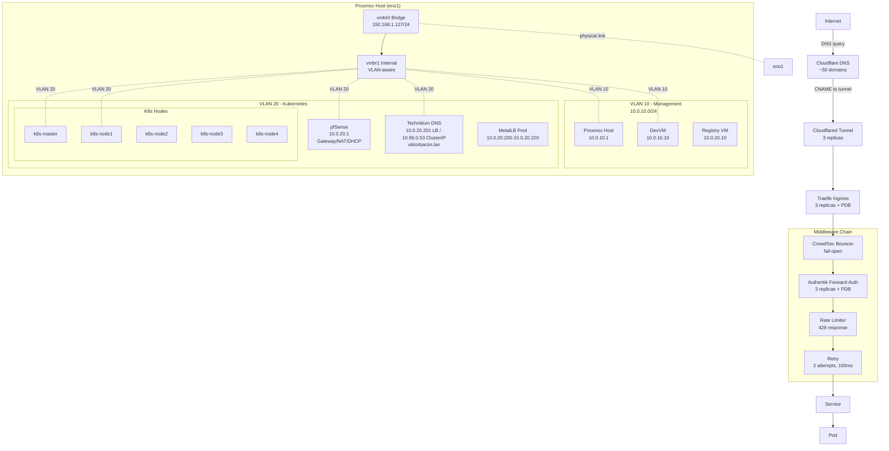
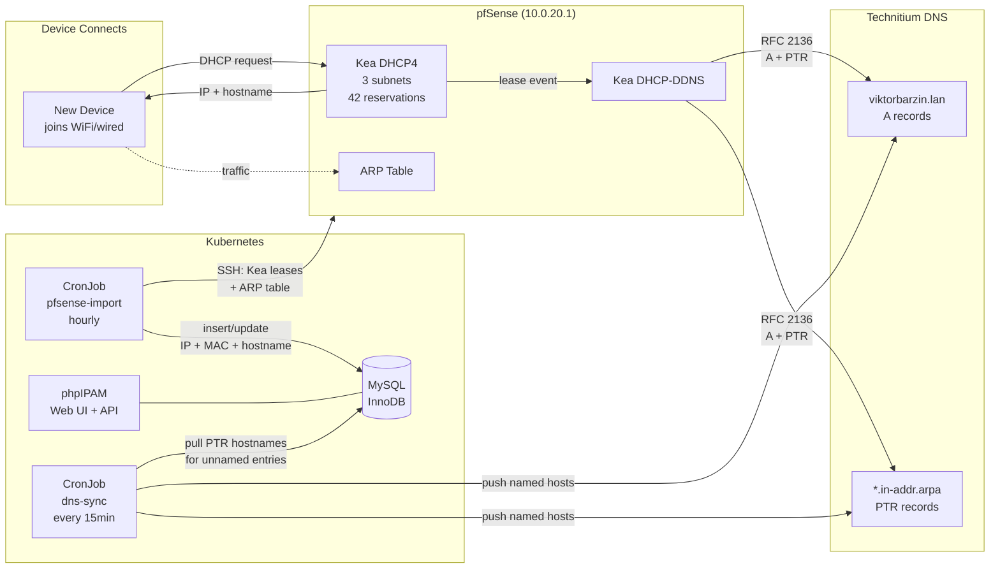
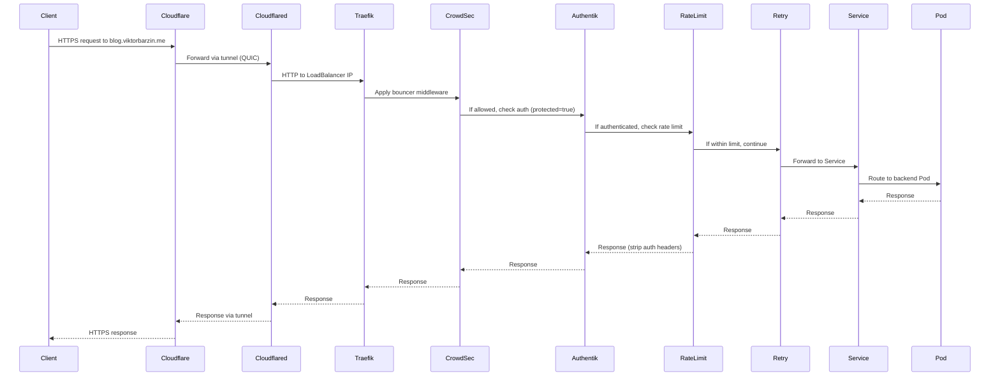

# Networking Architecture

Last updated: 2026-04-19 (WS E — Kea DHCP pushes dual DNS per subnet; Kea DDNS TSIG-signed)

## Overview

The homelab network is built on a dual-VLAN architecture with pfSense providing gateway services, Technitium for internal DNS, and Cloudflare for external DNS. Traefik serves as the Kubernetes ingress controller with a comprehensive middleware chain including CrowdSec bot protection, Authentik forward-auth, and rate limiting. All HTTP traffic flows through Cloudflared tunnels, avoiding the need for port forwarding or exposing public IPs.

## Architecture Diagram

## Components

| Component | Version/Type | Location | Purpose |
|-----------|-------------|----------|---------|
| pfSense | 2.7.x | 10.0.20.1 | Gateway, NAT, firewall, Kea DHCP for all subnets, Kea DDNS |
| phpIPAM | v1.7.0 | phpipam.viktorbarzin.me | IP address management, device inventory, DNS sync |
| vmbr0 | Linux bridge | 192.168.1.127/24 | Physical bridge on eno1, uplink to LAN |
| vmbr1 | Linux bridge (VLAN-aware) | Internal | VLAN trunk for VM isolation |
| Technitium DNS | Container | 10.0.20.201 (LB) / 10.96.0.53 (ClusterIP) | Internal DNS (viktorbarzin.lan) + full recursive resolver |
| Cloudflare DNS | SaaS | External | ~50 public domains under viktorbarzin.me |
| Cloudflared | Container | K8s (3 replicas) | Tunnel ingress, replaces port forwarding |
| Traefik | Helm chart | K8s (3 replicas + PDB) | Ingress controller, HTTP/3 enabled |
| CrowdSec | Helm chart | K8s (LAPI: 3 replicas) | Bot protection, fail-open bouncer |
| Authentik | Helm chart | K8s (3 replicas + PDB) | SSO, forward-auth middleware |
| MetalLB | v0.15.3 Helm chart | K8s | LoadBalancer IPs (10.0.20.200-10.0.20.220), all services on 10.0.20.200 |
| Registry Cache | Container | 10.0.20.10 | Pull-through for docker.io:5000, ghcr.io:5010 |

## IPAM & DNS Auto-Registration

Devices are automatically discovered, named, and registered in DNS without manual intervention.

### Data Flow

| Step | Trigger | Source | Destination | Data | Latency |
|------|---------|--------|-------------|------|---------|
| 1. DHCP lease | Device connects | Kea DHCP4 | Device | IP + gateway + DNS | Immediate |
| 2. DNS registration | Lease granted | Kea DDNS | Technitium | A + PTR records | Immediate |
| 3. Device import | CronJob (5min) | Kea leases + ARP | phpIPAM MySQL | IP + MAC + hostname | ≤5 min |
| 4. DNS sync (push) | CronJob (15min) | phpIPAM MySQL | Technitium | A + PTR for named hosts | ≤15 min |
| 5. DNS sync (pull) | CronJob (15min) | Technitium PTR | phpIPAM MySQL | Hostname for unnamed entries | ≤15 min |

### DHCP Coverage

| Subnet | DHCP Server | DNS option 6 | Reservations | DDNS | Notes |
|--------|------------|--------------|--------------|------|-------|
| 10.0.10.0/24 (Mgmt) | Kea on pfSense | `10.0.10.1, 94.140.14.14` | 3 (devvm, pxe, ha) | Yes (TSIG) | VMs with static MACs |
| 10.0.20.0/24 (K8s) | Kea on pfSense | `10.0.20.1, 94.140.14.14` | 7 (master, nodes 1-5, registry) | Yes (TSIG) | K8s cluster nodes |
| 192.168.1.0/24 (LAN) | **TP-Link AP** | `192.168.1.2, 94.140.14.14` | 42 (all home devices) | Yes | pfSense Kea WAN is disabled |
| 10.3.2.0/24 (VPN) | Static | — | — | No | WireGuard peers |
| 192.168.0.0/24 (Valchedrym) | OpenWRT | — | — | No | Remote site |
| 192.168.8.0/24 (London) | GL-iNet | — | — | No | Remote site |

## How It Works

### VLAN Segmentation

The Proxmox host uses a dual-bridge architecture:
- **vmbr0**: Physical bridge on interface `eno1`, connected to upstream LAN (192.168.1.0/24). Proxmox management IP is 192.168.1.127.
- **vmbr1**: Internal VLAN-aware bridge, acts as a trunk carrying:
  - **VLAN 10 (Management)**: 10.0.10.0/24 — Proxmox, DevVM
  - **VLAN 20 (Kubernetes)**: 10.0.20.0/24 — All K8s nodes, services, MetalLB IPs

VMs tag traffic on vmbr1 to isolate workloads. pfSense bridges VLAN 20 to the upstream LAN via NAT.

### DNS Resolution

**Internal (Technitium)**:
- K8s LoadBalancer at **10.0.20.201** (dedicated MetalLB IP), ClusterIP at **10.96.0.53**
- Serves `.viktorbarzin.lan` zone with 30+ internal A/CNAME records
- Also acts as full recursive resolver for public domains
- `externalTrafficPolicy: Local` preserves client source IPs for query logging
- HA: primary + secondary + tertiary pods with anti-affinity, PDB minAvailable=2

**LAN client DNS path (192.168.1.0/24)**:
- TP-Link DHCP gives DNS=192.168.1.2 (pfSense WAN)
- pfSense NAT redirect (`rdr`) forwards UDP 53 on WAN directly to Technitium (10.0.20.201)
- Client source IPs are preserved (no SNAT on 192.168.1.x → 10.0.20.x path)
- Technitium logs show real per-device IPs for analytics

**Split Horizon / Hairpin NAT fix (192.168.1.0/24 → *.viktorbarzin.me)**:
- TP-Link router does NOT support hairpin NAT — LAN clients can't reach the public IP (176.12.22.76) for non-proxied domains
- Technitium's Split Horizon `AddressTranslation` post-processor translates `176.12.22.76 → 10.0.20.200` (Traefik LB) in DNS responses for 192.168.1.0/24 clients
- DNS Rebinding Protection has `viktorbarzin.me` in `privateDomains` to allow the translated private IP
- Only affects non-proxied domains (ha-sofia, immich, headscale, etc.) — Cloudflare-proxied domains resolve to Cloudflare IPs and are unaffected
- Other clients (10.0.x.x, K8s pods) are NOT translated — they reach the public IP via pfSense outbound NAT
- Config synced to all 3 Technitium instances by CronJob `technitium-split-horizon-sync` (every 6h)

**K8s cluster DNS path**:
- CoreDNS forwards `.viktorbarzin.lan` to Technitium ClusterIP (10.96.0.53)
- CoreDNS forwards public queries to pfSense (10.0.20.1), 8.8.8.8, 1.1.1.1

**pfSense dnsmasq (DNS Forwarder)**:
- Listens on LAN (10.0.10.1), OPT1 (10.0.20.1), localhost only — NOT on WAN (192.168.1.2)
- Forwards `.viktorbarzin.lan` to Technitium (10.0.20.201), public queries to 1.1.1.1
- Serves K8s VLAN clients and pfSense's own DNS needs
- Aliases: `technitium_dns` (10.0.20.201), `k8s_shared_lb` (10.0.20.200)

**External (Cloudflare)**:
- Manages ~50 public domains, all under `viktorbarzin.me`
- **Proxied domains** (orange cloud, traffic via Cloudflare CDN):
  - blog, hackmd, privatebin, url, echo, f1tv, excalidraw, send, audiobookshelf, jsoncrack, ntfy, cyberchef, homepage, linkwarden, changedetection, tandoor, n8n, stirling-pdf, dashy, city-guesser, travel, netbox
- **Non-proxied domains** (grey cloud, direct IP resolution):
  - mail, wg, headscale, immich, calibre, vaultwarden, and other services requiring direct connections
- CNAME records for proxied domains point to Cloudflared tunnel FQDNs

### Ingress Flow

### Middleware Chain

Every ingress created by the `ingress_factory` module follows this chain:

1. **CrowdSec Bouncer**: Checks IP against threat database. **Fail-open** mode — if LAPI is unreachable, traffic passes through to prevent outages.
2. **Authentik Forward-Auth** (if `protected = true`): SSO authentication via OIDC. Non-authenticated users are redirected to login. Auth headers are stripped before forwarding to backend.
3. **Rate Limiting**: Per-IP throttling. Returns **429 Too Many Requests** (not 503) when limit exceeded. Default limits are generous; services like Immich and Nextcloud have higher custom limits.
4. **Retry**: 2 attempts with 100ms delay on transient failures (5xx errors, connection errors).

Additional middleware:
- **Anti-AI**: On by default via `ingress_factory`. Blocks common AI crawler user-agents.
- **HTTP/3 (QUIC)**: Enabled globally on Traefik.

### MetalLB & Load Balancing

MetalLB v0.15.3 allocates IPs from the range 10.0.20.200-10.0.20.220 in **Layer 2 mode**. Most LoadBalancer services share **10.0.20.200** using the `metallb.io/allow-shared-ip: shared` annotation. Technitium DNS has a **dedicated IP (10.0.20.201)** with `externalTrafficPolicy: Local` to preserve client source IPs for query logging.

| Service | Namespace | IP | Ports |
|---------|-----------|-----|-------|
| traefik | traefik | 10.0.20.200 (shared) | 80, 443, 443/UDP (HTTP/3), 10200, 10300, 11434/TCP |
| coturn | coturn | 10.0.20.200 (shared) | 3478/UDP (STUN/TURN), 49152-49252/UDP (relay) |
| headscale | headscale | 10.0.20.200 (shared) | 41641/UDP, 3479/UDP |
| windows-kms | kms | 10.0.20.200 (shared) | 1688/TCP |
| qbittorrent | servarr | 10.0.20.200 (shared) | 50000/TCP+UDP |
| shadowsocks | shadowsocks | 10.0.20.200 (shared) | 8388/TCP+UDP |
| torrserver-bt | tor-proxy | 10.0.20.200 (shared) | 5665/TCP |
| wireguard | wireguard | 10.0.20.200 (shared) | 51820/UDP |
| mailserver | mailserver | 10.0.20.200 (shared) | 25, 465, 587, 993/TCP |
| xray-reality | xray | 10.0.20.200 (shared) | 7443/TCP |
| **technitium-dns** | **technitium** | **10.0.20.201 (dedicated)** | **53/UDP+TCP** |

pfSense aliases reference these IPs: `k8s_shared_lb` (10.0.20.200), `technitium_dns` (10.0.20.201). NAT rules use aliases for maintainability.

Critical services are scaled to **3 replicas**:
- Traefik (PDB: minAvailable=2)
- Authentik (PDB: minAvailable=2)
- CrowdSec LAPI
- PgBouncer
- Cloudflared

PodDisruptionBudgets ensure at least 2 replicas remain during node maintenance or disruptions.

### Container Registry Pull-Through Cache

**Location**: Registry VM at 10.0.20.10

Docker Hub and GitHub Container Registry (GHCR) are mirrored locally to avoid rate limits and improve pull performance:
- **docker.io**: Port 5000
- **ghcr.io**: Port 5010

Containerd on all K8s nodes uses `hosts.toml` to redirect pulls to the local cache transparently.

**Caveat**: The cache holds stale manifests for `:latest` tags, which can cause version skew. Always use **versioned tags** (e.g., `python:3.12.0` or `app:abc12345`) in production.

## Configuration

### Terraform Stacks

| Stack | Path | Resources |
|-------|------|-----------|
| pfSense | `stacks/pfsense/` | VM + cloud-init config |
| Technitium | `stacks/technitium/` | Deployment, Service, PVC |
| Traefik | `stacks/platform/` (sub-module) | Helm release, IngressRoute CRDs |
| CrowdSec | `stacks/platform/` (sub-module) | Helm release, LAPI + bouncer |
| Authentik | `stacks/authentik/` | Helm release, ingress, OIDC configs |
| MetalLB | `stacks/platform/` (sub-module) | Helm release, IPAddressPool |
| Cloudflared | `stacks/cloudflared/` | Deployment (3 replicas), tunnel config |
| ingress_factory | `modules/ingress_factory/` | IngressRoute + middleware chain |

### Key Configuration Files

**pfSense**:
- Config: Not Terraform-managed (pfSense web UI / config.xml)
- DHCP: Kea DHCP4 on the two internal VLANs (VLAN 10 = 10.0.10.0/24, VLAN 20 = 10.0.20.0/24). WAN/192.168.1.0/24 is served by the TP-Link dumb AP — pfSense's Kea WAN subnet is disabled.
- **DNS option 6** (per-subnet, WS E 2026-04-19):
  - 10.0.10.0/24 → `10.0.10.1, 94.140.14.14` (internal Unbound + AdGuard Home public fallback)
  - 10.0.20.0/24 → `10.0.20.1, 94.140.14.14`
  - 192.168.1.0/24 → `192.168.1.2, 94.140.14.14` (served by TP-Link, unchanged by WS E)
  - Rationale: clients survive an internal resolver outage by falling through to AdGuard (`94.140.14.14`) — confirmed via null-route drill on 2026-04-19.
- 42 MAC→IP reservations for 192.168.1.0/24 (all known home devices)
- DHCP DDNS: Kea DHCP-DDNS sends **TSIG-signed** RFC 2136 updates to Technitium (key `kea-ddns`, HMAC-SHA256; secret in Vault `secret/viktor/kea_ddns_tsig_secret`). Zone `viktorbarzin.lan` + reverse zones require both a pfSense-source IP AND a valid TSIG signature. Config: `/usr/local/etc/kea/kea-dhcp-ddns.conf` (hand-managed on pfSense; pre-WS-E backup at `kea-dhcp-ddns.conf.2026-04-19-pre-tsig`).
- Firewall rules: Allow K8s egress, block inter-VLAN by default

**Technitium**:
- Config: Stored on `proxmox-lvm-encrypted` PVCs (migrated from NFS 2026-04-14)
- Zone file: `viktorbarzin.lan` (A records for all internal hosts)
- Reverse zones: `10.0.10.in-addr.arpa`, `20.0.10.in-addr.arpa`, `1.168.192.in-addr.arpa`, `2.3.10.in-addr.arpa`, `0.168.192.in-addr.arpa`
- Stub zone: `emrsn.org` (returns NXDOMAIN locally for corporate domain queries, avoids upstream forwarding)
- Dynamic updates: Enabled (UseSpecifiedNetworkACL) from pfSense IPs (10.0.20.1, 10.0.10.1, 192.168.1.2)
- Forwarders: Cloudflare DNS-over-HTTPS (1.1.1.1, 1.0.0.1)
- Cache: 100K max entries, min TTL 60s, max TTL 7 days, serve stale enabled (3 days)
- Query logging: PostgreSQL (`technitium` database on `pg-cluster-rw.dbaas.svc.cluster.local`)
- Blocking: OISD Big List + StevenBlack hosts (~486K domains)
- CronJobs: `technitium-password-sync` (6h, Vault password rotation), `technitium-split-horizon-sync` (6h, hairpin NAT fix), `technitium-dns-optimization` (6h, cache TTL + stub zones)

**phpIPAM (IP Address Management)**:
- Stack: `stacks/phpipam/`
- Web UI: `phpipam.viktorbarzin.me` (Authentik-protected)
- Database: MySQL InnoDB cluster (`mysql.dbaas.svc.cluster.local`)
- Device import: CronJob `phpipam-pfsense-import` hourly — queries Kea DHCP leases + pfSense ARP table via SSH (no active scanning)
- DNS sync: CronJob `phpipam-dns-sync` every 15min — bidirectional sync between phpIPAM and Technitium DNS (push named hosts → A+PTR, pull DNS hostnames → unnamed phpIPAM entries)
- Subnets tracked: 10.0.10.0/24, 10.0.20.0/24, 192.168.1.0/24, 10.3.2.0/24, 192.168.8.0/24, 192.168.0.0/24
- API: REST API enabled (app `claude`, ssl_token auth), MCP server available for agent access

**Traefik Middleware**:
- Helm values: `stacks/platform/traefik-values.yaml`
- Middleware CRDs: Generated by `ingress_factory` module
- HTTP/3 config: `experimental.http3.enabled=true`

**MetalLB**:
- Helm values: `stacks/platform/metallb-values.yaml`
- IPAddressPool CRD: `10.0.20.200-10.0.20.220`
- All 11 LB services consolidated on `10.0.20.200` with `metallb.io/allow-shared-ip: shared`
- Requires matching `externalTrafficPolicy` (all use `Cluster`) for IP sharing

**Vault Secrets**:
- Cloudflare API token: `secret/viktor/cloudflare_api_token`
- Authentik OIDC secrets: `secret/authentik`
- CrowdSec LAPI key: `secret/crowdsec/lapi_key`

## Decisions & Rationale

### Why Dual-Bridge VLAN Architecture?

**Alternatives considered**:
1. **Single flat network**: Simpler, but no isolation between management and workload traffic.
2. **Routed network with physical VLANs**: Requires switch with VLAN support.

**Decision**: vmbr0 (physical) + vmbr1 (VLAN trunk) gives isolation without requiring managed switches. Management traffic (Proxmox, DevVM) stays on VLAN 10, K8s workloads stay on VLAN 20. Failures in K8s don't affect access to Proxmox or storage.

### Why Cloudflared Tunnel Instead of Port Forwarding?

**Alternatives considered**:
1. **Traditional port forwarding (80/443)**: Exposes public IP, requires firewall rules, DDoS risk.
2. **VPN-only access**: Limits accessibility for public services like blog.

**Decision**: Cloudflared tunnel provides:
- No public IP exposure
- DDoS protection via Cloudflare
- TLS termination at Cloudflare edge
- Zero firewall configuration
- Works behind CGNAT

### Why Split DNS (Technitium + Cloudflare)?

**Alternatives considered**:
1. **Cloudflare only**: Works but introduces external dependency for internal resolution.
2. **Technitium only**: Can't handle public domains without zone delegation.

**Decision**: Technitium handles internal `.lan` domains with near-zero latency. Cloudflare handles public domains with global DNS. K8s nodes use Technitium as primary, which forwards non-.lan queries to Cloudflare.

### Why Fail-Open on CrowdSec Bouncer?

**Alternatives considered**:
1. **Fail-closed**: Maximum security, but LAPI downtime blocks all traffic.
2. **Redundant LAPI**: Already scaled to 3 replicas, but resource pressure can still cause outages.

**Decision**: Availability > strict bot blocking. CrowdSec LAPI is scaled to 3 replicas for resilience, but during cluster-wide resource exhaustion (e.g., memory pressure), bouncer falls back to allowing traffic. This prevents a complete service outage due to a security add-on.

### Why HTTP/3 (QUIC)?

**Benefit**: Reduces latency on lossy connections (mobile, Wi-Fi) and enables multiplexing without head-of-line blocking. Minimal overhead since Traefik handles it natively.

### Why Pull-Through Registry Cache?

**Problem**: Docker Hub rate limits (100 pulls/6h for anonymous, 200 pulls/6h for free accounts) caused CI/CD failures.

**Solution**: Local registry cache at 10.0.20.10 mirrors all pulls. Containerd transparently redirects requests. Zero application changes needed.

**Trade-off**: Stale `:latest` tags — requires discipline to use versioned tags (8-char git SHAs for app images).

## Troubleshooting

### Ingress Returns 502 Bad Gateway

**Symptoms**: Cloudflared tunnel is up, Traefik logs show `dial tcp: lookup <service> on 10.0.20.101:53: no such host`.

**Diagnosis**: DNS resolution failed. Check:
1. Is Technitium pod running? `kubectl get pod -n technitium`
2. Can nodes resolve the service? `kubectl exec -it <any-pod> -- nslookup <service>.viktorbarzin.lan`
3. Is the Service correctly created? `kubectl get svc -n <namespace>`

**Fix**: If Technitium is down, restart it. If the Service is missing, check Terraform apply status.

### Traefik Shows "Service Unavailable" for All Requests

**Symptoms**: All ingress routes return 503, Traefik dashboard shows no backends available.

**Diagnosis**: Middleware chain is blocking traffic. Check:
1. Authentik status: `kubectl get pod -n authentik`
2. CrowdSec LAPI status: `kubectl get pod -n crowdsec`
3. Traefik logs: `kubectl logs -n kube-system deploy/traefik`

**Fix**: If Authentik is down and ingress uses forward-auth, pods won't pass health checks. Scale Authentik to 3 replicas or temporarily disable forward-auth middleware.

### MetalLB Doesn't Assign IP to LoadBalancer Service

**Symptoms**: Service stays in `<pending>` state, no IP assigned.

**Diagnosis**: Check MetalLB logs: `kubectl logs -n metallb-system deploy/controller`

**Common causes**:
1. **IP pool exhausted**: 21 IPs available (10.0.20.200-10.0.20.220), check `kubectl get svc -A | grep LoadBalancer`
2. **Missing allow-shared-ip annotation**: Services must have `metallb.io/allow-shared-ip: shared` and `metallb.io/loadBalancerIPs: 10.0.20.200`
3. **Mismatched externalTrafficPolicy**: All services sharing an IP must use the same ETP (currently `Cluster`). Error: "can't change sharing key"
4. **MetalLB controller crash-looping**: Resource limits too low

**Fix**: If pool exhausted, either delete unused Services or expand the IPAddressPool CRD. For sharing key errors, ensure new services use `externalTrafficPolicy: Cluster` and both `metallb.io/` annotations.

### DNS Resolution Loops (Technitium → Cloudflare → Technitium)

**Symptoms**: Slow DNS responses, `dig` shows multiple CNAMEs in a loop.

**Diagnosis**: Misconfigured forwarder or zone overlap.

**Fix**: Ensure Technitium forwards all non-.lan queries to Cloudflare (1.1.1.1), and Cloudflare zones don't contain `.lan` records.

### Cloudflared Tunnel Disconnects Frequently

**Symptoms**: Intermittent 502 errors, Cloudflared logs show `connection lost, retrying`.

**Diagnosis**: Check:
1. Network stability: `ping 1.1.1.1` from a K8s node
2. Cloudflared resource limits: `kubectl top pod -n cloudflared`
3. Cloudflare tunnel status in dashboard

**Fix**: If resource-limited, increase memory/CPU. If network-related, check pfSense logs for NAT table exhaustion or ISP issues.

### Rate Limiter Blocks Legitimate Traffic

**Symptoms**: Users report 429 errors during normal usage (e.g., Immich uploads).

**Diagnosis**: Check Traefik middleware config for the affected IngressRoute.

**Fix**: Increase rate limit in `ingress_factory` module. Default is 100 req/min per IP. Immich and Nextcloud use 500 req/min.

## Related

- **Runbooks**:
  - `docs/runbooks/restart-traefik.md`
  - `docs/runbooks/reset-crowdsec-bans.md`
  - `docs/runbooks/add-dns-record.md`
- **Architecture Docs**:
  - `docs/architecture/dns.md` — DNS architecture (Technitium, CoreDNS, Cloudflare, Split Horizon)
  - `docs/architecture/vpn.md` — VPN and remote access
  - `docs/architecture/storage.md` — NFS and iSCSI architecture (coming soon)
- **Reference**:
  - `.claude/reference/service-catalog.md` — Full service inventory
  - `.claude/reference/proxmox-inventory.md` — VM and LXC details
