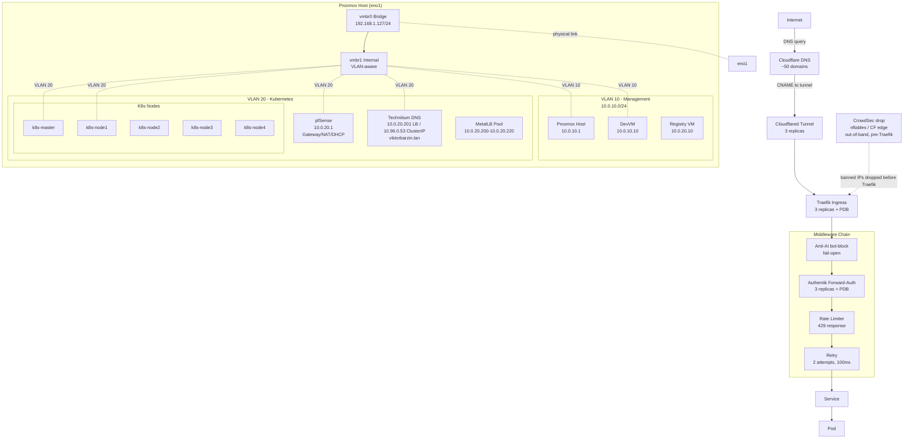
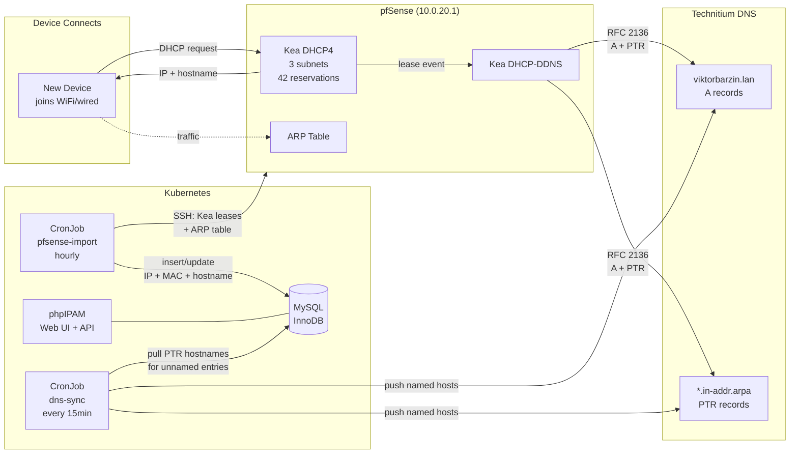
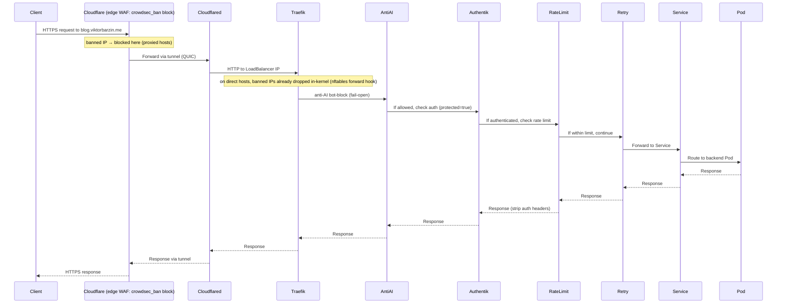

# Networking Architecture

Last updated: 2026-04-19 (WS E — Kea DHCP pushes dual DNS per subnet; Kea DDNS TSIG-signed)

## Overview

The homelab network is built on a dual-VLAN architecture with pfSense providing gateway services, Technitium for internal DNS, and Cloudflare for external DNS. Traefik serves as the Kubernetes ingress controller with a middleware chain of anti-AI bot-blocking, Authentik forward-auth, rate limiting, and retry. CrowdSec IP-reputation enforcement is **out-of-band** (not a Traefik hop): banned IPs are dropped in-kernel via nftables on direct hosts and blocked at the Cloudflare edge on proxied hosts (see `docs/architecture/security.md`). All HTTP traffic flows through Cloudflared tunnels, avoiding the need for port forwarding or exposing public IPs.

## Architecture Diagram

## Components

| Component | Version/Type | Location | Purpose |
|-----------|-------------|----------|---------|
| pfSense | 2.7.x | 10.0.20.1 | Gateway, NAT, firewall, Kea DHCP for all subnets, Kea DDNS |
| phpIPAM | v1.7.0 | phpipam.viktorbarzin.me | IP address management, device inventory, DNS sync |
| vmbr0 | Linux bridge | 192.168.1.127/24 | Physical bridge on eno1, uplink to LAN |
| vmbr1 | Linux bridge (VLAN-aware) | Internal | VLAN trunk for VM isolation |
| Technitium DNS | Container | 10.0.20.201 (LB) / 10.96.0.53 (ClusterIP) | Internal DNS (viktorbarzin.lan) + full recursive resolver |
| Cloudflare DNS | SaaS | External | ~50 public domains under viktorbarzin.me |
| Cloudflared | Container | K8s (3 replicas) | Tunnel ingress, replaces port forwarding |
| Traefik | Helm chart | K8s (3 replicas + PDB) | Ingress controller, HTTP/3 enabled |
| CrowdSec | Helm chart | K8s (LAPI: 3 replicas) | IP reputation. Out-of-band enforcement: `cs-firewall-bouncer` DaemonSet (in-kernel nftables drop, direct hosts) + Cloudflare edge WAF rule (proxied hosts). Fail-open |
| Authentik | Helm chart | K8s (3 replicas + PDB) | SSO, forward-auth middleware |
| MetalLB | v0.15.3 Helm chart | K8s | LoadBalancer IPs (10.0.20.200-10.0.20.220), all services on 10.0.20.200 |
| Registry Cache | Container | 10.0.20.10 | Pull-through for docker.io:5000, ghcr.io:5010 |

## IPAM & DNS Auto-Registration

Devices are automatically discovered, named, and registered in DNS without manual intervention.

### Data Flow

| Step | Trigger | Source | Destination | Data | Latency |
|------|---------|--------|-------------|------|---------|
| 1. DHCP lease | Device connects | Kea DHCP4 | Device | IP + gateway + DNS | Immediate |
| 2. DNS registration | Lease granted | Kea DDNS | Technitium | A + PTR records | Immediate |
| 3. Device import | CronJob (5min) | Kea leases + ARP | phpIPAM MySQL | IP + MAC + hostname | ≤5 min |
| 4. DNS sync (push) | CronJob (15min) | phpIPAM MySQL | Technitium | A + PTR for named hosts | ≤15 min |
| 5. DNS sync (pull) | CronJob (15min) | Technitium PTR | phpIPAM MySQL | Hostname for unnamed entries | ≤15 min |

### DHCP Coverage

| Subnet | DHCP Server | DNS option 6 | Reservations | DDNS | Notes |
|--------|------------|--------------|--------------|------|-------|
| 10.0.10.0/24 (Mgmt) | Kea on pfSense | `10.0.10.1, 94.140.14.14` | 3 (devvm, pxe, ha) | Yes (TSIG) | VMs with static MACs |
| 10.0.20.0/24 (K8s) | Kea on pfSense | `10.0.20.1, 94.140.14.14` | 7 (master, nodes 1-5, registry) | Yes (TSIG) | K8s cluster nodes |
| 192.168.1.0/24 (LAN) | **TP-Link AP** | `192.168.1.2, 94.140.14.14` | 42 (all home devices) | Yes | pfSense Kea WAN is disabled |
| 10.3.2.0/24 (VPN) | Static | — | — | No | WireGuard peers |
| 192.168.0.0/24 (Valchedrym) | OpenWRT | — | — | No | Remote site |
| 192.168.8.0/24 (London) | GL-iNet | — | — | No | Remote site |

## How It Works

### VLAN Segmentation

The Proxmox host uses a dual-bridge architecture:
- **vmbr0**: Physical bridge on interface `eno1`, connected to upstream LAN (192.168.1.0/24). Proxmox management IP is 192.168.1.127.
- **vmbr1**: Internal VLAN-aware bridge, acts as a trunk carrying:
  - **VLAN 10 (Management)**: 10.0.10.0/24 — Proxmox, DevVM
  - **VLAN 20 (Kubernetes)**: 10.0.20.0/24 — All K8s nodes, services, MetalLB IPs

VMs tag traffic on vmbr1 to isolate workloads. pfSense bridges VLAN 20 to the upstream LAN via NAT.

### DNS Resolution

**Internal (Technitium)**:
- K8s LoadBalancer at **10.0.20.201** (dedicated MetalLB IP), ClusterIP at **10.96.0.53**
- Serves `.viktorbarzin.lan` zone with 30+ internal A/CNAME records
- Also acts as full recursive resolver for public domains
- `externalTrafficPolicy: Local` preserves client source IPs for query logging
- HA: primary + secondary + tertiary pods with anti-affinity, PDB minAvailable=2

**LAN client DNS path (192.168.1.0/24)**:
- TP-Link DHCP gives DNS=192.168.1.2 (pfSense WAN)
- pfSense NAT redirect (`rdr`) forwards UDP 53 on WAN directly to Technitium (10.0.20.201)
- Client source IPs are preserved (no SNAT on 192.168.1.x → 10.0.20.x path)
- Technitium logs show real per-device IPs for analytics

**Split Horizon / Hairpin NAT fix (192.168.1.0/24 → *.viktorbarzin.me)**:
- TP-Link router does NOT support hairpin NAT — LAN clients can't reach the public IP (176.12.22.76) for non-proxied domains
- Technitium's Split Horizon `AddressTranslation` post-processor translates `176.12.22.76 → 10.0.20.203` (Traefik LB) in DNS responses for 192.168.1.0/24 clients (was `.200` until 2026-05-30 Traefik dedicated-IP move)
- DNS Rebinding Protection has `viktorbarzin.me` in `privateDomains` to allow the translated private IP
- Only affects non-proxied domains (ha-sofia, immich, headscale, etc.) — Cloudflare-proxied domains resolve to Cloudflare IPs and are unaffected
- Other clients (10.0.x.x, K8s pods) are NOT translated — they reach the public IP via pfSense outbound NAT
- Config synced to all 3 Technitium instances by CronJob `technitium-split-horizon-sync` (every 6h)
- **Known mail-name collision**: the translation also sends `mail.viktorbarzin.me` (and `imap.`/`smtp.`) to `.203`, but Traefik does not listen on mail ports there. iOS Mail on Barzini WiFi silently hangs. Fix in flight: dedicated pfSense Virtual IP for the mail listener so DNS can point at a stable mail-only IP instead of relying on Traefik's LB IP.

**K8s cluster DNS path**:
- CoreDNS forwards `.viktorbarzin.lan` to Technitium ClusterIP (10.96.0.53)
- CoreDNS forwards public queries to pfSense (10.0.20.1), 8.8.8.8, 1.1.1.1
- **In-cluster `forgejo.viktorbarzin.me` → Traefik ClusterIP**: a CoreDNS `rewrite name exact forgejo.viktorbarzin.me traefik.traefik.svc.cluster.local` (Corefile in `stacks/technitium/modules/technitium/main.tf`) keeps pod registry pulls/pushes/builds off the public-IP hairpin. The ETP=Local Traefik LB (`.203`) is not reliably hairpin-reachable from pods, and the public path (the bullet above) intermittently timed out **buildkit pushes** from Woodpecker build pods — which, unlike kubelet, do NOT use the per-node containerd Forgejo mirror. Resolving the Service by name auto-tracks the ClusterIP (no rot on a Traefik renumber); Traefik's `*.viktorbarzin.me` wildcard keeps SNI/TLS valid. Makes the per-pod woodpecker-server hostAlias belt-and-suspenders. (beads code-yh33)

**pfSense dnsmasq (DNS Forwarder)**:
- Listens on LAN (10.0.10.1), OPT1 (10.0.20.1), localhost only — NOT on WAN (192.168.1.2)
- Forwards `.viktorbarzin.lan` to Technitium (10.0.20.201), public queries to 1.1.1.1
- Serves K8s VLAN clients and pfSense's own DNS needs
- Aliases: `technitium_dns` (10.0.20.201), `k8s_shared_lb` (10.0.20.200)

**External (Cloudflare)**:
- Manages ~50 public domains, all under `viktorbarzin.me`
- **Proxied domains** (orange cloud, traffic via Cloudflare CDN):
  - blog, hackmd, privatebin, url, echo, f1tv, excalidraw, send, audiobookshelf, jsoncrack, ntfy, cyberchef, homepage, linkwarden, changedetection, tandoor, n8n, stirling-pdf, dashy, city-guesser, travel, netbox
- **Non-proxied domains** (grey cloud, direct IP resolution):
  - mail, wg, headscale, immich, calibre, vaultwarden, and other services requiring direct connections
- CNAME records for proxied domains point to Cloudflared tunnel FQDNs

### Ingress Flow

CrowdSec is **not** a step in this chain — banned IPs are dropped before the
request ever reaches Traefik (Cloudflare edge WAF rule on proxied hosts; host
nftables on direct hosts). The flow below is for a request that survives that
out-of-band gate.

### Middleware Chain

CrowdSec IP-reputation enforcement is **not** in this chain — it is out-of-band
(host nftables on direct hosts; the Cloudflare edge WAF `crowdsec_ban` rule on
proxied hosts), so banned IPs never reach the chain and there is no per-request
CrowdSec hop. Every ingress created by the `ingress_factory` module follows this
Traefik chain:

1. **Anti-AI bot-block** (`ai-bot-block` ForwardAuth, on by default via `ingress_factory`): blocks/tarpits known AI crawlers. **Fail-open** (currently a no-op `return 200` — poison-fountain scaled to 0; see `docs/architecture/security.md`).
2. **Authentik Forward-Auth** (if `protected = true`): SSO authentication via OIDC. Non-authenticated users are redirected to login. Auth headers are stripped before forwarding to backend.
3. **Rate Limiting**: Per-IP throttling. Returns **429 Too Many Requests** (not 503) when limit exceeded. Default is `rate-limit` (average 10 req/s, burst 50). Services whose clients legitimately burst harder get a dedicated middleware via `skip_default_rate_limit = true` + `extra_middlewares`: Immich (`immich-rate-limit`, 1000/20000, photo uploads) and ActualBudget (`actualbudget-rate-limit`, 50/300 — the Actual web app boots with ~70 parallel asset/migration revalidations; the default burst 429'd the tail and stalled every page load).
4. **Retry**: 2 attempts with 100ms delay on transient failures (5xx errors, connection errors).

Additional middleware:
- **HTTP/3 (QUIC)**: Enabled globally on Traefik.

### Entrypoint Transport Timeouts

The `websecure` entrypoint sets `respondingTimeouts` in `stacks/traefik/modules/traefik/main.tf`:

| Timeout | Value | Bounds |
|---|---|---|
| `readTimeout` | `3600s` | Total time to read one request incl. body → **max upload duration** |
| `writeTimeout` | `0s` (disabled) | Total time to write the response → **max download duration (0 = unlimited)** |
| `idleTimeout` | `600s` | Keep-alive idle between requests (does *not* apply to active transfers) |

**Gotcha — these are HARD caps on total duration, not idle timeouts** (unlike nginx `proxy_*_timeout`, which reset on every read). A finite `writeTimeout` truncates *any* download that runs longer than it, regardless of progress. A prior `writeTimeout=60s` silently cut large Immich video downloads at the 60s mark (HTTP/2 stream reset). `writeTimeout=0` (Traefik's default) is required for unlimited-size downloads — Immich's own Traefik reverse-proxy guidance assumes it and never sets `writeTimeout`. `readTimeout` is kept finite (not 0) because an unbounded request read is the slow-loris vector; 3600s passes multi-GB uploads while keeping a backstop (Immich has no resumable upload, so the window must exceed real upload times). Single-asset downloads (`GET /api/assets/{id}/original`) serve `206 Partial Content`, so they are also resumable on a dropped connection; on-the-fly ZIP "download all" is not (no stable byte offsets).

### MetalLB & Load Balancing

MetalLB v0.15.3 allocates IPs from `10.0.20.200-10.0.20.220` (21 IPs) in **Layer 2 mode**; **four are in use**. Most LoadBalancer services share **10.0.20.200** (`metallb.io/allow-shared-ip: shared`, `externalTrafficPolicy: Cluster`). **Three services hold dedicated IPs with `externalTrafficPolicy: Local`** to preserve the real client source IP (and, for Traefik, to make QUIC/HTTP3 work — a shared IP forbids the mixed ETP the UDP listener needs).

> **Why not consolidate to fewer IPs?** The three dedicated IPs can't be merged. MetalLB L2 only lets `ETP=Local` services share an IP if they have *identical pod selectors* (Traefik/KMS/Technitium don't), and a shared `ETP=Local` IP announces from a single node — blackholing any service whose pods aren't on it. Traefik additionally can never leave a dedicated IP (QUIC needs the UDP listener on its own ETP=Local IP). Merging would cost client-IP preservation or HA, so the 4-IP layout is deliberate — not sprawl. Full analysis: `docs/plans/2026-06-03-lb-ip-hygiene-design.md`.

| IP | ETP | Services (ns/name → ports) |
|----|-----|----------------------------|
| **10.0.20.200** (shared) | Cluster | dbaas/postgresql-lb→5432 · beads-server/dolt→3306 · coturn/coturn→3478 TCP+UDP, 49152-49252/UDP · headscale/headscale-server→41641/UDP, 3479/UDP · wireguard/wireguard→51820/UDP · servarr/qbittorrent-torrenting→50000 TCP+UDP · shadowsocks/shadowsocks→8388 TCP+UDP · tor-proxy/torrserver-bt→5665 TCP+UDP · xray/xray-reality→7443 |
| **10.0.20.201** (dedicated) | Local | technitium/technitium-dns→53 UDP+TCP |
| **10.0.20.202** (dedicated)¹ | Local | kms/windows-kms→1688 |
| **10.0.20.203** (dedicated) | Local | traefik/traefik→80, 443, 443/UDP (HTTP/3), 10200 (piper), 10300 (whisper) |

**Mailserver does NOT use a LB IP** — inbound mail enters via pfSense HAProxy on `10.0.20.1:{25,465,587,993}` → NodePorts `30125-30128` (PROXY-v2; see "Mail Server" below). (Earlier revisions of this table wrongly listed mailserver on `.200` and KMS on `.200` — both corrected 2026-06-03.)

**pfSense aliases** map to these IPs: `k8s_shared_lb`→.200, `technitium_dns`→.201, `k8s_kms_lb`→.202, `traefik_lb`→.203 (plus a legacy `nginx`→.200 duplicate — cruft). NAT rules reference aliases, so repointing an alias cascades to its paired filter rule.

¹ **windows-kms is publicly WAN-exposed.** pfSense forwards WAN TCP/1688 → `k8s_kms_lb` (.202) so any internet host can activate. The matching filter rule rate-limits per source (`max-src-conn 50`, `max-src-conn-rate 10/60`, `overload <virusprot>`). See `docs/runbooks/kms-public-exposure.md`.

#### LB-IP renumber checklist

These IPs are referenced by consumers that do **not** auto-follow when an IP moves — the 2026-05-30 Traefik `.200→.203` move broke five of them (cloudflared 502, woodpecker forge API, containerd pulls, the `.lan` + `.me` zones). **Before moving any LB IP, update every consumer below.** Bootstrap-critical literals (containerd mirror, PG state, node DNS) deliberately stay IP literals (DNS chicken-and-egg) — this list is their single source of truth.

- **`.203` Traefik:** assigner `stacks/traefik/modules/traefik/main.tf` · split-horizon translation `stacks/technitium/modules/technitium/main.tf` (`externalToInternalTranslation`) · prometheus apex-alert summary `stacks/monitoring/.../prometheus_chart_values.tpl` · containerd Forgejo mirror `modules/create-template-vm/k8s-node-containerd-setup.sh` + `scripts/setup-forgejo-containerd-mirror.sh` (OOB, per node) · cloudflared origin (already IP-independent → `traefik.traefik.svc`) · woodpecker forge alias (now reads the Traefik **ClusterIP** dynamically — no literal) · pfSense NAT 80/443 → `traefik_lb`.
- **`.201` Technitium:** assigner `stacks/technitium/modules/technitium/main.tf` · DNS records `config.tfvars` (ns1/ns2/`viktorbarzin.lan`, dnscrypt forwarder) · `modules/create-template-vm/cloud_init.yaml` FallbackDNS · `scripts/provision-k8s-worker` · pfSense NAT 53 (**literal `10.0.20.201`**, not the `technitium_dns` alias — known inconsistency).
- **`.202` KMS:** assigner `stacks/kms/main.tf` · pfSense NAT 1688 → `k8s_kms_lb` · Cloudflare `vlmcs` public A → WAN → `.202`.
- **`.200` shared:** the 9 assigners above · PG state backend `scripts/tg` + `scripts/migrate-state-to-pg` (`@10.0.20.200:5432`) · pfSense NAT (wireguard/shadowsocks/coturn/headscale-STUN/qbittorrent/xray) → `k8s_shared_lb`, outbound-NAT self rule, CrowdSec syslog `remoteserver .200:30514`.

Critical services are scaled to **3 replicas**:
- Traefik (PDB: minAvailable=2)
- Authentik (PDB: minAvailable=2)
- CrowdSec LAPI
- PgBouncer
- Cloudflared

PodDisruptionBudgets ensure at least 2 replicas remain during node maintenance or disruptions.

### IPv6 Ingress (HE Tunnel + HAProxy Bridge)

Public IPv6 reaches the cluster over a **Hurricane Electric 6in4 tunnel** terminated on pfSense (`gif0`; tunnel endpoint `2001:470:6e:43d::2`, LAN prefix `2001:470:6f:43d::/64`). The apex `viktorbarzin.me AAAA` → `2001:470:6e:43d::2`.

pfSense cannot NAT IPv6→IPv4, so ingress is bridged by a **standalone HAProxy** on pfSense (a separate config/service — *not* the pfSense HAProxy package) that listens on the tunnel IPv6 and forwards to the IPv4 cluster LBs with **PROXY protocol v2 (`send-proxy-v2`)**, so real client IPv6 addresses propagate to CrowdSec instead of being masked as `10.0.20.1`:

| Listen `[2001:470:6e:43d::2]:` | → Backend (`send-proxy-v2`) | Purpose |
|---|---|---|
| 443, 80 | Traefik `10.0.20.203:443` / `:80` | Web apps |
| 25, 465, 587, 993 | mail NodePorts `30125` / `30126` / `30127` / `30128` on .101-103 | SMTP / SMTPS / Submission / IMAPS |

The web path works because Traefik trusts PROXY-v2 **only from `10.0.20.1`** (`entryPoints.web/websecure.proxyProtocol.trustedIPs` in `stacks/traefik/.../main.tf`) — real IPv4 clients arrive via ETP=Local with their own source IP (never `10.0.20.1`), so they are unaffected. Mail backends hit the mailserver's PROXY-aware alt-listeners (same pattern as the IPv4 mail HAProxy — see `mailserver.md`).

**No QUIC over IPv6** — the bridge is TCP/h2 only; IPv4 carries QUIC/HTTP3.

The bridge's HAProxy uses `timeout client 1h` / `timeout server 1h`, which are **inactivity** timeouts (reset on every byte), *not* total-transfer caps — so steady large downloads/uploads over IPv6 are not limited by the bridge. The download-duration cap was solely Traefik's `writeTimeout` (see Entrypoint Transport Timeouts above), now `0`.

pfSense files (out-of-band, **not Terraform**):
- `/usr/local/etc/ipv6-haproxy.cfg` — the 6-frontend bridge config above.
- `/usr/local/etc/rc.d/ipv6proxy` — service wrapper (`service ipv6proxy {start,stop,status}`); `start` does a graceful `-sf` reload.
- `/usr/local/etc/ipv6_proxy.sh` — boot entrypoint (config.xml `<shellcmd>`): patches pfSense nginx off `[::]:443/:80` (rebinds to LAN IPv6) to free the tunnel IPv6, then `service ipv6proxy onestart`.

**Gotcha:** the backends use **no health `check`** — a plain TCP check hits the PROXY-expecting listeners without a PROXY header and would false-mark them DOWN. This path previously used `socat` (functional, but masked every IPv6 client as `10.0.20.1`); replaced by HAProxy on 2026-05-30 for real client IPs.

### Container Registry Pull-Through Cache

**Location**: Registry VM at 10.0.20.10

Docker Hub and GitHub Container Registry (GHCR) are mirrored locally to avoid rate limits and improve pull performance:
- **docker.io**: Port 5000
- **ghcr.io**: Port 5010

Containerd on all K8s nodes uses `hosts.toml` to redirect pulls to the local cache transparently.

**Caveat**: The cache holds stale manifests for `:latest` tags, which can cause version skew. Always use **versioned tags** (e.g., `python:3.12.0` or `app:abc12345`) in production.

## Configuration

### Terraform Stacks

| Stack | Path | Resources |
|-------|------|-----------|
| pfSense | `stacks/pfsense/` | VM + cloud-init config |
| Technitium | `stacks/technitium/` | Deployment, Service, PVC |
| Traefik | `stacks/platform/` (sub-module) | Helm release, IngressRoute CRDs |
| CrowdSec | `stacks/crowdsec/` (+ edge in `stacks/rybbit/`) | Helm release, LAPI + agent; `cs-firewall-bouncer` DaemonSet (nftables, direct hosts) + Cloudflare edge sync (proxied hosts) |
| Authentik | `stacks/authentik/` | Helm release, ingress, OIDC configs |
| MetalLB | `stacks/platform/` (sub-module) | Helm release, IPAddressPool |
| Cloudflared | `stacks/cloudflared/` | Deployment (3 replicas), tunnel config; runs `--no-autoupdate` (in-place self-updates exited the pods and severed all tunnel WebSockets, 2026-06-09/10) |
| ingress_factory | `modules/ingress_factory/` | IngressRoute + middleware chain |

### Key Configuration Files

**pfSense**:
- Config: Not Terraform-managed (pfSense web UI / config.xml)
- DHCP: Kea DHCP4 on the two internal VLANs (VLAN 10 = 10.0.10.0/24, VLAN 20 = 10.0.20.0/24). WAN/192.168.1.0/24 is served by the TP-Link dumb AP — pfSense's Kea WAN subnet is disabled.
- **DNS option 6** (per-subnet, WS E 2026-04-19):
  - 10.0.10.0/24 → `10.0.10.1, 94.140.14.14` (internal Unbound + AdGuard Home public fallback)
  - 10.0.20.0/24 → `10.0.20.1, 94.140.14.14`
  - 192.168.1.0/24 → `192.168.1.2, 94.140.14.14` (served by TP-Link, unchanged by WS E)
  - Rationale: clients survive an internal resolver outage by falling through to AdGuard (`94.140.14.14`) — confirmed via null-route drill on 2026-04-19.
- 42 MAC→IP reservations for 192.168.1.0/24 (all known home devices)
- DHCP DDNS: Kea DHCP-DDNS sends **TSIG-signed** RFC 2136 updates to Technitium (key `kea-ddns`, HMAC-SHA256; secret in Vault `secret/viktor/kea_ddns_tsig_secret`). Zone `viktorbarzin.lan` + reverse zones require both a pfSense-source IP AND a valid TSIG signature. Config: `/usr/local/etc/kea/kea-dhcp-ddns.conf` (hand-managed on pfSense; pre-WS-E backup at `kea-dhcp-ddns.conf.2026-04-19-pre-tsig`).
- Firewall rules: Allow K8s egress, block inter-VLAN by default

**Technitium**:
- Config: Stored on `proxmox-lvm-encrypted` PVCs (migrated from NFS 2026-04-14)
- Zone file: `viktorbarzin.lan` (A records for all internal hosts)
- Reverse zones: `10.0.10.in-addr.arpa`, `20.0.10.in-addr.arpa`, `1.168.192.in-addr.arpa`, `2.3.10.in-addr.arpa`, `0.168.192.in-addr.arpa`
- Stub zone: `emrsn.org` (returns NXDOMAIN locally for corporate domain queries, avoids upstream forwarding)
- Dynamic updates: Enabled (UseSpecifiedNetworkACL) from pfSense IPs (10.0.20.1, 10.0.10.1, 192.168.1.2)
- Forwarders: Cloudflare DNS-over-HTTPS (1.1.1.1, 1.0.0.1)
- Cache: 100K max entries, min TTL 60s, max TTL 7 days, serve stale enabled (3 days)
- Query logging: PostgreSQL (`technitium` database on `pg-cluster-rw.dbaas.svc.cluster.local`)
- Blocking: OISD Big List + StevenBlack hosts (~486K domains)
- CronJobs: `technitium-password-sync` (6h, Vault password rotation), `technitium-split-horizon-sync` (6h, hairpin NAT fix), `technitium-dns-optimization` (6h, cache TTL + stub zones)

**phpIPAM (IP Address Management)**:
- Stack: `stacks/phpipam/`
- Web UI: `phpipam.viktorbarzin.me` (Authentik-protected)
- Database: MySQL InnoDB cluster (`mysql.dbaas.svc.cluster.local`)
- Device import: CronJob `phpipam-pfsense-import` hourly — queries Kea DHCP leases + pfSense ARP table via SSH (no active scanning)
- DNS sync: CronJob `phpipam-dns-sync` every 15min — bidirectional sync between phpIPAM and Technitium DNS (push named hosts → A+PTR, pull DNS hostnames → unnamed phpIPAM entries)
- Subnets tracked: 10.0.10.0/24, 10.0.20.0/24, 192.168.1.0/24, 10.3.2.0/24, 192.168.8.0/24, 192.168.0.0/24
- API: REST API enabled (app `claude`, ssl_token auth), MCP server available for agent access

**Traefik Middleware**:
- Helm values: `stacks/platform/traefik-values.yaml`
- Middleware CRDs: Generated by `ingress_factory` module
- HTTP/3 config: `experimental.http3.enabled=true`

**MetalLB**:
- Helm values: `stacks/platform/metallb-values.yaml`
- IPAddressPool CRD: `10.0.20.200-10.0.20.220`
- All 11 LB services consolidated on `10.0.20.200` with `metallb.io/allow-shared-ip: shared`
- Requires matching `externalTrafficPolicy` (all use `Cluster`) for IP sharing

**Vault Secrets**:
- Cloudflare API token: `secret/viktor/cloudflare_api_token`
- Authentik OIDC secrets: `secret/authentik`
- CrowdSec LAPI key: `secret/crowdsec/lapi_key`

## Decisions & Rationale

### Why Dual-Bridge VLAN Architecture?

**Alternatives considered**:
1. **Single flat network**: Simpler, but no isolation between management and workload traffic.
2. **Routed network with physical VLANs**: Requires switch with VLAN support.

**Decision**: vmbr0 (physical) + vmbr1 (VLAN trunk) gives isolation without requiring managed switches. Management traffic (Proxmox, DevVM) stays on VLAN 10, K8s workloads stay on VLAN 20. Failures in K8s don't affect access to Proxmox or storage.

### Why Cloudflared Tunnel Instead of Port Forwarding?

**Alternatives considered**:
1. **Traditional port forwarding (80/443)**: Exposes public IP, requires firewall rules, DDoS risk.
2. **VPN-only access**: Limits accessibility for public services like blog.

**Decision**: Cloudflared tunnel provides:
- No public IP exposure
- DDoS protection via Cloudflare
- TLS termination at Cloudflare edge
- Zero firewall configuration
- Works behind CGNAT

### Why Split DNS (Technitium + Cloudflare)?

**Alternatives considered**:
1. **Cloudflare only**: Works but introduces external dependency for internal resolution.
2. **Technitium only**: Can't handle public domains without zone delegation.

**Decision**: Technitium handles internal `.lan` domains with near-zero latency. Cloudflare handles public domains with global DNS. K8s nodes use Technitium as primary, which forwards non-.lan queries to Cloudflare.

### Why CrowdSec Enforcement Is Out-of-Band (and Fails Open)

CrowdSec used to enforce inline as a Traefik middleware (the
`crowdsec-bouncer-traefik-plugin`). On Traefik 3.7.5 the Yaegi plugin handler was
never invoked, so it enforced nothing; the plugin was removed and enforcement
moved off the request path entirely (full history in
`docs/architecture/security.md`). It now runs on two surfaces:

- **Direct hosts** → `cs-firewall-bouncer` DaemonSet drops banned IPs in the host
  nftables, in **both the `input` and `forward` hooks**. The `forward` hook is
  the load-bearing one: with Traefik on a dedicated LB IP at
  `externalTrafficPolicy=Local`, client packets are DNAT'd to the Traefik **pod**
  and transit the node's `forward` chain (not `input`) — which is exactly why the
  ingress must preserve the **real client IP** end-to-end (ETP=Local + PROXY-v2
  for IPv6; see the Traefik LB IP and IPv6 ingress notes above). Without the real
  client IP the firewall-bouncer (and the CF edge rule) would have nothing to
  match on.
- **Proxied hosts** → a Cloudflare edge WAF rule (`ip.src in $crowdsec_ban`) fed
  by the `crowdsec-cf-sync` CronJob.

Both **fail open**: if LAPI is unreachable, the firewall-bouncer simply stops
receiving new decisions (existing drops persist) and the CF sync skips a run —
neither ever blocks legitimate traffic. Availability > strict bot blocking, and
out-of-band enforcement adds **zero per-request latency** (no Traefik hop).

### Why HTTP/3 (QUIC)?

**Benefit**: Reduces latency on lossy connections (mobile, Wi-Fi) and enables multiplexing without head-of-line blocking. Minimal overhead since Traefik handles it natively.

### Why Pull-Through Registry Cache?

**Problem**: Docker Hub rate limits (100 pulls/6h for anonymous, 200 pulls/6h for free accounts) caused CI/CD failures.

**Solution**: Local registry cache at 10.0.20.10 mirrors all pulls. Containerd transparently redirects requests. Zero application changes needed.

**Trade-off**: Stale `:latest` tags — requires discipline to use versioned tags (8-char git SHAs for app images).

## Troubleshooting

### Ingress Returns 502 Bad Gateway

**Symptoms**: Cloudflared tunnel is up, Traefik logs show `dial tcp: lookup <service> on 10.0.20.201:53: no such host`.

**Diagnosis**: DNS resolution failed. Check:
1. Is Technitium pod running? `kubectl get pod -n technitium`
2. Can nodes resolve the service? `kubectl exec -it <any-pod> -- nslookup <service>.viktorbarzin.lan`
3. Is the Service correctly created? `kubectl get svc -n <namespace>`

**Fix**: If Technitium is down, restart it. If the Service is missing, check Terraform apply status.

### Traefik Shows "Service Unavailable" for All Requests

**Symptoms**: All ingress routes return 503, Traefik dashboard shows no backends available.

**Diagnosis**: Middleware chain is blocking traffic. (CrowdSec is **not** in the
chain — a CrowdSec/LAPI outage cannot cause 503s; it only stops new bans.) Check:
1. Authentik status: `kubectl get pod -n authentik` (ForwardAuth fails closed if the auth server is unreachable)
2. `bot-block-proxy` status: `kubectl get pod -n traefik -l app=bot-block-proxy` (anti-AI ForwardAuth target — also fails closed if down)
3. Traefik logs: `kubectl logs -n kube-system deploy/traefik`

**Fix**: If Authentik is down and ingress uses forward-auth, pods won't pass health checks. Scale Authentik to 3 replicas or temporarily disable forward-auth middleware.

### MetalLB Doesn't Assign IP to LoadBalancer Service

**Symptoms**: Service stays in `<pending>` state, no IP assigned.

**Diagnosis**: Check MetalLB logs: `kubectl logs -n metallb-system deploy/controller`

**Common causes**:
1. **IP pool exhausted**: 21 IPs available (10.0.20.200-10.0.20.220), check `kubectl get svc -A | grep LoadBalancer`
2. **Missing allow-shared-ip annotation**: Services must have `metallb.io/allow-shared-ip: shared` and `metallb.io/loadBalancerIPs: 10.0.20.200`
3. **Mismatched externalTrafficPolicy**: All services sharing an IP must use the same ETP (currently `Cluster`). Error: "can't change sharing key"
4. **MetalLB controller crash-looping**: Resource limits too low

**Fix**: If pool exhausted, either delete unused Services or expand the IPAddressPool CRD. For sharing key errors, ensure new services use `externalTrafficPolicy: Cluster` and both `metallb.io/` annotations.

### DNS Resolution Loops (Technitium → Cloudflare → Technitium)

**Symptoms**: Slow DNS responses, `dig` shows multiple CNAMEs in a loop.

**Diagnosis**: Misconfigured forwarder or zone overlap.

**Fix**: Ensure Technitium forwards all non-.lan queries to Cloudflare (1.1.1.1), and Cloudflare zones don't contain `.lan` records.

### Cloudflared Tunnel Disconnects Frequently

**Symptoms**: Intermittent 502 errors, Cloudflared logs show `connection lost, retrying`.

**Diagnosis**: Check:
1. Network stability: `ping 1.1.1.1` from a K8s node
2. Cloudflared resource limits: `kubectl top pod -n cloudflared`
3. Cloudflare tunnel status in dashboard

**Fix**: If resource-limited, increase memory/CPU. If network-related, check pfSense logs for NAT table exhaustion or ISP issues.

### Rate Limiter Blocks Legitimate Traffic

**Symptoms**: Users report 429 errors during normal usage (e.g., Immich uploads, ActualBudget's "Server returned an error while checking its status" boot screen).

**Diagnosis**: Check Traefik middleware config for the affected IngressRoute.

**Fix**: Give the service a dedicated higher-limit middleware (don't loosen the shared default): define `<service>-rate-limit` in `stacks/traefik/modules/traefik/middleware.tf`, then set `skip_default_rate_limit = true` + `extra_middlewares = ["traefik-<service>-rate-limit@kubernetescrd"]` on its `ingress_factory` call. Shared default is average 10 req/s / burst 50; Immich uses 1000/20000, ActualBudget 50/300.

### Large Downloads or Uploads Truncate / Fail Partway

**Symptoms**: Large file transfers (e.g. Immich videos, Nextcloud sync) fail at a consistent wall-clock point regardless of file — a download stops at exactly N seconds × throughput bytes; an upload fails ~1 min in. Browser shows "network error"; `curl` exits 18/92 (truncated / HTTP/2 stream reset).

**Diagnosis**: Check the `websecure` entrypoint `respondingTimeouts` (see Entrypoint Transport Timeouts). These are **hard total-duration caps**, not idle timeouts — a finite `writeTimeout` cuts downloads, a finite `readTimeout` cuts uploads, both regardless of progress. Reproduce deterministically: `curl --limit-rate 6M` a file large enough to exceed the cap; it dies at the cap.

**Fix**: `writeTimeout=0` (unlimited downloads), `readTimeout` ≥ longest expected upload (currently `3600s`). Not Cloudflare (Immich is non-proxied) and not the pfSense IPv6 bridge (its 1h timeouts are inactivity-based).

## Related

- **Runbooks**:
  - `docs/runbooks/restart-traefik.md`
  - `docs/runbooks/reset-crowdsec-bans.md`
  - `docs/runbooks/add-dns-record.md`
- **Architecture Docs**:
  - `docs/architecture/dns.md` — DNS architecture (Technitium, CoreDNS, Cloudflare, Split Horizon)
  - `docs/architecture/vpn.md` — VPN and remote access
  - `docs/architecture/storage.md` — NFS and iSCSI architecture (coming soon)
- **Reference**:
  - `.claude/reference/service-catalog.md` — Full service inventory
  - `.claude/reference/proxmox-inventory.md` — VM and LXC details
