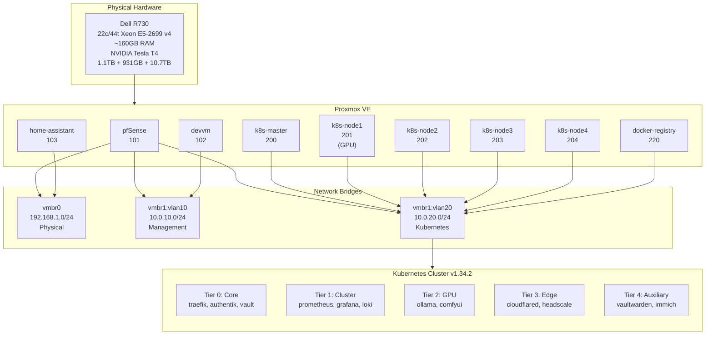

# Infrastructure Overview

## Overview

This homelab infrastructure runs a production-grade Kubernetes cluster on Proxmox, hosting 70+ services including web applications, databases, monitoring, security, and GPU-accelerated workloads. The entire infrastructure is managed declaratively using Terraform and Terragrunt, with automated CI/CD pipelines for continuous deployment. Services are organized into a five-tier system for resource isolation and priority-based scheduling.

## Architecture Diagram



## Components

### Hardware

| Component | Specification |
|-----------|---------------|
| Server | Dell PowerEdge R730 |
| CPU | 1x Intel Xeon E5-2699 v4 (22 cores / 44 threads, CPU2 unpopulated) |
| RAM | ~160GB DDR4 ECC |
| GPU | NVIDIA Tesla T4 (16GB, PCIe 0000:06:00.0) |
| Storage | 1.1TB SSD + 931GB SSD + 10.7TB HDD |
| Network | eno1 (physical), vmbr0 (physical bridge), vmbr1 (VLAN-aware internal) |

### Network Topology

| Network | VLAN | CIDR | Purpose |
|---------|------|------|---------|
| Physical | - | 192.168.1.0/24 | Physical devices, Proxmox host (192.168.1.127) |
| Management | 10 | 10.0.10.0/24 | Infrastructure VMs, devvm |
| Kubernetes | 20 | 10.0.20.0/24 | K8s cluster nodes and services |

### Virtual Machine Inventory

| VMID | Name | CPUs | RAM | Network | IP Address | Notes |
|------|------|------|-----|---------|------------|-------|
| 101 | pfsense | 8 | 16GB | vmbr0, vmbr1:vlan10, vmbr1:vlan20 | - | Gateway/firewall routing between VLANs |
| 102 | devvm | 16 | 8GB | vmbr1:vlan10 | - | Development VM |
| 103 | home-assistant | 8 | 8GB | vmbr0 | - | Home Assistant Sofia instance |
| 200 | k8s-master | 8 | 32GB | vmbr1:vlan20 | 10.0.20.100 | Kubernetes control plane |
| 201 | k8s-node1 | 16 | 32GB | vmbr1:vlan20 | - | GPU worker node (Tesla T4 passthrough) |
| 202 | k8s-node2 | 8 | 32GB | vmbr1:vlan20 | - | Worker node |
| 203 | k8s-node3 | 8 | 32GB | vmbr1:vlan20 | - | Worker node |
| 204 | k8s-node4 | 8 | 32GB | vmbr1:vlan20 | - | Worker node |
| 220 | docker-registry | 4 | 4GB | vmbr1:vlan20 | 10.0.20.10 | Private Docker registry |
| ~~9000~~ | ~~truenas~~ | — | — | — | ~~10.0.10.15~~ | **DECOMMISSIONED 2026-04-13** — NFS now served by Proxmox host (192.168.1.127). VM still exists in stopped state on PVE pending user decision on deletion. |

### Kubernetes Cluster

| Component | Details |
|-----------|---------|
| Version | v1.34.2 |
| Nodes | 5 (1 control plane, 4 workers) |
| CNI | Calico |
| Storage | NFS (Proxmox host, nfs-csi) + Proxmox-LVM (Proxmox CSI) |
| Ingress | Traefik v3 |
| Total Services | 70+ services across 5 tiers |

### Service Tier System

The cluster uses a five-tier namespace system managed by Kyverno, which automatically generates LimitRange and ResourceQuota policies per tier:

| Tier | Namespace Pattern | Purpose | Priority Class |
|------|-------------------|---------|----------------|
| 0-core | `0-core-*` | Critical infrastructure (traefik, authentik, vault) | 900000 |
| 1-cluster | `1-cluster-*` | Cluster services (prometheus, grafana, kyverno) | 700000 |
| 2-gpu | `2-gpu-*` | GPU workloads (ollama, comfyui, stable-diffusion) | 500000 |
| 3-edge | `3-edge-*` | Edge services (cloudflared, headscale, technitium) | 300000 |
| 4-aux | `4-aux-*` | Auxiliary apps (vaultwarden, immich, freshrss) | 200000 |

## How It Works

### Physical Layer

The infrastructure runs on a single Dell R730 server with a Xeon E5-2699 v4 CPU and ~160GB RAM. Proxmox VE provides hypervisor capabilities with hardware passthrough support for the Tesla T4 GPU. The physical network interface (eno1) bridges to vmbr0 for physical network access, while vmbr1 provides VLAN-aware internal networking.

### Network Layer

pfSense (VMID 101) acts as the central gateway and firewall, routing traffic between:
- Physical network (192.168.1.0/24) via vmbr0
- Management VLAN 10 (10.0.10.0/24) via vmbr1:vlan10
- Kubernetes VLAN 20 (10.0.20.0/24) via vmbr1:vlan20

This three-tier network design isolates Kubernetes workloads from management infrastructure and provides controlled access to the physical network.

### Compute Layer

The Kubernetes cluster consists of 5 nodes:
- **k8s-master (200)**: 8c/32GB control plane running kube-apiserver, etcd, controller-manager
- **k8s-node1 (201)**: 16c/32GB GPU node with Tesla T4 passthrough, tainted for GPU workloads only
- **k8s-node2-4 (202-204)**: 8c/32GB workers running general-purpose workloads

GPU passthrough on node1 uses PCIe device 0000:06:00.0. The NVIDIA GPU Operator's gpu-feature-discovery auto-labels whichever node carries the card with `nvidia.com/gpu.present=true`; `null_resource.gpu_node_config` taints the same set of nodes with `nvidia.com/gpu=true:PreferNoSchedule`. No hostname is hardcoded — moving the card to a different node requires no Terraform edits.

### Service Organization

Services are organized into 70+ individual Terraform stacks under `stacks/<service>/`. Each service belongs to a tier, which determines:
- Resource limits and quotas
- Scheduling priority (higher tier = preempts lower)
- Default container resources
- QoS class (Guaranteed for tiers 0-2, Burstable for 3-4)

Kyverno policies automatically inject namespace labels, LimitRange, ResourceQuota, and PriorityClass based on the namespace tier prefix.

### Key Services

**Critical Services (Tier 0-1)**:
- **Traefik**: Ingress controller with automatic HTTPS (Let's Encrypt)
- **Authentik**: SSO/OIDC provider for all services
- **Vault**: Secrets management with auto-unseal
- **Cloudflared**: Cloudflare Tunnel for external access
- **Technitium**: Internal DNS server
- **Headscale**: Tailscale-compatible mesh VPN control plane

**Storage & Security**:
- **Proxmox NFS**: NFS storage served directly from Proxmox host (192.168.1.127) at `/srv/nfs` (HDD) and `/srv/nfs-ssd` (SSD)
- **Proxmox CSI**: Block storage via LVM-thin hotplug for databases
- **Vaultwarden**: Password manager
- **Immich**: Photo management
- **CrowdSec**: IPS/IDS with community threat intelligence
- **Kyverno**: Policy engine for admission control

**Monitoring & Observability**:
- **Prometheus**: Metrics collection
- **Grafana**: Visualization and dashboards
- **Loki**: Log aggregation
- **Alertmanager**: Alert routing

**Application Services**: Woodpecker CI, Gitea, PostgreSQL, MySQL, Redis, Ollama, ComfyUI, Stable Diffusion, Freshrss, and 50+ more services.

## Configuration

### Key Files

| Path | Purpose |
|------|---------|
| `stacks/<service>/terragrunt.hcl` | Individual service configuration |
| `modules/k8s_app/` | Reusable Kubernetes app module |
| `modules/helm_app/` | Helm chart deployment module |
| `base.hcl` | Global Terragrunt configuration |
| `terraform.tfvars` | Global variables (git-ignored) |

### Terraform Organization

Each service lives in `stacks/<service>/` with its own Terragrunt configuration. Common patterns:
- Helm deployments use `modules/helm_app/`
- Custom manifests use `modules/k8s_app/`
- Databases use dedicated modules (`modules/postgres_app/`, `modules/mysql_app/`)
- Shared dependencies via `dependency` blocks in terragrunt.hcl

### Vault Paths

Secrets are stored in HashiCorp Vault under `secret/`:
- `secret/<service>/*` - Service-specific secrets
- `secret/cloudflare` - Cloudflare API tokens
- `secret/authentik` - OIDC client credentials
- `secret/backup` - Backup encryption keys

## Decisions & Rationale

### Why Proxmox over bare-metal Kubernetes?

**Decision**: Run Kubernetes inside Proxmox VMs rather than directly on bare metal.

**Rationale**:
- **Flexibility**: Easy to snapshot, clone, and roll back VMs during upgrades
- **Isolation**: Management network (devvm) separated from Kubernetes
- **GPU passthrough**: Can dedicate GPU to a single node without tainting the entire host
- **Multi-purpose**: Same physical host can run non-K8s VMs (pfSense, Home Assistant)

**Tradeoff**: Slight performance overhead from virtualization (acceptable for homelab).

### Why five-tier namespace system?

**Decision**: Organize services into 5 tiers with automatic LimitRange/ResourceQuota via Kyverno.

**Rationale**:
- **Predictable scheduling**: Critical services (tier 0) always preempt auxiliary services (tier 4)
- **Resource protection**: Prevents a single service from consuming all cluster resources
- **Clear priorities**: Tier prefix makes service criticality obvious
- **Automation**: Kyverno auto-generates policies, reducing manual configuration

**Tradeoff**: Adds namespace naming convention requirement.

### Why no CPU limits cluster-wide?

**Decision**: Set CPU requests but no CPU limits on containers.

**Rationale**:
- **CFS throttling**: Linux CFS throttles containers to exact CPU limit even when CPU is idle, causing artificial slowdowns
- **Burstability**: Services can burst to unused CPU during idle periods
- **Memory is the constraint**: With ~160GB RAM across VMs, memory exhaustion occurs before CPU saturation

**Tradeoff**: A runaway process could monopolize CPU (mitigated by CPU requests reserving capacity).

### Why Goldilocks in Initial mode, not Auto?

**Decision**: Run VPA Goldilocks in "Initial" (recommend-only) mode instead of "Auto" (update pods).

**Rationale**:
- **Terraform conflicts**: Auto mode directly modifies Deployment specs, creating drift from Terraform state
- **Controlled changes**: Recommendations are reviewed and applied via Terraform, maintaining declarative workflow
- **Quarterly review**: Right-sizing happens deliberately every quarter, not continuously

**Tradeoff**: Requires manual review of VPA recommendations.

## Troubleshooting

### Pods stuck in Pending state

**Symptom**: Pod shows `status: Pending` with event `FailedScheduling`.

**Diagnosis**:
```bash
kubectl describe pod <pod-name> -n <namespace>
# Check events for:
# - "Insufficient memory" → ResourceQuota exceeded
# - "0/5 nodes available: 5 Insufficient memory" → LimitRange default too high
# - "0/5 nodes available: 1 node(s) had untolerated taint" → GPU taint
```

**Fix**:
- ResourceQuota exceeded: Increase quota in `modules/namespace_config/` for that tier
- LimitRange too high: Override pod resources in Terraform
- GPU taint: Add `tolerations` and `nodeSelector` for GPU pods

### OOMKilled pods

**Symptom**: Pod shows `status: OOMKilled` in events.

**Diagnosis**:
```bash
kubectl describe pod <pod-name> -n <namespace>
# Check LimitRange defaults:
kubectl get limitrange -n <namespace> -o yaml
```

**Fix**:
- If pod uses LimitRange default (256Mi or 512Mi): Set explicit memory request/limit in Terraform
- If pod has explicit limit: Increase memory based on Goldilocks VPA recommendation (upperBound x1.2)

### Democratic-CSI sidecars consuming excessive memory

**Symptom**: Pods with PVCs have 3-4 sidecar containers each using 256Mi (LimitRange default).

**Diagnosis**:
```bash
kubectl get pods -A -o json | jq '.items[] | select(.spec.containers[].name | contains("csi")) | .metadata.name'
```

**Fix**: Democratic-CSI sidecars need explicit resources (32-80Mi each). Update Terraform to override sidecar resources.

### Tier 3-4 pods evicted during resource pressure

**Symptom**: Lower-tier pods show `status: Evicted` with reason `The node was low on resource: memory`.

**Diagnosis**: This is expected behavior. Tier 3-4 use Burstable QoS (request < limit) and priority 200K-300K, making them first candidates for eviction.

**Fix**:
- Increase node memory if evictions are frequent
- Promote critical services to higher tier
- Reduce memory limits on tier 4 services

## Related

- [Compute & Resource Management](compute.md) - Detailed resource management patterns
- [Multi-tenancy](multi-tenancy.md) - Namespace isolation and tier system
- [Monitoring](monitoring.md) - Resource usage dashboards
- [Runbooks: Node Maintenance](../../runbooks/node-maintenance.md)
- [Runbooks: Service Onboarding](../../runbooks/service-onboarding.md)
