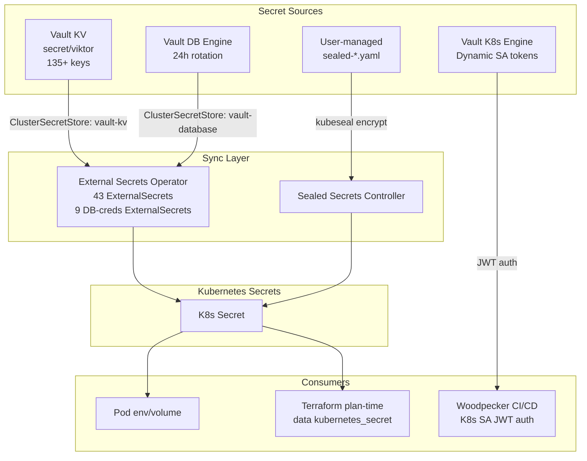
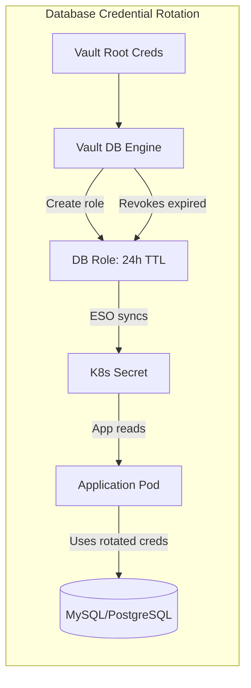

# Secrets Management Architecture

## Overview

Secrets management is centralized in HashiCorp Vault as the single source of truth for all API keys, tokens, passwords, SSH keys, and database credentials. External Secrets Operator (ESO) syncs secrets from Vault KV to Kubernetes Secrets. Vault's database engine handles automatic credential rotation for MySQL and PostgreSQL. CI/CD systems authenticate via Kubernetes service account tokens. Sealed Secrets provide user-managed encrypted secrets without Vault access. SOPS encrypts Terraform state files at rest.

## Architecture Diagram





## Components

| Component | Version | Location | Purpose |
|-----------|---------|----------|---------|
| HashiCorp Vault | Latest | `stacks/vault/` | Secret storage, dynamic credentials, rotation |
| External Secrets Operator | v1beta1 API | `stacks/external-secrets/` | Sync Vault secrets to K8s Secrets (52 total ExternalSecrets) |
| Sealed Secrets | Latest | `stacks/platform/` | User-managed encrypted secrets |
| SOPS | Latest | `scripts/state-sync`, `scripts/tg` | Terraform state encryption (Vault Transit + age) |
| Vault K8s Auth | Enabled | `stacks/vault/` | CI/CD authentication via service account tokens |
| Vault DB Engine | Enabled | `stacks/vault/` | Dynamic DB credentials for 6 MySQL + 8 PostgreSQL databases |

## How It Works

### Vault KV: Single Source of Truth

`secret/viktor` contains 135+ keys covering:
- API keys for external services
- Database root passwords
- SSH private keys
- OAuth/OIDC client secrets
- Application configuration secrets
- Encryption keys

Authentication: `vault login -method=oidc` (Authentik SSO) → `~/.vault-token` → read by Vault Terraform provider.

### External Secrets Operator (ESO)

ESO syncs secrets from Vault to Kubernetes using two ClusterSecretStores:

1. **vault-kv**: Reads from Vault KV (`secret/viktor`)
2. **vault-database**: Reads dynamic credentials from Vault DB engine

**52 total ExternalSecrets**:
- 43 standard ExternalSecrets (API keys, tokens, configs)
- 9 DB-creds ExternalSecrets (rotated database credentials)

ESO creates/updates K8s Secrets automatically when Vault values change. Applications consume these secrets via environment variables or volume mounts.

### Plan-Time Secret Access Pattern

**Recommended pattern** (no Vault dependency at plan time):

1. Apply ExternalSecret to create K8s Secret
2. Stack uses `data "kubernetes_secret"` to read ESO-created secret at plan time
3. No direct Vault provider needed in consuming stack

**First-apply gotcha**: Must apply ExternalSecret resource first, then run full apply (two-stage).

**Legacy pattern** (14 hybrid stacks still use):
- Direct `data "vault_kv_secret_v2"` for plan-time needs (job commands, Helm templatefile, module inputs)
- Platform stack has 48 plan-time Vault references (cannot migrate due to circular dependency)

### Database Credential Rotation

Vault DB engine provides automatic 24h credential rotation for:

**MySQL databases** (6):
- speedtest
- wrongmove
- codimd
- nextcloud
- shlink
- grafana

**PostgreSQL databases** (8):
- trading
- health
- linkwarden
- affine
- woodpecker
- claude_memory
- (2 others)

**Excluded from rotation**:
- authentik (uses PgBouncer, incompatible with rotation)
- technitium, crowdsec (Helm charts bake credentials at install time)
- Root user accounts (used for Vault itself to create rotated users)

Workflow:
1. ESO requests credentials from Vault DB engine
2. Vault creates new DB user with 24h TTL
3. ESO writes credentials to K8s Secret
4. Application reads credentials from secret
5. Vault automatically revokes user after 24h
6. ESO requests new credentials, cycle repeats

### Kubernetes Credential Management

Vault K8s secrets engine provides dynamic service account tokens:

**Roles**:
- `dashboard-admin`: Full cluster access for K8s dashboard
- `ci-deployer`: CI/CD deployment permissions
- `openclaw`: Claude Code container permissions
- `local-admin`: Local development cluster access

Usage:
```bash
vault write kubernetes/creds/ROLE kubernetes_namespace=NS
```

Returns a time-limited service account token and kubeconfig.

### CI/CD Secrets

**Woodpecker CI authentication**:
1. Woodpecker runner uses Kubernetes SA JWT
2. JWT validated via Vault K8s auth method
3. Woodpecker receives Vault token
4. Accesses secrets from `secret/ci/global`

**Secret sync CronJob**:
- Runs every 6h
- Reads `secret/ci/global` from Vault
- Pushes to Woodpecker API via HTTP
- Ensures CI secrets stay synchronized

### Sealed Secrets (User-Managed)

For users without Vault access (or git-friendly secret storage):

1. User creates plain K8s Secret YAML
2. Encrypts with `kubeseal` CLI → `sealed-*.yaml`
3. Commits encrypted file to git
4. In-cluster controller decrypts at apply time
5. Terraform picks up via `fileset()` + `for_each` on `kubernetes_manifest`

Public key stored in cluster, private key only accessible to controller.

### SOPS (State Encryption)

Terraform state files encrypted at rest:
- `.tfstate.enc` files in git
- Vault Transit engine (primary) + age key (fallback)
- Scripts: `scripts/state-sync` (encrypt/decrypt), `scripts/tg` (terragrunt wrapper)
- State decrypted in-memory during plan/apply, re-encrypted before commit

### Complex Types in Vault

Maps and lists stored as JSON strings in Vault KV:

```hcl
# In Vault: key = '{"endpoint": "https://...", "token": "..."}'
# In Terraform:
config = jsondecode(data.vault_kv_secret_v2.app.data["config"])
```

Required because Vault KV only supports string values at leaf nodes.

## Configuration

### Vault Paths

- **Main secrets**: `secret/viktor` (135+ keys)
- **CI/CD secrets**: `secret/ci/global`
- **Database engine**: `database/creds/ROLE` (dynamic)
- **Kubernetes engine**: `kubernetes/creds/ROLE` (dynamic)

### External Secrets Stack

**Location**: `stacks/external-secrets/`

**ClusterSecretStores**:
```yaml
apiVersion: external-secrets.io/v1beta1
kind: ClusterSecretStore
metadata:
  name: vault-kv
spec:
  provider:
    vault:
      server: "https://vault.viktorbarzin.me"
      path: secret
      version: v2
      auth:
        kubernetes:
          mountPath: kubernetes
          role: external-secrets
```

**ExternalSecret example**:
```yaml
apiVersion: external-secrets.io/v1beta1
kind: ExternalSecret
metadata:
  name: my-app-secrets
spec:
  refreshInterval: 1h
  secretStoreRef:
    name: vault-kv
    kind: ClusterSecretStore
  target:
    name: my-app-secrets
  data:
  - secretKey: API_KEY
    remoteRef:
      key: viktor
      property: my_app_api_key
```

### Vault Backup

**CronJob**: `vault-raft-backup`
- Uses manually-created `vault-root-token` K8s Secret
- Cannot use ESO (circular dependency during restore)
- Backs up Raft storage to S3-compatible backend

### Terraform Provider Auth

`~/.vault-token` created by `vault login -method=oidc`:

```hcl
provider "vault" {
  # Reads VAULT_ADDR from env
  # Reads token from ~/.vault-token
}
```

## Decisions & Rationale

### Why Vault over alternatives (AWS Secrets Manager, K8s Secrets, env files)?

**Centralized management**: Single source of truth for all secrets across infrastructure, applications, and CI/CD.

**Dynamic credentials**: Database and Kubernetes credentials rotated automatically, reducing blast radius of credential leaks.

**Audit logging**: Every secret access logged for security compliance.

**OIDC integration**: Secure human authentication via Authentik SSO (no static tokens for humans).

**Encryption at rest**: Secrets encrypted in Vault's storage backend.

### Why ESO over direct Vault injection (vault-agent, CSI driver)?

**Terraform compatibility**: `data "kubernetes_secret"` allows plan-time access without Vault provider dependency.

**Simpler pod configuration**: No sidecar containers or init containers required.

**Declarative sync**: ExternalSecret CRD describes desired state, ESO handles synchronization.

**Namespace isolation**: Each namespace can have its own ExternalSecrets without cluster-admin access to Vault.

### Why Sealed Secrets for users?

**No Vault access needed**: Users can encrypt secrets without Vault credentials.

**Git-friendly**: Encrypted YAML files can be committed safely to version control.

**Self-service**: Users manage their own secrets without admin intervention.

**Cluster-scoped encryption**: Encrypted for specific cluster, can't be decrypted elsewhere.

### Why SOPS for Terraform state?

**State contains secrets**: Terraform state includes sensitive values (DB passwords, API keys).

**Vault Transit integration**: Centralized key management (same as other encryption).

**Age fallback**: Offline decryption possible if Vault unavailable.

**Transparent workflow**: `scripts/tg` wrapper handles encrypt/decrypt automatically.

### Why Vault DB engine over static credentials?

**Automatic rotation**: 24h TTL reduces credential exposure window.

**Audit trail**: Every credential generation logged in Vault.

**Revocation**: Credentials automatically revoked at TTL expiration.

**Least privilege**: Each app gets unique credentials, not shared root password.

### Why exclude platform stack from Vault dependency?

**Circular dependency**: Vault runs on platform (storage, networking), platform can't wait for Vault.

**Bootstrap order**: Platform must deploy first, then Vault, then app stacks.

**Resilience**: Platform stack can be re-applied even if Vault is down.

## Troubleshooting

### ExternalSecret shows "SecretSyncedError"

1. Check Vault auth: `kubectl logs -n external-secrets deployment/external-secrets`
2. Verify Vault path exists: `vault kv get secret/viktor`
3. Check RBAC: ESO service account needs Vault role binding
4. Verify network: ESO pod can reach Vault service

### Rotated database credentials not working

1. Check Vault DB connection: `vault read database/config/my-db`
2. Verify role TTL: `vault read database/roles/my-app`
3. Check ESO refresh interval: ExternalSecret may not have synced yet
4. Verify app is reading latest secret: `kubectl get secret my-db-creds -o yaml`

### Terraform plan fails with "secret not found"

First-apply issue:
1. Apply ExternalSecret first: `terraform apply -target=kubernetes_manifest.external_secret`
2. Wait for ESO to create K8s Secret: `kubectl wait --for=condition=Ready externalsecret/my-secret`
3. Apply rest of stack: `terraform apply`

### CI/CD cannot access Vault

1. Check Woodpecker SA token: `kubectl get sa -n woodpecker woodpecker-runner -o yaml`
2. Verify Vault K8s auth config: `vault read auth/kubernetes/config`
3. Check Vault role binding: `vault read auth/kubernetes/role/ci-deployer`
4. Review Vault audit logs: `vault audit list`

### Sealed Secret won't decrypt

1. Verify controller is running: `kubectl get pods -n kube-system -l app=sealed-secrets`
2. Check encryption was for correct cluster: `kubeseal --fetch-cert` matches cert used for encryption
3. Review controller logs: `kubectl logs -n kube-system deployment/sealed-secrets-controller`
4. Ensure `sealed-*.yaml` hasn't been manually edited (breaks signature)

### SOPS state decryption fails

1. Check Vault access: `vault token lookup`
2. Verify Transit engine: `vault read transit/keys/terraform-state`
3. Check age key fallback: `~/.config/sops/age/keys.txt` exists
4. Run manual decrypt: `scripts/state-sync decrypt path/to/state.tfstate.enc`

### Complex type (map/list) not parsing from Vault

Ensure value in Vault is valid JSON:
```bash
vault kv get -field=my_config secret/viktor | jq .
```

If invalid JSON, update in Vault:
```bash
vault kv put secret/viktor my_config='{"key": "value"}'
```

In Terraform:
```hcl
config = jsondecode(data.vault_kv_secret_v2.app.data["my_config"])
```

## Related

- [Vault Deployment](../../stacks/vault/README.md) - Vault Terraform configuration
- [External Secrets Stack](../../stacks/external-secrets/README.md) - ESO deployment and ExternalSecret definitions
- [Backup & DR](./backup-dr.md) - Vault backup strategy
- [Monitoring](./monitoring.md) - Grafana OIDC via Authentik (Vault-stored client secret)
- [CI/CD Runbook](../runbooks/ci-cd.md) - Woodpecker Vault authentication
