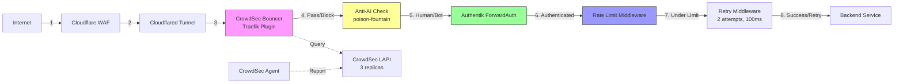

# Security & L7 Protection

## Overview

The homelab implements defense-in-depth security at the application layer (L7) using CrowdSec for threat intelligence and IP reputation, Kyverno for policy enforcement and resource governance, and a 3-layer anti-AI scraping defense (reduced from 5 in April 2026 after removing the rewrite-body plugin). All security components operate in graceful degradation mode (fail-open) to prevent cascading failures. Security policies are deployed in audit mode first, then selectively enforced after validation.

## Architecture Diagram



## Components

| Component | Version | Location | Purpose |
|-----------|---------|----------|---------|
| CrowdSec LAPI | Pinned | `stacks/crowdsec/` | Local API, threat intelligence aggregation (3 replicas) |
| CrowdSec Agent | Pinned | `stacks/crowdsec/` | Log parser, scenario detection |
| CrowdSec Traefik Bouncer | Plugin | Traefik config | Plugin-based IP reputation check |
| Kyverno | Pinned chart | `stacks/kyverno/` | Policy engine for K8s admission control |
| poison-fountain | Latest | `stacks/poison-fountain/` | Anti-AI bot detection and tarpit service |
| cert-manager/certbot | - | `stacks/cert-manager/` | TLS certificate management |
| Traefik | Latest | `stacks/platform/` | Ingress controller with HTTP/3 (QUIC) |

## How It Works

### Request Security Layers

Every incoming request passes through 6 security layers:

1. **Cloudflare WAF** - DDoS protection, bot detection, firewall rules (external)
2. **Cloudflared Tunnel** - Zero Trust tunnel, hides origin IP
3. **CrowdSec Bouncer** - IP reputation check against LAPI (fail-open on error)
4. **Anti-AI Scraping** - 3-layer bot defense (optional per service, updated 2026-04-17)
5. **Authentik ForwardAuth** - Authentication check (if `protected = true`)
6. **Rate Limiting** - Per-source IP rate limits (returns 429 on breach)
7. **Retry Middleware** - Auto-retry on transient errors (2 attempts, 100ms delay)

### CrowdSec Threat Intelligence

CrowdSec operates in a hub-and-agent model:

**LAPI (Local API)**:
- 3 replicas for high availability
- Aggregates threat intelligence from agent + community
- Maintains ban list (IP reputation database)
- Version pinned to prevent breaking changes

**Agent**:
- Parses Traefik access logs
- Detects attack scenarios (SQL injection, directory traversal, brute force)
- Reports malicious IPs to LAPI
- Shares threat intel with CrowdSec community (anonymized)

**Traefik Bouncer Plugin**:
- Integrated as Traefik middleware
- Queries LAPI for IP reputation on each request
- **Fail-open mode**: If LAPI unreachable, allows traffic (graceful degradation)
- Blocks IPs on ban list, allows others

**Metabase** (disabled by default):
- Dashboard for CrowdSec analytics
- CPU-intensive, only enable when investigating incidents

### Kyverno Policy Engine

Kyverno enforces cluster-wide policies via admission webhooks. All policies use `failurePolicy=Ignore` to prevent blocking cluster operations.

#### 5-Tier Resource Governance

Namespaces are labeled with a tier (`tier: 0` through `tier: 4`). Kyverno auto-generates:

- **LimitRange** - Per-container CPU/memory limits
- **ResourceQuota** - Namespace-wide resource caps

| Tier | CPU Limit/Container | Memory Limit/Container | Namespace CPU Quota | Namespace Memory Quota |
|------|---------------------|------------------------|---------------------|------------------------|
| 0 | 100m | 128Mi | 500m | 512Mi |
| 1 | 250m | 256Mi | 1000m | 1Gi |
| 2 | 500m | 512Mi | 2000m | 2Gi |
| 3 | 1000m | 1Gi | 4000m | 4Gi |
| 4 | 2000m | 2Gi | 8000m | 8Gi |

This prevents resource exhaustion and enforces governance without manual quota management.

#### Security Policies (ALL in Audit Mode)

**Why audit mode?** Gradual rollout without breaking existing workloads. Policies collect violations, then selectively enforced after cleanup.

| Policy | Purpose | Enforcement |
|--------|---------|-------------|
| `deny-privileged-containers` | Block privileged pods | Audit |
| `deny-host-namespaces` | Block hostNetwork/hostPID/hostIPC | Audit |
| `restrict-sys-admin` | Block CAP_SYS_ADMIN | Audit |
| `require-trusted-registries` | Only allow approved image registries | Audit |

#### Operational Policies

| Policy | Purpose | Mode |
|--------|---------|------|
| `inject-priority-class-from-tier` | Set pod priorityClass based on namespace tier | Enforce (CREATE only) |
| `inject-ndots` | Set DNS `ndots:2` for faster lookups | Enforce |
| `sync-tier-label` | Propagate tier label to child resources | Enforce |
| `goldilocks-vpa-auto-mode` | Disable VPA globally (VPA off) | Enforce |

### Anti-AI Scraping (3 Active Layers) (Updated 2026-04-17)

Enabled by default via `ingress_factory` module. Disable per-service with `anti_ai_scraping = false`.

Active middleware chain: `ai-bot-block` (ForwardAuth) + `anti-ai-headers` (X-Robots-Tag). The `strip-accept-encoding` and `anti-ai-trap-links` middlewares were removed in April 2026 due to Traefik v3.6.12 Yaegi plugin incompatibility with the rewrite-body plugin.

#### Layer 1: Bot Blocking (ForwardAuth)

- Middleware calls `poison-fountain` service before backend
- Analyzes User-Agent, request patterns, timing
- Blocks known AI scrapers (GPTBot, CCBot, etc.)
- **Fail-open**: If poison-fountain down, allows traffic

#### Layer 2: X-Robots-Tag Header

- HTTP response header: `X-Robots-Tag: noai, noindex, nofollow`
- Instructs compliant bots to skip content
- Lightweight, no performance impact

#### ~~Layer 3: Trap Links~~ (REMOVED)

Removed April 2026. The rewrite-body Traefik plugin used to inject hidden trap links broke on Traefik v3.6.12 due to Yaegi runtime bugs. The companion `strip-accept-encoding` middleware was also removed.

#### Layer 3 (formerly 4): Tarpit / Poison Content

- `poison-fountain` service still exists as a standalone service at `poison.viktorbarzin.me`
- Serves AI bots extremely slowly (~100 bytes/sec tarpit)
- CronJob every 6 hours generates fake content
- Trap links are no longer injected into real pages, but bots that discover `poison.viktorbarzin.me` directly still get tarpitted and poisoned

**Implementation**: See `stacks/poison-fountain/` and `stacks/platform/modules/traefik/middleware.tf`

### TLS & HTTP/3

**Traefik** handles TLS termination:
- HTTP/3 (QUIC) enabled for performance
- Automatic HTTP → HTTPS redirect
- cert-manager/certbot manages certificate lifecycle
- Let's Encrypt integration for automatic renewal

### Rate Limiting

**Per-source IP limits**:
- Default: 100 requests/minute
- Returns **429 Too Many Requests** (not 503)
- Higher limits for upload-heavy services:
  - Immich: 500 req/min (photo uploads)
  - Nextcloud: 300 req/min (file sync)

**Retry Middleware**:
- 2 attempts max
- 100ms delay between retries
- Applied after rate limiting
- Handles transient backend errors

### Fallback Proxies

**Authentik Fallback**:
- If Authentik down, falls back to basicAuth
- Prevents total service outage during IdP maintenance
- Temporary credentials stored in Vault

**Poison-Fountain Fallback**:
- If anti-AI service down, allows all traffic
- Fail-open prevents blocking legitimate users
- Monitors for service health, auto-recovers

## Configuration

### Key Config Files

| Path | Purpose |
|------|---------|
| `stacks/crowdsec/` | CrowdSec LAPI, agent, bouncer config |
| `stacks/kyverno/` | Kyverno deployment + policies |
| `stacks/poison-fountain/` | Anti-AI service + CronJob |
| `stacks/platform/modules/traefik/middleware.tf` | Security middleware definitions |
| `stacks/platform/modules/ingress_factory/` | Per-service security toggles |

### Vault Paths

- **CrowdSec API key**: `secret/crowdsec/api-key` - LAPI authentication
- **BasicAuth fallback**: `secret/authentik/fallback-creds` - Emergency auth
- **TLS certificates**: `secret/tls/` - Certificate private keys

### Terraform Stacks

- `stacks/crowdsec/` - CrowdSec infrastructure
- `stacks/kyverno/` - Policy engine
- `stacks/poison-fountain/` - Anti-AI defense
- `stacks/platform/` - Traefik + middleware

### Per-Service Security Config

```hcl
module "myapp_ingress" {
  source = "./modules/ingress_factory"

  name      = "myapp"
  host      = "myapp.viktorbarzin.me"

  # Security toggles
  protected         = true   # Enable ForwardAuth
  anti_ai_scraping  = false  # Disable anti-AI (e.g., for public API)
  rate_limit        = 200    # Custom rate limit (req/min)
}
```

### Kyverno Policy Example

```yaml
apiVersion: kyverno.io/v1
kind: ClusterPolicy
metadata:
  name: inject-ndots
spec:
  background: false
  rules:
  - name: inject-ndots
    match:
      resources:
        kinds:
        - Pod
    mutate:
      patchStrategicMerge:
        spec:
          dnsConfig:
            options:
            - name: ndots
              value: "2"
```

## Decisions & Rationale

### Why CrowdSec over ModSecurity?

- **Community threat intelligence**: Shared ban lists, crowdsourced attack detection
- **Easier management**: YAML scenarios vs complex ModSecurity rules
- **Better performance**: Lightweight Go agent vs resource-heavy Apache module
- **Active development**: More frequent updates, responsive community

### Why Audit-Only Security Policies?

- **Gradual rollout**: Identify violations without breaking existing workloads
- **Risk reduction**: Prevents policy bugs from blocking critical deployments
- **Better observability**: Collect violation metrics before enforcing
- **Selective enforcement**: Move to enforce mode per-policy after validation

### Why Multi-Layer Anti-AI Defense? (Updated 2026-04-17)

- **Defense in depth**: Each layer catches different bot types
- **Compliant bots**: Layer 2 (X-Robots-Tag) handles respectful crawlers
- **Persistent bots**: Tarpit makes scraping uneconomical
- **Poison content**: Degrades training data for bots that reach poison-fountain
- Layer 3 (trap links via rewrite-body) was removed due to Traefik v3 plugin incompatibility

### Why Fail-Open Mode?

- **Availability over security**: Homelab prioritizes uptime
- **Graceful degradation**: Single component failure doesn't cascade
- **Manual intervention**: Security incidents are rare, can handle manually
- **Layer redundancy**: If one layer fails, others still protect

### Why Pin CrowdSec/Kyverno Versions?

- **Breaking changes**: Both projects had breaking config changes in past
- **Controlled upgrades**: Test in staging before upgrading production
- **Stability**: Prevents auto-upgrade during outages
- **Rollback**: Easy to revert if upgrade causes issues

### Why HTTP/3 (QUIC)?

- **Performance**: Lower latency, better mobile performance
- **Connection migration**: Survives IP changes (mobile networks)
- **0-RTT**: Faster TLS handshake for repeat visitors
- **Future-proof**: Industry moving to HTTP/3

## Troubleshooting

### CrowdSec Blocking Legitimate IP

**Problem**: Legitimate user IP on ban list.

**Fix**:
1. Check LAPI decisions: `kubectl exec -it crowdsec-lapi-0 -- cscli decisions list`
2. Remove ban: `kubectl exec -it crowdsec-lapi-0 -- cscli decisions delete --ip <IP>`
3. Whitelist if needed: Add to `stacks/crowdsec/whitelist.yaml`

### Kyverno Policy Blocking Deployment

**Problem**: Pod creation fails with policy violation.

**Fix**:
1. Check policy reports: `kubectl get policyreport -A`
2. Verify `failurePolicy=Ignore` is set (should never block)
3. If blocking, temporarily disable policy: `kubectl annotate clusterpolicy <policy> kyverno.io/exclude=true`
4. Investigate root cause, fix workload or update policy

### Anti-AI Service Down, Traffic Blocked

**Problem**: `poison-fountain` service unhealthy, all traffic blocked.

**Fix**:
1. Verify fail-open config: Check `stacks/platform/modules/traefik/middleware.tf` for `failurePolicy: allow`
2. Restart service: `kubectl rollout restart deployment/poison-fountain -n poison-fountain`
3. Temporary disable: Set `anti_ai_scraping = false` in `ingress_factory` for affected services

### Rate Limit Too Aggressive

**Problem**: Legitimate users getting 429 errors.

**Fix**:
1. Check Traefik logs for rate limit hits: `kubectl logs -n traefik -l app=traefik | grep 429`
2. Increase limit in `ingress_factory`: `rate_limit = 300`
3. Apply: `terraform apply`

### HTTP/3 Not Working

**Problem**: Browser shows HTTP/2, not HTTP/3.

**Fix**:
1. Verify Traefik HTTP/3 enabled: `kubectl get cm traefik-config -o yaml | grep http3`
2. Check UDP port 443 accessible: `nc -u <public-ip> 443`
3. Browser support: Use Chrome/Firefox dev tools, check Protocol column

### TLS Certificate Expired

**Problem**: Browser shows certificate expired.

**Fix**:
1. Check cert-manager: `kubectl get certificate -A`
2. Force renewal: `kubectl delete secret <tls-secret> -n <namespace>`
3. cert-manager will auto-renew within 5 minutes
4. If fails, check Let's Encrypt rate limits

### Traefik Retry Loop

**Problem**: Backend logs show duplicate requests.

**Fix**:
1. Check retry middleware config: Should be 2 attempts max
2. Verify backend isn't returning transient errors: Check for 5xx responses
3. Disable retry for specific service: Remove retry middleware from `ingress_factory`

### Poison Content Not Serving (Updated 2026-04-17)

**Problem**: Bots not receiving poisoned content on `poison.viktorbarzin.me`.

**Note**: Poison content is no longer injected into real pages (rewrite-body removed). It is only served directly via the `poison.viktorbarzin.me` subdomain.

**Fix**:
1. Verify CronJob running: `kubectl get cronjob -n poison-fountain`
2. Check logs: `kubectl logs -n poison-fountain -l app=poison-fountain`
3. Manually trigger: `kubectl create job --from=cronjob/poison-content manual-poison`

## Related

- [Authentication & Authorization](./authentication.md) - Authentik, OIDC, ForwardAuth
- [Networking](./networking.md) - Ingress, DNS, load balancing
- [Monitoring](./monitoring.md) - Prometheus, Grafana, alerting
- [CrowdSec Runbook](../runbooks/crowdsec.md) - CrowdSec operations
- [Kyverno Policy Management](../runbooks/kyverno.md) - Policy authoring and troubleshooting
