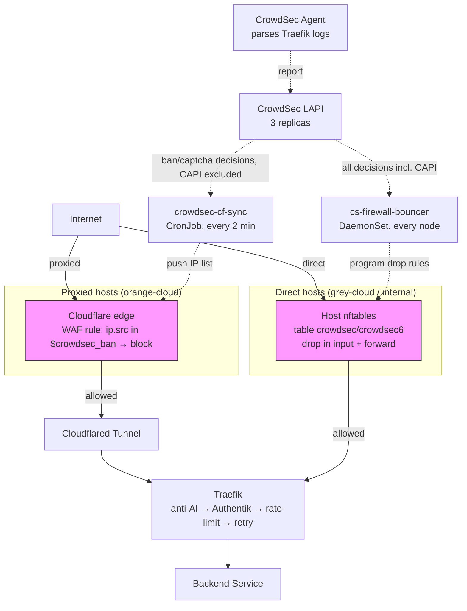

# Security & L7 Protection

## Overview

The homelab implements defense-in-depth security using CrowdSec for threat intelligence and IP reputation, Kyverno for policy enforcement and resource governance, and a 3-layer anti-AI scraping defense (reduced from 5 in April 2026 after removing the rewrite-body plugin). CrowdSec enforcement is **out-of-band** (not a per-request Traefik hop — see the CrowdSec section): banned IPs are dropped in-kernel via nftables on direct hosts, and blocked at the Cloudflare edge on proxied hosts, so enforcement adds **zero per-request latency**. All security components fail open (a CrowdSec outage stops new bans but never blocks legitimate traffic). Security policies are deployed in audit mode first, then selectively enforced after validation.

## Architecture Diagram

CrowdSec enforcement is out-of-band (NOT an inline Traefik middleware hop). The
Traefik request chain is anti-AI → Authentik ForwardAuth → rate-limit → retry;
CrowdSec drops banned IPs *before* (direct hosts) or *off* (proxied hosts) that
chain entirely.



## Components

| Component | Version | Location | Purpose |
|-----------|---------|----------|---------|
| CrowdSec LAPI | Pinned | `stacks/crowdsec/` | Local API, threat intelligence aggregation (3 replicas) |
| CrowdSec Agent | Pinned | `stacks/crowdsec/` | Log parser, scenario detection |
| cs-firewall-bouncer | v0.0.34 | `stacks/crowdsec/modules/crowdsec/firewall_bouncer.tf` | In-kernel nftables drop on every node (DIRECT hosts). Bouncer key `firewall` |
| crowdsec-cf-sync | — | `stacks/rybbit/crowdsec_edge.tf` | LAPI→Cloudflare-IP-List sync CronJob (PROXIED hosts). Bouncer key `kvsync` |
| Kyverno | Pinned chart | `stacks/kyverno/` | Policy engine for K8s admission control |
| poison-fountain | Latest | `stacks/poison-fountain/` | Anti-AI bot detection and tarpit service |
| cert-manager/certbot | - | `stacks/cert-manager/` | TLS certificate management |
| Traefik | Latest | `stacks/platform/` | Ingress controller with HTTP/3 (QUIC) |

## How It Works

### Request Security Layers

CrowdSec IP-reputation enforcement happens **before** a request reaches the
Traefik chain (banned IPs are dropped in-kernel on direct hosts, or blocked at
the Cloudflare edge on proxied hosts — see CrowdSec Threat Intelligence below).
A request that survives that out-of-band gate then passes through the Traefik
middleware chain:

1. **Cloudflare WAF / edge** - DDoS protection, bot detection, firewall rules incl. the CrowdSec `crowdsec_ban` block rule (proxied hosts only)
2. **Cloudflared Tunnel** - Zero Trust tunnel, hides origin IP (proxied hosts)
3. **CrowdSec out-of-band drop** - nftables on direct hosts; *not* a Traefik hop (zero per-request latency)
4. **Anti-AI Scraping** - 3-layer bot defense (optional per service, updated 2026-04-17)
5. **Authentik ForwardAuth** - Authentication check (if `protected = true`)
6. **Rate Limiting** - Per-source IP rate limits (returns 429 on breach)
7. **Retry Middleware** - Auto-retry on transient errors (2 attempts, 100ms delay)

### CrowdSec Threat Intelligence

CrowdSec operates in a hub-and-agent model:

**LAPI (Local API)**:
- 3 replicas for high availability
- Aggregates threat intelligence from agent + community
- Maintains ban list (IP reputation database)
- Version pinned to prevent breaking changes

**Agent**:
- Parses Traefik access logs
- Detects attack scenarios (SQL injection, directory traversal, brute force)
- Reports malicious IPs to LAPI
- Shares threat intel with CrowdSec community (anonymized)

Enforcement is split across **two out-of-band surfaces**, neither of which adds
any per-request latency. (See "Why the Traefik bouncer plugin was removed" below
for the supersession history — there is no longer an inline Traefik bouncer.)

**Surface 1 — DIRECT (non-Cloudflare-proxied) hosts → in-kernel nftables drop**
(`cs-firewall-bouncer` DaemonSet, `stacks/crowdsec/modules/crowdsec/firewall_bouncer.tf`):
- Runs on **every node** (no nodeSelector). Programs the HOST nftables — `table ip
  crowdsec` / `table ip6 crowdsec6` — with drop rules in **both the `input` AND
  the `forward` hooks**. The `forward` hook is required because Traefik is a
  LoadBalancer with `externalTrafficPolicy=Local`: client traffic is DNAT'd to the
  Traefik **pod** and transits the node's `forward` hook (not `input`) with the
  real client IP preserved. Chains use `policy accept` (only set members drop —
  it can never blackhole normal traffic).
- Pulls **all** decisions from LAPI, **including the CAPI community blocklist
  (~31k IPs)**. Packets from banned IPs are dropped **in-kernel before reaching
  Traefik** → zero per-request hops, no Traefik involvement at all.
- **Packaging**: cs-firewall-bouncer publishes no container image, so the
  **v0.0.34** static binary is fetched at runtime by an initContainer onto a
  `debian:bookworm-slim` runtime container. Needs `hostNetwork` +
  `NET_ADMIN`/`NET_RAW` to talk netlink directly. Registered bouncer key:
  **`firewall`**.
- **Fail-open**: if LAPI is unreachable it just stops receiving new decisions
  (existing drop rules persist); it never blocks legitimate traffic.

**Surface 2 — PROXIED (Cloudflare orange-cloud) hosts → Cloudflare edge block**
(`stacks/rybbit/crowdsec_edge.tf` + `lapi_kv_sync.py`):
- Proxied hosts terminate at the Cloudflare edge, so a host-level nftables drop
  would never see them. Enforcement is instead a single Cloudflare Rules List
  **`crowdsec_ban`** + a zone-scoped WAF custom rule `(ip.src in $crowdsec_ban)`
  → **block** action, which covers every proxied host in the zone.
- Fed by the **`crowdsec-cf-sync` CronJob** (namespace `rybbit`, every 2 min,
  pure-stdlib Python in a ConfigMap). It pulls local **ban/captcha ip-scoped**
  decisions and pushes them into the CF list, but **EXCLUDES the ~31k CAPI
  community blocklist** — that set is far too large for a CF Rules List (the CF
  account hard-limits to **one** list), and CAPI is already covered in-kernel on
  direct hosts and by Cloudflare's own managed protections on proxied hosts.
  Registered bouncer key: **`kvsync`**.
- **Rate-limit resilient (2026-06-27):** Cloudflare's Lists-API *write* endpoint
  is throttled (~per-60s; `429 retry-after`). The CronJob runs `backoff_limit=0`
  (one POST per cycle — the `*/2` schedule IS the retry cadence) and treats a CF
  `429` as a soft-skip (exit 0, retry next cycle), the same fail-safe pattern it
  uses for LAPI. An earlier `backoff_limit=2` fired 3 rapid POSTs/cycle and
  escalated the throttle into a stuck state that left the list empty — a
  self-inflicted DoS that this change prevents.
- **Block-only**: the single-list limit precludes a separate
  captcha/managed-challenge list, so both ban and captcha decisions are enforced
  as a plain block at the edge.
- **Auth carve-out:** the WAF rule excludes `authentik.viktorbarzin.me` +
  `public-auth.viktorbarzin.me` (`… and not (http.host in {…})`). A CrowdSec hit
  must never wall a user out of the login / WebAuthn flow they authenticate
  through; auth keeps `traefik-rate-limit` for brute-force protection.

**Whitelist** (`stacks/crowdsec/whitelist.yaml`): a CrowdSec whitelist covers
RFC1918 + the tailnet + internal CIDRs (plus one specific external IP), so
internal users are never enforced. Internal access uses split-horizon DNS
straight to Traefik, and direct internal clients are RFC1918 — both whitelisted.

#### Why the Traefik bouncer plugin was removed

Enforcement used to run as an inline Traefik middleware — the
`crowdsec-bouncer-traefik-plugin` (Yaegi/Lua), which queried LAPI on every
request and could serve a Cloudflare Turnstile captcha for soft remediations.
On **Traefik 3.7.5 the Yaegi handler was never invoked**, so the bouncer was
registered but enforced **nothing** despite appearing healthy. Rather than chase
the Yaegi runtime, the whole plugin path was **removed** (2026-06): the plugin
static config + initContainer download, the `crowdsec` Middleware CRD, the
`captcha.html` template + its ConfigMap and volume mount, and the Cloudflare
Turnstile widget (`cloudflare_turnstile_widget.crowdsec_captcha`). It was
replaced by the two out-of-band surfaces above, which add zero per-request
latency and fail open. (The earlier `crowdsec-cf-sync` cursor-pagination /
IP-List-capacity issues are also moot now that CAPI is excluded from the edge
list and dropped in-kernel instead.)

**Metabase** (disabled by default):
- Dashboard for CrowdSec analytics
- CPU-intensive, only enable when investigating incidents

### Kyverno Policy Engine

Kyverno enforces cluster-wide policies via admission webhooks. All policies use `failurePolicy=Ignore` to prevent blocking cluster operations.

#### 5-Tier Resource Governance

Namespaces are labeled with a tier (`tier: 0` through `tier: 4`). Kyverno auto-generates:

- **LimitRange** - Per-container CPU/memory limits
- **ResourceQuota** - Namespace-wide resource caps

| Tier | CPU Limit/Container | Memory Limit/Container | Namespace CPU Quota | Namespace Memory Quota |
|------|---------------------|------------------------|---------------------|------------------------|
| 0 | 100m | 128Mi | 500m | 512Mi |
| 1 | 250m | 256Mi | 1000m | 1Gi |
| 2 | 500m | 512Mi | 2000m | 2Gi |
| 3 | 1000m | 1Gi | 4000m | 4Gi |
| 4 | 2000m | 2Gi | 8000m | 8Gi |

This prevents resource exhaustion and enforces governance without manual quota management.

#### Security Policies

**Why audit mode first?** Gradual rollout without breaking existing workloads. Policies collect violations, then selectively enforced after cleanup.

**Wave 1 plan (locked 2026-05-18, see beads `code-8ywc`):** all four below flip from Audit → Enforce with `failurePolicy: Ignore` preserved and an exclude list covering the 31 critical namespaces (keel, calico-system, authentik, vault, cnpg-system, dbaas, monitoring, traefik, technitium, mailserver, kyverno, metallb-system, external-secrets, proxmox-csi, nfs-csi, nvidia, kube-system, cloudflared, crowdsec, reverse-proxy, reloader, descheduler, vpa, redis, sealed-secrets, headscale, wireguard, xray, infra-maintenance, metrics-server, tigera-operator). Phased: one policy per day with PolicyReport observation.

| Policy | Purpose | Current | Planned (wave 1) |
|--------|---------|---------|------------------|
| `deny-privileged-containers` | Block privileged pods | Audit | **Enforce** |
| `deny-host-namespaces` | Block hostNetwork/hostPID/hostIPC | Audit | **Enforce** |
| `restrict-sys-admin` | Block CAP_SYS_ADMIN | Audit | **Enforce** |
| `require-trusted-registries` | Only allow approved image registries (forgejo.viktorbarzin.me, docker.io, ghcr.io, quay.io, registry.k8s.io, gcr.io, oci://ghcr.io/sergelogvinov) | Audit | **Enforce** |

Cosign `verify-images` is **deferred** beyond wave 1 — needs image-signing infrastructure (Sigstore / cosign + KMS) before it can enforce meaningfully.

#### Operational Policies

| Policy | Purpose | Mode |
|--------|---------|------|
| `inject-priority-class-from-tier` | Set pod priorityClass based on namespace tier | Enforce (CREATE only) |
| `inject-ndots` | Set DNS `ndots:2` for faster lookups | Enforce |
| `sync-tier-label` | Propagate tier label to child resources | Enforce |
| `goldilocks-vpa-auto-mode` | Disable VPA globally (VPA off) | Enforce |

### Anti-AI Scraping (3 Active Layers) (Updated 2026-04-17)

Enabled by default via `ingress_factory` module. Disable per-service with `anti_ai_scraping = false`.

Active middleware chain: `ai-bot-block` (ForwardAuth) + `anti-ai-headers` (X-Robots-Tag). The `strip-accept-encoding` and `anti-ai-trap-links` middlewares were removed in April 2026 due to Traefik v3.6.12 Yaegi plugin incompatibility with the rewrite-body plugin.

#### Layer 1: Bot Blocking (ForwardAuth)

- `ai-bot-block` middleware forward-auths to the `bot-block-proxy` openresty
  service (`stacks/traefik/modules/traefik/main.tf`) — the bot-check hop before
  the backend.
- **Currently a no-op (allow-all).** `poison-fountain` is intentionally scaled
  to 0 (clears the ExternalAccessDivergence alert), so `bot-block-proxy`
  short-circuits `/auth` to `return 200 "allowed"` instead of proxying to an
  absent upstream. Same effective behaviour as the previous `proxy_pass` +
  `error_page 5xx=200` fail-open, minus the ~51k/hr upstream-connect error logs
  and per-request connect latency it generated (cleaned up 2026-06-05, found via
  Loki). The Deployment carries `configmap.reloader.stakater.com/reload` so
  config changes actually reload openresty (it does not hot-reload on its own).
- **To re-enable real bot-blocking**: restore the `upstream poison_fountain` +
  `proxy_pass http://poison_fountain;` block in the `bot-block-proxy-config`
  ConfigMap (git history) and scale `poison-fountain` up. It then forward-auths
  bot checks (User-Agent / patterns) and tarpits known AI scrapers, fail-open if
  poison-fountain is down.

#### Layer 2: X-Robots-Tag Header

- HTTP response header: `X-Robots-Tag: noai, noindex, nofollow`
- Instructs compliant bots to skip content
- Lightweight, no performance impact

#### ~~Layer 3: Trap Links~~ (REMOVED)

Removed April 2026. The rewrite-body Traefik plugin used to inject hidden trap links broke on Traefik v3.6.12 due to Yaegi runtime bugs. The companion `strip-accept-encoding` middleware was also removed.

#### Layer 3 (formerly 4): Tarpit / Poison Content

- `poison-fountain` exists as a standalone service at `poison.viktorbarzin.me` but the serving Deployment is **scaled to 0** (replicas=0); only its 6-hourly content-fetch CronJob runs. The tarpit is therefore dormant until re-enabled.
- When running: serves AI bots extremely slowly (~50 bytes / 0.5s tarpit drip)
- CronJob every 6 hours generates fake content
- Trap links are no longer injected into real pages, but bots that discover `poison.viktorbarzin.me` directly would get tarpitted and poisoned

**Implementation**: See `stacks/poison-fountain/` and `stacks/traefik/modules/traefik/{middleware.tf,main.tf}` (traefik moved from the platform stack to its own `traefik` stack)

### Audit Logging & Anomaly Detection (Wave 1)

Beads epic: `code-8ywc`. **Status: partially live as of 2026-05-18.**

| Item | State |
|---|---|
| W1.2 Vault `file` audit device | **LIVE** — `vault_audit.file` in `stacks/vault/main.tf:287`, writing to `/vault/audit/vault-audit.log` on `proxmox-lvm-encrypted` PVC |
| W1.2 Vault `x_forwarded_for_authorized_addrs = 10.10.0.0/16` | **LIVE** — applied via `tg apply -target=helm_release.vault` on 2026-05-18; all 3 vault pods restarted cleanly |
| W1.2 Vault audit log shipping to Loki | **LIVE** — `audit-tail` sidecar in vault pods + Alloy DaemonSet ships to Loki with `container="audit-tail"`. Verified via `{namespace="vault",container="audit-tail"}` LogQL query. |
| W1.1 K8s API audit policy + shipping | **LIVE** — kube-apiserver audit policy was already configured (Metadata level, `/var/log/kubernetes/audit.log`, 7d retention). Alloy DaemonSet now tolerates control-plane taint, scrapes the audit log file, ships to Loki with `job=kubernetes-audit`. K2-K9 alert rules in Loki ruler. |
| W1.3 Source-IP anomaly rules (K9, V7, S1) | **LIVE** (K9, V7, S1). **S1 activated 2026-06-10** — promtail on the PVE host now ships the journal to Loki (`scripts/pve-promtail.yaml`); sshd auth lands as `job=sshd-pve` (the S1 data source). The same shipper carries snoopy `execve()` command audit as `{job="pve-journal", identifier="snoopy"}` (forensic, not alerting). Deployed because emo's agent was given root SSH to the host (shared key) — see `docs/architecture/monitoring.md` → "External host: pve". |
| W1.4 Kyverno security policies → Enforce | **LIVE** — 3 policies in Enforce mode with 35-namespace exclude list. |
| W1.5 Kyverno trusted-registries → Enforce | **LIVE** — explicit allowlist (15 registries + 6 DockerHub library bare names + 56 DockerHub user repos). Verified by admission dry-run: `evilcorp.example/malware:v1` BLOCKED, `alpine:3.20` and `docker.io/library/alpine:3.20` ALLOWED. |
| W1.6 Calico observe-phase (pilot: recruiter-responder) | **LIVE** (2026-05-19) — GlobalNetworkPolicy `wave1-egress-observe-recruiter-responder` with rules `[action:Log, action:Allow]`. FelixConfiguration.flowLogsFileEnabled approach abandoned (Calico Enterprise-only field, rejected by OSS v3.26). Log action emits iptables LOG with prefix `calico-packet: ` → kernel → journald → Alloy → Loki. Verified: `{job="node-journal"} \|~ "calico-packet"` returns real packet metadata (SRC/DST/PROTO). Expand to more namespaces by adding to `namespaceSelector`. |
| W1.7 NetworkPolicy phased enforce | **PARTIAL ANALYSIS** — first observation snapshot at `docs/architecture/wave1-egress-observation-2026-05-22.md` (36 source namespaces seen so far, 29 thin-profile candidates). Recommend continuing observation through 2026-05-29 (full week) before any enforce flip. Pilot enforce target: `recruiter-responder` (2 destinations only). `servarr` stays in Log+Allow indefinitely (BitTorrent P2P incompatible with static enforce). |

The block below documents the locked design.

Response model: **(I) Slack-only, daily skim.** All security alerts post to **`#alerts`** via Alertmanager (the `slack-security` receiver keeps its distinct `[SECURITY/<sev>]` title styling so security-lane alerts still stand out). The dedicated `#security` channel was abandoned (2026-06-25) — the shared `alertmanager_slack_api_url` incoming webhook's Slack app isn't a member of it, so a channel override there returns HTTP `404 channel_not_found`; everything consolidated to `#alerts`. No paging. Mean detection time accepted as ~12-24h; the design weight sits on prevention (Kyverno enforce, NetworkPolicy default-deny egress) rather than runtime detection.

#### Detection sources

| Source | Mechanism | Ships via | Loki job label |
|---|---|---|---|
| K8s API audit log | Custom audit policy on kube-apiserver: drop `get`/`list`/`watch` at `None` for most resources, log writes at `Metadata`, secret reads at `Metadata`, `exec`/`portforward` at `RequestResponse`, exclude kubelet+controller-manager noise. Codified in `stacks/infra` kubeadm config templating. | Alloy DaemonSet tails `/var/log/kubernetes/audit/*.log` | `job=kube-audit` |
| Vault audit log | `file` audit device on existing Vault PVC. Vault listener config sets `x_forwarded_for_authorized_addrs` trusting Traefik pod CIDR so `remote_addr` is the real client IP, not Traefik's. | Alloy tails audit log file | `job=vault-audit` |
| PVE sshd auth log | journald (`_SYSTEMD_UNIT=ssh.service`, `SYSLOG_IDENTIFIER=sshd-session`); promtail relabels `identifier=~"sshd.*"` → `job=sshd-pve` | promtail systemd unit on Proxmox host (192.168.1.127), `scripts/pve-promtail.yaml` — **LIVE 2026-06-10** | `job=sshd-pve` |
| Calico flow log | `flowLogsFileEnabled: true` in Calico Felix config | Alloy (cluster-wide) | `job=calico-flow` (W1.6 only) |

#### Alert rules (16 total)

Routed via **Loki ruler → Alertmanager → the `slack-security` receiver, which posts to `#alerts`** (it keeps its `[SECURITY/<sev>]` title styling so security-lane alerts stand out there; the dedicated `#security` channel was abandoned 2026-06-25 — the shared webhook's Slack app isn't a member of it). Same handling path as existing infra alerts — silenceable in Alertmanager UI, history queryable, severity labels (critical/warning/info) carried in the alert.

**K8s API audit (K2-K9, 8 rules — K1 cluster-admin-grant intentionally skipped):**

| # | Event | Severity |
|---|---|---|
| K2 | ServiceAccount token used from outside cluster (sourceIPs not in pod CIDR or trusted LAN) | critical |
| K3 | Secret READ in `vault`, `sealed-secrets`, `external-secrets` namespaces by a non-allowlisted ServiceAccount | critical |
| K4 | Exec into a pod in `vault`, `kube-system`, `dbaas`, `cnpg-system` (excluding `me@viktorbarzin.me` + 1 break-glass SA) | warning |
| K5 | >5 deletes of `Pod`, `Secret`, or `ConfigMap` in 60s by any single actor | critical |
| K6 | `audit-log-path` flag or audit policy modified on kube-apiserver | critical |
| K7 | New ClusterRole created with `verbs: ["*"]` and `resources: ["*"]` | warning |
| K8 | Anonymous binding granted (any RoleBinding/CRB referencing `system:anonymous` or `system:unauthenticated`) | critical |
| K9 | Authenticated request where `user.username == "me@viktorbarzin.me"` AND `sourceIPs[0]` NOT in allowlist CIDRs | critical |

**Vault audit (V1-V7):**

| # | Event | Severity |
|---|---|---|
| V1 | Root token created | critical |
| V2 | Audit device disabled or modified | critical |
| V3 | Seal status changed (`sys/seal` write) | critical |
| V4 | Policy written or modified (allowlist Terraform-driven writes by source IP / token role) | warning |
| V5 | Authentication failure spike >10/min on any auth method | warning |
| V6 | Token created with policies different from parent (privilege escalation) | critical |
| V7 | Vault audit event where `auth.entity_id == <viktor-entity-id>` AND `remote_addr` NOT in allowlist CIDRs | critical |

**Host (S1):**

| # | Event | Severity |
|---|---|---|
| S1 | PVE sshd auth success from source IP NOT in allowlist | critical |

#### Allowlist — "expected source IPs" for K2, K9, V7, S1

| CIDR | Source |
|---|---|
| `10.0.20.0/22` | VLAN 20 (K8s cluster + main LAN) |
| `10.0.10.0/24` | VLAN 10 (devvm) — **K2/K9 only** (added 2026-07-06). The devvm legitimately uses ServiceAccount-token kubeconfigs against the apiserver (e.g. `chrome-service:emo-browser` doing `kubectl port-forward` for the shared headful Chrome). V7/S1 do **not** yet include it — add there too if devvm Vault-OIDC (`vault login`) or PVE-ssh from VLAN 10 becomes a normal workflow. |
| `192.168.1.0/24` | Proxmox host LAN + Sofia LAN (same RFC1918 block in both physical locations; cross-site traffic transits Headscale so the CIDR matches only on-LAN clients in either location) |
| K8s pod CIDR `10.10.0.0/16` | In-cluster pods talking to apiserver |
| K8s service CIDR `10.96.0.0/12` | Service-to-apiserver traffic |
| Headscale tailnet `100.64.0.0/10` | VPN-connected devices |

> **K2/K9 LogQL gotcha (fixed 2026-07-06).** `sourceIPs` in a K8s audit event is a JSON **array**. Loki's no-arg `| json` flattens nested *objects* but does **not** index arrays, so it never populated the `sourceIPs_0` label — it was always empty, and `sourceIPs_0 !~ <allowlist>` (empty ≠ allowlisted) matched **every** ServiceAccount event. K2 had been firing on all in-cluster controller traffic (~500–900 events/5min); it only surfaced when the same-day `loki.ruler → loki.rulerConfig` fix first let the ruler deliver alerts. Fix: explicit array extraction `| json sourceIPs_0="sourceIPs[0]"` + a `sourceIPs_0 != ""` guard. **V7 is unaffected** — it reads `request_remote_address`, a nested *scalar*, which auto-flatten handles. Any future rule matching an audit-log array element must use explicit extraction, never assume `<field>_0`.

**Policy: no public-IP access ever.** Vault, kube-apiserver, PVE sshd must transit a trusted LAN or Headscale. Anything else fires an alert.

**Documented exception — break-glass SSH (2026-06-11):** one deliberate carve-out. The Proxmox host's sshd listens on a WAN-exposed `:52222` (edge-router forward), **key-only**, trusting only a dedicated break-glass key (`Match LocalPort` → `authorized_keys.breakglass`), rate-limited (iptables hashlimit) + fail2ban. It is intentionally reachable from the public internet so it survives a cluster/tunnel outage with no dependency on the cluster — the one case the "must transit LAN/Headscale" rule cannot serve. Brute-force-proof (no password); the trade is Shodan-visibility. As-built: `docs/runbooks/breakglass-ssh.md`; rationale: `docs/plans/2026-06-11-breakglass-ssh-redesign-design.md`. (Replaced the 2026-05-30 port-knock variant, which was non-scannable but had a circular Vault dependency that caused a lockout.)

**Two privileged footholds for the warm break-glass UI (2026-06-12):** the in-cluster `claude-breakglass` service (`breakglass.viktorbarzin.me`, warm case = devvm wedged, cluster healthy) holds one ed25519 key (Vault `secret/claude-breakglass/ssh_key`) authorising: (1) a `breakglass` user on the **devvm** with NOPASSWD sudo (`from="10.0.20.0/24"` — the Calico-SNAT node subnet); (2) a **PVE** `authorized_keys` entry pinned to `command="/usr/local/bin/breakglass-pve",restrict,from="192.168.1.2"` (pfSense's inter-VLAN SNAT IP) that only runs the verbs `status|forensics|reset|stop|start|cycle` against VM 102. The key is reachable ONLY by the breakglass pod (own namespace, no Vault role, ESO-synced); the shared `claude-agent` pod's `terraform-state` Vault policy is explicitly DENIED `secret/claude-breakglass/*`. Reset is autonomous (the agent may fire it), forensics-first. Reachable via Authentik or the basic-auth fallback — LAN-routed, not WAN-exposed. Runbook: `docs/runbooks/breakglass-ui.md`; ADR: `claude-agent-service/docs/adr/0001-breakglass-security-architecture.md`.

#### Why no canary tokens

Original plan included canary tokens (fake K8s Secret, Vault KV path, PVE file, sinkhole hostname). Rejected because Viktor routinely greps `secret/viktor` (135 keys) and lists `kubectl get secret -A` — any read-trigger canary self-fires. Use-based canaries (zero-RBAC SA tokens with audit alerts on use) were also considered but rejected in favor of cleaner source-IP anomaly detection (K9, V7) on REAL tokens — same threat model, no fake-token operational burden.

#### Why no K1 (cluster-admin grant detection)

Viktor opted out. Gap covered indirectly by K7 (new `*,*` ClusterRole created), K8 (anonymous binding), and K3 (secret read on Vault namespace) — most attacker progressions toward cluster-admin trigger one of these.

#### IOPS / disk-wear

Custom audit policy reduces volume ~80-90% vs default Metadata-everywhere. Loki tuned for fewer larger chunks: `chunk_target_size: 1.5MB`, `chunk_idle_period: 30m`, snappy compression. Retention 90d for security streams (matches Technitium DNS query log precedent). Net estimate: ~1-2 GB/day additional disk writes after tuning.

### NetworkPolicy Default-Deny Egress (Wave 1 — observe-then-enforce, tier 3+4)

Beads: `code-8ywc` W1.6 + W1.7. **Status: planned.**

**Approach (γ): cluster-wide observe-then-enforce.**

1. **Week 0:** Enable Calico flow logs cluster-wide. Apply a GlobalNetworkPolicy with selector `tier in {tier-3, tier-4}`, `action: Log` (no Deny). Ship flow logs to Loki.
2. **Week 1:** Build per-namespace egress allowlist from observed traffic. Common allowlist module `tier3_egress_baseline` covers DNS, NTP, internal Vault/ESO/Authentik, Brevo SMTP, Cloudflare API, OAuth providers. Per-namespace add-ons for service-specific external destinations.
3. **Week 2-3:** Apply default-deny + allowlist per-namespace, starting `recruiter-responder` (smallest egress footprint — local llama-cpp). Watch 24-48h per namespace, iterate. Roll out 3-5 namespaces/day.

**Scope exclusions:** tier 0/1/2 namespaces (defer to wave 2), 31 critical infra namespaces (same exclude list as Kyverno).

**DNS handling:** Calico GlobalNetworkPolicy supports domain-based rules via the `domains:` selector which queries CoreDNS internally. Static IPs reserved for fixed-IP services (Brevo SMTP relay).

**Known risks:**
- Rare-event misses: a Sunday-only CronJob's egress won't appear in 7 days of flow logs. Mitigation: extend observation to 2 weeks for namespaces with weekly CronJobs.
- Mass-rollout cascade: the 26h March 2026 outage (memory id=390) was a mass-change cascade. Mitigation: phased per-namespace with health-check pauses, similar to the 2026-05-17 Keel phased rollout (memory id=1972).

#### Deriving the per-namespace egress allowlist from the edge trail (Wave 1 W1.7)

The durable **east-west flow trail** (below) is now the preferred data source for
the *internal* (namespace-to-namespace) half of each Wave-1 egress allowlist —
faster and identity-stamped vs the original iptables-`LOG`→journald→Loki path
(ADR-0014: "Enforcement gains a better data source"). The unique observed
namespace pairs live in CNPG DB `goldmane_edges`, table `edge`. To derive the
namespaces a source is observed talking to (the `allow` set that seeds its
NetworkPolicy):

```sql
SELECT DISTINCT dst_ns FROM edge WHERE src_ns='<ns>' AND action='allow' ORDER BY dst_ns;
```

The full SQL recipe (whole-cluster matrix, deny sanity-checks, the ≥7-day
observation caveat) is in
[runbooks/goldmane-flow-trail.md → Deriving the Wave-1 egress allowlist](../runbooks/goldmane-flow-trail.md#deriving-the-wave-1-egress-allowlist-from-the-edge-table-infra-62).
**External / public-internet egress is NOT in this table** (empty-namespace flows
are dropped) — for those destinations keep using the Calico flow-log observation
(the W1.6 snapshot, `wave1-egress-observation-2026-05-22.md`). This feeds the
existing observe-then-enforce effort (beads `code-8ywc`); **enforce-flips remain
out of scope** of the trail — it is observe-and-derive only.

### East-west flow observability (Goldmane / Whisker + edge trail) (ADR-0014)

The "who-talks-to-whom" data plane that succeeds raw iptables-`LOG` lines (which
carried no identity). **Service identity = the workload's namespace** (primary),
refined by a `service-identity` label in the few multi-Service namespaces
(`monitoring`, `kube-system`, `dbaas`). End-to-end trail, three layers:

1. **Calico Goldmane + Whisker** (`calico-system`) — Goldmane aggregates
   identity-stamped flows (ns/pod/workload/labels + allow-deny + policy-trace)
   streamed from Felix over gRPC into a **~60-min in-memory ring buffer** (no
   etcd/API writes — the etcd-cost constraint that drove the design). **Whisker**
   is its live web UI at `whisker.viktorbarzin.me` (Authentik-gated,
   `auth = "required"` — Whisker has no own login; an additive NetworkPolicy ORs
   Traefik past the operator's default-deny `whisker` NP). The ring buffer is
   **not** a trail (lost on Goldmane restart). Enabled via operator CRs in
   `stacks/calico/main.tf`; reversible toggle (Goldmane is OSS tech-preview).
2. **`goldmane-edge-aggregator`** (`stacks/goldmane-edge-aggregator`) — streams
   Goldmane's gRPC `Flows.Stream` over **mTLS** and upserts the low-cardinality
   namespace-pair edge set (`edge(src_ns,dst_ns,action,first_seen,last_seen,
   flow_count)`) into CNPG DB `goldmane_edges`. Self-edges and empty-namespace
   (public-internet) flows are dropped — in-cluster relationships only. The mTLS
   client cert **reuses the operator's Tigera-CA-signed `whisker-backend-key-pair`**
   (Goldmane verifies CA-chain only, not identity) rather than copying the CA
   private key into TF state — **re-apply the stack if the operator rotates that
   Secret**.
3. **`goldmane-edges-digest`** CronJob — posts first-seen edges daily to
   **`#alerts`** (reuses the alert-digest webhook). All Slack now consolidates to
   `#alerts`; the `#security` channel was abandoned 2026-06-25 because that
   webhook's Slack app isn't a member of it (a `#security` override 404s). See
   runbook.

The trail is **attribution-grade, not cryptographic** (reconstructs events in a
trusted cluster; cannot prove identity against a spoofing pod — accepted trust-model
limit; east-west stays plaintext, no mTLS between app pods). Health is covered by
the **`AggregatorDown`** + **`DigestFailing`** alerts and cluster-health check #48
(see monitoring.md). Full as-built, query recipes, and troubleshooting:
[runbooks/goldmane-flow-trail.md](../runbooks/goldmane-flow-trail.md). Decision:
[ADR-0014](../adr/0014-service-identity-and-east-west-observability.md); glossary
`CONTEXT.md` → **Service identity**, **Goldmane / Whisker**.

### TLS & HTTP/3

**Traefik** handles TLS termination:
- HTTP/3 (QUIC) enabled for performance
- Automatic HTTP → HTTPS redirect
- cert-manager/certbot manages certificate lifecycle
- Let's Encrypt integration for automatic renewal

### Rate Limiting

**Per-source IP limits**:
- Default: 100 requests/minute
- Returns **429 Too Many Requests** (not 503)
- Higher limits for upload-heavy services:
  - Immich: 500 req/min (photo uploads)
  - Nextcloud: 300 req/min (file sync)

**Retry Middleware**:
- 2 attempts max
- 100ms delay between retries
- Applied after rate limiting
- Handles transient backend errors

### Fallback Proxies

**Authentik Fallback**:
- If Authentik down, falls back to basicAuth
- Prevents total service outage during IdP maintenance
- Temporary credentials stored in Vault

**Poison-Fountain Fallback**:
- If anti-AI service down, allows all traffic
- Fail-open prevents blocking legitimate users
- Monitors for service health, auto-recovers

## Configuration

### Key Config Files

| Path | Purpose |
|------|---------|
| `stacks/crowdsec/` | CrowdSec LAPI, agent config + `whitelist.yaml` |
| `stacks/crowdsec/modules/crowdsec/firewall_bouncer.tf` | cs-firewall-bouncer DaemonSet (in-kernel nftables drop, direct hosts) |
| `stacks/rybbit/crowdsec_edge.tf` + `lapi_kv_sync.py` | Cloudflare IP-List + WAF block rule + LAPI→CF sync CronJob (proxied hosts) |
| `stacks/kyverno/` | Kyverno deployment + policies |
| `stacks/poison-fountain/` | Anti-AI service + CronJob |
| `stacks/traefik/modules/traefik/middleware.tf` | Security middleware definitions (no longer includes a CrowdSec bouncer) |
| `stacks/platform/modules/ingress_factory/` | Per-service security toggles |

### Vault Paths

- **CrowdSec API key**: `secret/crowdsec/api-key` - LAPI authentication
- **BasicAuth fallback**: `secret/authentik/fallback-creds` - Emergency auth
- **TLS certificates**: `secret/tls/` - Certificate private keys

### Terraform Stacks

- `stacks/crowdsec/` - CrowdSec infrastructure
- `stacks/kyverno/` - Policy engine
- `stacks/poison-fountain/` - Anti-AI defense
- `stacks/platform/` - Traefik + middleware

### Per-Service Security Config

```hcl
module "myapp_ingress" {
  source = "./modules/ingress_factory"

  name      = "myapp"
  host      = "myapp.viktorbarzin.me"

  # Security toggles
  protected         = true   # Enable ForwardAuth
  anti_ai_scraping  = false  # Disable anti-AI (e.g., for public API)
  rate_limit        = 200    # Custom rate limit (req/min)
}
```

### Kyverno Policy Example

```yaml
apiVersion: kyverno.io/v1
kind: ClusterPolicy
metadata:
  name: inject-ndots
spec:
  background: false
  rules:
  - name: inject-ndots
    match:
      resources:
        kinds:
        - Pod
    mutate:
      patchStrategicMerge:
        spec:
          dnsConfig:
            options:
            - name: ndots
              value: "2"
```

## Decisions & Rationale

### Why CrowdSec over ModSecurity?

- **Community threat intelligence**: Shared ban lists, crowdsourced attack detection
- **Easier management**: YAML scenarios vs complex ModSecurity rules
- **Better performance**: Lightweight Go agent vs resource-heavy Apache module
- **Active development**: More frequent updates, responsive community

### Why Audit-Only Security Policies?

- **Gradual rollout**: Identify violations without breaking existing workloads
- **Risk reduction**: Prevents policy bugs from blocking critical deployments
- **Better observability**: Collect violation metrics before enforcing
- **Selective enforcement**: Move to enforce mode per-policy after validation

### Why Multi-Layer Anti-AI Defense? (Updated 2026-04-17)

- **Defense in depth**: Each layer catches different bot types
- **Compliant bots**: Layer 2 (X-Robots-Tag) handles respectful crawlers
- **Persistent bots**: Tarpit makes scraping uneconomical
- **Poison content**: Degrades training data for bots that reach poison-fountain
- Layer 3 (trap links via rewrite-body) was removed due to Traefik v3 plugin incompatibility

### Why Fail-Open Mode?

- **Availability over security**: Homelab prioritizes uptime
- **Graceful degradation**: Single component failure doesn't cascade
- **Manual intervention**: Security incidents are rare, can handle manually
- **Layer redundancy**: If one layer fails, others still protect

### Why Pin CrowdSec/Kyverno Versions?

- **Breaking changes**: Both projects had breaking config changes in past
- **Controlled upgrades**: Test in staging before upgrading production
- **Stability**: Prevents auto-upgrade during outages
- **Rollback**: Easy to revert if upgrade causes issues

### Why HTTP/3 (QUIC)?

- **Performance**: Lower latency, better mobile performance
- **Connection migration**: Survives IP changes (mobile networks)
- **0-RTT**: Faster TLS handshake for repeat visitors
- **Future-proof**: Industry moving to HTTP/3

## Troubleshooting

### CrowdSec Blocking Legitimate IP

**Problem**: Legitimate user IP on ban list.

**Fix**:
1. Check LAPI decisions: `kubectl exec -it crowdsec-lapi-0 -- cscli decisions list`
2. Remove ban: `kubectl exec -it crowdsec-lapi-0 -- cscli decisions delete --ip <IP>`
   — the in-kernel drop clears as soon as `cs-firewall-bouncer` reconciles (direct
   hosts); for proxied hosts the `crowdsec-cf-sync` CronJob removes it from the
   `crowdsec_ban` CF list within ~2 min.
3. Whitelist if needed: Add to `stacks/crowdsec/whitelist.yaml` (RFC1918 + tailnet
   + internal CIDRs are already whitelisted, so internal clients are never banned).

### Kyverno Policy Blocking Deployment

**Problem**: Pod creation fails with policy violation.

**Fix**:
1. Check policy reports: `kubectl get policyreport -A`
2. Verify `failurePolicy=Ignore` is set (should never block)
3. If blocking, temporarily disable policy: `kubectl annotate clusterpolicy <policy> kyverno.io/exclude=true`
4. Investigate root cause, fix workload or update policy

### Anti-AI Service Down, Traffic Blocked

**Problem**: anti-AI ForwardAuth (`ai-bot-block`) blocks traffic. With `bot-block-proxy` as a no-op `return 200` (poison-fountain scaled to 0) this should not happen; if it does, `bot-block-proxy` itself is unreachable (Traefik ForwardAuth fails **closed** when the auth server is down).

**Fix**:
1. Check `bot-block-proxy` pods are Ready: `kubectl get pods -n traefik -l app=bot-block-proxy` (2 replicas; critical-path forward-auth target).
2. Inspect/restart: `kubectl rollout restart deployment/bot-block-proxy -n traefik`. Config lives in the `bot-block-proxy-config` ConfigMap (`stacks/traefik/modules/traefik/main.tf`); changes auto-reload via the `configmap.reloader.stakater.com/reload` annotation.
3. Temporary disable: Set `anti_ai_scraping = false` in `ingress_factory` for affected services.

### Rate Limit Too Aggressive

**Problem**: Legitimate users getting 429 errors.

**Fix**:
1. Check Traefik logs for rate limit hits: `kubectl logs -n traefik -l app=traefik | grep 429`
2. Increase limit in `ingress_factory`: `rate_limit = 300`
3. Apply: `terraform apply`

### HTTP/3 Not Working

**Problem**: Browser shows HTTP/2, not HTTP/3.

**Fix**:
1. Verify Traefik HTTP/3 enabled: `kubectl get cm traefik-config -o yaml | grep http3`
2. Check UDP port 443 accessible: `nc -u <public-ip> 443`
3. Browser support: Use Chrome/Firefox dev tools, check Protocol column

### TLS Certificate Expired

**Problem**: Browser shows certificate expired.

**Fix**:
1. Check cert-manager: `kubectl get certificate -A`
2. Force renewal: `kubectl delete secret <tls-secret> -n <namespace>`
3. cert-manager will auto-renew within 5 minutes
4. If fails, check Let's Encrypt rate limits

### Traefik Retry Loop

**Problem**: Backend logs show duplicate requests.

**Fix**:
1. Check retry middleware config: Should be 2 attempts max
2. Verify backend isn't returning transient errors: Check for 5xx responses
3. Disable retry for specific service: Remove retry middleware from `ingress_factory`

### Poison Content Not Serving (Updated 2026-04-17)

**Problem**: Bots not receiving poisoned content on `poison.viktorbarzin.me`.

**Note**: Poison content is no longer injected into real pages (rewrite-body removed). It is only served directly via the `poison.viktorbarzin.me` subdomain.

**Fix**:
1. Verify CronJob running: `kubectl get cronjob -n poison-fountain`
2. Check logs: `kubectl logs -n poison-fountain -l app=poison-fountain`
3. Manually trigger: `kubectl create job --from=cronjob/poison-content manual-poison`

## Related

- [Authentication & Authorization](./authentication.md) - Authentik, OIDC, ForwardAuth
- [Networking](./networking.md) - Ingress, DNS, load balancing
- [Monitoring](./monitoring.md) - Prometheus, Grafana, alerting
- [CrowdSec Runbook](../runbooks/crowdsec.md) - CrowdSec operations
- [Kyverno Policy Management](../runbooks/kyverno.md) - Policy authoring and troubleshooting
