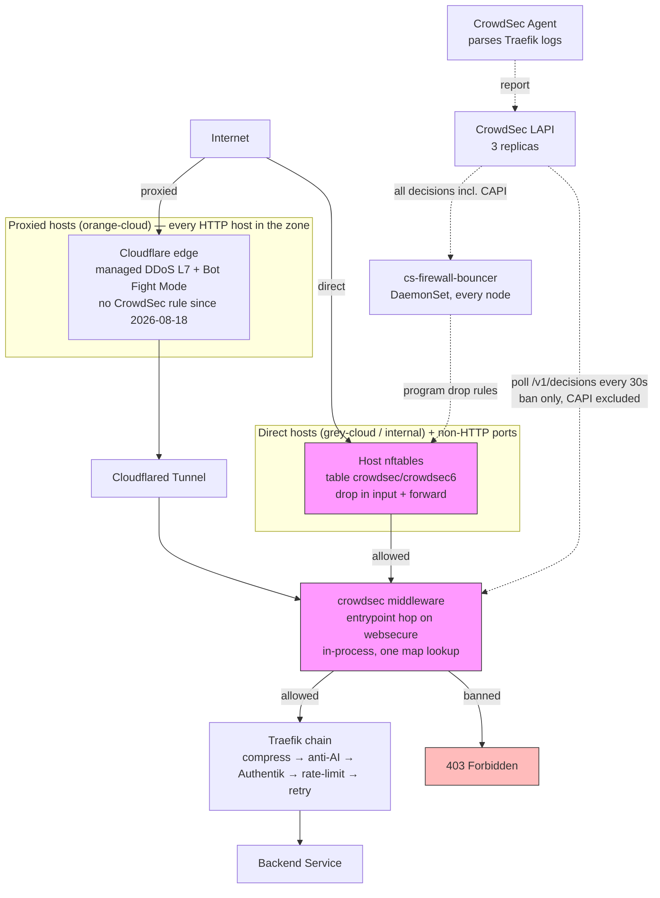

# Security & L7 Protection

## Overview

The homelab implements defense-in-depth security using CrowdSec for threat intelligence and IP reputation, Kyverno for policy enforcement and resource governance, and a 3-layer anti-AI scraping defense (reduced from 5 in April 2026 after removing the rewrite-body plugin). CrowdSec enforcement has **two surfaces** (see the CrowdSec section): an in-process Traefik plugin on the `websecure` entrypoint, which is what covers Cloudflare-proxied hosts — i.e. every HTTP host in the zone — and in-kernel nftables drops on every node, which cover direct hosts and non-HTTP ports. The Traefik hop costs one in-memory map lookup per request. All security components fail open (a CrowdSec outage stops new bans but never blocks legitimate traffic; the plugin keeps serving its last known decision set). Security policies are deployed in audit mode first, then selectively enforced after validation.

## Architecture Diagram

CrowdSec enforcement is the FIRST hop of the Traefik chain for HTTP, and an
in-kernel drop below it for direct hosts. The `crowdsec` middleware is attached to
the `websecure` ENTRYPOINT, so it is prepended to every router on it — all ~195
Ingresses, the 10 IngressRoutes and the catchall — ahead of
compress → anti-AI → Authentik ForwardAuth → rate-limit → retry.

Why an in-process hop and not the Cloudflare edge: proxied traffic reaches Traefik
from the in-cluster cloudflared pod, so at L3 the node only ever sees 10.10.x.x
and the nftables bouncer cannot identify the client. Enforcement lived at the edge
for that reason until 2026-08-18 — see "Why the edge channel was retired" below.


```mermaid
graph TB
    Internet[Internet]

    subgraph "Proxied hosts (orange-cloud) — every HTTP host in the zone"
        CFedge[Cloudflare edge<br/>managed DDoS L7 + Bot Fight Mode<br/>no CrowdSec rule since 2026-08-18]
    end
    subgraph "Direct hosts (grey-cloud / internal) + non-HTTP ports"
        NFT[Host nftables<br/>table crowdsec/crowdsec6<br/>drop in input + forward]
    end

    Tunnel[Cloudflared Tunnel]
    Bouncer[crowdsec middleware<br/>entrypoint hop on websecure<br/>in-process, one map lookup]
    Traefik[Traefik chain<br/>compress → anti-AI → Authentik → rate-limit → retry]
    Backend[Backend Service]

    LAPI[CrowdSec LAPI<br/>3 replicas]
    Agent[CrowdSec Agent<br/>parses Traefik logs]
    FWB[cs-firewall-bouncer<br/>DaemonSet, every node]

    Internet -->|proxied| CFedge
    Internet -->|direct| NFT
    CFedge --> Tunnel
    Tunnel --> Bouncer
    NFT -->|allowed| Bouncer
    Bouncer -->|allowed| Traefik
    Bouncer -->|banned| Deny[403 Forbidden]
    Traefik --> Backend

    Agent -.->|report| LAPI
    LAPI -.->|all decisions incl. CAPI| FWB
    FWB -.->|program drop rules| NFT
    LAPI -.->|poll /v1/decisions every 30s<br/>ban only, CAPI excluded| Bouncer

    style Bouncer fill:#f9f,stroke:#333
    style NFT fill:#f9f,stroke:#333
    style Deny fill:#fbb,stroke:#333
```

## Components

| Component | Version | Location | Purpose |
|-----------|---------|----------|---------|
| CrowdSec LAPI | Pinned | `stacks/crowdsec/` | Local API, threat intelligence aggregation (3 replicas) |
| CrowdSec Agent | Pinned | `stacks/crowdsec/` | Log parser, scenario detection |
| cs-firewall-bouncer | v0.0.34 | `stacks/crowdsec/modules/crowdsec/firewall_bouncer.tf` | In-kernel nftables drop on every node (DIRECT hosts, non-HTTP ports). Bouncer key `firewall` |
| crowdsec-bouncer-plugin | v0.1.0 | `stacks/traefik/modules/traefik/crowdsec-bouncer-plugin/` | In-process Traefik middleware on the `websecure` entrypoint (PROXIED hosts, i.e. all HTTP). Bouncer key `traefik` |
| Kyverno | Pinned chart | `stacks/kyverno/` | Policy engine for K8s admission control |
| poison-fountain | Latest | `stacks/poison-fountain/` | Anti-AI bot detection and tarpit service |
| cert-manager/certbot | - | `stacks/cert-manager/` | TLS certificate management |
| Traefik | Latest | `stacks/platform/` | Ingress controller with HTTP/3 (QUIC) |

## How It Works

### Request Security Layers

For direct hosts, banned IPs are dropped in-kernel before Traefik sees them. For
proxied hosts — every HTTP host in the zone — the drop cannot identify the client,
so enforcement is the first hop of the Traefik chain instead (see CrowdSec Threat
Intelligence below):

1. **Cloudflare WAF / edge** - managed DDoS L7 protection and Bot Fight Mode. No CrowdSec rule here since 2026-08-18
2. **Cloudflared Tunnel** - Zero Trust tunnel, hides origin IP (proxied hosts)
3. **CrowdSec** - in-kernel nftables drop on direct hosts, and the `crowdsec` entrypoint middleware for all HTTP (one map lookup; 403 on a hit)
4. **Anti-AI Scraping** - 3-layer bot defense (optional per service, updated 2026-04-17)
5. **Authentik ForwardAuth** - Authentication check (if `protected = true`)
6. **Rate Limiting** - Per-source IP rate limits (returns 429 on breach)
7. **Retry Middleware** - Auto-retry on transient errors (2 attempts, 100ms delay)

### CrowdSec Threat Intelligence

CrowdSec operates in a hub-and-agent model:

**LAPI (Local API)**:
- 3 replicas for high availability
- Aggregates threat intelligence from agent + community
- Maintains ban list (IP reputation database)
- Version pinned to prevent breaking changes

**Agent**:
- Parses Traefik access logs. **Format-independent since 2026-09-01**: the
  access log moved from CLF to JSON, and `crowdsecurity/traefik-logs` already
  carries a JSON node alongside its CLF grok. Verified with `cscli explain` on
  the live agent against the same Immich 404 in both formats — identical
  parsers green, identical enrichers, identical scenarios firing, and
  `evt.Parsed.status` stringifies so the local `http-403-abuse` /
  `http-429-abuse` overrides (which compare against `'403'`) keep matching.
  One behaviour difference worth knowing: the JSON node populates
  `evt.Meta.target_fqdn`, which CLF never did. Nothing here reads it —
  `viktor/immich-asset-paths-whitelist` reads `evt.Parsed.target_fqdn`, a
  different map, and has therefore never matched in either format.
- Detects attack scenarios (SQL injection, directory traversal, brute force)
- Reports malicious IPs to LAPI
- Shares threat intel with CrowdSec community (anonymized)

Enforcement has **two surfaces**, split by what can identify the client.

**Surface 1 — DIRECT (non-Cloudflare-proxied) hosts and non-HTTP ports → in-kernel nftables drop**
(`cs-firewall-bouncer` DaemonSet, `stacks/crowdsec/modules/crowdsec/firewall_bouncer.tf`):
- Runs on **every node** (no nodeSelector). Programs the HOST nftables — `table ip
  crowdsec` / `table ip6 crowdsec6` — with drop rules in **both the `input` AND
  the `forward` hooks**. The `forward` hook is required because Traefik is a
  LoadBalancer with `externalTrafficPolicy=Local`: client traffic is DNAT'd to the
  Traefik **pod** and transits the node's `forward` hook (not `input`) with the
  real client IP preserved. Chains use `policy accept` (only set members drop —
  it can never blackhole normal traffic).
- Pulls **all** decisions from LAPI, **including the CAPI community blocklist**
  (22,715 of the 22,719 live decisions on 2026-08-18). Packets from banned IPs
  are dropped in-kernel before reaching Traefik.
- **How much public web traffic this actually covers: almost none.**
  `cloudflare_proxied_names = []`, so every HTTP host rides the zone-wide wildcard
  and is proxied; the only non-proxied names are `turn`, `vpn` and
  `xray-reality`, none of which is HTTP. For a proxied request the node sees the
  cloudflared pod (10.10.x.x), not the client. This surface is what protects the
  non-HTTP ports and any direct host, and it is a real second layer — but it is
  not the one gating the websites.
- **Packaging**: cs-firewall-bouncer publishes no container image, so the
  **v0.0.34** static binary is fetched at runtime by an initContainer onto a
  `debian:bookworm-slim` runtime container. Needs `hostNetwork` +
  `NET_ADMIN`/`NET_RAW` to talk netlink directly. Registered bouncer key:
  **`firewall`**.
- **Fail-open**: if LAPI is unreachable it just stops receiving new decisions
  (existing drop rules persist); it never blocks legitimate traffic.
- **A manual ban on an internal address is enforced here too, and it bites.**
  The whitelist below is a PARSER-stage whitelist: it stops scenarios from
  *generating* decisions, and does nothing about one added by hand. A
  `cscli decisions add --ip 10.0.10.10` blackholes that address in-kernel on every
  node — including its DNS to Technitium. Observed 2026-08-18 while testing;
  `cscli decisions delete` restored it within ~3s.

**Surface 2 — PROXIED hosts, i.e. all HTTP → in-process Traefik middleware**
(`stacks/traefik/modules/traefik/crowdsec-bouncer-plugin/`, Middleware `crowdsec`
in that module's `middleware.tf`, attached to the `websecure` entrypoint):
- A background goroutine polls LAPI `/v1/decisions` every **30s** into an
  in-memory set; per-request work is one map lookup. A hit returns **403**.
- Attached to the **entrypoint**, so it is prepended to every router on
  `websecure`: all ~195 Ingresses, the 10 IngressRoutes and the catchall,
  including hand-rolled ingresses that never go through `ingress_factory`. Doing
  it per-ingress through the factory would fan a `modules/` change across 33
  platform + ~95 app stacks applied serially, where lock-contended stacks are
  *skipped rather than failed* — some ingresses would silently keep the old chain.
- **The client IP comes from the unspoofable TCP peer**, exactly as
  `real-ip-plugin` does it: `Cf-Connecting-Ip` / `X-Forwarded-For` are honoured
  only when the peer is inside `trustedProxyCIDRs` (`10.10.0.0/16`, where
  cloudflared runs); any other peer is judged on its own address and all of its
  forwarding headers are ignored. This matters because the origin is reachable
  without transiting Cloudflare — pfSense NATs WAN :443 straight to Traefik — so
  a banned client can connect directly and claim to be anyone. Verified live in
  both directions on 2026-08-18.
- **Ban only.** `captcha` decisions are ignored. The `captcha_remediation` profile
  diverts four false-positive-prone scenarios (`http-429-abuse`, `http-403-abuse`,
  `http-crawl-non_statics`, `http-sensitive-files`) to a captcha that is enforced
  nowhere; honouring it here would turn all four into live fleet-wide blocks.
  `scope=Range` is handled as well as `scope=Ip`.
- **CAPI is excluded** (`origins` config: `crowdsec`, `cscli`, `cscli-import`,
  `lists`, `console`). Those 22.7k community bans have never been enforced on
  proxied hosts, and their false positives (CGNAT, carrier ranges) would surface
  as user-visible 403s. It is a config flag, not a hard-coded exclusion — but
  measure in dry run before flipping it, and note the snapshot then weighs ~3 MB
  per poll instead of a few KB. **Consequence worth stating plainly: the enforced
  set is currently 4 decisions.** This surface is new coverage, not a like-for-like
  replacement of a large blocklist.
- **Auth carve-out**: `authentik.viktorbarzin.me` and `public-auth.viktorbarzin.me`
  are never gated, so a false-positive ban cannot wall someone out of the login /
  WebAuthn flow they would need in order to fix it. Carried over from the WAF rule
  this replaced; auth keeps `traefik-rate-limit` for brute-force protection.
- **Fail-open is structural**: LAPI unreachable → serve the last known set; never
  loaded → allow. There is no auth backend to be unreachable, which is what made
  in-process the only workable shape (Traefik's `forward.go` answers 500/502 when
  a ForwardAuth backend is down, with no option to allow — the reason `auth-proxy`
  and `bot-block-proxy` exist as shims). Drilled live: with `crowdsec-lapi` scaled
  to 0, traffic kept flowing and the plugin logged `serving=last-known-set`.
- `dryRun` decides and logs without blocking. Registered bouncer key: **`traefik`**.

#### Why the edge channel was retired (2026-08-18)

Proxied hosts were enforced at the Cloudflare edge from 2026-06-20 to 2026-08-18:
one account IP List `crowdsec_ban` plus a zone WAF rule `(ip.src in $crowdsec_ban)`,
fed by a `crowdsec-cf-sync` CronJob in the `rybbit` namespace.

**The Lists API enforces a hard ~72-hour floor between successful item writes.**
From the account audit log (`resource.type=iplists`, complete history since the
list was created; 22 events, 16 intervals): 8 of 16 intervals fall in
`[72h, 72h+120s)`, **three land on exactly 259,200s**, and no interval anywhere
sits between 4.5h and 72h. Rejected attempts do not consume the budget —
`08-01 01:12:03 → 08-04 01:12:03` is exactly 72h 0s with ~1,900 refusals in
between — but every window in which drift existed was fully consumed: **the edge
list disagreed with CrowdSec for 107 of 216 observed hours over 30 days.** (An
earlier reading in this document described it as "one write every 3.0–4.9 days,
mean ~3.4"; the floor is the sharper statistic, and it is what the interval
distribution actually shows.)

The failure that ended it: on 2026-08-16 a hand-written ban on our own London WAN
egress (`137.220.71.46`, a legitimate Nextcloud desktop client) reached the edge
two days later and blocked every proxied host. The LAPI decision was deleted the
same morning, but the list could not be corrected for days, so a temporary
`ip.src ne 137.220.71.46` clause in the WAF rule was what kept access working.

In-cluster, the same unban takes effect in **33 seconds** (measured 2026-08-18).

What was removed: the IP List (with its stale `137.220.71.46` entry), the
least-privilege API token, the CronJob with its Secret and ConfigMap,
`lapi_kv_sync.py`, the `kvsync` bouncer key and its 442 leaked LAPI rows, and the
three `CrowdSecEdge*` alerts. What was deliberately **kept**:
`cloudflare_ruleset.crowdsec` was reduced to the unrelated disabled `skip` rule it
had always carried and then detached from state with
`removed { lifecycle { destroy = false } }` — it is the zone's `default`
`http_request_firewall_custom` **phase entrypoint**, so destroying it would have
wiped the zone's entire custom-rules phase. Cloudflare's managed DDoS L7
protection and Bot Fight Mode are independent of all this and were never touched.

**Monitoring moved with the enforcement.** The `CrowdSecEdge*` alerts watched a
sync that no longer exists; the lesson behind them did not go away, since that
sync sat broken for days with `crowdsec_cf_list_sync_success` correctly pushed as
`0` and nothing reading it. Replacements:
- `CrowdSecL7BouncerNotPolling` (Prometheus) — LAPI counts requests per bouncer
  (`cs_lapi_bouncer_requests_total{bouncer="traefik"}`), so if the plugin stops
  polling the counter stops moving. Guarded on LAPI being up, because the series
  goes absent rather than flat when it is not, and `CrowdSecDown` covers that.
- `CrowdSecL7BouncerRefreshFailing` (Loki) — fail-open makes a LAPI outage a
  *staleness* incident, not an availability one: new bans are not enforced and a
  deleted ban keeps blocking.
- `CrowdSecL7BlockBurst` (Loki) — guards the feedback loop this design creates.
  Blocked requests now reach Traefik and are access-logged, so mass 403s can trip
  `crowdsecurity/http-403-abuse`; a false positive on a shared egress shows up
  here first.
The plugin runs under Yaegi, where Prometheus counters are not cheaply available,
so its own decisions are structured log lines (`[crowdsec-bouncer] action=…`) on
the Traefik pods' stdout and are alerted on from Loki.

**Whitelist** (the `crowdsec-whitelist` configmap in
`stacks/crowdsec/modules/crowdsec/main.tf`, mounted into the agents at
`parsers/s02-enrich/whitelist.yaml`): a CrowdSec whitelist covers RFC1918 + the
tailnet + internal CIDRs (plus one specific external IP), so internal users are
never enforced. Internal access uses split-horizon DNS straight to Traefik, and
direct internal clients are RFC1918 — both whitelisted. Two path-scoped
whitelists suppress false positives on first-party apps' own traffic:
`viktor/immich-asset-paths-whitelist` (auth-gated `/api/assets|timeline|…`
timeline bursts) and `viktor/nextcloud-webdav-whitelist`
(`nextcloud.viktorbarzin.me` `/remote.php/` — Nextcloud-iOS PROPFIND 404s carry
the account name `admin` in the path and otherwise trip
`crowdsecurity/http-admin-interface-probing`, banning the client's shared egress
IP; 2026-07-19). Note: the whitelist file is a `subPath` mount, so editing the
configmap requires **restarting the `crowdsec-agent` DaemonSet** to pick it up
(subPath mounts don't hot-update).

#### The earlier Traefik bouncer plugin, and why this one is not a repeat

An inline Traefik bouncer existed before: the upstream
`crowdsec-bouncer-traefik-plugin`, removed in 2026-06. The reason recorded at the
time was that "on Traefik 3.7.5 the Yaegi handler was never invoked". That claim
traces back to a bare parenthetical in commit `84a18a55` with no log line, test or
metric behind it, and was then copied into this document and ADR-0022. The commit
that actually removed it (`c23b0386`) removed it as **dead config** — zero live
ingresses referenced `traefik-crowdsec@kubernetescrd`.

Two differences matter for the current plugin:

- It was a **catalog** plugin with a hand-forged `state.json`. ADR-0022 names
  exactly that failure class: Traefik ≥3.5.3 re-validates catalog plugins against
  `plugins.traefik.io` at startup, so a transient registry failure disables all
  catalog plugins. The remedy ADR-0022 settled on — **vendor as a local plugin,
  pin exactly, fail open** — is what `sablier` and `realip` have been running on
  in production, and is what this plugin does.
- It depended on a **Redis client**, which does not work under Yaegi. The current
  plugin is standard library only.

The interpreter itself was never the obstacle it was recorded as being. Before
this plugin was applied it was loaded under **the same Yaegi version Traefik
embeds** (v0.16.1) and exercised end to end — see `scripts/yaegi-plugin-gate`.
That gate earned itself immediately: the plugin compiled and passed 26 unit tests
while panicking Yaegi at import, because it held a **variadic func in a struct
field** (fine as a parameter or a package-level func; fatal in a field). Neither
`go build` nor `go test` sees that, and the consequence would have been every
Traefik plugin disabled at startup, `api-token-middleware` included.

**Metabase** (disabled by default):
- Dashboard for CrowdSec analytics
- CPU-intensive, only enable when investigating incidents

### Kyverno Policy Engine

Kyverno enforces cluster-wide policies via admission webhooks. All policies use `failurePolicy=Ignore` to prevent blocking cluster operations.

#### 5-Tier Resource Governance

Namespaces are labeled with a tier (`tier: 0` through `tier: 4`). Kyverno auto-generates:

- **LimitRange** - Per-container CPU/memory limits
- **ResourceQuota** - Namespace-wide resource caps

| Tier | CPU Limit/Container | Memory Limit/Container | Namespace CPU Quota | Namespace Memory Quota |
|------|---------------------|------------------------|---------------------|------------------------|
| 0 | 100m | 128Mi | 500m | 512Mi |
| 1 | 250m | 256Mi | 1000m | 1Gi |
| 2 | 500m | 512Mi | 2000m | 2Gi |
| 3 | 1000m | 1Gi | 4000m | 4Gi |
| 4 | 2000m | 2Gi | 8000m | 8Gi |

This prevents resource exhaustion and enforces governance without manual quota management.

#### Security Policies

**Why audit mode first?** Gradual rollout without breaking existing workloads. Policies collect violations, then selectively enforced after cleanup.

**Wave 1 plan (locked 2026-05-18, see beads `code-8ywc`):** all four below flip from Audit → Enforce with `failurePolicy: Ignore` preserved and an exclude list covering the 31 critical namespaces (keel, calico-system, authentik, vault, cnpg-system, dbaas, monitoring, traefik, technitium, mailserver, kyverno, metallb-system, external-secrets, proxmox-csi, nfs-csi, nvidia, kube-system, cloudflared, crowdsec, reverse-proxy, reloader, descheduler, vpa, redis, sealed-secrets, headscale, wireguard, xray, infra-maintenance, metrics-server, tigera-operator). Phased: one policy per day with PolicyReport observation.

| Policy | Purpose | Current | Planned (wave 1) |
|--------|---------|---------|------------------|
| `deny-privileged-containers` | Block privileged pods | Audit | **Enforce** |
| `deny-host-namespaces` | Block hostNetwork/hostPID/hostIPC | Audit | **Enforce** |
| `restrict-sys-admin` | Block CAP_SYS_ADMIN | Audit | **Enforce** |
| `require-trusted-registries` | Only allow approved image registries (forgejo.viktorbarzin.me, docker.io, ghcr.io, quay.io, registry.k8s.io, gcr.io, oci://ghcr.io/sergelogvinov) | Audit | **Enforce** |

Cosign `verify-images` is **deferred** beyond wave 1 — needs image-signing infrastructure (Sigstore / cosign + KMS) before it can enforce meaningfully.

#### Node sysctl posture (`allowedUnsafeSysctls`)

Kubelet on the general worker nodes (node2–node5) allows exactly ONE unsafe
sysctl: **`net.ipv4.ip_forward`** (Viktor-approved 2026-07-25, infra#81). Nodes
otherwise allow zero unsafe sysctls. A pod opts in per-pod via
`securityContext.sysctls`; the sysctl is **network-namespaced**, so it affects
only that pod's own netns — never the host or other pods — and Kyverno still
blocks privileged / host-namespace pods (no Kyverno policy touches sysctls).
Needed by the `proxy` shared per-country NordVPN gateway + Headscale exit nodes,
which FORWARD foreign-origin traffic onto gluetun's `tun0` (impossible without
`ip_forward=1` in the pod netns; the runtime mounts `/proc/sys` read-only, so it
cannot be set at runtime even with `NET_ADMIN`). Managed in
`modules/create-template-vm/k8s-node-post-join-tune.sh` (source of truth, all
future nodes); master + GPU node1 were not live-rolled (no gateway schedules
there) and pick it up on re-provision.

#### Operational Policies

| Policy | Purpose | Mode |
|--------|---------|------|
| `inject-priority-class-from-tier` | Set pod priorityClass based on namespace tier | Enforce (CREATE only) |
| `inject-ndots` | Set DNS `ndots:2` for faster lookups | Enforce |
| `sync-tier-label` | Propagate tier label to child resources | Enforce |
| `goldilocks-vpa-auto-mode` | Disable VPA globally (VPA off) | Enforce |

### Anti-AI Scraping (3 Active Layers) (Updated 2026-04-17)

Enabled by default via `ingress_factory` module. Disable per-service with `anti_ai_scraping = false`.

Active middleware chain: `ai-bot-block` (ForwardAuth) + `anti-ai-headers` (X-Robots-Tag). The `strip-accept-encoding` and `anti-ai-trap-links` middlewares were removed in April 2026 due to Traefik v3.6.12 Yaegi plugin incompatibility with the rewrite-body plugin.

#### Layer 1: Bot Blocking (ForwardAuth)

- `ai-bot-block` middleware forward-auths to the `bot-block-proxy` openresty
  service (`stacks/traefik/modules/traefik/main.tf`) — the bot-check hop before
  the backend.
- **Currently a no-op (allow-all).** `poison-fountain` is intentionally scaled
  to 0 (clears the ExternalAccessDivergence alert), so `bot-block-proxy`
  short-circuits `/auth` to `return 200 "allowed"` instead of proxying to an
  absent upstream. Same effective behaviour as the previous `proxy_pass` +
  `error_page 5xx=200` fail-open, minus the ~51k/hr upstream-connect error logs
  and per-request connect latency it generated (cleaned up 2026-06-05, found via
  Loki). The Deployment carries `configmap.reloader.stakater.com/reload` so
  config changes actually reload openresty (it does not hot-reload on its own).
- **To re-enable real bot-blocking**: restore the `upstream poison_fountain` +
  `proxy_pass http://poison_fountain;` block in the `bot-block-proxy-config`
  ConfigMap (git history) and scale `poison-fountain` up. It then forward-auths
  bot checks (User-Agent / patterns) and tarpits known AI scrapers, fail-open if
  poison-fountain is down.

#### Layer 2: X-Robots-Tag Header

- HTTP response header: `X-Robots-Tag: noai, noindex, nofollow`
- Instructs compliant bots to skip content
- Lightweight, no performance impact

#### ~~Layer 3: Trap Links~~ (REMOVED)

Removed April 2026. The rewrite-body Traefik plugin used to inject hidden trap links broke on Traefik v3.6.12 due to Yaegi runtime bugs. The companion `strip-accept-encoding` middleware was also removed.

#### Layer 3 (formerly 4): Tarpit / Poison Content

- `poison-fountain` exists as a standalone service at `poison.viktorbarzin.me` but the serving Deployment is **scaled to 0** (replicas=0); only its 6-hourly content-fetch CronJob runs. The tarpit is therefore dormant until re-enabled.
- When running: serves AI bots extremely slowly (~50 bytes / 0.5s tarpit drip)
- CronJob every 6 hours generates fake content
- Trap links are no longer injected into real pages, but bots that discover `poison.viktorbarzin.me` directly would get tarpitted and poisoned

**Implementation**: See `stacks/poison-fountain/` and `stacks/traefik/modules/traefik/{middleware.tf,main.tf}` (traefik moved from the platform stack to its own `traefik` stack)

### Audit Logging & Anomaly Detection (Wave 1)

Beads epic: `code-8ywc`. **Status: partially live as of 2026-05-18.**

| Item | State |
|---|---|
| W1.2 Vault `file` audit device | **LIVE** — `vault_audit.file` in `stacks/vault/main.tf:287`, writing to `/vault/audit/vault-audit.log` on `proxmox-lvm-encrypted` PVC |
| W1.2 Vault `x_forwarded_for_authorized_addrs = 10.10.0.0/16` | **LIVE** — applied via `tg apply -target=helm_release.vault` on 2026-05-18; all 3 vault pods restarted cleanly |
| W1.2 Vault audit log shipping to Loki | **LIVE** — `audit-tail` sidecar in vault pods + Alloy DaemonSet ships to Loki with `container="audit-tail"`. Verified via `{namespace="vault",container="audit-tail"}` LogQL query. |
| W1.1 K8s API audit policy + shipping | **LIVE** — kube-apiserver audit policy configured at Metadata level, writing `/var/log/kubernetes/audit/audit.log`. Alloy DaemonSet tolerates the control-plane taint, tails that file, ships to Loki with `job=kubernetes-audit`. K2-K9 alert rules in Loki ruler. **Retention corrected 2026-09-01:** `--audit-log-maxage=30 --audit-log-maxbackup=10 --audit-log-maxsize=100`, and at ~415 MB/day the size cap rotates every 6-7 h, so on-node history is **~2.8 days**, not 7 and not 30. Loki holds 30 days. |
| W1.3 Source-IP anomaly rules (K9, V7, S1) | **LIVE** (K9, V7, S1). **S1 activated 2026-06-10** — promtail on the PVE host now ships the journal to Loki (`scripts/pve-promtail.yaml`); sshd auth lands as `job=sshd-pve` (the S1 data source). The same shipper carries snoopy `execve()` command audit as `{job="pve-journal", identifier="snoopy"}` (forensic, not alerting). Deployed because emo's agent was given root SSH to the host (shared key) — see `docs/architecture/monitoring.md` → "External host: pve". |
| W1.4 Kyverno security policies → Enforce | **LIVE** — 3 policies in Enforce mode with 35-namespace exclude list. |
| W1.5 Kyverno trusted-registries → Enforce | **LIVE** — explicit allowlist (15 registries + 6 DockerHub library bare names + 56 DockerHub user repos). Verified by admission dry-run: `evilcorp.example/malware:v1` BLOCKED, `alpine:3.20` and `docker.io/library/alpine:3.20` ALLOWED. |
| W1.6 Calico observe-phase (pilot: recruiter-responder) | **LIVE** (2026-05-19) — GlobalNetworkPolicy `wave1-egress-observe-recruiter-responder` with rules `[action:Log, action:Allow]`. FelixConfiguration.flowLogsFileEnabled approach abandoned (Calico Enterprise-only field, rejected by OSS v3.26). Log action emits iptables LOG with prefix `calico-packet: ` → kernel → journald → Alloy → Loki. Verified: `{job="node-journal"} \|~ "calico-packet"` returns real packet metadata (SRC/DST/PROTO). Expand to more namespaces by adding to `namespaceSelector`. |
| W1.7 NetworkPolicy phased enforce | **PARTIAL ANALYSIS** — first observation snapshot at `docs/architecture/wave1-egress-observation-2026-05-22.md` (36 source namespaces seen so far, 29 thin-profile candidates). Recommend continuing observation through 2026-05-29 (full week) before any enforce flip. Pilot enforce target: `recruiter-responder` (2 destinations only). `servarr` stays in Log+Allow indefinitely (BitTorrent P2P incompatible with static enforce). |

The block below documents the locked design.

Response model: **(I) Slack-only, daily skim.** All security alerts post to **`#alerts`** via Alertmanager (the `slack-security` receiver keeps its distinct `[SECURITY/<sev>]` title styling so security-lane alerts still stand out). The dedicated `#security` channel was abandoned (2026-06-25) — the shared `alertmanager_slack_api_url` incoming webhook's Slack app isn't a member of it, so a channel override there returns HTTP `404 channel_not_found`; everything consolidated to `#alerts`. No paging. Mean detection time accepted as ~12-24h; the design weight sits on prevention (Kyverno enforce, NetworkPolicy default-deny egress) rather than runtime detection.

#### Detection sources

| Source | Mechanism | Ships via | Loki job label |
|---|---|---|---|
| K8s API audit log | Custom audit policy on kube-apiserver, **corrected against live state 2026-09-01**: `get`/`list`/`watch` are dropped at `None` for **everything**, so there are no secret-read and no `exec`/`portforward` audit events; high-churn resources and probe URLs are dropped; every remaining create/update/patch/delete is logged at `Metadata` with `omitStages: [RequestReceived]`. Source of truth is the hand-deployed `scripts/k8s-apiserver-audit-policy.yaml` (**not** `stacks/infra` templating, which carries no audit config; the policy `stacks/rbac` writes is inert, see below). Measured volume: 74,060 events / 6 h, of which 0 reads, against 366,219 read requests served. | Alloy DaemonSet tails `/var/log/kubernetes/audit/audit.log` | `job=kubernetes-audit` |
| Vault audit log | `file` audit device on existing Vault PVC. Vault listener config sets `x_forwarded_for_authorized_addrs` trusting Traefik pod CIDR so `remote_addr` is the real client IP, not Traefik's. | Alloy tails audit log file | `job=vault-audit` |
| PVE sshd auth log | journald (`_SYSTEMD_UNIT=ssh.service`, `SYSLOG_IDENTIFIER=sshd-session`); promtail relabels `identifier=~"sshd.*"` → `job=sshd-pve` | promtail systemd unit on Proxmox host (192.168.1.127), `scripts/pve-promtail.yaml` — **LIVE 2026-06-10** | `job=sshd-pve` |
| Calico flow log | `flowLogsFileEnabled: true` in Calico Felix config | Alloy (cluster-wide) | `job=calico-flow` (W1.6 only) |

#### Alert rules (16 total)

Routed via **Loki ruler → Alertmanager → the `slack-security` receiver, which posts to `#alerts`** (it keeps its `[SECURITY/<sev>]` title styling so security-lane alerts stand out there; the dedicated `#security` channel was abandoned 2026-06-25 — the shared webhook's Slack app isn't a member of it). Same handling path as existing infra alerts — silenceable in Alertmanager UI, history queryable, severity labels (critical/warning/info) carried in the alert.

**K8s API audit (K2-K9, 8 rules — K1 cluster-admin-grant intentionally skipped):**

| # | Event | Severity |
|---|---|---|
| K2 | ServiceAccount token used from outside cluster (sourceIPs not in pod CIDR or trusted LAN) | critical |
| K3 | Secret READ in `vault`, `sealed-secrets`, `external-secrets` namespaces by a non-allowlisted ServiceAccount | critical |
| K4 | Exec into a pod in `vault`, `kube-system`, `dbaas`, `cnpg-system` (excluding `me@viktorbarzin.me` + 1 break-glass SA) | warning |
| K5 | >5 deletes of `Pod`, `Secret`, or `ConfigMap` in 60s by any single actor (excludes legit bulk-deleters: kubelets, kube-system GC + namespace-controller, woodpecker CI — see runbook) | critical |
| K6 | `audit-log-path` flag or audit policy modified on kube-apiserver | critical |
| K7 | New ClusterRole created with `verbs: ["*"]` and `resources: ["*"]` | warning |
| K8 | Anonymous binding granted (any RoleBinding/CRB referencing `system:anonymous` or `system:unauthenticated`) | critical |
| K9 | Authenticated request where `user.username == "me@viktorbarzin.me"` AND `sourceIPs[0]` NOT in allowlist CIDRs | critical |

**Vault audit (V1-V7):**

| # | Event | Severity |
|---|---|---|
| V1 | Root token created | critical |
| V2 | Audit device disabled or modified | critical |
| V3 | Seal status changed (`sys/seal` write) | critical |
| V4 | Policy written or modified (allowlist Terraform-driven writes by source IP / token role) | warning |
| V5 | Authentication failure spike >10/min on any auth method | warning |
| V6 | Token created with policies different from parent (privilege escalation) | critical |
| V7 | Vault audit event where `auth.entity_id == <viktor-entity-id>` AND `remote_addr` NOT in allowlist CIDRs | critical |

**Host (S1):**

| # | Event | Severity |
|---|---|---|
| S1 | PVE sshd auth success from source IP NOT in allowlist | critical |

#### Allowlist — "expected source IPs" for K2, K9, V7, S1

| CIDR | Source |
|---|---|
| `10.0.20.0/22` | VLAN 20 (K8s cluster + main LAN) |
| `10.0.10.0/24` | VLAN 10 (devvm) — **K2/K9 only** (added 2026-07-06). The devvm legitimately uses ServiceAccount-token kubeconfigs against the apiserver (e.g. `chrome-service:emo-browser` doing `kubectl port-forward` for the shared headful Chrome). V7/S1 do **not** yet include it — add there too if devvm Vault-OIDC (`vault login`) or PVE-ssh from VLAN 10 becomes a normal workflow. |
| `192.168.1.0/24` | Proxmox host LAN + Sofia LAN (same RFC1918 block in both physical locations; cross-site traffic transits Headscale so the CIDR matches only on-LAN clients in either location) |
| K8s pod CIDR `10.10.0.0/16` | In-cluster pods talking to apiserver |
| K8s service CIDR `10.96.0.0/12` | Service-to-apiserver traffic |
| Headscale tailnet `100.64.0.0/10` | VPN-connected devices |

> **K2/K9 LogQL gotcha (fixed 2026-07-06).** `sourceIPs` in a K8s audit event is a JSON **array**. Loki's no-arg `| json` flattens nested *objects* but does **not** index arrays, so it never populated the `sourceIPs_0` label — it was always empty, and `sourceIPs_0 !~ <allowlist>` (empty ≠ allowlisted) matched **every** ServiceAccount event. K2 had been firing on all in-cluster controller traffic (~500–900 events/5min); it only surfaced when the same-day `loki.ruler → loki.rulerConfig` fix first let the ruler deliver alerts. Fix: explicit array extraction `| json sourceIPs_0="sourceIPs[0]"` + a `sourceIPs_0 != ""` guard. **V7 is unaffected** — it reads `request_remote_address`, a nested *scalar*, which auto-flatten handles. Any future rule matching an audit-log array element must use explicit extraction, never assume `<field>_0`.

**Policy: no public-IP access ever.** Vault, kube-apiserver, PVE sshd must transit a trusted LAN or Headscale. Anything else fires an alert.

**Documented exception — break-glass SSH (2026-06-11):** one deliberate carve-out. The Proxmox host's sshd listens on a WAN-exposed `:52222` (edge-router forward), **key-only**, trusting only a dedicated break-glass key (`Match LocalPort` → `authorized_keys.breakglass`), rate-limited (iptables hashlimit) + fail2ban. It is intentionally reachable from the public internet so it survives a cluster/tunnel outage with no dependency on the cluster — the one case the "must transit LAN/Headscale" rule cannot serve. Brute-force-proof (no password); the trade is Shodan-visibility. As-built: `docs/runbooks/breakglass-ssh.md`; rationale: `docs/plans/2026-06-11-breakglass-ssh-redesign-design.md`. (Replaced the 2026-05-30 port-knock variant, which was non-scannable but had a circular Vault dependency that caused a lockout.)

**Two privileged footholds for the warm break-glass UI (2026-06-12):** the in-cluster `claude-breakglass` service (`breakglass.viktorbarzin.me`, warm case = devvm wedged, cluster healthy) holds one ed25519 key (Vault `secret/claude-breakglass/ssh_key`) authorising: (1) a `breakglass` user on the **devvm** with NOPASSWD sudo (`from="10.0.20.0/24"` — the Calico-SNAT node subnet); (2) a **PVE** `authorized_keys` entry pinned to `command="/usr/local/bin/breakglass-pve",restrict,from="192.168.1.2"` (pfSense's inter-VLAN SNAT IP) that only runs the verbs `status|forensics|reset|stop|start|cycle` against VM 102. The key is reachable ONLY by the breakglass pod (own namespace, no Vault role, ESO-synced); the shared `claude-agent` pod's `terraform-state` Vault policy is explicitly DENIED `secret/claude-breakglass/*`. Reset is autonomous (the agent may fire it), forensics-first. Reachable via Authentik or the basic-auth fallback — LAN-routed, not WAN-exposed. Runbook: `docs/runbooks/breakglass-ui.md`; ADR: `claude-agent-service/docs/adr/0001-breakglass-security-architecture.md`.

#### Why no canary tokens

Original plan included canary tokens (fake K8s Secret, Vault KV path, PVE file, sinkhole hostname). Rejected because Viktor routinely greps `secret/viktor` (135 keys) and lists `kubectl get secret -A` — any read-trigger canary self-fires. Use-based canaries (zero-RBAC SA tokens with audit alerts on use) were also considered but rejected in favor of cleaner source-IP anomaly detection (K9, V7) on REAL tokens — same threat model, no fake-token operational burden.

#### Why no K1 (cluster-admin grant detection)

Viktor opted out. Gap covered indirectly by K7 (new `*,*` ClusterRole created), K8 (anonymous binding), and K3 (secret read on Vault namespace) — most attacker progressions toward cluster-admin trigger one of these.

#### IOPS / disk-wear

Custom audit policy reduces volume ~80-90% vs default Metadata-everywhere. Loki tuned for fewer larger chunks: `chunk_target_size: 1.5MB`, `chunk_idle_period: 30m`, snappy compression. Retention 90d for security streams (matches Technitium DNS query log precedent). Net estimate: ~1-2 GB/day additional disk writes after tuning.

### Who reached the Kubernetes API (design step 4, 2026-09-01)

Terraform-owned and inert until a human performs the control-plane step. Runbook:
`docs/runbooks/apiserver-oidc-agent-identity.md`; design:
`docs/plans/2026-09-01-service-identity-and-request-attribution-design.md`.

Starting point, measured: the apiserver already carries
`--authentication-config=/etc/kubernetes/pki/auth-config.yaml` with two OIDC
issuers (`kubernetes` for kubelogin, `k8s-dashboard`), Terraform-managed in
`stacks/rbac/modules/rbac/apiserver-oidc.tf` and byte-identical to the node. In
24 hours there were **zero** OIDC-authenticated audit events, while the shared
kubeadm admin certificate produced 116 mutating events in a 1-hour sample. Every
human, agent session and cron job on the devvm shares that certificate, so all
of them record the same `credential-id X509SHA256=7a03b1f4…0616` and the audit
log cannot tell them apart.

What landed:

| Piece | Where | State |
| --- | --- | --- |
| `kubernetes-agent` Authentik app + public PKCE provider | `stacks/rbac/authentik-kubernetes.tf` | created on apply. No issuer list names it, so its tokens are rejected until the flag below is set |
| A third apiserver issuer mapping username and groups under the `agent:` prefix | `apiserver-oidc.tf`, `var.agent_oidc_enabled` | **default false.** With it off the rendered config is byte-identical to the live file (sha256 `bdefc260…97e16`), so the SSH provisioner's trigger does not move and an apply leaves the control plane alone |
| Group-keyed ClusterRoleBindings for `kubernetes-*` and `agent:kubernetes-*` | `oidc-group-bindings.tf` | created on apply; granted nobody anything new on the day they landed |
| The live `kubernetes` OIDC app described in Terraform with `import` blocks | `authentik-kubernetes.tf`, `var.manage_kubernetes_oidc_app` | **default false.** Adoption plans `2 to import, 0 to change` (verified 2026-09-01) |

Why a separate issuer rather than a second client: the audit event records
`user.username` and `user.groups` and not the issuer, so two clients on one
issuer both mint the same email and stay indistinguishable. The per-issuer
prefix is what lands the distinction in the log, and it also means an agent
session matches only `agent:*` bindings, so it inherits no human's access. Agent
rows are bound read-only (`oidc-power-user-readonly`: cluster-wide
get/list/watch, no Secrets, no `pods/exec`).

The shared cluster-admin certificate stays as documented break-glass, since it
authenticates via `--client-ca-file` and so survives an Authentik outage.

### NetworkPolicy Default-Deny Egress (Wave 1 — observe-then-enforce, tier 3+4)

Beads: `code-8ywc` W1.6 + W1.7. **Status: planned.**

**Approach (γ): cluster-wide observe-then-enforce.**

1. **Week 0:** Enable Calico flow logs cluster-wide. Apply a GlobalNetworkPolicy with selector `tier in {tier-3, tier-4}`, `action: Log` (no Deny). Ship flow logs to Loki.
2. **Week 1:** Build per-namespace egress allowlist from observed traffic. Common allowlist module `tier3_egress_baseline` covers DNS, NTP, internal Vault/ESO/Authentik, Brevo SMTP, Cloudflare API, OAuth providers. Per-namespace add-ons for service-specific external destinations.
3. **Week 2-3:** Apply default-deny + allowlist per-namespace, starting `recruiter-responder` (smallest egress footprint — local llama-cpp). Watch 24-48h per namespace, iterate. Roll out 3-5 namespaces/day.

**Scope exclusions:** tier 0/1/2 namespaces (defer to wave 2), 31 critical infra namespaces (same exclude list as Kyverno).

**DNS handling:** Calico GlobalNetworkPolicy supports domain-based rules via the `domains:` selector which queries CoreDNS internally. Static IPs reserved for fixed-IP services (Brevo SMTP relay).

**Known risks:**
- Rare-event misses: a Sunday-only CronJob's egress won't appear in 7 days of flow logs. Mitigation: extend observation to 2 weeks for namespaces with weekly CronJobs.
- Mass-rollout cascade: the 26h March 2026 outage (memory id=390) was a mass-change cascade. Mitigation: phased per-namespace with health-check pauses, similar to the 2026-05-17 Keel phased rollout (memory id=1972).

#### Deriving the per-namespace egress allowlist from the edge trail (Wave 1 W1.7)

The durable **east-west flow trail** (below) is now the preferred data source for
the *internal* (namespace-to-namespace) half of each Wave-1 egress allowlist —
faster and identity-stamped vs the original iptables-`LOG`→journald→Loki path
(ADR-0014: "Enforcement gains a better data source"). The unique observed
namespace pairs live in CNPG DB `goldmane_edges`, table `edge`. To derive the
namespaces a source is observed talking to (the `allow` set that seeds its
NetworkPolicy):

```sql
SELECT DISTINCT dst_ns FROM edge WHERE src_ns='<ns>' AND action='allow' ORDER BY dst_ns;
```

The full SQL recipe (whole-cluster matrix, deny sanity-checks, the ≥7-day
observation caveat) is in
[runbooks/goldmane-flow-trail.md → Deriving the Wave-1 egress allowlist](../runbooks/goldmane-flow-trail.md#deriving-the-wave-1-egress-allowlist-from-the-edge-table-infra-62).
**External / public-internet egress is NOT in this table** (empty-namespace flows
are dropped) — for those destinations keep using the Calico flow-log observation
(the W1.6 snapshot, `wave1-egress-observation-2026-05-22.md`). This feeds the
existing observe-then-enforce effort (beads `code-8ywc`); **enforce-flips remain
out of scope** of the trail — it is observe-and-derive only.

### East-west flow observability (Goldmane / Whisker + edge trail) (ADR-0014)

The "who-talks-to-whom" data plane that succeeds raw iptables-`LOG` lines (which
carried no identity). **Service identity = the workload's namespace** (primary),
refined by a `service-identity` label in the few multi-Service namespaces
(`monitoring`, `kube-system`, `dbaas`). End-to-end trail, three layers:

1. **Calico Goldmane + Whisker** (`calico-system`) — Goldmane aggregates
   identity-stamped flows (ns/pod/workload/labels + allow-deny + policy-trace)
   streamed from Felix over gRPC into a **~60-min in-memory ring buffer** (no
   etcd/API writes — the etcd-cost constraint that drove the design). **Whisker**
   is its live web UI at `whisker.viktorbarzin.me` (Authentik-gated,
   `auth = "required"` — Whisker has no own login; an additive NetworkPolicy ORs
   Traefik past the operator's default-deny `whisker` NP). The ring buffer is
   **not** a trail (lost on Goldmane restart). Enabled via operator CRs in
   `stacks/calico/main.tf`; reversible toggle (Goldmane is OSS tech-preview).
2. **`goldmane-edge-aggregator`** (`stacks/goldmane-edge-aggregator`) — streams
   Goldmane's gRPC `Flows.Stream` over **mTLS** and upserts the low-cardinality
   namespace-pair edge set (`edge(src_ns,dst_ns,action,first_seen,last_seen,
   flow_count)`) into CNPG DB `goldmane_edges`. Self-edges and empty-namespace
   (public-internet) flows are dropped — in-cluster relationships only. The mTLS
   client cert **reuses the operator's Tigera-CA-signed `whisker-backend-key-pair`**
   (Goldmane verifies CA-chain only, not identity) rather than copying the CA
   private key into TF state — **re-apply the stack if the operator rotates that
   Secret**.
3. **`goldmane-edges-digest`** CronJob — posts first-seen edges daily to
   **`#alerts`** (reuses the alert-digest webhook). All Slack now consolidates to
   `#alerts`; the `#security` channel was abandoned 2026-06-25 because that
   webhook's Slack app isn't a member of it (a `#security` override 404s). See
   runbook.

The trail is **attribution-grade, not cryptographic** (reconstructs events in a
trusted cluster; cannot prove identity against a spoofing pod — accepted trust-model
limit; east-west stays plaintext, no mTLS between app pods). Health is covered by
the **`AggregatorDown`** + **`DigestFailing`** alerts and cluster-health check #48
(see monitoring.md). Full as-built, query recipes, and troubleshooting:
[runbooks/goldmane-flow-trail.md](../runbooks/goldmane-flow-trail.md). Decision:
[ADR-0014](../adr/0014-service-identity-and-east-west-observability.md); glossary
`CONTEXT.md` → **Service identity**, **Goldmane / Whisker**.

### TLS & HTTP/3

**Traefik** handles TLS termination:
- HTTP/3 (QUIC) enabled for performance
- Automatic HTTP → HTTPS redirect
- cert-manager/certbot manages certificate lifecycle
- Let's Encrypt integration for automatic renewal

### Rate Limiting

**Per-source IP limits**:
- Default: 100 requests/minute
- Returns **429 Too Many Requests** (not 503)
- Higher limits for upload-heavy services:
  - Immich: 500 req/min (photo uploads)
  - Nextcloud: 300 req/min (file sync)

**Retry Middleware**:
- 2 attempts max
- 100ms delay between retries
- Applied after rate limiting
- Handles transient backend errors

### Fallback Proxies

**Authentik Fallback**:
- If Authentik down, falls back to basicAuth
- Prevents total service outage during IdP maintenance
- Temporary credentials stored in Vault

**Poison-Fountain Fallback**:
- If anti-AI service down, allows all traffic
- Fail-open prevents blocking legitimate users
- Monitors for service health, auto-recovers

## Configuration

### Key Config Files

| Path | Purpose |
|------|---------|
| `stacks/crowdsec/` | CrowdSec LAPI, agent config + `whitelist.yaml` |
| `stacks/crowdsec/modules/crowdsec/firewall_bouncer.tf` | cs-firewall-bouncer DaemonSet (in-kernel nftables drop, direct hosts) |
| `stacks/rybbit/crowdsec_edge.tf` + `lapi_kv_sync.py` | Cloudflare IP-List + WAF block rule + LAPI→CF sync CronJob (proxied hosts) |
| `stacks/kyverno/` | Kyverno deployment + policies |
| `stacks/poison-fountain/` | Anti-AI service + CronJob |
| `stacks/traefik/modules/traefik/middleware.tf` | Security middleware definitions (no longer includes a CrowdSec bouncer) |
| `stacks/platform/modules/ingress_factory/` | Per-service security toggles |

### Vault Paths

- **CrowdSec API key**: `secret/crowdsec/api-key` - LAPI authentication
- **BasicAuth fallback**: `secret/authentik/fallback-creds` - Emergency auth
- **TLS certificates**: `secret/tls/` - Certificate private keys

### Terraform Stacks

- `stacks/crowdsec/` - CrowdSec infrastructure
- `stacks/kyverno/` - Policy engine
- `stacks/poison-fountain/` - Anti-AI defense
- `stacks/platform/` - Traefik + middleware

### Per-Service Security Config

```hcl
module "myapp_ingress" {
  source = "./modules/ingress_factory"

  name      = "myapp"
  host      = "myapp.viktorbarzin.me"

  # Security toggles
  protected         = true   # Enable ForwardAuth
  anti_ai_scraping  = false  # Disable anti-AI (e.g., for public API)
  rate_limit        = 200    # Custom rate limit (req/min)
}
```

### Kyverno Policy Example

```yaml
apiVersion: kyverno.io/v1
kind: ClusterPolicy
metadata:
  name: inject-ndots
spec:
  background: false
  rules:
  - name: inject-ndots
    match:
      resources:
        kinds:
        - Pod
    mutate:
      patchStrategicMerge:
        spec:
          dnsConfig:
            options:
            - name: ndots
              value: "2"
```

## Decisions & Rationale

### Why CrowdSec over ModSecurity?

- **Community threat intelligence**: Shared ban lists, crowdsourced attack detection
- **Easier management**: YAML scenarios vs complex ModSecurity rules
- **Better performance**: Lightweight Go agent vs resource-heavy Apache module
- **Active development**: More frequent updates, responsive community

### Why Audit-Only Security Policies?

- **Gradual rollout**: Identify violations without breaking existing workloads
- **Risk reduction**: Prevents policy bugs from blocking critical deployments
- **Better observability**: Collect violation metrics before enforcing
- **Selective enforcement**: Move to enforce mode per-policy after validation

### Why Multi-Layer Anti-AI Defense? (Updated 2026-04-17)

- **Defense in depth**: Each layer catches different bot types
- **Compliant bots**: Layer 2 (X-Robots-Tag) handles respectful crawlers
- **Persistent bots**: Tarpit makes scraping uneconomical
- **Poison content**: Degrades training data for bots that reach poison-fountain
- Layer 3 (trap links via rewrite-body) was removed due to Traefik v3 plugin incompatibility

### Why Fail-Open Mode?

- **Availability over security**: Homelab prioritizes uptime
- **Graceful degradation**: Single component failure doesn't cascade
- **Manual intervention**: Security incidents are rare, can handle manually
- **Layer redundancy**: If one layer fails, others still protect

### Why Pin CrowdSec/Kyverno Versions?

- **Breaking changes**: Both projects had breaking config changes in past
- **Controlled upgrades**: Test in staging before upgrading production
- **Stability**: Prevents auto-upgrade during outages
- **Rollback**: Easy to revert if upgrade causes issues

### Why HTTP/3 (QUIC)?

- **Performance**: Lower latency, better mobile performance
- **Connection migration**: Survives IP changes (mobile networks)
- **0-RTT**: Faster TLS handshake for repeat visitors
- **Future-proof**: Industry moving to HTTP/3

## Troubleshooting

### CrowdSec Blocking Legitimate IP

**Problem**: Legitimate user IP on ban list.

**Fix**:
1. Check LAPI decisions: `kubectl -n crowdsec exec deploy/crowdsec-lapi -- cscli decisions list --ip <IP>`
2. Remove ban: `kubectl -n crowdsec exec deploy/crowdsec-lapi -- cscli decisions delete --ip <IP>`
   — HTTP recovers within one 30s poll of the Traefik bouncer (measured at 33s on
   2026-08-18), and the in-kernel drop clears as soon as `cs-firewall-bouncer`
   reconciles. No Cloudflare step is involved any more; up to 2026-08-18 this was
   the slow part, bounded by a ~72h floor on Lists writes.
3. Whitelist if needed: the `crowdsec-whitelist` configmap in
   `stacks/crowdsec/modules/crowdsec/main.tf` (RFC1918 + tailnet + internal CIDRs
   are already there, so scenarios never *generate* a decision for an internal
   client). Note what that does not cover: it is a parser-stage whitelist, so a ban
   added by hand with `cscli decisions add` **is** enforced against an internal
   address, in-kernel on every node. Editing the configmap also needs the
   `crowdsec-agent` DaemonSet restarted (subPath mount).

### Kyverno Policy Blocking Deployment

**Problem**: Pod creation fails with policy violation.

**Fix**:
1. Check policy reports: `kubectl get policyreport -A`
2. Verify `failurePolicy=Ignore` is set (should never block)
3. If blocking, temporarily disable policy: `kubectl annotate clusterpolicy <policy> kyverno.io/exclude=true`
4. Investigate root cause, fix workload or update policy

### Anti-AI Service Down, Traffic Blocked

**Problem**: anti-AI ForwardAuth (`ai-bot-block`) blocks traffic. With `bot-block-proxy` as a no-op `return 200` (poison-fountain scaled to 0) this should not happen; if it does, `bot-block-proxy` itself is unreachable (Traefik ForwardAuth fails **closed** when the auth server is down).

**Fix**:
1. Check `bot-block-proxy` pods are Ready: `kubectl get pods -n traefik -l app=bot-block-proxy` (2 replicas; critical-path forward-auth target).
2. Inspect/restart: `kubectl rollout restart deployment/bot-block-proxy -n traefik`. Config lives in the `bot-block-proxy-config` ConfigMap (`stacks/traefik/modules/traefik/main.tf`); changes auto-reload via the `configmap.reloader.stakater.com/reload` annotation.
3. Temporary disable: Set `anti_ai_scraping = false` in `ingress_factory` for affected services.

### Rate Limit Too Aggressive

**Problem**: Legitimate users getting 429 errors.

**Fix**:
1. Check Traefik logs for rate limit hits: `kubectl logs -n traefik -l app=traefik | grep 429`
2. Increase limit in `ingress_factory`: `rate_limit = 300`
3. Apply: `terraform apply`

### HTTP/3 Not Working

**Problem**: Browser shows HTTP/2, not HTTP/3.

**Fix**:
1. Verify Traefik HTTP/3 enabled: `kubectl get cm traefik-config -o yaml | grep http3`
2. Check UDP port 443 accessible: `nc -u <public-ip> 443`
3. Browser support: Use Chrome/Firefox dev tools, check Protocol column

### TLS Certificate Expired

**Problem**: Browser shows certificate expired.

**Fix**:
1. Check cert-manager: `kubectl get certificate -A`
2. Force renewal: `kubectl delete secret <tls-secret> -n <namespace>`
3. cert-manager will auto-renew within 5 minutes
4. If fails, check Let's Encrypt rate limits

### Traefik Retry Loop

**Problem**: Backend logs show duplicate requests.

**Fix**:
1. Check retry middleware config: Should be 2 attempts max
2. Verify backend isn't returning transient errors: Check for 5xx responses
3. Disable retry for specific service: Remove retry middleware from `ingress_factory`

### Poison Content Not Serving (Updated 2026-04-17)

**Problem**: Bots not receiving poisoned content on `poison.viktorbarzin.me`.

**Note**: Poison content is no longer injected into real pages (rewrite-body removed). It is only served directly via the `poison.viktorbarzin.me` subdomain.

**Fix**:
1. Verify CronJob running: `kubectl get cronjob -n poison-fountain`
2. Check logs: `kubectl logs -n poison-fountain -l app=poison-fountain`
3. Manually trigger: `kubectl create job --from=cronjob/poison-content manual-poison`

## Related

- [Authentication & Authorization](./authentication.md) - Authentik, OIDC, ForwardAuth
- [Networking](./networking.md) - Ingress, DNS, load balancing
- [Monitoring](./monitoring.md) - Prometheus, Grafana, alerting
- [CrowdSec Runbook](../runbooks/crowdsec.md) - CrowdSec operations
- [Kyverno Policy Management](../runbooks/kyverno.md) - Policy authoring and troubleshooting
