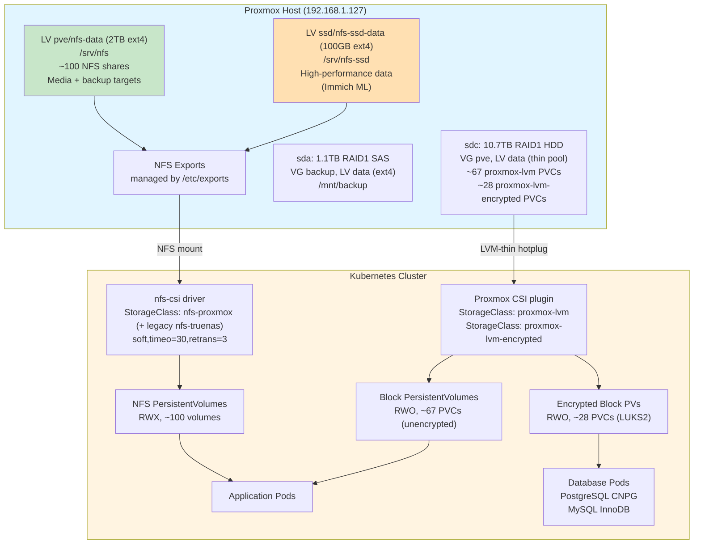

# Storage Architecture

Last updated: 2026-04-15

## Overview

The cluster uses two storage backends: **Proxmox CSI** for database block storage and **Proxmox NFS** for application data.

**Block storage (Proxmox CSI)**: ~95 PVCs for databases and stateful apps use two StorageClasses provisioned from the same `local-lvm` thin pool (sdc, 10.7TB RAID1 HDD):
- **`proxmox-lvm`**: Unencrypted block storage for non-sensitive workloads (~67 PVCs)
- **`proxmox-lvm-encrypted`**: LUKS2-encrypted block storage for all sensitive data (~28 PVCs) — databases, auth, email, password managers, git repos, health data, etc. Uses Argon2id key derivation with passphrase from Vault KV.

All services storing sensitive data were migrated to `proxmox-lvm-encrypted` on 2026-04-15. This eliminates the previous double-CoW (ZFS + LVM-thin) path and ensures data-at-rest encryption.

**NFS storage (Proxmox host)**: ~100 NFS shares for media libraries (Immich, audiobookshelf, servarr, navidrome), backup targets (`*-backup/` directories), and app data are served directly from the Proxmox host at `192.168.1.127`. Two NFS export roots exist:
- **HDD NFS**: `/srv/nfs` on ext4 LV `pve/nfs-data` (2TB) — bulk media and backup targets
- **SSD NFS**: `/srv/nfs-ssd` on ext4 LV `ssd/nfs-ssd-data` (100GB) — high-performance data (Immich ML)

Both `StorageClass: nfs-truenas` and `StorageClass: nfs-proxmox` point to the Proxmox host and are functionally identical. The `nfs-truenas` name is historical — it was retained because StorageClass names are immutable on bound PVs (48 PVs reference it) and renaming would force mass PV churn across the cluster.

**Backup storage (sda)**: 1.1TB RAID1 SAS disk, VG `backup`, LV `data` (ext4), mounted at `/mnt/backup` on PVE host. Dedicated backup disk for weekly PVC file backups, auto SQLite backups, pfSense backups, and PVE config. NFS data syncs directly to Synology via inotify change tracking (not stored on sda). Independent of live storage (sdc).

**History (2026-04-02)**: iSCSI block volumes migrated from democratic-csi (TrueNAS iSCSI → ZFS → LVM-thin) to Proxmox CSI (direct LVM-thin hotplug). democratic-csi iSCSI driver removed.

**History (2026-04-13)**: TrueNAS (VM 9000, 10.0.10.15) fully decommissioned. NFS storage migrated to the Proxmox host (192.168.1.127). ZFS datasets under `/mnt/main/` and `/mnt/ssd/` moved to ext4 LVs at `/srv/nfs/` and `/srv/nfs-ssd/`. Legacy PVs referencing `/mnt/main/` paths still work (bind-mounted or symlinked on the Proxmox host); new PVs use `/srv/nfs/` and `/srv/nfs-ssd/`. TrueNAS VM still exists in stopped state on PVE pending user decision on deletion.

## Architecture Diagram



## Components

| Component | Version/Config | Location | Purpose |
|-----------|---------------|----------|---------|
| **Proxmox CSI plugin** | Helm chart | Namespace: proxmox-csi | Block storage via LVM-thin hotplug |
| **StorageClass `proxmox-lvm`** | RWO, WaitForFirstConsumer | Cluster-wide | Non-sensitive stateful apps |
| **StorageClass `proxmox-lvm-encrypted`** | RWO, WaitForFirstConsumer, LUKS2 | Cluster-wide | **All sensitive data** (databases, auth, email, passwords, git) |
| Proxmox NFS (HDD) | LV `pve/nfs-data`, 2TB ext4 | 192.168.1.127:/srv/nfs | Bulk NFS data for all services |
| Proxmox NFS (SSD) | LV `ssd/nfs-ssd-data`, 100GB ext4 | 192.168.1.127:/srv/nfs-ssd | High-performance data (Immich ML) |
| nfs-csi | Helm chart | Namespace: nfs-csi | NFS CSI driver |
| StorageClass `nfs-proxmox` | RWX, soft mount | Cluster-wide | NFS storage, points to Proxmox host |
| StorageClass `nfs-truenas` | RWX, soft mount | Cluster-wide | **Historical name** — functionally identical to `nfs-proxmox`, points to the Proxmox host. Kept because SC names are immutable on 48 bound PVs. |
| TF module `nfs_volume` | `modules/kubernetes/nfs_volume/` | Infra repo | Static NFS PV/PVC factory |
| ~~TrueNAS VM~~ | **DECOMMISSIONED 2026-04-13** | Was VM 9000 at 10.0.10.15 | Replaced by Proxmox NFS. VM still in stopped state pending deletion. |
| ~~democratic-csi-iscsi~~ | **REMOVED** | Was namespace: iscsi-csi | Replaced by Proxmox CSI (2026-04-02) |
| ~~StorageClass `iscsi-truenas`~~ | **REMOVED** | Was cluster-wide | Replaced by `proxmox-lvm` |

## How It Works

### NFS Storage Flow

1. **Directory creation**: NFS share directories are created under `/srv/nfs/<service>` (HDD) or `/srv/nfs-ssd/<service>` (SSD) on the Proxmox host
2. **Export configuration**: `/etc/exports` on the Proxmox host lists per-directory NFS exports
3. **Terraform module**: Stacks use `modules/kubernetes/nfs_volume/` to declaratively create static PV + PVC pairs:
   ```hcl
   module "nfs_data" {
     source     = "../../modules/kubernetes/nfs_volume"
     name       = "immich-data"
     namespace  = kubernetes_namespace.immich.metadata[0].name
     nfs_server = var.nfs_server  # 192.168.1.127
     nfs_path   = "/srv/nfs/immich"
   }
   ```
4. **Pod mount**: Applications reference PVCs in their deployment specs
5. **Mount options**: All NFS mounts use `soft,timeo=30,retrans=3` (set in StorageClass) to prevent indefinite hangs

**Note**: Some legacy PVs still reference `/mnt/main/<service>` paths. These work via compatibility symlinks/bind-mounts on the Proxmox host. New PVs should use `/srv/nfs/<service>` or `/srv/nfs-ssd/<service>`.

**CRITICAL**: Never use inline `nfs {}` blocks in pod specs — they default to `hard,timeo=600` which causes 10-minute hangs on network issues. Always use the `nfs-proxmox` StorageClass (or the legacy `nfs-truenas` for existing PVs) via PVCs.

### Block Storage Flow (Proxmox CSI) — NEW

1. **PVC creation**: Pod requests a PVC with `storageClass: proxmox-lvm`
2. **CSI provisioning**: Proxmox CSI plugin calls the Proxmox API to create a thin LV in the `local-lvm` storage
3. **SCSI hotplug**: The thin LV is hotplugged as a VirtIO-SCSI disk directly into the K8s node VM
4. **Filesystem**: CSI formats the disk as ext4 and mounts it into the pod
5. **Exclusive access**: RWO only — disk is attached to one VM at a time
6. **Topology**: Nodes are labeled with `topology.kubernetes.io/region=pve` and `zone=pve` for scheduling

**Key advantage**: Single CoW layer (LVM-thin only). No ZFS, no iSCSI network hop, no double-CoW corruption.

**Proxmox API token**: `csi@pve!csi-token` with CSI role (`VM.Audit VM.Config.Disk Datastore.Allocate Datastore.AllocateSpace Datastore.Audit`). Stored in Vault at `secret/viktor`.

### Encrypted Block Storage Flow (proxmox-lvm-encrypted) — 2026-04-15

1. **PVC creation**: Pod requests a PVC with `storageClass: proxmox-lvm-encrypted`
2. **CSI provisioning**: Same as `proxmox-lvm` — thin LV created in `local-lvm`
3. **LUKS encryption**: CSI node plugin reads the encryption passphrase from K8s Secret `proxmox-csi-encryption` (namespace `kube-system`), formats the disk with LUKS2 (Argon2id key derivation), then creates ext4 on top
4. **Transparent mounting**: Application sees a normal ext4 filesystem — encryption/decryption is handled by dm-crypt in the kernel
5. **Passphrase management**: ExternalSecret syncs passphrase from Vault KV (`secret/viktor/proxmox_csi_encryption_passphrase`) → K8s Secret. Backup key at `/root/.luks-backup-key` on PVE host.

**Services on encrypted storage (2026-04-15 migration):**
vaultwarden, dbaas (mysql+pg+pgadmin), mailserver, nextcloud, forgejo, matrix, n8n, affine, health, hackmd, redis, headscale, frigate, meshcentral, technitium, actualbudget, grampsweb, owntracks, wealthfolio, monitoring (alertmanager)

**Services migrated later** (post-audit catch-up): paperless-ngx (2026-04-25 — sensitive document scans had been left on plain `proxmox-lvm` by an abandoned attempt; rsync swap cleaned up the orphan and re-did via Terraform).

**CSI node plugin memory**: Requires 1280Mi limit for LUKS2 Argon2id key derivation (~1GiB). Set via `node.plugin.resources` in Helm values (not `node.resources`).

**Terraform stack**: `stacks/proxmox-csi/` manages both StorageClasses, the ExternalSecret, and CSI plugin resources.

### iSCSI Storage Flow (DEPRECATED — replaced 2026-04-02)

> **This section is historical.** All iSCSI PVCs have been migrated to Proxmox CSI (`proxmox-lvm`). The democratic-csi iSCSI driver is pending removal.

1. ~~Zvol creation: democratic-csi creates ZFS zvols under `main/iscsi/<pvc-name>` via SSH commands~~
2. ~~Target setup: TrueNAS iSCSI service exposes zvols as iSCSI LUNs~~
3. ~~Initiator connection: K8s nodes connect via open-iscsi~~

### SQLite on NFS — Why It Fails

SQLite uses `fsync()` to guarantee durability. NFS's soft mount + async semantics break this:
- Soft mount returns success even if data is still in client cache
- Network blips during fsync → incomplete writes → corruption
- WAL mode helps but doesn't eliminate the race

**Solution**: Use Proxmox CSI (`proxmox-lvm`) for any SQLite database (Vaultwarden, plotting-book) or local disk (ephemeral).

### ~~Democratic-CSI Sidecar Resources~~ (HISTORICAL — democratic-csi removed)

> Democratic-csi has been removed along with TrueNAS decommissioning (2026-04). This section is kept for historical reference only.

## Configuration

### Key Files

| Path | Purpose |
|------|---------|
| `/etc/exports` (on Proxmox host) | NFS export configuration for all service shares |
| `stacks/proxmox-csi/` | Terraform stack for Proxmox CSI plugin + StorageClass |
| `stacks/nfs-csi/` | NFS CSI driver + StorageClasses (`nfs-proxmox` + legacy `nfs-truenas`) |
| `modules/kubernetes/nfs_volume/` | Reusable module for static NFS PV/PVC creation |
| `config.tfvars` | Variable `nfs_server = "192.168.1.127"` shared by all stacks |

### Vault Paths

| Path | Contents |
|------|----------|
| `secret/viktor/proxmox_csi_encryption_passphrase` | LUKS2 encryption passphrase for `proxmox-lvm-encrypted` StorageClass |
| ~~`secret/viktor/truenas_ssh_key`~~ | **REMOVED** — was SSH key for democratic-csi SSH driver (TrueNAS decommissioned 2026-04-13) |
| ~~`secret/viktor/truenas_root_password`~~ | **REMOVED** — was TrueNAS root password (TrueNAS decommissioned 2026-04-13) |
| ~~`secret/viktor/truenas_api_key`~~ | **REMOVED** — was TrueNAS API key (TrueNAS decommissioned 2026-04-13) |
| ~~`secret/viktor/truenas_ssh_private_key`~~ | **REMOVED** — was TrueNAS SSH private key (TrueNAS decommissioned 2026-04-13) |

### Terraform Stacks

- **`stacks/proxmox-csi/`**: Deploys Proxmox CSI plugin + `proxmox-lvm` and `proxmox-lvm-encrypted` StorageClasses + ExternalSecret for encryption passphrase + node topology labels
- **`stacks/nfs-csi/`**: Deploys NFS CSI driver + StorageClasses for Proxmox NFS
- All application stacks reference NFS volumes via `module "nfs_<name>"` calls
- Database PVCs use `storageClass: proxmox-lvm` (CNPG, MySQL Helm VCT, Redis Helm, standalone PVCs)

### NFS Export Management

NFS exports are NOT managed by Terraform. To add a new service:

1. SSH to Proxmox host: `ssh root@192.168.1.127`
2. Create the directory: `mkdir -p /srv/nfs/<service> && chmod 777 /srv/nfs/<service>`
3. Edit `/etc/exports` — add the export entry
4. Reload exports: `exportfs -ra`
5. Verify: `showmount -e 192.168.1.127`

## Decisions & Rationale

### Why NFS for Most Workloads?

- **Simplicity**: No volume provisioning delays, instant mounts
- **RWX support**: Multiple pods can share one volume (Nextcloud, Immich)
- **Good enough**: For SQLite on NFS specifically, we accept the risk for low-value data (logs, caches) but mandate proxmox-lvm for critical DBs

### Why Proxmox CSI for Databases? (formerly iSCSI)

- **ACID guarantees**: Block device + local filesystem = real fsync
- **Performance**: No NFS protocol overhead for random I/O, no network hop (LVM-thin hotplug direct to VM)
- **Tested**: PostgreSQL CNPG and MySQL InnoDB Cluster both run on proxmox-lvm, zero corruption
- **Single CoW layer**: LVM-thin only, no ZFS double-CoW issues

### Why Soft Mount for NFS?

Hard mounts with default `timeo=600` (10 minutes) cause:
- 10-minute pod startup delays if NFS server is unreachable
- `kubectl delete pod` hangs for 10 minutes
- Kernel task hangs blocking node operations

Soft mount (`soft,timeo=30,retrans=3`) trades availability for responsiveness:
- Max 90s hang (30s × 3 retries)
- Operations return EIO after timeout → app can handle error
- Acceptable for non-critical data paths

**Critical paths**: Databases use proxmox-lvm (not NFS), so soft mount never affects data integrity.

## Troubleshooting

### NFS Mount Hangs

**Symptom**: Pod stuck in `ContainerCreating`, `df -h` hangs on NFS mount

**Diagnosis**:
```bash
# On K8s node
mount | grep nfs
showmount -e 192.168.1.127

# Check NFS server (Proxmox host)
ssh root@192.168.1.127
ls -la /srv/nfs/<service>
cat /etc/exports | grep <service>
```

**Fix**:
1. Verify directory exists: `ls /srv/nfs/<service>` (or `/srv/nfs-ssd/<service>`)
2. Verify export: `grep <service> /etc/exports`
3. If missing: add to `/etc/exports` and run `exportfs -ra`
4. Restart NFS server: `systemctl restart nfs-server`

### ~~iSCSI Session Drops~~ (HISTORICAL — iSCSI removed)

> iSCSI was replaced by Proxmox CSI (2026-04-02) and TrueNAS has been decommissioned. This section is kept for historical reference only.

### SQLite Corruption on NFS

**Symptom**: `database disk image is malformed`, checksum errors

**Diagnosis**:
```bash
# In pod
sqlite3 /data/db.sqlite "PRAGMA integrity_check;"
```

**Fix**: Migrate to proxmox-lvm
1. Create proxmox-lvm PVC in Terraform stack
2. Restore from backup to new volume
3. Update deployment to use new PVC
4. Delete old NFS PVC

### Slow NFS Performance

**Symptom**: High latency on file operations, `iostat` shows NFS wait times

**Diagnosis**:
```bash
# On Proxmox host
ssh root@192.168.1.127
iostat -x 5
lvs --reportformat json pve/nfs-data ssd/nfs-ssd-data

# On K8s node
nfsiostat 5
```

**Optimization**:
1. Move hot data to SSD NFS: relocate from `/srv/nfs/<service>` to `/srv/nfs-ssd/<service>` and update PV path
2. Tune NFS mount: add `rsize=1048576,wsize=1048576` to StorageClass `mountOptions`

## Related

- **Runbooks**:
  - `docs/runbooks/restore-postgresql.md`
  - `docs/runbooks/restore-mysql.md`
  - `docs/runbooks/recover-nfs-mount.md`
- **Architecture**: `docs/architecture/backup-dr.md` (backup strategy using LVM snapshots and Proxmox host scripts)
- **Reference**: `.claude/reference/service-catalog.md` (which services use NFS vs proxmox-lvm)
