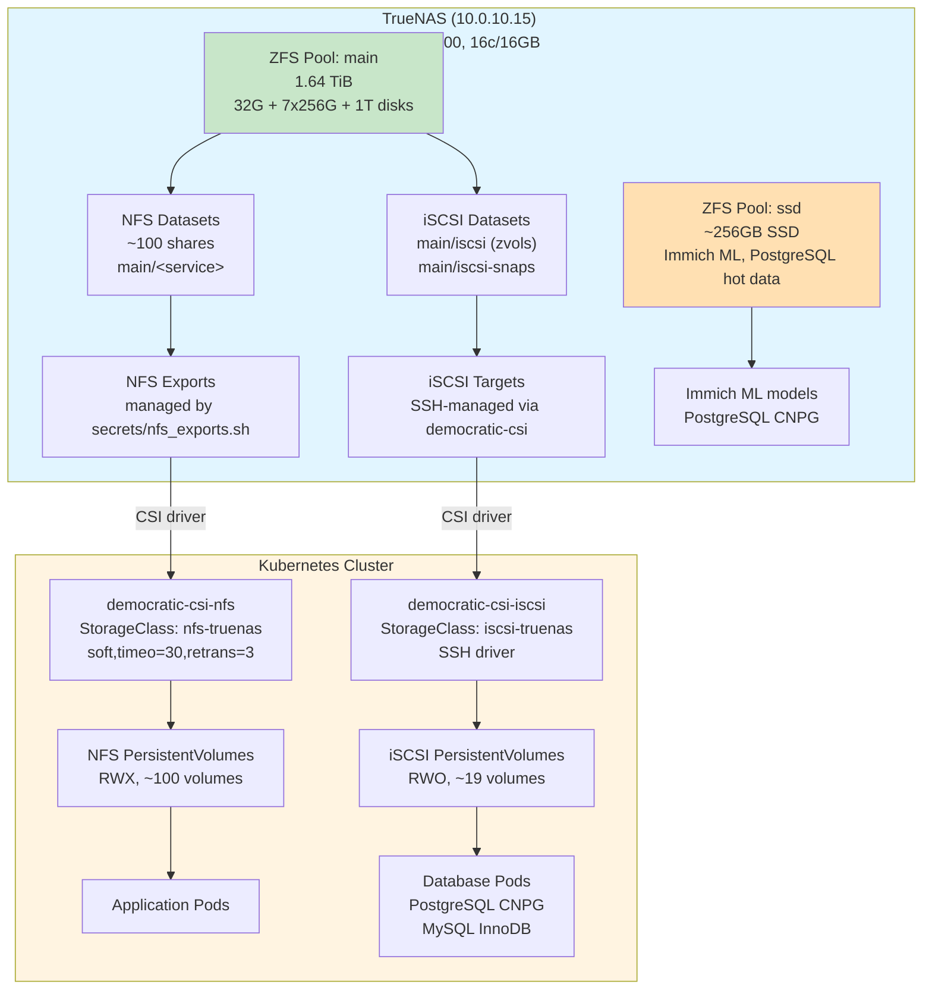

# Storage Architecture

Last updated: 2026-03-24

## Overview

The cluster storage layer is built on TrueNAS ZFS at `10.0.10.15` (VMID 9000), providing both NFS shared storage and iSCSI block devices via democratic-csi. NFS serves ~100 application data directories for stateless services and those using file-based or SQLite databases, while iSCSI provides block devices for ~19 PVCs backing production MySQL and PostgreSQL databases. This hybrid approach optimizes for both performance (iSCSI for databases requiring ACID guarantees) and simplicity (NFS for everything else), with ZFS snapshot-based local protection and incremental offsite replication.

## Architecture Diagram



## Components

| Component | Version/Config | Location | Purpose |
|-----------|---------------|----------|---------|
| TrueNAS VM | VMID 9000, 16c/16GB | Proxmox host (10.0.10.15) | ZFS storage server |
| ZFS pool `main` | 1.64 TiB usable | 32G + 7x256G + 1T disks | Primary storage for all services |
| ZFS pool `ssd` | ~256GB SSD | Dedicated SSD | High-performance data (Immich ML, PostgreSQL) |
| democratic-csi-nfs | Helm chart | Namespace: democratic-csi | NFS CSI driver |
| democratic-csi-iscsi | Helm chart | Namespace: democratic-csi | iSCSI CSI driver (SSH mode) |
| StorageClass `nfs-truenas` | RWX, soft mount | Cluster-wide | Default storage for apps |
| StorageClass `iscsi-truenas` | RWO, block device | Cluster-wide | Databases only |
| TF module `nfs_volume` | `modules/kubernetes/nfs_volume/` | Infra repo | NFS PV/PVC factory |

## How It Works

### NFS Storage Flow

1. **Dataset creation**: NFS shares are created as ZFS datasets under `main/<service>` (e.g., `main/immich`, `main/nextcloud`)
2. **Export configuration**: `/root/secrets/nfs_exports.sh` on TrueNAS generates `/etc/exports` with per-dataset exports (`/mnt/main/<service>`)
3. **CSI provisioning**: democratic-csi-nfs mounts NFS shares and creates K8s PersistentVolumes
4. **Terraform module**: Stacks use `modules/kubernetes/nfs_volume/` to declaratively create PV + PVC pairs:
   ```hcl
   module "nfs_data" {
     source     = "../../modules/kubernetes/nfs_volume"
     name       = "immich-data"
     namespace  = kubernetes_namespace.immich.metadata[0].name
     nfs_server = var.nfs_server  # 10.0.10.15
     nfs_path   = "/mnt/main/immich"
   }
   ```
5. **Pod mount**: Applications reference PVCs in their deployment specs
6. **Mount options**: All NFS mounts use `soft,timeo=30,retrans=3` (set in StorageClass) to prevent indefinite hangs

**CRITICAL**: Never use inline `nfs {}` blocks in pod specs — they default to `hard,timeo=600` which causes 10-minute hangs on network issues. Always use the `nfs-truenas` StorageClass via PVCs.

### iSCSI Storage Flow

1. **Zvol creation**: democratic-csi creates ZFS zvols under `main/iscsi/<pvc-name>` via SSH commands
2. **Target setup**: TrueNAS iSCSI service exposes zvols as iSCSI LUNs
3. **Initiator connection**: K8s nodes connect via open-iscsi, sessions managed by democratic-csi
4. **Hardened timeouts**: All 5 nodes use relaxed iSCSI parameters (baked into cloud-init):
   - `replacement_timeout=300s` (not 120s default)
   - `noop_out_interval=10s`, `noop_out_timeout=15s`
   - HeaderDigest/DataDigest: `CRC32C,None`
5. **Filesystem**: Pods format zvols as ext4 (or leave raw for database engines)
6. **Exclusive access**: RWO only — zvol can only be attached to one node at a time

**Why SSH driver**: The democratic-csi API driver has reliability issues. SSH driver execs `zfs create -V` commands directly, proven stable over 2+ years.

### SQLite on NFS — Why It Fails

SQLite uses `fsync()` to guarantee durability. NFS's soft mount + async semantics break this:
- Soft mount returns success even if data is still in client cache
- Network blips during fsync → incomplete writes → corruption
- WAL mode helps but doesn't eliminate the race

**Solution**: Use iSCSI for any SQLite database (Vaultwarden, plotting-book) or local disk (ephemeral).

### Democratic-CSI Sidecar Resources

The Helm chart spawns 17 sidecar containers (driver-registrar, external-provisioner, etc.) across controller + node DaemonSet pods. Each sidecar defaults to `resources: {}`, which gets LimitRange defaults of 256Mi.

**Fix**: Set explicit resources in `values.yaml`:
```yaml
csiProxy:  # TOP-LEVEL key, not nested
  resources:
    requests:
      memory: "32Mi"
    limits:
      memory: "32Mi"

controller:
  externalProvisioner:
    resources:
      requests: {memory: "64Mi"}
      limits: {memory: "64Mi"}
  # ... repeat for all sidecars
```

Total footprint: ~1.5Gi → ~400Mi.

## Configuration

### Key Files

| Path | Purpose |
|------|---------|
| `/root/secrets/nfs_exports.sh` | TrueNAS: generates `/etc/exports` with all service shares |
| `stacks/democratic-csi/` | Terraform stack for both CSI drivers |
| `modules/kubernetes/nfs_volume/` | Reusable module for NFS PV/PVC creation |
| `config.tfvars` | Variable `nfs_server = "10.0.10.15"` shared by all stacks |
| `/var/lib/kubelet/config.yaml` | K8s nodes: iSCSI hardening params applied here |
| `modules/create-template-vm/cloud_init.yaml` | Cloud-init template: bakes iSCSI settings into new nodes |

### Vault Paths

| Path | Contents |
|------|----------|
| `secret/viktor/truenas_ssh_key` | SSH private key for democratic-csi SSH driver |
| `secret/viktor/truenas_root_password` | TrueNAS root password (web UI access) |

### Terraform Stacks

- **`stacks/democratic-csi/`**: Deploys both NFS and iSCSI CSI drivers
- All application stacks reference NFS volumes via `module "nfs_<name>"` calls
- iSCSI PVCs created implicitly by StatefulSets (MySQL, PostgreSQL) using `iscsi-truenas` StorageClass

### NFS Export Management

NFS exports are NOT managed by Terraform. To add a new service:

1. SSH to TrueNAS: `ssh root@10.0.10.15`
2. Edit `/root/secrets/nfs_exports.sh`
3. Add dataset + export entry:
   ```bash
   create_nfs_export "main/<service>" "/mnt/main/<service>"
   ```
4. Run the script: `/root/secrets/nfs_exports.sh`
5. Verify: `showmount -e 10.0.10.15`

## Decisions & Rationale

### Why NFS for Most Workloads?

- **Simplicity**: No volume provisioning delays, instant mounts
- **RWX support**: Multiple pods can share one volume (Nextcloud, Immich)
- **ZFS benefits**: Snapshots, compression, dedup all work at dataset level
- **Good enough**: For SQLite on NFS specifically, we accept the risk for low-value data (logs, caches) but mandate iSCSI for critical DBs

### Why iSCSI for Databases?

- **ACID guarantees**: Block device + local filesystem = real fsync
- **Performance**: No NFS protocol overhead for random I/O
- **Tested**: PostgreSQL CNPG and MySQL InnoDB Cluster both run on iSCSI, zero corruption in 2+ years

### Why SSH Driver Over API?

The democratic-csi API driver (`driver: freenas-api-iscsi`) has these issues:
- Requires TrueNAS API credentials in plaintext ConfigMap
- Fails silently when API schema changes between TrueNAS versions
- No retry logic on transient API errors

SSH driver (`driver: freenas-ssh`) is simpler:
- Direct `zfs` commands, no API translation layer
- SSH key auth (Vault-managed)
- Deterministic error messages

### Why Soft Mount for NFS?

Hard mounts with default `timeo=600` (10 minutes) cause:
- 10-minute pod startup delays if NFS server is unreachable
- `kubectl delete pod` hangs for 10 minutes
- Kernel task hangs blocking node operations

Soft mount (`soft,timeo=30,retrans=3`) trades availability for responsiveness:
- Max 90s hang (30s × 3 retries)
- Operations return EIO after timeout → app can handle error
- Acceptable for non-critical data paths

**Critical paths**: Databases use iSCSI (not NFS), so soft mount never affects data integrity.

## Troubleshooting

### NFS Mount Hangs

**Symptom**: Pod stuck in `ContainerCreating`, `df -h` hangs on NFS mount

**Diagnosis**:
```bash
# On K8s node
mount | grep nfs
showmount -e 10.0.10.15

# Check NFS server
ssh root@10.0.10.15
zfs list | grep main/<service>
cat /etc/exports | grep <service>
```

**Fix**:
1. Verify dataset exists: `zfs list main/<service>`
2. Verify export: `grep <service> /etc/exports`
3. If missing: re-run `/root/secrets/nfs_exports.sh`
4. Restart NFS server: `service nfs-server restart`

### iSCSI Session Drops

**Symptom**: PostgreSQL/MySQL pod restarts, iSCSI reconnection loops

**Diagnosis**:
```bash
# On K8s node
iscsiadm -m session
dmesg | grep iscsi
journalctl -u iscsid -f
```

**Fix**:
1. Check TrueNAS iSCSI service: WebUI → Sharing → iSCSI → Targets
2. Verify hardened timeouts: `iscsiadm -m node -o show | grep timeout`
3. If defaults: re-apply cloud-init or manually update `/etc/iscsi/iscsid.conf`
4. Restart session:
   ```bash
   iscsiadm -m node -u
   iscsiadm -m node -l
   ```

### Democratic-CSI Sidecar OOMKill

**Symptom**: `kubectl describe pod` shows sidecar containers OOMKilled

**Diagnosis**:
```bash
kubectl get events -n democratic-csi | grep OOM
kubectl top pod -n democratic-csi
```

**Fix**:
1. Set explicit resources in Helm values (see "Democratic-CSI Sidecar Resources" above)
2. Apply: `terragrunt apply` in `stacks/democratic-csi/`

### SQLite Corruption on NFS

**Symptom**: `database disk image is malformed`, checksum errors

**Diagnosis**:
```bash
# In pod
sqlite3 /data/db.sqlite "PRAGMA integrity_check;"
```

**Fix**: Migrate to iSCSI
1. Create iSCSI PVC in Terraform stack
2. Restore from backup to new volume
3. Update deployment to use new PVC
4. Delete old NFS PVC

### Slow NFS Performance

**Symptom**: High latency on file operations, `iostat` shows NFS wait times

**Diagnosis**:
```bash
# On TrueNAS
zpool iostat -v 5
arc_summary | grep "Hit Rate"

# On K8s node
nfsiostat 5
```

**Optimization**:
1. Check ZFS ARC hit rate (should be >90%)
2. Move hot datasets to SSD pool: `zfs send main/<dataset> | zfs recv ssd/<dataset>`
3. Tune NFS mount: add `rsize=1048576,wsize=1048576` to StorageClass `mountOptions`

## Related

- **Runbooks**:
  - `docs/runbooks/restore-postgresql.md`
  - `docs/runbooks/restore-mysql.md`
  - `docs/runbooks/recover-nfs-mount.md`
- **Architecture**: `docs/architecture/backup-dr.md` (backup strategy using ZFS snapshots)
- **Reference**: `.claude/reference/service-catalog.md` (which services use NFS vs iSCSI)
