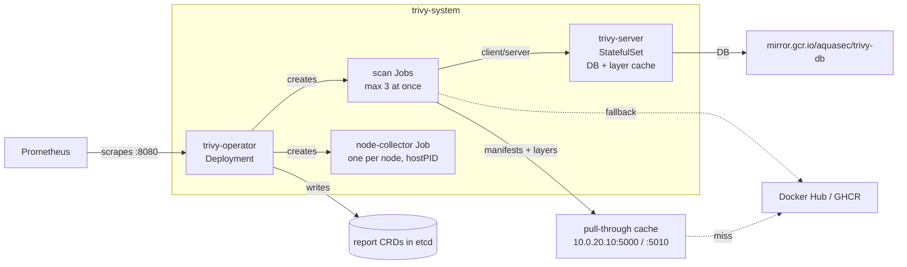

# Trivy Operator

Continuous scanning of what runs in the cluster: image vulnerabilities, secrets baked into images, workload and RBAC configuration, and node/control-plane configuration. Built on 2026-10-10 as Phase 2 of the software-currency design (`docs/plans/2026-10-09-software-currency-design.md`). Stack: `stacks/trivy-operator`.

## What runs

| Component | Image | Notes |
|---|---|---|
| `trivy-operator` Deployment | `mirror.gcr.io/aquasec/trivy-operator:0.35.0` | Watches workloads, runs config audit in-process, serves `trivy_*` metrics. 256Mi request, 1Gi limit. |
| `trivy-server` StatefulSet | `mirror.gcr.io/aquasec/trivy:0.75.0` | Holds the vulnerability DB and the per-layer analysis cache on an emptyDir. 512Mi request, 2Gi limit. |
| scan Jobs | `mirror.gcr.io/aquasec/trivy:0.75.0` | One per workload, at most 3 at once. 128M request, 1Gi limit, 10 minute timeout. |
| node-collector Jobs | `ghcr.io/aquasecurity/node-collector:0.3.1` | One per node, one at a time. Tolerates the control-plane and GPU taints so every node is assessed. |

Chart `aquasecurity/trivy-operator` 0.37.0, pinned in `stacks/trivy-operator/main.tf`. The namespace is in the aux tier, so scan pods get the `tier-4-aux` priority and are the first evicted under memory pressure.

## Scan types

| Scan | Report CRD | Trigger |
|---|---|---|
| Image vulnerabilities (Critical and High only) | `VulnerabilityReport` | New workload revision, then every 24h (`scannerReportTTL`) |
| Secrets in image layers | `ExposedSecretReport` | Same scan job as vulnerabilities |
| Workload, Service, Ingress, PV/PVC and similar config | `ConfigAuditReport` | Resource change, in the operator |
| RBAC | `RbacAssessmentReport`, `ClusterRbacAssessmentReport` | Role change, in the operator |
| Node and control-plane config | `ClusterInfraAssessmentReport` (one per node), `InfraAssessmentReport` (control-plane static pods) | node-collector Job per node |
| CIS 1.23, NSA 1.0, PSS baseline/restricted | `ClusterComplianceReport` | Every 6h, summary form |

Choices that keep the load down, and how to change them:

- **Severity is `CRITICAL,HIGH`.** The alerts act on these two and the digest counts them. The setting applies to every scanner, so config-audit, RBAC and infra findings below High are not stored either. Medium, Low and Unknown would roughly triple each `VulnerabilityReport` in etcd. To widen, edit `trivy.severity`; reports refresh on their next 24h rescan.
- **SBOM reports are off** (`sbomGenerationEnabled = false`). They are the largest report type and nothing reads them.
- **Client/server mode** (`builtInTrivyServer = true`). Scan jobs ask the server which layers it has not analysed yet and send only those. A daily rescan of an unchanged image fetches the manifest and config and little else. The server cache is an emptyDir: after a restart the next pass re-downloads layers once.
- **Registry mirrors.** Scan jobs read image manifests and layers from the LAN pull-through caches on `10.0.20.10` (`:5000` Docker Hub, also used for `docker.n8n.io`, which fronts Docker Hub's `n8nio/n8n`; `:5010` GHCR; `:5020` Quay; `:5030` registry.k8s.io; `:5040` reg.kyverno.io) through Trivy's own `registry.mirrors` config file. Images from other registries (nvcr.io, lscr.io, mcr.microsoft.com, codeberg.org, mirror.gcr.io) are fetched upstream. Trivy tries the mirror first and falls back to the original registry on any error, and reports keep the original image name. Without it, about 108 Docker Hub images rescanned daily would run into Docker Hub's anonymous pull limit, which the nodes share. On the first full scan the one unmirrored Docker Hub front, `docker.n8n.io`, already returned `TOOMANYREQUESTS`, which is why it now maps to the cache too.

## Admission prerequisites (stacks/kyverno)

The question the design left open was which registry the scanner images come from and what the node-collector needs. Measured against chart 0.37.0 and trivy-kubernetes v0.9.1, which trivy-operator v0.35.0 pins:

- The operator, server and scan jobs use `mirror.gcr.io/aquasec/*`. That pattern is on the `require-trusted-registries` list. The node-collector uses `ghcr.io/aquasecurity/node-collector`, already trusted.
- The node-collector pod (`pkg/jobs/template/node-collector.yaml` in trivy-kubernetes) sets `hostPID: true`, mounts `/var/lib/{etcd,kubelet,kube-scheduler,kube-controller-manager}`, `/etc/systemd`, `/lib/systemd`, `/etc/kubernetes` and `/etc/cni/net.d` read-only, and runs as root with `privileged: false`, `allowPrivilegeEscalation: false`, all capabilities dropped and a read-only root filesystem. Of the four pod-security policies, only `deny-host-namespaces` objects to it.
- PolicyException `kyverno/trivy-node-collector-hostpid` exempts Pods and Jobs named `node-collector-*` in `trivy-system` from `deny-host-namespaces` (the Pod rule and its Job autogen rule). Scan jobs are not covered and stay fully enforced. PolicyExceptions were enabled for this, honoured only in the `kyverno` namespace (`docs/architecture/security.md`).

## Metrics

The operator Service carries `prometheus.io/scrape: "true"`, so the `kubernetes-service-endpoints` job scrapes the operator pod on `:8080`. That job keeps only allowlisted metric names, and `trivy_.+` is on the list (`stacks/monitoring/modules/monitoring/prometheus_chart_values.tpl`).

| Metric | Series | Used by |
|---|---|---|
| `trivy_image_vulnerabilities{severity}` | 5 per container | Digest totals (Critical/High; the other severities read 0 because they are not stored) |
| `trivy_vulnerability_id` | one per fixable Critical/High CVE per container | Fixable-CVE alert, digest top items |
| `trivy_image_exposedsecrets{severity}` | 4 per container | Exposed-secret alert |
| `trivy_resource_configaudits`, `trivy_role_rbacassessments`, `trivy_clusterrole_clusterrbacassessments`, `trivy_resource_infraassessments` | 4 per resource | Digest counts |
| `trivy_cluster_compliance` | per spec | Digest |

`trivy_vulnerability_id` is filtered at scrape time: series with an empty `fixed_version`, and Medium/Low/Unknown series, are dropped, and the free-text labels `vuln_title`, `vuln_score`, `published_date` and `last_modified_date` are removed. Unfixable findings remain visible as counts in `trivy_image_vulnerabilities` and in the report CRDs.

Internet reachability comes from `kube_ingress_annotations{annotation_cloudflare_viktorbarzin_me_dns_type}`. `ingress_factory` already stamps `cloudflare.viktorbarzin.me/dns-type` on every ingress it creates (141 of the 201 ingresses on 2026-10-10 are `proxied` or `non-proxied`, across 103 namespaces), and kube-state-metrics exports it through `metricAnnotationsAllowList`. A namespace counts as internet-reachable when any of its ingresses is `proxied` or `non-proxied`.

The design proposed a new `ingress_factory` label for this. The existing annotation carries the same information, and a module change would re-apply all 113 consuming app stacks plus every platform stack (the CI fan-out in `.woodpecker/default.yml`), including the 9 stacks with unaddressed drift on 2026-10-10. The annotation was used instead; a label can still be added later if a consumer needs one.

## Alerts and the weekly digest

Following the design, two kinds of finding post to Slack `#alerts` as they appear, and everything else goes into a weekly summary. Rules live in the `Trivy` group of `prometheus_chart_values.tpl`.

| Alert | Fires when | Granularity |
|---|---|---|
| `TrivyFixableCVEInternetReachable` | an internet-reachable namespace has at least one fixable Critical or High CVE, for 1h | one alert per namespace |
| `TrivyExposedSecretInImage` | an image holds at least one secret, for 1h | one alert per namespace and image repository |
| `TrivyMetricsAbsent` | no `trivy_image_vulnerabilities` series for 2h | single alert |

Both finding alerts use `keep_firing_for: 6h`, which covers the gap while a report is deleted at its 24h TTL and rescanned. They go through their own Alertmanager child route: grouped by alertname, `group_wait` 30m, `group_interval` 24h, `repeat_interval` 8760h. Each post lists every affected namespace or image, and a new finding joins the next daily post rather than sending its own message. Without this, the first full scan, which adds namespaces one at a time over about two hours, would have posted a fresh list every five minutes under the root route's 5m `group_interval`.

Trivy's secret scanner also matches public keys that ship inside third-party libraries. The first one found was an AWS access key ID in yt-dlp's `extractor/shahid.py` in the tripit image. To check a finding, read the file and rule from `kubectl get exposedsecretreports -n <ns> -o json`; for a confirmed false positive, add an Alertmanager silence on `alertname` plus `image_repository`.

The weekly section is appended to the daily `alert-digest` post on Mondays (`TRIVY_WEEKDAY` in `alert_digest.tf`). It reads Prometheus only and shows:

- Critical/High CVE findings (counted per workload container) and the change since last week, split into fixable and unfixable
- fixable Critical/High on internet-reachable workloads (the part that also alerts)
- the 10 images with the most distinct fixable Critical/High CVEs, marked when internet-reachable (an image shared by several workloads counts once)
- how many images hold secrets
- config-audit, RBAC and control-plane assessment counts, with the config-audit change since last week
- failed controls per compliance spec (CIS 1.23, NSA, PSS baseline and restricted), which is where node-level CIS results show up, since per-node `ClusterInfraAssessmentReport`s have no metric

The daily digest collapses more than five firing instances of one alertname into a single line, so the per-namespace Trivy alerts take one line there instead of one per namespace.

There is no automatic link from a finding to an upgrade. Renovate (Phase 3 of the design) picks up a fixed version on its next run.

## Upgrades

Renovate owns the chart pin (Phase 3 of the design). Helm installs the chart's CRDs on first install and never updates them on upgrade. When a release changes a report CRD, apply the CRDs from the new chart's `crds/` directory before or alongside the bump; the chart's release notes say when that is needed.

## Open questions

- Whether Critical/High is the right severity floor. Medium findings are not stored today.
- Whether the daily rescan cadence is worth its registry traffic once the first full pass has populated the server's layer cache. The first pass downloads every image's layers from the pull-through cache once.
