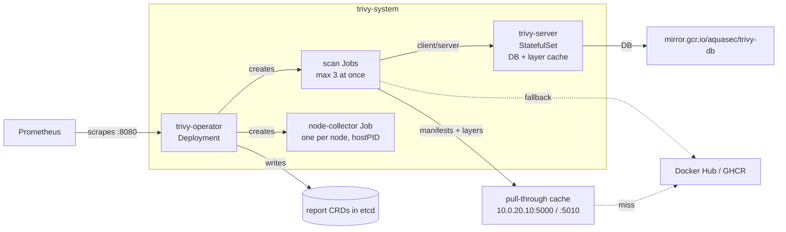

# Trivy Operator

Continuous scanning of what runs in the cluster: image vulnerabilities, secrets baked into images, workload and RBAC configuration, and node/control-plane configuration. Built on 2026-10-10 as Phase 2 of the software-currency design (`docs/plans/2026-10-09-software-currency-design.md`). Stack: `stacks/trivy-operator`.

## What runs

| Component | Image | Notes |
|---|---|---|
| `trivy-operator` Deployment | `mirror.gcr.io/aquasec/trivy-operator:0.35.0` | Watches workloads, runs config audit in-process, serves `trivy_*` metrics. 256Mi request, 1Gi limit. |
| `trivy-server` StatefulSet | `mirror.gcr.io/aquasec/trivy:0.75.0` | Holds the vulnerability DB and the per-layer analysis cache on an emptyDir. 512Mi request, 2Gi limit. |
| scan Jobs | `mirror.gcr.io/aquasec/trivy:0.75.0` | One per workload, at most 3 at once. 128M request, 1Gi limit, 10 minute timeout. |
| node-collector Jobs | `ghcr.io/aquasecurity/node-collector:0.3.1` | One per node, one at a time. Tolerates the control-plane and GPU taints so every node is assessed. |

Chart `aquasecurity/trivy-operator` 0.37.0, pinned in `stacks/trivy-operator/main.tf`. The namespace is in the aux tier, so scan pods get the `tier-4-aux` priority and are the first evicted under memory pressure.

## Scan types

| Scan | Report CRD | Trigger |
|---|---|---|
| Image vulnerabilities (Critical and High only) | `VulnerabilityReport` | New workload revision, then every 24h (`scannerReportTTL`) |
| Secrets in image layers | `ExposedSecretReport` | Same scan job as vulnerabilities |
| Workload, Service, Ingress, PV/PVC and similar config | `ConfigAuditReport` | Resource change, in the operator |
| RBAC | `RbacAssessmentReport`, `ClusterRbacAssessmentReport` | Role change, in the operator |
| Node and control-plane config | `InfraAssessmentReport` | node-collector Job per node |
| CIS 1.23, NSA 1.0, PSS baseline/restricted | `ClusterComplianceReport` | Every 6h, summary form |

Choices that keep the load down, and how to change them:

- **Severity is `CRITICAL,HIGH`.** The alerts act on these two and the digest counts them. Medium, Low and Unknown would roughly triple each `VulnerabilityReport` in etcd. To widen, edit `trivy.severity`; reports refresh on their next 24h rescan.
- **SBOM reports are off** (`sbomGenerationEnabled = false`). They are the largest report type and nothing reads them.
- **Client/server mode** (`builtInTrivyServer = true`). Scan jobs ask the server which layers it has not analysed yet and send only those. A daily rescan of an unchanged image fetches the manifest and config and little else. The server cache is an emptyDir: after a restart the next pass re-downloads layers once.
- **Registry mirrors.** Scan jobs read image manifests and layers from the LAN pull-through cache (`10.0.20.10:5000` for Docker Hub, `:5010` for GHCR) through Trivy's own `registry.mirrors` config file. Trivy tries the mirror first and falls back to the original registry on any error, and reports keep the original image name. Without it, about 108 Docker Hub images rescanned daily would run into Docker Hub's anonymous pull limit, which the nodes share.

## Admission prerequisites (stacks/kyverno)

The question the design left open was which registry the scanner images come from and what the node-collector needs. Measured against chart 0.37.0 and trivy-kubernetes v0.9.1, which trivy-operator v0.35.0 pins:

- The operator, server and scan jobs use `mirror.gcr.io/aquasec/*`. That pattern is on the `require-trusted-registries` list. The node-collector uses `ghcr.io/aquasecurity/node-collector`, already trusted.
- The node-collector pod (`pkg/jobs/template/node-collector.yaml` in trivy-kubernetes) sets `hostPID: true`, mounts `/var/lib/{etcd,kubelet,kube-scheduler,kube-controller-manager}`, `/etc/systemd`, `/lib/systemd`, `/etc/kubernetes` and `/etc/cni/net.d` read-only, and runs as root with `privileged: false`, `allowPrivilegeEscalation: false`, all capabilities dropped and a read-only root filesystem. Of the four pod-security policies, only `deny-host-namespaces` objects to it.
- PolicyException `kyverno/trivy-node-collector-hostpid` exempts Pods and Jobs named `node-collector-*` in `trivy-system` from `deny-host-namespaces` (the Pod rule and its Job autogen rule). Scan jobs are not covered and stay fully enforced. PolicyExceptions were enabled for this, honoured only in the `kyverno` namespace (`docs/architecture/security.md`).

## Upgrades

Renovate owns the chart pin (Phase 3 of the design). Helm installs the chart's CRDs on first install and never updates them on upgrade. When a release changes a report CRD, apply the CRDs from the new chart's `crds/` directory before or alongside the bump; the chart's release notes say when that is needed.

## Open questions

- Whether Critical/High is the right severity floor. Medium findings are not stored today.
- Whether the daily rescan cadence is worth its registry traffic once the first full pass has populated the server's layer cache. The first pass downloads every image's layers from the pull-through cache once.
