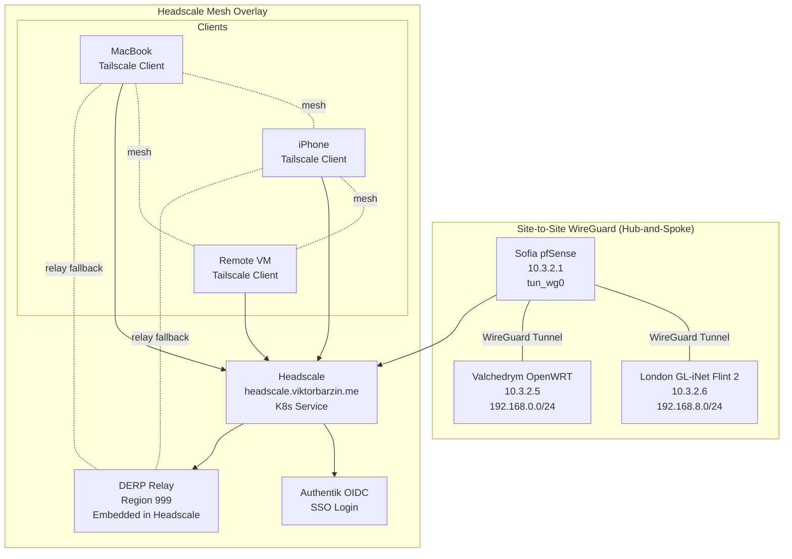
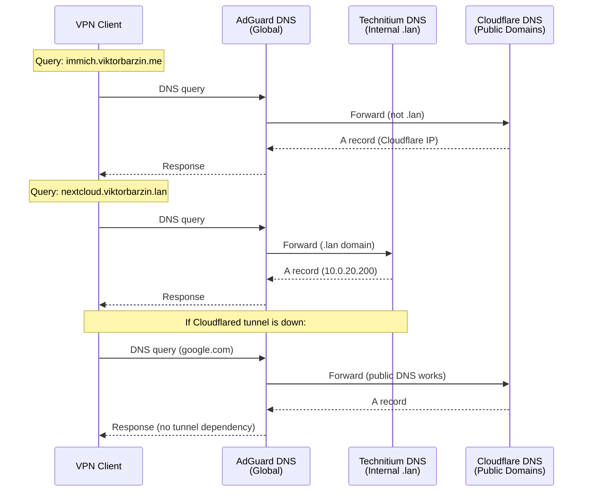

# VPN & Remote Access Architecture

Last updated: 2026-04-10

## Overview

Remote access to the homelab is provided through a hybrid VPN architecture: WireGuard site-to-site tunnels connect physical locations (Sofia, London, Valchedrym), while Headscale (self-hosted Tailscale control server) provides mesh overlay networking for roaming clients. Split DNS architecture ensures resilience: AdGuard serves as the global DNS resolver for all VPN clients, while Technitium handles internal `.lan` domains. This design prevents tunnel dependency for public DNS resolution — if the Cloudflared tunnel goes down, clients can still access the internet.

## Architecture Diagram

### VPN Topology



### DNS Resolution Flow



## Components

| Component | Version/Type | Location | Purpose |
|-----------|-------------|----------|---------|
| WireGuard | Built-in (pfSense/OpenWRT) | Sofia (pfSense), London (GL-iNet Flint 2), Valchedrym (OpenWRT) | Site-to-site encrypted tunnels (hub-and-spoke) |
| Headscale | v0.23.x (container) | K8s (headscale.viktorbarzin.me) | Tailscale control server, mesh coordinator |
| Tailscale | Client v1.x | User devices | Mesh VPN client |
| Authentik | OIDC provider | K8s | SSO authentication for Headscale |
| DERP Relay | Embedded in Headscale | K8s (region 999) | Relay for NAT traversal |
| AdGuard DNS | Container | K8s | Global DNS resolver with ad-blocking |
| Technitium DNS | Container | K8s (10.0.20.101) | Internal .lan domain resolver |

## How It Works

### WireGuard Site-to-Site

Three physical locations are permanently connected via WireGuard in a **hub-and-spoke** topology with Sofia as the hub. A single WireGuard interface (`tun_wg0`) on pfSense carries both peers on the `10.3.2.0/24` tunnel subnet:

- **Sofia** (hub): `10.3.2.1` — pfSense, K8s cluster on `10.0.20.0/24`, management on `10.0.10.0/24`, LAN on `192.168.1.0/24`
- **London** (spoke): `10.3.2.6` — GL-iNet Flint 2 (GL-MT6000), LAN `192.168.8.0/24`, guest `192.168.9.0/24`
- **Valchedrym** (spoke): `10.3.2.5` — OpenWRT router, LAN `192.168.0.0/24`

Routes are configured as static routes on pfSense. London and Valchedrym route Sofia-bound traffic through their WireGuard tunnels. London ↔ Valchedrym traffic transits through Sofia (no direct tunnel).

**Use cases**:
- Replication of Vault data between Sofia and London
- Offsite database replicas
- Accessing Proxmox hosts across locations

### Headscale Mesh Overlay

Headscale is a self-hosted alternative to Tailscale's commercial control plane. It provides:
- **Mesh networking**: Clients establish direct WireGuard connections to each other (peer-to-peer).
- **NAT traversal**: DERP relays provide connectivity when direct connections fail.
- **OIDC authentication**: Users log in via Authentik, no pre-shared keys.
- **ACL policies**: Fine-grained control over which clients can reach which destinations.

**Client onboarding**:
1. User installs Tailscale client (official macOS/iOS/Android app)
2. Runs: `tailscale login --login-server https://headscale.viktorbarzin.me`
3. Browser opens to Authentik SSO login
4. After successful login, Tailscale presents a registration URL
5. Admin approves the device via `headscale nodes register --user <username> --key <key>`
6. Client is added to the mesh, receives IP in 100.64.0.0/10 range

**Connectivity test**: `ping 10.0.20.100` (Sofia K8s API server) verifies full access to the homelab network.

### DERP Relay for NAT Traversal

**Problem**: Symmetric NAT or restrictive firewalls prevent direct WireGuard connections between clients.

**Solution**: Headscale runs an embedded DERP relay server (region 999, named "Home DERP"). DERP is Tailscale's NAT traversal protocol, implemented as an HTTPS-based relay.

**How it works**:
1. Clients attempt direct WireGuard connection via STUN/ICE.
2. If direct connection fails, both clients connect to the DERP relay via HTTPS.
3. Traffic is encrypted end-to-end with WireGuard, DERP only relays packets.
4. No additional ports needed — DERP uses the same HTTPS ingress as Headscale (443).

**Performance**: DERP adds latency (extra hop through Sofia K8s cluster), but ensures connectivity in all scenarios.

### Split DNS Architecture

**Design goal**: Prevent tunnel dependency for public DNS resolution. If the Headscale tunnel or Cloudflared tunnel fails, clients must still resolve public domains.

**Implementation**:
- **AdGuard DNS**: Global recursive resolver, serves all VPN clients. Includes ad-blocking and malicious domain filtering.
- **Technitium DNS**: Internal authoritative server for `.viktorbarzin.lan` domains.

**Resolution flow**:
1. Client queries AdGuard for any domain.
2. If domain ends in `.lan`, AdGuard forwards to Technitium (10.0.20.201).
3. For all other domains, AdGuard resolves directly via upstream (Cloudflare 1.1.1.1).
4. AdGuard caches responses, reducing load on Technitium and upstream.

**Resilience**: Even if the tunnel to Sofia is down, clients can still resolve `google.com`, `github.com`, etc., because AdGuard talks directly to Cloudflare. Only `.lan` domains become unavailable.

### Access Control (Authentik Groups)

**Headscale Users** group in Authentik controls VPN access. Membership is invitation-only:
1. Admin creates user in Authentik.
2. Admin adds user to "Headscale Users" group.
3. User logs in via OIDC during `tailscale login`.
4. Headscale verifies group membership via OIDC claims.

Removing a user from the group revokes VPN access on next re-authentication (every 30 days).

## Configuration

### Terraform Stacks

| Stack | Path | Resources |
|-------|------|-----------|
| Headscale | `stacks/headscale/` | Deployment, Service, Ingress, ConfigMap |
| AdGuard | `stacks/adguard/` | Deployment, Service, PVC |
| Technitium | `stacks/technitium/` | Deployment, Service, PVC |
| pfSense (Sofia) | Not in Terraform | WireGuard tunnel configs (managed via pfSense UI) |

### Headscale Configuration

**ConfigMap**: `stacks/headscale/main.tf`
```yaml
server_url: https://headscale.viktorbarzin.me
listen_addr: 0.0.0.0:8080
metrics_listen_addr: 0.0.0.0:9090

oidc:
  issuer: https://authentik.viktorbarzin.me/application/o/headscale/
  client_id: <redacted>
  client_secret: <from Vault>
  scope: ["openid", "profile", "email", "groups"]
  allowed_groups: ["Headscale Users"]

derp:
  server:
    enabled: true
    region_id: 999
    region_code: "home"
    region_name: "Home DERP"
    stun_listen_addr: "0.0.0.0:3478"
  urls:
    - https://controlplane.tailscale.com/derpmap/default
  auto_update_enabled: true
  update_frequency: 24h

ip_prefixes:
  - 100.64.0.0/10

dns_config:
  nameservers:
    - 10.0.20.102  # AdGuard DNS
  domains:
    - viktorbarzin.lan
  magic_dns: true
```

**Secrets (Vault)**:
- `secret/headscale/oidc_client_secret`

**Ingress**: Standard `ingress_factory` with `protected = false` (OIDC is handled by Headscale itself).

### AdGuard Configuration

**Upstream DNS servers**:
- Cloudflare: `1.1.1.1`, `1.0.0.1`
- Google: `8.8.8.8`, `8.8.4.4`

**Conditional forwarding**:
- `viktorbarzin.lan` → `10.0.20.101` (Technitium)

**Ad-blocking lists**:
- AdGuard DNS filter
- OISD full list
- Developer Dan's ads and tracking list

**Custom rules**: Block telemetry for Windows, macOS, and smart TVs.

### WireGuard (pfSense — Hub)

**Single interface `tun_wg0`** (OPT2) with two peers on subnet `10.3.2.0/24`. Listens on `*:51821` for both IPv4 and IPv6. IPv6 access via HE tunnel (`gif0`, `2001:470:6e:43d::2`) requires a `pass in` pf rule on the `HE_IPv6` interface (interface name `opt3` in config.xml):

**Peer: London Flint 2**:
- WireGuard IP: `10.3.2.6`
- Remote endpoint: `vpn.viktorbarzin.me:51821` (dual-stack: A=176.12.22.76, AAAA=2001:470:6e:43d::2)
- Allowed IPs: `192.168.8.0/24, 192.168.9.0/24, 192.168.10.0/24, 10.3.2.6/32`
- Keepalive: 25 seconds (configured on London side)

**Peer: Valchedrym**:
- WireGuard IP: `10.3.2.5`
- Remote endpoint: `85.130.41.28:51820`
- Allowed IPs: `10.3.2.5/32, 192.168.0.0/24`
- Keepalive: none (should be added)

**Static routes on pfSense**:
- `192.168.0.0/24` → gateway `valchedrym` (10.3.2.5)
- `192.168.8.0/24` → gateway `london_flint_2` (10.3.2.6)
- `192.168.9.0/24` → gateway `london_flint_2` (10.3.2.6)
- `192.168.10.0/24` → gateway `london_flint_2` (10.3.2.6)

**Note**: WireGuard on pfSense is NOT managed by Terraform — configured via pfSense UI/shell.

### WireGuard (London — GL-iNet Flint 2)

- Interface: `wgclient1` (proto `wgclient`, config `peer_855`)
- Local IP: `10.3.2.6/32`
- Remote endpoint: `vpn.viktorbarzin.me:51821` (dual-stack — resolves to IPv4 or IPv6)
- Allowed IPs: `10.0.0.0/8, 192.168.1.0/24, 192.168.0.0/24`
- Keepalive: 25 seconds
- Policy routing: GL-iNet marks traffic via iptables mangle → routing table 1001 (ipset `dst_net10`)
- Persistence: `/etc/firewall.user` injects LOCAL_POLICY mangle rule (GL-iNet's `gl-tertf` creates TUNNEL10_ROUTE_POLICY but not the LOCAL_POLICY rule for router-originated traffic)

**GL-iNet AllowedIPs format**: UCI `list allowed_ips` entries are concatenated by the `wgclient` protocol handler. Use a **single comma-separated entry** (`'10.0.0.0/8,192.168.1.0/24,192.168.0.0/24'`), NOT multiple list entries. Multiple entries cause a parse error like `10.0.0.0/8192.168.1.0/24` (no separator).

**DNS**: AdGuardHome runs on the router. Upstream DNS should NOT include `1.1.1.1` — it creates conntrack conflicts with ICMP and GL-iNet's `carrier-monitor` health check floods Cloudflare, triggering ICMP rate limits. Use `9.9.9.9`, `8.8.4.4` instead. Health check IPs (`glconfig.general.track_ip`) should use `1.0.0.1` not `1.1.1.1`.

### WireGuard (Valchedrym — OpenWRT)

- WireGuard IP: `10.3.2.5`
- Remote endpoint: Sofia public IP
- LAN: `192.168.0.0/24`

### Vault Secrets

- Headscale OIDC client secret: `secret/headscale/oidc_client_secret`
- WireGuard private keys: `secret/pfsense/wg_privkey_london`, `secret/pfsense/wg_privkey_valchedrym`

## Decisions & Rationale

### Why Headscale Instead of Plain WireGuard?

**Alternatives considered**:
1. **WireGuard with static configs**: Requires manual key distribution, complex peer management.
2. **OpenVPN**: Slower, more overhead, less mobile-friendly.
3. **Commercial Tailscale**: SaaS, not self-hosted, less control over data.

**Decision**: Headscale provides:
- **Mesh networking**: Clients connect directly, not through a central server.
- **OIDC authentication**: No pre-shared keys, integrates with existing SSO.
- **Easy onboarding**: Users install official Tailscale app, no custom configs.
- **Self-hosted**: Full control over control plane and data.

**Trade-off**: More complex setup than plain WireGuard, but operational benefits outweigh initial complexity.

### Why Split DNS (AdGuard + Technitium)?

**Alternatives considered**:
1. **Single DNS server (Technitium only)**: Requires forwarding all public domains to upstream, creating single point of failure.
2. **Cloudflare only**: Fast, but no internal `.lan` domain support without zone delegation.
3. **Tailscale MagicDNS only**: Depends on Headscale control plane, fails if control plane is down.

**Decision**: Split DNS architecture provides:
- **Resilience**: If Headscale tunnel fails, public DNS still works via AdGuard → Cloudflare.
- **Ad-blocking**: AdGuard filters ads and malicious domains for all VPN clients.
- **Internal domains**: Technitium authoritatively serves `.lan`, no external dependency.

**Key benefit**: Zero tunnel dependency for public DNS. Users can browse the internet even if the homelab is completely offline.

### Why Embedded DERP Relay?

**Alternatives considered**:
1. **External DERP relays only (Tailscale's public relays)**: Free, but adds latency and exposes traffic metadata to Tailscale.
2. **No DERP, direct connections only**: Fails for symmetric NAT clients (mobile networks).

**Decision**: Embedded DERP (region 999) provides:
- **Privacy**: All relay traffic stays within the homelab.
- **Reliability**: Not dependent on Tailscale's public infrastructure.
- **No extra ports**: DERP uses HTTPS (443), same as Headscale API.

**Trade-off**: Adds CPU/memory overhead to Headscale pod, but minimal compared to benefits.

### Why OIDC Authentication Instead of Pre-Authorized Keys?

**Alternatives considered**:
1. **Pre-authorized keys**: Headscale generates keys, admin shares with users.
2. **Shared secret**: Single password for all users.

**Decision**: OIDC via Authentik provides:
- **Centralized access control**: Add/remove users in one place.
- **Audit trail**: Authentik logs all login attempts.
- **Group-based authorization**: Only "Headscale Users" group can access VPN.
- **SSO integration**: Users already have accounts in Authentik for other services.

**Key workflow**: Admin invites user → user logs in via Authentik → admin approves device → access granted. No key exchange needed.

## Troubleshooting

### Headscale Login Fails (OIDC Error)

**Symptoms**: `tailscale login --login-server` opens browser, but after Authentik login, shows "OIDC error: invalid state".

**Diagnosis**: Check Headscale logs: `kubectl logs -n headscale deploy/headscale`

**Common causes**:
1. **Client clock skew**: OIDC tokens have short validity (5 minutes). Ensure client's system time is accurate.
2. **Callback URL mismatch**: Authentik application must have `https://headscale.viktorbarzin.me/oidc/callback` in Redirect URIs.
3. **Group membership**: User is not in "Headscale Users" group in Authentik.

**Fix**: Sync system clock, verify Authentik application config, add user to group.

### Direct Connection Fails, Traffic Goes via DERP

**Symptoms**: `tailscale status` shows `relay "home"` instead of direct connection. Higher latency.

**Diagnosis**: Check DERP usage: `tailscale netcheck`

**Common causes**:
1. **Symmetric NAT**: Mobile networks or restrictive corporate firewalls block UDP hole-punching.
2. **Firewall blocking WireGuard**: Port 51820 UDP blocked on one or both clients.
3. **STUN failure**: Can't determine external IP and port.

**Fix**: This is expected behavior in many environments. DERP relay ensures connectivity. If latency is unacceptable, use site-to-site WireGuard instead.

### Can't Resolve .lan Domains from VPN

**Symptoms**: `nslookup nextcloud.viktorbarzin.lan` returns `NXDOMAIN`.

**Diagnosis**: Check DNS chain: Client → AdGuard → Technitium.

**Steps**:
1. Verify AdGuard is running: `kubectl get pod -n adguard`
2. Check AdGuard conditional forwarding: Query AdGuard directly: `nslookup nextcloud.viktorbarzin.lan <adguard-ip>`
3. Check Technitium: `nslookup nextcloud.viktorbarzin.lan 10.0.20.101`

**Common causes**:
1. **AdGuard not forwarding .lan**: Conditional forwarding rule missing or misconfigured.
2. **Technitium down**: Pod crash-looping or PVC corrupted.
3. **DNS propagation delay**: Technitium zone update not yet applied.

**Fix**: Verify conditional forwarding in AdGuard UI. Restart Technitium if needed. Check zone file in Technitium UI.

### VPN Client Can't Reach K8s Services

**Symptoms**: Can `ping 10.0.20.1` (pfSense), but `curl https://immich.viktorbarzin.me` times out.

**Diagnosis**: Check connectivity at each layer:
1. **DNS**: Does `nslookup immich.viktorbarzin.me` return correct IP?
2. **Routing**: Can client reach MetalLB IP? `ping <loadbalancer-ip>`
3. **Firewall**: Is pfSense blocking traffic from VPN subnet?

**Common causes**:
1. **Split DNS working too well**: Client resolves to Cloudflare IP instead of internal LAN IP. Expected for proxied domains — use direct domain (e.g., `immich-direct.viktorbarzin.me`).
2. **ACL policy**: Headscale ACL blocks client from accessing certain subnets.
3. **pfSense NAT rule missing**: Traffic from VPN subnet not routed to VLAN 20.

**Fix**: For proxied domains, use non-proxied DNS names. Check Headscale ACL policy. Verify pfSense NAT rules.

### DERP Relay Returns 502 Bad Gateway

**Symptoms**: Tailscale clients can't connect, DERP shows offline in `tailscale netcheck`.

**Diagnosis**: Check Headscale ingress: `kubectl get ingress -n headscale`

**Common causes**:
1. **Traefik middleware blocking DERP traffic**: Forward-auth interferes with WebSocket upgrade.
2. **Headscale pod not ready**: Liveness probe failing.
3. **Cloudflared tunnel issue**: DERP uses WebSockets, which require HTTP/1.1 upgrade support.

**Fix**: Ensure Headscale ingress has `protected = false` (no forward-auth). Check Headscale pod readiness. Verify Cloudflared supports WebSocket upgrades.

### WireGuard Site-to-Site Tunnel Disconnects

**Symptoms**: Can't reach services in London from Sofia. `ping 192.168.8.1` fails.

**Diagnosis**: Check pfSense WireGuard status via `pfsense.py wireguard` or Dashboard → VPN → WireGuard → Status

**Common causes**:
1. **AllowedIPs parse error on GL-iNet**: If `wg show wgclient1` shows no peers and interface is DOWN with `qdisc noop`, check `/etc/config/wireguard` peer config. AllowedIPs must be a single comma-separated entry, not multiple `list` entries (see London section above).
2. **IPv6 endpoint resolution**: If IPv4 is down, DNS resolves to IPv6 (AAAA record). Ensure the pfSense `HE_IPv6` (gif0) interface has a `pass in` rule for UDP 51821.
3. **Keepalive packets dropped**: Firewall or ISP blocking UDP 51821.
4. **Public IP changed**: Dynamic IP on remote site changed, config still has old IP.
5. **GL-iNet policy routing lost**: After firewall reload, check if `TUNNEL10_ROUTE_POLICY` and `LOCAL_POLICY` mangle rules exist. If not, run `/etc/init.d/firewall restart` and check `/etc/firewall.user` execution.
6. **Kill switch active**: If WG interface is DOWN, table 1001 only has blackhole routes → all marked traffic dropped → IPv4 internet broken.

**Fix**: Check `wg show wgclient1` on London router. If no peers, fix AllowedIPs format and `ifdown/ifup wgclient1`. Verify handshake with `ping 10.3.2.1`.

## Related

- **Runbooks**:
  - `docs/runbooks/add-headscale-user.md`
  - `docs/runbooks/reset-derp-relay.md`
  - `docs/runbooks/update-wireguard-peer.md`
- **Architecture Docs**:
  - `docs/architecture/networking.md` — Core network architecture
  - `docs/architecture/dns.md` — Full DNS architecture (coming soon)
- **Reference**:
  - `.claude/reference/authentik-state.md` — OIDC application configs
  - `.claude/reference/service-catalog.md` — Full service inventory
