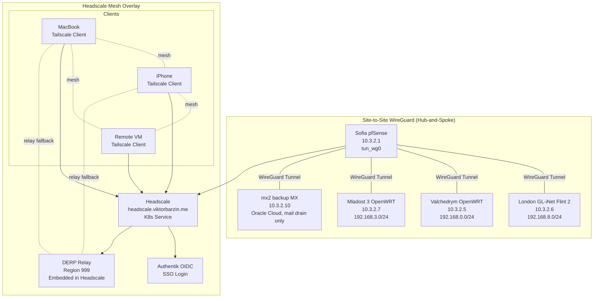
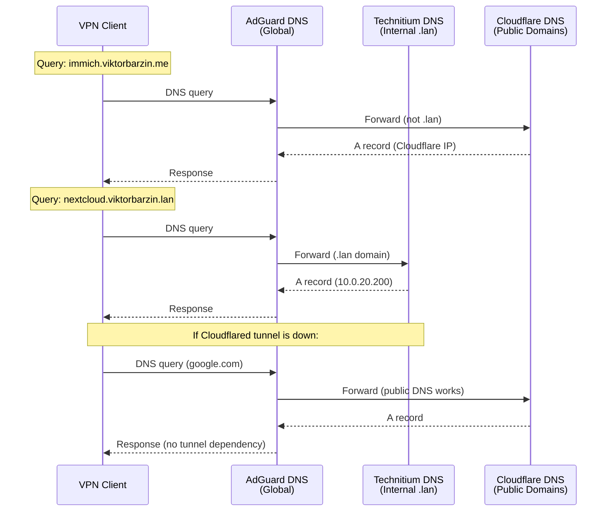

# VPN & Remote Access Architecture

Last updated: 2026-04-10

> **Amendment (2026-08-03) — pfSense is now a real Tailscale subnet router.**
> The body below claims Headscale clients already have "full access to the
> homelab network" (see the Headscale onboarding section's connectivity test).
> **That was not true.** No tailnet node advertised homelab routes: pfSense had
> the Tailscale package installed and staged but sat `Logged out` from ~2026-07-18
> with a spent pre-auth key, and nothing alerted. As of 2026-08-03 it is
> registered (`100.64.0.9`, `tag:infra`, no expiry) and advertises six routes —
> `192.168.1.0/24`, `10.0.10.0/24`, `10.0.20.0/24`, `192.168.0.0/24`,
> `192.168.8.0/24`, `192.168.9.0/24` — plus an exit node, all auto-approved via
> the ACL's `autoApprovers`.
>
> Three corrections that matter when reading the body below:
> - **The Headscale ACL is no longer in Vault.** Source of truth is
>   `stacks/headscale/acl.hujson` (**git-crypt** encrypted, main-checkout only),
>   rendered by `stacks/headscale/main.tf`. `secret/platform.headscale_acl` is a
>   stale break-glass copy — do not edit it.
> - **Client `.lan` DNS is `10.0.20.201`, not `10.0.20.200`.** The `dns.split`
>   entries, the `technitium` `extra_record`, and the ACL `technitium` host all
>   pointed at `.200`, where nothing listens on :53 — so name-based LAN browsing
>   could not have worked regardless of routes. Fixed 2026-08-03.
> - **pfSense runs with `--accept-dns=false --accept-routes=false`** — a firewall
>   must not take DNS or routes from the VPN control plane.
>
> Design + verification evidence + honest limitations:
> [`docs/plans/2026-08-03-pfsense-tailscale-subnet-router-design.md`](../plans/2026-08-03-pfsense-tailscale-subnet-router-design.md).
> Operations: [`docs/runbooks/pfsense-tailscale-subnet-router.md`](../runbooks/pfsense-tailscale-subnet-router.md).
> Reproducer: `playbooks/pfsense-tailscale.yml`. Watchdog: CronJob
> `tailscale-subnet-router-probe` (every 6 h) → `TailscaleSubnetRouterDown` /
> `TailscaleLanUnreachableViaTailnet` / `TailscaleSubnetRouterProbeStale`.

> **Amendment (2026-08-16) — outbound egress is now a first-class service.**
> Everything below concerns INBOUND remote access (getting to the homelab). As
> of 2026-08-16 there is also a supported OUTBOUND path: any cluster workload
> can egress through the existing NordVPN subscription by setting
> `HTTPS_PROXY`/`ALL_PROXY` to
> `http://proxy-egress-uk.proxy.svc.cluster.local:8888` (SOCKS5 on
> `socks5h://…:1080`). It needs no privileges, sidecar or netns sharing —
> gluetun's userspace listener sits inside the tunnel and re-originates the
> request. One always-on UK gateway serves both this and the remote browsers
> from a single tunnel. Fails closed. Verified end to end, including that no
> request leaks to the home address while the gateway is down.
> **It does not defeat anti-bot walls** — a datacenter exit scores worse than a
> residential address on ASN reputation; use `homelab browser run` for those.
> Design: [`docs/plans/2026-08-16-cluster-vpn-egress-service-design.md`](../plans/2026-08-16-cluster-vpn-egress-service-design.md)
> · contract: `stacks/proxy/README.md`.

> **Amendment (2026-07-13) — not yet folded into the body below (a full rewrite
> is design Phase 0).** Two additions since this was written:
> - **mx2 is now VPN PoP-2, not "mail drain only."** The Oracle Always-Free box
>   also terminates VLESS-REALITY (`:8443`), Shadowsocks (`:8388`), and a dnstt
>   DNS tunnel (`:53/udp`), all egressing via Oracle's IP — a path that is
>   neither the home WAN nor Cloudflare (the diversification a censored-network
>   client needs). Server config + rebuild recipe:
>   [`backup-mx.md`](../runbooks/backup-mx.md) → "VPN OCI PoP-2".
> - **A config-distribution portal** ([vpn.viktorbarzin.me](https://vpn.viktorbarzin.me),
>   `stacks/vpn-portal`) now hands out every proxy config as auto-updating
>   subscription URLs (grouped by remote: Home / Cloudflare / OCI), registers
>   WireGuard devices with client-side keygen, and enrolls devices into the
>   Headscale tailnet on demand (short-lived pre-auth keys). Full design:
>   [`docs/plans/2026-07-13-vpn-consolidation-config-portal-design.md`](../plans/2026-07-13-vpn-consolidation-config-portal-design.md).

## Overview

Remote access to the homelab is provided through a hybrid VPN architecture: WireGuard site-to-site tunnels connect physical locations (Sofia, London, Valchedrym), while Headscale (self-hosted Tailscale control server) provides mesh overlay networking for roaming clients. Split DNS architecture ensures resilience: AdGuard serves as the global DNS resolver for all VPN clients, while Technitium handles internal `.lan` domains. This design prevents tunnel dependency for public DNS resolution — if the Cloudflared tunnel goes down, clients can still access the internet.

## Architecture Diagram

### VPN Topology


```mermaid
graph TB
    subgraph "Site-to-Site WireGuard (Hub-and-Spoke)"
        Sofia[Sofia pfSense<br/>10.3.2.1<br/>tun_wg0]
        London[London GL-iNet Flint 2<br/>10.3.2.6<br/>192.168.8.0/24]
        Valchedrym[Valchedrym OpenWRT<br/>10.3.2.5<br/>192.168.0.0/24]
        Mladost3[Mladost 3 OpenWRT<br/>10.3.2.7<br/>192.168.3.0/24]
        MX2[mx2 backup MX<br/>10.3.2.10<br/>Oracle Cloud, mail drain only]

        Sofia ---|WireGuard Tunnel| London
        Sofia ---|WireGuard Tunnel| Valchedrym
        Sofia ---|WireGuard Tunnel| Mladost3
        Sofia ---|WireGuard Tunnel| MX2
    end

    subgraph "Headscale Mesh Overlay"
        HS[Headscale<br/>headscale.viktorbarzin.me<br/>K8s Service]
        Authentik[Authentik OIDC<br/>SSO Login]
        DERP[DERP Relay<br/>Region 999<br/>Embedded in Headscale]

        subgraph "Clients"
            Laptop[MacBook<br/>Tailscale Client]
            Phone[iPhone<br/>Tailscale Client]
            Remote[Remote VM<br/>Tailscale Client]
        end

        HS --> Authentik
        HS --> DERP
        Laptop -.mesh.- Phone
        Laptop -.mesh.- Remote
        Phone -.mesh.- Remote
        Laptop --> HS
        Phone --> HS
        Remote --> HS

        Laptop -.relay fallback.- DERP
        Phone -.relay fallback.- DERP
    end

    Sofia --> HS
```

### DNS Resolution Flow


```mermaid
sequenceDiagram
    participant Client as VPN Client
    participant AdGuard as AdGuard DNS<br/>(Global)
    participant Technitium as Technitium DNS<br/>(Internal .lan)
    participant Cloudflare as Cloudflare DNS<br/>(Public Domains)

    Note over Client: Query: immich.viktorbarzin.me
    Client->>AdGuard: DNS query
    AdGuard->>Cloudflare: Forward (not .lan)
    Cloudflare-->>AdGuard: A record (Cloudflare IP)
    AdGuard-->>Client: Response

    Note over Client: Query: nextcloud.viktorbarzin.lan
    Client->>AdGuard: DNS query
    AdGuard->>Technitium: Forward (.lan domain)
    Technitium-->>AdGuard: A record (10.0.20.200)
    AdGuard-->>Client: Response

    Note over Client,Technitium: If Cloudflared tunnel is down:
    Client->>AdGuard: DNS query (google.com)
    AdGuard->>Cloudflare: Forward (public DNS works)
    Cloudflare-->>AdGuard: A record
    AdGuard-->>Client: Response (no tunnel dependency)
```

## Components

| Component | Version/Type | Location | Purpose |
|-----------|-------------|----------|---------|
| WireGuard | Built-in (pfSense/OpenWRT) | Sofia (pfSense), London (GL-iNet Flint 2), Valchedrym (OpenWRT) | Site-to-site encrypted tunnels (hub-and-spoke) |
| Headscale | v0.23.x (container) | K8s (headscale.viktorbarzin.me) | Tailscale control server, mesh coordinator |
| Tailscale | Client v1.x | User devices | Mesh VPN client |
| Authentik | OIDC provider | K8s | SSO authentication for Headscale |
| DERP Relay | Embedded in Headscale | K8s (region 999) | Relay for NAT traversal |
| AdGuard DNS | Container | K8s | Global DNS resolver with ad-blocking |
| Technitium DNS | Container | K8s (10.0.20.201) | Internal .lan domain resolver |

## How It Works

### WireGuard Site-to-Site

Four physical locations are permanently connected via WireGuard in a **hub-and-spoke** topology with Sofia as the hub. A single WireGuard interface (`tun_wg0`) on pfSense carries all peers on the `10.3.2.0/24` tunnel subnet:

- **Sofia** (hub): `10.3.2.1` — pfSense, K8s cluster on `10.0.20.0/24`, management on `10.0.10.0/24`, LAN on `192.168.1.0/24`
- **London** (spoke): `10.3.2.6` — GL-iNet Flint 2 (GL-MT6000), LAN `192.168.8.0/24`, guest `192.168.9.0/24`
- **Valchedrym** (spoke): `10.3.2.5` — OpenWRT router, LAN `192.168.0.0/24`
- **Mladost 3** (spoke, since 2026-10): `10.3.2.7` — OpenWRT router (TP-Link TL-WDR4300 v1), LAN `192.168.3.0/24`
- **mx2 / backup MX** (road-warrior peer, since 2026-07-08): `10.3.2.10/32` — the Oracle Always-Free backup-MX relay (ADR-0019). Not a site: no LAN behind it; its side allows only `10.0.20.1/32`. The tunnel exists solely so mx2 can drain queued mail to the mailserver HAProxy (Oracle blocks egress TCP 25; the drain is UDP-encapsulated to pfSense `:51821`). Peer reproducer: `scripts/pfsense-backup-mx-wg.sh` (pfSense WireGuard is hand-configured kernel `wg` via `/usr/local/etc/wireguard/tun_wg0.conf`, not the package). Runbook: [`backup-mx.md`](../runbooks/backup-mx.md).

Routes are configured as static routes on pfSense. London, Valchedrym and Mladost 3 route Sofia-bound traffic through their WireGuard tunnels. Traffic between spokes transits through Sofia (no direct tunnels).

**Use cases**:
- Replication of Vault data between Sofia and London
- Offsite database replicas
- Accessing Proxmox hosts across locations

### Headscale Mesh Overlay

Headscale is a self-hosted alternative to Tailscale's commercial control plane. It provides:
- **Mesh networking**: Clients establish direct WireGuard connections to each other (peer-to-peer).
- **NAT traversal**: DERP relays provide connectivity when direct connections fail.
- **OIDC authentication**: Users log in via Authentik, no pre-shared keys.
- **ACL policies**: Fine-grained control over which clients can reach which destinations.

**Client onboarding** — self-service, no admin step:
1. User installs Tailscale client (official macOS/iOS/Android app)
2. Runs: `tailscale login --login-server https://headscale.viktorbarzin.me`
3. Browser opens to Authentik SSO login
4. On success the node registers itself and receives an IP in `100.64.0.0/10`

Every family node registers this way (`register_method: OIDC`); the user just has
to be listed in `oidc.allowed_users`. There is **no** approval round-trip and no
pre-auth key to hand out — a device enrols the moment its owner completes the
Authentik login. (`headscale nodes register` was the pre-OIDC flow and is
deprecated upstream in favour of `headscale auth register`; neither is part of
normal onboarding here.) Pre-auth keys are reserved for headless rebuilds that
cannot run a browser — mx2 uses one, see [`backup-mx.md`](../runbooks/backup-mx.md).

**Reachability**: a non-admin user's nodes reach the Sofia LAN, the internet via
the exit node, and **their own other devices** (the `autogroup:self` rule in
`acl.hujson`). They do not reach another user's devices. `group:admin` reaches
everything. Full policy: `stacks/headscale/acl.hujson`.

**Connectivity test**: `ping 10.0.20.100` (Sofia K8s API server) verifies full access to the homelab network.

### DERP Relay for NAT Traversal

**Problem**: Symmetric NAT or restrictive firewalls prevent direct WireGuard connections between clients.

**Solution**: Headscale runs an embedded DERP relay server (region 999, named "Home DERP"). DERP is Tailscale's NAT traversal protocol, implemented as an HTTPS-based relay.

**How it works**:
1. Clients attempt direct WireGuard connection via STUN/ICE.
2. If direct connection fails, both clients connect to the DERP relay via HTTPS.
3. Traffic is encrypted end-to-end with WireGuard, DERP only relays packets.
4. No additional ports needed — DERP uses the same HTTPS ingress as Headscale (443).

**Performance**: DERP adds latency (extra hop through Sofia K8s cluster), but ensures connectivity in all scenarios.

### Split DNS Architecture

**Design goal**: Prevent tunnel dependency for public DNS resolution. If the Headscale tunnel or Cloudflared tunnel fails, clients must still resolve public domains.

**Implementation**:
- **AdGuard DNS**: Global recursive resolver, serves all VPN clients. Includes ad-blocking and malicious domain filtering.
- **Technitium DNS**: Internal authoritative server for `.viktorbarzin.lan`, and a
  split-horizon view of the public `viktorbarzin.me` zone that answers with internal
  addresses (Traefik on `10.0.20.203`) instead of the public ones.

**Resolution flow**:
1. Client queries AdGuard for any domain.
2. If domain ends in `.lan`, AdGuard forwards to Technitium (10.0.20.201).
3. For all other domains, AdGuard resolves directly via upstream (Cloudflare 1.1.1.1).
4. AdGuard caches responses, reducing load on Technitium and upstream.

**Tailnet clients additionally split `viktorbarzin.me` to Technitium** (headscale
`dns.nameservers.split`, added 2026-08-31). Without it a tailnet client resolves
`.me` publicly, and public DNS answers every non-Cloudflare-proxied host with our
own WAN address — so the client has to hairpin off `176.12.22.76`, which NAT
loopback on the CPE in front of pfSense does not reliably do. The failure is
partial and reads as flakiness: Cloudflare-proxied hosts keep working because
their traffic genuinely leaves and returns, while directly-served ones hang.

**Resilience**: Even if the tunnel to Sofia is down, clients can still resolve `google.com`, `github.com`, etc., because AdGuard talks directly to Cloudflare. Only `.lan` domains become unavailable.

### Access Control (Authentik Groups)

**Headscale Users** group in Authentik controls VPN access. Membership is invitation-only:
1. Admin creates user in Authentik.
2. Admin adds user to "Headscale Users" group.
3. User logs in via OIDC during `tailscale login`.
4. Headscale verifies group membership via OIDC claims.

Removing a user from the group revokes VPN access on next re-authentication (every 30 days).

## Configuration

### Terraform Stacks

| Stack | Path | Resources |
|-------|------|-----------|
| Headscale | `stacks/headscale/` | Deployment, Service, Ingress, ConfigMap |
| AdGuard | `stacks/adguard/` | Deployment, Service, PVC |
| Technitium | `stacks/technitium/` | Deployment, Service, PVC |
| pfSense (Sofia) | Not in Terraform | WireGuard tunnel configs (managed via pfSense UI) |

### Headscale Configuration

**ConfigMap**: `stacks/headscale/main.tf`
```yaml
server_url: https://headscale.viktorbarzin.me
listen_addr: 0.0.0.0:8080
metrics_listen_addr: 0.0.0.0:9090

oidc:
  issuer: https://authentik.viktorbarzin.me/application/o/headscale/
  client_id: <redacted>
  client_secret: <from Vault>
  scope: ["openid", "profile", "email", "groups"]
  allowed_groups: ["Headscale Users"]

derp:
  server:
    enabled: true
    region_id: 999
    region_code: "home"
    region_name: "Home DERP"
    stun_listen_addr: "0.0.0.0:3478"
  urls:
    - https://controlplane.tailscale.com/derpmap/default
  auto_update_enabled: true
  update_frequency: 24h

ip_prefixes:
  - 100.64.0.0/10

dns_config:
  nameservers:
    - 10.0.20.102  # AdGuard DNS
  domains:
    - viktorbarzin.lan
  magic_dns: true
```

**Secrets (Vault)**:
- `secret/headscale/oidc_client_secret`

**Ingress**: Standard `ingress_factory` with `protected = false` (OIDC is handled by Headscale itself).

### AdGuard Configuration

**Upstream DNS servers**:
- Cloudflare: `1.1.1.1`, `1.0.0.1`
- Google: `8.8.8.8`, `8.8.4.4`

**Conditional forwarding**:
- `viktorbarzin.lan` → `10.0.20.201` (Technitium)

**Ad-blocking lists**:
- AdGuard DNS filter
- OISD full list
- Developer Dan's ads and tracking list

**Custom rules**: Block telemetry for Windows, macOS, and smart TVs.

### WireGuard (pfSense — Hub)

**Single interface `tun_wg0`** (OPT2) with four peers (three sites + mx2) on subnet `10.3.2.0/24`. Listens on `*:51821` for both IPv4 and IPv6. IPv6 access via HE tunnel (`gif0`, `2001:470:6e:43d::2`) requires a `pass in` pf rule on the `HE_IPv6` interface (interface name `opt3` in config.xml):

**Peer: London Flint 2**:
- WireGuard IP: `10.3.2.6`
- Remote endpoint: `vpn.viktorbarzin.me:51821` (A=176.12.22.76 only; its AAAA was removed on 2026-07-09 in `5da30b90`, so the peer connects over IPv4)
- Allowed IPs: `192.168.8.0/24, 192.168.9.0/24, 192.168.10.0/24, 10.3.2.6/32`
- Keepalive: 25 seconds (configured on London side)

**Peer: Valchedrym**:
- WireGuard IP: `10.3.2.5`
- Remote endpoint: `85.130.41.28:51820`
- Allowed IPs: `10.3.2.5/32, 192.168.0.0/24`
- Keepalive: none (should be added)

**Peer: Mladost 3** (added 2026-10-03, reproducer `scripts/pfsense-mladost3-wg.sh`):
- WireGuard IP: `10.3.2.7`
- Remote endpoint: none on the pfSense side. The router dials `vpn.viktorbarzin.me:51821`, so Mladost's own address can change freely and no DDNS or port forward is needed there.
- Allowed IPs: `10.3.2.7/32, 192.168.3.0/24`
- Keepalive: 25 seconds (both sides)

**Static routes on pfSense**:
- `192.168.0.0/24` → gateway `valchedrym` (10.3.2.5)
- `192.168.3.0/24` → gateway `mladost3` (10.3.2.7)
- `192.168.8.0/24` → gateway `london_flint_2` (10.3.2.6)
- `192.168.9.0/24` → gateway `london_flint_2` (10.3.2.6)
- `192.168.10.0/24` → gateway `london_flint_2` (10.3.2.6)

**Note**: WireGuard on pfSense is NOT managed by Terraform — configured via pfSense UI/shell.

### WireGuard (London — GL-iNet Flint 2)

- Interface: `wgclient1` (proto `wgclient`, config `peer_855`)
- Local IP: `10.3.2.6/32`
- Remote endpoint: `vpn.viktorbarzin.me:51821` (IPv4 only since 2026-07-09, A=176.12.22.76)
- Allowed IPs: `10.0.0.0/8, 192.168.1.0/24, 192.168.0.0/24`
- Keepalive: 25 seconds
- Policy routing: GL-iNet marks traffic via iptables mangle → routing table 1001 (ipset `dst_net10`)
- Persistence: `/etc/firewall.user` injects LOCAL_POLICY mangle rule (GL-iNet's `gl-tertf` creates TUNNEL10_ROUTE_POLICY but not the LOCAL_POLICY rule for router-originated traffic)

**GL-iNet AllowedIPs format**: UCI `list allowed_ips` entries are concatenated by the `wgclient` protocol handler. Use a **single comma-separated entry** (`'10.0.0.0/8,192.168.1.0/24,192.168.0.0/24'`), NOT multiple list entries. Multiple entries cause a parse error like `10.0.0.0/8192.168.1.0/24` (no separator).

**DNS**: AdGuardHome runs on the router. Upstream DNS should NOT include `1.1.1.1` — it creates conntrack conflicts with ICMP and GL-iNet's `carrier-monitor` health check floods Cloudflare, triggering ICMP rate limits. Use `9.9.9.9`, `8.8.4.4` instead. Health check IPs (`glconfig.general.track_ip`) should use `1.0.0.1` not `1.1.1.1`.

### WireGuard (Valchedrym — OpenWRT)

- WireGuard IP: `10.3.2.5`
- Remote endpoint: Sofia public IP
- LAN: `192.168.0.0/24`

### WireGuard (Mladost 3 — OpenWRT)

- Router: TP-Link TL-WDR4300 v1, OpenWrt 23.05.0 (userland packages at the final 23.05 builds, kernel 5.15.134) with a USB extroot for packages. Kept on 23.05 by decision (2026-10-03): a sysupgrade would mean rebuilding the extroot, and nothing listens on the WAN side. Its Sofia-era config was reset to stock and backed up on the router at `/root/config-backup-sofia-era-20261003/`. It was the Sofia edge router before the TP-Link AX6000; the AX6000's cloned WAN MAC `10:fe:ed:9b:7d:3e` comes from it.
- WireGuard IP: `10.3.2.7`, interface `wg0`, peer `vpn.viktorbarzin.me:51821`, keepalive 25s
- Allowed IPs: `10.0.0.0/8, 192.168.1.0/24, 192.168.8.0/24, 192.168.9.0/24` with `route_allowed_ips=1`. The site's own `192.168.3.0/24` stays out of this list, because routing it into the tunnel cuts the router off from its own LAN (the 2026-04-12 Valchedrym fix). Internet traffic stays on the local ISP.
- LAN: `192.168.3.0/24`, router `192.168.3.1`. WAN: DHCP with the previous D-Link's MAC `00:18:F3:68:52:92` cloned.
- Firewall: `lan → vpn` and `vpn → lan` forwarding, `vpn` zone masquerades (Sofia LAN hosts default-route to the TP-Link, which routes 10/8 back to pfSense but not 192.168.3.0/24). SSH (key only) and LuCI answer on the LAN and tunnel addresses for `10.0.0.0/8` sources. Since 2026-10-05 SSH is also open on the public address 77.85.22.145 to any source (firewall rule `mladost3-ssh-wan`, IPv4, key only; Viktor's choice over a Sofia + mx2 allowlist) as the way in when the tunnel is down: `ssh root@77.85.22.145`, or `ssh -J ubuntu@92.5.132.215 root@77.85.22.145` when Sofia's own internet is down (mx2 needs `-i ~/.ssh/backup-mx`). LuCI and everything else stay closed on the WAN.
- banIP 1.0.1 (OpenWrt's nftables ban tool, chosen over fail2ban because Python would take most of the router's ~46 MB spare RAM) guards the WAN: it watches logread for dropbear `Exit before auth from` and LuCI `failed login`, bans an address after 3 hits for 24 h (`ban_logcount=3`, `ban_nftexpiry=24h`), and loads the firehol level 1 blocklist (~3,900 entries). Never banned (`/etc/banip/banip.allowlist`): 10.0.0.0/8, 192.168.0.0/16, Sofia WAN 176.12.22.76, mx2 92.5.132.215 and the router's own address (`ban_autoallowuplink=ip`, not the whole ISP /21). Its events reach Loki as `{job="syslog", host="mladost3-openwrt"} |= "banIP"`. Unban: `nft delete element inet banIP blocklistv4 { <ip> }`, or LuCI → Services → banIP. Verified 2026-10-05: four failed logins from mx2 (before it was allowlisted) banned it within 4 s while key login from Sofia kept working. The address is ISP DHCP and has not changed so far; if it does, pfSense's peer endpoint shows the new one once the tunnel is back. uhttpd serves plain HTTP on :80 with `redirect_https=0`, so the reverse-proxy ingress can reach it.
- DNS: dnsmasq forwards to `9.9.9.9` / `8.8.4.4`, with `rebind_domain viktorbarzin.me` so internal names (A = 10.0.20.203) resolve, as on Valchedrym.
- Names: `mladost3.viktorbarzin.lan` = 10.3.2.7, `mladost3-openwrt.viktorbarzin.lan` = 192.168.3.1 (PTR in `3.168.192.in-addr.arpa`), all declared in `stacks/technitium/modules/technitium/static_records.tf`. LuCI is public at `mladost3.viktorbarzin.me` behind Authentik.
- Hostname `mladost3-openwrt`, the same name it carries in DNS, Loki, Prometheus and Uptime Kuma. It doubles as a residential external vantage for testing the homelab from outside (public 77.85.22.145, BTC/Vivacom AS8866): [`../runbooks/external-vantages.md`](../runbooks/external-vantages.md).
- Credentials: root SSH by key; LuCI root password in Vaultwarden `mladost3.viktorbarzin.me`.
- Backup: `sysupgrade -b` of the final config, in Nextcloud as `backup-mladost3-openwrt-2026-10-05.tar.gz` (top level, next to the Archer and GL-MT6000 backups; no share link). It contains the WireGuard private key and the root password hash. Restoring it onto a fresh install brings back everything except two things that live outside `/etc/config` on the stick: the packages (reinstall `kmod-wireguard wireguard-tools luci-proto-wireguard prometheus-node-exporter-lua` plus the extroot set `kmod-usb-storage kmod-fs-ext4 block-mount`) and the internal-flash `fstab` `delay_root=30`.
- Monitoring (2026-10-03): a hotplug hook `/etc/hotplug.d/iface/90-mladost3-syslog` restarts the log forwarder whenever `wg0` comes up, because at boot `logread` connects before the tunnel exists and would otherwise sit on a WAN-sourced socket (seen at the 2026-10-05 cutover; the hook is listed in `/etc/sysupgrade.conf` so backups carry it). logd sends syslog over TCP to the in-cluster listener `10.0.20.208:514`, queryable as `{job="syslog", host="mladost3-openwrt"}` (the listener relabels by the router's hostname `mladost3-openwrt`). Prometheus scrapes its `prometheus-node-exporter-lua` at `192.168.3.1:9100` (job `mladost3-router`, instance `mladost3-openwrt`, firewall rule `mladost3-mgmt-from-homelab` allows 22/80/443/9100 from 10/8), a blackbox ICMP job `mladost3-icmp` probes 10.3.2.7, and `Mladost3TunnelDown` posts to Slack after 10 minutes, inhibited during Sofia egress outages like `LondonTunnelDown`. Uptime Kuma also checks 192.168.3.1:80 (monitor `mladost3-openwrt (192.168.3.1)`).
- Boot: the USB stick enumerates about 12 s after power-on, later than extroot's first check, so `delay_root` is 30 in both the internal and the extroot `fstab`. With the old value (5) some boots fell back to the internal flash overlay, which holds the pre-2026 Sofia-era config. Shut it down with `halt`; every power pull costs an ext4 journal recovery on the stick.

### Vault Secrets

- Headscale OIDC client secret: `secret/headscale/oidc_client_secret`
- Site WireGuard keys live in `secret/viktor`: `mladost3_wg_private_key` / `mladost3_wg_public_key`, and `backup_mx_wg_*` for mx2. No London or Valchedrym router keys were found in Vault on 2026-10-03. An earlier version of this doc named `secret/pfsense/wg_privkey_*`, a path that does not exist.

## Decisions & Rationale

### Why Headscale Instead of Plain WireGuard?

**Alternatives considered**:
1. **WireGuard with static configs**: Requires manual key distribution, complex peer management.
2. **OpenVPN**: Slower, more overhead, less mobile-friendly.
3. **Commercial Tailscale**: SaaS, not self-hosted, less control over data.

**Decision**: Headscale provides:
- **Mesh networking**: Clients connect directly, not through a central server.
- **OIDC authentication**: No pre-shared keys, integrates with existing SSO.
- **Easy onboarding**: Users install official Tailscale app, no custom configs.
- **Self-hosted**: Full control over control plane and data.

**Trade-off**: More complex setup than plain WireGuard, but operational benefits outweigh initial complexity.

### Why Split DNS (AdGuard + Technitium)?

**Alternatives considered**:
1. **Single DNS server (Technitium only)**: Requires forwarding all public domains to upstream, creating single point of failure.
2. **Cloudflare only**: Fast, but no internal `.lan` domain support without zone delegation.
3. **Tailscale MagicDNS only**: Depends on Headscale control plane, fails if control plane is down.

**Decision**: Split DNS architecture provides:
- **Resilience**: If Headscale tunnel fails, public DNS still works via AdGuard → Cloudflare.
- **Ad-blocking**: AdGuard filters ads and malicious domains for all VPN clients.
- **Internal domains**: Technitium authoritatively serves `.lan`, no external dependency.

**Key benefit**: Zero tunnel dependency for public DNS. Users can browse the internet even if the homelab is completely offline.

### Why Embedded DERP Relay?

**Alternatives considered**:
1. **External DERP relays only (Tailscale's public relays)**: Free, but adds latency and exposes traffic metadata to Tailscale.
2. **No DERP, direct connections only**: Fails for symmetric NAT clients (mobile networks).

**Decision**: Embedded DERP (region 999) provides:
- **Privacy**: All relay traffic stays within the homelab.
- **Reliability**: Not dependent on Tailscale's public infrastructure.
- **No extra ports**: DERP uses HTTPS (443), same as Headscale API.

**Trade-off**: Adds CPU/memory overhead to Headscale pod, but minimal compared to benefits.

### Why OIDC Authentication Instead of Pre-Authorized Keys?

**Alternatives considered**:
1. **Pre-authorized keys**: Headscale generates keys, admin shares with users.
2. **Shared secret**: Single password for all users.

**Decision**: OIDC via Authentik provides:
- **Centralized access control**: Add/remove users in one place.
- **Audit trail**: Authentik logs all login attempts.
- **Group-based authorization**: Only "Headscale Users" group can access VPN.
- **SSO integration**: Users already have accounts in Authentik for other services.

**Key workflow**: Admin invites user → user logs in via Authentik → admin approves device → access granted. No key exchange needed.

## Troubleshooting

### Headscale Login Fails (OIDC Error)

**Symptoms**: `tailscale login --login-server` opens browser, but after Authentik login, shows "OIDC error: invalid state".

**Diagnosis**: Check Headscale logs: `kubectl logs -n headscale deploy/headscale`

**Common causes**:
1. **Client clock skew**: OIDC tokens have short validity (5 minutes). Ensure client's system time is accurate.
2. **Callback URL mismatch**: Authentik application must have `https://headscale.viktorbarzin.me/oidc/callback` in Redirect URIs.
3. **Group membership**: User is not in "Headscale Users" group in Authentik.

**Fix**: Sync system clock, verify Authentik application config, add user to group.

### Direct Connection Fails, Traffic Goes via DERP

**Symptoms**: `tailscale status` shows `relay "home"` instead of direct connection. Higher latency.

**Diagnosis**: Check DERP usage: `tailscale netcheck`

**Common causes**:
1. **Symmetric NAT**: Mobile networks or restrictive corporate firewalls block UDP hole-punching.
2. **Firewall blocking WireGuard**: Port 51820 UDP blocked on one or both clients.
3. **STUN failure**: Can't determine external IP and port.

**Fix**: This is expected behavior in many environments. DERP relay ensures connectivity. If latency is unacceptable, use site-to-site WireGuard instead.

### Can't Resolve .lan Domains from VPN

**Symptoms**: `nslookup nextcloud.viktorbarzin.lan` returns `NXDOMAIN`.

**Diagnosis**: Check DNS chain: Client → AdGuard → Technitium.

**Steps**:
1. Verify AdGuard is running: `kubectl get pod -n adguard`
2. Check AdGuard conditional forwarding: Query AdGuard directly: `nslookup nextcloud.viktorbarzin.lan <adguard-ip>`
3. Check Technitium: `nslookup nextcloud.viktorbarzin.lan 10.0.20.201`

**Common causes**:
1. **AdGuard not forwarding .lan**: Conditional forwarding rule missing or misconfigured.
2. **Technitium down**: Pod crash-looping or PVC corrupted.
3. **DNS propagation delay**: Technitium zone update not yet applied.

**Fix**: Verify conditional forwarding in AdGuard UI. Restart Technitium if needed. Check zone file in Technitium UI.

### VPN Client Can't Reach K8s Services

**Symptoms**: Can `ping 10.0.20.1` (pfSense), but `curl https://immich.viktorbarzin.me` times out.

**Diagnosis**: Check connectivity at each layer:
1. **DNS**: Does `nslookup immich.viktorbarzin.me` return correct IP?
2. **Routing**: Can client reach MetalLB IP? `ping <loadbalancer-ip>`
3. **Firewall**: Is pfSense blocking traffic from VPN subnet?

**Common causes**:
1. **Split DNS working too well**: Client resolves to Cloudflare IP instead of internal LAN IP. Expected for proxied domains — use direct domain (e.g., `immich-direct.viktorbarzin.me`).
2. **ACL policy**: Headscale ACL blocks client from accessing certain subnets.
3. **pfSense NAT rule missing**: Traffic from VPN subnet not routed to VLAN 20.

**Fix**: For proxied domains, use non-proxied DNS names. Check Headscale ACL policy. Verify pfSense NAT rules.

### DERP Relay Returns 502 Bad Gateway

**Symptoms**: Tailscale clients can't connect, DERP shows offline in `tailscale netcheck`.

**Diagnosis**: Check Headscale ingress: `kubectl get ingress -n headscale`

**Common causes**:
1. **Traefik middleware blocking DERP traffic**: Forward-auth interferes with WebSocket upgrade.
2. **Headscale pod not ready**: Liveness probe failing.
3. **Cloudflared tunnel issue**: DERP uses WebSockets, which require HTTP/1.1 upgrade support.

**Fix**: Ensure Headscale ingress has `protected = false` (no forward-auth). Check Headscale pod readiness. Verify Cloudflared supports WebSocket upgrades.

### WireGuard Site-to-Site Tunnel Disconnects

**Symptoms**: Can't reach services in London from Sofia. `ping 192.168.8.1` fails.

**Diagnosis**: Check pfSense WireGuard status via `pfsense.py wireguard` or Dashboard → VPN → WireGuard → Status

**Common causes**:
1. **AllowedIPs parse error on GL-iNet**: If `wg show wgclient1` shows no peers and interface is DOWN with `qdisc noop`, check `/etc/config/wireguard` peer config. AllowedIPs must be a single comma-separated entry, not multiple `list` entries (see London section above).
2. **IPv6 endpoint resolution** (does not apply today): `vpn.viktorbarzin.me` has had no AAAA record since 2026-07-09, so peers resolve IPv4 only. If an AAAA is added back, the pfSense `HE_IPv6` (gif0) interface needs a `pass in` rule for UDP 51821.
3. **Keepalive packets dropped**: Firewall or ISP blocking UDP 51821.
4. **Public IP changed**: Dynamic IP on remote site changed, config still has old IP.
5. **GL-iNet policy routing lost**: After firewall reload, check if `TUNNEL10_ROUTE_POLICY` and `LOCAL_POLICY` mangle rules exist. If not, run `/etc/init.d/firewall restart` and check `/etc/firewall.user` execution.
6. **Kill switch active**: If WG interface is DOWN, table 1001 only has blackhole routes → all marked traffic dropped → IPv4 internet broken.

**Fix**: Check `wg show wgclient1` on London router. If no peers, fix AllowedIPs format and `ifdown/ifup wgclient1`. Verify handshake with `ping 10.3.2.1`.

## Related

- **Runbooks**:
  - `docs/runbooks/add-headscale-user.md`
  - `docs/runbooks/reset-derp-relay.md`
  - `docs/runbooks/update-wireguard-peer.md`
- **Architecture Docs**:
  - `docs/architecture/networking.md` — Core network architecture
  - `docs/architecture/dns.md` — Full DNS architecture (coming soon)
- **Reference**:
  - `.claude/reference/authentik-state.md` — OIDC application configs
  - `.claude/reference/service-catalog.md` — Full service inventory
