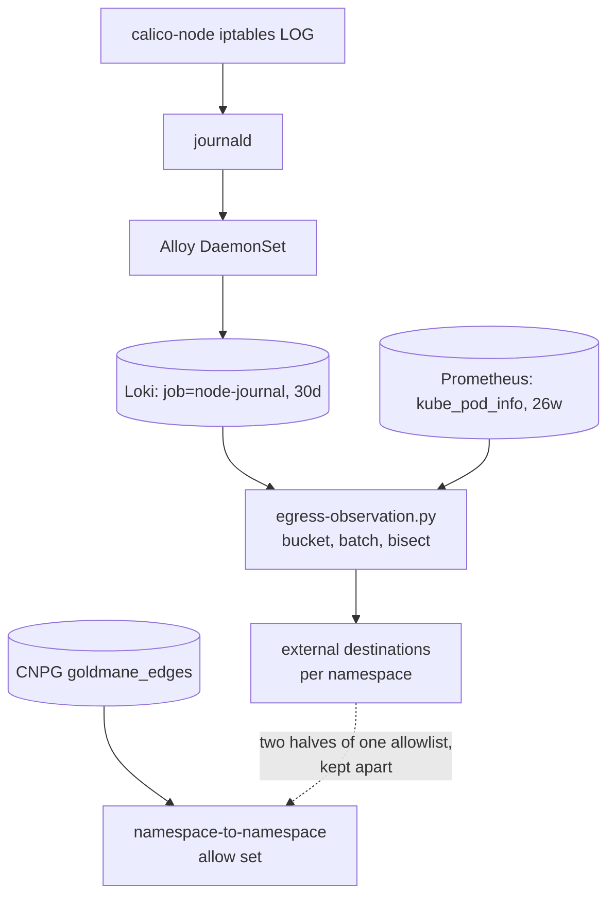

# Wave 1 W1.7 — egress observation snapshot (2026-09-04)

Replaces `wave1-egress-observation-2026-05-22.md`, which read roughly 10,000
sampled lines over a 6-24 hour window. This snapshot reads the whole of the
last 7 days.

**Scope note.** On 2026-09-04 Viktor declined the original W1.7 commitment of
default-deny egress on all 101 tier 3+4 namespaces. W1.7 is now: build the
analysis, then enforce on a named handful chosen from it, one namespace at a
time. Nothing in this document is applied. No NetworkPolicy is created by it.
The acceptance criteria on bead `code-f1te` were rewritten to match.

| | |
|---|---|
| Window | 7 days to 2026-09-04 20:04 UTC, in 672 x 15m buckets |
| Source | `{job="node-journal"} \|~ "calico-packet"` in Loki, **7,186,654** lines |
| Producer | GlobalNetworkPolicy `wave1-egress-observe-tier34`, live since 2026-05-19, rules `[Log, Allow]`, `namespaceSelector: tier in {3-edge, 4-aux}` |
| Reader | `scripts/egress-observation.py`, 2,481 Loki queries, 553s |
| Enforcement in place | none. `kubectl get globalnetworkpolicy` returns exactly the observe policy; the 10 namespaced NetworkPolicies are all pre-existing ingress rules |

## How to reproduce this

```sh
scripts/egress-observation.py --window 7d --bucket 15m --resolve \
    --ptr-cache /tmp/ptr.json --out-json egress.json --out-md egress.md
```

Two obstacles sat between the banked data and an answer, and the script exists
because of them.

**The log line carries a pod IP, not a namespace.** Nothing recorded the
pod-IP-to-namespace map at observation time; the May analysis kept it in
`/tmp/pod-ip-map.txt` on whichever host ran the query, and that file is gone.
`kube_pod_info` in Prometheus carries `pod_ip` and `namespace` on the same
series and is retained 26 weeks, so `count_over_time(kube_pod_info[W] offset O)`
rebuilds the map for any window inside that retention. Nothing needs to be saved
in advance.

**Loki refuses a query that fans out past 500 series.** Measured 2026-09-04: a
cluster-wide `sum by (src, dst, proto, dpt)` over a single hour returns HTTP 400,
and so does the same query wrapped in `count()` or `topk(400, ...)`, because the
cap applies to the inner series rather than the returned one. A bare 30-day scan
times out. The script pushes the source pod IPs into a line filter, which prunes
before the regexp parser runs and bounds the fan-out, then bisects the IP batch
whenever a query still overflows. That took 1,064 bisects across this run.



## What the apparatus sees, and what it does not

- **Attribution is conservative by design.** Calico hands a freed pod IP
  straight back out, and CronJob pods recycle one address many times an hour.
  Measured on the live cluster: 25 of 348 pod IPs were claimed by more than one
  namespace within 5 minutes, 54 of 384 within an hour, 130 of 468 within six.
  An IP that two namespaces claim inside the same bucket is skipped and
  reported rather than guessed at. Over this run 284 IPs were skipped that way.
  The `Unattributed` column below says how many each namespace lost; the
  namespaces losing the most (`tripit` 214, `claude-agent` 188, `phpipam` 182)
  are the high-churn ones, and they are also the ones least suited to a static
  allowlist, so the loss lands where it costs least.
- **45 pods exceeded 500 destinations inside a single 15-minute bucket** and are
  recorded as truncated. All of them are in `servarr`.
- **The observe policy sits at `order: 2000`.** A Calico or Kubernetes policy
  with a lower order that allows a flow terminates evaluation before the Log
  rule fires, so egress from a namespace carrying its own egress policy would be
  under-reported. Three of the ten live NetworkPolicies carry egress rules
  (`calico-system/whisker`, `calico-system/whisker-allow-dns-clusterip`,
  `dbaas/mysql-standalone`) and none of those namespaces is in tier 3+4. The
  three in-scope namespaces that do have a policy (`chrome-service`,
  `offline-reader`, `tasks`) are all `policyTypes: [Ingress]`. So this is a
  caveat to carry forward rather than a gap in today's data.
- **In-cluster destinations are counted but not enumerated here.** The
  namespace-to-namespace half already has a home in `goldmane_edges` (see
  below).

## The measured picture

Of the 101 namespaces the observe policy selects:

| | count |
|---|---:|
| had an attributable pod at some point in the week | 85 |
| never ran a pod at all in the week | 16 |
| reached at least one external address | 50 |
| ran all week and reached nothing external | 35 |

Cluster-wide the tier 3+4 namespaces reached **9,822 distinct external
addresses** in seven days. **Excluding `servarr` and `chrome-service` that
number is 406.** Two namespaces account for 96% of the external address space,
and the other 83 share the remaining 4%.

### Namespaces that never ran a pod

`city-guesser`, `dashy`, `drone-logbook`, `excalidraw`, `grampsweb`, `hackmd`,
`instagram-poster`, `netbox`, `networking-toolbox`, `recruiter-responder`,
`resume`, `send`, `status-page`, `t3-afk`, `terminal`, `vabbit81`.

Enforcing egress on these constrains nothing, because nothing is running. Four
of them (`hackmd`, `send`, `status-page`, and `recruiter-responder` itself) were
listed as rollout candidates in the May snapshot.

### Namespaces that reached something external

`Live` is buckets with an attributable pod, out of 672. The three destination
bands are disjoint and sum to `Ext`: **stable** appears in at least half the
live buckets, **recur** in more than one but fewer than half, **1-off** in
exactly one, which is what a rotating CDN address looks like.

| Namespace | Tier | Live | Pods | Ext | Stable | Recur | 1-off | Unattr |
|---|---|---:|---:|---:|---:|---:|---:|---:|
| plotting-book | 4-aux | 664 | 2 | 1 | 0 | 0 | 1 | 0 |
| webhook-handler | 4-aux | 503 | 6 | 1 | 0 | 1 | 0 | 3 |
| trek | 4-aux | 226 | 4 | 1 | 0 | 0 | 1 | 3 |
| changedetection | 4-aux | 549 | 8 | 2 | 0 | 2 | 0 | 6 |
| goldmane-edge-aggregator | 4-aux | 662 | 10 | 2 | 0 | 0 | 2 | 11 |
| job-hunter | 4-aux | 624 | 6 | 2 | 0 | 1 | 1 | 5 |
| **learn** | 4-aux | 599 | 7 | **2** | **2** | 0 | 0 | 7 |
| navidrome | 4-aux | 662 | 4 | 2 | 0 | 1 | 1 | 2 |
| pages-publish | 4-aux | 598 | 4 | 2 | 0 | 1 | 1 | 4 |
| dawarich | 3-edge | 561 | 8 | 3 | 0 | 2 | 1 | 10 |
| myprotein-watch | 4-aux | 279 | 13 | 3 | 0 | 0 | 3 | 34 |
| shadowsocks | 3-edge | 662 | 3 | 3 | 0 | 1 | 2 | 2 |
| url | 4-aux | 664 | 10 | 3 | 0 | 2 | 1 | 6 |
| beads-server | 4-aux | 664 | 8 | 4 | 0 | 2 | 2 | 6 |
| forgejo | 3-edge | 636 | 5 | 4 | 0 | 2 | 2 | 4 |
| phpipam | 4-aux | 660 | 141 | 4 | 0 | 4 | 0 | 182 |
| proxy | 4-aux | 664 | 7 | 4 | 0 | 2 | 2 | 4 |
| rybbit | 4-aux | 664 | 25 | 4 | 0 | 0 | 4 | 27 |
| wealthfolio | 4-aux | 660 | 12 | 4 | 0 | 3 | 1 | 12 |
| chesscom-streak | 4-aux | 471 | 20 | 5 | 0 | 1 | 4 | 28 |
| ci-pipeline-health | 4-aux | 199 | 6 | 5 | 0 | 2 | 3 | 9 |
| matrix | 4-aux | 664 | 1 | 5 | 0 | 0 | 5 | 0 |
| ytdlp | 4-aux | 664 | 3 | 5 | 0 | 1 | 4 | 1 |
| actualbudget | 3-edge | 664 | 21 | 6 | 0 | 5 | 1 | 18 |
| kms | 4-aux | 664 | 23 | 6 | 0 | 5 | 1 | 11 |
| novelapp | 4-aux | 664 | 1 | 6 | 0 | 2 | 4 | 0 |
| t3code | 4-aux | 603 | 5 | 6 | 0 | 4 | 2 | 5 |
| n8n | 4-aux | 664 | 1 | 7 | 0 | 4 | 3 | 0 |
| paperless-ai | 3-edge | 613 | 7 | 7 | 0 | 4 | 3 | 16 |
| tor-proxy | 4-aux | 664 | 4 | 8 | 0 | 6 | 2 | 1 |
| broker-sync | 4-aux | 359 | 16 | 9 | 0 | 4 | 5 | 27 |
| isponsorblocktv | 3-edge | 660 | 2 | 10 | 0 | 9 | 1 | 1 |
| lesson-harvester | 4-aux | 648 | 68 | 12 | 0 | 9 | 3 | 86 |
| tripit | 4-aux | 664 | 223 | 12 | 0 | 6 | 6 | 214 |
| valia-sites | 4-aux | 335 | 92 | 12 | 0 | 10 | 2 | 169 |
| f1-stream | 4-aux | 664 | 60 | 13 | 0 | 11 | 2 | 32 |
| realestate-crawler | 4-aux | 664 | 39 | 15 | 0 | 8 | 7 | 36 |
| mailserver | 3-edge | 664 | 83 | 17 | 0 | 13 | 4 | 144 |
| vaultwarden | 3-edge | 664 | 9 | 21 | 0 | 1 | 20 | 8 |
| speedtest | 4-aux | 640 | 6 | 23 | 0 | 23 | 0 | 4 |
| nextcloud | 3-edge | 631 | 89 | 31 | 0 | 22 | 9 | 114 |
| openclaw | 4-aux | 618 | 9 | 31 | 1 | 26 | 4 | 10 |
| trading-bot | 3-edge | 664 | 3 | 31 | 0 | 20 | 11 | 2 |
| claude-agent | 4-aux | 640 | 175 | 32 | 0 | 3 | 29 | 188 |
| ebooks | 3-edge | 664 | 16 | 36 | 0 | 26 | 10 | 15 |
| nextcloud-todos | 4-aux | 602 | 4 | 48 | 0 | 0 | 48 | 5 |
| diun | 4-aux | 664 | 1 | 54 | 0 | 39 | 15 | 0 |
| woodpecker | 3-edge | 664 | 47 | 55 | 0 | 38 | 17 | 115 |
| chrome-service | 4-aux | 664 | 62 | 608 | 0 | 256 | 352 | 59 |
| servarr | 4-aux | 664 | 132 | 8975 | 0 | 6208 | 2767 | 179 |

The 35 namespaces that ran all week and reached nothing external are in the JSON
artifact; `claude-memory`, `coturn`, `cyberchef`, `homepage`, `jsoncrack`,
`learning`, `ntfy`, `osm-routing`, `owntracks`, `paperless-ngx` and `website`
were up for 664 of 672 buckets with zero external destinations.

**Almost nothing here holds a continuous connection to a fixed external
address.** One namespace has a destination in the stable band across the whole
week (`learn`, to GitHub), plus `openclaw` with one. Everything else is
periodic. An allowlist built on "what was it talking to right now" would have
been wrong for nearly every namespace; the recurring band is where the real
dependencies live.

## Corrections to the 2026-05-22 snapshot

Each of these changes what a rollout would do, so they are worth stating
explicitly rather than leaving to a diff.

1. **`recruiter-responder` is not a viable pilot.** It has run no pods for
   roughly 16 days, and `stacks/recruiter-responder/main.tf:185` declares
   `replicas = 0`. Prometheus finds no pod series for it in 14 days and
   `max(kube_deployment_spec_replicas)` over 14 days is 0. A default-deny egress
   policy on an empty namespace passes trivially and demonstrates nothing.
2. **Calico OSS has no domain-based egress.** The May snapshot suggested
   `domains:` selectors via `dns_policy_resolver`. Read off the live CRD on
   Calico v3.30.7: `globalnetworkpolicies.crd.projectcalico.org` egress
   `destination` offers `nets`, `notNets`, `ports`, `notPorts`, `selector`,
   `notSelector`, `namespaceSelector`, `services`, `serviceAccounts` — and no
   `domains`. `GlobalNetworkSet` has exactly one field, `nets`. Every external
   allowlist here has to be CIDR-based, which makes the one-off band a genuine
   constraint rather than a tidiness question.
3. **The fan-out is larger than 130 destinations and smaller than it looks.**
   `servarr` reached 8,975 external addresses in the week, not 130. At the same
   time, removing `servarr` and `chrome-service` leaves 406 addresses across the
   other 83 live namespaces, which is a tractable number.
4. **Four of the May rollout candidates have no workload.** `hackmd`, `send`,
   `status-page` and `recruiter-responder` ran nothing during the window.

## Recommendation: four namespaces, in this order

The selection rule: a real workload that ran all week, a small external set the
`nets` field can express, few unattributed pod IPs so the profile is trustworthy,
and a failure mode that is loud and harmless if the policy is wrong.

### 1. `learn` — the pilot

| | |
|---|---|
| Uptime | 599 / 672 buckets, 7 pods |
| External | `140.82.121.3:22` and `140.82.121.4:22`, both `lb-*-fra.github.com`, 305 buckets each |
| Unattributed | 7 pod IPs |
| East-west | `goldmane_edges` shows one edge, to the `-` sentinel; no named in-cluster destination |

Two addresses, both GitHub SSH, present across half the week. GitHub publishes
its ranges at `https://api.github.com/meta`, so the `nets` list is documented and
maintainable rather than guessed. If the policy is wrong, a git fetch fails
visibly and nothing is lost. This is the pilot `recruiter-responder` was meant
to be.

### 2. `ntfy` — the zero-egress case

| | |
|---|---|
| Uptime | 664 / 672 buckets, 1 pod |
| External | none in seven days |
| Unattributed | 0 pod IPs, so the profile has no gaps |

A default-deny egress here allows kube-dns and nothing else, and locks in a
property the service already has. `learning` (3 pods, 664 buckets, 0 external,
0 unattributed) is an equally clean second instance of the same case.

### 3. `webhook-handler` — one recurring destination

| | |
|---|---|
| Uptime | 503 / 672 buckets, 6 pods |
| External | `157.240.234.15:443`, `edge-star-shv-02-sof1.facebook.com`, 2 buckets |
| Unattributed | 3 pod IPs |

One destination in a well-known published range. Low uptime relative to the
others is worth understanding before the flip.

### 4. `kms` — a bounded cloud dependency

| | |
|---|---|
| Uptime | 664 / 672 buckets, 23 pods |
| External | six addresses, all `ec2-*.eu-central-1.compute.amazonaws.com` on :443, five in the recurring band |
| Unattributed | 11 pod IPs |
| East-west | `redis`, 758,011 flows |

The addresses rotate within AWS eu-central-1, so the rule wants the published
regional range rather than the six observed IPs. This is the first candidate
where the CIDR-only constraint actually bites, which makes it a useful third
step.

### What not to enforce, and why

| Namespace | Reason |
|---|---|
| `servarr` | 8,975 external addresses, BitTorrent peer discovery. Static allowlisting cannot express this. Keep it in Log+Allow. |
| `chrome-service` | 608 addresses. It is a browser; reaching arbitrary sites is the product. |
| `proxy`, `tor-proxy`, `shadowsocks` | Their function is re-originating traffic to arbitrary destinations. |
| `changedetection` | Its allowlist is whatever URLs the user has configured to watch, so it changes without a deploy and breaks silently. Small numbers here are misleading. |
| The 16 namespaces with no pods | Nothing to constrain. |
| `tripit`, `claude-agent`, `phpipam`, `valia-sites`, `mailserver`, `nextcloud`, `woodpecker` | 114 to 214 unattributed pod IPs each. Re-run at `--bucket 5m` against one of these before trusting its profile. |

## What an allowlist has to contain

Two halves, from two different sources, and conflating them produces a policy
that is wrong in both directions.

| Half | Source | Query |
|---|---|---|
| Namespace to namespace | CNPG `goldmane_edges`, table `edge` | `SELECT DISTINCT dst_ns FROM edge WHERE src_ns = '<ns>' AND action = 'allow'` |
| External | this snapshot | `scripts/egress-observation.py --namespace <ns>` |

The edge table normalises a destination with no namespace to the sentinel
`dst_ns = '-'`: 141 such rows across 139 source namespaces. That records **that**
a namespace egressed off-cluster and never **where**, which is the boundary
between the two sources. The runbook describes these flows as dropped; they are
kept under the sentinel, and either way the external address is not in that
table.

Every policy also needs kube-dns (`10.96.0.10:53/UDP`) allowed explicitly. It is
in the service CIDR, so this snapshot classifies it as internal and does not
list it per namespace, and a default-deny egress that omits it breaks name
resolution for everything in the namespace.

## Open questions

- **Is 7 days enough?** Loki holds 30 days, and the script accepts
  `--window 30d`. A monthly CronJob, a certificate renewal or a quarterly
  external maintenance window would not appear in this snapshot. Before each
  flip, re-run for that namespace over the longest window Loki still holds.
- **The one-off band is unexplained.** 2,767 of `servarr`'s destinations and 352
  of `chrome-service`'s appeared in exactly one bucket. For the four
  recommended namespaces the band is 0 or 1, so it does not block the pilot, but
  the general shape of it is not yet understood.
- **The `order: 2000` interaction is untested.** No in-scope namespace carries
  an egress policy today, so nothing short-circuits the Log rule for tier 3+4.
  Adding the first enforcing policy changes that, and the observation data for
  that namespace stops being complete from the moment it lands.
- **`coturn` and `insta2spotify` show zero external traffic**, which does not
  match what those services do. Most likely they were idle all week. Worth a
  look before reading their zero as a property rather than an absence.

## Artifacts

- Script and tests: `scripts/egress-observation.py`,
  `scripts/egress_observation_test.py` (28 unit tests, `python3
  scripts/egress_observation_test.py`).
- Full per-namespace destination lists including every address and PTR record
  are reproduced by re-running the script; they are not committed, because the
  addresses change and the query is cheap.
- Tracked under bead `code-f1te`.
