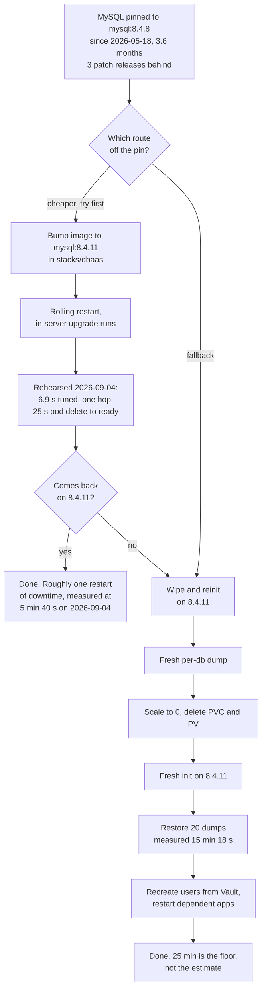

# MySQL 8.4.8 → 8.4.9 Upgrade — Design

**Date**: 2026-05-19
**Status**: Superseded in part on 2026-09-04. The flush-starvation hypothesis
below did not hold up when it was tested directly, so the wipe-and-reinit
approach is no longer the recommended path. See "2026-09-04 update" before
acting on anything in this document.
**Beads**: `code-963q` (this work), `code-eme8` / `code-k40p` (the 2026-05 outage and recovery)
**Related**: `docs/runbooks/restore-mysql.md`

## 2026-09-04 update — the stall did not reproduce

Viktor's ruling on `code-963q` was to try the InnoDB flush tuning this
document names as pre-flight before booking any wipe window, on the
grounds that it is one pod restart rather than a maintenance window, and
that it tests the hypothesis the wipe plan was built to route around.

Both halves were done. The tuning is live, and the upgrade was rehearsed
on a throwaway copy of the real dataset.

### What was measured on the live server before the change

| | |
|---|---|
| `Innodb_buffer_pool_wait_free` | 46,458 over 26.6 days of uptime, about 1,746 a day |
| steady-state flush rate | 30.6 pages/s over a 102 s window |
| observed burst | 23,461 dirty pages drained in under 20 s, about 1,173 pages/s |
| `Innodb_data_written` | 509 KB/s over the same window |
| dataset | 20 schemas, 692 tables, 7,830 MB, 11 GB on disk |

`Innodb_buffer_pool_wait_free` counts threads that wanted a free
buffer-pool page and had to wait for the page cleaner to produce one. A
cleaner keeping up leaves it at zero, so the page cleaner genuinely was
behind. That part of the hypothesis was right.

### What the rehearsal showed

A `mysql-smoketest` StatefulSet in `dbaas`, on a throwaway 20 GiB PVC of
the same `proxmox-lvm-encrypted` class, restored from the same per-db
dumps the real cutover would use. It reached 692 tables and 7,584 MB,
with `forgejo.repository` at 45 rows and `nextcloud.oc_filecache` at
2,043,986 rows, matching production exactly.

| run | config | upgrade | result |
|---|---|---|---|
| A | untuned, `io_capacity=100`, `page_cleaners=1` | 8.4.8 to 8.4.9 | completed in 33.7 s |
| B | untuned, unchanged | 8.4.9 to 8.4.11 | completed in 10.3 s |
| C | tuned, `io_capacity=2000`, `page_cleaners=2` | 8.4.8 to 8.4.11 in one hop | completed in 6.9 s |

Run A is the exact upgrade that stalled on 2026-05-18, on the same
storage class, at the same conservative flush settings, against a
dataset that matches production row for row. It finished in 34 seconds.

So the flush settings are not what stalled the upgrade. They were worth
raising on their own merits, and they were raised, but the wipe plan
rests on a cause this rehearsal did not find.

Run C is the closest rehearsal of what a production image bump would
actually do: a fresh 8.4.8 datadir carrying the real data, the flush
settings the server now runs, and a single hop to the current release.
Pod delete to accepting connections was 25 s end to end, of which the
server upgrade itself was 6.9 s. Afterwards `forgejo.repository`,
`nextcloud.oc_filecache` and `grafana.dashboard` held 45, 2,043,986 and
46 rows, matching production exactly.

### The tuning did make writes faster

The two restores were not a controlled experiment, since they ran at
different times on different nodes, but the same 20 dumps went in
consistently faster with the higher flush ceiling:

| database | untuned | tuned |
|---|---|---|
| all 20, total | 918 s | 760 s |
| nextcloud | 506 s | 487 s |
| wrongmove | 248 s | 174 s |
| paperless-ngx | 79 s | 51 s |
| uptimekuma | 27 s | 15 s |
| forgejo | 14 s | 9 s |

The upgrade itself moved the same way: 33.7 s untuned against 6.9 s
tuned, on comparable work. So the change is worth keeping on its own
merits even though it is not the fix for the stall.

### What we still do not know

The rehearsal differs from the 2026-05-18 incident in ways that could
matter, and any of them could be the real cause:

- **No client load.** The smoketest had no applications connected. The
  real server had 20 apps reconnecting and querying while the upgrade
  ran.
- **A clean starting datadir.** The smoketest datadir was created and
  shut down cleanly by 8.4.8. What state the real datadir was in when
  Keel swapped the image is not recorded.
- **Repeated restarts during the incident.** The liveness probe killed
  mysqld more than once before the probe delay was raised. An upgrade
  interrupted partway and restarted is a different situation from one
  run start to finish, and it fits "never completed" better than a
  single stall does.
- **Memory.** 8.4.11 fixes a bug where "upgrading from older 8.x
  releases with thousands of tables, views, routines, and events caused
  the memory consumed by server to grow continuously, leading to
  significant memory spikes" (Bug #117983). The pod's limit was 4 GiB in
  May and is 6 GiB now. This is a plausible alternative cause and it has
  not been tested.

### The two routes, priced

### Where this leaves the upgrade

Bumping the image and letting the in-server upgrade run now looks like
the cheaper option, and it is the one worth pricing first. It costs one
rolling restart. The wipe path costs that plus a PVC delete, a fresh
init, a 15-minute restore and a user recreation. The rehearsal supports
the bump but does not prove it, because of the differences listed above.

If the image bump is attempted, `8.4.11` is the target, not the `8.4.9`
in this document's title. 8.4.9 shipped 2026-05-12 and has been
superseded twice: 8.4.10 on 2026-07-24, which is an Oracle Critical
Patch Update release, and 8.4.11 on 2026-07-28. The exact CVE list is in
Oracle's June 2026 advisory, which returns 403 to automated clients, so
it has not been read here.

The wipe-and-reinit path in this document still works and is still the
fallback. Two of its numbers were wrong and have been corrected in the
plan document: the downtime estimate, which predates the dataset growing
to 7,830 MB, and the target version.

## Background

On 2026-05-18, Keel auto-bumped the `mysql:8.4` floating tag on the
`mysql-standalone` StatefulSet from 8.4.8 to 8.4.9. The in-server data
dictionary upgrade (80408 → 80409) stalled reliably: ~24 s of writes to
`mysql.ibd` + redo log after "Server upgrade started", then complete
silence — no CPU, no flushes, no errors, no completion. The `boot`
thread sat in user-space sleep (`State: S`, `wchan: 0`) for 10+
minutes; the MySQLX socket appeared but `mysqld.sock` never did. Even
with `liveness_probe.initial_delay_seconds = 600`, the upgrade never
completed.

Recovery (commit `ea475c3d`): pinned image to `mysql:8.4.8` exactly,
wiped the corrupted PVC, restored from the 00:30 UTC mysqldump. Total
downtime: ~25 min. Forgejo + 7 dependent apps offline during that
window.

## Root cause — best evidence

We never proved this definitively because we couldn't connect to MySQL
during the stall, but the strongest hypothesis is **flush starvation
during the DD upgrade's mandatory checkpoint**:

1. Upgrade rewrites `mysql.st_spatial_reference_systems` (5103 SRS
   defs) + dirties pages across the system tablespace.
2. Reaches a point where it must checkpoint before continuing.
3. The page-cleaner thread can't drain dirty pages fast enough because
   `innodb_io_capacity=100` (1.6 MB/s effective flush rate, default is
   200, recommended for SSDs is 2000+) combined with
   `innodb_page_cleaners=1`.
4. The `boot` thread waits on a pthread condvar that the flush
   coordinator should signal but never does within probe timeout.

Why we're not 100 % certain:
- LUKS2-encrypted block storage (`proxmox-lvm-encrypted`) may
  contribute its own flush latency.
- We didn't capture a stack trace from the stalled `boot` thread
  (`/proc/1/task/118/stack` was `permission denied`).
- A genuine MySQL 8.4.9 bug in the SRS-update path is possible (worth
  checking the MySQL bug tracker before retry).

**Organizational root cause** (definitive): the `mysql:8.4` floating
tag let Keel auto-bump without testing. Already fixed — image pinned
to `mysql:8.4.8` exactly.

## Decisions

| # | Decision | Notes |
|---|----------|-------|
| 1 | **Approach: wipe + re-init on 8.4.9** (logical migration via fresh init + dump-restore) | The DD upgrade is the broken path. A fresh 8.4.9 init starts at version 80409 directly — no upgrade ever runs. We've executed wipe+restore once in ~25 min; the path is now well-trodden. |
| 2 | **Pre-flight: bump InnoDB IO config** | `innodb_io_capacity=2000`, `innodb_io_capacity_max=4000`, `innodb_page_cleaners=4`. These are the long-term-correct values regardless of the upgrade — current settings are ~10× too conservative for the workload. |
| 3 | **Restore strategy: per-database dumps, NOT the full `--all-databases` dump** | Per-db dumps at `/srv/nfs/mysql-backup/per-db/<db>/` skip the `mysql` system schema entirely. Avoids the question of "will 8.4.8 mysql-schema rows confuse 8.4.9". User accounts get recreated via Vault + null_resource. |
| 4 | **Fresh dump immediately before cutover, not yesterday's** | The daily dump runs at 00:30 UTC. The cutover dump must come from < 60 s before scale-to-0 to minimize data loss. Kick `mysql-backup-per-db` CronJob manually. |
| 5 | **Maintenance window required** | All MySQL-dependent apps offline ~25 min: Forgejo (+ registry → ImagePullBackOff cascade), Nextcloud, HackMD, Grafana, Paperless, Uptime-Kuma, Shlink, realestate-crawler, phpipam, technitium, vikunja, freshrss, finance, resume. Pick a low-traffic window (suggest Sunday 03:00 UK). |
| 6 | **Single rollback path: re-pin to 8.4.8 + same wipe/restore flow** | If 8.4.9 fresh init misbehaves post-restore, rollback IS the same procedure, just with image=8.4.8. The pinned 8.4.8 dump survives. No new failure modes. |
| 7 | **Out of scope for this upgrade**: tuning that doesn't gate the upgrade | Right-sizing buffer pool, switching to async commits, changing storage class, replication — all separate decisions. |

## Verification gates

Before declaring done:
1. `kubectl -n dbaas exec mysql-standalone-0 -- mysql -uroot -p"$PW" -e "SELECT VERSION();"` returns `8.4.9`.
2. `SHOW DATABASES;` lists all 20 user databases.
3. Table count per schema matches the pre-upgrade snapshot (recorded
   in step 1 of the plan).
4. `forgejo` logs show successful DB ping; `kubectl -n forgejo get pod` is 1/1 Running.
5. `kubectl get deploy,sts -A` shows no unready workloads.
6. `bash infra/scripts/cluster_healthcheck.sh --quiet` returns same or
   better PASS/WARN/FAIL ratio as pre-upgrade.
7. Forgejo integrity probe reports 0 failures (manual trigger).
8. `RegistryCatalogInaccessible` not firing in Prometheus.

## Risks + mitigations

| Risk | Likelihood | Mitigation |
|---|---|---|
| 8.4.9 fresh init has *some other* unobserved bug | Low | Smoke-test on a parallel PVC in dbaas before touching the real one (optional but cheap — adds 30 min). See plan Phase 1. |
| Per-db dump-restore misses a database the user added recently | Low | Compare `SHOW DATABASES` against the per-db dump directory listing pre-cutover. If a DB exists in MySQL but not in `/srv/nfs/mysql-backup/per-db/`, dump it manually first. |
| Forgejo/roundcubemail static-user passwords drift again after restore | Certain | Already documented in runbook — DROP USER + CREATE USER from Vault values immediately after restore. |
| The cutover dump itself is corrupt | Very low | mysqldump exits non-zero on failure. CronJob already pushes `backup_last_success_timestamp` to Pushgateway. Verify timestamp is fresh before proceeding. |
| Apps fail to reconnect after MySQL restart | Low | Already-proven recipe: `kubectl rollout restart` on the affected deployments. Listed exhaustively in runbook §B.8. |
| 8.4.9 fresh init *also* stalls (root cause was NOT flush starvation) | Medium-low | Pre-flight test on parallel PVC catches this before maintenance window. If real prod init stalls, immediately revert TF pin to 8.4.8, redo same dump-restore flow. Same 25 min downtime as the original recovery. |

## Why not alternatives

- **In-place DD upgrade with bumped IO config**: simpler, but if it
  still stalls we lose 30–60 min waiting + still fall back to
  wipe+restore. Same data risk; worse expected time. We *would* learn
  whether the bumped IO settings fix the upgrade, but the fresh init
  approach makes that knowledge unnecessary.
- **Parallel migration (new mysql-standalone-new pod alongside)**:
  cleanest rollback (instant via service-selector flip), but needs TF
  surgery to declare two StatefulSets temporarily and isn't worth the
  complexity when the wipe+restore approach is now proven.
- **Wait for 8.4.10 / 8.5 LTS**: leaves us stuck on 8.4.8 indefinitely.
  Acceptable for now (we're pinned), but not a permanent answer.

## Out of scope

- A standby/replica MySQL for zero-downtime upgrades (separate
  initiative — see future planning around CNPG-style HA for MySQL).
- Removing `proxmox-lvm-encrypted` LUKS2 from the equation (the
  encryption is a security requirement; debugging its flush latency is
  separate).
- Replacing MySQL with PostgreSQL (long-term goal for some apps; not
  this upgrade).
