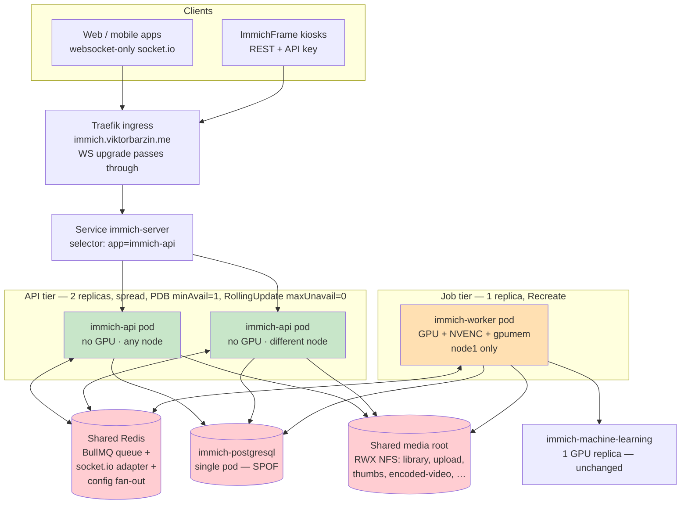
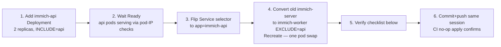

# Immich horizontal scaling — design (plan only)

**Status:** draft — approved decisions, NOT executed (Viktor: "create the plan only")
**Date:** 2026-07-12
**Owner:** Viktor (grilled + decided) / Claude (research + synthesis)
**Related:** `docs/research/immich-front-cache.md` (2026-07-12 — rejected a fronting
cache; this plan is the follow-through on real availability), incident 2026-07-12
01:07 (immich-server OOMKill), memory #9618.

---

## 1. Goal and non-goals

**Goal (decided):** availability + zero-downtime deploys for photo viewing and
downloading. Photo serving must survive: an API pod crash/OOM, a node1 outage,
and a deploy. Throughput is explicitly NOT the driver (one pod idles at current
peak ~11k req/h, ~5% CPU).

**Non-goals (decided, documented SPOFs):**

- **Postgres** — stays the single `immich-postgresql` pod (custom vectorchord
  image, encrypted RWO PVC). Its own HA is a separate future project.
- **Shared Redis** — stays the single `redis-master.redis.svc` (decided: keep
  shared, no dedicated instance; it already carries `immich_bull:*` keys).
- **NFS / Proxmox host** — hardware SPOF, out of scope.
- **Machine-learning tier** — stays 1 GPU replica; its loss degrades
  search/faces only, never viewing.
- **Autoscaling/HPA** — fixed replica counts; upstream's chart has no HPA knob
  either.

## 2. Decisions (grilled 2026-07-12)

| # | Decision | Choice |
|---|----------|--------|
| 1 | What scaling buys | **HA + zero-downtime deploys** (not throughput) |
| 2 | Failure domains in scope | **Stateless tier only**; PG/Redis/NFS stay documented SPOFs |
| 3 | API tier shape | **2 replicas**, spread across nodes, **PDB minAvailable=1**, RollingUpdate **maxUnavailable=0** |
| 4 | ML tier | **Unchanged** (1 GPU replica on node1) |
| 5 | Coordination Redis | **Keep the shared cluster Redis** (reuse-before-building; revisit on contention) |

Derived from upstream facts (not preferences): the deployment splits into an
**API tier** and a **Job tier**, and the Job tier stays at **exactly 1 replica**
(upstream constraint, §3.4).

## 3. Verified upstream facts (Immich v3.0.2 — docs + source, 2026-07-12)

Full citations in the research transcript; source file copies in the session
scratchpad. Load-bearing subset:

1. **Officially supported.** Scaling guide: "the backend is designed to be able
   to run multiple instances in parallel… same Postgres and Redis instances…
   same files mounted"; "scaling up can be as easy as incrementing the amount
   of replicas." (docs.immich.app/guides/scaling-immich). Thinly documented —
   LB/replica mechanics are DIY.
2. **Worker roles.** One image, role-selected via `IMMICH_WORKERS_INCLUDE` /
   `_EXCLUDE`: `api` (HTTP/REST, web, websocket gateway, job enqueue, nightly
   cron scheduling, HLS playlist serving) and `microservices` (all background
   jobs: thumbnails, transcode incl. real-time HLS ffmpeg, ML orchestration,
   library watch). (`enum.ts` ImmichWorker; `config.repository.ts` L185-192;
   docs.immich.app/administration/jobs-workers). A third `maintenance` mode is
   for DB-restore only — never a scaling unit.
3. **Websockets are multi-node native — no sticky sessions.** The server ships
   `@socket.io/redis-adapter` (`middleware/websocket.adapter.ts`) and both
   server and web client force `transports:['websocket']` — long-polling (the
   only thing that needs affinity) is off. Any API replica serves any client;
   broadcasts route via Redis pub/sub.
4. **Job tier must be 1 replica.** BullMQ queue concurrency is **per worker
   process** (open upstream issue #28051): N microservices replicas = N×
   effective concurrency on every queue, and facial-recognition clustering can
   race on shared face tables (#26373 class). No mechanism pins a queue to one
   worker. ⇒ `microservices` replicas=1 until upstream adds global concurrency.
5. **Startup is race-free.** Every worker runs migrations inside
   `pg_advisory_lock(DatabaseLock.Migrations)` — first replica migrates, others
   block then no-op. Nightly cron (`NightlyJobs` lock, api tier) and library
   watch/scan (`Library` lock, job tier) single-elect the same way. No
   initContainer / leader machinery needed.
6. **Uploads have zero pod-local state.** Multipart body streams directly to
   the shared media root (`upload/<userId>/…`); no resumable protocol, no
   temp-then-move outside shared FS; dedup is a DB checksum lookup. Any replica
   can take any upload.
7. **Shared storage set** (all already RWX NFS here): `library/`, `upload/`,
   `profile/`, `thumbs/`, `encoded-video/`, `backups/` under one media root,
   identical on every replica. Nothing is node-local.
8. **Identical image digest across all replicas** of both tiers is required
   (mismatched hashed web chunks were the one real multi-replica bug class,
   #25220 — fixed by deterministic builds in v3.0.2, but same-digest remains
   the rule).
9. **Config propagates at runtime across replicas** when changed via UI/API
   (socket.io `serverSideEmit` over Redis → every replica clears its config
   cache). **Direct DB edits of `system_metadata` do NOT propagate** — with N
   replicas the existing "pod recreate after DB config edit" rule becomes
   "recreate ALL immich pods" (both tiers).
10. **API tier needs no GPU.** All transcoding — job-based AND real-time HLS —
    executes on the job tier; the api worker only serves playlists/segments and
    coordinates over Redis. GPU/NVENC (+ `viktorbarzin.me/gpumem`) belongs to
    the job tier alone.
11. **ML endpoint is a failover list, not a load balancer** (`machineLearning.urls`
    system config; first-healthy-wins). Multiple ML pods would need one k8s
    Service VIP — irrelevant now (ML stays at 1), noted for the future.
12. **ImmichFrame kiosks are replica-agnostic** (pure REST + API key, no
    websocket/SSE — verified in immichframe source).

## 4. Terminology (this doc + future Immich work)

- **API tier** — Deployment `immich-api`: `IMMICH_WORKERS_INCLUDE=api`,
  N stateless GPU-free replicas, serves ALL client traffic incl. websockets.
- **Job tier** — Deployment `immich-worker`: `IMMICH_WORKERS_EXCLUDE=api`
  (= microservices role), exactly 1 replica, owns every background job and all
  ffmpeg/NVENC work, GPU-pinned to node1.
- **Single-election** — Immich's pg_advisory_lock pattern (migrations, nightly
  cron, library watch): N candidates, exactly one winner, no operator action.
- **Shared media root** — the one storage tree (§3.7) every pod of both tiers
  mounts identically.

## 5. Target architecture

Red = accepted SPOFs (non-goals). Green = the new HA surface. Orange = GPU
singleton by upstream constraint.

### Kubernetes/Terraform shape (sketch, `stacks/immich/main.tf`)

- **`immich-api` Deployment** (new): image = same `immich_version` var; env =
  current server env + `IMMICH_WORKERS_INCLUDE=api`; **no** `nvidia.com/gpu`,
  **no** gpumem, **no** node pin; resources ≈ request 2Gi / limit 4Gi (initial —
  re-measure after a week, the 6.9Gi peaks belong to jobs); replicas=2;
  `topologySpreadConstraints` on hostname (maxSkew 1, DoNotSchedule) or hard
  pod-anti-affinity; RollingUpdate maxSurge=1 maxUnavailable=0; PDB
  minAvailable=1; probes as today (`/api/server/ping`); mounts: full shared
  media root set.
- **`immich-worker` Deployment** (converted from today's `immich-server`):
  env + `IMMICH_WORKERS_EXCLUDE=api`; keeps GPU=1 + gpumem + node1 pin +
  request 7Gi / limit 10Gi; replicas=1; strategy **Recreate** (two live job
  workers must never coexist, §3.4 — a brief job pause during deploys is
  invisible to viewers, queue buffers in Redis); no Service/ingress exposure.
- **Service `immich-server`**: keeps its name (ingress + frames untouched),
  selector flips to the api pods' label.
- **Kyverno lifecycle marker** (`# KYVERNO_LIFECYCLE_V1` dns_config
  ignore_changes) on the new Deployment, per repo convention.
- **Keel/deploy pipeline**: whatever updates the image today must update BOTH
  deployments (same tag → same digest). Brief api↔worker version skew during
  the roll is upstream-tolerated (§3.8, migrations single-elect).
- **gpumem note:** the worker inherits the current `gpumem="3000"` value; the
  suspected server/ML gpumem comment-value swap (flagged 2026-07-12) and the
  ADR-0016 budget retune stay a separate open action — this plan does not
  change VRAM budgets.

### Quota check (namespace `immich`, hard: 24Gi req / 40Gi lim)

| Δ | requests | limits |
|---|----------|--------|
| Today (all pods) | 16.9Gi | 21Gi |
| + 2× api (2Gi/4Gi) | +4Gi | +8Gi |
| Worker (unchanged from server) | ±0 | ±0 |
| **Projected** | **~20.9/24Gi** | **~29/40Gi** |

Fits. Node-loss math also improves: ~4Gi of api requests move OFF node1.

## 6. Rollout sequence (for the future execution session)

Ordering exists to guarantee **never two job-workers** and **no serving gap**:

Step 4's pod swap is the only moment the job tier is briefly absent (~1 min):
uploads/viewing unaffected, queued jobs wait in Redis. At no point do two
microservices workers run.

**Verification checklist (execution session must tick every box):**

1. Two api pods on different nodes; worker on node1 (`kubectl get pods -o wide`).
2. Zero 5xx across the flip (Traefik router metrics, the monitoring pattern
   from 2026-07-12).
3. Websocket cross-replica: two browser sessions (forced to different pods via
   repeated connects), upload in one → live timeline update in the other.
4. Upload lands correctly (file appears under shared `upload/`, asset visible).
5. Video playback incl. seek (206s) and an HLS transcode session.
6. Background jobs drain: enqueue thumbnail regen for one asset, confirm the
   worker executes it (job tier logs).
7. Config propagation: change a harmless system setting via UI, confirm BOTH
   api pods observed `on_config_update` (logs) without restart.
8. Kill one api pod → no user-visible failure (repeat #2 during it).
9. `kubectl drain`-simulate node1 loss (or cordon+delete worker pod): viewing
   keeps working; jobs pause; worker reschedules when possible.
10. Deploy test: bump any env, watch RollingUpdate produce zero 5xx.

**Rollback:** revert the commit — TF restores the single combined Deployment;
Service selector returns with it. No data-shape changes anywhere in this plan
(env vars + k8s objects only), so rollback is always clean.

## 7. Monitoring additions (part of execution)

- PDB + existing replica-mismatch alert covers the api tier automatically.
- **New Loki alert:** api-pod log line `No microservices worker is connected`
  (Immich's own `checkWorkers()` warning) firing >5m = job tier dead — thumbnails
  /transcodes silently stop otherwise.
- Redis: note in the alert runbook that Immich realtime + queue now depend on
  shared-Redis health (existing Redis alerts inherit a bigger blast radius).
- Watch api-tier memory a week post-rollout; right-size request/limit from the
  observed per-role split (expect api ≪ worker).

## 8. Risks & mitigations

| Risk | Mitigation |
|------|------------|
| Api pods sized wrong initially (role split changes the memory profile) | Generous first limits (4Gi), 1-week observation, then right-size — with the 2026-07-12 lesson applied: use ≥30d peaks, never req=lim cuts |
| Shared Redis contention now stalls realtime + jobs | Accepted (decision #5); Redis metrics exist; revisit dedicated instance on evidence |
| Direct-DB config edits silently diverge across N pods | Rule update (§3.9): after DB config edits, recreate ALL immich pods; prefer UI/API edits which fan out automatically |
| Upstream later fixes #28051 (global queue concurrency) | Opportunity, not risk: job tier gains scale-out; revisit then |
| Keel updates two deployments non-atomically | Same-tag policy + upstream skew tolerance (§3.8); worst case is minutes of skew already exercised by every upstream rolling update |

## 9. Open questions (explicitly deferred)

1. `IMMICH_MACHINE_LEARNING_URL` env appears vestigial in v3 (`machineLearning.urls`
   system config is authoritative) — verify which one the live instance honors
   during execution; harmless either way at 1 ML replica.
2. Postgres HA (CNPG/vectorchord) — future project, unblocked by this design.
3. Job-tier scale-out — blocked upstream (#28051); re-check per Immich release.

## 10. Sources

- docs.immich.app: `/guides/scaling-immich`, `/administration/jobs-workers`,
  `/administration/backup-and-restore`.
- immich-app/immich @ v3.0.2: `server/src/enum.ts`, `config.repository.ts`,
  `job.repository.ts`, `database.{service,repository}.ts`, `queue.service.ts`,
  `library.service.ts`, `middleware/websocket.adapter.ts`,
  `websocket.repository.ts`, `middleware/file-upload.interceptor.ts`,
  `asset-media.service.ts`, `cores/storage.core.ts`, `transcoding.service.ts`,
  `hls.service.ts`, `notification.service.ts`, `system-config.service.ts`,
  `web/src/lib/stores/websocket.ts`.
- Upstream issues/discussions: #28051 (per-worker concurrency), #26373
  (face_search race), #25220/#27823 (web-asset skew, fixed), #4669 (Redis stays).
- socket.io docs: using-multiple-nodes (sticky sessions only for long-polling).
- Live cluster state 2026-07-12: PVC access modes (all media RWX), node1
  allocatable (100 GPU slices / 14k gpumem), ns quota (16.9/24Gi req, 21/40Gi
  lim), `stacks/immich/main.tf` (Recreate strategy, env, mounts, ingress).
