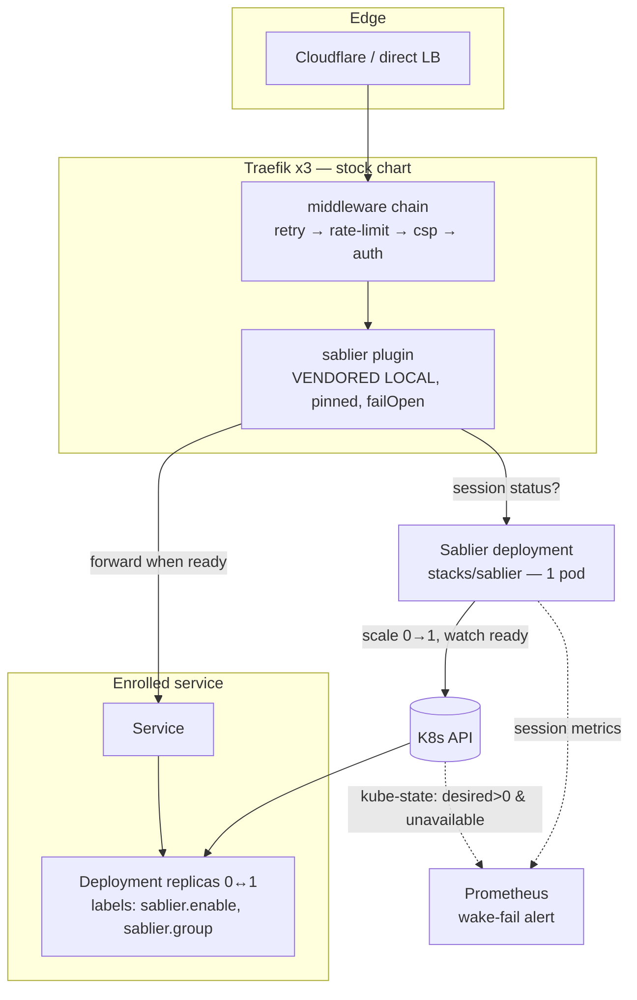
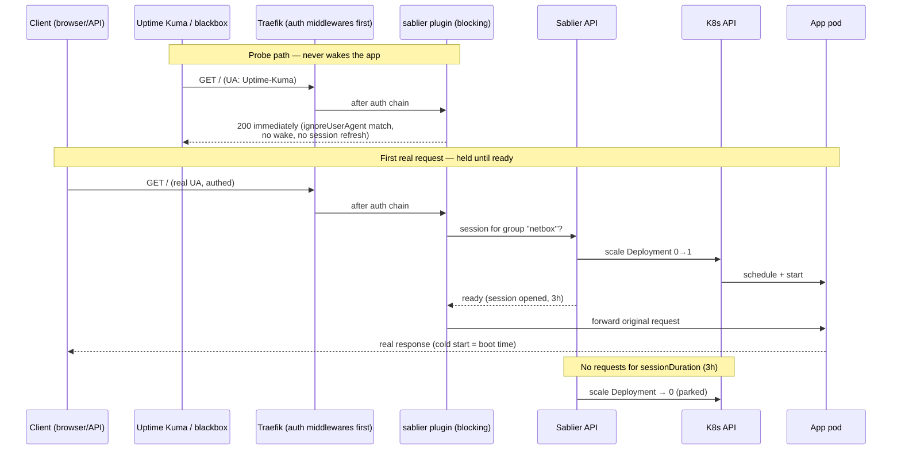

# Scale-to-zero for HTTP services — Sablier wake-on-request — design

- **Date:** 2026-07-12
- **Status:** executing (approved by Viktor 2026-07-12; waves 0–1 implemented same day — see the As-built corrections section for deltas found during implementation)
- **Owner:** Viktor (wizard)
- **Decision record:** `docs/adr/0022-scale-to-zero-sablier-vendored-plugin.md`
- **Builds on:** the hand-built wake-on-request precedent `stacks/android-emulator/gate.tf` (gate.py + idle-sleeper CronJob), Traefik per-service request metrics (`prometheus_chart_values.tpl` Traefik scrape job), ADR-0016 (T4 VRAM budget)

## Goal

Idle HTTP services release their RAM by scaling to 0 replicas, and **wake
automatically on the first request** — no more manual `kubectl scale` in either
direction. Success = the ~20 hand-parked services become self-reviving, plus a
second wave of measurably-idle running services stops burning memory 24/7.

Primary win: **memory** (nodes sit at 24–59% mem while CPU idles at 5–23%;
every post-mortem class on this cluster is resource exhaustion, not load).
Secondary win: convenience — parking is already the habit (see the ~20
`replicas=0` deployments); this removes the wake friction that habit costs.

## Decisions (locked 2026-07-12)

| # | Decision | Choice | Why |
|---|---|---|---|
| 1 | Primary goal | RAM reclaim **and** auto-wake | Memory-bound cluster; parking is already the operating habit |
| 2 | Scope v1 | HTTP services behind Traefik, **incl. GPU HTTP apps**. OUT: DBs/StatefulSets, queue/cron workers (servarr, paperless, n8n, changedetection), critical path, TCP services | Only request-driven workloads can be woken by a request; workers' value is background work that sleeping silently kills |
| 3 | Wake UX | **Hold the request** (Sablier *blocking* strategy) everywhere; no waiting page | One mental model, API-safe. Cloudflare-proxied hosts cap held requests at ~100s — slow boots may 524 once; the wake continues and a retry lands |
| 4 | Engine | **Sablier v1.15+, plugin vendored as a Traefik *local* plugin, pinned, `failOpen: true`** | Only option with a real probe-exclusion story; one small pod; groups; maintained (Jul 2026). Yaegi risk bounded — see Failure modes |
| 5 | Idle timeout | `sessionDuration: 3h` default, per-service override | Lazy by choice: candidates are weekly/monthly-use, 15m-vs-3h RAM delta is negligible, cold-start annoyance isn't. GPU tenants *should* override shorter (30m–1h) — T4 VRAM is scarcer than RAM |
| 6 | Monitoring semantics | Probes excluded via `ignoreUserAgent` → enrolled monitors go **shallow** (green = ingress + wake layer up). Add one wake-failure alert | Monitors must not keep services awake. Real failure mode ("woke but never became ready") caught by kube-state metrics |
| 7 | Pilot | **resume + netbox + whisper**, 1 week — **as-built: resume group + netbox** (whisper is TCP-only and cannot enroll; see As-built corrections) | Static sanity / heavy slow-boot Authentik-gated browser app. All already parked — enrolling changes nothing until first visit |

## As-built corrections (implementation, 2026-07-12)

Found while implementing; each is folded into the sections below but recorded
here so the deltas from the reviewed draft are explicit:

1. **whisper cannot enroll — pilot is resume(+printer) + netbox.** whisper and
   piper are exposed ONLY as raw TCP (`IngressRouteTCP`, Wyoming protocol,
   dedicated Traefik entrypoints 10300/10200) — HTTP middleware never sees
   their traffic. osm-routing is equally ineligible (no ingress at all;
   consumed cluster-internally by real-estate-crawler via Service DNS, which
   bypasses Traefik). Both stay hand-parked. The GPU/API pilot dimension moves
   wholly to wave 2. Consolation: resume's companion `printer` deployment
   makes the pilot exercise **groups** (resume+printer wake/park together).
   New first-line eligibility rule: *the service must receive its real
   traffic as HTTP through a Traefik ingress.*
2. **No Traefik provider change was needed** — `allowEmptyServices` already
   defaults to `true` for both kubernetes providers in the pinned chart
   40.2.0.
3. **Vendoring is chart-native**: chart 40.2.0 supports
   `experimental.localPlugins` with `type: inlinePlugin` — the chart builds
   the ConfigMap from in-repo source files
   (`stacks/traefik/modules/traefik/sablier-plugin/`, upstream tag v1.3.0,
   ~13KB, zero deps) and mounts it at `/plugins-local`. No initContainer, no
   image, no registry fetch. A broken plugin does NOT block Traefik startup
   (`abortOnPluginFailure` defaults false) — but it silently disables ALL
   plugins including the existing `api-token-middleware` (paperless-mcp's
   gate), so wave-0 verification checks plugin load + paperless-mcp.
4. **Sablier server is hand-rolled TF, not the upstream helm chart** — chart
   `sablier` 1.3.0 hardcodes `sablier-<release>` naming and imagePullPolicy
   and has no serviceAnnotations/volumes surface. `stacks/sablier/main.tf`
   deploys the pinned official image `sablierapp/sablier:1.15.0` with clean
   naming, Prometheus scrape annotations, and repo-standard lifecycle blocks.
   The reused OSS is the image + the vendored plugin.
5. **A Sablier restart parks sessionless enrolled workloads** (upstream
   `--provider.auto-stop-on-startup` defaults true; sessions are in-memory).
   The draft claimed a restart "just restarts the window" — wrong. Actual
   semantic: restart = clean slate; anything enrolled without a live session
   scales to 0 and re-wakes on its next request. Accepted (restarts are
   config-change-rare; enrolled services are rarely-used by definition).
6. **Wake-target semantics confirmed**: Sablier does NOT remember pre-sleep
   replica counts — it wakes to `sablier.active.replicas` (label/annotation,
   default 1). All enrolled services here are replicas-1 apps, so the default
   is correct; a future multi-replica enrollee must set that label.
7. **Day-one verification results (2026-07-12 12:01–12:40 UTC):**
   - Traefik rolled cleanly ×3 with `Plugins loaded.
     plugins=["api-token-middleware","sablier"]` on every replica, zero
     "Plugins are disabled" events; paperless-mcp still 403s without a token
     (shared plugin layer healthy).
   - **netbox: full lifecycle proven** — blocking wake 0→1 (~50s to ready,
     Sablier returned `status: ready`), 2m test session expired, re-parked
     to 0 at 12:25:20. No Terraform drift on `replicas`.
   - **Group wake proven** — one headless-browser visit to
     resume.viktorbarzin.me (through Cloudflare + the public outpost) scaled
     BOTH resume and printer 0→1 together.
   - **SablierWakeFailed fired for real on day one**: the resume group woke
     and crashed — printer (chromium) could never boot in its old 128Mi
     limit and resume OOMKilled at 64Mi (the pair had been hand-parked for
     exactly this since March). Limits fixed (printer 256Mi/1Gi, resume
     128Mi/256Mi; printer now boots) — but resume then surfaced the REAL
     bit-rot: `DATABASE_URL is not set` (v5 requires Postgres it was never
     given). **Resume needs service restoration (DB provisioning / data
     decision) — Viktor's call, out of scale-to-zero scope.** Until then a
     visitor gets the styled 503 error page after the blocking hold — same
     end-state as the parked past, now with an alert attached.
   - **Clean-slate lever verified**: restarting the sablier pod parked the
     sessionless resume group via `auto-stop-on-startup`, resolving the
     wake-fail alert.
   - Probe-exclusion (`ignoreUserAgent`) could not be exercised end-to-end
     by this pilot: both pilot ingresses sit behind Authentik walls that
     answer probes before the sablier middleware is reached (monitors were
     shallow for them already). First `auth = "app"`/`"none"` enrollee in
     wave 2/3 verifies it.

## Options considered (July 2026 survey)

Full survey in the session research; summary:

| Option | Verdict |
|---|---|
| **Sablier v1.15.0** (chosen) | Purpose-built, active, 1 pod, blocking+dynamic strategies, `ignoreUserAgent` probe exclusion, groups, idle-memory scaling, calendar hours. Risk: Yaegi Traefik plugin (see mitigations) |
| **Elasti v0.1.25** | Elegant (proxy in path only at zero, PromQL triggers) but pre-1.0, and **no probe exclusion** — every monitored service wake-flaps unless monitors are reworked |
| **KEDA + http-add-on v0.15** | Still beta, breaking releases; permanent fail-closed interceptor tier (~8 pods); **no probe exclusion** |
| **Knative Serving** | Requires rewriting every Deployment as a Knative Service + own networking layer; Traefik support experimental. Overkill |
| **Snorlax** | Dormant since 2025-01; rewrites Ingress objects → Terraform drift every sleep/wake cycle |
| **kube-green** | Calendar-only (no wake-on-request); Sablier's `running-hours` labels cover the same ground. Skip |
| **Generalize gate.py** | Custom controller we maintain forever; "reuse before building" says adopt OSS first. gate.tf stays as the proof the pattern works here |

## Architecture



Wake and probe paths:



Key properties:

- **The sablier middleware sits AFTER the auth middleware** — unauthenticated
  scanners/bots bounce at Authentik/Anubis without ever waking an app. The
  `ingress_factory` chain already appends extras after `local.auth_middleware`,
  so the ordering falls out of the existing module.
- **Warm path cost:** one in-process plugin check per request (no extra network
  hop; Sablier API is only consulted per session semantics). No second proxy
  tier, unlike KEDA's interceptor.
- **Sessions live in Sablier's memory** — and on restart Sablier parks every
  enrolled workload that has no live session (`auto-stop-on-startup`,
  upstream default kept deliberately). Restart = clean slate: mid-session
  users get re-woken by their next request (blocking hold ≈ boot time). No
  persistence for v1; `--storage.file` exists upstream if this ever hurts.

## Implementation

### New stack: `stacks/sablier/`

- `helm_release` from the official `sablierapp` chart (Terraform-native), 1
  replica, tier-appropriate resources (small Go binary; ~64–128Mi).
- Kubernetes provider enabled; RBAC scoped to get/list/watch/update/patch on
  `deployments` (+ statefulsets off for v1) — mirror the least-privilege shape
  of the android-emulator gate Role.
- Prometheus scrape annotations (v1.15 exports session/expiry metrics).

### Traefik changes (`stacks/traefik/`)

1. **Vendor the plugin as a LOCAL plugin** — `sablier-traefik-plugin` pinned
   (v1.3.x), source mounted into the Traefik pods at
   `/plugins-local/src/github.com/sablierapp/sablier-traefik-plugin` via a
   ConfigMap (plugin is a handful of Go files; if it outgrows the 1MiB
   ConfigMap limit, fall back to a GHA-baked Traefik image per the infra-owned
   images pattern). Local plugins never touch `plugins.traefik.io` — immune to
   the traefik#13005 startup-revalidation failure class.
2. **`allowEmptyServices: true`** on the `kubernetesIngress` (and CRD)
   provider so routers to 0-endpoint Services stay registered instead of
   dropping out.
3. No other Traefik config changes; stock chart stays.

### Enrollment surface (per service)

One first-class knob on `ingress_factory` + labels on the Deployment:

```hcl
# ingress_factory — new optional object variable
sablier = {
  group            = "netbox"     # defaults to var.name
  session_duration = "3h"         # default; override per service
}
```

- The module emits the namespace-scoped `Middleware` CR
  (`${namespace}-sablier-${name}@kubernetescrd`, blocking strategy,
  `failOpen: true`, shared `ignoreUserAgent` regex list) and appends it to the
  router chain after auth — same pattern as the existing `custom-csp` /
  `buffering` per-ingress middlewares.
- The Deployment gets `sablier.enable: "true"` + `sablier.group: <group>`
  labels, and `replicas` joins the `lifecycle.ignore_changes` list with a
  greppable marker comment `# SABLIER_MANAGED_REPLICAS` (same convention as
  `# KYVERNO_LIFECYCLE_V1`) so `terragrunt apply` and the daily drift job
  never fight the scaler.
- Multi-deployment apps share one `sablier.group` (e.g. `postiz` =
  postiz + temporal + elasticsearch — one visit wakes the chain, one expiry
  parks all three).

### Enrollment checklist (every service, every wave)

0. **Real traffic arrives as HTTP through a Traefik ingress.** TCP-only
   services (whisper/piper Wyoming `IngressRouteTCP`) and ingress-less
   cluster-internal services (osm-routing, consumed via Service DNS) can
   never be woken by the middleware — ineligible, stay hand-parked.
1. Request-driven only — no background jobs/queues/watchers that sleeping
   would silently kill (excludes calibre-web-automated's folder ingest, n8n
   crons, servarr).
2. **No WebSocket dependence** — open WS frames don't refresh Sablier sessions
   (upstream sablier-traefik-plugin #26); WS-heavy apps stay out until fixed.
3. Uptime Kuma monitor is **status-only** — a keyword monitor would sit
   permanently red against the probe-path 200. Switch or drop it.
4. Boot time ≤ ~100s if the hostname is Cloudflare-proxied (524 on first hit
   otherwise — tolerable but note it), no limit for `internal`/non-proxied.
5. GPU tenants: declare `viktorbarzin.me/gpumem` and confirm T4 budget
   headroom first (see below), and set a shorter `session_duration`.

### Monitoring

- **Shared `ignoreUserAgent` list** (one place, the middleware template):
  `Uptime-?Kuma.*`, `Blackbox.*`, `Go-http-client.*` (blackbox default).
  Probes get an immediate 200 and never wake or refresh anything.
- **Enrolled monitors are shallow by design**: green = edge + Traefik +
  Sablier alive. Accepted trade-off (decision #6).
- **New alert `SablierWakeFailed`** (monitoring stack): an enrolled deployment
  (`sablier.enable=true` via kube-state labels) with desired replicas > 0 and
  unavailable replicas > 0 for 5m — "someone knocked, it tried to wake, it
  couldn't". This is the deep health signal, fired exactly when it matters.
- Sablier session metrics land in Prometheus for a Grafana panel (sessions
  active / expiries / wakes per service) — nice-to-have, wave 2.

### GPU interplay (ADR-0016)

Verified 2026-07-12: **whisper declares no `viktorbarzin.me/gpumem` and no
`nvidia.com/gpu`** — only a nodeSelector + toleration. It therefore schedules
onto node1 outside the VRAM budget accounting (the 2026-07-07 collision
class). The pilot enrolls whisper **as-is**: waking it recreates exactly
today's manual-wake risk profile, no worse. **chatterbox-tts is already
scale-0↔1 managed by the GPU demand-gate** (`stacks/tts` VRAM-admission
CronJobs) — it must NOT also enroll in Sablier (two controllers fighting over
`replicas`); at wave 2 decide migrate-or-keep per workload, never both. Wave 2
GPU enrollment (ebook2audiobook, and chatterbox-tts only if migrated off the
demand-gate) is **gated on the ADR-0016 budget retune**
(declared budgets already sum to 13300/14000 MiB; there is no headroom to
declare honest budgets for wake-on-demand tenants until llama-swap/immich-ml
are retuned). 3h sessions on GPU tenants hold VRAM long after use — override
to 30m–1h at enrollment.

## Failure modes

| Failure | Behavior | Mitigation |
|---|---|---|
| Sablier pod down | `failOpen: true` → running apps unaffected (plugin passes through); **sleeping apps 503** until Sablier returns | Accepted: strictly better than today (parked apps are already "503" until a human scales them). Alert on Sablier deployment down |
| Yaegi plugin regression on a Traefik upgrade (the crowdsec-plugin history) | Plugin fails to load → Traefik logs errors; local plugin load failure can block router config referencing it | Vendored + **pinned** — a Traefik chart bump never changes the plugin; re-validate the plugin explicitly on every Traefik upgrade (add to the upgrade runbook). Open upstream issue #44 (intermittent bypass on k8s+v3) — watch; failOpen means bypass degrades to "no scale-to-zero", not an outage |
| plugins.traefik.io outage at Traefik startup (traefik#13005) | N/A — local plugins skip the registry entirely | The reason for vendoring |
| Session lost mid-use (WS blindspot, >3h form think-time) | App parks; next request wakes it. Data loss possible on un-submitted forms | 3h lazy default chosen for this; WS apps excluded by checklist |
| Cold start > client timeout (CF ~100s) | First request 524s; wake already triggered; retry lands | Documented per-service in checklist item 4 |
| Sablier scales down a service mid-deploy | Sablier only manages enrolled groups; deploys bump generation and Sablier wake targets the recorded replica count | Keep enrolled services at recorded `replicas=1`; verify during pilot |

## Rollout

- **Wave 0 — platform (no behavior change):** `stacks/sablier/` + Traefik
  local-plugin vendoring + `allowEmptyServices` + the `ingress_factory`
  `sablier` variable + `SablierWakeFailed` alert. Zero services enrolled;
  verify Traefik rolls cleanly across all 3 replicas with the plugin loaded.
- **Wave 1 — pilot (1 week, as-built):** enroll the **resume group**
  (resume + printer — also proves group wake/park) and **netbox** (heavy,
  slow boot, Authentik-gated, form-heavy). whisper dropped — TCP-only, can't
  enroll (As-built correction #1); the GPU/API dimension moves to wave 2.
  All pilot services already parked → enrolling is a no-op until first
  visit. Success criteria: probes stay green without wakes (Sablier metrics
  show zero probe-triggered sessions); first request wakes within boot-time;
  sessions expire → replicas back to 0; no plugin errors across a
  `rollout restart` of Traefik (and paperless-mcp's api-token-middleware
  still gates — shared plugin blast radius); no drift-detection noise on
  `replicas`.
- **Wave 2 — the parked set + groups:** remaining hand-parked services
  passing the checklist (postiz **group** incl. its always-running
  elasticsearch, grampsweb, dashy, osm-routing trio, openlobster, t3-afk…),
  GPU tenants **after the ADR-0016 budget retune**. The android-emulator gate
  stays as-is (its idle signal is `dumpsys power` via exec, not HTTP —
  Sablier can't replicate it); consolidation is a someday-maybe.
- **Wave 3 — data-driven extension:** lowest-traffic *running* services from
  `traefik_service_requests_total` (7d rates, 2026-07-12 snapshot): trek and
  health (0 req/7d), wealthfolio, drone-logbook, beadboard, freedify×2,
  learn, excalidraw, privatebin, cyberchef, jsoncrack, speedtest,
  stirling-pdf, city-guesser, networking-toolbox — each through the
  checklist individually. Expected reclaim: order of 5–10Gi across waves 2–3.

### Waves 2+3 as-built (2026-07-12, same day)

Every candidate went through the checklist via a full-repo vetting sweep
(ingress mechanics, in-cluster consumers, namespace CronJobs, WS use).

**Enrolled (16 groups across 16 stacks):** dashy, grampsweb, **postiz group**
(postiz + temporal + elasticsearch — postiz is Helm-managed, labels via a
`kubernetes_labels` field-manager patch since the chart has no
deployment-labels value; ~90–180s chained cold boot, expect one CF 524 +
retry), trek, health (both its ingresses share the group), drone-logbook
(backup CronJob pod-affinity relaxed required→preferred — it exists for the
RWO data volume, and a parked app means the volume is free for the backup pod
anywhere; previously the 01:30 backup would have sat Pending forever against
a parked app), privatebin, cyberchef, jsoncrack (their anubis-* gates stay
running), stirling-pdf, city-guesser, networking-toolbox, excalidraw, learn
(group spans learn.* AND plans.* — cold wake re-clones the monorepo via
git-sync from emptyDir, nothing persisted), tandoor, novelapp.

**Vetted-ineligible, with the blocker on record:** wealthfolio (in-ns daily
sync CronJob via cluster DNS — can't wake what it calls — plus a monthly
pod-affinity job and an hourly pg-sync sidecar feeding Grafana), beadboard
(beads-dispatcher polls `/api/agent-status` every 2 min via cluster DNS),
speedtest (the in-app hourly Laravel scheduler IS the product), freedify ×2
(the hand-rolled auth-free `/api/stream/` ingress carries no sablier
middleware — streaming/AirPlay could neither wake nor keep-alive), navidrome
(background Subsonic mobile clients + homepage widget via cluster DNS +
freedify's scan target), hackmd + send (WebSocket-core). Docs correction
landed alongside: privatebin was never Anubis-fronted (the CLAUDE.md Anubis
roster wrongly listed pb; its XHR POST breaks under the challenge).

**Notes:** privatebin is the first `auth = "none"` enrollee — it validates
the `ignoreUserAgent` probe-exclusion end-to-end (Kuma probes now reach the
sablier middleware directly). novelapp is shared with an external user
(Gheorghe) — his first visit after idle costs a cold start. Public
`auth=none` enrollees wake on any bot that clears the CF/CrowdSec/anti-AI
edge — correct behavior, just less idle time than Authentik-walled apps.

## Out of scope (v1)

TCP services (torrserver, coturn, mail), queue/cron workers, StatefulSets/DBs,
the waiting-page (dynamic) strategy, kube-green/calendar scheduling, Sablier's
idle-memory scaling (interesting for a later iteration), migrating the
android-emulator gate.
