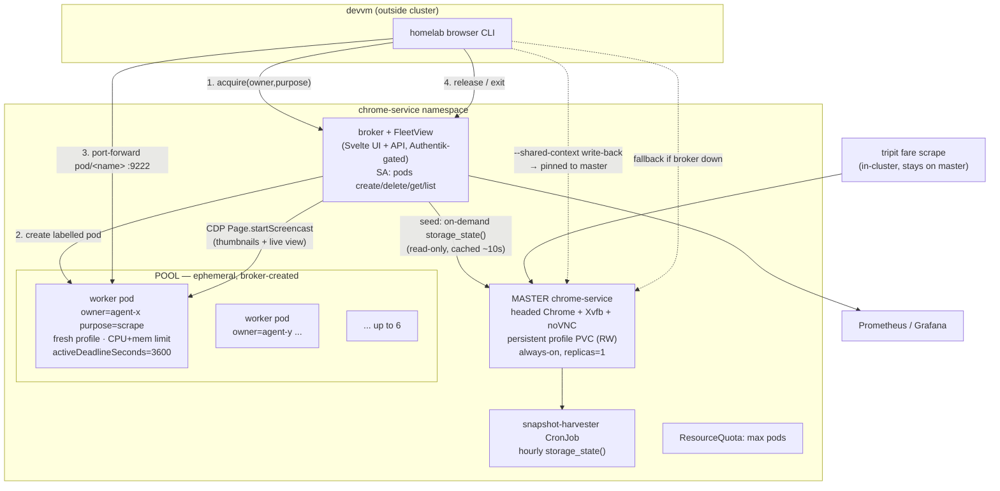
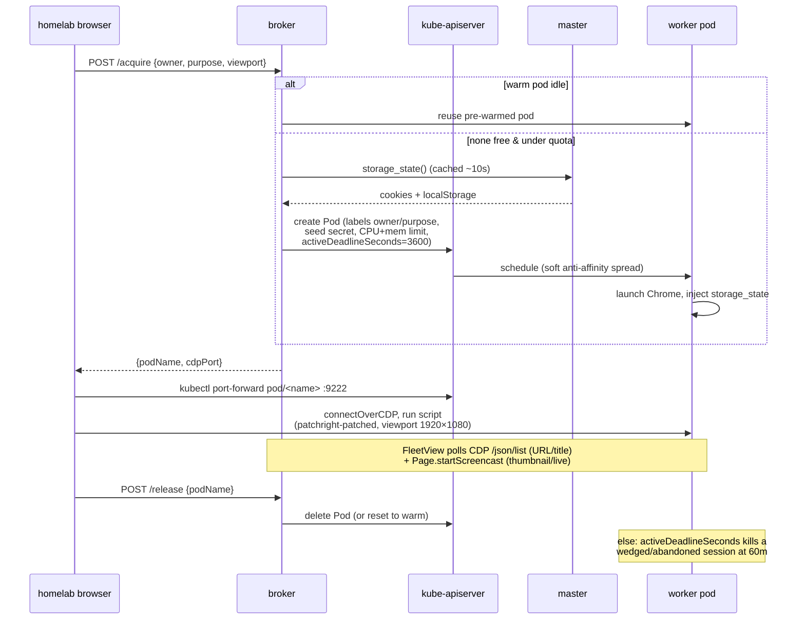

# chrome-service pool — scaling the shared agent browser

**Status:** Design (approved, pre-execution) · **Date:** 2026-07-13 · **Owner:** Viktor
· **Stack:** `stacks/chrome-service` · **Related:** `docs/architecture/chrome-service.md`,
ADR-0013 (`homelab browser`), memory #8072 (swiftshader wedge), #9627 (Maps saved-lists),
#9626 (scale-to-zero UX prefs)

## Problem

There is exactly **one** in-cluster headful Chrome (`chrome-service`): real Google
Chrome under `Xvfb :99` at 1280×720, CDP on `:9222`, a persistent warm profile PVC
(where Viktor logs in via noVNC), an hourly `storage_state()` snapshot, and a vendored
stealth init-script. It serves the **anti-bot escalation tier** — agents reach it via
`homelab browser` when devvm-local headless Playwright MCP is blocked — plus a couple of
in-cluster scrapers (tripit fare scrape).

Three pains:

1. **Contention.** All callers share one browser. A long batch run (e.g. the 77-sight
   Google Maps automation) monopolises CPU/RAM and the noVNC view; a second agent that
   needs the browser waits or interferes.
2. **Blast radius.** One crashed/wedged context can take the whole browser down. The
   canonical incident (memory #8072) was a headless-Chromium *swiftshader GPU process*
   that pegged **~10.5 cores for 6.5 h** on `about:blank`; `page.close()` never cleared
   it — it needed an OS-level `pkill`. (That instance was the **devvm-local MCP**, not
   this cluster pod, but the failure mode is exactly what a shared browser invites.)
3. **No visibility.** There is no way to see how many sessions are live, who owns them,
   or what each is doing right now.

## Goals

- Remove the contention bottleneck: run **multiple concurrent agent sessions** with
  autoscale and scale-to-idle.
- **Observe** every active session (owner, purpose, current URL, age, resource use) and
  watch any one live.
- Structurally bound the wedge blast radius (the 6.5 h incident could not recur unbounded).
- Fold in **2025–26 agentic-browser best practices** (viewport sizing for high-res-tier
  vision models; close the CDP `Runtime.enable` stealth leak).
- **Zero new monetary cost** — self-hosted, existing cluster capacity only.

## Non-goals / scope

- **Escalation tier only.** Devvm-local Playwright MCP stays the *default* for routine
  browsing; this scales the shared headful/stealth tier that agents escalate to.
- **Not** moving all agent browsing onto the cluster pool (that path is left open — any
  CDP client can connect to a pool pod later — but is not this work).
- **Not** adopting an external OSS platform (steel-browser / Selenium Grid / browserless
  were evaluated and rejected — see *Rejected alternatives*).

## Core model — one master, ephemeral derived sessions

> **Viktor's framing:** *"one master profile, and scaled sessions derive from that but
> don't write back."*

Two workloads, cleanly split by role:

| | **Master** (unchanged singleton) | **Pool** (new, ephemeral) |
|---|---|---|
| Role | Identity / login browser | Throughput / anti-bot sessions |
| Replicas | Always-on, 1 | 1 warm → burst 6, broker-created |
| Profile | Persistent encrypted PVC (RW) | Fresh, seeded read-only from master |
| Serves | Interactive noVNC login, `--shared-context` **write-back** work (Maps saved-lists), tripit fare scrape, the hourly `storage_state()` harvest | Default `homelab browser` (incognito), snapshot-seeded logged-in reads, batch scrapes |
| Lifecycle | Long-lived | One session per pod, self-reaps |

Each pool session **derives** the master's logged-in state read-only (cookies +
localStorage via `storage_state()`) and **never writes back** — the master profile stays
the single source of truth.

## Acquire / release sequence

## Decisions

| # | Decision | Rationale |
|---|---|---|
| D1 | **Scope = escalation tier only** | Smallest blast radius; fixes the named contention. Local MCP stays default. |
| D2 | **Extend own stack** (broker + pool), not adopt steel/Grid/browserless | No upstream option is both free-uncapped *and* a good fit for our CDP-native, warm-profile, stealth model. |
| D3 | **Master stays an always-on singleton** | Interactive logins + `storage_state()` source + tripit + `--shared-context` write-back must live on one stable, warm, RW profile. |
| D4 | **Seed = `storage_state()` injected on-demand, read-only** | Reuses the exact API we already harvest; clean, lightweight, no write-back, no lock contention with the running master. cookies+localStorage only (see R3). |
| D5 | **Broker creates one ephemeral labelled pod per session** (revised — see A1) | K8s-native identity/reaping; no replica-patch identity race. |
| D6 | **Warm 1, burst to 6** | One hot pod (no first-agent cold-start, matches #9626); 6 concurrent covers realistic load; fits node5/node1 headroom. |
| D7 | **Idle-reap 20 m; hard cap 60 m via `activeDeadlineSeconds`, heartbeat-extendable** | Lazy timers (#9626) but a firm backstop: the 6.5 h wedge becomes ≤ 60 m. |
| D8 | **FleetView UI + thumbnails + live view via CDP screencast** (revised — see A4) | Full "what is each session doing" without per-pod VNC baggage. |
| D9 | **Viewport 1920×1080 DPR 1** default (+ tall 1280×2000 profile) | Fable 5 is a high-res vision tier (2576 px cap); 1080p is the benchmarked lift over 720p without the downscale trap. Set on the **context**, not just Xvfb (see R4). |
| D10 | **Add patchright / rebrowser-patches on the CDP connection** | Closes the `Runtime.enable` leak — the current stealth gap for the escalation tier. |
| D11 | **CPU limit on pool worker pods** — deliberate exception to the "no CPU limits" cluster norm | Single-session, ephemeral pods where a CPU runaway is always a bug; the textbook blast-radius case. Escape hatch: rely on the 60 m cap + a CPU alert instead. |

## What the adversarial pass changed

Two independent challenger agents (blind to each other) attacked the first draft and
verified claims against the live cluster. Their **convergent, confirmed** findings
reshaped the design:

| ID | Finding (CONFIRMED by both unless noted) | Resolution |
|---|---|---|
| **A1** | The "android-emulator `gate.py`" precedent doesn't transfer — it only toggles `0↔1` on a *single* replica. A multi-replica Deployment can't do per-pod assignment, and K8s picks the scale-down victim → it could kill the pod holding your live port-forward. | **Broker creates/deletes bare labelled pods** (own SA with `pods` create/delete). Each session *is* a pod → no assignment race, no wrong-victim reaping. `activeDeadlineSeconds` is the K8s-native hard cap. |
| **A2** | The CPU wedge is only half-addressed: a memory limit does nothing for a CPU spin, and this cluster removed all CPU limits → a wedge still pegs a node's cores for up to the 60 m cap. | **CPU limit on worker pods** (D11, flagged deviation) + single-session-per-pod + `activeDeadlineSeconds` → a wedge is one killable cgroup, bounded. Plus a CPU watchdog/alert. |
| **A3** | The current *chrome container* OOMKilled at its **2624Mi** limit at **720p** (verified: `lastState.terminated OOMKilled exit 137`, 2026-07-12). 1080p is 2.25× the pixels → same limit OOMs worse; the noVNC `Error` exit was the documented supervision-cascade after Chrome died. | Worker **mem limit ~4Gi / request ~2Gi**. Burst-6 ≈ 12Gi requests → fits node5 (~19.6Gi free) + node1, **soft anti-affinity** to avoid piling six on one node. |
| **A4** | Per-pod noVNC ×6 replicates three documented gotchas (fd-sweep `ulimit`, x11vnc supervision, window-fill) + ~1.5Gi sidecar RAM at burst + a new NP rule — yet interactive login is master-only by design. | **Drop per-pod noVNC.** FleetView live view + thumbnails both use CDP `Page.startScreencast` proxied by the broker. Master keeps its real noVNC for interactive login. |
| **A5** | `browser_runner.js` calls `newContext()` with **no viewport** → Playwright pins 1280×720 regardless of the Xvfb screen. Bumping Xvfb alone changes nothing the model sees. | Set `viewport:{1920,1080}, deviceScaleFactor:1` on the **context** in the runner; bump Xvfb + `--window-size` in lockstep. Honest caveat R4. |
| **A6** | `--shared-context` write-back (Maps saved-lists, #9627) can't be served by a read-only, IndexedDB-dropping, no-write-back seed. | **Pin `--shared-context`/write-back to the master.** Pool serves incognito/stateless + snapshot-seeded reads only. |
| **A7** | (SUSPECTED) on-demand `storage_state()` racing the hourly harvester / the master's own use. | **Not a race:** the harvester's `browser.close()` is on a `connectOverCDP` client — it only disconnects, never kills the remote browser (same semantics as `browser_runner.js:95`). Broker **caches** the export ~10 s so an acquire-burst shares one export. |
| **A8** | Bonus (challenger B's single best change): the master's liveness is `tcp_socket:9222`, which a wedged `about:blank` keeps open — *why the wedge ran undetected*. | Replace with a real **CDP `/json/version` health check + CPU watchdog** — applied to the master too, independent of the pool. |
| — | (refuted) RBAC blocker | **Non-issue:** `chrome-service-portforward` Role grants `pods/portforward` `create` namespace-wide (`rbac.tf:47-55`) — already covers any pool pod; port-forward bypasses the NetworkPolicy. |

## Best practices folded in (from the research sweep)

- **Vision token model:** Fable 5 / Sonnet 5 / Opus 4.7-4.8 are the **high-resolution
  tier** — patch-based cost `⌈w/28⌉ × ⌈h/28⌉`, cap **2576 px / 3.75 MP** (vs 1568 px
  standard). 1920×1080 sits inside it; **never exceed 2576 px** or screenshots are
  silently downscaled and click coordinates desync.
- **Always DPR 1**; pre-downscale any screenshot to the tier cap before sending (the
  single highest-impact accuracy fix for vision callers).
- **Tall viewport (1280×2000)** for accessibility-snapshot flows — pulls more
  lazy-loaded / virtualized DOM per snapshot at **zero image-token cost**.
- **patchright / rebrowser-patches** on the CDP connection (D10). Real-Chrome-headed-
  under-Xvfb already wins the pre-JS TLS/HTTP2 fingerprint layer that a headless binary
  loses — the `Runtime.enable` leak is the remaining gap.
- Extend the **stealth-drift test** to cover the pool image + patchright (today it only
  guards CLI ↔ canonical `stealth.js`).

### R4 — honest caveat on "bigger screen"

Your instinct ("models have too small a screen") is **right for vision / computer-use
agents** — 1080p is a real lift for a high-res-tier model. For the *script-driven*
`homelab browser` tier (selectors via `page.click/fill`, not screenshots), the win is
**modest**: viewport mainly affects responsive layout, which elements start in-viewport
(fewer scroll-then-click), and screenshot legibility when a script does capture. It is a
cheap, correct change — just not a dramatic action-count reduction for pure selector
scripts.

## RAM budget & scheduling

- Worker: request ~2Gi / limit ~4Gi (A3). Warm-1 steady ≈ 2Gi; burst-6 ≈ 12Gi requests.
- Live *request* headroom is concentrated: node5 ~19.6Gi free, node1 ~16Gi (node2/node3
  are ~99% on requests). Soft anti-affinity spreads workers across node5/node1/node4.
- Namespace **ResourceQuota** caps total pods as a hard ceiling behind the broker.
- Zero new spend — existing cluster capacity, all images already self-hosted on ghcr.

## Rejected alternatives

- **steel-browser** (Apache-2.0, CDP-native, `/ui`): closest OSS fit, but no Helm/operator/
  autoscaler upstream (we'd build the same k8s glue), beta, no Prometheus, and re-homing the
  warm-profile + stealth into its session model is net more work than extending our own.
- **Selenium Grid 4 + KEDA:** best turnkey free autoscaler, but WebDriver-first —
  Playwright-over-CDP through Grid is officially *experimental and may break*, a poor fit
  for our CDP-native callers and warm-profile model.
- **browserless v2:** technically capable but SSPL copyleft + no native Prometheus.
- **Aerokube Moon** (4-pod free cap, proprietary), **Kasm CE** (5-session cap), **neko**
  (human-viewer, not a pool engine), **lightpanda** (not full-Chrome fidelity).
- **Minimal alternative — no broker** (challenger B): just add a watchdog + real liveness
  + RAM bump to the single pod, or a dumb 2–3 replica StatefulSet. *Noted and partially
  adopted* (the master watchdog/liveness fix, A8, ships regardless). Rejected as the whole
  answer because it delivers neither the observability surface nor autoscaled concurrency
  Viktor asked for — but it is the correct fallback if the broker proves not worth its weight.

## Phased implementation plan

1. **Master hardening (ships first, independent of the pool).** Real CDP liveness
   (`/json/version`) + CPU watchdog; Xvfb + `--window-size` → 1920×1080. Fixes the
   undetected-wedge class today.
2. **Worker image + pod template.** Reuse the real-Chrome image; add patchright, the
   seed-injection entrypoint (read `storage_state` from a mounted secret), CPU+mem limits,
   `activeDeadlineSeconds`, soft anti-affinity, `keel.sh/policy=never`, **no** reloader.
3. **Broker service** (Svelte + API): SA with `pods` create/delete/get/list; acquire/
   release with owner+purpose labels; on-demand cached `storage_state()` seed; idle reap;
   ResourceQuota-bounded; Prometheus `browser_active_sessions{owner,purpose,pod}` + queue/
   age gauges. Stateless — reconciles from pod labels (no Redis).
4. **FleetView UI:** session table (owner, purpose, CDP `/json/list` URL/title, age,
   CPU/RAM) + `Page.startScreencast` thumbnails + click-to-live + extend/kill.
   Authentik-gated.
5. **CLI integration:** `homelab browser` acquires from the broker → `port-forward
   pod/<name>` → release; `--shared-context` pinned to master; broker-down fallback to
   master; set context viewport + `--viewport` override + tall profile. Extend the
   stealth-drift test to the pool.
6. **Docs + monitoring:** update `docs/architecture/chrome-service.md`; alerts for
   session-idle-TTL breach, CPU wedge, broker down, seed-export failure.

## Decisions confirmed (2026-07-13)

- **Viewport stays 1920×1080** (D9) — Viktor's call: more elements visible, easier
  navigation, weighed above the modest script-tier caveat (R4).
- **CPU-limit exception accepted** (D11) — the deliberate deviation from the "no CPU
  limits" cluster norm ships as designed (single-session ephemeral pods, blast-radius case).

## Open items / risks
- **Seed fidelity** — cookies+localStorage covers the vast majority; a site needing
  IndexedDB/sessionStorage/DBSC-bound auth must use the master (`--shared-context`). Not a
  regression (that work was never poolable read-only), but a documented limit.
- **Screencast cost** — `Page.startScreencast` frame rate is throttled for FleetView
  (thumbnails low-fps; live view on-demand only) to avoid loading the sessions being
  watched.
- **Burst-6 node pressure** — if concurrent-heavy-6 pressures node5/node1, lower the
  ResourceQuota ceiling; the design degrades gracefully (callers queue or fall back).
