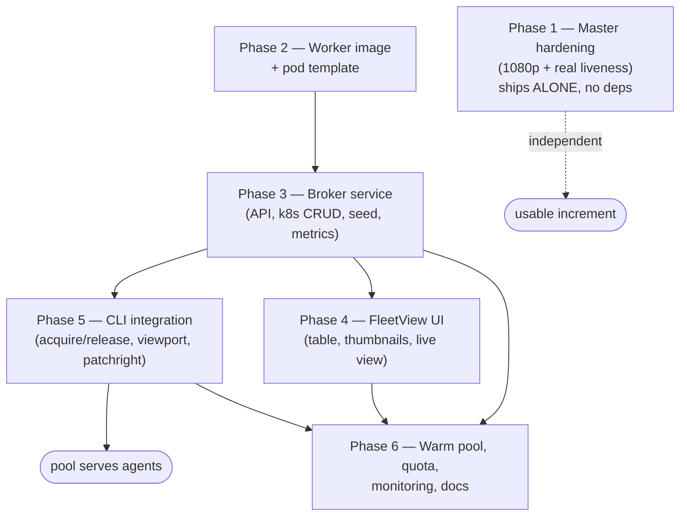

# chrome-service pool — Implementation Plan

> **For agentic workers:** REQUIRED SUB-SKILL: use `superpowers:subagent-driven-development`
> (recommended) or `superpowers:executing-plans` to implement this plan task-by-task. Steps
> use checkbox (`- [ ]`) syntax for tracking.

**Goal:** Scale the shared headful-Chrome escalation tier from one contended pod to a
broker-managed pool of ephemeral, isolated, autoscaled browser sessions with full
observability — without disturbing the master identity browser.

**Architecture:** Keep today's `chrome-service` pod as an always-on **master** (login,
persistent profile, snapshot harvest, tripit, `--shared-context`). Add a stateless
**broker** (Python, own SA) that creates one labelled ephemeral **worker pod** per session,
seeds it read-only from the master's on-demand `storage_state()`, hands the caller a pod to
port-forward, and reaps it via `activeDeadlineSeconds` + idle TTL. A **FleetView** Svelte
UI (served by the broker) shows every live session with CDP-screencast thumbnails + live
view. `homelab browser` acquires from the broker; `--shared-context` stays on the master.

**Tech stack:** Terraform/Terragrunt · Kubernetes (bare Pods + a Deployment for warm-pool) ·
Python 3.12 stdlib + `playwright` (CDP only) + `prometheus_client` · Svelte (FleetView) ·
Go (`homelab` CLI) · GHA→ghcr image build · real Google Chrome under Xvfb.

**Source design:** `docs/plans/2026-07-13-chrome-service-pool-design.md`
(published: `plans.viktorbarzin.me/2026-07-13-chrome-service-pool-design.html`).

**Phase dependency & sequencing:**



Critical path: **P2 → P3 → P5**. P1 is independently shippable value. P4 (UI) and P6
(warm-pool/quota/monitoring/docs) land after the API works.

**Conventions that bind every task** (from `infra/.claude/CLAUDE.md`):
- Terraform-only; commit + push every applied change the same session; apply from the main
  checkout, never a worktree (git-crypt tfvars).
- Every `kubernetes_deployment` / `kubernetes_cron_job_v1` / bare-Pod template carries the
  `# KYVERNO_LIFECYCLE_V1` `dns_config` ignore.
- New image → GHA workflow in `infra/.github/workflows/`, push `ghcr.io/viktorbarzin/<name>`
  `:latest` + `:<sha8>`, keep-10. Woodpecker deploy-only.
- proxmox-lvm-encrypted PVC template rules (autoresizer annotations, `ignore_changes`).
- `ingress_factory` `auth` enum; FleetView is an admin UI → `auth = "required"`.

---

## File structure

```
stacks/chrome-service/
  main.tf                    # MODIFY: master Xvfb→1080p, real liveness; pool Deployment; broker; NP; RBAC; quota
  rbac.tf                    # MODIFY: add broker SA (pods create/delete/get/list) + portforward for wizard/agents
  broker.tf                  # CREATE: broker Deployment + Service + ingress + Prometheus scrape
  pool.tf                    # CREATE: warm-pool Deployment + worker-pod PodTemplate configmap + ResourceQuota
  monitoring.tf              # CREATE: PrometheusRule (idle/wedge/broker-down/seed-fail) + Uptime Kuma
  files/
    broker/
      broker.py              # CREATE: session lifecycle, k8s pod CRUD, seed cache, /json/list, metrics, WS screencast
      worker_pod.json        # CREATE: the bare-Pod spec template the broker instantiates per session
      test_broker.py         # CREATE: pytest unit tests (pure logic: pod-spec build, seed cache, reaper math)
    fleetview/               # CREATE: Svelte app (session table + thumbnails + live view)
      package.json, svelte.config.js, vite.config.js, src/…
    chrome/Dockerfile        # (unchanged — reused for workers)
  Dockerfile.broker          # CREATE: multi-stage node(build Svelte)→python runtime
.github/workflows/
  build-chrome-service-broker.yml   # CREATE: GHA build → ghcr public
cli/
  browser.go                 # MODIFY: broker acquire/release, pod-targeted port-forward, viewport env
  cmd_browser.go             # MODIFY: --viewport flag, ls subcommand
  browser_runner.js          # MODIFY: newContext viewport from env
  cmd_browser_test.go        # MODIFY: tests for broker parse + pod port-forward args + viewport
docs/architecture/chrome-service.md   # MODIFY: document the pool
```

---

## Phase 1 — Master hardening (independent, ships first)

Small, safe, independently valuable: fixes the undetected-wedge liveness gap (challenger A8)
and delivers Viktor's 1920×1080 screen on the master. No pool dependency.

### Task 1.1: Master Xvfb + window → 1920×1080

**Files:** Modify `stacks/chrome-service/main.tf` (the chrome-service container `args`
heredoc, ~L228 and ~L262).

- [ ] **Step 1: Edit the Xvfb screen line.** In the `args` heredoc change:
  `Xvfb :99 -screen 0 1280x720x24 -listen tcp -ac &` → `Xvfb :99 -screen 0 1920x1080x24 -listen tcp -ac &`
- [ ] **Step 2: Edit the Chrome window flags** (keep in lockstep — the black-cutoff invariant):
  `--window-position=0,0 \` then `--window-size=1280,720 \` → `--window-size=1920,1080 \`
- [ ] **Step 3: Bump the dshm size_limit** (bigger framebuffer + tabs): in `volume "dshm"`,
  `size_limit = "256Mi"` → `size_limit = "512Mi"`.
- [ ] **Step 4: Raise master chrome container memory** (it OOMs at 2624Mi@720p, verified
  2026-07-12; 1080p is worse). In the chrome-service container `resources`:
  `requests = { cpu = "200m", memory = "1500Mi" }` → `memory = "2Gi"`;
  `limits = { memory = "2624Mi" }` → `memory = "4Gi"`.
- [ ] **Step 5: Commit** (no apply yet — batch with 1.2):

```bash
git add stacks/chrome-service/main.tf
git commit -m "chrome-service: master Xvfb+window 1080p, raise mem to 4Gi (720p OOM)"
```

### Task 1.2: Real CDP liveness on the master (kill the undetected-wedge)

The `tcp_socket:9222` probe passes even when Chrome is wedged (challenger B/A8). Replace with
an HTTP GET on the CDP JSON version endpoint via the existing `cdp_bridge.py` (already on
`:9222`), which only answers when the DevTools HTTP server is live.

**Files:** Modify `stacks/chrome-service/main.tf` (chrome-service container probes ~L285-300).

- [ ] **Step 1: Replace liveness_probe** with an exec probe that checks CDP responds
  (image has no curl; use the bundled node or python). Use python3 (present in the
  playwright image):

```hcl
liveness_probe {
  exec {
    command = ["python3", "-c",
      "import urllib.request,sys; sys.exit(0 if urllib.request.urlopen('http://127.0.0.1:9222/json/version',timeout=5).status==200 else 1)"]
  }
  initial_delay_seconds = 30
  period_seconds        = 30
  failure_threshold     = 3
}
```

- [ ] **Step 2: Keep readiness/startup as tcp_socket** (readiness only gates Service
  membership; the liveness exec is the wedge-killer). Leave them unchanged.
- [ ] **Step 3: Apply from the main checkout** (Recreate strategy → ~30s master blip):

```bash
vault login -method=oidc >/dev/null
scripts/tg apply chrome-service
```

- [ ] **Step 4: Verify live** — the pod restarts once, comes Ready, noVNC canvas is now
  1920×1080, and the liveness exec passes:

```bash
kubectl -n chrome-service get pod -l app=chrome-service -o wide
kubectl -n chrome-service exec deploy/chrome-service -c chrome-service -- \
  python3 -c "import urllib.request;print(urllib.request.urlopen('http://127.0.0.1:9222/json/version').read()[:80])"
```
Expected: prints a `{"Browser":"Chrome/…"}` prefix (NOT Headless).

- [ ] **Step 5: Commit the apply** (already committed HCL in 1.1; push):

```bash
git push origin HEAD:master   # (fallback: wizard/<topic> branch + Forgejo-API PR if protected)
```

---

## Phase 2 — Worker image + pod template

The worker reuses the existing real-Chrome image (`ghcr.io/viktorbarzin/chrome-service-browser`)
with a new entrypoint that (a) seeds `storage_state` into the profile before launch is not
possible (storage_state is a Playwright client-side inject, not a profile file) → instead the
worker launches a bare Chrome and the **caller's** Playwright `newContext({storageState})`
does the seeding. So the worker image == master browser minus noVNC/snapshot, plus patchright.

### Task 2.1: Worker entrypoint script (Chrome + Xvfb + patchright, no noVNC)

**Files:** Create `stacks/chrome-service/files/worker_entrypoint.sh`.

- [ ] **Step 1: Write the entrypoint** (mirrors the master `args` heredoc, 1080p, adds the
  patchright-patched Chrome flags to close the `Runtime.enable` leak; no snapshot/noVNC):

```bash
#!/usr/bin/env bash
set -e
CHROMIUM=/opt/google/chrome/chrome
[ -x "$CHROMIUM" ] || { echo "ERROR: chrome missing at $CHROMIUM" >&2; exit 1; }
Xvfb :99 -screen 0 1920x1080x24 -listen tcp -ac &
sleep 1
mkdir -p /profile/chromium-data
python3 /scripts/cdp_bridge.py &          # same 0.0.0.0:9222 -> 127.0.0.1:9223 bridge as master
BRIDGE_PID=$!
trap "kill $BRIDGE_PID 2>/dev/null" EXIT
# --remote-allow-origins + isolated profile; no persistent login (seeded per-session by caller)
exec "$CHROMIUM" \
  --remote-debugging-port=9223 --remote-allow-origins=* \
  --user-data-dir=/profile/chromium-data \
  --no-sandbox --no-first-run --no-default-browser-check \
  --disable-blink-features=AutomationControlled \
  --disable-features=IsolateOrigins,site-per-process \
  --autoplay-policy=no-user-gesture-required \
  --disable-dev-shm-usage --password-store=basic --use-mock-keychain \
  --window-position=0,0 --window-size=1920,1080 about:blank
```

  > Note: the `Runtime.enable` leak is closed on the **client** (patchright / rebrowser-patches
  > in `browser_runner.js`, Task 5.3), not the browser binary — the browser flags above are the
  > same stealth-friendly set the master uses. This step just gives workers a clean 1080p Chrome.

- [ ] **Step 2: Add it to the scripts ConfigMap.** In `main.tf`
  `kubernetes_config_map_v1.snapshot_scripts.data`, add:
  `"worker_entrypoint.sh" = file("${path.module}/files/worker_entrypoint.sh")`
- [ ] **Step 3: Commit:**

```bash
git add stacks/chrome-service/files/worker_entrypoint.sh stacks/chrome-service/main.tf
git commit -m "chrome-service: worker Chrome entrypoint (1080p, no noVNC/snapshot)"
```

### Task 2.2: Worker bare-Pod spec template (the broker instantiates this)

**Files:** Create `stacks/chrome-service/files/broker/worker_pod.json` (a template with
`__PLACEHOLDERS__` the broker fills). CPU limit is the deliberate wedge backstop (design D11).

- [ ] **Step 1: Write the pod template** (labels for owner/purpose/session, CPU+mem limits,
  `activeDeadlineSeconds` hard cap, soft anti-affinity, dns_config left to Kyverno, the scripts
  CM + a per-session `emptyDir` profile so nothing persists):

```json
{
  "apiVersion": "v1", "kind": "Pod",
  "metadata": {
    "name": "__NAME__", "namespace": "chrome-service",
    "labels": {"app": "chrome-worker", "chrome-pool/owner": "__OWNER__",
               "chrome-pool/session": "__SESSION__"},
    "annotations": {"chrome-pool/purpose": "__PURPOSE__", "chrome-pool/started": "__STARTED__"}
  },
  "spec": {
    "activeDeadlineSeconds": __DEADLINE__,
    "restartPolicy": "Never",
    "imagePullSecrets": [{"name": "registry-credentials"}],
    "securityContext": {"runAsUser": 1000, "runAsGroup": 1000, "fsGroup": 1000,
                        "seccompProfile": {"type": "RuntimeDefault"}},
    "affinity": {"podAntiAffinity": {"preferredDuringSchedulingIgnoredDuringExecution": [{
      "weight": 100, "podAffinityTerm": {"topologyKey": "kubernetes.io/hostname",
        "labelSelector": {"matchLabels": {"app": "chrome-worker"}}}}]}},
    "containers": [{
      "name": "chrome", "image": "ghcr.io/viktorbarzin/chrome-service-browser:latest",
      "imagePullPolicy": "IfNotPresent",
      "command": ["bash", "/scripts/worker_entrypoint.sh"],
      "env": [{"name": "DISPLAY", "value": ":99"}, {"name": "HOME", "value": "/profile"}],
      "ports": [{"name": "cdp", "containerPort": 9222}],
      "readinessProbe": {"tcpSocket": {"port": 9222}, "initialDelaySeconds": 3, "periodSeconds": 3},
      "resources": {"requests": {"cpu": "250m", "memory": "2Gi"},
                    "limits": {"cpu": "4", "memory": "4Gi"}},
      "volumeMounts": [{"name": "profile", "mountPath": "/profile"},
                       {"name": "dshm", "mountPath": "/dev/shm"},
                       {"name": "scripts", "mountPath": "/scripts", "readOnly": true}]
    }],
    "volumes": [
      {"name": "profile", "emptyDir": {}},
      {"name": "dshm", "emptyDir": {"medium": "Memory", "sizeLimit": "512Mi"}},
      {"name": "scripts", "configMap": {"name": "snapshot-scripts", "defaultMode": 365}}
    ]
  }
}
```
  (`defaultMode: 365` = octal 0555.)

- [ ] **Step 2: Add to the scripts ConfigMap is NOT needed** (this template is read by the
  broker from its own image, not mounted into workers). Instead it is embedded in the broker
  image (Task 3). Just commit the file:

```bash
git add stacks/chrome-service/files/broker/worker_pod.json
git commit -m "chrome-service: worker bare-Pod template (CPU limit, activeDeadline, anti-affinity)"
```

---

## Phase 3 — Broker service (the core)

Stateless Python service. Reconstructs state from pod labels each request (no Redis). Talks to
the apiserver via the in-pod SA token + CA (the `gate.py` pattern). Uses `playwright` over CDP
only for the seed export + screencast (no local browser download).

### Task 3.1: Broker RBAC (its own SA can create/delete pods)

**Files:** Modify `stacks/chrome-service/rbac.tf`.

- [ ] **Step 1: Add the broker SA + Role + binding** (pods CRUD + the master's endpoints for
  the seed connect; NOT deployments — the pool warm-min Deployment is separate and TF-managed):

```hcl
resource "kubernetes_service_account" "broker" {
  metadata { name = "chrome-broker"; namespace = "chrome-service" }
}
resource "kubernetes_role" "broker" {
  metadata { name = "chrome-broker"; namespace = "chrome-service" }
  rule { api_groups = [""]; resources = ["pods"];        verbs = ["get","list","watch","create","delete"] }
  rule { api_groups = [""]; resources = ["pods/log"];    verbs = ["get"] }
}
resource "kubernetes_role_binding" "broker" {
  metadata { name = "chrome-broker"; namespace = "chrome-service" }
  role_ref { api_group = "rbac.authorization.k8s.io"; kind = "Role"; name = kubernetes_role.broker.metadata[0].name }
  subject  { kind = "ServiceAccount"; name = kubernetes_service_account.broker.metadata[0].name; namespace = "chrome-service" }
}
```

- [ ] **Step 2: Confirm the wizard agent already has `pods/portforward`** (challenger A: the
  `chrome-service-portforward` Role grants it namespace-wide). Add a binding for the wizard
  browser SA if one is missing (mirror `emo_browser_portforward`). If `wizard-browser` SA does
  not exist yet, add it like `emo_browser` (SA + token Secret + portforward binding + the
  `oidc-power-user-readonly` cluster binding).
- [ ] **Step 3: Commit:**

```bash
git add stacks/chrome-service/rbac.tf
git commit -m "chrome-service: broker SA (pods CRUD) + wizard portforward binding"
```

### Task 3.2: Broker core logic — TDD the pure functions first

**Files:** Create `stacks/chrome-service/files/broker/broker.py` + `test_broker.py`.

The testable core (no k8s/CDP I/O): `build_pod_spec()`, `pick_free_worker()`,
`should_reap()`, `session_from_pod()`. Write these test-first.

- [ ] **Step 1: Write failing tests** `test_broker.py`:

```python
import json, time, broker

TEMPLATE = json.load(open("worker_pod.json"))

def test_build_pod_spec_stamps_labels_and_deadline():
    spec = broker.build_pod_spec(TEMPLATE, name="chrome-worker-abc", owner="agent-x",
                                 purpose="scrape", session="abc", started="1000", deadline=3600)
    assert spec["metadata"]["name"] == "chrome-worker-abc"
    assert spec["metadata"]["labels"]["chrome-pool/owner"] == "agent-x"
    assert spec["metadata"]["labels"]["chrome-pool/session"] == "abc"
    assert spec["metadata"]["annotations"]["chrome-pool/purpose"] == "scrape"
    assert spec["spec"]["activeDeadlineSeconds"] == 3600
    # placeholders fully substituted — none leak through
    assert "__" not in json.dumps(spec)

def test_pick_free_worker_prefers_unclaimed_ready():
    pods = [{"session": "", "ready": True, "name": "w1"},
            {"session": "busy", "ready": True, "name": "w2"}]
    assert broker.pick_free_worker(pods)["name"] == "w1"

def test_pick_free_worker_none_when_all_busy():
    assert broker.pick_free_worker([{"session": "x", "ready": True, "name": "w2"}]) is None

def test_should_reap_idle_ttl():
    now = 10_000
    # idle worker (no session), last released 21 min ago > 20m idle TTL
    assert broker.should_reap({"session": "", "released_at": now - 21*60}, now, idle_ttl=1200) is True
    assert broker.should_reap({"session": "", "released_at": now - 5*60},  now, idle_ttl=1200) is False
    # a claimed session is never idle-reaped (activeDeadlineSeconds handles its hard cap)
    assert broker.should_reap({"session": "busy", "released_at": 0}, now, idle_ttl=1200) is False
```

- [ ] **Step 2: Run — expect ImportError/fail:** `cd stacks/chrome-service/files/broker && python3 -m pytest test_broker.py -x`
- [ ] **Step 3: Implement the pure functions** in `broker.py`:

```python
import copy, json, os, ssl, time, urllib.request

def build_pod_spec(template, *, name, owner, purpose, session, started, deadline):
    s = json.dumps(template)
    for k, v in {"__NAME__": name, "__OWNER__": owner, "__PURPOSE__": purpose,
                 "__SESSION__": session, "__STARTED__": str(started)}.items():
        s = s.replace(k, v)
    spec = json.loads(s)
    spec["spec"]["activeDeadlineSeconds"] = int(deadline)  # numeric, not string
    return spec

def pick_free_worker(pods):
    return next((p for p in pods if not p.get("session") and p.get("ready")), None)

def should_reap(pod, now, *, idle_ttl):
    if pod.get("session"):          # claimed — hard cap is activeDeadlineSeconds, not us
        return False
    return (now - pod.get("released_at", now)) > idle_ttl
```

- [ ] **Step 4: Run — expect PASS.** `python3 -m pytest test_broker.py -x`
- [ ] **Step 5: Commit:**

```bash
git add stacks/chrome-service/files/broker/broker.py stacks/chrome-service/files/broker/test_broker.py
git commit -m "chrome-broker: pod-spec build + free-worker pick + reap logic (TDD)"
```

### Task 3.3: Broker HTTP API + k8s + seed cache (integration glue)

**Files:** Modify `broker.py` — add the stdlib HTTP server, k8s REST helpers (from `gate.py`),
the on-demand cached `storage_state` seed, and `/metrics`.

- [ ] **Step 1: Add k8s REST + seed cache + API.** Key endpoints:
  `POST /acquire {owner,purpose}` → reuse a free warm worker else create a bare pod → wait
  Ready → return `{pod, cdpPort:9222, session}`; `POST /release {session}` → delete the pod
  (or, if it's a warm-Deployment pod, just clear its session label); `GET /sessions` → JSON
  list from pod labels; `GET /metrics` → Prometheus; `GET /healthz`. Seed:

```python
_seed = {"at": 0, "json": None}
SEED_TTL = 10  # seconds — absorbs an acquire burst with one export

def storage_state():
    now = time.time()
    if _seed["json"] and now - _seed["at"] < SEED_TTL:
        return _seed["json"]
    from playwright.sync_api import sync_playwright
    with sync_playwright() as p:
        b = p.chromium.connect_over_cdp("http://chrome-service.chrome-service.svc:9222", timeout=20000)
        try:
            st = b.contexts[0].storage_state()   # cookies+localStorage; read-only; close() only disconnects
        finally:
            b.close()
    _seed.update(at=now, json=st)
    return st
```
  The seed is written to a per-session K8s Secret the worker pod mounts is NOT used — instead
  the broker returns the seed inline to the caller, and `browser_runner.js` injects it via
  `newContext({storageState})` (Task 5.2). Endpoint: `GET /seed?session=…` returns the JSON.

- [ ] **Step 2: Add Prometheus gauges** (`prometheus_client`): `browser_active_sessions`
  (labels owner,purpose), `browser_pool_workers` (labels state=warm|busy), `browser_seed_export_seconds`.
- [ ] **Step 3: Manual integration check** (after image ships, Task 3.5) — see verification.
- [ ] **Step 4: Commit:**

```bash
git add stacks/chrome-service/files/broker/broker.py
git commit -m "chrome-broker: HTTP API, k8s pod CRUD, cached storage_state seed, metrics"
```

### Task 3.4: Broker image (multi-stage node→python) + GHA build

**Files:** Create `stacks/chrome-service/Dockerfile.broker`,
`.github/workflows/build-chrome-service-broker.yml`.

- [ ] **Step 1: Dockerfile** (build the Svelte app in Phase 4 lands here; Phase 3 ships an
  API-only image, FleetView static dir added in Phase 4):

```dockerfile
# --- Svelte build (Phase 4 populates files/fleetview) ---
FROM node:20-slim AS ui
WORKDIR /ui
COPY files/fleetview/ ./
RUN npm ci && npm run build   # emits /ui/dist

# --- Python runtime ---
FROM python:3.12-slim
ENV PLAYWRIGHT_SKIP_BROWSER_DOWNLOAD=1
RUN pip install --no-cache-dir playwright==1.48.0 prometheus_client==0.21.0
WORKDIR /app
COPY files/broker/broker.py files/broker/worker_pod.json ./
COPY --from=ui /ui/dist ./static
EXPOSE 8080
CMD ["python3", "broker.py"]
```
  > Phase 3 stopgap: until `files/fleetview` exists, replace the `ui` stage COPY with a
  > `RUN mkdir -p /ui/dist && echo '<html>FleetView pending</html>' > /ui/dist/index.html`.

- [ ] **Step 2: GHA workflow** — copy `build-chrome-service-novnc.yml`, retarget paths to
  `chrome-service/Dockerfile.broker` + context `stacks/chrome-service`, push
  `ghcr.io/viktorbarzin/chrome-service-broker:latest` + `:<sha8>`, keep-10, public package.
- [ ] **Step 3: Commit + push, watch the GHA build to green** (ADR-0002 "watch what you trigger"):

```bash
git add stacks/chrome-service/Dockerfile.broker .github/workflows/build-chrome-service-broker.yml
git commit -m "chrome-broker: multi-stage image + GHA build → ghcr"
git push origin HEAD:master
gh run watch --repo ViktorBarzin/infra $(gh run list --repo ViktorBarzin/infra -w build-chrome-service-broker.yml -L1 --json databaseId -q '.[0].databaseId')
```

### Task 3.5: Broker Deployment + Service + ingress

**Files:** Create `stacks/chrome-service/broker.tf`.

- [ ] **Step 1: Deployment** (SA `chrome-broker`, image `:latest` + Keel `patch` policy per
  house convention, `reloader` off, KYVERNO_LIFECYCLE dns_config ignore, mem 256Mi/512Mi,
  the `browser_active_sessions` scrape annotation).
- [ ] **Step 2: Service** `chrome-broker` :8080; **ingress_factory** `auth = "required"`
  host `chrome-fleet` (→ `chrome-fleet.viktorbarzin.me`), homepage annotations.
- [ ] **Step 3: Prometheus scrape** annotation `prometheus.io/scrape=true port=8080 path=/metrics`.
- [ ] **Step 4: Apply + verify** the broker answers and can list pods:

```bash
scripts/tg apply chrome-service
kubectl -n chrome-service exec deploy/chrome-broker -- python3 -c "import urllib.request;print(urllib.request.urlopen('http://127.0.0.1:8080/healthz').read())"
curl -s -X POST chrome-fleet.viktorbarzin.me/acquire -d '{"owner":"smoke","purpose":"test"}'  # via authenticated session
```
- [ ] **Step 5: Commit + push.**

---

## Phase 4 — FleetView UI (Svelte, served by the broker)

**Files:** Create `stacks/chrome-service/files/fleetview/` (Svelte SPA), wire into
`Dockerfile.broker` `ui` stage (already referenced Task 3.4).

### Task 4.1: Session table + thumbnails + live view

- [ ] **Step 1:** Scaffold a minimal Svelte + Vite app; `npm run build` → `dist/`.
- [ ] **Step 2:** `src/App.svelte` polls `GET /sessions` every 3s → renders a table:
  owner, purpose, current URL/title (broker fills from CDP `/json/list` per pod), age,
  CPU/RAM (broker reads `metrics.k8s.io` or cAdvisor), and a `` thumbnail
  `` (broker returns a JPEG via a periodic
  `page.screenshot()` over the pod's CDP). Buttons: **Extend** (`POST /extend`), **Kill**
  (`POST /release`), **Watch** (opens `/view/{session}` — a `<canvas>` fed by the broker's
  WS proxy of CDP `Page.startScreencast`).
- [ ] **Step 3:** Add the broker endpoints `GET /thumb/<session>`, `GET /view/<session>`
  (serves the watch page), `WS /screencast/<session>` (proxies startScreencast frames).
- [ ] **Step 4: Rebuild the image (GHA), bump the broker `:sha`, apply, verify** the table
  renders live sessions with thumbnails and Watch streams frames. Commit + push.

---

## Phase 5 — CLI integration (`homelab browser` → broker)

### Task 5.1: Broker acquire/release + pod-targeted port-forward (Go, TDD)

**Files:** Modify `cli/browser.go`, `cli/cmd_browser_test.go`.

- [ ] **Step 1: Failing tests** in `cmd_browser_test.go`:

```go
func TestBuildPortForwardArgsTargetsNamedPod(t *testing.T) {
    got := buildPortForwardArgs("chrome-worker-abc", 12345)
    want := []string{"-n", "chrome-service", "port-forward", "pod/chrome-worker-abc", "12345:9222"}
    if !reflect.DeepEqual(got, want) { t.Fatalf("got %v want %v", got, want) }
}
func TestParseBrokerAcquireResponse(t *testing.T) {
    pod, port, sess, err := parseAcquire([]byte(`{"pod":"chrome-worker-abc","cdpPort":9222,"session":"abc"}`))
    if err != nil || pod != "chrome-worker-abc" || port != 9222 || sess != "abc" { t.Fatalf("%v %v %v %v", pod, port, sess, err) }
}
```

- [ ] **Step 2: Run — expect fail** (signature change: `buildPortForwardArgs` now takes a pod name).
- [ ] **Step 3: Implement** — change `buildPortForwardArgs(pod string, localPort int)` to
  `"pod/"+pod`; add `acquireSession(owner,purpose) (pod,port,session,err)` (HTTP POST to the
  broker via kubectl-proxy or the ingress) and `releaseSession(session)`; add
  `parseAcquire`. In `runBrowser`, if `--shared-context` → keep the master path
  (`svc/chrome-service`); else acquire a worker, port-forward `pod/<name>`, `defer release`.
  Broker-down → log + fall back to the master Service (graceful degrade).
- [ ] **Step 4: Run — expect PASS.** `cd cli && go test ./... -run Browser`
- [ ] **Step 5: Commit.**

### Task 5.2: Seed injection + viewport in `browser_runner.js`

**Files:** Modify `cli/browser_runner.js`, `cli/browser.go` (env plumbing), `cli/cmd_browser.go`
(`--viewport` flag).

- [ ] **Step 1:** In `browser_runner.js`, read `HOMELAB_VIEWPORT` (default `1920,1080`) and
  `HOMELAB_STORAGE_STATE` (path to the broker's seed JSON, fetched by the Go CLI to a temp
  file). Change the non-shared `newContext()` call to:

```js
const [vw, vh] = (process.env.HOMELAB_VIEWPORT || '1920,1080').split(',').map(Number);
const ctxOpts = { viewport: { width: vw, height: vh }, deviceScaleFactor: 1 };
const seedPath = process.env.HOMELAB_STORAGE_STATE || '';
if (seedPath && fs.existsSync(seedPath)) ctxOpts.storageState = seedPath;
context = await browser.newContext(ctxOpts);
```
  (Leave the `--shared-context` branch untouched — it uses the master's persistent context.)

- [ ] **Step 2:** Add a `--viewport WxH` flag to `parseBrowserArgs` (+ `--tall` shortcut →
  `1280x2000`); plumb `HOMELAB_VIEWPORT` + fetch `/seed` to a temp file → `HOMELAB_STORAGE_STATE`
  in `runBrowserNode`.
- [ ] **Step 3:** Extend the stealth-drift test / add patchright note (Task 5.3).
- [ ] **Step 4:** `go test ./...`; build; commit.

### Task 5.3: patchright / rebrowser-patches (close the CDP Runtime.enable leak)

**Files:** Modify `cli/browser.go` (client package), `browser_runner.js`.

- [ ] **Step 1:** Swap the pinned client from `playwright-core` to `patchright-core` (drop-in),
  OR apply `rebrowser-patches` post-install. Update `browserClientPackageJSON()` +
  `playwrightVersion` and the `require(...)` in `browser_runner.js`. Verify the drift test
  still guards `stealth.js` and add a comment that the Runtime.enable fix now lives in the
  patched client.
- [ ] **Step 2:** Verify on a known CDP-detection probe (e.g. rebrowser bot-detector) that
  `Runtime.enable` no longer leaks. Commit.

### Task 5.4: CLI `homelab browser ls` + help update

- [ ] **Step 1:** Add `browser ls` (Tier read) → `GET /sessions`, print the table. Update
  `browserHelp()` to document the pool, `--viewport`, `--tall`, and that `--shared-context`
  pins to the master. Ship via `build-cli.yml`. Commit + push.

---

## Phase 6 — Warm pool, quota, monitoring, docs

### Task 6.1: Warm-pool Deployment + ResourceQuota

**Files:** Create `stacks/chrome-service/pool.tf`.

- [ ] **Step 1: Warm Deployment** `chrome-worker-warm` replicas=1, same pod template as the
  bare workers (label `app=chrome-worker` so the broker's `pick_free_worker` finds it), but
  **no** `activeDeadlineSeconds` (warm pods persist; the broker stamps/clears their session
  label on acquire/release and recycles them by delete when wedged). KYVERNO dns_config ignore;
  Keel `never` (pinned image, like the browser container).
- [ ] **Step 2: ResourceQuota** `chrome-pool` capping `count/pods` in the ns to master(1) +
  broker(1) + warm(1) + burst(6) + CronJobs headroom ≈ **12**, so the broker can never
  runaway-create beyond the design ceiling.
- [ ] **Step 3: NetworkPolicy** — extend `ws_ingress` so `app=chrome-worker` pods admit
  `:9222` from the broker pod (add a `pod_selector` from-rule for the broker SA/labels) and
  from the traefik ns is NOT needed (workers have no ingress). Apply + verify a worker is
  reachable from the broker only.
- [ ] **Step 4: Apply, verify** warm pod runs, broker reuses it (acquire returns the warm pod,
  no create), release clears its label. Commit + push.

### Task 6.2: PrometheusRule + Uptime Kuma

**Files:** Create `stacks/chrome-service/monitoring.tf`.

- [ ] **Step 1: Alerts** (the wedge would now page):
  - `ChromePoolBrokerDown` — `up{job=...,pod=~"chrome-broker.*"} == 0` for 5m.
  - `ChromeWorkerWedged` — `rate(container_cpu_usage_seconds_total{pod=~"chrome-worker.*"}[5m]) > 3` for 10m (a worker pegging >3 cores — the swiftshader-wedge signature; the CPU limit caps it at 4, this catches it before the 60m deadline).
  - `ChromePoolSeedExportFailing` — `browser_seed_export_seconds` stale / error counter > 0.
  - `ChromePoolQuotaExhausted` — `kube_resourcequota{resource="count/pods",type="used"} / …{type="hard"} > 0.9`.
- [ ] **Step 2: Uptime Kuma** monitor for `chrome-fleet.viktorbarzin.me` (status-only).
- [ ] **Step 3: Apply, commit + push.**

### Task 6.3: Docs

**Files:** Modify `docs/architecture/chrome-service.md`.

- [ ] **Step 1:** Add a "Pool + broker" section (architecture, the master/pool split, the seed
  model, the broker API, FleetView, the CPU-limit exception, reap policy). Update the
  "Multi-user access" + "Driving from OUTSIDE" sections for the acquire/release flow. Update
  `infra/.claude/CLAUDE.md` chrome-service notes. Commit + push.

---

## Self-review

- **Spec coverage:** every design decision D1–D11 + adversarial fix A1–A8 maps to a task —
  D3/master→P1; A8 liveness→1.2; D9 viewport→1.1+5.2; A5 context-viewport→5.2; D5 bare pods→P3;
  A1→3.1+3.2; D11 CPU limit→2.2; A2 wedge alert→6.2; D4/A7 seed cache→3.3; D8 screencast→P4;
  A4 no per-pod noVNC→P4 (screencast); A6 shared-context→master→5.1; D6 warm/burst→6.1;
  D7 reap→3.2+2.2; D10 patchright→5.3.
- **Type consistency:** `build_pod_spec`/`pick_free_worker`/`should_reap` signatures match
  their tests; `buildPortForwardArgs(pod, port)` used consistently in 5.1; `session` is the
  join key across broker ↔ CLI ↔ FleetView.
- **Ordering:** P1 ships alone. P2→P3→P5 is the critical path (worker template → broker → CLI).
  P4 (UI) and P6 (warm/quota/monitoring/docs) can land after the API works. Warm-pool (6.1)
  before flipping the CLI default is safe (broker falls back to create-on-demand if no warm pod).

## Open risks (carried from design)

- Burst-6 node pressure → the ResourceQuota (6.1) is the hard ceiling; lower it if node5/node1
  pressure appears.
- Seed fidelity (cookies+localStorage only) — IndexedDB-auth sites use `--shared-context`
  (master). Documented, not a regression.
- Screencast frame rate throttled (thumbnails low-fps, live on-demand) to avoid loading watched
  sessions.
