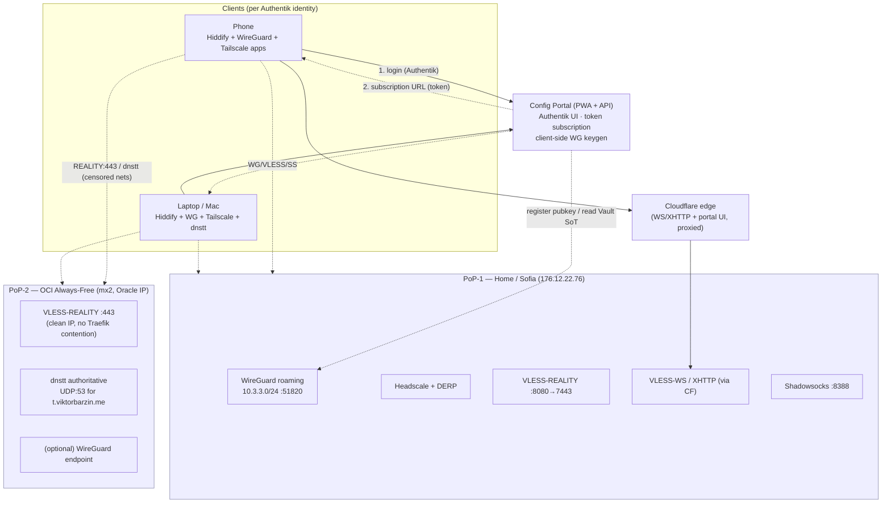
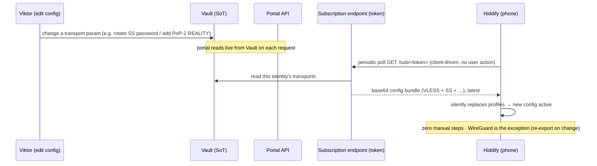
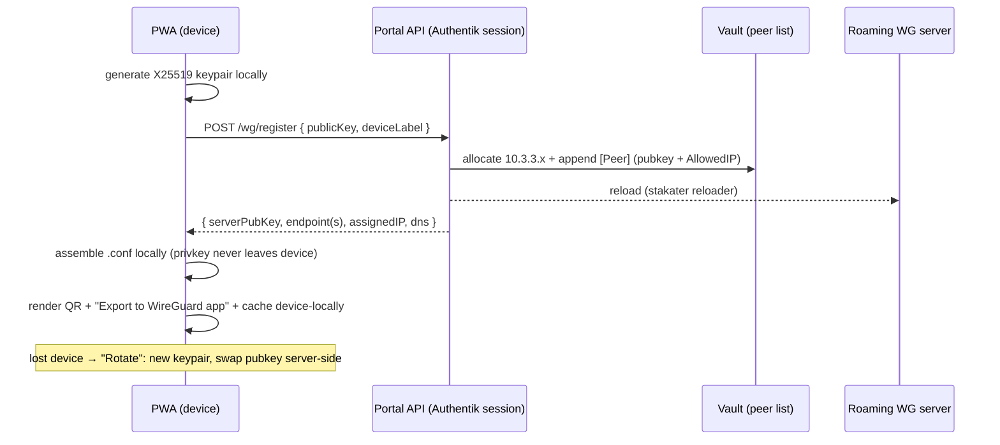
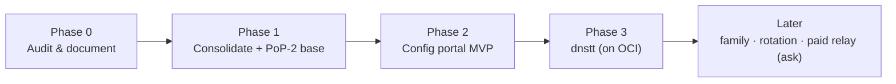

# VPN Consolidation, Multi-PoP Hardening & Config Portal — Design

**Status:** Draft (grilled) · **Date:** 2026-07-13 · **Owner:** Viktor (wizard) · **Owning repo:** `infra`

> Produced via `/grill-with-docs`. This is a **design** to be executed in later sessions,
> not a change log of applied work. Supersedes the VPN sections of the stale
> [`docs/architecture/vpn.md`](../architecture/vpn.md) (rewrite is Phase 0).

---

## 1. Goal

Turn a scattered, partly-stale, single-endpoint VPN estate into a **coherent, documented, multi-endpoint anti-censorship system** where:

- Every personal device (laptop + phone; family later) can connect over **every relevant transport**, and
- Every client config is **retrievable and auto-updating from one phone-friendly place** — change a config once, centrally, and clients pick it up with **zero manual reconfiguration**, and
- **No transport depends solely on the home IP *or* Cloudflare** — a second, free point-of-presence diversifies egress, and
- The missing "hard" transport for DNS-only/captive networks (**dnstt**) exists.

All of this stays **zero new recurring cost** (self-hosted + Oracle Always-Free).

### Explicit non-goals (this design)

- No commercial VPN provider (Mullvad/Proton/Nord) — "provider" here means a self-hosted PoP+transport.
- **WhatsApp tunnelling — dropped.** The only PoC (`wa-tunnel`) needs two reverse-engineered WhatsApp accounts, warns of bans, and has unusable throughput; the Business Cloud API is paid-per-conversation (fails zero-cost) and template-shaped. The real need ("smuggle a tunnel through what the network allows") is met better by CDN-fronted VLESS + dnstt.
- **Cloudflare Workers VLESS — dropped** (see §4, D3): blocked for new deploys (error 1101 since Nov 2024), ToS-adverse on the account that fronts the whole homelab, competes for the free zone Worker quota with the `outage-failover` safety net, and is China-useless.
- **ptunnel-ng / Snowflake / MTProto — out of scope** (laptop-only / Tor-only / Telegram-only respectively; low payoff for a phone-first goal).

---

## 2. Ubiquitous language (glossary)

| Term | Meaning in this project |
|---|---|
| **Transport** | A wire protocol that carries a tunnel: WireGuard (roaming), Tailscale/Headscale, VLESS-REALITY, VLESS-WS, VLESS-XHTTP, Shadowsocks, dnstt. |
| **PoP** (Point of Presence) | A public endpoint that terminates transports. **PoP-1 = Home/Sofia** (`176.12.22.76`). **PoP-2 = OCI Always-Free** (`mx2`, Oracle public IP). |
| **Portal** | The Authentik-gated PWA **+** its backend API that distributes configs. It is **not** a tunnel — it is a config hub (a PWA cannot run a VPN on iOS/Android). |
| **Subscription** | A per-user, **token-authed** URL that proxy clients (Hiddify/v2rayN/NekoBox/Shadowrocket) poll on their own to **auto-update** their configs. The mechanism that delivers "change once, clients follow." |
| **Profile / Config** | One client-side artifact for one transport on one device: a WG `.conf`, a `vless://`/`ss://` URI, or a dnstt client invocation. |
| **Provider** | A self-hosted (PoP × transport) combination. No external paid providers. |
| **Site vs Roaming** | *Site* = a fixed location's router on the pfSense hub-and-spoke (`10.3.2.0/24`, `:51821`). *Roaming* = a personal device on the k8s WireGuard server (**`10.3.3.0/24` going forward**, `:51820`). |
| **Identity** | An Authentik user. Configs are **keyed to identity** (multi-user-ready); MVP serves only `vbarzin`. |

A `CONTEXT.md` glossary will be created in the portal repo when it is scaffolded (Phase 2).

---

## 3. Current state — as-built (corrected 2026-07-13)

Verified live against the repo, cluster, Vault (field existence only), and DNS by two independent reviewers. **`docs/architecture/vpn.md` (dated 2026-04-10) is materially stale** and documents only ~half of this.

### 3.1 Inventory

| Transport / service | State | Client-facing | Where it terminates | Config today |
|---|---|---|---|---|
| **WireGuard — site-to-site** (pfSense hub `10.3.2.0/24`, `:51821`) | Live | No — links Sofia/London/Valchedrym/mx2 routers | PoP-1 (pfSense kernel `wg`) | pfSense + Vault `secret/platform` |
| **WireGuard — roaming server** (`sclevine/wg`, iface `10.3.0.1/16`, LB `10.0.20.200:51820`) | Live | **Yes** | PoP-1 | Server in Vault `secret/platform` (`wireguard_wg_0_conf`/`_key`/`_firewall_sh`); peers **split** Vault + git `clients.conf` |
| **Headscale / Tailscale** (v**0.28.0**, embedded DERP region 999) | Live | **Yes** — 4 users / 7 nodes | PoP-1 + DERP via CF | Vault `secret/platform` (`headscale_config`/`_acl`/`_derp_map`/…) rendered into a **plain ConfigMap** |
| **xray VLESS — REALITY** (internal **`7443`**; external `8080` via pfSense NAT — *inferred*) | Live | **Yes** — **1** client id | PoP-1 (raw TCP, `.200:7443`) | Vault `secret/platform` (`xray_reality_*`) |
| **xray VLESS — WS** (`/ws`) & **XHTTP** (`/grpc-vpn`) | Live | **Yes** | CF-proxied → Traefik | same |
| **Shadowsocks** (chacha20-ietf-poly1305, WAN `8388`) | Live | **Yes** — **single shared** password | PoP-1 | Vault `secret/shadowsocks` |
| **coturn** (STUN/TURN `3478`) | Live | Indirect (Headscale DERP STUN) | PoP-1 | Vault `secret/coturn` |
| **tor-proxy** (`dperson/torproxy`) | Live | No — cluster-internal egress only (+ unrelated TorrServer) | in-cluster | — |
| **DNS tunnel** (dnstt/iodine/dns2tcp) | **Not deployed** | — | — | orphaned `~/code/.dns2tcpdrc` only |

### 3.2 Corrections to prior beliefs (findings)

1. **REALITY is on `7443` internally**, not 8080 (8080 is Headscale's `listen_addr`). External `8080→7443` NAT lives only on pfSense → **inferred, not repo-verified**. REALITY is the **only** non-Cloudflare xray transport.
2. **`vpn.md` Vault paths are dead.** `secret/pfsense/wg_privkey_*` and `secret/headscale/oidc_client_secret` **do not exist**; real key material is fields in `secret/platform`. → "we already store client private keys in Vault" was **false** (Vault holds *server/site* keys only). It also claims Headscale `0.23.x` + `allowed_groups:["Headscale Users"]`; live is **`0.28.0` + `oidc.allowed_users`** (gmail allowlist), and references a decommissioned `stacks/adguard` + 3 non-existent runbooks.
3. **Roaming WG has ~19 peers** across `10.3.2.x / 10.3.3.x / 10.3.4.x` (mostly in Vault, not the git `clients.conf`), incl. stale ones ("iPhone 11 Pro", "Test"). The `10.3.2.x` numbers **collide** with the site-to-site tunnel-link IPs — **latent, not a live bug** (separate hosts + the pod MASQUERADEs), but it breaks the narrow case of a roaming client trying to reach a site tunnel-link IP, and it's a maintainability hazard.
4. **The WG config chatbot is broken** and served at **`webhook.viktorbarzin.me`** (not `wg.`, which has no ingress). `cli/vpn.go` writes to an old `github.com/ViktorBarzin/infra` path (`/modules/kubernetes/wireguard/extra/…`) that no longer exists; the live files are `stacks/wireguard/modules/wireguard/extra/…`, and IP allocation fails on an `Open()`-without-`O_CREATE` before anything runs.
5. **Nothing distributable is stored** anywhere — no `.conf`-with-private-key, `vless://`/`ss://` URIs, or QR images; Vaultwarden is not used for VPN configs (no infra evidence). So "store all configs" is **net-new**.
6. **DNS tunnel is dead**: `.dns2tcpdrc` (an old **dns2tcp** rc for SSH-over-DNS to `rp.viktorbarzin.me`) is orphaned; `rp.viktorbarzin.me` is **not delegated** (it only "resolves" because of the `*` wildcard CNAME).
7. **Hygiene:** Headscale's OIDC `client_secret` is rendered into a plain **ConfigMap**, not a Secret.

---

## 4. Decisions (grilled 2026-07-13)

Each is a settled decision from the interview; **D1–D8** are the forward design, **D-R1–D-R3** are adversarial-review reversals, **D9** is the OCI addition.

| # | Decision | Rationale |
|---|---|---|
| **D1** | **Scope** = consolidate existing + build config portal + build dnstt. | Directly serves "all clients connected + all configs stored," plus the one named gap that isn't live. |
| **D2** | **Delivery** = offline **Svelte PWA** (Authentik-gated) with one-click "export to native app" deep-links + QR + downloadable WG/Tailscale profiles. | A PWA can't tunnel on iOS/Android; its correct role is distribution + hand-off. |
| **D3** | **Config source** = **live pull + subscription URLs**. | Subscription is the only mechanism that silently auto-updates proxy clients on a central change. |
| **D4** | **Users** = me now, **multi-user-ready** (configs keyed by Authentik identity). | Lowest effort now, no dead-end; family added later via an Authentik group. |
| **D5** | **Storage SoT** = **Vault** for server params + per-device **public** keys / identities; portal regenerates non-secret material on demand. | Smallest secret surface; Vault already has encryption + daily backups. |
| **D6** | **Auth** = **Authentik** for the human PWA UI + **per-user rotatable token** for the machine subscription/config API. | Client apps can't do OIDC; a token is the only consumable machine credential, and it's one-click revocable. |
| **D7** | **REALITY at home stays on 8080**; China path = existing CF-proxied VLESS-XHTTP/WS (443) + PoP-2 (see D9). | Moving home REALITY to 443 means an SNI-splitter in front of *all* web ingress — disproportionate blast radius. |
| **D8** | **Phasing** = 0 audit/doc → 1 consolidate → **2 portal MVP** → 3 dnstt. | Portal is the core pain; every new transport plugs into it, so it's live and distributing before the exotic tunnels land. |
| **D-R1** | **Drop Cloudflare Workers VLESS.** | Error 1101 on new deploys (Nov-2024+); ToS-adverse on the homelab's CF account; burns the shared free Worker quota that the `outage-failover` worker depends on; `workers.dev` DNS-blocked in China. |
| **D-R2** | **WireGuard = client-side keygen** (device makes the keypair; portal stores only the **public** key; "rotate" replaces "reprint"). | Server-side custody would make the new internet-facing portal a single point of *total* VPN compromise; contradicts the estate's own Headscale (client-side) precedent. |
| **D-R3** | **The distribution plane must be at least as censorship-resistant as the transports it distributes.** Subscription reachable via a direct/grey-cloud path + **out-of-band QR bootstrap**, not Cloudflare-only. | A CF-proxied-only portal collapses in China exactly when needed, and the offline cache only helps *after* a successful first load. |
| **D9** | **Add PoP-2 = the OCI Always-Free VM (`mx2`)** as a second endpoint for REALITY (on **443** there), dnstt, and optionally WireGuard. | A public IP that is neither the home IP nor Cloudflare — genuine egress diversification at **zero cost**; OCI's controllable firewall gives clean inbound `443/tcp` + `53/udp`. |

---

## 5. Target architecture

### 5.1 Multi-PoP topology

### 5.2 Config auto-update flow (the "change once, clients follow" path)

### 5.3 WireGuard client-side keygen + registration

---

## 6. Component designs

### 6.1 Config portal

- **Stack:** new first-party repo (Svelte + a small backend), deployed as an infra stack behind `ingress_factory`. Off-infra CI → ghcr per ADR-0002.
- **Two routes, mixed auth on one backend** (pattern already live in `stacks/xray`: `auth="required"` on `/` + a second `ingress_factory` with `auth="none"` + a token-checking middleware on a sub-path):
  - `/` — **Authentik-gated** PWA UI (SSO + MFA + per-identity audit).
  - `/sub/<token>` and `/api/*` — **token-authed** machine endpoints (subscription poll + WG pubkey registration).
- **PWA:** installable, offline-capable (service-worker caches the last good bundle + assembled configs). Renders per-transport: one-click deep-link into the native app, QR, and downloadable `.conf`/profile.
- **Client-side WG keygen** (D-R2): X25519 keypair in-browser (WASM/JS); only the public key is POSTed; private key stays device-local (cached in the PWA store for on-device reprint). "Rotate" issues a fresh keypair.
- **Subscription content:** per-identity base64 bundle of the proxy transports (VLESS-REALITY on **both** PoPs, VLESS-WS, VLESS-XHTTP, Shadowsocks) in the standard subscription format Hiddify/v2rayN/NekoBox consume. WireGuard + Tailscale are delivered as profiles/deep-links (no subscription mechanism in their apps).
- **Recommended client apps** (deep-link targets): **Hiddify** as the primary multi-protocol + subscription client on iOS/Android/macOS; official **WireGuard** app for WG; **Tailscale** app for Headscale. V2BOX/OneXRay remain compatible.
- **Reachability (D-R3):** UI + subscription served so they survive censorship — a grey-cloud/direct host (or served *through* a working REALITY/dnstt tunnel), plus **QR bootstrap at enrolment** so the first config never depends on reaching the portal from inside a firewall. The offline cache is a UX nicety, not the resilience mechanism.

### 6.2 PoP-2 — OCI Always-Free (`mx2`)

- **Why:** a public IP that is neither the home IP nor Cloudflare, at zero cost; already on the WG tunnel + Headscale (ADR-0019).
- **Adds:** VLESS-**REALITY on `:443`** (clean — no Traefik contention on OCI, so the China-grade 443 camouflage we declined at home happens here for free); a **dnstt** authoritative server (§6.3); optionally a WireGuard endpoint so roaming clients can pick the Oracle egress.
- **Delivery:** all of it as **cloud-init / IaC** so a cattle-rebuild re-provisions it (the VM re-enrols itself today; VPN config must survive the same way). Runs alongside the existing Postfix backup-MX role.
- **Verify in execution:** instance shape/RAM headroom for xray + dnstt containers; Oracle **security-list** rules for inbound `443/tcp` + `53/udp`; egress (Oracle blocks TCP 25 only; 10 TB/mo free egress is ample).

### 6.3 dnstt (DNS tunnel)

- **Tool:** `dnstt` (not dns2tcp/iodine) — encrypted + authenticated (server public key), KCP/smux session layer, runs over UDP:53 **and** DoH/DoT; proven in Iran's Feb-2026 shutdown; the only DNS-class tunnel with a viable iOS story (DoH fits a Packet Tunnel Provider).
- **Placement:** **on PoP-2 (OCI)** — clean, controllable inbound UDP:53, sidestepping the home ISP's possibly-blocked inbound :53 (a reviewer-flagged risk).
- **Delegation:** add `t.viktorbarzin.me` **NS** → `tns.viktorbarzin.me` + **grey-cloud** glue `A` → OCI IP in the Cloudflare zone (2 records; zone at ~87/200). The delegated NS/glue **cannot** be CF-proxied.
- **Note:** "over DoH" does **not** remove the need for the authoritative UDP:53 server — DoH only encrypts the client→recursive-resolver hop; the recursive resolver still reaches the dnstt server over UDP:53. In China, dnstt-over-**UDP:53-direct** may beat DoH (DoH endpoints are actively poisoned) — offer both client modes.
- **Mobile reality:** dnstt has an iOS/Android story via a TUN app; raw-ICMP tunnels (ptunnel-ng) do not (out of scope, D1 non-goals).

### 6.4 Consolidation & cleanup (Phase 1 + Phase 0 doc)

- **Vault becomes the clean SoT:** server params + per-device **public** keys + per-identity token; define the subscription-generation inputs.
- **Prune** stale roaming WG peers (verify live handshakes first); **reconcile addressing** — roaming peers all on **`10.3.3.0/24`**, leaving `10.3.2.0/24` exclusively to the site-to-site tunnel, removing the collision.
- **Retire** the broken chatbot path (`cli/vpn.go`) — the portal's `/wg/register` supersedes it — and remove `~/code/.dns2tcpdrc`.
- **Rewrite `docs/architecture/vpn.md`** as-built (add roaming WG server, xray, shadowsocks, tor, coturn, PoP-2, portal, dnstt; fix Headscale 0.28.0/`allowed_users`; fix dead Vault paths + runbook links; document the two WG endpoints `:51820` roaming vs `:51821` site). Move Headscale OIDC secret from ConfigMap to a Secret.

---

## 7. Threat model & honest limitations

- **The core SPOF:** every transport lands on **one of two shared dependencies** — the single home WAN IP (`176.12.22.76`) or Cloudflare. China/RKN can enumerate and null-route a residential IP, and throttle CF's free anycast under one apex SNI. **PoP-2 (OCI) is the mitigation** — a third, independent network path — but it is still a *single* extra IP, not a rotating pool.
- **WireGuard is DPI-detectable** and effectively dead from China regardless of IP; it is the LAN/roaming-convenience transport, not a censorship transport.
- **REALITY on one IP** dies the moment that IP is blocked; having it on **both** PoP-1 (`:8080`) and PoP-2 (`:443`) means two IPs must be blocked, not one.
- **Load-bearing assumption to test before relying on it:** that Cloudflare's free tier (and OCI's IP) is actually reachable from inside China. Verify with external China-vantage tooling in Phase 0; do not assume.
- **Documented future option (needs explicit spend approval):** if the free PoPs prove insufficient, a low-cost **in-region VPS** as a rotating REALITY/dnstt front is the next lever — quoted for sign-off, never bought silently (zero-cost rule).

---

## 8. Security posture

- **Auth boundary:** Authentik (human UI) vs per-user token (machine subscription). A leaked token → revoke/rotate one-click; blast radius = that one identity's configs until rotation.
- **Key custody:** WG private keys **never** on the server (D-R2). xray UUIDs / SS password / dnstt server key remain in Vault as today.
- **Distribution plane** is censorship-resistant by construction (D-R3), not CF-only.
- **Hygiene fix:** Headscale OIDC secret → K8s Secret (not ConfigMap).
- **No new WAN exposure without an out-of-band ask:** the dnstt UDP:53 path is on OCI's firewall (self-owned), *not* a new pfSense WAN rule — avoiding the out-of-band-prod-config ask entirely.

---

## 9. Phased plan

**Phase 0 — Audit & document.** Verify every transport live (Headscale nodes, roaming WG handshakes, xray 3 transports E2E, SS, coturn); enumerate Viktor's *real* devices vs stale peers; run the China-reachability probe; rewrite `vpn.md`; retire `.dns2tcpdrc`. *(This grilled doc is the first artifact.)*

**Phase 1 — Consolidate backend + PoP-2 base.** Vault SoT (server params + per-device pubkeys + per-identity token, keyed by Authentik identity); prune stale peers; move roaming peers onto `10.3.3.0/24`; provision **PoP-2 on OCI** via cloud-init (REALITY:443 + WG endpoint); define subscription-generation inputs.

**Phase 2 — Config portal MVP.** Svelte PWA (Authentik) + token subscription/registration API; client-side WG keygen; one-click deep-links/QR + WG/Tailscale profiles; connect Viktor's Mac + phone to **all** existing transports across **both** PoPs; retire the broken chatbot.

**Phase 3 — dnstt.** Deploy dnstt on OCI; delegate `t.viktorbarzin.me`; add UDP:53 + DoH client modes to the portal/subscription.

**Later (out of MVP):** family self-serve (Authentik group); REALITY SNI-split at home *only if* China blocking is observed; rotation pool / paid in-region relay (explicit approval).

---

## 10. Open items — verify in execution

- OCI `mx2` instance shape/RAM headroom for xray + dnstt; Oracle security-list rules for `443/tcp` + `53/udp`; confirm the Oracle public IP.
- China/Iran reachability of CF free tier **and** the OCI IP (external-vantage test) — the load-bearing assumption.
- Confirm the Cloudflare zone accepts the `t.` NS + grey-cloud glue within the 200-record cap.
- Portal repo scaffold: Svelte + backend choice; `ingress_factory` mixed-auth wiring; subscription format compatibility across Hiddify/v2rayN/NekoBox/Shadowrocket.
- Decide device-local WG private-key persistence UX in the PWA (cache for reprint vs show-once).

## 11. Zero-cost confirmation

All components are self-hosted or Oracle **Always-Free**. No new subscriptions, paid APIs, or paid cloud resources. The only path that would incur cost — a rotating in-region relay — is explicitly deferred behind a spend approval (§7).
